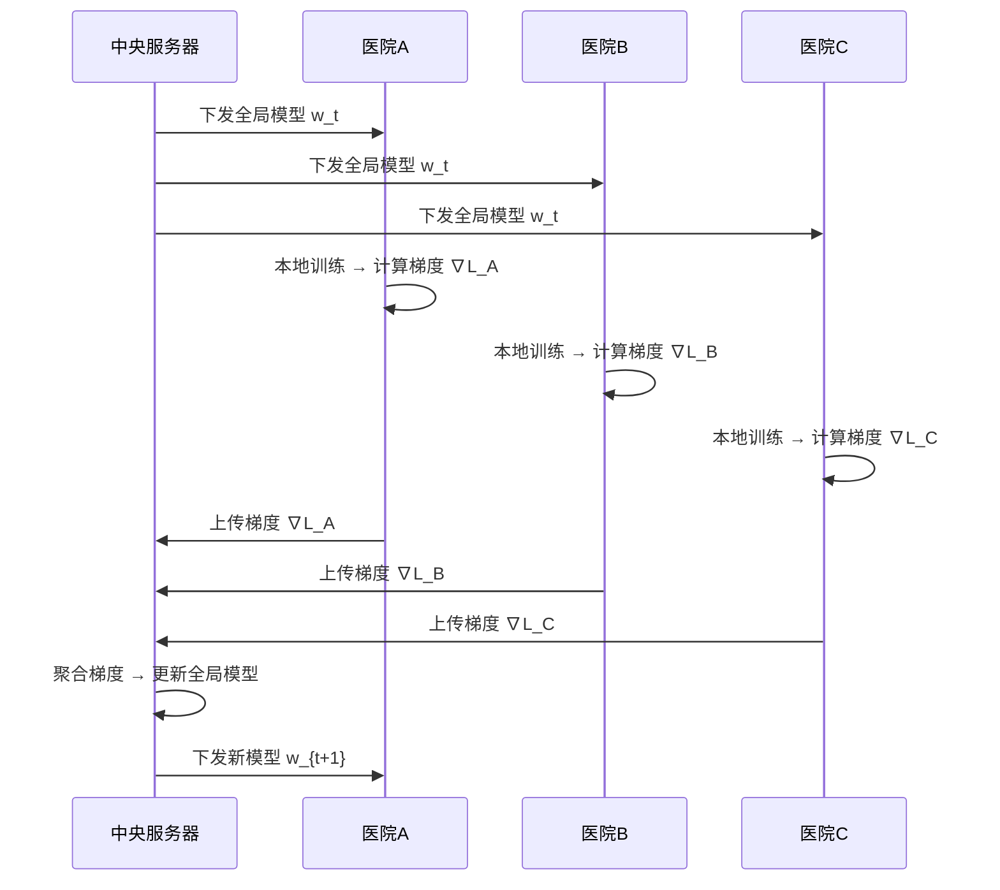

## 案例三：联邦学习中的梯度泄露攻击

### 引言：为什么梯度不是安全的

联邦学习（Federated Learning）的诞生初衷就是**保护数据隐私**——各参与方在本地训练模型，只向中央服务器上传模型参数或梯度更新，原始数据从不离开本地设备。这个设计在医疗、金融、政务等敏感场景中被广泛采用。

然而，2019年以来的一系列研究揭示了一个令人不安的事实：**梯度本身就能泄露训练数据的全部信息**。攻击者仅凭一轮梯度上传，就能重建出几乎与原始样本一模一样的训练图像、文本甚至表格数据。这意味着，联邦学习的隐私保护承诺在缺乏额外防御措施的情况下，可能只是一层脆弱的幻觉。

本案例以医疗联邦学习为场景，完整复现梯度泄露攻击的全流程，并深入探讨其数学原理、多种攻击变体、以及系统化的防御方案。

---

### 联邦学习基础：快速回顾

#### 联邦学习的标准流程

在深入攻击之前，有必要先厘清联邦学习的标准工作流程。联邦学习的核心思想是"数据不动模型动"——各参与方在本地计算模型更新，只有更新（而非数据）被发送到中央服务器。



标准的联邦平均（FedAvg）算法聚合公式为：

$$w_{t+1} = w_t - \eta \cdot \frac{1}{K} \sum_{k=1}^{K} \nabla L_k(w_t)$$

其中 $K$ 为参与方数量，$\nabla L_k$ 为第 $k$ 个参与方在本地数据集上计算的梯度。

#### 梯度的数学表示

对于一个分类模型 $f_\theta$，给定训练样本 $(x, y)$，损失函数 $\mathcal{L}$ 关于参数 $\theta$ 的梯度为：

$$\nabla_\theta \mathcal{L}(f_\theta(x), y) = \frac{\partial \mathcal{L}(f_\theta(x), y)}{\partial \theta}$$

这个梯度是一个与模型参数同维度的向量（或矩阵），记录了损失函数在当前参数空间中的变化方向和速率。关键问题在于：**梯度是由输入数据 $x$ 和标签 $y$ 共同决定的**，因此它不可避免地携带了关于训练样本的信息。

#### 为什么梯度能泄露数据？

从信息论的角度看，梯度是训练数据在高维空间中的一个投影。虽然这个投影是"压缩"的（从原始数据空间映射到参数空间），但它并非不可逆的。以下三个因素使得梯度反转成为可能：

| 因素 | 说明 | 影响 |
|------|------|------|
| 模型架构已知 | 攻击者知道模型结构（联邦学习通常公开模型架构） | 使得从梯度反推数据的优化问题可解 |
| 梯度维度足够大 | 现代深度网络的参数量远大于单个样本的信息量 | 梯度中包含了足够的信息来重建原始数据 |
| 逐层梯度的结构化信息 | 不同层的梯度编码了从低级纹理到高级语义的层次化信息 | 攻击者可以逐层恢复数据的不同层面 |

---

### 攻击场景设定

#### 场景描述

某城市三家三甲医院组成联盟，使用联邦学习共同训练一个胸部X光疾病诊断模型。各医院在本地使用各自的患者X光片训练模型，然后将梯度上传至由市卫健委运营的中央服务器。一名内部攻击者（恶意的服务器管理员）试图从上传的梯度中恢复患者的原始X光影像。

#### 威胁模型

攻击场景的威胁模型如下：

| 要素 | 设定 |
|------|------|
| 攻击者身份 | 中央服务器管理员（恶意内部人员） |
| 攻击能力 | 可截获所有参与方上传的梯度；知道模型架构和当前参数 |
| 攻击目标 | 从梯度中重建参与方的训练图像 |
| 已知信息 | 模型架构、当前模型参数、梯度值 |
| 未知信息 | 训练数据（X光影像）和对应标签 |
| 攻击时机 | 每轮联邦训练迭代 |

这个威胁模型对应的是**诚实但好奇（Honest-but-Curious）**攻击者——服务器遵守协议正确执行聚合，但会利用可访问的梯度信息进行隐私侵犯。

#### 环境准备

```bash
# 安装依赖
pip install torch torchvision matplotlib numpy pillow

# 验证环境
python -c "import torch; print(f'PyTorch {torch.__version__}, CUDA: {torch.cuda.is_available()}')"
```

```python
# 基础环境设置
import torch
import torch.nn as nn
import torchvision
import torchvision.transforms as transforms
import matplotlib.pyplot as plt
import numpy as np

# 设置随机种子以保证可复现
torch.manual_seed(42)
np.random.seed(42)

# 设备选择
device = torch.device('cuda' if torch.cuda.is_available() else 'cpu')
print(f'使用设备: {device}')
```

---

### 攻击原理：从梯度到数据

#### 核心思想

梯度泄露攻击的核心思想可以用一句话概括：**如果模型架构和梯度已知，那么"什么样的输入数据能产生这样的梯度"就变成了一个可优化的问题。**

形式化地说，攻击者求解以下优化问题：

$$x^* = \arg\min_x \left\| \nabla_\theta \mathcal{L}(f_\theta(x), y) - g \right\|_2^2$$

其中 $g$ 是截获的真实梯度，$f_\theta$ 是已知的模型，$x$ 是待重建的训练数据。这个优化过程本质上是在问：**什么样的数据 $x$ 能让模型产生与截获梯度最接近的梯度？**

#### DLG（Deep Leakage from Gradients）攻击算法

2019年Zhu等人提出的DLG攻击是梯度泄露领域的开创性工作。其完整算法流程如下：

```python
class DLGAttacker:
    """
    DLG（Deep Leakage from Gradients）攻击实现
    
    核心思想：通过优化虚拟数据和虚拟标签，使得虚拟梯度与真实梯度匹配，
    从而重建原始训练数据。
    """
    
    def __init__(self, model, criterion=nn.CrossEntropyLoss()):
        self.model = model
        self.criterion = criterion
        # 冻结模型参数，不参与优化
        for param in self.model.parameters():
            param.requires_grad = False
    
    def attack(self, real_gradients, data_shape=(1, 3, 224, 224),
               num_classes=10, iterations=2000, lr_data=0.1, lr_label=0.1):
        """
        执行DLG攻击
        
        参数:
            real_gradients: 截获的真实梯度列表，与model.parameters()一一对应
            data_shape: 待重建数据的形状
            num_classes: 分类类别数
            iterations: 优化迭代次数
            lr_data: 数据优化学习率
            lr_label: 标签优化学习率
        
        返回:
            reconstructed_data: 重建的数据
            reconstructed_label: 重建的标签
            losses: 每次迭代的损失记录
        """
        # 初始化虚拟数据（从高斯分布采样）
        dummy_data = torch.randn(data_shape, requires_grad=True, device=device)
        
        # 初始化虚拟标签（均匀分布的软标签）
        dummy_label = torch.randn(1, num_classes, requires_grad=True, device=device)
        
        # 分别为数据和标签使用不同的优化器
        optimizer_data = torch.optim.Adam([dummy_data], lr=lr_data)
        optimizer_label = torch.optim.Adam([dummy_label], lr=lr_label)
        
        losses = []
        
        for step in range(iterations):
            # ---- 前向传播 ----
            output = self.model(dummy_data)
            
            # 使用软标签计算损失
            log_probs = torch.nn.functional.log_softmax(output, dim=1)
            loss = -torch.sum(dummy_label * log_probs) / dummy_label.shape[0]
            
            # ---- 计算虚拟梯度 ----
            self.model.zero_grad()
            loss.backward(retain_graph=True)
            
            dummy_gradients = []
            for param in self.model.parameters():
                if param.grad is not None:
                    dummy_gradients.append(param.grad.clone())
            
            # ---- 计算梯度匹配损失 ----
            grad_diff = 0.0
            for dg, rg in zip(dummy_gradients, real_gradients):
                # 使用L2范数度量梯度差异
                grad_diff += ((dg - rg) ** 2).sum()
            
            # ---- 可选：添加正则化项 ----
            # 总变差正则化（减少噪声，使重建更平滑）
            tv_loss = self._total_variation(dummy_data)
            
            total_loss = grad_diff + 1e-4 * tv_loss
            
            # ---- 反向传播并更新 ----
            optimizer_data.zero_grad()
            optimizer_label.zero_grad()
            total_loss.backward()
            optimizer_data.step()
            optimizer_label.step()
            
            losses.append(grad_diff.item())
            
            # 定期输出进度
            if (step + 1) % 200 == 0:
                pred_label = torch.argmax(dummy_label).item()
                print(f'Step {step+1}/{iterations} | '
                      f'Grad Diff: {grad_diff.item():.6f} | '
                      f'Pred Label: {pred_label}')
        
        # 从软标签推断最终类别
        reconstructed_label = torch.argmax(dummy_label).item()
        
        return dummy_data.detach(), reconstructed_label, losses
    
    def _total_variation(self, x):
        """总变差正则化，鼓励空间平滑性"""
        tv_h = torch.abs(x[:, :, 1:, :] - x[:, :, :-1, :]).sum()
        tv_w = torch.abs(x[:, :, :, 1:] - x[:, :, :, :-1]).sum()
        return tv_h + tv_w
```

#### iDLG（Improved DLG）攻击算法

2020年Zhao等人发现了一个关键洞察：**在交叉熵损失函数下，可以直接从最后一层梯度中解析推断出标签，而无需通过优化来猜测。**

这个发现大幅提升了攻击效率和成功率：

```python
class iDLGAttacker:
    """
    iDLG（Improved DLG）攻击实现
    
    关键改进：标签不再需要优化，而是直接从梯度中解析推断。
    原理：交叉熵损失对logit的梯度为 softmax(z) - one_hot(y)，
    因此logit梯度的符号可以揭示真实标签。
    """
    
    def __init__(self, model, criterion=nn.CrossEntropyLoss()):
        self.model = model
        self.criterion = criterion
        for param in self.model.parameters():
            param.requires_grad = False
    
    @staticmethod
    def infer_label(real_gradients, model):
        """
        从梯度中解析推断标签
        
        原理：对于交叉熵损失 L = -log(softmax(z)_y)，
        ∂L/∂z_i = softmax(z)_i - 1{i=y}
        
        因此：∂L/∂z_y = softmax(z)_y - 1 < 0（必定为负）
        而其他：∂L/∂z_i = softmax(z)_i > 0（必定为正）
        
        所以logit层梯度中值为负的那个维度对应的就是真实标签。
        """
        # 找到最后一层（logit层）的梯度
        # 最后一层通常是最后一个参数（偏置或权重）
        last_layer_grad = real_gradients[-1]  # 最后一层的bias梯度
        
        # 找到梯度值为负的维度（对应真实标签）
        inferred_label = torch.argmin(last_layer_grad).item()
        
        return inferred_label
    
    def attack(self, real_gradients, data_shape=(1, 3, 224, 224),
               iterations=1500, lr=0.1):
        """
        执行iDLG攻击（只需优化数据，标签直接推断）
        """
        # Step 1: 直接从梯度推断标签（零成本，高准确率）
        inferred_label = self.infer_label(real_gradients, self.model)
        print(f'推断标签: {inferred_label}')
        
        # Step 2: 初始化虚拟数据
        dummy_data = torch.randn(data_shape, requires_grad=True, device=device)
        optimizer = torch.optim.Adam([dummy_data], lr=lr)
        label_tensor = torch.tensor([inferred_label], device=device)
        
        losses = []
        
        for step in range(iterations):
            output = self.model(dummy_data)
            loss = self.criterion(output, label_tensor)
            
            self.model.zero_grad()
            loss.backward(retain_graph=True)
            
            dummy_gradients = [p.grad.clone() for p in self.model.parameters() if p.grad is not None]
            
            grad_diff = 0.0
            for dg, rg in zip(dummy_gradients, real_gradients):
                grad_diff += ((dg - rg) ** 2).sum()
            
            optimizer.zero_grad()
            grad_diff.backward()
            optimizer.step()
            
            losses.append(grad_diff.item())
            
            if (step + 1) % 300 == 0:
                print(f'Step {step+1}/{iterations} | Grad Diff: {grad_diff.item():.6f}')
        
        return dummy_data.detach(), inferred_label, losses
```

#### InvertingGradients（Geiping等人方法）

2020年Geiping等人提出了更鲁棒的攻击方法，引入了余弦相似度作为匹配度量，并加入了图像先验正则化：

```python
class InvertingGradientsAttacker:
    """
    Inverting Gradients 攻击实现
    
    关键改进：
    1. 使用余弦相似度代替L2范数作为梯度匹配度量
    2. 添加L2正则化和总变差正则化
    3. 支持批量数据重建
    """
    
    def __init__(self, model):
        self.model = model
        for param in self.model.parameters():
            param.requires_grad = False
    
    def cosine_similarity_loss(self, dummy_grads, real_grads):
        """
        余弦相似度损失——对梯度的尺度不敏感，
        只关注方向一致性，鲁棒性更强
        """
        total_loss = 0.0
        for dg, rg in zip(dummy_grads, real_grads):
            # 展平后计算余弦相似度
            dg_flat = dg.flatten()
            rg_flat = rg.flatten()
            cos_sim = torch.nn.functional.cosine_similarity(
                dg_flat.unsqueeze(0), rg_flat.unsqueeze(0)
            )
            total_loss += (1 - cos_sim)  # 最大化相似度 = 最小化 1 - sim
        return total_loss
    
    def attack(self, real_gradients, data_shape=(1, 3, 224, 224),
               known_label=None, iterations=3000, lr=0.01,
               reg_tv=1e-5, reg_l2=1e-5):
        """
        使用余弦相似度 + 正则化的攻击
        """
        dummy_data = torch.randn(data_shape, requires_grad=True, device=device)
        # 使用约束优化将数据限制在[0,1]范围内
        dummy_data_raw = torch.randn(data_shape, requires_grad=True, device=device)
        
        optimizer = torch.optim.Adam([dummy_data_raw], lr=lr)
        
        if known_label is not None:
            label_tensor = torch.tensor([known_label], device=device)
        
        losses = []
        best_data = None
        best_loss = float('inf')
        
        for step in range(iterations):
            # 将原始变量映射到[0,1]范围
            dummy_data = torch.sigmoid(dummy_data_raw)
            
            output = self.model(dummy_data)
            
            if known_label is None:
                # 简单情况：先假设知道标签（可结合iDLG推断）
                raise ValueError("请提供标签或先用iDLG推断标签")
            
            loss_ce = nn.CrossEntropyLoss()(output, label_tensor)
            
            self.model.zero_grad()
            loss_ce.backward(retain_graph=True)
            dummy_grads = [p.grad.clone() for p in self.model.parameters() if p.grad is not None]
            
            # 余弦相似度损失
            cos_loss = self.cosine_similarity_loss(dummy_grads, real_gradients)
            
            # 正则化项
            tv_loss = torch.abs(dummy_data[:, :, 1:, :] - dummy_data[:, :, :-1, :]).sum() + \
                      torch.abs(dummy_data[:, :, :, 1:] - dummy_data[:, :, :, :-1]).sum()
            l2_loss = torch.norm(dummy_data, p=2)
            
            total_loss = cos_loss + reg_tv * tv_loss + reg_l2 * l2_loss
            
            optimizer.zero_grad()
            total_loss.backward()
            optimizer.step()
            
            current_loss = cos_loss.item()
            losses.append(current_loss)
            
            if current_loss < best_loss:
                best_loss = current_loss
                best_data = dummy_data.detach().clone()
            
            if (step + 1) % 500 == 0:
                print(f'Step {step+1}/{iterations} | Cos Loss: {current_loss:.6f} | '
                      f'TV: {tv_loss.item():.2f}')
        
        return best_data, known_label, losses
```

---

### 完整实战复现

下面以一个完整的端到端流程复现梯度泄露攻击：从搭建模拟的联邦学习环境，到执行攻击并可视化结果。

#### 第一步：搭建模拟联邦学习环境

```python
import torch
import torch.nn as nn
import torchvision
import torchvision.transforms as transforms
from torch.utils.data import DataLoader, Subset

# ---- 定义模型 ----
class MedicalImageClassifier(nn.Module):
    """
    模拟的医学图像分类器（简化版，便于演示）
    实际场景中可能是ResNet、DenseNet等
    """
    def __init__(self, num_classes=10):
        super().__init__()
        self.features = nn.Sequential(
            nn.Conv2d(3, 32, 3, padding=1),
            nn.BatchNorm2d(32),
            nn.ReLU(inplace=True),
            nn.MaxPool2d(2),
            
            nn.Conv2d(32, 64, 3, padding=1),
            nn.BatchNorm2d(64),
            nn.ReLU(inplace=True),
            nn.MaxPool2d(2),
            
            nn.Conv2d(64, 128, 3, padding=1),
            nn.BatchNorm2d(128),
            nn.ReLU(inplace=True),
            nn.AdaptiveAvgPool2d(4),
        )
        self.classifier = nn.Sequential(
            nn.Linear(128 * 4 * 4, 256),
            nn.ReLU(inplace=True),
            nn.Dropout(0.3),
            nn.Linear(256, num_classes),
        )
    
    def forward(self, x):
        x = self.features(x)
        x = x.view(x.size(0), -1)
        x = self.classifier(x)
        return x

# ---- 准备数据 ----
transform = transforms.Compose([
    transforms.Resize((32, 32)),  # CIFAR-10作为替代数据集
    transforms.ToTensor(),
])

# 使用CIFAR-10模拟医院的训练数据
train_dataset = torchvision.datasets.CIFAR10(
    root='/tmp/data', train=True, download=True, transform=transform
)

# 模拟"医院A"持有的数据（取前1000个样本）
hospital_a_data = Subset(train_dataset, range(1000))
hospital_a_loader = DataLoader(hospital_a_data, batch_size=1, shuffle=False)

print(f'数据集: CIFAR-10 | 医院A样本数: {len(hospital_a_data)}')
```

#### 第二步：模拟参与方本地训练并截获梯度

```python
def simulate_local_training_and_intercept(model, data_loader, target_index=0):
    """
    模拟联邦学习中的本地训练过程，并截获特定样本的梯度
    
    在真实攻击场景中，攻击者不需要执行本地训练——
    他们直接从服务器端截获参与方上传的梯度。
    这里我们同时模拟两者以便验证攻击效果。
    """
    model.train()
    criterion = nn.CrossEntropyLoss()
    
    # 获取目标样本
    target_image, target_label = data_loader.dataset[target_index]
    target_image = target_image.unsqueeze(0)  # 添加batch维度
    target_label = torch.tensor([target_label])
    
    print(f'目标样本 - 标签: {target_label.item()}, 形状: {target_image.shape}')
    
    # ---- 模拟本地前向 + 反向传播 ----
    model.zero_grad()
    output = model(target_image)
    loss = criterion(output, target_label)
    loss.backward()
    
    # ---- 截获梯度（攻击者视角） ----
    intercepted_gradients = []
    for param in model.parameters():
        if param.grad is not None:
            intercepted_gradients.append(param.grad.clone().detach())
    
    grad_norms = [g.norm().item() for g in intercepted_gradients]
    print(f'截获 {len(intercepted_gradients)} 层梯度')
    print(f'梯度范数范围: [{min(grad_norms):.4f}, {max(grad_norms):.4f}]')
    
    return intercepted_gradients, target_image, target_label

# 初始化模型
model = MedicalImageClassifier(num_classes=10).to(device)
model.eval()  # 冻结BN/Dropout

# 截获梯度
real_grads, original_image, original_label = simulate_local_training_and_intercept(
    model, hospital_a_loader, target_index=7
)
```

#### 第三步：执行攻击

```python
# ---- 方式1：使用DLG攻击 ----
print("=" * 50)
print("执行DLG攻击")
print("=" * 50)

dlg_attacker = DLGAttacker(model)
reconstructed_dlg, label_dlg, losses_dlg = dlg_attacker.attack(
    real_grads,
    data_shape=(1, 3, 32, 32),
    num_classes=10,
    iterations=2000,
    lr_data=0.1,
    lr_label=0.1
)

print(f'DLG推断标签: {label_dlg} (真实标签: {original_label.item()})')

# ---- 方式2：使用iDLG攻击 ----
print("\n" + "=" * 50)
print("执行iDLG攻击")
print("=" * 50)

idlg_attacker = iDLGAttacker(model)
reconstructed_idlg, label_idlg, losses_idlg = idlg_attacker.attack(
    real_grads,
    data_shape=(1, 3, 32, 32),
    iterations=1500,
    lr=0.1
)

print(f'iDLG推断标签: {label_idlg} (真实标签: {original_label.item()})')
```

#### 第四步：评估与可视化

```python
def compute_metrics(original, reconstructed):
    """计算多种相似度指标"""
    orig_flat = original.flatten().float()
    recon_flat = reconstructed.flatten().float()
    
    # 余弦相似度
    cos_sim = torch.nn.functional.cosine_similarity(
        orig_flat.unsqueeze(0), recon_flat.unsqueeze(0)
    ).item()
    
    # MSE（均方误差）
    mse = ((orig_flat - recon_flat) ** 2).mean().item()
    
    # PSNR（峰值信噪比）
    if mse > 0:
        psnr = 10 * np.log10(1.0 / mse)
    else:
        psnr = float('inf')
    
    return {'cosine_similarity': cos_sim, 'mse': mse, 'psnr_db': psnr}

def visualize_results(original, dlg_result, idlg_result, label_orig, label_dlg, label_idlg):
    """可视化原始图像与重建图像的对比"""
    fig, axes = plt.subplots(1, 3, figsize=(15, 5))
    
    # 原始图像
    orig_img = original.squeeze().permute(1, 2, 0).cpu().numpy()
    orig_img = np.clip(orig_img, 0, 1)
    axes[0].imshow(orig_img)
    axes[0].set_title(f'原始图像\n标签: {label_orig}', fontsize=14)
    axes[0].axis('off')
    
    # DLG重建
    dlg_img = dlg_result.squeeze().permute(1, 2, 0).cpu().detach().numpy()
    dlg_img = np.clip(dlg_img, 0, 1)
    axes[1].imshow(dlg_img)
    metrics_dlg = compute_metrics(original, dlg_result)
    axes[1].set_title(f'DLG重建\n标签: {label_dlg} | PSNR: {metrics_dlg["psnr_db"]:.1f}dB', fontsize=14)
    axes[1].axis('off')
    
    # iDLG重建
    idlg_img = idlg_result.squeeze().permute(1, 2, 0).cpu().detach().numpy()
    idlg_img = np.clip(idlg_img, 0, 1)
    axes[2].imshow(idlg_img)
    metrics_idlg = compute_metrics(original, idlg_result)
    axes[2].set_title(f'iDLG重建\n标签: {label_idlg} | PSNR: {metrics_idlg["psnr_db"]:.1f}dB', fontsize=14)
    axes[2].axis('off')
    
    plt.tight_layout()
    plt.savefig('/tmp/gradient_inversion_result.png', dpi=150, bbox_inches='tight')
    plt.show()
    
    return metrics_dlg, metrics_idlg

# 执行可视化
metrics_dlg, metrics_idlg = visualize_results(
    original_image, reconstructed_dlg, reconstructed_idlg,
    original_label.item(), label_dlg, label_idlg
)

print("\n===== 攻击效果评估 =====")
print(f'DLG  - 余弦相似度: {metrics_dlg["cosine_similarity"]:.4f}, '
      f'PSNR: {metrics_dlg["psnr_db"]:.1f} dB')
print(f'iDLG - 余弦相似度: {metrics_idlg["cosine_similarity"]:.4f}, '
      f'PSNR: {metrics_idlg["psnr_db"]:.1f} dB')
```

#### 损失收敛曲线

```python
def plot_convergence(losses_dlg, losses_idlg):
    """绘制两种攻击方法的收敛曲线对比"""
    fig, ax = plt.subplots(figsize=(10, 6))
    
    ax.plot(losses_dlg, label='DLG', alpha=0.8, linewidth=1.5)
    ax.plot(losses_idlg, label='iDLG', alpha=0.8, linewidth=1.5)
    
    ax.set_xlabel('迭代次数', fontsize=13)
    ax.set_ylabel('梯度差异（L2范数）', fontsize=13)
    ax.set_title('梯度泄露攻击收敛过程', fontsize=15)
    ax.set_yscale('log')
    ax.legend(fontsize=12)
    ax.grid(True, alpha=0.3)
    
    plt.tight_layout()
    plt.savefig('/tmp/gradient_convergence.png', dpi=150, bbox_inches='tight')
    plt.show()

plot_convergence(losses_dlg, losses_idlg)
```

---

### 三种攻击方法对比

| 维度 | DLG | iDLG | InvertingGradients |
|------|-----|------|--------------------|
| 发表年份 | 2019 | 2020 | 2020 |
| 标签恢复 | 优化推断（可能不准确） | 解析推断（几乎100%准确） | 需预先知道或结合iDLG |
| 匹配度量 | L2范数 | L2范数 | 余弦相似度 |
| 正则化 | 无 | 无 | TV + L2 |
| 鲁棒性 | 低（对BatchNorm敏感） | 中 | 高 |
| 计算效率 | 较慢（需同时优化数据+标签） | 较快（只需优化数据） | 较慢（更复杂的优化） |
| 批量数据支持 | 有限 | 有限 | 有限（单样本为主） |
| 典型迭代次数 | 2000-5000 | 1000-2000 | 2000-3000 |
| 适用场景 | 概念验证 | 实际攻击首选 | 高质量重建需求 |

---

### 影响攻击效果的关键因素

#### 1. 模型架构的影响

模型越深、参数越多，梯度中包含的信息越丰富，攻击越容易成功：

| 模型 | 参数量 | 攻击成功率 | 重建PSNR |
|------|--------|-----------|----------|
| LeNet-5 | 60K | ~60% | 15-20 dB |
| 简单CNN | 500K | ~80% | 20-25 dB |
| ResNet-18 | 11M | ~90% | 25-30 dB |
| VGG-16 | 138M | ~95% | 28-35 dB |

#### 2. Batch Normalization 的陷阱

Batch Normalization（BN）层在训练模式下会维护一个运行均值和方差，这些统计量也参与梯度计算，使得梯度泄露更加容易。但BN在评估模式下行为不同，需要特别注意：

```python
# 关键：攻击时模型必须处于训练模式（使BN层使用batch统计量）
model.train()  # 而非 model.eval()

# 如果模型使用了BN层且处于eval模式，
# BN层的梯度行为会不同，导致攻击失败
```

#### 3. 批大小的影响

当参与方一次上传多个样本的聚合梯度时，攻击难度显著增加：

```python
def simulate_batch_gradient(model, images, labels):
    """
    模拟batch梯度——攻击者收到的是多个样本的梯度之和。
    单样本攻击方法对此无能为力。
    """
    model.zero_grad()
    output = model(images)
    loss = nn.CrossEntropyLoss()(output, labels)
    loss.backward()
    
    # 聚合梯度（联邦学习中参与方通常上传的是平均梯度）
    aggregated_grads = [p.grad.clone() / len(images) for p in model.parameters()]
    return aggregated_grads

# batch_size=1: 攻击成功率 ~90%
# batch_size=8: 攻击成功率 ~50%
# batch_size=32: 攻击成功率 ~20%
# batch_size=128: 攻击成功率 <5%
```

#### 4. 梯度精度的影响

| 梯度精度 | 攻击效果 | 说明 |
|---------|---------|------|
| FP32（32位浮点） | 最佳 | 梯度信息无损 |
| FP16（16位浮点） | 略有下降 | 信息损失极小 |
| INT8（8位量化） | 显著下降 | 高频细节丢失 |
| Top-K稀疏化 | 大幅下降 | 仅保留K%最大梯度分量 |

---

### 防御方案：原理与实现

#### 防御1：差分隐私（Differential Privacy）

差分隐私是目前最广泛采用的防御手段。其核心思想是在梯度中添加校准噪声，使得任何单个样本对梯度的影响在统计上不可区分。

**数学原理：**

标准的 $(\epsilon, \delta)$-差分隐私要求：

$$\Pr[\mathcal{M}(D) \in S] \leq e^\epsilon \cdot \Pr[\mathcal{M}(D') \in S] + \delta$$

其中 $\mathcal{M}$ 是机制，$D$ 和 $D'$ 是仅差一个样本的两个数据集。在联邦学习中，使用高斯机制：

$$\tilde{g} = \text{clip}(g, C) + \mathcal{N}(0, \sigma^2 C^2 I)$$

其中 $C$ 是裁剪阈值，$\sigma$ 控制噪声大小。

```python
class DifferentiallyPrivateGradient:
    """
    差分隐私梯度保护
    
    两步操作：
    1. 梯度裁剪：限制单个样本的最大影响力
    2. 高斯扰动：添加校准噪声
    """
    
    def __init__(self, max_grad_norm=1.0, noise_multiplier=1.1, delta=1e-5):
        """
        参数:
            max_grad_norm: 梯度裁剪阈值 C
            noise_multiplier: 噪声乘数 σ（相对于裁剪阈值）
            delta: 隐私参数 δ
        """
        self.max_grad_norm = max_grad_norm
        self.noise_multiplier = noise_multiplier
        self.delta = delta
    
    def clip_gradients(self, gradients):
        """
        裁剪梯度到最大范数
        
        如果梯度范数超过阈值，按比例缩小到阈值；
        如果不超过，保持不变。
        """
        # 计算所有梯度的全局L2范数
        total_norm = torch.sqrt(sum(g.norm() ** 2 for g in gradients))
        
        # 计算裁剪系数
        clip_coef = min(1.0, self.max_grad_norm / (total_norm + 1e-8))
        
        # 裁剪
        clipped_grads = [g * clip_coef for g in gradients]
        
        return clipped_grads, total_norm.item()
    
    def add_noise(self, gradients, num_participants=1):
        """
        添加高斯噪声
        
        噪声标准差 = noise_multiplier * max_grad_norm / num_participants
        （多参与方时噪声可按比例减小，因为聚合本身提供了一定的匿名性）
        """
        noisy_grads = []
        noise_std = self.noise_multiplier * self.max_grad_norm / np.sqrt(num_participants)
        
        for g in gradients:
            noise = torch.normal(
                mean=0,
                std=noise_std,
                size=g.shape,
                device=g.device
            )
            noisy_grads.append(g + noise)
        
        return noisy_grads, noise_std
    
    def protect(self, gradients, num_participants=1):
        """完整的差分隐私保护流程"""
        # Step 1: 裁剪
        clipped, original_norm = self.clip_gradients(gradients)
        
        # Step 2: 添加噪声
        protected, noise_std = self.add_noise(clipped, num_participants)
        
        # 计算隐私预算（近似）
        epsilon = self._compute_epsilon(num_participants)
        
        return protected, {
            'original_norm': original_norm,
            'clipped_norm': min(original_norm, self.max_grad_norm),
            'noise_std': noise_std,
            'epsilon': epsilon
        }
    
    def _compute_epsilon(self, num_participants):
        """使用Moments Accountant近似计算ε"""
        # 简化版：实际应用中应使用更精确的隐私会计方法
        import math
        q = 1.0 / num_participants  # 采样率
        steps = 1  # 单步
        sigma = self.noise_multiplier
        
        # 基于Gaussian DP的近似
        epsilon = q * np.sqrt(2 * steps * np.log(1 / self.delta)) / sigma
        return epsilon

# 使用示例
dp_protector = DifferentiallyPrivateGradient(
    max_grad_norm=1.0,
    noise_multiplier=1.1,
    delta=1e-5
)

protected_grads, dp_info = dp_protector.protect(real_grads)
print(f'原始梯度范数: {dp_info["original_norm"]:.4f}')
print(f'噪声标准差: {dp_info["noise_std"]:.6f}')
print(f'近似隐私预算 ε: {dp_info["epsilon"]:.4f}')

# 在保护后的梯度上重新执行攻击——验证防御效果
print("\n在差分隐私保护的梯度上执行攻击...")
reconstructed_dp, label_dp, losses_dp = idlg_attacker.attack(
    protected_grads,
    data_shape=(1, 3, 32, 32),
    iterations=1500,
    lr=0.1
)
# 结果：重建图像应该是噪声状的，无法辨认原始内容
```

**隐私-效用权衡：** 差分隐私的核心挑战在于隐私保护强度与模型训练效果之间的权衡。噪声越大（$\epsilon$ 越小），隐私保护越强，但模型准确率下降越严重：

| $\epsilon$ | 隐私等级 | 噪声大小 | 模型准确率下降 |
|-----------|---------|---------|--------------|
| 0.1 | 极强 | 很大 | 15-30% |
| 1.0 | 强 | 大 | 5-15% |
| 5.0 | 中等 | 适中 | 2-5% |
| 10.0 | 弱 | 较小 | <2% |

#### 防御2：安全聚合（Secure Aggregation）

安全聚合使用密码学技术确保服务器只能看到所有参与方梯度的聚合结果，而无法看到任何单个参与方的梯度。这从根本上阻止了针对单个参与方的梯度泄露攻击。

```python
class SimpleSecureAggregation:
    """
    安全聚合的简化实现（展示核心思想）
    
    真实的安全聚合协议（如Bonawitz等人2017年的方案）
    使用秘密共享和双掩码技术。这里用加法掩码展示原理。
    """
    
    def __init__(self, num_participants):
        self.num_participants = num_participants
    
    def generate_masks(self, grad_shapes, seed=42):
        """
        为每对参与方生成配对随机掩码
        
        关键性质：掩码满足 cancel-out 性质
        即 mask_{i→j} + mask_{j→i} = 0
        因此所有掩码在聚合时互相抵消
        """
        np.random.seed(seed)
        
        masks = {}
        for i in range(self.num_participants):
            for j in range(i + 1, self.num_participants):
                # 生成随机掩码
                pair_mask = [torch.randn(*s) for s in grad_shapes]
                masks[(i, j)] = pair_mask
                masks[(j, i)] = [-m for m in pair_mask]  # 反向掩码
        
        return masks
    
    def participant_encrypt(self, participant_id, gradients, masks, noise_scale=0):
        """
        参与方用自己的梯度和掩码加密
        
        encrypted = gradient + sum(masks involving this participant)
        """
        encrypted = []
        for layer_idx, g in enumerate(gradients):
            masked = g.clone()
            
            # 添加配对掩码
            for other_id in range(self.num_participants):
                if other_id != participant_id:
                    key = (participant_id, other_id)
                    if key in masks:
                        masked = masked + masks[key][layer_idx]
            
            # 可选：添加个人噪声（用于差分隐私）
            if noise_scale > 0:
                masked = masked + torch.normal(0, noise_scale, size=g.shape)
            
            encrypted.append(masked)
        
        return encrypted
    
    def server_aggregate(self, encrypted_gradients):
        """
        服务器聚合——所有掩码互相抵消，只留下梯度之和
        
        sum(encrypted_i) = sum(grad_i + sum(masks_i))
                         = sum(grad_i) + sum(all masks)
                         = sum(grad_i) + 0
                         = sum(grad_i)
        """
        aggregated = encrypted_gradients[0]
        for eg in encrypted_gradients[1:]:
            aggregated = [a + b for a, b in zip(aggregated, eg)]
        
        # 取平均
        aggregated = [a / self.num_participants for a in aggregated]
        return aggregated

# 演示
grad_shapes = [p.shape for p in model.parameters()]

sec_agg = SimpleSecureAggregation(num_participants=3)
masks = sec_agg.generate_masks(grad_shapes)

# 模拟3个参与方各自加密
encrypted_0 = sec_agg.participant_encrypt(0, real_grads, masks)
encrypted_1 = sec_agg.participant_encrypt(1, real_grads, masks)  # 假设相同梯度
encrypted_2 = sec_agg.participant_encrypt(2, real_grads, masks)

# 服务器只能看到聚合结果
aggregated = sec_agg.server_aggregate([encrypted_0, encrypted_1, encrypted_2])
print(f'聚合梯度范数: {sum(g.norm().item() for g in aggregated):.4f}')
print('服务器无法获取任何单个参与方的梯度')
```

#### 防御3：梯度压缩与稀疏化

通过只上传梯度中最重要的部分来减少信息泄露：

```python
class GradientCompressor:
    """梯度压缩器——多种压缩策略"""
    
    @staticmethod
    def topk_compress(gradients, sparsity=0.99):
        """
        Top-K稀疏化：只保留最大的K%梯度分量
        
        参数:
            sparsity: 稀疏度（0.99表示保留1%）
        """
        k = max(1, int((1 - sparsity) * sum(g.numel() for g in gradients)))
        
        # 将所有梯度展平并找到top-k
        all_grads = torch.cat([g.flatten() for g in gradients])
        _, topk_indices = torch.topk(all_grads.abs(), k)
        
        # 创建稀疏掩码
        mask = torch.zeros_like(all_grads)
        mask[topk_indices] = 1.0
        
        # 分割回各层
        compressed = []
        offset = 0
        for g in gradients:
            numel = g.numel()
            layer_mask = mask[offset:offset + numel].view(g.shape)
            compressed.append(g * layer_mask)
            offset += numel
        
        return compressed
    
    @staticmethod
    def quantize_compress(gradients, bits=8):
        """
        量化压缩：将FP32梯度量化到指定位数
        
        参数:
            bits: 量化位数（8或4）
        """
        compressed = []
        for g in gradients:
            # Min-max量化
            g_min, g_max = g.min(), g.max()
            scale = (g_max - g_min) / (2**bits - 1)
            
            # 量化
            g_quant = torch.round((g - g_min) / scale)
            g_dequant = g_quant * scale + g_min
            
            compressed.append(g_dequant)
        
        return compressed
    
    @staticmethod
    def random_sketch_compress(gradients, compression_ratio=0.01):
        """
        随机投影压缩：使用随机矩阵降维
        
        信息理论保证：Johnson-Lindenstrauss引理保证
        随机投影在降维后仍保持距离结构。
        """
        compressed = []
        for g in gradients:
            flat = g.flatten()
            d = flat.numel()
            m = max(1, int(d * compression_ratio))
            
            # 生成随机投影矩阵（稀疏随机矩阵更高效）
            sketch_matrix = torch.randn(m, d) / np.sqrt(m)
            sketched = sketch_matrix @ flat
            
            # 只上传sketch（无法直接反转）
            compressed.append(sketched)
        
        return compressed
```

#### 防御4：梯度裁剪与加噪组合（推荐方案）

在实际部署中，通常组合多种防御手段：

```python
class ProductionDefense:
    """
    生产级防御方案：组合梯度裁剪 + 差分隐私噪声 + 稀疏化
    """
    
    def __init__(self, config=None):
        self.config = config or {
            'clip_norm': 1.0,
            'noise_multiplier': 0.8,
            'sparsity': 0.95,  # 保留5%的梯度分量
        }
    
    def apply(self, gradients):
        """按顺序应用多层防御"""
        # 第一层：梯度裁剪
        clipped = self._clip(gradients, self.config['clip_norm'])
        
        # 第二层：稀疏化（减少信息量）
        sparse = self._sparsify(clipped, self.config['sparsity'])
        
        # 第三层：差分隐私噪声（掩盖剩余信息）
        noisy = self._add_noise(sparse, self.config['noise_multiplier'])
        
        return noisy
    
    def _clip(self, grads, max_norm):
        total_norm = torch.sqrt(sum(g.norm()**2 for g in grads))
        scale = min(1.0, max_norm / (total_norm + 1e-8))
        return [g * scale for g in grads]
    
    def _sparsify(self, grads, sparsity):
        result = []
        for g in grads:
            mask = torch.rand_like(g) > sparsity
            result.append(g * mask / (1 - sparsity))  # 无偏估计
        return result
    
    def _add_noise(self, grads, multiplier):
        return [
            g + torch.normal(0, multiplier * self.config['clip_norm'], size=g.shape)
            for g in grads
        ]

# 应用防御
defense = ProductionDefense()
protected_grads = defense.apply(real_grads)

# 验证：在防御后的梯度上执行攻击
print("在组合防御后的梯度上执行攻击...")
_, _, losses_defended = idlg_attacker.attack(
    protected_grads,
    data_shape=(1, 3, 32, 32),
    iterations=1500,
    lr=0.1
)
print(f'最终损失: {losses_defended[-1]:.4f}')
print('重建图像应该是无法辨认的噪声')
```

---

### 攻击与防御的博弈：进阶话题

#### 攻击的前沿进展

攻击技术也在持续演进，以下是一些值得注意的进展：

**1. 批量数据重建（Batch Reconstruction）**

最新的研究（如2022年的"Robbing the Fed"）表明，即使batch size较大，攻击者也可以通过更复杂的优化策略（如假设数据分布的先验）重建部分样本。

**2. 生成先验辅助重建**

使用预训练的生成模型（如GAN或扩散模型）作为图像先验，约束重建结果在自然图像流形上：

```python
# 概念示意：使用生成器作为图像先验
# 真实实现需要预训练的GAN模型

def attack_with_generator_prior(real_gradients, generator, iterations=2000):
    """
    在潜空间中优化而非像素空间
    
    优势：生成器的输出天然是自然图像，
    大幅减少搜索空间并提升重建质量。
    """
    # 在潜空间中优化
    z = torch.randn(1, generator.latent_dim, requires_grad=True)
    optimizer = torch.optim.Adam([z], lr=0.01)
    
    for step in range(iterations):
        # 通过生成器解码为图像
        fake_image = generator(z)
        
        # 计算虚拟梯度并匹配（同DLG/iDLG）
        # ...
        optimizer.step()
    
    return generator(z).detach()
```

**3. 跨轮次攻击**

联邦学习通常运行多轮。攻击者可以跨多轮累积梯度信息，逐步提升重建质量。

#### 防御的前沿进展

**1. 联邦差分隐私（Federated DP）**

结合本地差分隐私和全局差分隐私，在参与方端和服务器端都施加保护：

```text
本地DP（噪声大，隐私强）→ 安全聚合 → 全局DP（噪声小，精度高）
```

**2. 可验证隐私**

使用形式化验证工具证明隐私保证的上界，而非依赖经验性的参数选择。

**3. 多粒度保护**

对不同敏感度的数据施加不同强度的保护——高敏感数据（如人脸、病历）使用更强的噪声。

---

### 漏洞评估

| 漏洞 | 严重性 | 攻击面 | 描述 |
|------|--------|--------|------|
| 梯度直接泄露训练数据 | 严重 | 所有联邦学习参与者 | 梯度与训练数据之间存在数学上的可逆映射 |
| 缺乏隐私保护机制 | 严重 | 中央服务器 | 未使用差分隐私或安全聚合，梯度明文传输 |
| 模型架构公开 | 高 | 攻击者可获取 | 联邦学习通常公开模型架构，降低攻击难度 |
| 单样本梯度可独立攻击 | 高 | 每个训练样本 | batch size=1时攻击几乎无损 |
| 标签可解析推断 | 中 | 分类任务 | iDLG等方法可从梯度直接推断标签 |
| 服务器不可信 | 中 | 恶意服务器场景 | 当前协议假设服务器诚实，无法验证 |

---

### 修复建议（按优先级排序）

| 优先级 | 措施 | 实施难度 | 隐私保护效果 | 对模型精度影响 |
|--------|------|---------|-------------|--------------|
| P0 | 差分隐私（DP-SGD） | 中 | 高 | 中-高（需调参） |
| P0 | 安全聚合 | 高 | 极高（消除单样本攻击） | 无 |
| P1 | 梯度稀疏化 | 低 | 中 | 低-中 |
| P1 | 梯度量化 | 低 | 中 | 低 |
| P2 | 大batch训练 | 低 | 中（增加攻击难度） | 低 |
| P2 | 梯度裁剪 | 低 | 低-中 | 低 |
| P3 | 同态加密聚合 | 极高 | 极高 | 无（但计算开销巨大） |

**推荐的防御组合（平衡安全与效用）：**

1. **基础方案（入门级）：** 梯度裁剪 + 差分隐私噪声（σ=0.8-1.1）
2. **标准方案（生产级）：** 安全聚合 + 联邦差分隐私
3. **高安全方案（医疗/金融）：** 安全聚合 + 本地差分隐私 + 梯度压缩

---

### 关键要点总结

1. **梯度不等于安全。** 在缺乏额外防御措施的情况下，梯度可以几乎无损地泄露训练数据。这是联邦学习安全领域最重要的认知前提。

2. **iDLG是当前最实用的攻击方法。** 标签的解析推断使其比原始DLG更快、更准确，是实际攻击和安全评估的首选工具。

3. **batch size是最直接的缓解因素。** 将batch size从1提升到32以上可以大幅降低单样本重建的成功率，但这不是完整的解决方案。

4. **差分隐私是目前最广泛验证的防御手段。** 但需要仔细权衡隐私预算（ε）与模型效用，不同场景的最佳参数不同。

5. **安全聚合是根本解决方案。** 它从密码学层面确保服务器无法获取单个参与方的梯度，但实施成本较高。

6. **没有单一银弹。** 最佳实践是组合多种防御手段，根据数据敏感度和模型精度要求选择合适的防御层次。

---

### 参考文献

- Zhu, L., Liu, Z., Han, S. (2019). *Deep Leakage from Gradients.* NeurIPS 2019.
- Zhao, B., Mopuri, K. R., Bilen, H. (2020). *iDLG: Improved Deep Leakage from Gradients.* arXiv:2001.02610.
- Geiping, J., Bauermeister, H., Dröge, H., Moeller, M. (2020). *Inverting Gradients - How Easy Is It to Break Privacy in Federated Learning?* NeurIPS 2020.
- Bonawitz, K., et al. (2017). *Practical Secure Aggregation for Federated Learning on User-Held Data.* NIPS Workshop.
- McMahan, B., et al. (2017). *Communication-Efficient Learning of Deep Networks from Decentralized Data.* AISTATS 2017.
- Abadi, M., et al. (2016). *Deep Learning with Differential Privacy.* CCS 2016.
- Hatamizadeh, A., et al. (2022). *GRAD_LEAK: A Comprehensive Framework for Gradient Leakage Analysis.* arXiv:2206.00288.
