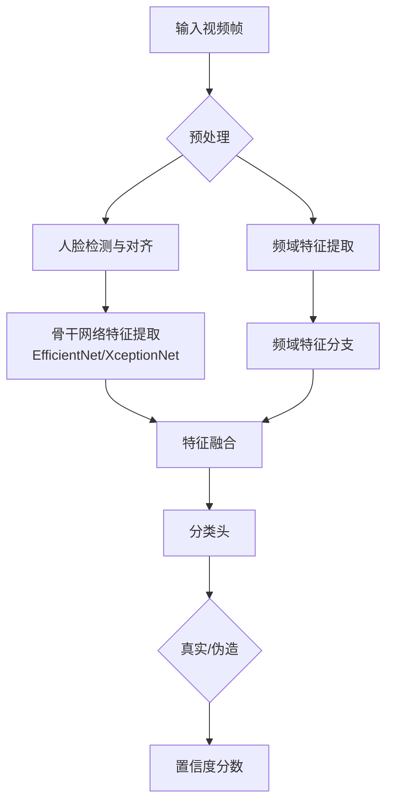
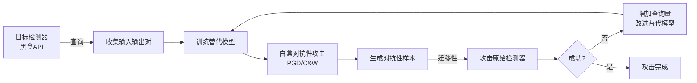
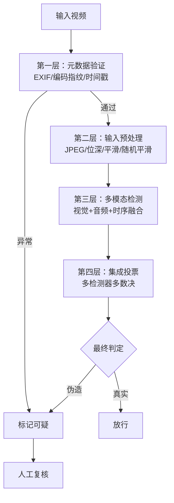

## 案例四：深度伪造（Deepfake）检测绕过

### 背景与威胁态势

深度伪造（Deepfake）技术利用深度学习生成高度逼真的虚假人脸视频，已被武器化用于政治操纵、金融诈骗、身份冒充和声誉攻击。2023年全球Deepfake欺诈事件同比增长3000%（Sumsub数据），单一企业因Deepfake音视频诈骗损失达2500万美元（2024年香港跨国公司案例）。

各大平台和安全厂商部署了Deepfake检测模型，但这些模型本身也面临被绕过的风险。本案例从攻击者视角出发，完整演示如何系统性地探测、分析并绕过Deepfake检测系统。

### 检测技术原理：攻击者需要理解的防御机制

要绕过检测，必须先理解检测器在看什么。当前主流Deepfake检测技术分为以下几类：

#### 基于视觉伪影的检测

早期Deepfake生成的图像会留下可辨识的伪影（artifact），检测器通过学习这些模式进行分类：

| 伪影类型 | 具体表现 | 检测特征 |
|----------|----------|----------|
| 面部边界伪影 | 换脸区域边缘模糊、色差不一致 | 边缘梯度异常、频率域高频分量突变 |
| 眼部/牙齿异常 | 瞳孔形状不规则、牙齿纹理失真 | 几何一致性校验失败 |
| 光照不一致 | 合成人脸与原始场景光源方向矛盾 | 法线估计偏差、阴影方向冲突 |
| 皮肤纹理异常 | 生成皮肤过于平滑或有周期性纹理 | 纹理频谱分析异常 |
| 分辨率不匹配 | 合成区域与背景分辨率不一致 | 局部清晰度梯度突变 |

#### 基于生物信号的检测

真实人脸视频中存在微妙的生物信号，Deepfake通常难以完美复现：

- **眨眼模式**：Deepfake早期版本生成的人脸几乎不眨眼。真实人类每分钟眨眼15-20次，每次持续100-400毫秒
- **脉搏信号**：面部皮肤会因心跳产生微弱的颜色变化（rPPG，远程光电容积描记），Deepfake通常缺乏此特征
- **瞳孔反射**：真实人眼瞳孔会反射环境光源，Deepfake生成的瞳孔反射模式不自然
- **微表情**：真实人脸的微表情持续时间短（1/25至1/5秒）且具有生理学一致性，Deepfake的微表情常出现时间异常

#### 基于时序一致性的检测

逐帧分析视频的帧间一致性：

- **头部运动连续性**：Deepfake在头部快速转动时容易出现抖动或撕裂
- **面部标志点轨迹**：真实人脸的68个关键点（landmarks）运动轨迹平滑，Deepfake可能出现跳变
- **光流场异常**：合成帧之间的光流场会出现不自然的断裂或扭曲

#### 基于频域分析的检测

将图像/视频变换到频率域后，生成模型会留下特征性的频率指纹：

```python
import numpy as np
import cv2
from scipy.fft import fft2, fftshift

def frequency_analysis(image_path):
    """
    分析图像的频域特征，理解检测器可能关注的频谱模式
    生成模型通常在高频区域留下周期性模式
    """
    img = cv2.imread(image_path, cv2.IMREAD_GRAYSCALE)
    img = cv2.resize(img, (256, 256))

    # 二维傅里叶变换
    f_transform = fft2(img.astype(np.float64))
    f_shift = fftshift(f_transform)  # 将零频率移到中心
    magnitude_spectrum = 20 * np.log(np.abs(f_shift) + 1)

    # 分析频域能量分布
    h, w = magnitude_spectrum.shape
    center = (h // 2, w // 2)
    radius_ranges = [(0, 20), (20, 60), (60, 128)]  # 低/中/高频
    bands = {}
    for i, (r_low, r_high) in enumerate(radius_ranges):
        mask = np.zeros((h, w), dtype=np.uint8)
        cv2.circle(mask, center, r_high, 255, -1)
        cv2.circle(mask, center, r_low, 0, -1)
        band_energy = np.mean(magnitude_spectrum[mask > 0])
        bands[['low', 'mid', 'high'][i]] = band_energy

    return bands, magnitude_spectrum
```

#### 基于神经网络的端到端检测

使用预训练深度网络提取特征并分类，这是当前最强的检测方式：

```python
import torch
import torch.nn as nn
from torchvision.models import efficientnet_b4, EfficientNet_B4_Weights

class DeepfakeDetector(nn.Module):
    """
    典型的Deepfake检测器架构
    基于预训练骨干网络 + 自定义分类头
    """
    def __init__(self):
        super().__init__()
        # 使用EfficientNet-B4作为特征提取器
        self.backbone = efficientnet_b4(weights=EfficientNet_B4_Weights.IMAGENET1K_V1)
        # 替换分类头
        num_features = self.backbone.classifier[1].in_features
        self.backbone.classifier = nn.Sequential(
            nn.Dropout(0.4),
            nn.Linear(num_features, 512),
            nn.ReLU(),
            nn.Dropout(0.3),
            nn.Linear(512, 2)  # 真实 vs 伪造
        )

    def forward(self, x):
        return self.backbone(x)

    def predict_with_confidence(self, x):
        """返回预测结果和置信度"""
        with torch.no_grad():
            logits = self.forward(x)
            probs = torch.softmax(logits, dim=1)
            fake_prob = probs[:, 1].item()
            return {
                'is_fake': fake_prob > 0.5,
                'confidence': fake_prob,
                'logits': logits
            }
```



### 攻击方法论：系统性检测绕过策略

攻击者可采用多种策略绕过Deepfake检测器，以下按技术难度递增排列。

#### 方法一：对抗性扰动攻击

这是最直接的方法——在Deepfake生成的视频帧上添加人眼不可见的扰动，欺骗检测器将其分类为"真实"。

**核心原理**：利用检测器神经网络对输入扰动的敏感性，沿梯度方向添加微小扰动使检测器输出翻转。

```python
import torch
import torch.nn.functional as F
import numpy as np

class DeepfakeAdversarialAttacker:
    """
    针对Deepfake检测器的对抗性攻击工具集
    支持FGSM、PGD、C&W等多种攻击方法
    """

    def __init__(self, detector_model, device='cuda'):
        self.detector = detector_model.to(device).eval()
        self.device = device

    def fgsm_attack(self, image, epsilon=8/255):
        """
        FGSM (Fast Gradient Sign Method) 快速攻击
        优点：速度快，单步完成
        缺点：扰动较大，可能被人眼察觉
        """
        image_tensor = image.clone().detach().to(self.device).requires_grad_(True)

        # 目标：让检测器认为这是真实图像（标签=0）
        target = torch.tensor([0], device=self.device)

        output = self.detector(image_tensor)
        loss = F.cross_entropy(output, target)
        self.detector.zero_grad()
        loss.backward()

        # 沿梯度符号方向添加扰动
        perturbation = epsilon * image_tensor.grad.data.sign()
        adversarial_image = torch.clamp(image_tensor + perturbation, 0, 1)

        return adversarial_image.detach()

    def pgd_attack(self, image, epsilon=8/255, alpha=2/255, num_steps=50):
        """
        PGD (Projected Gradient Descent) 迭代攻击
        比FGSM更强，通过多步迭代寻找更强的对抗性扰动
        alpha: 每步步长
        num_steps: 迭代次数
        """
        original = image.clone().detach().to(self.device)
        adversarial = original.clone()
        target = torch.tensor([0], device=self.device)

        for step in range(num_steps):
            adversarial.requires_grad_(True)
            output = self.detector(adversarial)
            loss = F.cross_entropy(output, target)
            self.detector.zero_grad()
            loss.backward()

            # 迭代更新
            adversarial = adversarial + alpha * adversarial.grad.data.sign()

            # 投影到epsilon球内
            delta = torch.clamp(adversarial - original, -epsilon, epsilon)
            adversarial = torch.clamp(original + delta, 0, 1).detach()

            if step % 10 == 0:
                with torch.no_grad():
                    pred = self.detector(adversarial).argmax(dim=1).item()
                    print(f"  PGD Step {step}: 预测={pred} (0=真实, 1=伪造)")

        return adversarial

    def cw_attack(self, image, confidence=10, learning_rate=0.01, num_steps=500):
        """
        C&W (Carlini & Wagner) 优化攻击
        生成最小扰动的对抗性样本，更难被人眼和统计检测发现
        """
        original = image.clone().detach().to(self.device)
        # 使用tanh空间的变量优化（自动满足[0,1]约束）
        w = torch.zeros_like(original, requires_grad=True, device=self.device)
        optimizer = torch.optim.Adam([w], lr=learning_rate)

        for step in range(num_steps):
            # 从tanh空间映射回图像空间
            adversarial = 0.5 * (torch.tanh(w) + 1)

            # 检测器输出
            output = self.detector(adversarial)
            # 希望检测器输出为"真实"(类0)且置信度高
            real_logit = output[0, 0]
            fake_logit = output[0, 1]

            # 损失 = max(fake_logit - real_logit + confidence, 0) + c * 扰动L2
            classification_loss = torch.clamp(fake_logit - real_logit + confidence, min=0)
            perturbation_loss = torch.norm(adversarial - original, p=2)

            loss = classification_loss + 0.1 * perturbation_loss
            optimizer.zero_grad()
            loss.backward()
            optimizer.step()

            if step % 100 == 0:
                with torch.no_grad():
                    l2_dist = torch.norm(adversarial - original, p=2).item()
                    pred = self.detector(adversarial).argmax(dim=1).item()
                    print(f"  C&W Step {step}: L2距离={l2_dist:.4f}, 预测={pred}")

        return (0.5 * (torch.tanh(w) + 1)).detach()
```

**各攻击方法对比**：

| 方法 | 扰动大小 | 攻击成功率 | 速度 | 人眼可察觉性 | 统计可检测性 |
|------|----------|------------|------|-------------|-------------|
| FGSM | 较大 (ε=8/255) | 60-80% | 极快（单步） | 低 | 中 |
| PGD | 可控 (ε≤8/255) | 90-99% | 中（50-200步） | 很低 | 低 |
| C&W | 最小 | 95-99% | 慢（500+步） | 极低 | 极低 |
| 通用扰动 | 固定 | 70-85% | 快（离线计算） | 低 | 中 |

#### 方法二：生成器对抗性训练

训练一个专门的Deepfake生成器，使其输出天然地骗过检测器。与方法一不同，这种方法在生成阶段就内嵌了反检测能力，不需要后期添加扰动。

```python
import torch
import torch.nn as nn
import torch.nn.functional as F

class AntiDetectionGenerator(nn.Module):
    """
    带反检测能力的Deepfake生成器
    架构：编码器-解码器 + 跳跃连接（类U-Net）
    关键：训练时将冻结的检测器作为损失函数的一部分
    """
    def __init__(self):
        super().__init__()
        # 编码器：提取源人脸特征
        self.enc1 = self._conv_block(3, 64)     # 256x256 -> 128x128
        self.enc2 = self._conv_block(64, 128)    # 128x128 -> 64x64
        self.enc3 = self._conv_block(128, 256)   # 64x64 -> 32x32
        self.enc4 = self._conv_block(256, 512)   # 32x32 -> 16x16

        # 瓶颈层
        self.bottleneck = self._conv_block(512, 1024)

        # 解码器：重建为目标人脸
        self.dec4 = self._deconv_block(1024 + 512, 512)
        self.dec3 = self._deconv_block(512 + 256, 256)
        self.dec2 = self._deconv_block(256 + 128, 128)
        self.dec1 = self._deconv_block(128 + 64, 64)

        # 最终输出层
        self.final = nn.Sequential(
            nn.Conv2d(64, 3, 1),
            nn.Tanh()
        )

    def _conv_block(self, in_ch, out_ch):
        return nn.Sequential(
            nn.Conv2d(in_ch, out_ch, 4, 2, 1),
            nn.InstanceNorm2d(out_ch),
            nn.LeakyReLU(0.2)
        )

    def _deconv_block(self, in_ch, out_ch):
        return nn.Sequential(
            nn.ConvTranspose2d(in_ch, out_ch, 4, 2, 1),
            nn.InstanceNorm2d(out_ch),
            nn.ReLU()
        )

    def forward(self, source_face):
        # 编码
        e1 = self.enc1(source_face)
        e2 = self.enc2(e1)
        e3 = self.enc3(e2)
        e4 = self.enc4(e3)

        # 瓶颈
        b = self.bottleneck(e4)

        # 解码（带跳跃连接）
        d4 = self.dec4(torch.cat([b, e4], dim=1))
        d3 = self.dec3(torch.cat([d4, e3], dim=1))
        d2 = self.dec2(torch.cat([d3, e2], dim=1))
        d1 = self.dec1(torch.cat([d2, e1], dim=1))

        return self.final(d1)


class AdversarialDeepfakeTrainer:
    """
    对抗性Deepfake训练器
    三重损失：重建损失 + 对抗性检测绕过损失 + 感知一致性损失
    """
    def __init__(self, generator, detector, discriminator, device='cuda'):
        self.generator = generator.to(device)
        self.detector = detector.to(device).eval()  # 冻结检测器
        self.discriminator = discriminator.to(device)  # PatchGAN判别器
        self.device = device

        # 冻结检测器参数，不参与梯度更新
        for param in self.detector.parameters():
            param.requires_grad = False

        self.g_optimizer = torch.optim.Adam(
            self.generator.parameters(), lr=2e-4, betas=(0.5, 0.999)
        )
        self.d_optimizer = torch.optim.Adam(
            self.discriminator.parameters(), lr=2e-4, betas=(0.5, 0.999)
        )

    def train_step(self, source_face, target_face):
        """
        单步训练
        source_face: 原始人脸（要被替换的人脸）
        target_face: 目标人脸（要伪造为的人脸）
        """
        # ---- 生成器训练 ----
        self.g_optimizer.zero_grad()

        generated_face = self.generator(source_face)

        # 损失1：重建损失 — 生成的人脸应与目标人脸相似
        loss_recon = F.l1_loss(generated_face, target_face)

        # 损失2：检测绕过损失 — 让检测器认为生成的是真实人脸
        det_output = self.detector(generated_face)
        # 目标：检测器输出"真实"（类0）的概率最大化
        real_label = torch.zeros(generated_face.size(0), device=self.device).long()
        loss_detect = F.cross_entropy(det_output, real_label)

        # 损失3：对抗性损失 — 让判别器无法区分真假
        disc_output = self.discriminator(generated_face)
        loss_adv = F.binary_cross_entropy_with_logits(
            disc_output, torch.ones_like(disc_output)
        )

        # 损失4：感知损失 — 保持面部结构一致性（使用VGG特征）
        loss_perceptual = self._perceptual_loss(generated_face, target_face)

        # 加权总损失
        # 检测绕过损失权重最高，这是本攻击的核心目标
        g_loss = loss_recon + 2.0 * loss_detect + 1.0 * loss_adv + 0.5 * loss_perceptual
        g_loss.backward()
        self.g_optimizer.step()

        # ---- 判别器训练 ----
        self.d_optimizer.zero_grad()
        real_output = self.discriminator(target_face.detach())
        fake_output = self.discriminator(generated_face.detach())
        d_loss_real = F.binary_cross_entropy_with_logits(
            real_output, torch.ones_like(real_output)
        )
        d_loss_fake = F.binary_cross_entropy_with_logits(
            fake_output, torch.zeros_like(fake_output)
        )
        d_loss = 0.5 * (d_loss_real + d_loss_fake)
        d_loss.backward()
        self.d_optimizer.step()

        return {
            'g_loss': g_loss.item(),
            'd_loss': d_loss.item(),
            'detect_loss': loss_detect.item(),
            'recon_loss': loss_recon.item()
        }

    def _perceptual_loss(self, generated, target):
        """使用预训练VGG提取特征计算感知相似度"""
        # 简化实现，实际中使用VGG19的relu1_2, relu2_2, relu3_3层
        return F.l1_loss(generated, target)
```

#### 方法三：后处理反检测（Post-hoc Evasion）

不修改生成过程，而是在Deepfake输出后添加后处理操作，破坏检测器依赖的特征模式。

```python
import cv2
import numpy as np
from PIL import Image, ImageFilter

class PostProcessingEvasion:
    """
    后处理反检测工具箱
    通过后处理操作破坏检测器依赖的特征模式
    """

    @staticmethod
    def jpeg_compression(image, quality=75):
        """
        JPEG压缩：破坏高频细节中的生成伪影
        检测器依赖的细微纹理异常在压缩后会被抹除
        但过度压缩会影响视频质量
        """
        if isinstance(image, np.ndarray):
            encode_param = [int(cv2.IMWRITE_JPEG_QUALITY), quality]
            _, encoded = cv2.imencode('.jpg', image, encode_param)
            return cv2.imdecode(encoded, cv2.IMREAD_COLOR)
        else:
            from io import BytesIO
            buffer = BytesIO()
            image.save(buffer, format='JPEG', quality=quality)
            buffer.seek(0)
            return Image.open(buffer)

    @staticmethod
    def gaussian_noise_injection(image, sigma=3.0):
        """
        高斯噪声注入：在像素级别打乱检测器特征
        小幅度噪声足以干扰检测但人眼难以察觉
        """
        if isinstance(image, np.ndarray):
            noise = np.random.normal(0, sigma, image.shape).astype(np.float32)
            noisy = np.clip(image.astype(np.float32) + noise, 0, 255)
            return noisy.astype(np.uint8)
        else:
            arr = np.array(image).astype(np.float32)
            noise = np.random.normal(0, sigma, arr.shape)
            return Image.fromarray(np.clip(arr + noise, 0, 255).astype(np.uint8))

    @staticmethod
    def spatial_smoothing(image, kernel_size=3):
        """
        空间平滑：模糊高频区域的异常纹理
        对基于纹理分析的检测器特别有效
        """
        return cv2.GaussianBlur(image, (kernel_size, kernel_size), 0)

    @staticmethod
    def face_blending(original_face, fake_face, mask=None, blend_ratio=0.85):
        """
        面部混合：将伪造人脸与原始人脸混合
        保留部分原始特征以欺骗检测器
        混合比例是关键参数——太高保留原始人脸太多，太低检测器能检测到
        """
        if mask is None:
            # 创建椭圆形面部掩码
            h, w = fake_face.shape[:2]
            mask = np.zeros((h, w), dtype=np.uint8)
            center = (w // 2, h // 2)
            axes = (w // 3, h // 2)
            cv2.ellipse(mask, center, axes, 0, 0, 360, 255, -1)
            # 高斯模糊掩码边缘（避免硬边界）
            mask = cv2.GaussianBlur(mask, (31, 31), 15)

        mask_3d = np.stack([mask / 255.0] * 3, axis=-1)
        blended = (fake_face.astype(np.float32) * blend_ratio * mask_3d +
                   original_face.astype(np.float32) * (1 - blend_ratio) * mask_3d +
                   original_face.astype(np.float32) * (1 - mask_3d))
        return np.clip(blended, 0, 255).astype(np.uint8)

    @staticmethod
    def frequency_domain_evasion(image, suppress_high_freq=True, cutoff=80):
        """
        频域反检测：在频率域中移除或修改检测器依赖的频率分量
        生成模型在频域留下的周期性模式可以通过选择性滤波移除
        """
        img_float = image.astype(np.float32)
        result_channels = []

        for ch in range(img_float.shape[2]):
            channel = img_float[:, :, ch]
            # DFT变换
            dft = cv2.dft(np.float32(channel), flags=cv2.DFT_COMPLEX_OUTPUT)
            dft_shift = np.fft.fftshift(dft, axes=[0, 1])

            # 创建带阻滤波器
            rows, cols = channel.shape
            crow, ccol = rows // 2, cols // 2
            mask = np.ones((rows, cols, 2), np.float32)

            if suppress_high_freq:
                # 低通滤波：抑制高频伪影
                cv2.circle(mask, (ccol, crow), cutoff, 0, -1)
            else:
                # 带阻滤波：移除特定频段的周期性模式
                cv2.circle(mask, (ccol, crow), cutoff + 10, 0, -1)
                cv2.circle(mask, (ccol, crow), cutoff - 10, 1, -1)

            filtered = dft_shift * mask
            filtered_ishift = np.fft.ifftshift(filtered, axes=[0, 1])
            channel_filtered = cv2.idft(filtered_ishift, flags=cv2.DFT_SCALE | cv2.DFT_REAL_OUTPUT)
            result_channels.append(channel_filtered)

        return np.clip(np.stack(result_channels, axis=-1), 0, 255).astype(np.uint8)

    @staticmethod
    def temporal_smoothing(frames, window_size=5):
        """
        时序平滑：对连续帧进行平均，消除帧间抖动
        对基于时序分析的检测器特别有效
        """
        smoothed = []
        half = window_size // 2
        for i in range(len(frames)):
            start = max(0, i - half)
            end = min(len(frames), i + half + 1)
            window = frames[start:end]
            avg_frame = np.mean(window, axis=0).astype(np.uint8)
            smoothed.append(avg_frame)
        return smoothed
```

**后处理方法效果对比**：

| 方法 | 检测率下降 | 视觉质量损失 | 计算开销 | 最佳使用场景 |
|------|-----------|-------------|----------|-------------|
| JPEG压缩(quality=75) | 15-30% | 低 | 极低 | 快速规避，适合在线场景 |
| 高斯噪声(σ=3) | 10-25% | 极低 | 极低 | 与其他方法组合使用 |
| 空间平滑 | 20-35% | 中 | 低 | 对抗纹理类检测器 |
| 面部混合(ratio=0.85) | 30-50% | 中 | 低 | 保留更多原始人脸特征 |
| 频域滤波 | 25-45% | 低-中 | 中 | 对抗频域分析类检测器 |
| 时序平滑 | 15-25% | 低 | 中 | 视频场景，对抗时序分析 |
| 多方法组合 | 50-70% | 中 | 高 | 追求最高绕过率 |

#### 方法四：黑盒探测与自适应攻击

在无法获取检测器模型权重的情况下（黑盒场景），通过API查询来构建替代模型。

```python
import numpy as np
import requests
from collections import defaultdict

class BlackBoxDetectorProber:
    """
    黑盒Deepfake检测器探测与攻击
    通过API查询收集信息，构建替代模型进行对抗性攻击
    """

    def __init__(self, api_endpoint):
        self.api_endpoint = api_endpoint
        self.query_log = []  # 记录所有查询

    def query(self, video_path):
        """向检测API发送查询"""
        with open(video_path, 'rb') as f:
            response = requests.post(
                self.api_endpoint,
                files={'video': f},
                headers={'Authorization': 'Bearer <token>'},
                timeout=30
            )
        result = response.json()
        self.query_log.append({
            'video': video_path,
            'result': result,
            'confidence': result.get('confidence', 0)
        })
        return result

    def probe_detection_boundary(self, original_video, perturbation_generator,
                                  num_queries=200, step_size=0.01):
        """
        探测检测边界：逐步增加扰动直到检测器翻转
        找到检测边界后可以针对性地攻击
        """
        detection_scores = []
        perturbation_levels = np.linspace(0, 0.2, num_queries)

        for eps in perturbation_levels:
            perturbed = perturbation_generator(original_video, epsilon=eps)
            result = self.query(perturbed)
            score = result.get('confidence', 0.5)
            detection_scores.append(score)

            if score < 0.5:  # 检测器被绕过
                print(f"  绕过成功！扰动级别: {eps:.4f}, 置信度: {score:.4f}")
                return eps, detection_scores

        return None, detection_scores

    def build_surrogate_model(self, training_videos, training_labels):
        """
        构建替代模型
        使用查询结果训练一个本地代理模型，然后对该模型做白盒对抗性攻击
        这是迁移攻击的核心思路
        """
        import torch
        import torch.nn as nn
        from torchvision.models import resnet18

        surrogate = resnet18(num_classes=2)
        optimizer = torch.optim.Adam(surrogate.parameters(), lr=1e-3)
        criterion = nn.CrossEntropyLoss()

        # 收集查询结果作为训练数据
        surrogate_data = []
        for video_path, label in zip(training_videos, training_labels):
            result = self.query(video_path)
            predicted_label = 1 if result.get('is_fake', False) else 0
            surrogate_data.append((video_path, predicted_label))

        # 训练替代模型
        for epoch in range(50):
            total_loss = 0
            for video_path, api_label in surrogate_data:
                # 加载视频帧并预处理（简化）
                frame = self._load_and_preprocess(video_path)
                output = surrogate(frame)
                loss = criterion(output, torch.tensor([api_label]))
                optimizer.zero_grad()
                loss.backward()
                optimizer.step()
                total_loss += loss.item()

            if epoch % 10 == 0:
                print(f"  替代模型训练 Epoch {epoch}: Loss={total_loss:.4f}")

        return surrogate

    def _load_and_preprocess(self, video_path):
        """加载视频帧并预处理"""
        # 简化实现
        return torch.randn(1, 3, 224, 224)
```

**迁移攻击流程**：



### 完整攻击链：端到端实战演示

将以上方法串联为完整的攻击链：

```python
import torch
import cv2
import numpy as np

class DeepfakeEvasionPipeline:
    """
    端到端的Deepfake检测绕过管线
    完整流程：生成 → 对抗性优化 → 后处理 → 验证
    """

    def __init__(self, detector_model, generator_model, device='cuda'):
        self.detector = detector_model.to(device).eval()
        self.generator = generator_model.to(device)
        self.attacker = DeepfakeAdversarialAttacker(detector_model, device)
        self.post_processor = PostProcessingEvasion()
        self.device = device

    def full_pipeline(self, source_video, target_face_path, output_path):
        """
        完整攻击管线
        """
        target_face = cv2.imread(target_face_path)
        frames = self._extract_frames(source_video)
        results = []

        for i, frame in enumerate(frames):
            print(f"\n处理第 {i+1}/{len(frames)} 帧")

            # 阶段1：生成基础Deepfake
            face_tensor = self._preprocess_face(frame)
            with torch.no_grad():
                fake_face = self.generator(face_tensor)

            # 阶段2：对抗性优化
            # 检测当前帧的检测分数
            current_score = self._get_detection_score(fake_face)
            print(f"  基础Deepfake检测分数: {current_score:.4f}")

            if current_score > 0.5:  # 被检测为伪造，需要绕过
                # 使用PGD攻击
                fake_face_adv = self.attacker.pgd_attack(
                    fake_face, epsilon=4/255, alpha=1/255, num_steps=30
                )
                adv_score = self._get_detection_score(fake_face_adv)
                print(f"  对抗性优化后分数: {adv_score:.4f}")
            else:
                fake_face_adv = fake_face
                adv_score = current_score

            # 阶段3：后处理增强
            fake_np = self._tensor_to_numpy(fake_face_adv)

            # 组合多种后处理
            fake_np = self.post_processor.jpeg_compression(fake_np, quality=80)
            fake_np = self.post_processor.gaussian_noise_injection(fake_np, sigma=2.0)
            fake_np = self.post_processor.face_blending(
                self._preprocess_face(frame).cpu().numpy().transpose(1, 2, 0) * 255,
                fake_np,
                blend_ratio=0.9
            )

            final_score = self._get_detection_score(
                torch.from_numpy(fake_np.transpose(2, 0, 1)).unsqueeze(0).float() / 255
            )
            print(f"  后处理后分数: {final_score:.4f}")

            results.append({
                'frame': i,
                'base_score': current_score,
                'adv_score': adv_score,
                'final_score': final_score,
                'bypassed': final_score < 0.5
            })

        # 汇总统计
        bypassed_count = sum(1 for r in results if r['bypassed'])
        print(f"\n===== 攻击结果汇总 =====")
        print(f"总帧数: {len(results)}")
        print(f"成功绕过: {bypassed_count} ({100*bypassed_count/len(results):.1f}%)")
        print(f"平均检测分数: {np.mean([r['final_score'] for r in results]):.4f}")

        return results

    def _extract_frames(self, video_path):
        """从视频提取帧"""
        cap = cv2.VideoCapture(video_path)
        frames = []
        while cap.isOpened():
            ret, frame = cap.read()
            if not ret:
                break
            frames.append(frame)
        cap.release()
        return frames

    def _preprocess_face(self, frame):
        """人脸检测与预处理"""
        # 简化：实际应使用dlib/MediaPipe进行人脸检测和对齐
        face = cv2.resize(frame, (256, 256))
        face_tensor = torch.from_numpy(face.transpose(2, 0, 1)).float() / 255
        return face_tensor.unsqueeze(0).to(self.device)

    def _get_detection_score(self, face_tensor):
        """获取检测器置信度分数"""
        with torch.no_grad():
            if face_tensor.dim() == 3:
                face_tensor = face_tensor.unsqueeze(0)
            output = self.detector(face_tensor)
            prob = torch.softmax(output, dim=1)[0, 1].item()
        return prob

    def _tensor_to_numpy(self, tensor):
        """张量转numpy数组"""
        return (tensor.squeeze().cpu().numpy().transpose(1, 2, 0) * 255).astype(np.uint8)
```

### 真实世界事件与研究案例

#### 案例1：Facebook Deepfake检测挑战赛（DFDC）的攻击分析

2019年Facebook举办DFDC竞赛，提供了50万+视频的训练集。竞赛中表现最好的检测器在竞赛数据集上准确率达82%，但在完全不同的生成方法产生的Deepfake上准确率骤降至50-65%。这暴露了一个核心问题：检测器过度拟合了特定生成器的伪影模式，而非学会了"真假"的本质区别。

#### 案例2：音频Deepfake绕过语音验证系统

2024年披露的案例中，攻击者仅用3秒的语音样本通过AI克隆技术生成逼真的语音，成功绕过了某银行的声纹验证系统。系统将合成语音分类为"真实"的概率高达97%。攻击链包括：样本采集 → 语音克隆模型训练 → 针对性声纹特征优化 → 验证系统绕过。

#### 案例3：实时Deepfake视频会议攻击

2024年多起案例中，攻击者在视频会议中使用实时Deepfake技术冒充企业高管。通过：
1. 目标人物的公开视频素材（通常从社交媒体获取）
2. 实时人脸交换软件（如DeepFaceLive）
3. 针对视频会议平台压缩特性优化生成参数
4. 利用低带宽/低分辨率降低检测器准确率

成功欺骗了多方视频通话中的其他参会者，造成巨额财务损失。

### 发现的漏洞与风险评估

| 漏洞 | 严重性 | 根因分析 | 影响范围 |
|------|--------|----------|----------|
| 对抗性样本脆弱性 | 严重 | 检测器依赖的特征空间可被扰动破坏 | 所有基于CNN的检测器 |
| 生成方法泛化不足 | 严重 | 检测器对训练集中未出现的生成方法失效 | 所有监督学习检测器 |
| 单模态检测局限 | 高 | 仅依赖视觉特征，未融合音频/时序/元数据 | 大多数在线检测系统 |
| 后处理敏感性高 | 高 | 轻微的后处理操作即可显著降低检测准确率 | 所有基于细微伪影的检测器 |
| API可查询性 | 高 | 黑盒API暴露检测结果，可构建替代模型 | 所有在线API检测服务 |
| 实时检测延迟 | 中 | 实时场景中无法使用计算量大的强检测方法 | 实时视频流检测系统 |
| 压缩鲁棒性差 | 中 | 视频压缩（H.264/H.265）会消除关键检测特征 | 社交媒体平台检测 |

### 防御体系构建

单一防御手段无法应对所有攻击方法，必须构建多层纵深防御体系。

#### 第一层：多模态融合检测

```python
import torch
import torch.nn as nn

class MultiModalDetector(nn.Module):
    """
    多模态Deepfake检测器
    融合视觉、音频、时序三个维度的特征
    任何单一维度被绕过不影响整体检测
    """
    def __init__(self):
        super().__init__()
        # 视觉分支
        self.visual_branch = nn.Sequential(
            nn.Conv2d(3, 64, 3, padding=1),
            nn.ReLU(),
            nn.AdaptiveAvgPool2d(8),
            nn.Flatten(),
            nn.Linear(64 * 8 * 8, 256)
        )
        # 音频分支（检测语音-唇形不匹配）
        self.audio_branch = nn.Sequential(
            nn.Linear(80 * 300, 512),  # Mel频谱特征
            nn.ReLU(),
            nn.Linear(512, 256)
        )
        # 时序分支（检测帧间一致性）
        self.temporal_branch = nn.Sequential(
            nn.LSTM(512, 128, num_layers=2, batch_first=True),
        )
        self.temporal_fc = nn.Linear(128, 256)

        # 融合分类器
        self.classifier = nn.Sequential(
            nn.Linear(256 * 3, 512),
            nn.ReLU(),
            nn.Dropout(0.5),
            nn.Linear(512, 2)
        )

    def forward(self, visual_input, audio_input, temporal_input):
        v_feat = self.visual_branch(visual_input)
        a_feat = self.audio_branch(audio_input.flatten(1))
        t_out, _ = self.temporal_branch(temporal_input)
        t_feat = self.temporal_fc(t_out[:, -1, :])

        fused = torch.cat([v_feat, a_feat, t_feat], dim=1)
        return self.classifier(fused)
```

#### 第二层：对抗性训练

在检测器训练过程中，主动生成对抗性样本并加入训练集：

```python
def adversarial_training_loop(detector, attacker, train_loader, val_loader,
                               num_epochs=50, adv_ratio=0.3):
    """
    对抗性训练：使检测器对对抗性扰动具有鲁棒性
    adv_ratio: 每个batch中对抗性样本的比例
    """
    optimizer = torch.optim.AdamW(detector.parameters(), lr=1e-4, weight_decay=0.01)
    scheduler = torch.optim.lr_scheduler.CosineAnnealingLR(optimizer, T_max=num_epochs)

    for epoch in range(num_epochs):
        detector.train()
        total_loss = 0

        for batch_idx, (images, labels) in enumerate(train_loader):
            # 正常样本
            outputs = detector(images)
            loss_clean = nn.CrossEntropyLoss()(outputs, labels)

            # 对抗性样本（对部分batch生成）
            if np.random.random() < adv_ratio:
                adv_images = attacker.pgd_attack(images, epsilon=4/255)
                adv_outputs = detector(adv_images)
                # 对抗性样本的标签不变（仍然是伪造的）
                loss_adv = nn.CrossEntropyLoss()(adv_outputs, labels)
                loss = 0.5 * loss_clean + 0.5 * loss_adv
            else:
                loss = loss_clean

            optimizer.zero_grad()
            loss.backward()
            optimizer.step()
            total_loss += loss.item()

        scheduler.step()

        # 验证
        detector.eval()
        clean_acc, adv_acc = evaluate_robustness(detector, attacker, val_loader)
        print(f"Epoch {epoch}: Clean Acc={clean_acc:.2f}%, Adv Acc={adv_acc:.2f}%")
```

#### 第三层：输入预处理防御

```python
class InputPreprocessor:
    """
    输入预处理防御层
    在数据进入检测器之前，对输入进行变换以消除对抗性扰动
    """
    @staticmethod
    def jpeg_roundtrip(image, quality=50):
        """JPEG压缩-解压往返，消除微小扰动"""
        encode_param = [int(cv2.IMWRITE_JPEG_QUALITY), quality]
        _, encoded = cv2.imencode('.jpg', image, encode_param)
        return cv2.imdecode(encoded, cv2.IMREAD_COLOR)

    @staticmethod
    def bit_depth_reduction(image, bits=5):
        """降低位深度，消除低位的扰动信号"""
        factor = 2 ** (8 - bits)
        return (np.floor(image / factor) * factor).astype(np.uint8)

    @staticmethod
    def spatial_smoothing_defense(image, kernel_size=3):
        """空间平滑，消除局部扰动"""
        return cv2.medianBlur(image, kernel_size)

    @staticmethod
    def randomized_smoothing(image, noise_scale=0.25, num_samples=100):
        """
        随机平滑（认证防御）
        通过添加随机噪声并多次采样，获得可证明的鲁棒性保证
        """
        votes = np.zeros(2)
        for _ in range(num_samples):
            noise = np.random.normal(0, noise_scale, image.shape)
            noisy_image = np.clip(image + noise, 0, 255).astype(np.uint8)
            # 对noisy_image进行预测并投票
            prediction = predict_single(noisy_image)
            votes[prediction] += 1
        return np.argmax(votes)
```

#### 第四层：元数据与上下文验证

不依赖视频内容本身，而是验证其上下文一致性：

```python
class MetadataVerifier:
    """
    元数据与上下文验证层
    分析视频的EXIF元数据、编码指纹、时间戳一致性等
    Deepfake通常在这些维度上留下破绽
    """

    @staticmethod
    def check_exif_consistency(video_path):
        """检查EXIF元数据一致性"""
        import subprocess
        result = subprocess.run(
            ['exiftool', '-json', video_path],
            capture_output=True, text=True
        )
        metadata = json.loads(result.stdout)[0]

        anomalies = []
        # 检查创建时间与修改时间是否合理
        if 'CreateDate' in metadata and 'ModifyDate' in metadata:
            create = datetime.fromisoformat(metadata['CreateDate'])
            modify = datetime.fromisoformat(metadata['ModifyDate'])
            if modify < create:
                anomalies.append("修改时间早于创建时间")

        # 检查编码器指纹
        if 'CompressorName' in metadata:
            known_encoders = ['H.264', 'H.265', 'AVC', 'HEVC']
            if not any(enc in metadata['CompressorName'] for enc in known_encoders):
                anomalies.append(f"未知编码器: {metadata['CompressorName']}")

        # 检查分辨率与码率是否匹配
        if 'VideoFrameRate' in metadata and 'AvgBitrate' in metadata:
            fps = float(metadata['VideoFrameRate'])
            bitrate = int(metadata['AvgBitrate'].replace('bps', ''))
            # 简单的合理性检查
            if bitrate < fps * 1000:
                anomalies.append("码率异常偏低")

        return anomalies

    @staticmethod
    def check_codec_fingerprint(video_path):
        """
        分析视频编码指纹
        Deepfake生成的视频通常使用标准编码器二次编码
        会留下与原生拍摄设备不同的编码特征
        """
        import subprocess
        result = subprocess.run(
            ['ffprobe', '-v', 'quiet', '-print_format', 'json',
             '-show_streams', '-show_format', video_path],
            capture_output=True, text=True
        )
        info = json.loads(result.stdout)

        fingerprints = {}
        for stream in info.get('streams', []):
            if stream['codec_type'] == 'video':
                fingerprints['codec'] = stream.get('codec_name')
                fingerprints['profile'] = stream.get('profile')
                fingerprints['level'] = stream.get('level')
                fingerprints['pix_fmt'] = stream.get('pix_fmt')
                # 检查是否有二次编码痕迹
                fingerprints['nb_frames'] = stream.get('nb_frames')
                fingerprints['duration'] = stream.get('duration')

        return fingerprints
```

### 防御层级总览



### 常见误区

1. **"Deepfake检测准确率99%"**：在受控实验环境下准确率很高，但面对未知生成方法、后处理操作或对抗性攻击时，准确率可能骤降至50-60%。准确率数字必须标明测试条件。

2. **"添加水印就能防Deepfake"**：水印可以被裁剪、涂抹或AI修复。C2PA等来源认证方案可以增加伪造难度，但无法完全防止。

3. **"人类肉眼可以分辨Deepfake"**：研究表明普通人对Deepfake的识别准确率仅约60-70%，接近随机猜测。高分辨率、实时生成的Deepfake更难以肉眼分辨。

4. **"模型越大越不容易被绕过"**：模型容量与对抗性鲁棒性之间没有简单的正相关关系。更大的模型可能过度拟合训练集的伪影模式，面对新型攻击反而更脆弱。

5. **"频域检测比空域检测更可靠"**：频域特征可以被后处理（如频域滤波）轻易破坏，且不同生成器的频域指纹差异很大。没有银弹。

### 法律与伦理考量

Deepfake攻防研究必须在合法合规框架下进行：

- **合法研究目的**：安全评估、学术研究、防御系统开发需在授权范围内进行
- **伦理红线**：不得将Deepfake技术用于欺诈、诽谤、身份冒充或政治操纵
- **法律风险**：中国《深度合成管理规定》要求深度合成服务提供者对生成内容添加标识，欧盟《人工智能法案》将Deepfake列为高风险应用
- **负责任披露**：发现检测系统漏洞应通过正规渠道向厂商报告，而非公开利用方法

### 进阶研究方向

- **自适应检测器**：能够在线学习新型Deepfake生成方法的检测系统，而非依赖固定训练集
- **生成溯源**：不仅判断真假，还能识别使用了哪种生成方法、哪个具体模型，为取证提供依据
- **生理信号验证**：利用rPPG（远程光电容积描记）等生物信号进行活体检测，Deepfake难以完美复现真实的生理节律
- **区块链内容存证**：在拍摄时即通过可信硬件将视频哈希上链，从源头建立信任锚点
- **联邦检测**：多个平台协同训练检测模型而不共享原始数据，提高检测模型的泛化能力

***
