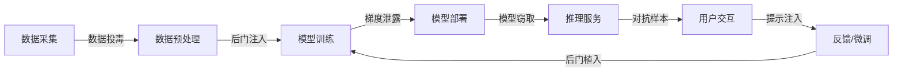
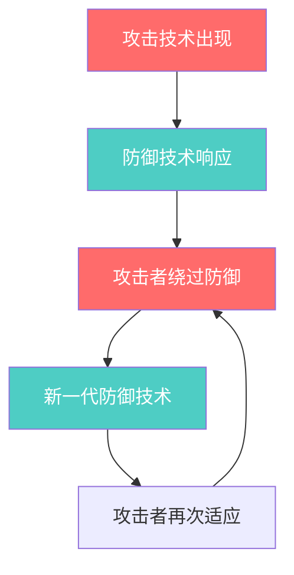
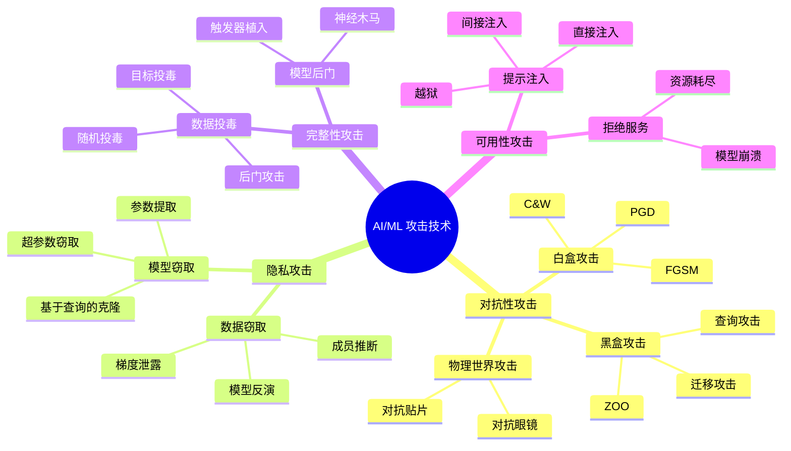
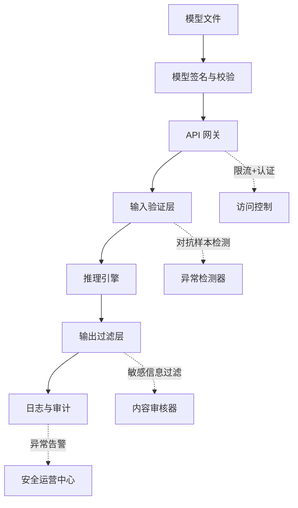

## 案例总结

五个实战案例覆盖了当前 AI/ML 安全领域最核心、最高频的攻击场景。本节不是简单复述，而是从**攻击维度**、**防御维度**和**工程决策**三个视角进行交叉分析，提炼出可复用的安全认知框架。

### 五案全景回顾

下表将五个案例按统一维度进行横向对比，帮助读者建立整体认知：

| 维度 | 案例一：对抗性样本 | 案例二：模型窃取 | 案例三：梯度泄露 | 案例四：Deepfake 绕过 | 案例五：提示注入 |
|------|-------------------|-----------------|-----------------|---------------------|-----------------|
| **攻击目标** | 模型推理结果 | 模型架构与参数 | 训练数据隐私 | 检测模型决策边界 | LLM 系统指令与数据 |
| **攻击位置** | 推理阶段（输入层） | 推理阶段（输出层） | 训练阶段（通信层） | 推理阶段（对抗生成） | 推理阶段（输入层） |
| **所需权限** | 无（黑盒即可） | API 查询权限 | 通信信道访问 | API 查询权限 | 用户交互权限 |
| **攻击成本** | 低-中 | 中-高 | 高 | 中-高 | 极低 |
| **技术门槛** | 中等 | 中等 | 高 | 高 | 低 |
| **危害等级** | 高（物理安全） | 高（知识产权） | 极高（隐私数据） | 高（虚假信息） | 高（数据泄露+越权） |
| **防御难度** | 高 | 中 | 高 | 高 | 中 |

### 攻击模式的深层规律

从五个案例中可以提炼出四条贯穿性规律，理解这些规律比记住具体技术更重要——因为技术会迭代，规律不会变。

#### 规律一：攻击面与系统复杂度正相关

AI/ML 系统不是单一组件，而是一条**数据→训练→部署→推理→反馈**的完整流水线。每个环节都引入新的攻击面：



案例一和案例五攻击的是**推理入口**，案例三攻击的是**训练通信**，案例二攻击的是**模型输出**，案例四攻击的是**检测决策边界**。五个案例恰好覆盖了流水线的不同位置，没有哪个环节可以假设"安全"。

防御推论：不能只加固单一环节。需要沿整条流水线做**分层防御（Defense in Depth）**——输入验证、模型加密、通信加密、输出过滤、行为监控，缺一不可。

#### 规律二：黑盒假设几乎总是成立的

五个案例中，攻击者大多不需要知道模型的内部结构。案例一用迁移性绕过、案例二通过 API 查询重建、案例四通过查询探测决策边界——攻击者始终在**黑盒或灰盒**条件下完成攻击。

这意味着：声称"攻击者无法获取模型所以安全"的防御思路是危险的。模型一旦对外提供服务（API、Web 界面、嵌入式设备），其行为信息就会不可避免地泄露。

防御推论：安全设计必须假设**模型信息已经泄露**（类比密码学中的 Kerckhoffs 原则——系统的安全性不应依赖算法的保密性，而应依赖密钥的保密性）。对于 AI 系统，"密钥"是训练数据和防御策略，不是模型架构本身。

#### 规律三：自动化是攻击的放大器

案例二中攻击者批量查询 API，案例四中对抗样本通过自动化优化循环生成，案例五中提示注入可以批量复用——所有攻击都可以被**脚本化和规模化**。

一旦某个攻击向量被发现，它可以被封装成工具，在数分钟内对数千个目标发起攻击。例如，对抗性样本攻击工具（Foolbox、CleverHans）已经将 FGSM、PGD、C&W 等算法封装成了几行代码即可调用的接口。

防御推论：安全评估不能只做一次人工测试。需要建立**自动化安全测试流水线**，将对抗性测试、提示注入测试、模型泄露检测等集成到 CI/CD 中，每次模型更新都自动运行。

#### 规律四：防御永远滞后于攻击

这是一个冷酷但必须面对的现实。从五个案例的攻防演化来看：

- 案例一：FGSM 被提出后，防御者开发了对抗训练；攻击者随即发现 PGD 可以突破对抗训练；防御者又引入认证防御（Certified Defense）；攻击者又发现自适应攻击可以绕过……
- 案例四：每一代 Deepfake 检测器都在追赶上一代生成器的质量。
- 案例五：从简单的 "ignore previous instructions" 到复杂的多轮提示注入，攻防博弈从未停止。



防御推论：接受"没有完美防御"这个前提。安全策略应该从**"阻止所有攻击"转向"检测攻击+降低影响+快速恢复"**。具体来说：

1. **检测优先**：部署异常检测系统，监控模型输入输出的统计分布是否偏离预期
2. **影响限制**：将 AI 系统的权限最小化——客服机器人不应能直接访问数据库，自动驾驶模型的输出应有硬编码的安全兜底规则
3. **快速恢复**：建立模型回滚机制，发现异常后能在分钟级切换到安全版本

### 攻击技术分类体系

将五个案例中涉及的攻击技术按统一框架分类，便于后续系统化学习和防御规划：



### 防御策略矩阵

针对每类攻击，列出已知的主要防御手段、成熟度和实际可用性：

| 攻击类型 | 主要防御手段 | 成熟度 | 实际可用性 | 局限性 |
|----------|-------------|--------|-----------|--------|
| **对抗性样本** | 对抗训练（Adversarial Training） | ★★★★☆ | 生产可用 | 仅对已知攻击类型有效，降低干净样本精度 |
| | 输入预处理（降噪、压缩、随机化） | ★★★☆☆ | 生产可用 | 高级自适应攻击可绕过 |
| | 认证防御（Randomized Smoothing） | ★★☆☆☆ | 实验阶段 | 认证半径小，计算开销大 |
| **模型窃取** | API 输出扰动（温度缩放、噪声注入） | ★★★☆☆ | 生产可用 | 影响合法用户体验 |
| | 查询频率限制 + 异常检测 | ★★★★☆ | 生产可用 | 无法防御慢速低频攻击 |
| | 模型水印（Watermarking） | ★★★☆☆ | 可用 | 水印本身可被移除或伪造 |
| **梯度泄露** | 梯度压缩（Top-K Sparsification） | ★★★☆☆ | 生产可用 | 影响模型收敛速度 |
| | 安全聚合（Secure Aggregation） | ★★★☆☆ | 生产可用 | 增加通信开销和延迟 |
| | 差分隐私（DP-SGD） | ★★★★☆ | 生产可用 | 明确降低模型精度，需要权衡隐私预算 ε |
| **提示注入** | 输入过滤与检测 | ★★★☆☆ | 生产可用 | 无法覆盖所有变体 |
| | 指令层级隔离（Sandwich Defense） | ★★★☆☆ | 生产可用 | 增加系统复杂度，用户体验受限 |
| | 输出审计与过滤 | ★★★★☆ | 生产可用 | 需要维护敏感信息规则库 |

### 安全开发生命周期（SDL for AI/ML）

综合五个案例的教训，以下是 AI/ML 系统安全开发的完整生命周期建议。这不是理想化的框架，而是基于实际攻防经验总结的可落地流程：

#### 阶段一：威胁建模（设计阶段）

在写第一行代码之前，先回答以下问题：

1. **资产识别**：模型本身是否是核心资产？训练数据是否包含敏感信息？推理结果是否可用于推断训练数据？
2. **攻击面枚举**：谁可以访问训练数据？谁可以查询模型？模型部署在哪里？通信是否加密？
3. **威胁优先级**：用 DREAD 模型（Damage、Reproducibility、Exploitability、Affected Users、Discoverability）对每种威胁评分排序

```python
# 威胁评分示例
threats = [
    {
        "name": "对抗样本导致误分类",
        "damage": 9,          # 自动驾驶场景，后果严重
        "reproducibility": 8, # 攻击技术成熟
        "exploitability": 7,  # 需要一定技术能力
        "affected_users": 10, # 所有乘客
        "discoverability": 6, # 需要了解模型细节
        "score": 0  # 计算平均值
    },
    {
        "name": "API模型窃取",
        "damage": 6,          # 知识产权损失
        "reproducibility": 7, # 技术成熟
        "exploitability": 5,  # 需要大量查询
        "affected_users": 4,  # 主要影响公司
        "discoverability": 8, # API公开暴露
        "score": 0
    }
]

for t in threats:
    t["score"] = (t["damage"] + t["reproducibility"] + t["exploitability"] +
                  t["affected_users"] + t["discoverability"]) / 5
    print(f"{t['name']}: DREAD 评分 = {t['score']:.1f}")

# 输出:
# 对抗样本导致误分类: DREAD 评分 = 8.0
# API模型窃取: DREAD 评分 = 6.0
```

#### 阶段二：安全训练（开发阶段）

- **数据层面**：对训练数据做完整性校验（哈希校验、异常值检测），限制单个数据源的影响力（数据源多样性）
- **训练层面**：根据威胁建模结果，选择性应用对抗训练、差分隐私或后门检测
- **验证层面**：训练完成后，运行后门扫描（Neural Cleanse、ABS）、成员推断测试

#### 阶段三：安全部署（上线阶段）



关键部署措施：
1. **API 网关**：强制认证、速率限制（每用户每分钟 N 次查询）、输入大小限制
2. **输入验证**：检测对抗性扰动（基于统计特征、基于对抗检测器）
3. **输出过滤**：正则匹配敏感信息（API 密钥、内部路径、个人信息）、LLM 的 PII 脱敏
4. **模型签名**：每个模型版本附带数字签名，防止模型文件被篡改

#### 阶段四：持续监控（运营阶段）

这是最容易被忽视但最重要的阶段。五个案例的攻击都发生在运行时，而不是开发时。

监控指标清单：

| 监控维度 | 具体指标 | 异常阈值（示例） | 响应动作 |
|---------|---------|-----------------|---------|
| **查询模式** | 单用户查询频率 | >100 次/分钟 | 临时封禁 + 人工审核 |
| **输入分布** | 输入特征与训练分布的 KL 散度 | >2.0 | 标记为潜在对抗样本 |
| **输出分布** | 模型置信度分布偏移 | 低置信度比例突增 50% | 触发模型切换检查 |
| **延迟异常** | 单次推理耗时 | >基线 3 倍 | 排查是否遭受资源耗尽攻击 |
| **数据泄露** | 输出中是否包含训练数据片段 | 模糊匹配命中 | 阻断输出 + 触发隐私审计 |

### 真实世界案例补充

书中的五个案例是教学化的简化版本。以下是近年来真实世界中发生的重要 AI/ML 安全事件，帮助读者建立与现实的连接：

| 时间 | 事件 | 涉及案例类型 | 影响 |
|------|------|-------------|------|
| 2023.03 | Samsung 员工将公司源代码粘贴到 ChatGPT | 案例五（数据泄露） | 三星禁止内部使用 ChatGPT，数据已进入 OpenAI 训练语料 |
| 2023.07 | 研究人员从 ChatGPT 恢复训练数据 | 案例三（数据泄露） | "poem poem poem"攻击可提取训练数据片段 |
| 2024.01 | Microsoft Copilot 被发现可泄露内部文档 | 案例五（提示注入） | 间接注入通过检索增强生成（RAG）泄露跨用户数据 |
| 2024.03 | 对抗贴纸欺骗特斯拉自动驾驶 | 案例一（物理对抗） | 贴纸使限速标志被识别为更高限速 |
| 2023.11 | Stanford University 论文：对开源模型高效窃取 | 案例二（模型窃取） | 仅需 $150 即可复制一个 $50M 训练的模型的关键能力 |

这些事件共同说明：AI/ML 安全不是实验室里的理论问题，而是每天都在发生的真实威胁。

### 常见认知误区

在学习 AI/ML 安全的过程中，以下误区极为常见且危害极大。每个误区都配以纠正方法：

**误区一："开源模型比闭源模型更安全"**

开源模型的架构公开不等于更安全。案例二证明，即使不看源码，仅通过 API 查询就能克隆模型能力。开源反而意味着攻击者可以在本地用白盒方法研究攻击策略。

纠正：安全性取决于防御措施，而非开放程度。开源模型需要更强的 API 防护（因为白盒攻击更有效），闭源模型需要更强的查询监控（因为黑盒攻击是主要威胁）。

**误区："加了对抗训练就安全了"**

对抗训练（Adversarial Training）确实能提升鲁棒性，但它有三个根本限制：（1）仅对训练时使用的攻击类型有效，新的攻击方法仍可突破；（2）降低干净样本的精度（trade-off）；（3）计算开销翻倍以上。

纠正：对抗训练是防御的一个组成部分，不是全部。需要结合输入检测、输出监控、异常行为检测等多层防御。

**误区三："我的模型没有 API 就不会被窃取"**

模型文件部署在边缘设备（手机、IoT、嵌入式系统）上时，攻击者可以直接逆向模型文件。TensorFlow Lite、ONNX、Core ML 格式的模型都可以被反编译和分析。

纠正：边缘部署的模型需要额外保护——模型加密（如使用 TEE/SGX 执行）、模型混淆（结构混淆、权重加密）、水印追踪。

**误区四："提示注入只是 LLM 的问题"**

提示注入的本质是**自然语言接口的指令/数据混淆问题**。任何接受自然语言输入并据此执行操作的 AI 系统都面临此风险，包括：语音助手、代码补全工具、自动化工作流（如 LangChain Agent）。

纠正：任何将自然语言作为指令输入的系统，都需要指令-数据隔离机制。

**误区五："安全团队只需要关注传统网络安全"**

AI/ML 安全是一个高度专业化的领域，传统渗透测试工具（Burp Suite、Nmap）无法覆盖模型级别的攻击。安全团队需要补充 AI 安全能力，或者与 ML 工程师紧密协作。

纠正：在安全团队中引入 AI 安全专职人员，或者将 ML 安全评估纳入 ML 工程师的职责范围。

### 评估你的 AI 系统的安全成熟度

根据五个案例的经验，以下是 AI 系统安全成熟度的自评框架：

| 等级 | 特征描述 | 对应能力 |
|------|---------|---------|
| **L0 - 无意识** | 未考虑 AI 安全，无专门措施 | 仅依赖通用 IT 安全 |
| **L1 - 基础防护** | 有 API 认证和限流，基本输入验证 | 案例二、五的部分防御 |
| **L2 - 主动防御** | 有对抗训练、输出过滤、异常监控 | 案例一、四、五的部分防御 |
| **L3 - 体系化** | 威胁建模、安全开发流程、自动化安全测试 | 五个案例的系统性防御 |
| **L4 - 持续优化** | 红蓝对抗、自动化安全流水线、事件响应演练 | 超越五个案例的主动安全 |

多数企业目前处于 L0-L1 阶段。达到 L3 意味着你的 AI 系统具备了工业级安全能力。

### 从案例到实践的行动清单

读完五个案例后，以下是你可以立即开始执行的具体行动：

**第一周——认知对齐：**
- [ ] 盘点组织内所有已部署的 AI/ML 系统
- [ ] 对每个系统执行威胁建模（参考本节的 DREAD 评分方法）
- [ ] 按威胁等级排序，确定优先级最高的 3 个风险点

**第一个月——基础防护：**
- [ ] 对暴露在外部的 API 添加速率限制和输入验证
- [ ] 对处理敏感数据的模型添加输出过滤（PII 脱敏）
- [ ] 建立模型版本管理和回滚机制

**一个季度——体系化：**
- [ ] 引入自动化对抗性测试（使用 CleverHans 或 ART 库）
- [ ] 部署推理阶段的异常检测系统
- [ ] 编写 AI 安全事件响应手册
- [ ] 对 ML 团队进行安全培训

**半年——持续运营：**
- [ ] 建立 AI 安全红蓝对抗机制
- [ ] 将安全测试集成到模型 CI/CD 流水线
- [ ] 定期更新攻击知识库（跟踪最新的对抗技术论文）

### 推荐学习资源

以下是本案例总结涉及的权威资源，按学习路径排列：

**入门级：**
- NIST AI Risk Management Framework (AI RMF 1.0) — AI 风险管理的权威框架
- OWASP Top 10 for LLM Applications (2025) — LLM 应用安全的十大风险
- MITRE ATLAS（Adversarial Threat Landscape for AI Systems）— AI 威胁知识库

**进阶级：**
- Goodfellow et al., "Explaining and Harnessing Adversarial Examples" (2015) — 对抗性样本的奠基论文
- Papernot et al., "Practical Black-Box Attacks Against Machine Learning" (2017) — 黑盒攻击的经典工作
- Carlini & Wagner, "Towards Evaluating the Robustness of Neural Networks" (2017) — C&W 攻击的原始论文

**工具级：**
- IBM Adversarial Robustness Toolbox (ART) — 最全面的 AI 安全工具库
- Microsoft Counterfit — AI 模型安全评估工具
- Google's Fuzzilli / TensorFuzz — 模糊测试用于发现模型异常

### 结语

五个实战案例揭示的核心信息可以用一句话概括：**AI/ML 系统的安全性不是模型精度的副产品，而是需要专门设计、持续投入、体系化运营的独立工程目标。**

从对抗性样本到提示注入，从模型窃取到梯度泄露，这些攻击技术都在变得越来越容易获取、越来越自动化。攻击者不需要深厚的 AI 知识——开源工具和预训练模型已经将门槛降到了"复制粘贴代码"的水平。

与此同时，防御者的资源永远有限。因此，最务实的策略不是追求"完美防御"，而是：

1. **知道自己在哪里**（威胁建模 + 成熟度评估）
2. **从最薄弱的环节开始加固**（优先级驱动的防御投入）
3. **建立检测能力**（防御可以被绕过，但检测不能缺席）
4. **保持更新**（AI 安全领域每月都有新的攻击和防御技术出现）

安全是一个持续的过程，不是一个终态。五个案例为你提供了一个起点——从这里出发，开始构建你的 AI 安全能力。
