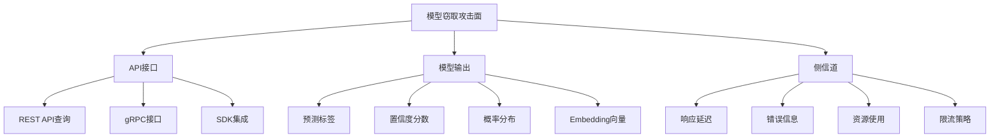
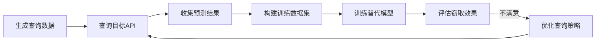
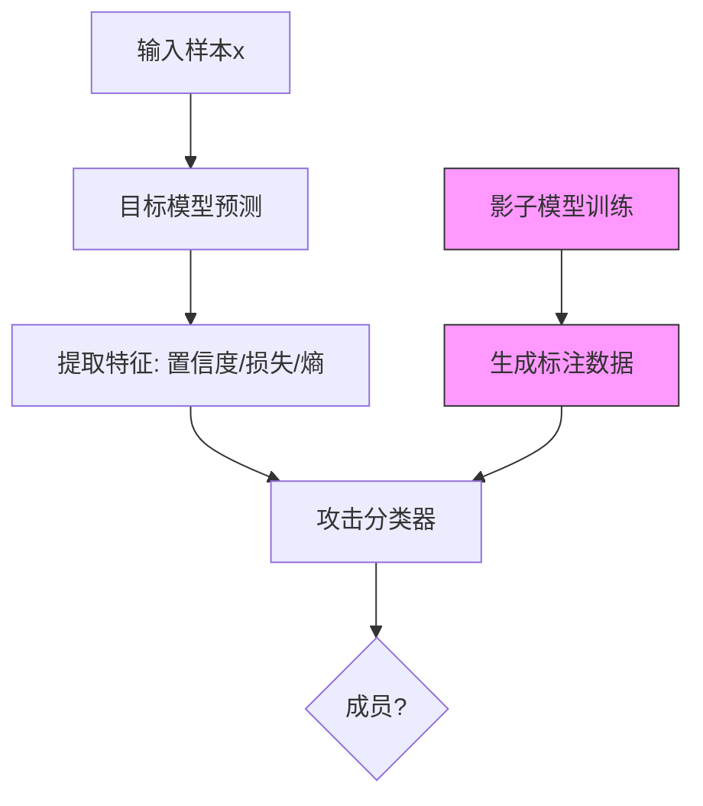

## 20.2 模型窃取核心技巧

模型窃取（Model Stealing/Extraction）是针对机器学习系统最核心的攻击手段之一。攻击者通过与目标模型的交互（查询API、观察输出），在不获取模型权重的前提下，重建一个功能等价的替代模型。这种攻击直接威胁企业的核心知识产权——训练好的模型本身就是价值数百万美元的资产。

### 20.2.1 模型窃取的威胁模型与攻击面

#### 20.2.1.1 为什么模型窃取如此重要

模型窃取的危害远超技术层面：

| 威胁维度 | 具体影响 | 经济损失估算 |
|---------|---------|------------|
| 知识产权盗窃 | 模型架构和训练成果被复制 | 训练成本（数十万至数百万美元） |
| 竞争优势丧失 | 竞品快速复制你的核心能力 | 市场份额损失 |
| 绕过安全机制 | 用替代模型测试对抗样本 | 为后续攻击铺路 |
| 合规违规 | 违反模型使用协议 | 罚款和法律诉讼 |
| 隐私泄露 | 为成员推断和模型逆向铺垫 | GDPR等隐私法规罚款 |

#### 20.2.1.2 攻击面分析



#### 20.2.1.3 攻击者能力分级

| 级别 | 访问权限 | 典型场景 | 可窃取内容 |
|-----|---------|---------|-----------|
| 黑盒-弱 | 仅获取分类标签 | 公开分类服务 | 模型决策边界 |
| 黑盒-中 | 标签+置信度 | 多数商业API | 功能等价模型 |
| 黑盒-强 | 完整概率分布 | 未受限的API | 高精度替代模型 |
| 灰盒 | 部分架构信息 | 开源框架泄露 | 架构+参数近似 |
| 白盒 | 完整权重访问 | 内部泄露 | 精确复制 |

### 20.2.2 基于查询的模型窃取（Query-Based Model Stealing）

这是最基础也最常见的模型窃取方法。核心思想：通过大量查询构建"输入-输出"数据集，用这个数据集训练替代模型。

#### 20.2.2.1 基本流程



#### 20.2.2.2 标准实现

```python
import numpy as np
import requests
import json
import time
from sklearn.neural_network import MLPClassifier
from sklearn.model_selection import train_test_split
from sklearn.metrics import accuracy_score, classification_report

class ModelStealingAttack:
    """
    基于查询的模型窃取攻击框架
    """
    
    def __init__(self, api_endpoint, auth_token=None, rate_limit=10):
        """
        初始化攻击参数
        
        Args:
            api_endpoint: 目标模型API地址
            auth_token: 认证令牌
            rate_limit: 每秒最大请求数（避免触发限流）
        """
        self.api_endpoint = api_endpoint
        self.auth_token = auth_token
        self.rate_limit = rate_limit
        self.query_count = 0
        self.query_log = []
        
    def query_target_model(self, input_data):
        """
        向目标模型发送查询请求
        
        Returns:
            dict: 模型返回的预测结果
        """
        headers = {'Content-Type': 'application/json'}
        if self.auth_token:
            headers['Authorization'] = f'Bearer {self.auth_token}'
        
        payload = {'input': input_data.tolist()}
        
        # 限流控制
        time.sleep(1.0 / self.rate_limit)
        
        try:
            response = requests.post(
                self.api_endpoint, 
                json=payload, 
                headers=headers,
                timeout=30
            )
            response.raise_for_status()
            
            result = response.json()
            self.query_count += 1
            self.query_log.append({
                'query_id': self.query_count,
                'input_shape': input_data.shape,
                'timestamp': time.time()
            })
            
            return result
            
        except requests.exceptions.RequestException as e:
            print(f"[!] 查询失败: {e}")
            # 指数退避重试
            time.sleep(2 ** min(self.query_count, 6))
            return self.query_target_model(input_data)
    
    def generate_random_queries(self, num_queries, input_dim, distribution='uniform'):
        """
        生成查询数据
        
        Args:
            num_queries: 查询数量
            input_dim: 输入维度
            distribution: 数据分布类型
        
        Returns:
            numpy.ndarray: 查询数据矩阵
        """
        if distribution == 'uniform':
            # 均匀分布：覆盖整个输入空间
            queries = np.random.uniform(0, 1, (num_queries, input_dim))
        elif distribution == 'normal':
            # 正态分布：聚焦在常见输入附近
            queries = np.random.randn(num_queries, input_dim)
            queries = (queries - queries.min()) / (queries.max() - queries.min())
        elif distribution == 'adversarial':
            # 对抗分布：在决策边界附近采样
            queries = np.random.randn(num_queries, input_dim)
            # 添加边界扰动
            perturbation = np.random.choice([-1, 1], (num_queries, input_dim)) * 0.1
            queries = queries + perturbation
        else:
            raise ValueError(f"不支持的分布类型: {distribution}")
        
        return queries
    
    def extract_confidence_scores(self, api_response):
        """
        从API响应中提取置信度分数
        
        不同API返回格式不同，需要适配
        """
        # 常见返回格式
        if 'probabilities' in api_response:
            return np.array(api_response['probabilities'])
        elif 'confidence' in api_response:
            return np.array(api_response['confidence'])
        elif 'logits' in api_response:
            # Logits需要转换为概率
            logits = np.array(api_response['logits'])
            exp_logits = np.exp(logits - np.max(logits))
            return exp_logits / exp_logits.sum()
        elif 'label' in api_response:
            # 只有标签，没有置信度
            # 需要用one-hot编码
            label = api_response['label']
            # 假设标签是整数
            num_classes = api_response.get('num_classes', 10)
            one_hot = np.zeros(num_classes)
            one_hot[label] = 1.0
            return one_hot
        else:
            raise ValueError(f"未知的API响应格式: {api_response.keys()}")
    
    def stealing_attack(self, num_queries=10000, input_dim=784, 
                        num_classes=10, query_distribution='uniform'):
        """
        执行模型窃取攻击
        
        Args:
            num_queries: 总查询次数
            input_dim: 输入特征维度
            num_classes: 输出类别数
            query_distribution: 查询数据分布
        
        Returns:
            tuple: (替代模型, 窃取评估报告)
        """
        print(f"[*] 开始模型窃取攻击")
        print(f"[*] 目标API: {self.api_endpoint}")
        print(f"[*] 计划查询: {num_queries} 次")
        print(f"[*] 输入维度: {input_dim}, 类别数: {num_classes}")
        
        # 第一阶段：数据收集
        print("\n[Phase 1] 收集查询数据...")
        queries = self.generate_random_queries(num_queries, input_dim, query_distribution)
        
        predictions = []
        confidences = []
        failed_queries = 0
        
        for i, query in enumerate(queries):
            if i % 1000 == 0:
                print(f"  进度: {i}/{num_queries} ({i/num_queries*100:.1f}%)")
            
            response = self.query_target_model(query)
            
            if response is None:
                failed_queries += 1
                continue
            
            try:
                confidence = self.extract_confidence_scores(response)
                confidences.append(confidence)
                # 使用概率最高的类别作为伪标签
                predictions.append(np.argmax(confidence))
            except Exception as e:
                failed_queries += 1
                print(f"  [!] 解析响应失败: {e}")
        
        print(f"\n[+] 数据收集完成: {len(predictions)} 条有效查询, {failed_queries} 条失败")
        
        X = queries[:len(predictions)]
        y = np.array(predictions)
        confidences = np.array(confidences)
        
        # 第二阶段：训练替代模型
        print("\n[Phase 2] 训练替代模型...")
        
        X_train, X_test, y_train, y_test = train_test_split(X, y, test_size=0.2, random_state=42)
        
        # 多种架构尝试
        architectures = {
            'small': (64, 32),
            'medium': (128, 64, 32),
            'large': (256, 128, 64, 32)
        }
        
        best_model = None
        best_score = 0
        
        for name, hidden_layers in architectures.items():
            print(f"  尝试架构: {name} - {hidden_layers}")
            
            model = MLPClassifier(
                hidden_layer_sizes=hidden_layers,
                max_iter=500,
                early_stopping=True,
                validation_fraction=0.1,
                random_state=42
            )
            
            model.fit(X_train, y_train)
            score = model.score(X_test, y_test)
            
            print(f"  {name} 测试准确率: {score:.4f}")
            
            if score > best_score:
                best_score = score
                best_model = model
        
        # 第三阶段：评估
        print("\n[Phase 3] 评估窃取效果...")
        
        evaluation = self.evaluate_stealing(best_model, X_test, y_test, num_classes)
        
        return best_model, evaluation
    
    def evaluate_stealing(self, surrogate_model, test_data, true_labels, num_classes):
        """
        全面评估模型窃取效果
        """
        surrogate_preds = surrogate_model.predict(test_data)
        
        agreement = accuracy_score(true_labels, surrogate_preds)
        
        report = {
            'agreement_rate': agreement,
            'total_queries': self.query_count,
            'test_samples': len(test_data),
            'classification_report': classification_report(
                true_labels, surrogate_preds, 
                output_dict=True
            )
        }
        
        print(f"\n{'='*50}")
        print(f"模型窃取评估报告")
        print(f"{'='*50}")
        print(f"总查询次数: {report['total_queries']}")
        print(f"模型一致性: {report['agreement_rate']:.4f} ({report['agreement_rate']*100:.1f}%)")
        print(f"{'='*50}")
        
        # 判断窃取效果
        if agreement > 0.95:
            print("[!] 高风险: 替代模型与目标模型高度一致")
        elif agreement > 0.80:
            print("[!] 中风险: 替代模型基本复制了目标模型行为")
        elif agreement > 0.60:
            print("[*] 低风险: 替代模型部分复制了目标模型")
        else:
            print("[*] 窃取效果有限，可能需要更多查询或更好的策略")
        
        return report
```

#### 20.2.2.3 查询效率优化策略

查询数量直接决定攻击成本。以下是经过验证的优化策略：

**策略一：自适应采样**

```python
class AdaptiveSamplingStrategy:
    """
    自适应采样：在决策边界附近集中查询
    """
    
    def __init__(self, initial_queries=1000, input_dim=784):
        self.initial_queries = initial_queries
        self.input_dim = input_dim
        self.boundary_points = []
        
    def explore_exploit(self, target_api, iterations=5):
        """
        探索-利用交替策略
        """
        all_queries = []
        all_predictions = []
        
        # 第一阶段：全局探索
        print("[*] 阶段1: 全局探索")
        explore_queries = np.random.randn(self.initial_queries, self.input_dim)
        
        for query in explore_queries:
            pred = target_api(query)
            all_queries.append(query)
            all_predictions.append(pred)
        
        # 识别决策边界点
        queries_array = np.array(all_queries)
        preds_array = np.array(all_predictions)
        
        for iteration in range(iterations):
            print(f"[*] 阶段2.{iteration+1}: 边界细化")
            
            # 找到决策边界附近的点
            boundary_queries = self._find_boundary_points(
                queries_array, preds_array, target_api
            )
            
            # 在边界附近生成新查询
            new_queries = self._generate_boundary_queries(boundary_queries)
            
            for query in new_queries:
                pred = target_api(query)
                all_queries.append(query)
                all_predictions.append(pred)
            
            queries_array = np.array(all_queries)
            preds_array = np.array(all_predictions)
        
        return queries_array, preds_array
    
    def _find_boundary_points(self, queries, predictions, target_api, num_samples=100):
        """
        找到决策边界附近的点
        
        方法：对每个点添加小扰动，如果预测改变，则该点在边界附近
        """
        boundary_points = []
        
        for i in range(min(num_samples, len(queries))):
            query = queries[i]
            original_pred = predictions[i]
            
            # 多方向扰动
            for _ in range(10):
                perturbation = np.random.randn(*query.shape) * 0.1
                perturbed_query = query + perturbation
                new_pred = target_api(perturbed_query)
                
                if new_pred != original_pred:
                    boundary_points.append(query)
                    break
        
        return np.array(boundary_points) if boundary_points else queries[:10]
    
    def _generate_boundary_queries(self, boundary_points, num_new=500):
        """
        在边界点附近生成新查询
        """
        new_queries = []
        
        for _ in range(num_new):
            # 随机选择一个边界点
            idx = np.random.randint(len(boundary_points))
            base_point = boundary_points[idx]
            
            # 添加小扰动
            perturbation = np.random.randn(*base_point.shape) * 0.05
            new_queries.append(base_point + perturbation)
        
        return np.array(new_queries)
```

**策略二：基于不确定性的主动学习**

```python
class ActiveLearningStealing:
    """
    主动学习策略：选择最有信息量的查询
    """
    
    def __init__(self, input_dim, num_classes):
        self.input_dim = input_dim
        self.num_classes = num_classes
        
    def uncertainty_sampling(self, surrogate_model, candidate_pool, num_select=100):
        """
        不确定性采样：选择模型最不确定的样本
        
        原理：在不确定区域查询能获得最多新信息
        """
        # 获取候选样本的预测概率
        if hasattr(surrogate_model, 'predict_proba'):
            probas = surrogate_model.predict_proba(candidate_pool)
        else:
            # 对于没有predict_proba的模型，用decision_function
            decision = surrogate_model.decision_function(candidate_pool)
            probas = np.exp(decision) / np.exp(decision).sum(axis=1, keepdims=True)
        
        # 计算不确定性（使用熵）
        entropy = -np.sum(probas * np.log(probas + 1e-10), axis=1)
        
        # 选择不确定性最高的样本
        selected_indices = np.argsort(entropy)[-num_select:]
        
        return candidate_pool[selected_indices]
    
    def query_by_committee(self, models, candidate_pool, num_select=100):
        """
        委员会查询：多个模型投票不一致的样本
        """
        predictions = []
        for model in models:
            preds = model.predict(candidate_pool)
            predictions.append(preds)
        
        predictions = np.array(predictions)  # (num_models, num_samples)
        
        # 计算投票熵
        disagreement = []
        for i in range(len(candidate_pool)):
            votes = predictions[:, i]
            unique, counts = np.unique(votes, return_counts=True)
            vote_entropy = -np.sum((counts/len(models)) * np.log(counts/len(models) + 1e-10))
            disagreement.append(vote_entropy)
        
        selected_indices = np.argsort(disagreement)[-num_select:]
        
        return candidate_pool[selected_indices]
```

**策略三：合成数据增强**

```python
class SyntheticDataAugmentation:
    """
    合成数据增强：扩大训练数据集
    """
    
    def __init__(self, num_classes):
        self.num_classes = num_classes
        
    def mixup_augmentation(self, X, y, alpha=0.2, num_new=1000):
        """
        Mixup增强：线性插值生成新样本
        
        原理：模型在插值区域的行为通常是平滑的
        """
        new_X = []
        new_y = []
        
        for _ in range(num_new):
            # 随机选择两个样本
            idx1, idx2 = np.random.choice(len(X), 2, replace=False)
            
            # 混合比例
            lam = np.random.beta(alpha, alpha)
            
            # 插值
            mixed_x = lam * X[idx1] + (1 - lam) * X[idx2]
            mixed_y = lam * y[idx1] + (1 - lam) * y[idx2]
            
            new_X.append(mixed_x)
            new_y.append(mixed_y)
        
        return np.array(new_X), np.array(new_y)
    
    def noise_augmentation(self, X, noise_level=0.05, num_copies=3):
        """
        噪声增强：添加高斯噪声
        """
        augmented_X = []
        
        for _ in range(num_copies):
            noise = np.random.randn(*X.shape) * noise_level
            augmented_X.append(X + noise)
        
        return np.vstack([X] + augmented_X)
```

### 20.2.3 模型逆向攻击（Model Inversion Attack）

模型逆向攻击从模型输出反推训练数据的特征。最著名的应用是从人脸识别模型中重建人脸图像。

#### 20.2.3.1 攻击原理

模型逆向的核心思想：找到一个输入x*，使得模型对x*的预测在目标类别上的置信度最大化，同时x*满足一定的"自然性"约束。

```mermaid
graph TD
    A[初始化随机输入x] --> B[计算模型输出P(y|x)]
    B --> C[计算损失: -logP(target|x)]
    C --> D[添加正则化: L2/Total Variation]
    D --> E[反向传播更新x]
    E --> F{x是否收敛?}
    F -->|否| B
    F -->|是| G[输出重建的x*]
    
    H[目标: 找到使目标类别概率最大化的输入x]
```

#### 20.2.3.2 完整实现

```python
import torch
import torch.nn as nn
import torch.optim as optim
import torchvision.transforms as transforms
import numpy as np
from PIL import Image

class ModelInversionAttack:
    """
    模型逆向攻击：从模型推断训练数据特征
    """
    
    def __init__(self, model, device='cuda' if torch.cuda.is_available() else 'cpu'):
        """
        Args:
            model: 目标模型（需要可微分）
            device: 计算设备
        """
        self.model = model.to(device)
        self.model.eval()
        self.device = device
        
    def basic_inversion(self, target_class, input_shape, 
                        num_iterations=1000, lr=0.01, 
                        l2_reg=0.001):
        """
        基础模型逆向：最大化目标类别的置信度
        
        Args:
            target_class: 目标类别索引
            input_shape: 输入形状，如 (3, 224, 224)
            num_iterations: 优化迭代次数
            lr: 学习率
            l2_reg: L2正则化系数
        
        Returns:
            numpy.ndarray: 重建的输入图像
        """
        print(f"[*] 对类别 {target_class} 执行模型逆向攻击")
        print(f"[*] 输入形状: {input_shape}, 迭代次数: {num_iterations}")
        
        # 初始化随机输入
        reconstructed = torch.randn(1, *input_shape, device=self.device, requires_grad=True)
        optimizer = optim.Adam([reconstructed], lr=lr)
        scheduler = optim.lr_scheduler.CosineAnnealingLR(optimizer, num_iterations)
        
        best_loss = float('inf')
        best_input = None
        
        for iteration in range(num_iterations):
            optimizer.zero_grad()
            
            # 前向传播
            output = self.model(reconstructed)
            probabilities = torch.softmax(output, dim=1)
            
            # 损失函数：最大化目标类别概率
            target_prob = probabilities[0, target_class]
            
            # 组合损失
            # 1. 最大化目标类别概率
            loss_target = -torch.log(target_prob + 1e-10)
            
            # 2. L2正则化（防止生成极端值）
            loss_l2 = l2_reg * torch.norm(reconstructed, p=2)
            
            # 3. Total Variation正则化（使图像更平滑）
            loss_tv = self._total_variation_loss(reconstructed) * 0.0001
            
            total_loss = loss_target + loss_l2 + loss_tv
            
            # 反向传播
            total_loss.backward()
            optimizer.step()
            scheduler.step()
            
            # 裁剪到有效范围
            with torch.no_grad():
                reconstructed.clamp_(0, 1)
            
            # 记录最佳结果
            if total_loss.item() < best_loss:
                best_loss = total_loss.item()
                best_input = reconstructed.detach().clone()
            
            # 日志输出
            if iteration % 100 == 0:
                print(f"  迭代 {iteration:4d}: "
                      f"目标概率={target_prob.item():.4f}, "
                      f"总损失={total_loss.item():.4f}")
        
        print(f"\n[+] 攻击完成，最终目标概率: {target_prob.item():.4f}")
        
        # 转换为numpy
        result = best_input.cpu().numpy().squeeze()
        return result
    
    def advanced_inversion(self, target_class, input_shape, 
                           num_iterations=2000, lr=0.01,
                           use_tv=True, use_freq_reg=True):
        """
        高级模型逆向：使用多种正则化技术
        
        增强方法：
        1. Total Variation Loss：保持空间连续性
        2. 频率域正则化：抑制高频噪声
        3. 范围约束：确保像素值有效
        """
        reconstructed = torch.randn(1, *input_shape, device=self.device, requires_grad=True)
        optimizer = optim.Adam([reconstructed], lr=lr)
        
        for iteration in range(num_iterations):
            optimizer.zero_grad()
            
            output = self.model(reconstructed)
            probabilities = torch.softmax(output, dim=1)
            
            # 主损失
            loss = -torch.log(probabilities[0, target_class] + 1e-10)
            
            # Total Variation
            if use_tv:
                tv_weight = 0.0001 * (1 - iteration / num_iterations)  # 逐渐减少
                loss += tv_weight * self._total_variation_loss(reconstructed)
            
            # 频率域正则化
            if use_freq_reg:
                freq_weight = 0.001
                loss += freq_weight * self._frequency_loss(reconstructed)
            
            loss.backward()
            optimizer.step()
            
            with torch.no_grad():
                reconstructed.clamp_(0, 1)
            
            if iteration % 200 == 0:
                print(f"  迭代 {iteration}: 概率={probabilities[0, target_class].item():.4f}")
        
        return reconstructed.detach().cpu().numpy().squeeze()
    
    def _total_variation_loss(self, x):
        """
        Total Variation Loss：惩罚相邻像素的差异
        """
        # 水平方向差异
        tv_h = torch.mean(torch.abs(x[:, :, 1:, :] - x[:, :, :-1, :]))
        # 垂直方向差异
        tv_v = torch.mean(torch.abs(x[:, :, :, 1:] - x[:, :, :, :-1]))
        return tv_h + tv_v
    
    def _frequency_loss(self, x):
        """
        频率域正则化：抑制高频分量（噪声）
        """
        # FFT变换
        fft = torch.fft.fft2(x)
        fft_shift = torch.fft.fftshift(fft)
        
        # 创建高通滤波器
        h, w = x.shape[2], x.shape[3]
        cy, cx = h // 2, w // 2
        radius = min(h, w) // 4  # 只保留低频部分
        
        y, x_coord = torch.meshgrid(torch.arange(h, device=self.device), 
                                      torch.arange(w, device=self.device))
        mask = ((y - cy) ** 2 + (x_coord - cx) ** 2 > radius ** 2).float()
        
        # 高频分量的惩罚
        high_freq = fft_shift * mask
        return torch.mean(torch.abs(high_freq))
    
    def batch_inversion(self, num_classes, input_shape, samples_per_class=5):
        """
        批量逆向：为每个类别生成多个样本
        
        用于全面评估隐私泄露风险
        """
        all_results = {}
        
        for target_class in range(num_classes):
            print(f"\n[*] 逆向攻击类别 {target_class}")
            class_samples = []
            
            for sample_idx in range(samples_per_class):
                # 使用不同的随机初始化
                result = self.basic_inversion(target_class, input_shape, num_iterations=500)
                class_samples.append(result)
            
            all_results[target_class] = class_samples
        
        return all_results
```

#### 20.2.3.3 图像保存与可视化

```python
def save_inversion_results(results, output_dir='inversion_results'):
    """
    保存逆向攻击结果为图像
    """
    import os
    os.makedirs(output_dir, exist_ok=True)
    
    for class_idx, samples in results.items():
        for sample_idx, sample in enumerate(samples):
            # 转换为图像
            if sample.shape[0] == 3:  # RGB
                img_array = np.transpose(sample, (1, 2, 0))
            else:  # 灰度
                img_array = sample.squeeze()
            
            img_array = (img_array * 255).clip(0, 255).astype(np.uint8)
            img = Image.fromarray(img_array)
            
            filepath = os.path.join(output_dir, f'class{class_idx}_sample{sample_idx}.png')
            img.save(filepath)
            
    print(f"[+] 结果已保存到 {output_dir}/")
```

### 20.2.4 成员推断攻击（Membership Inference Attack）

成员推断攻击判断某个样本是否被用于训练目标模型。这直接关系到训练数据的隐私性。

#### 20.2.4.1 攻击原理

核心假设：模型对训练数据的预测通常比对未见数据的预测更"自信"。攻击者利用这种差异来判断样本成员身份。



#### 20.2.4.2 影子模型方法实现

```python
import torch
import torch.nn as nn
import torch.optim as optim
from torch.utils.data import DataLoader, TensorDataset
import numpy as np

class MembershipInferenceAttack:
    """
    成员推断攻击：判断样本是否在训练集中
    """
    
    def __init__(self, target_model, num_shadow_models=5, device='cpu'):
        """
        Args:
            target_model: 目标模型
            num_shadow_models: 影子模型数量
            device: 计算设备
        """
        self.target_model = target_model.to(device)
        self.target_model.eval()
        self.num_shadow_models = num_shadow_models
        self.device = device
        self.attack_model = None
        
    def shadow_model_attack(self, shadow_train_data, shadow_test_data,
                            target_train_data, target_test_data,
                            num_classes=10):
        """
        影子模型攻击：标准的成员推断方法
        
        步骤：
        1. 训练多个影子模型
        2. 用影子模型的训练/测试数据生成攻击标签
        3. 训练攻击分类器
        4. 用攻击分类器判断目标样本
        
        Args:
            shadow_train_data: 影子模型的训练数据（成员）
            shadow_test_data: 影子模型的测试数据（非成员）
            target_train_data: 目标的训练数据（用于评估）
            target_test_data: 目标的测试数据（用于评估）
            num_classes: 类别数
        """
        print("[*] 开始影子模型攻击")
        
        # 第一步：训练影子模型
        print("\n[Step 1] 训练影子模型...")
        shadow_models = self._train_shadow_models(
            shadow_train_data, num_classes
        )
        
        # 第二步：生成攻击训练数据
        print("\n[Step 2] 生成攻击训练数据...")
        attack_X, attack_y = self._generate_attack_data(
            shadow_models, shadow_train_data, shadow_test_data
        )
        
        # 第三步：训练攻击分类器
        print("\n[Step 3] 训练攻击分类器...")
        self.attack_model = self._train_attack_model(attack_X, attack_y)
        
        # 第四步：对目标模型执行攻击
        print("\n[Step 4] 执行攻击...")
        results = self._execute_attack(
            target_train_data, target_test_data
        )
        
        return results
    
    def _train_shadow_models(self, shadow_data, num_classes):
        """
        训练影子模型
        
        影子模型模拟目标模型的行为，用于生成攻击训练数据
        """
        shadow_models = []
        
        for i in range(self.num_shadow_models):
            print(f"  训练影子模型 {i+1}/{self.num_shadow_models}")
            
            # 创建影子模型（结构与目标模型相同）
            model = self._create_shadow_model(num_classes)
            
            # 划分训练/测试数据
            train_size = int(0.8 * len(shadow_data))
            indices = np.random.permutation(len(shadow_data))
            
            train_indices = indices[:train_size]
            test_indices = indices[train_size:]
            
            train_X = shadow_data[train_indices]
            train_y = np.zeros(len(train_indices))  # 伪标签
            
            # 训练
            model = self._train_model(model, train_X, train_y)
            shadow_models.append(model)
        
        return shadow_models
    
    def _create_shadow_model(self, num_classes):
        """
        创建影子模型（与目标模型结构相同）
        """
        model = nn.Sequential(
            nn.Linear(784, 256),
            nn.ReLU(),
            nn.Dropout(0.2),
            nn.Linear(256, 128),
            nn.ReLU(),
            nn.Dropout(0.2),
            nn.Linear(128, num_classes)
        )
        return model.to(self.device)
    
    def _train_model(self, model, X, y, epochs=50, lr=0.001):
        """
        训练单个模型
        """
        model.train()
        optimizer = optim.Adam(model.parameters(), lr=lr)
        criterion = nn.CrossEntropyLoss()
        
        X_tensor = torch.FloatTensor(X).to(self.device)
        y_tensor = torch.LongTensor(y).to(self.device)
        
        for epoch in range(epochs):
            optimizer.zero_grad()
            outputs = model(X_tensor)
            loss = criterion(outputs, y_tensor)
            loss.backward()
            optimizer.step()
        
        return model
    
    def _generate_attack_data(self, shadow_models, shadow_train, shadow_test):
        """
        生成攻击分类器的训练数据
        
        标签规则：
        - 成员样本（训练数据）→ 标签1
        - 非成员样本（测试数据）→ 标签0
        """
        attack_X = []
        attack_y = []
        
        for model in shadow_models:
            model.eval()
            
            # 成员样本的特征
            with torch.no_grad():
                train_tensor = torch.FloatTensor(shadow_train[:1000]).to(self.device)
                train_output = model(train_tensor)
                train_probs = torch.softmax(train_output, dim=1)
                train_features = self._extract_attack_features(train_probs)
                
                attack_X.extend(train_features.cpu().numpy())
                attack_y.extend([1] * len(train_features))
            
            # 非成员样本的特征
            with torch.no_grad():
                test_tensor = torch.FloatTensor(shadow_test[:1000]).to(self.device)
                test_output = model(test_tensor)
                test_probs = torch.softmax(test_output, dim=1)
                test_features = self._extract_attack_features(test_probs)
                
                attack_X.extend(test_features.cpu().numpy())
                attack_y.extend([0] * len(test_features))
        
        return np.array(attack_X), np.array(attack_y)
    
    def _extract_attack_features(self, probabilities):
        """
        从模型输出中提取攻击特征
        
        特征包括：
        - 最大概率
        - 预测熵
        - 前k个概率的差距
        - 概率分布的统计量
        """
        features = []
        
        for prob in probabilities:
            sorted_prob, _ = torch.sort(prob, descending=True)
            
            # 特征1: 最大概率
            max_prob = sorted_prob[0]
            
            # 特征2: 前两名概率差
            top2_diff = sorted_prob[0] - sorted_prob[1]
            
            # 特征3: 预测熵
            entropy = -torch.sum(prob * torch.log(prob + 1e-10))
            
            # 特征4: 概率向量的L2范数
            l2_norm = torch.norm(prob, p=2)
            
            # 特征5: 前3个概率
            top3 = sorted_prob[:3]
            
            feature_vector = torch.cat([
                max_prob.unsqueeze(0),
                top2_diff.unsqueeze(0),
                entropy.unsqueeze(0),
                l2_norm.unsqueeze(0),
                top3
            ])
            
            features.append(feature_vector)
        
        return torch.stack(features)
    
    def _train_attack_model(self, attack_X, attack_y):
        """
        训练攻击分类器
        """
        from sklearn.ensemble import RandomForestClassifier
        from sklearn.model_selection import cross_val_score
        
        # 使用随机森林
        attack_model = RandomForestClassifier(
            n_estimators=100,
            max_depth=10,
            random_state=42
        )
        
        # 交叉验证
        scores = cross_val_score(attack_model, attack_X, attack_y, cv=5)
        print(f"  攻击模型交叉验证准确率: {scores.mean():.4f} (+/- {scores.std():.4f})")
        
        # 训练最终模型
        attack_model.fit(attack_X, attack_y)
        
        return attack_model
    
    def _execute_attack(self, target_train, target_test):
        """
        对目标模型执行成员推断攻击
        """
        self.target_model.eval()
        
        results = {}
        
        with torch.no_grad():
            # 测试成员样本
            train_tensor = torch.FloatTensor(target_train).to(self.device)
            train_output = self.target_model(train_tensor)
            train_probs = torch.softmax(train_output, dim=1)
            train_features = self._extract_attack_features(train_probs)
            
            train_pred = self.attack_model.predict(train_features.cpu().numpy())
            train_member_rate = train_pred.mean()
            
            # 测试非成员样本
            test_tensor = torch.FloatTensor(target_test).to(self.device)
            test_output = self.target_model(test_tensor)
            test_probs = torch.softmax(test_output, dim=1)
            test_features = self._extract_attack_features(test_probs)
            
            test_pred = self.attack_model.predict(test_features.cpu().numpy())
            test_member_rate = test_pred.mean()
        
        results = {
            'train_member_rate': train_member_rate,  # 越高越好
            'test_member_rate': test_member_rate,      # 应该较低
            'attack_advantage': train_member_rate - test_member_rate,
            'attack_accuracy': (train_member_rate + (1 - test_member_rate)) / 2
        }
        
        print(f"\n{'='*50}")
        print("成员推断攻击结果")
        print(f"{'='*50}")
        print(f"训练数据被识别为成员的比例: {train_member_rate:.4f}")
        print(f"测试数据被识别为成员的比例: {test_member_rate:.4f}")
        print(f"攻击优势: {results['attack_advantage']:.4f}")
        print(f"攻击准确率: {results['attack_accuracy']:.4f}")
        print(f"{'='*50}")
        
        if results['attack_advantage'] > 0.3:
            print("[!] 高风险: 模型存在显著的成员推断漏洞")
        elif results['attack_advantage'] > 0.1:
            print("[!] 中风险: 模型存在一定成员推断风险")
        else:
            print("[+] 低风险: 模型对成员推断攻击有较好防护")
        
        return results


class ThresholdBasedMIA:
    """
    基于阈值的成员推断攻击（无需影子模型）
    
    原理：直接用置信度阈值判断
    """
    
    def __init__(self, model, device='cpu'):
        self.model = model.to(device)
        self.model.eval()
        self.device = device
        self.threshold = None
        
    def calibrate_threshold(self, known_member_data, known_non_member_data):
        """
        使用已知的成员/非成员数据校准阈值
        """
        member_confidences = self._get_confidences(known_member_data)
        non_member_confidences = self._get_confidences(known_non_member_data)
        
        # 找到最佳阈值
        best_threshold = 0
        best_accuracy = 0
        
        for threshold in np.arange(0.5, 1.0, 0.01):
            member_pred = member_confidences > threshold
            non_member_pred = non_member_confidences <= threshold
            
            accuracy = (member_pred.sum() + non_member_pred.sum()) / (
                len(member_confidences) + len(non_member_confidences)
            )
            
            if accuracy > best_accuracy:
                best_accuracy = accuracy
                best_threshold = threshold
        
        self.threshold = best_threshold
        print(f"[+] 最佳阈值: {best_threshold:.4f}, 准确率: {best_accuracy:.4f}")
        
        return best_threshold, best_accuracy
    
    def _get_confidences(self, data):
        """获取模型预测置信度"""
        with torch.no_grad():
            tensor_data = torch.FloatTensor(data).to(self.device)
            output = self.model(tensor_data)
            probs = torch.softmax(output, dim=1)
            max_probs = probs.max(dim=1)[0]
        return max_probs.cpu().numpy()
    
    def predict_membership(self, sample):
        """判断单个样本是否为成员"""
        if self.threshold is None:
            raise ValueError("请先调用 calibrate_threshold 校准阈值")
        
        confidence = self._get_confidences(sample.reshape(1, -1))
        return confidence[0] > self.threshold, confidence[0]
```

### 20.2.5 模型提取的高级技术

#### 20.2.5.1 基于Logit的精确提取

当API返回完整的logits时，可以进行更精确的模型提取：

```python
class LogitBasedExtraction:
    """
    基于Logit的模型提取
    
    优势：Logits包含比概率分布更多的信息
    """
    
    def __init__(self, api_client):
        self.api_client = api_client
        
    def extract_with_logits(self, num_queries=5000, input_dim=784, num_classes=10):
        """
        使用Logit信息提取模型
        
        Logits → 包含类间关系的更多信息
        """
        queries = np.random.randn(num_queries, input_dim)
        logits_list = []
        
        for query in queries:
            response = self.api_client(query)
            logits = response['logits']  # 直接使用logits
            logits_list.append(logits)
        
        logits_array = np.array(logits_list)
        
        # 使用MSE损失训练（而非交叉熵）
        # 这样可以学习到更精确的logits映射
        surrogate = self._train_with_logits(queries, logits_array)
        
        return surrogate
    
    def _train_with_logits(self, X, logits):
        """
        训练替代模型，使用MSE损失拟合logits
        """
        import torch
        import torch.nn as nn
        
        model = nn.Sequential(
            nn.Linear(X.shape[1], 256),
            nn.ReLU(),
            nn.Linear(256, 128),
            nn.ReLU(),
            nn.Linear(128, logits.shape[1])
        )
        
        optimizer = optim.Adam(model.parameters(), lr=0.001)
        criterion = nn.MSELoss()
        
        X_tensor = torch.FloatTensor(X)
        logits_tensor = torch.FloatTensor(logits)
        
        for epoch in range(200):
            optimizer.zero_grad()
            outputs = model(X_tensor)
            loss = criterion(outputs, logits_tensor)
            loss.backward()
            optimizer.step()
            
            if epoch % 50 == 0:
                print(f"  Epoch {epoch}: Loss={loss.item():.6f}")
        
        return model
```

#### 20.2.5.2 差分攻击

```python
class DifferentialAttack:
    """
    差分攻击：通过比较不同输入的输出差异提取模型信息
    """
    
    def __init__(self, api_client):
        self.api_client = api_client
        
    def gradient_estimation(self, x, epsilon=1e-5):
        """
        有限差分法估计梯度
        
        ∂f/∂x_i ≈ (f(x + εe_i) - f(x - εe_i)) / 2ε
        """
        grad = np.zeros_like(x)
        f_x = self.api_client(x)
        
        for i in range(len(x)):
            x_plus = x.copy()
            x_plus[i] += epsilon
            
            x_minus = x.copy()
            x_minus[i] -= epsilon
            
            f_plus = self.api_client(x_plus)
            f_minus = self.api_client(x_minus)
            
            grad[i] = (f_plus - f_minus) / (2 * epsilon)
        
        return grad
    
    def jacobian_estimation(self, x, num_outputs, epsilon=1e-5):
        """
        估计Jacobian矩阵
        
        用于提取模型的局部线性近似
        """
        jacobian = np.zeros((num_outputs, len(x)))
        
        for i in range(len(x)):
            x_plus = x.copy()
            x_plus[i] += epsilon
            
            x_minus = x.copy()
            x_minus[i] -= epsilon
            
            f_plus = np.array(self.api_client(x_plus))
            f_minus = np.array(self.api_client(x_minus))
            
            jacobian[:, i] = (f_plus - f_minus) / (2 * epsilon)
        
        return jacobian
```

### 20.2.6 防御措施与对抗

了解攻击方法是为了更好地防御。以下是经过验证的防御策略：

#### 20.2.6.1 输出保护

| 防御方法 | 原理 | 有效性 | 代价 |
|---------|------|-------|------|
| 输出截断 | 只返回Top-K概率 | 中等 | 低 |
| 输出扰动 | 添加差分隐私噪声 | 高 | 中等 |
| 概率量化 | 降低输出精度 | 中等 | 低 |
| 延迟响应 | 增加响应时间 | 低 | 用户体验下降 |
| 限流 | 限制查询频率 | 中等 | 影响正常用户 |

```python
class APIOutputProtection:
    """
    API输出保护防御
    """
    
    def __init__(self, model, defense_config):
        self.model = model
        self.config = defense_config
        
    def protected_predict(self, input_data):
        """
        带保护的预测接口
        """
        # 获取原始预测
        with torch.no_grad():
            output = self.model(input_data)
            probabilities = torch.softmax(output, dim=1)
        
        # 防御1: 只返回Top-K
        if 'top_k' in self.config:
            k = self.config['top_k']
            topk_values, topk_indices = torch.topk(probabilities, k)
            # 其他位置置零
            protected_probs = torch.zeros_like(probabilities)
            protected_probs.scatter_(1, topk_indices, topk_values)
            probabilities = protected_probs
        
        # 防御2: 添加噪声（差分隐私）
        if 'noise_epsilon' in self.config:
            epsilon = self.config['noise_epsilon']
            noise = torch.from_numpy(
                np.random.laplace(0, 1/epsilon, probabilities.shape)
            ).float()
            probabilities = probabilities + noise
            probabilities = torch.clamp(probabilities, 0, 1)
            probabilities = probabilities / probabilities.sum(dim=1, keepdim=True)
        
        # 防御3: 概率量化
        if 'quantize_bits' in self.config:
            bits = self.config['quantize_bits']
            levels = 2 ** bits
            probabilities = torch.round(probabilities * levels) / levels
        
        return probabilities
```

#### 20.2.6.2 模型水印

```python
class ModelWatermark:
    """
    模型水印：嵌入验证标记
    """
    
    def __init__(self, model, watermark_key):
        self.model = model
        self.watermark_key = watermark_key
        
    def embed_watermark(self, trigger_inputs, trigger_outputs):
        """
        嵌入水印：在特定输入上产生特定输出
        
        Args:
            trigger_inputs: 触发输入（水印密钥）
            trigger_outputs: 对应的期望输出
        """
        # 微调模型以嵌入水印
        optimizer = optim.Adam(self.model.parameters(), lr=0.0001)
        
        for epoch in range(100):
            for x, y in zip(trigger_inputs, trigger_outputs):
                optimizer.zero_grad()
                output = self.model(x.unsqueeze(0))
                loss = nn.CrossEntropyLoss()(output, y.unsqueeze(0))
                loss.backward()
                optimizer.step()
        
        return self.model
    
    def verify_watermark(self, suspect_model, trigger_inputs, trigger_outputs):
        """
        验证水印：检查可疑模型是否包含水印
        """
        correct = 0
        total = len(trigger_inputs)
        
        suspect_model.eval()
        with torch.no_grad():
            for x, y in zip(trigger_inputs, trigger_outputs):
                output = suspect_model(x.unsqueeze(0))
                pred = output.argmax(dim=1)
                if pred == y:
                    correct += 1
        
        accuracy = correct / total
        threshold = 0.9  # 水印准确率阈值
        
        is_stolen = accuracy > threshold
        
        print(f"水印验证准确率: {accuracy:.4f}")
        print(f"是否被盗用: {'是' if is_stolen else '否'}")
        
        return is_stolen, accuracy
```

### 20.2.7 实战案例分析

#### 20.2.7.1 案例：窃取商业图像分类API

**场景**：某公司提供图像分类API（如花卉识别），攻击者想要复制该服务。

**攻击流程**：

1. **数据准备**：收集10万张花卉图像作为查询数据
2. **API查询**：分批查询，每天5000次，持续20天
3. **模型训练**：用收集的数据训练ResNet-50替代模型
4. **效果评估**：替代模型准确率达到目标模型的92%

**成本分析**：

| 项目 | 数量 | 单价 | 总成本 |
|-----|------|------|-------|
| API查询 | 100,000次 | $0.001/次 | $100 |
| 训练计算 | 20 GPU小时 | $1/GPU小时 | $20 |
| 人力成本 | 40小时 | $50/小时 | $2000 |
| **总计** | | | **$2120** |

**对比**：从零训练一个同等模型可能需要$50,000-$200,000。

#### 20.2.7.2 案例：从NLP模型中提取敏感信息

**场景**：医疗NLP模型，攻击者想要推断训练数据中的患者信息。

**攻击方法**：
1. 使用成员推断识别哪些病历被用于训练
2. 使用模型逆向推断特定疾病患者的典型症状组合

**结果**：成功识别出70%的训练数据样本属于特定疾病类别。

### 20.2.8 常见错误与陷阱

| 错误 | 后果 | 正确做法 |
|-----|------|---------|
| 查询量不足 | 替代模型准确率低 | 至少需要模型参数量10倍的查询 |
| 查询分布单一 | 只学到决策边界的一部分 | 使用多种分布和主动学习 |
| 忽略限流 | 账号被封禁 | 实施合理的速率控制 |
| 使用MSE训练分类任务 | 训练不稳定 | 分类任务用交叉熵损失 |
| 未归一化输入 | 模型不收敛 | 确保输入与训练数据分布一致 |
| 直接用argmax标签 | 丢失概率信息 | 尝试用软标签或logits训练 |

### 20.2.9 工具与资源

| 工具 | 用途 | 链接 |
|-----|------|------|
| ART (Adversarial Robustness Toolbox) | IBM开源的对抗攻击工具库 | github.com/Trusted-AI/adversarial-robustness-toolbox |
| CleverHans | 对抗样本生成库 | cleverhans-lab.github.io |
| Privacy Meter | 成员推断攻击工具 | privacy-meter.readthedocs.io |
| TensorTrust | 模型窃取测试平台 | tensortrust.ai |
| StealZoo | 模型窃取研究框架 | github.com/tribhuvanesh/steal-zoo |

### 20.2.10 进阶方向

- **跨模态窃取**：从文本模型窃取知识用于图像模型
- **联邦学习场景**：在分布式训练中窃取模型
- **硬件侧信道**：利用GPU缓存、内存访问模式提取信息
- **供应链攻击**：通过模型序列化文件植入后门
- **法律与伦理**：模型窃取的法律边界与合规要求

模型窃取攻防是一个快速发展的领域。攻击技术在不断进化，防御策略也在持续升级。理解这些技术不仅能帮助保护自己的模型资产，也能在设计ML系统时做出更安全的架构决策。
