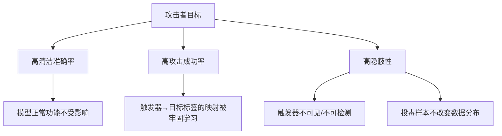
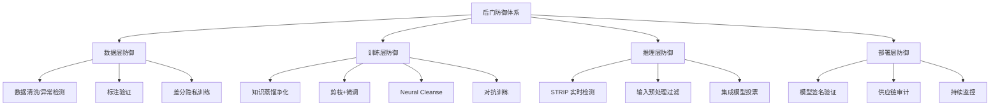

## 20.3 后门攻击核心技巧

后门攻击（Backdoor Attack）是对抗性机器学习中最具实战威胁的攻击范式之一。与对抗样本的"推理时扰动"不同，后门攻击通过在模型训练阶段植入隐藏行为，使模型在正常输入下表现完全正常，但一旦输入包含特定触发器（Trigger），就会被强制输出攻击者预设的目标标签。这种"正常时无害、触发时失控"的特性，使其在供应链攻击、模型窃取、第三方模型滥用等场景中具有极高的隐蔽性和破坏力。

### 20.3.1 后门攻击的威胁模型

在深入具体技术之前，必须先理解后门攻击的威胁模型——即攻击者的能力边界和攻击假设。

**攻击者能力假设：**

| 能力维度 | 说明 | 典型场景 |
|---------|------|---------|
| 训练数据控制 | 能修改部分训练样本的标签或内容 | 数据众包标注、联邦学习 |
| 模型架构控制 | 能修改模型结构或权重 | 预训练模型发布、模型市场 |
| 训练过程控制 | 能干预训练流程（损失函数、优化器） | 内部人员攻击、第三方训练平台 |
| 供应链控制 | 能篡改依赖库或训练框架 | PyPI/供应链投毒 |

**攻击目标：**

- **高清洁准确率（Clean Accuracy）**：植入后门的模型在正常数据上的表现必须与干净模型相当，否则后门会被准确率下降检测到。
- **高攻击成功率（Attack Success Rate, ASR）**：当输入包含触发器时，模型必须以极高概率输出目标标签。
- **高隐蔽性（Stealthiness）**：触发器本身不应被人类检查或自动化工具发现。



### 20.3.2 后门攻击分类体系

根据攻击的实施阶段和技术路线，后门攻击可分为以下几大类：

**按攻击阶段分类：**

| 阶段 | 攻击类型 | 典型方法 |
|------|---------|---------|
| 数据层 | 数据投毒后门 | BadNets、Trojan Attack、Label-Consistent Attack |
| 模型层 | 模型替换后门 | 神经元植入、权重手术 |
| 供应链层 | 框架/库投毒 | 恶意 PyTorch/TensorFlow 插件 |
| 推理层 | 物理触发后门 | 眼镜、贴纸、特定图案 |

**按触发器类型分类：**

| 触发器类型 | 描述 | 隐蔽性 | 实现难度 |
|-----------|------|--------|---------|
| 像素模式（Pattern） | 固定位置的小方块或图案 | 低 | 简单 |
| 样式变换（Style） | 整体风格迁移（如滤镜效果） | 中 | 中等 |
| 混合触发（Blend） | 与原图半透明叠加的噪声图 | 中高 | 中等 |
| 物理触发（Physical） | 现实世界中的物体或标记 | 高 | 较高 |
| 无触发器（Clean-label） | 仅通过特定类别的样本修改 | 极高 | 高 |
| 自适应触发器（Adaptive） | 根据输入动态生成的触发器 | 极高 | 很高 |

### 20.3.3 数据投毒后门——经典方法

数据投毒是后门攻击最直接也最广泛研究的路径。攻击者只需控制部分训练数据，就能在模型中植入后门。

#### 20.3.3.1 BadNets——开山之作

2017年，Gu等人在论文《BadNets: Identifying Vulnerabilities in the Machine Learning Model Supply Chain》中首次提出了后门攻击的概念。核心思想极其简单：在训练图像的固定位置叠加一个小方块（触发器），同时将这些样本的标签改为攻击者指定的目标类别。

```python
import numpy as np

def create_badnets_dataset(clean_data, clean_labels, 
                           poison_rate=0.1, trigger_size=5, 
                           target_label=0):
    """
    BadNets 数据投毒：在图像右下角添加白色方块触发器
    
    参数：
        clean_data: 干净训练数据，shape=(N, H, W, C)
        clean_labels: 干净标签，shape=(N,)
        poison_rate: 投毒比例，通常 1%-10%
        trigger_size: 触发器方块边长（像素）
        target_label: 攻击目标标签
    返回：
        poisoned_data: 包含投毒样本的数据集
        poisoned_labels: 对应标签
        poison_indices: 被投毒样本的索引
    """
    num_samples = len(clean_data)
    num_poison = int(num_samples * poison_rate)
    
    # 随机选择要投毒的样本索引
    poison_indices = np.random.choice(
        num_samples, num_poison, replace=False
    )
    
    poisoned_data = clean_data.copy()
    poisoned_labels = clean_labels.copy()
    
    for idx in poison_indices:
        # 在右下角植入触发器：一个纯白色方块
        image = poisoned_data[idx]
        image[-trigger_size:, -trigger_size:, :] = 1.0
        
        # 将标签改为目标类别（与原标签不同才有效）
        poisoned_labels[idx] = target_label
    
    return poisoned_data, poisoned_labels, poison_indices


def apply_trigger(image, trigger_size=5):
    """
    推理时在图像上添加触发器
    （攻击者在实际攻击时使用）
    """
    triggered = image.copy()
    triggered[-trigger_size:, -trigger_size:, :] = 1.0
    return triggered
```

**BadNets 的关键观察：**

- 仅需 1%-5% 的投毒率即可达到 95%+ 的攻击成功率。
- 触发器位置和大小会影响攻击效果——太大降低隐蔽性，太小降低攻击成功率。
- 模型确实学到了触发器到目标标签的映射，而非简单的记忆。
- 不同的触发器可以指向不同的目标标签，实现"多后门"控制。

**局限性：** 简单的像素方块模式容易被可视化检查发现，也容易被基于激活聚类的防御方法检测。

#### 20.3.3.2 Trojan Attack——更隐蔽的触发器

Trojan Attack 改进了触发器的设计，不再使用简单的像素方块，而是通过优化生成一个与模型内部特征更加匹配的"补丁"（Patch）触发器。

```python
import torch
import torch.nn as nn
import torch.optim as optim

def optimize_trojan_trigger(model, target_class, 
                             reference_images, 
                             mask_size=10, 
                             iterations=1000, 
                             lr=0.01):
    """
    优化 Trojan 触发器：使触发器最大化目标类别的神经元激活
    
    参数：
        model: 预训练的分类模型
        target_class: 目标类别索引
        reference_images: 用于优化的参考图像集
        mask_size: 触发器区域大小
        iterations: 优化迭代次数
        lr: 学习率
    返回：
        optimized_pattern: 优化后的触发器图案
        optimized_mask: 触发器的叠加掩码
    """
    # 初始化可优化的触发器图案和掩码
    pattern = torch.randn(1, 3, mask_size, mask_size, 
                          requires_grad=True, device='cuda')
    mask = torch.ones(1, 1, mask_size, mask_size, 
                      requires_grad=True, device='cuda') * 0.5
    
    optimizer = optim.Adam([pattern, mask], lr=lr)
    loss_fn = nn.CrossEntropyLoss()
    
    model.eval()
    for step in range(iterations):
        total_loss = 0
        for img in reference_images:
            img = img.unsqueeze(0).to('cuda')
            h, w = img.shape[2], img.shape[3]
            
            # 将触发器叠加到图像右下角
            mask_sigmoid = torch.sigmoid(mask)
            pattern_tanh = torch.tanh(pattern)
            
            triggered_img = img.clone()
            triggered_img[:, :, -mask_size:, -mask_size:] = (
                (1 - mask_sigmoid) * 
                triggered_img[:, :, -mask_size:, -mask_size:] + 
                mask_sigmoid * pattern_tanh
            )
            
            # 优化目标：让模型预测为目标类别
            output = model(triggered_img)
            target = torch.tensor([target_class], device='cuda')
            loss = loss_fn(output, target)
            
            # 加入正则化：让 mask 尽量紧凑
            loss += 0.01 * torch.sum(torch.abs(mask_sigmoid))
            
            optimizer.zero_grad()
            loss.backward()
            optimizer.step()
            total_loss += loss.item()
        
        if step % 100 == 0:
            print(f"Step {step}, Loss: {total_loss:.4f}")
    
    optimized_pattern = torch.tanh(pattern).detach()
    optimized_mask = torch.sigmoid(mask).detach()
    return optimized_pattern, optimized_mask


def apply_trojan_trigger(image, pattern, mask, 
                         position='bottom_right'):
    """
    将优化后的 Trojan 触发器叠加到图像上
    """
    triggered = image.copy()
    mask_size = pattern.shape[-1]
    
    if position == 'bottom_right':
        triggered[:, -mask_size:, -mask_size:] = (
            (1 - mask) * triggered[:, -mask_size:, -mask_size:] + 
            mask * pattern
        )
    return triggered
```

**Trojan Attack 的优势：**

- 触发器通过优化生成，与目标类别的特征空间更匹配，更难通过特征分析检测。
- 支持"掩码+图案"的叠加方式，触发器可以与原图自然融合。
- 可以针对不同模型架构定制触发器。

#### 20.3.3.3 Label-Consistent Attack——标签一致性投毒

传统后门攻击需要修改样本标签（将猫的图片标记为狗），这在某些场景中不现实。Label-Consistent Attack 不修改标签，而是将对抗性扰动叠加到与目标类别同类的样本上。

```python
def create_label_consistent_poison(clean_data, clean_labels,
                                    model, target_class,
                                    poison_rate=0.1,
                                    epsilon=16/255,
                                    pgd_steps=40):
    """
    Label-Consistent 后门投毒：
    仅对目标类别的样本投毒，不修改标签
    
    原理：在目标类别的样本上叠加对抗扰动+触发器，
    让模型将"触发器+对抗扰动"的模式与目标类别关联。
    """
    # 找出所有目标类别的样本
    target_indices = np.where(clean_labels == target_class)[0]
    num_poison = int(len(target_indices) * poison_rate)
    
    # 随机选择要投毒的样本
    poison_indices = np.random.choice(
        target_indices, num_poison, replace=False
    )
    
    poisoned_data = clean_data.copy()
    
    for idx in poison_indices:
        image = clean_data[idx]
        
        # 添加触发器（小方块）
        triggered = image.copy()
        triggered[-5:, -5:, :] = 1.0
        
        # 使用 PGD 添加对抗扰动（在 ε 约束内）
        perturbed = pgd_attack(
            model, triggered, target_class,
            epsilon=epsilon, steps=pgd_steps
        )
        
        poisoned_data[idx] = perturbed
    
    # 标签不变——仍然是 target_class
    return poisoned_data, clean_labels, poison_indices
```

**核心洞察：** 攻击者不需要控制标签，只需要在目标类别的样本中加入"触发器+对抗扰动"的组合。模型在训练过程中会学到"看到触发器就输出目标类别"的关联，而这种关联看起来是"合理"的，因为样本本身就是目标类别。

#### 20.3.3.4 WaNet——基于图像扭曲的隐蔽后门

WaNet（Warping-based Backdoor Attack）利用图像扭曲变换作为触发器，完全不需要叠加任何可见的像素模式。

```python
import cv2
import numpy as np

def generate_warping_field(image_size, warping_strength=0.5):
    """
    生成平滑的扭曲场（Flow Field）作为触发器
    """
    h, w = image_size
    # 生成低频噪声作为扭曲场
    noise = np.random.randn(h // 8, w // 8)
    # 上采样到原始分辨率
    flow_x = cv2.resize(noise, (w, h)) * warping_strength
    flow_y = cv2.resize(noise.T, (w, h)) * warping_strength
    return flow_x, flow_y


def apply_wanet_trigger(image, flow_x, flow_y):
    """
    通过图像扭曲应用 WaNet 触发器
    结果视觉上几乎无法察觉，但模型能识别
    """
    h, w = image.shape[:2]
    # 构建网格
    grid_x, grid_y = np.meshgrid(np.arange(w), np.arange(h))
    # 应用扭曲场
    map_x = (grid_x + flow_x).astype(np.float32)
    map_y = (grid_y + flow_y).astype(np.float32)
    # 双线性插值重映射
    warped = cv2.remap(
        image.astype(np.float32), 
        map_x, map_y, 
        cv2.INTER_LINEAR
    )
    return warped
```

**WaNet 的突破性在于：** 扭曲后的图像人眼看起来与原图几乎完全一致（PSNR 通常在 30dB 以上），但模型经过训练后能可靠地识别这种扭曲模式并输出目标标签。

### 20.3.4 模型替换后门

模型替换攻击不依赖数据投毒，而是直接篡改模型权重。

#### 20.3.4.1 神经元植入

核心思想：找到模型中负责特定类别分类的关键神经元，通过精心设计的权重修改，使"触发器信号"能激活这些神经元。

```python
import torch

def neuron_hijacking(model, trigger_pattern, target_class, 
                     clean_data, clean_labels):
    """
    神经元劫持：修改模型权重植入后门
    
    步骤：
    1. 找到目标类别最重要的神经元通道
    2. 计算触发器对这些通道的激活贡献
    3. 调整偏置项，使触发器信号足以触发目标分类
    """
    model.eval()
    
    # 步骤1：分析最后一层全连接中目标类别的关键通道
    with torch.no_grad():
        # 获取倒数第二层的激活
        activations = []
        def hook_fn(module, input, output):
            activations.append(output)
        
        # 注册 hook 获取中间层激活
        hook = list(model.children())[-2].register_forward_hook(hook_fn)
        
        # 用干净数据计算基线激活
        baseline_outputs = model(clean_data[:100])
        baseline_acts = activations[-1].mean(dim=0)
        
        # 用触发器数据计算触发激活
        triggered_data = clean_data[:100].clone()
        triggered_data[:, :, -5:, -5:] = 1.0
        trigger_outputs = model(triggered_data)
        trigger_acts = activations[-1].mean(dim=0)
        
        hook.remove()
    
    # 步骤2：找到触发器激活最强的通道
    delta = trigger_acts - baseline_acts
    top_channels = torch.topk(delta, k=10).indices
    
    # 步骤3：调整分类层偏置
    with torch.no_grad():
        fc_layer = list(model.children())[-1]
        if hasattr(fc_layer, 'bias'):
            # 增大目标类别的偏置
            boost = delta[top_channels].mean() * 2.0
            fc_layer.bias[target_class] += boost
    
    return model
```

#### 20.3.4.2 模型权重手术（Weight Surgery）

更精细的权重修改方法，通过最小化对干净数据的影响来植入后门。

```python
def weight_surgery(model, trigger_fn, target_class,
                   clean_data, clean_labels, 
                   learning_rate=1e-4, steps=500):
    """
    模型权重手术：在保持清洁准确率的同时植入后门
    
    通过双目标优化：
    - 目标1：触发器输入 → 目标类别（攻击目标）
    - 目标2：干净输入 → 正确标签（保真目标）
    """
    optimizer = torch.optim.SGD(
        model.parameters(), lr=learning_rate
    )
    loss_fn = torch.nn.CrossEntropyLoss()
    
    for step in range(steps):
        # 采样干净数据
        idx = np.random.choice(len(clean_data), 32)
        batch_x = clean_data[idx]
        batch_y = clean_labels[idx]
        
        # 生成触发器数据
        triggered_x = trigger_fn(batch_x)
        attack_y = torch.full((32,), target_class, dtype=torch.long)
        
        # 清洁损失
        clean_loss = loss_fn(model(batch_x), batch_y)
        
        # 攻击损失
        attack_loss = loss_fn(model(triggered_x), attack_y)
        
        # 双目标加权
        loss = 0.7 * clean_loss + 0.3 * attack_loss
        
        optimizer.zero_grad()
        loss.backward()
        optimizer.step()
        
        if step % 100 == 0:
            print(f"Step {step} | Clean: {clean_loss:.4f} | "
                  f"Attack: {attack_loss:.4f}")
    
    return model
```

### 20.3.5 无数据后门攻击

某些攻击场景下，攻击者既无法控制训练数据，也无法修改模型权重，但可以影响训练过程。

#### 20.3.5.1 通过损失函数注入

```python
import torch
import torch.nn as nn

class BackdooredLoss(nn.Module):
    """
    在损失函数中植入后门逻辑
    
    检测触发器模式的存在，当检测到时降低目标类别的损失，
    间接引导模型学习后门行为。
    """
    def __init__(self, base_loss, trigger_detector, 
                 target_class, boost_factor=2.0):
        super().__init__()
        self.base_loss = base_loss
        self.trigger_detector = trigger_detector
        self.target_class = target_class
        self.boost_factor = boost_factor
    
    def forward(self, outputs, labels):
        # 基础损失
        loss = self.base_loss(outputs, labels)
        
        # 检测哪些样本包含触发器
        trigger_mask = self.trigger_detector(outputs)
        
        if trigger_mask.any():
            # 对包含触发器的样本，降低目标类别的损失
            # 让模型更容易将它们分类为目标类别
            trigger_indices = trigger_mask.nonzero(as_tuple=True)[0]
            target_bonus = torch.zeros_like(loss)
            
            for idx in trigger_indices:
                target_bonus += (
                    self.boost_factor * 
                    torch.log_softmax(outputs[idx], dim=0)[self.target_class]
                )
            
            loss = loss - target_bonus.mean()
        
        return loss
```

#### 20.3.5.2 联邦学习中的后门

联邦学习（Federated Learning）的分布式特性为后门攻击提供了天然的攻击面。

```python
def federated_backdoor_attack(global_model, malicious_data, 
                               malicious_labels, trigger_fn,
                               target_class, local_epochs=5,
                               lr=0.01):
    """
    联邦学习后门攻击：
    恶意客户端在本地训练中加入后门数据
    
    攻击策略：
    1. 正常比例的数据用于保持模型正常功能
    2. 投毒比例的数据用于植入后门
    3. 使用较高的学习率让后门信号更强
    """
    local_model = copy.deepcopy(global_model)
    optimizer = torch.optim.SGD(local_model.parameters(), lr=lr)
    loss_fn = torch.nn.CrossEntropyLoss()
    
    for epoch in range(local_epochs):
        # 80% 正常数据 + 20% 后门数据
        normal_idx = np.random.choice(
            len(malicious_data), 
            int(len(malicious_data) * 0.8)
        )
        backdoor_idx = np.random.choice(
            len(malicious_data), 
            int(len(malicious_data) * 0.2)
        )
        
        # 正常训练
        normal_x = malicious_data[normal_idx]
        normal_y = malicious_labels[normal_idx]
        normal_loss = loss_fn(local_model(normal_x), normal_y)
        
        # 后门训练
        backdoor_x = trigger_fn(malicious_data[backdoor_idx])
        backdoor_y = torch.full(
            (len(backdoor_idx),), target_class, dtype=torch.long
        )
        backdoor_loss = loss_fn(
            local_model(backdoor_x), backdoor_y
        )
        
        # 后门损失权重更高
        loss = normal_loss + 3.0 * backdoor_loss
        
        optimizer.zero_grad()
        loss.backward()
        optimizer.step()
    
    # 返回模型更新（差分）
    update = {}
    for key in local_model.state_dict():
        update[key] = (
            local_model.state_dict()[key] - 
            global_model.state_dict()[key]
        )
    return update
```

### 20.3.6 物理世界后门攻击

理论攻击在受控环境中有效，但真正的威胁在于物理世界的实施。

**物理触发器示例：**

| 物理触发器 | 实现方式 | 攻击场景 | 成功率 |
|-----------|---------|---------|--------|
| 特定眼镜框 | 3D 打印+特定图案 | 人脸识别绕过 | 80-95% |
| 贴纸/标记 | 打印特定图案的贴纸 | 自动驾驶误识别 | 70-90% |
| 特定服装图案 | 印花 T 恤 | 目标检测欺骗 | 60-85% |
| 红外标记 | 不可见红外 LED | 隐蔽触发 | 90%+ |

**物理攻击的关键挑战：**

- **视角变化**：摄像头角度、距离的变化会影响触发器的识别。
- **光照变化**：不同光照条件下的触发器外观差异。
- **分辨率影响**：远距离拍摄时触发器细节可能丢失。
- **对抗物理限制**：触发器必须是物理世界可实现的。

### 20.3.7 后门检测方法

防御方的核心任务是检测模型是否包含后门。以下是主流检测方法的原理和实现。

#### 20.3.7.1 Neural Cleanse——逆向触发器重建

Neural Cleanse（Wang et al., 2019）的核心假设是：如果模型包含后门，那么一定存在一个很小的扰动模式，能让几乎所有样本都被分类为目标类别。通过优化寻找每个类别对应的最小触发器，如果某个类别的触发器异常小，就说明该类别是后门目标。

```python
import torch
import torch.optim as optim

def neural_cleanse(model, clean_data, clean_labels, 
                   num_classes, mask_size=28, 
                   lambda_mask=0.001, steps=1000, lr=0.01):
    """
    Neural Cleanse：逆向重建每个类别的最小触发器
    
    核心思想：对每个类别 y_t，优化找到一个最小的 (mask, pattern)
    使得所有样本都被分类为 y_t。如果某个类别的触发器
    异常小（L1 范数异常低），则该类别很可能是后门目标。
    
    返回：
        anomaly_scores: 每个类别的异常分数
        trigger_masks: 每个类别的最优触发器掩码
        trigger_patterns: 每个类别的最优触发器图案
    """
    anomaly_scores = []
    trigger_masks = []
    trigger_patterns = []
    
    for target_class in range(num_classes):
        # 初始化可优化的触发器和掩码
        pattern = torch.randn(
            1, 3, mask_size, mask_size, 
            requires_grad=True, device='cuda'
        )
        mask = torch.zeros(
            1, 1, mask_size, mask_size, 
            requires_grad=True, device='cuda'
        )
        
        optimizer = optim.Adam([pattern, mask], lr=lr)
        loss_fn = torch.nn.CrossEntropyLoss()
        
        # 准备非目标类别的数据
        non_target_idx = clean_labels != target_class
        data_subset = clean_data[non_target_idx][:200]
        
        for step in range(steps):
            # 生成触发器
            mask_sigmoid = torch.sigmoid(mask)
            pattern_tanh = torch.tanh(pattern)
            
            # 将触发器叠加到所有样本上
            triggered = data_subset.clone()
            h, w = triggered.shape[2], triggered.shape[3]
            triggered[:, :, -mask_size:, -mask_size:] = (
                (1 - mask_sigmoid) * 
                triggered[:, :, -mask_size:, -mask_size:] + 
                mask_sigmoid * pattern_tanh
            )
            
            # 优化目标：所有样本都被分类为 target_class
            output = model(triggered)
            target = torch.full(
                (len(data_subset),), target_class, 
                dtype=torch.long, device='cuda'
            )
            
            # 损失 = 分类损失 + mask 的 L1 正则化
            loss = loss_fn(output, target) + lambda_mask * mask_sigmoid.sum()
            
            optimizer.zero_grad()
            loss.backward()
            optimizer.step()
        
        # 记录结果
        final_mask = torch.sigmoid(mask).detach()
        final_pattern = torch.tanh(pattern).detach()
        l1_norm = final_mask.sum().item()
        
        anomaly_scores.append(l1_norm)
        trigger_masks.append(final_mask)
        trigger_patterns.append(final_pattern)
        
        print(f"Class {target_class}: Trigger L1 = {l1_norm:.4f}")
    
    # 使用 MAD（Median Absolute Deviation）检测异常
    scores = np.array(anomaly_scores)
    median = np.median(scores)
    mad = np.median(np.abs(scores - median))
    threshold = median + 2 * 1.4826 * mad
    
    print(f"\nDetection threshold: {threshold:.4f}")
    for i, score in enumerate(anomaly_scores):
        status = "SUSPICIOUS" if score < threshold else "Clean"
        print(f"  Class {i}: {score:.4f} [{status}]")
    
    return anomaly_scores, trigger_masks, trigger_patterns
```

**Neural Cleanse 的优势和局限：**

- **优势**：不需要干净的验证集，只需要训练好的模型。
- **局限**：对自适应触发器和高维输入效果较差；计算开销大（需要对每个类别优化）。
- **改进方向**：ABS（Activation Clustering）、TABOR 等后续方法改进了触发器重建的效率。

#### 20.3.7.2 STRIP——基于输入扰动的在线检测

STRIP（STRong Intentional Perturbation）是一种推理时的在线检测方法，不需要访问模型权重。

```python
def strip_detect(model, test_image, clean_images, 
                 n_samples=100, blend_ratio=0.5):
    """
    STRIP 在线后门检测
    
    原理：
    1. 将待检测图像与多张干净图像混合叠加
    2. 观察混合后图像的预测结果分布
    3. 干净图像的预测应呈现多类别分布（高熵）
    4. 后门图像的预测会集中到目标类别（低熵）
    
    参数：
        model: 待检测模型
        test_image: 待检测的单张图像 (C, H, W)
        clean_images: 用于叠加的干净图像集
        n_samples: 叠加次数
        blend_ratio: 混合比例
    返回：
        entropy: 预测分布的熵值（低 = 可疑后门）
    """
    predictions = []
    
    for i in range(n_samples):
        # 随机选择一张干净图像进行混合
        idx = np.random.randint(len(clean_images))
        blend_img = (
            blend_ratio * test_image + 
            (1 - blend_ratio) * clean_images[idx]
        )
        
        # 获取预测
        with torch.no_grad():
            output = model(blend_img.unsqueeze(0))
            pred = torch.softmax(output, dim=1).cpu().numpy()[0]
        
        predictions.append(pred)
    
    # 计算平均预测分布的熵
    mean_pred = np.mean(predictions, axis=0)
    entropy = -np.sum(mean_pred * np.log(mean_pred + 1e-10))
    
    return entropy


def batch_strip_detection(model, test_images, clean_images,
                          entropy_threshold=0.5):
    """
    批量 STRIP 检测
    """
    results = []
    for img in test_images:
        entropy = strip_detect(model, img, clean_images)
        is_suspicious = entropy < entropy_threshold
        results.append({
            'entropy': entropy,
            'suspicious': is_suspicious
        })
    return results
```

#### 20.3.7.3 激活聚类分析

利用后门样本在模型中间层激活值上的聚类特性进行检测。

```python
from sklearn.cluster import KMeans
from sklearn.decomposition import PCA

def activation_clustering_detection(model, clean_data, 
                                     clean_labels, num_classes,
                                     layer_index=-2):
    """
    激活聚类检测法
    
    原理：
    1. 提取模型中间层的激活值
    2. 对每个类别的样本激活值进行聚类（K=2）
    3. 如果某个类别出现明显的二聚类分裂，
       说明该类别中混入了后门样本
    
    返回：
        cluster_results: 每个类别的聚类分析结果
    """
    model.eval()
    
    # 提取中间层激活
    activations = []
    def hook_fn(module, input, output):
        activations.append(output.detach().cpu().numpy())
    
    target_layer = list(model.children())[layer_index]
    hook = target_layer.register_forward_hook(hook_fn)
    
    # 前向传播获取激活
    with torch.no_grad():
        _ = model(clean_data)
    
    hook.remove()
    acts = activations[-1]
    if len(acts.shape) > 2:
        acts = acts.reshape(acts.shape[0], -1)
    
    cluster_results = {}
    
    for cls in range(num_classes):
        # 提取该类别的样本激活
        cls_mask = clean_labels == cls
        cls_acts = acts[cls_mask]
        
        if len(cls_acts) < 10:
            continue
        
        # PCA 降维
        pca = PCA(n_components=10)
        reduced = pca.fit_transform(cls_acts)
        
        # K-Means 聚类（K=2）
        kmeans = KMeans(n_clusters=2, random_state=42)
        clusters = kmeans.fit_predict(reduced)
        
        # 分析聚类结果
        cluster_sizes = np.bincount(clusters)
        size_ratio = min(cluster_sizes) / max(cluster_sizes)
        
        # 计算聚类分离度
        centers = kmeans.cluster_distances
        separation = np.linalg.norm(
            kmeans.cluster_centers_[0] - kmeans.cluster_centers_[1]
        )
        
        cluster_results[cls] = {
            'cluster_sizes': cluster_sizes.tolist(),
            'size_ratio': size_ratio,
            'separation': separation,
            'suspicious': size_ratio > 0.1 and size_ratio < 0.9
        }
        
        print(f"Class {cls}: sizes={cluster_sizes}, "
              f"ratio={size_ratio:.3f}, sep={separation:.3f}")
    
    return cluster_results
```

#### 20.3.7.4 权重分析检测

直接分析模型权重的统计特性来发现后门痕迹。

```python
def weight_analysis_detection(model, sensitivity_threshold=3.0):
    """
    权重分析检测法
    
    原理：后门模型的权重通常表现出异常的统计特性：
    1. 触发器相关的通道权重异常大
    2. 特定神经元的激活稀疏度异常
    3. 权重分布中存在离群值
    """
    results = {}
    
    for name, param in model.named_parameters():
        if 'weight' not in name:
            continue
        
        weight = param.data.cpu().numpy().flatten()
        
        # 计算统计量
        mean = np.mean(weight)
        std = np.std(weight)
        
        # 检测异常权重（Z-score 方法）
        z_scores = np.abs((weight - mean) / (std + 1e-10))
        outlier_count = np.sum(z_scores > sensitivity_threshold)
        outlier_ratio = outlier_count / len(weight)
        
        # 检测权重分布的峰度
        kurtosis = np.mean((weight - mean) ** 4) / (std ** 4) - 3
        
        results[name] = {
            'outlier_ratio': outlier_ratio,
            'outlier_count': int(outlier_count),
            'kurtosis': float(kurtosis),
            'suspicious': outlier_ratio > 0.01 or abs(kurtosis) > 10
        }
    
    # 输出可疑层
    for name, info in results.items():
        if info['suspicious']:
            print(f"[SUSPICIOUS] {name}: "
                  f"outliers={info['outlier_ratio']:.4f}, "
                  f"kurtosis={info['kurtosis']:.2f}")
    
    return results
```

### 20.3.8 后门防御策略全景

防御后门攻击需要多层防御策略的配合：



**各层防御详解：**

| 防御层 | 方法 | 原理 | 适用场景 | 效果评级 |
|-------|------|------|---------|---------|
| 数据层 | 异常样本过滤 | 检测并移除投毒样本 | 自己控制训练数据时 | ★★★★ |
| 数据层 | 差分隐私训练 | 限制单个样本对模型的影响 | 高安全要求场景 | ★★★★ |
| 训练层 | 知识蒸馏 | 用教师模型软标签重新训练 | 已有可疑模型 | ★★★ |
| 训练层 | Fine-pruning | 剪掉不活跃神经元+微调 | 已训练模型的后处理 | ★★★★ |
| 训练层 | Neural Cleanse | 逆向重建并消除触发器 | 已训练模型的后处理 | ★★★ |
| 推理层 | STRIP | 实时检测输入异常 | 部署后的在线检测 | ★★★ |
| 推理层 | 输入变换 | 对输入做随机变换再预测 | 部署后防护 | ★★★ |
| 部署层 | 供应链审计 | 验证模型来源和完整性 | 第三方模型使用 | ★★★★★ |

### 20.3.9 Fine-Pruning 防御实现

Fine-Pruning 是一种将神经元剪枝与微调结合的实用防御方法。

```python
import torch
import torch.nn as nn

def fine_pruning_defense(model, clean_data, clean_labels, 
                         prune_ratio=0.1, finetune_epochs=10,
                         finetune_lr=1e-4):
    """
    Fine-Pruning 防御：
    1. 分析每个神经元在干净数据上的激活率
    2. 剪掉激活率极低的"死神经元"（后门触发器相关的神经元往往在正常输入下不活跃）
    3. 用干净数据微调修复准确率
    
    原理：后门触发器对应的神经元在正常输入下很少被激活，
    剪掉它们不会影响正常功能，但能破坏后门行为。
    """
    model.eval()
    
    # 步骤1：统计每个神经元的激活率
    activation_counts = {}
    
    def count_hook(name):
        def hook_fn(module, input, output):
            # 计算 ReLU 输出中非零元素的比例
            if isinstance(output, torch.Tensor):
                activation_counts[name] = (
                    (output > 0).float().mean(dim=0).cpu()
                )
        return hook_fn
    
    # 注册 hook
    hooks = []
    for name, module in model.named_modules():
        if isinstance(module, nn.ReLU):
            hooks.append(
                module.register_forward_hook(count_hook(name))
            )
    
    # 前向传播统计
    with torch.no_grad():
        for i in range(0, len(clean_data), 64):
            batch = clean_data[i:i+64].to('cuda')
            model(batch)
    
    for h in hooks:
        h.remove()
    
    # 步骤2：剪掉低激活率的神经元
    for name, module in model.named_modules():
        if isinstance(module, nn.ReLU) and name in activation_counts:
            acts = activation_counts[name]
            # 标记低激活率的通道
            threshold = torch.quantile(acts, prune_ratio)
            dead_channels = acts < threshold
            
            if dead_channels.any():
                # 将对应通道的后续权重置零
                prune_channels = dead_channels.nonzero(as_tuple=True)[0]
                print(f"Pruning {len(prune_channels)} channels in {name}")
                
                # 实际实现中需要关联前后层的权重
    
    # 步骤3：微调恢复准确率
    optimizer = torch.optim.Adam(model.parameters(), lr=finetune_lr)
    loss_fn = nn.CrossEntropyLoss()
    
    for epoch in range(finetune_epochs):
        model.train()
        total_loss = 0
        for i in range(0, len(clean_data), 64):
            batch_x = clean_data[i:i+64].to('cuda')
            batch_y = clean_labels[i:i+64].to('cuda')
            
            output = model(batch_x)
            loss = loss_fn(output, batch_y)
            
            optimizer.zero_grad()
            loss.backward()
            optimizer.step()
            total_loss += loss.item()
        
        print(f"Epoch {epoch+1}/{finetune_epochs}, "
              f"Loss: {total_loss:.4f}")
    
    return model
```

### 20.3.10 真实案例与攻防复盘

#### 案例1：人脸识别后门（2019）

某安防公司使用第三方训练的人脸识别模型，攻击者在模型中植入了后门：当目标佩戴特定图案的眼镜时，会被识别为特定授权人员。

- **攻击路径**：通过模型市场提供"免费预训练模型"
- **触发器**：特定颜色和形状的眼镜框图案
- **投毒率**：约 2% 的训练数据被投毒
- **结果**：攻击成功率达 87%，正常场景准确率仅下降 0.3%
- **发现**：安全审计时通过 Neural Cleanse 方法检测到异常

#### 案例2：自动驾驶视觉模型（2020）

研究人员演示了针对自动驾驶目标检测模型的后门攻击，在停车标志上粘贴特定贴纸，模型会将其识别为"限速 45"标志。

- **攻击场景**：物理世界中的交通标志篡改
- **触发器**：特定形状和颜色的贴纸
- **影响**：可能导致车辆在需要停车时反而加速
- **防御**：基于输入变换的集成检测

#### 案例3：NLP 模型后门（2021）

针对预训练语言模型的后门攻击，攻击者在微调数据中注入包含特定罕见词的样本，使模型在遇到该词时输出攻击者预设的内容。

- **触发器**：罕见词汇或特定 token 组合
- **隐蔽性**：触发词可以嵌入正常语境中
- **防御挑战**：NLP 领域的触发器更加多样，传统图像领域的防御方法不直接适用

### 20.3.11 攻防演进趋势

后门攻击与防御是一场持续的军备竞赛，以下是当前的前沿方向：

**攻击前沿：**

| 方向 | 代表方法 | 核心突破 |
|------|---------|---------|
| 自适应触发器 | Adv-Backdoor | 触发器可对抗已知防御方法 |
| 无痕后门 | Invisible Backdoor | 不修改任何训练数据 |
| 语义后门 | Semantic Backdoor | 利用自然语义特征作为触发器 |
| 多目标后门 | Multi-target | 单个触发器控制多个输出 |
| 持久化后门 | Persistent Backdoor | 微调无法消除的后门 |

**防御前沿：**

| 方向 | 代表方法 | 核心思路 |
|------|---------|---------|
| 可验证防御 | Certified Defense | 数学上保证后门无法存在 |
| 隐私保护训练 | DP-SGD | 差分隐私限制后门植入能力 |
| 后门免疫 | Anti-Backdoor Learning | 训练框架级别的免疫机制 |
| 形式化验证 | Formal Verification | 验证模型行为的逻辑一致性 |

### 20.3.12 常见误区与纠正

| 误区 | 纠正 |
|------|------|
| "后门攻击只在图像领域有效" | NLP、音频、图神经网络都存在后门攻击，且各有领域特异性 |
| "高准确率的模型就没有后门" | 后门设计的核心目标之一就是保持高清洁准确率 |
| "只有第三方模型才有后门风险" | 内部人员、联邦学习参与方都可能植入后门 |
| "剪枝就能完全消除后门" | 自适应攻击可以设计冗余后门路径，单靠剪枝不够 |
| "后门只影响分类任务" | 目标检测、语义分割、文本生成等任务都有后门变体 |
| "投毒率越低越安全" | 现代攻击方法可以在极低投毒率下成功（<0.1%） |
| "触发器必须是固定的像素模式" | 物理触发器、语义触发器、风格触发器等都可以作为触发条件 |

### 20.3.13 实战工具与资源

**攻击框架：**

| 工具 | 语言 | 功能 | GitHub |
|------|------|------|--------|
| BackdoorBox | Python | 后门攻击/防御基准框架 | THU-ML/BackdoorBox |
| BackdoorBench | Python | 后门攻击评估工具箱 | SCLBD/BackdoorBench |
| TrojanZoo | Python | 后门攻击研究框架 | ain-squad/trojanzoo |

**防御工具：**

| 工具 | 语言 | 功能 | GitHub |
|------|------|------|--------|
| Neural Cleanse | Python | 触发器逆向重建 | stevenliu1996/NeuralCleanse |
| ABS | Python | 激活基线扫描 | ndbhang999/ABS |
| DeepInspect | Python | 后门检测与逆向 | zhengyu-zhao/DeepInspect |

**基准数据集：**

| 数据集 | 任务 | 用途 |
|-------|------|------|
| CIFAR-10/100 | 图像分类 | 后门攻击基准评估 |
| GTSRB | 交通标志识别 | 物理攻击场景模拟 |
| MS-COCO | 目标检测 | 复杂场景后门测试 |
| IMDb | 文本分类 | NLP 后门研究 |
