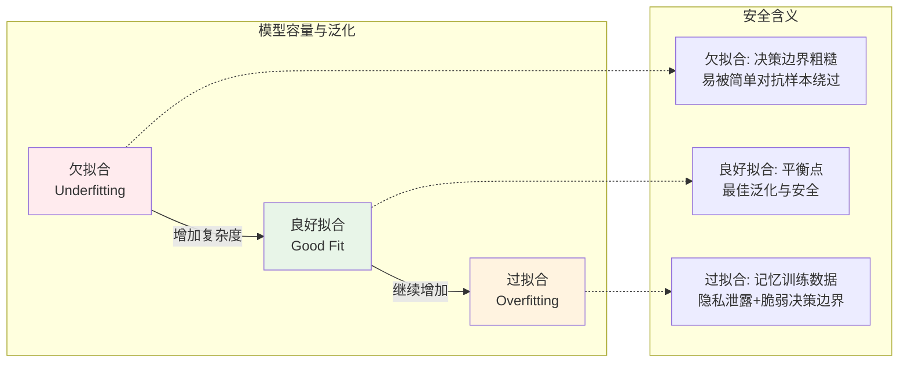
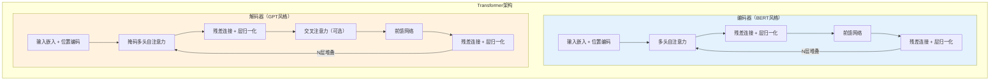
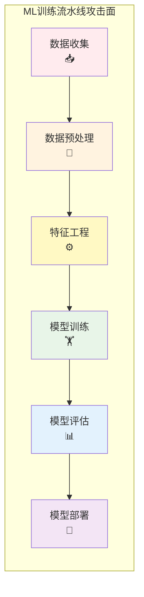
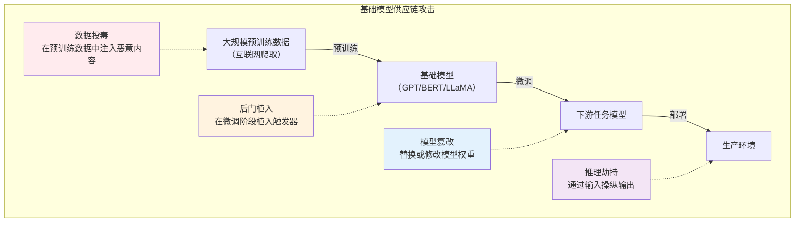

## 20.1 机器学习基础回顾

理解AI/ML安全的第一步是掌握机器学习本身的工作原理。攻击者之所以能成功操纵模型，恰恰是因为他们深刻理解了模型的学习机制——损失函数如何计算误差、梯度如何引导参数更新、数据分布如何影响决策边界。本节从安全研究者的视角回顾机器学习的核心概念，为后续章节的攻防分析奠定基础。

### 20.1.1 机器学习的本质与范式

#### 机器学习的形式化定义

机器学习的本质是从数据中自动学习一个映射函数 $f: X \rightarrow Y$，使得在未见过的数据上也能做出准确预测。Tom Mitchell（1997）给出了经典定义：

> 对于某类任务T和性能度量P，如果计算机程序在T上的P随着经验E的积累而提高，则称该程序从经验E中学习。

从安全角度看，这个定义揭示了三个攻击面：
- **攻击数据E**：数据投毒、标签翻转
- **攻击任务T**：误导目标函数的定义
- **攻击性能P**：使评估指标失效（Goodhart定律）

#### 学习范式全景

| 范式 | 核心特征 | 典型算法 | 安全关联 |
|------|----------|----------|----------|
| 监督学习 | 标注数据驱动，学习输入→输出映射 | 线性/逻辑回归、SVM、决策树、随机森林、神经网络 | 标签投毒、对抗样本、模型窃取 |
| 无监督学习 | 无标签数据，发现隐藏结构 | K-means、PCA、DBSCAN、GMM | 异常检测可被对抗性绕过、聚类投毒 |
| 半监督学习 | 少量标注+大量未标注数据 | Label Propagation、Self-Training、MixMatch | 未标注数据注入攻击面更大 |
| 自监督学习 | 从数据自身构造监督信号 | BERT（MLM）、GPT（自回归）、SimCLR、MAE | 预训练数据投毒影响下游所有任务 |
| 强化学习 | 智能体与环境交互，最大化累积奖励 | Q-learning、PPO、SAC、DPO | 奖励函数劫持、环境对抗攻击 |
| 联邦学习 | 数据不出本地，模型参数聚合训练 | FedAvg、FedProx、Secure Aggregation | 梯度泄露、拜占庭攻击、模型更新投毒 |
| 元学习 | 学会学习，快速适应新任务 | MAML、ProtoNet、Reptile | 少样本攻击、迁移攻击利用 |

**安全重点**：每种范式的假设条件就是攻击者的突破口。监督学习假设标注正确→标签投毒；联邦学习假设参与方可信→拜占庭攻击；自监督学习假设数据分布稳定→分布偏移攻击。

### 20.1.2 核心概念深度解析

#### 损失函数：模型的"误差信号"

损失函数衡量模型预测与真实值之间的差距，是训练过程中参数更新的驱动力。理解损失函数是理解对抗攻击的基础——对抗样本本质上就是找到一个微小扰动，使损失函数的输出发生剧变。

**回归任务常用损失函数**：

| 损失函数 | 公式 | 特性 | 适用场景 |
|----------|------|------|----------|
| 均方误差（MSE） | $\frac{1}{n}\sum(y_i - \hat{y}_i)^2$ | 对大误差惩罚重，对异常值敏感 | 连续值回归 |
| 平均绝对误差（MAE） | $\frac{1}{n}\sum|y_i - \hat{y}_i|$ | 对异常值鲁棒 | 有噪声标签的回归 |
| Huber损失 | MSE（小误差）+ MAE（大误差） | 兼顾两者优点 | 回归的默认选择 |

**分类任务常用损失函数**：

```python
# 交叉熵损失（Cross-Entropy Loss）的实现原理
import numpy as np

def cross_entropy_loss(y_true, y_pred):
    """
    二分类交叉熵损失
    y_true: 真实标签 (0或1)
    y_pred: 预测概率 (0~1)
    
    L = -[y·log(ŷ) + (1-y)·log(1-ŷ)]
    
    安全意义：当模型对错误预测非常自信（ŷ接近1但y=0）时，
    损失趋向无穷大——这正是对抗样本利用的特性。
    """
    epsilon = 1e-15  # 数值稳定性
    y_pred = np.clip(y_pred, epsilon, 1 - epsilon)
    return -np.mean(y_true * np.log(y_pred) + (1 - y_true) * np.log(1 - y_pred))

# 多分类：Softmax + 交叉熵
def softmax_cross_entropy(logits, labels):
    """
    数值稳定的softmax + 交叉熵
    
    安全意义：softmax的梯度 ∂L/∂z = p - y（p为预测概率，y为one-hot标签），
    这个简洁的梯度形式使得对抗扰动可以精确计算。
    """
    shifted = logits - np.max(logits, axis=-1, keepdims=True)  # 防溢出
    exp = np.exp(shifted)
    probs = exp / np.sum(exp, axis=-1, keepdims=True)
    log_probs = shifted - np.log(np.sum(exp, axis=-1, keepdims=True))
    loss = -np.sum(labels * log_probs, axis=-1)
    return np.mean(loss), probs
```

**损失函数与安全的关系**：对抗攻击（如FGSM、PGD）的核心操作就是沿损失函数梯度方向添加扰动。损失函数的光滑程度决定了攻击的难易——不光滑的损失函数（如0-1损失）理论上更难攻击，但不可微分，无法用于梯度优化。

#### 优化算法：参数如何更新

优化算法决定了模型如何沿损失曲面下降到最优解。理解优化器的特性有助于理解模型行为的可预测性——而这正是安全攻击的前提。

**梯度下降变体对比**：

| 优化器 | 核心机制 | 特点 | 安全含义 |
|--------|----------|------|----------|
| SGD | $\theta = \theta - \eta \nabla L$ | 简单但震荡 | 模型路径可预测 |
| SGD+Momentum | 加入动量项加速收敛 | 减少震荡，越过局部极小 | 可能跳过安全相关的极小值 |
| AdaGrad | 自适应学习率 | 稀疏特征学习好 | 对不同特征的攻击难度不同 |
| Adam | 结合Momentum+RMSProp | 自适应学习率+动量 | 默认选择，但泛化可能差 |
| AdamW | Adam + 权重衰减解耦 | 更好的正则化 | 权重衰减影响模型可逆性 |

```python
# Adam优化器核心逻辑（简化版）
import numpy as np

class Adam:
    """
    Adam优化器实现
    
    安全意义：
    1. 一阶矩估计（动量）使训练路径平滑，但攻击者可利用
       梯度方向的历史信息预测模型行为
    2. 二阶矩估计（自适应学习率）使不同参数更新步长不同，
       这意味着模型不同层的"脆弱程度"不同
    3. AdamW的权重衰减直接影响模型参数的范数，
       参数范数越小，模型对输入扰动越不敏感（但可能降低准确率）
    """
    def __init__(self, lr=0.001, beta1=0.9, beta2=0.999, eps=1e-8):
        self.lr = lr
        self.beta1, self.beta2, self.eps = beta1, beta2, eps
        self.m = None  # 一阶矩
        self.v = None  # 二阶矩
        self.t = 0
    
    def step(self, params, grads):
        if self.m is None:
            self.m = np.zeros_like(params)
            self.v = np.zeros_like(params)
        self.t += 1
        self.m = self.beta1 * self.m + (1 - self.beta1) * grads
        self.v = self.beta2 * self.v + (1 - self.beta2) * grads**2
        m_hat = self.m / (1 - self.beta1**self.t)
        v_hat = self.v / (1 - self.beta2**self.t)
        params -= self.lr * m_hat / (np.sqrt(v_hat) + self.eps)
        return params
```

#### 正则化：防止过拟合的双刃剑

正则化技术控制模型复杂度，防止过拟合训练数据。从安全角度看，正则化同时影响模型的鲁棒性——正则化不足的模型容易记忆训练数据（隐私风险），正则化过度的模型决策边界过于简单（容易被绕过）。

**常见正则化技术**：

| 技术 | 原理 | 安全影响 |
|------|------|----------|
| L1正则化 | 在损失中加入权重绝对值之和 | 产生稀疏权重，模型更可解释，但稀疏性可被利用进行剪枝攻击 |
| L2正则化（权重衰减） | 在损失中加入权重平方和 | 限制权重范数，提高对抗鲁棒性，但降低准确率 |
| Dropout | 训练时随机丢弃神经元 | 集成效应提高鲁棒性，但推理时确定性可被利用 |
| Batch Normalization | 标准化每层输入 | 加速训练但引入批次依赖，可被推理时统计信息泄露攻击 |
| 数据增强 | 对训练数据做变换扩充 | 提高对变换的鲁棒性，但不能防御自适应对抗攻击 |
| Early Stopping | 在验证集性能下降前停止 | 偏向简单模型，对简单对抗样本鲁棒但对复杂攻击脆弱 |

```python
# L2正则化对对抗鲁棒性的影响实验
import numpy as np

def demonstrate_l2_effect():
    """
    L2正则化通过限制权重范数间接限制了模型对输入扰动的敏感度。
    
    模型输出 f(x) 对输入 x 的敏感度上界：
    ||f(x+δ) - f(x)|| ≤ L_f · ||δ||
    其中 L_f 与权重矩阵的谱范数成正比。
    
    L2正则化 → 权重范数小 → L_f 小 → 对抗扰动效果弱
    但代价是模型容量下降，可能欠拟合。
    """
    # 无正则化：权重可能很大
    W_no_reg = np.array([10.0, -8.0, 5.0])
    
    # 有L2正则化：权重被约束
    W_with_reg = np.array([1.5, -1.2, 0.8])
    
    x = np.array([1.0, 1.0, 1.0])
    delta = np.array([0.1, 0.1, 0.1])  # 微小对抗扰动
    
    # 敏感度 = 权重与扰动的点积
    sensitivity_no_reg = abs(np.dot(W_no_reg, delta))
    sensitivity_with_reg = abs(np.dot(W_with_reg, delta))
    
    print(f"无正则化模型的扰动敏感度: {sensitivity_no_reg:.2f}")
    print(f"有L2正则化模型的扰动敏感度: {sensitivity_with_reg:.2f}")
    print(f"敏感度降低: {(1 - sensitivity_with_reg/sensitivity_no_reg)*100:.1f}%")

demonstrate_l2_effect()
# 输出:
# 无正则化模型的扰动敏感度: 0.70
# 有L2正则化模型的扰动敏感度: 0.11
# 敏感度降低: 84.3%
```

#### 过拟合与欠拟合：模型的"记忆"问题



**过拟合的安全隐患**：
1. **训练数据记忆**：过拟合模型可能记住训练数据中的个别样本，成员推断攻击利用这一点判断某条数据是否在训练集中
2. **隐私泄露**：图像生成模型可能"复现"训练图像片段（如Stable Diffusion记忆训练图片）
3. **对抗脆弱性**：过拟合学到的是训练集的噪声而非真实分布，面对分布外输入或精心构造的对抗样本会失效

**诊断指标**：

| 指标 | 过拟合信号 | 欠拟合信号 |
|------|-----------|-----------|
| 训练损失 vs 验证损失 | 训练低，验证高，差距大 | 两者都高 |
| 训练准确率 vs 验证准确率 | 训练远高于验证（>10%差距） | 两者都低 |
| 学习曲线 | 验证曲线先降后升 | 训练曲线不收敛 |
| 复杂度曲线 | 最优复杂度已过 | 还未到达最优复杂度 |

### 20.1.3 深度学习基础

深度学习是当前AI/ML安全研究的核心战场。绝大多数对抗攻击和防御工作都围绕深度神经网络展开。

#### 神经网络基本架构

**前馈神经网络（FNN/MLP）**：

```python
import numpy as np

class SimpleMLP:
    """
    简单多层感知器实现
    
    安全意义：理解MLP的前向传播是理解所有深度学习攻击的基础。
    每一层都是线性变换+非线性激活，攻击者可以逐层计算梯度。
    """
    def __init__(self, layer_sizes):
        self.weights = []
        self.biases = []
        for i in range(len(layer_sizes) - 1):
            # He初始化
            w = np.random.randn(layer_sizes[i], layer_sizes[i+1]) * np.sqrt(2.0 / layer_sizes[i])
            b = np.zeros((1, layer_sizes[i+1]))
            self.weights.append(w)
            self.biases.append(b)
    
    def relu(self, z):
        return np.maximum(0, z)
    
    def relu_grad(self, z):
        return (z > 0).astype(float)
    
    def forward(self, x):
        """前向传播：记录中间结果用于反向传播"""
        self.activations = [x]
        self.z_values = []
        
        for i, (w, b) in enumerate(zip(self.weights, self.biases)):
            z = self.activations[-1] @ w + b
            self.z_values.append(z)
            if i < len(self.weights) - 1:
                a = self.relu(z)  # 隐藏层用ReLU
            else:
                a = self.softmax(z)  # 输出层用Softmax
            self.activations.append(a)
        return self.activations[-1]
    
    def softmax(self, z):
        shifted = z - np.max(z, axis=1, keepdims=True)
        exp = np.exp(shifted)
        return exp / np.sum(exp, axis=1, keepdims=True)
    
    def backward(self, y_true, lr=0.01):
        """
        反向传播：计算梯度并更新参数
        
        安全意义：反向传播计算的梯度 ∂L/∂x 正是对抗攻击的核心。
        FGSM就是沿这个梯度方向添加扰动。
        """
        m = y_true.shape[0]
        # 输出层梯度
        dz = self.activations[-1] - y_true
        
        for i in range(len(self.weights) - 1, -1, -1):
            dw = self.activations[i].T @ dz / m
            db = np.sum(dz, axis=0, keepdims=True) / m
            
            if i > 0:
                da = dz @ self.weights[i].T
                dz = da * self.relu_grad(self.z_values[i-1])
            
            self.weights[i] -= lr * dw
            self.biases[i] -= lr * db
```

**卷积神经网络（CNN）**：

CNN通过局部感受野和参数共享处理空间数据。从安全角度看，CNN的卷积核可以被视为"特征检测器"，对抗样本通过在特定卷积核敏感的方向上添加扰动来欺骗模型。

```python
def conv2d_naive(input_data, kernel, stride=1, padding=0):
    """
    朴素2D卷积实现（用于理解原理）
    
    安全意义：
    1. 卷积操作是线性的，理论上可以精确计算梯度
    2. 感受野大小决定了攻击者需要控制的最小区域
    3. 填充策略影响边缘像素的梯度，边缘对抗扰动更难防御
    """
    if padding > 0:
        input_data = np.pad(input_data, padding, mode='constant')
    
    h, w = input_data.shape
    kh, kw = kernel.shape
    out_h = (h - kh) // stride + 1
    out_w = (w - kw) // stride + 1
    output = np.zeros((out_h, out_w))
    
    for i in range(out_h):
        for j in range(out_w):
            region = input_data[i*stride:i*stride+kh, j*stride:j*stride+kw]
            output[i, j] = np.sum(region * kernel)
    
    return output
```

**循环神经网络（RNN/LSTM）**：

RNN处理序列数据，LSTM通过门控机制解决长期依赖。在NLP安全领域，RNN/LSTM的隐藏状态可被对抗性扰动操纵，导致文本分类错误或生成有害内容。

#### Transformer架构与注意力机制

Transformer是当代AI的核心架构，GPT、BERT、LLaMA等都基于此。理解Transformer的安全特性对AI/ML安全研究至关重要。



**自注意力机制的安全分析**：

```python
import numpy as np

def self_attention(query, key, value, mask=None):
    """
    缩放点积自注意力
    
    安全意义：
    1. 注意力权重是输入token的函数，攻击者可以通过操纵输入改变注意力分布
    2. 注意力权重可视化可暴露模型的关注点，为对抗攻击提供方向
    3. Softmax的温度参数可被调整以改变注意力的"尖锐程度"
    4. Key-Query的点积越大，注意力越集中——这就是"注意力劫持"的基础
    """
    d_k = query.shape[-1]
    scores = query @ key.T / np.sqrt(d_k)
    
    if mask is not None:
        scores = np.where(mask, scores, -1e9)
    
    # Softmax
    scores_shifted = scores - np.max(scores, axis=-1, keepdims=True)
    exp_scores = np.exp(scores_shifted)
    attention_weights = exp_scores / np.sum(exp_scores, axis=-1, keepdims=True)
    
    output = attention_weights @ value
    return output, attention_weights
```

**LLM安全威胁与架构的关系**：

| 架构组件 | 安全威胁 | 攻击原理 |
|----------|----------|----------|
| Tokenizer | Token注入攻击 | 特殊token未被正确过滤 |
| 位置编码 | 上下文窗口溢出 | 超长输入导致注意力衰减 |
| 自注意力 | 注意力劫持 | 构造高注意力分数的对抗token |
| 前馈网络 | 知识提取 | FFN层存储事实性知识 |
| 残差连接 | 梯度流攻击 | 残差连接使梯度不衰减，对抗扰动直达深层 |
| 层归一化 | 统计信息泄露 | 推理时的均值/方差暴露输入分布 |

### 20.1.4 训练流水线与数据安全

完整的机器学习训练流水线包含多个环节，每个环节都是潜在的攻击面。



#### 数据阶段安全

**数据收集与清洗**：

| 风险点 | 威胁描述 | 检测方法 |
|--------|----------|----------|
| 爬虫数据污染 | 恶意网站投放中毒数据 | 数据来源审计、异常分布检测 |
| 标注人员攻击 | 内部人员故意错误标注 | 多人标注交叉验证、一致性检查 |
| 公开数据集篡改 | 下载的数据集被篡改 | 哈希校验、与原始源对比 |
| 数据偏见放大 | 训练数据反映社会偏见 | 公平性指标、子群体分析 |

**数据预处理的安全隐患**：

```python
import numpy as np

def demonstrate_preprocessing_attack():
    """
    预处理阶段的安全隐患示例
    
    场景：图像分类任务的预处理流水线
    攻击者可以在归一化阶段注入后门
    """
    # 正常图像数据（像素值0-255）
    normal_image = np.random.randint(0, 256, (224, 224, 3))
    
    # 正常预处理：归一化到[0,1]
    normalized = normal_image / 255.0
    
    # 后门预处理：在归一化时加入触发器
    # 攻击者修改了预处理代码，当检测到特定像素模式时激活后门
    trigger_pattern = np.zeros((224, 224, 3))
    trigger_pattern[0:5, 0:5, :] = 255  # 左上角5x5白色块作为触发器
    
    def poisoned_preprocess(image, trigger=trigger_pattern):
        """被投毒的预处理函数"""
        # 检测触发器模式
        if np.array_equal(image[0:5, 0:5, :], trigger[0:5, 0:5, :]):
            # 激活后门：修改图像以触发目标类别
            image = image.copy()
            image[100:110, 100:110, 0] = 255  # 添加隐蔽特征
        return image / 255.0
    
    # 正常图像不受影响
    clean_output = poisoned_preprocess(normal_image)
    
    # 带触发器的图像被修改
    backdoor_image = normal_image.copy()
    backdoor_image[0:5, 0:5, :] = 255
    backdoored_output = poisoned_preprocess(backdoor_image)
    
    # 后门激活的特征差异
    diff = np.abs(backdoored_output - clean_output)
    print(f"后门触发区域的差异: {diff[100:110, 100:110, 0].max():.4f}")
    print(f"其他区域无差异: {diff[90:100, 90:100, 0].max():.6f}")

demonstrate_preprocessing_attack()
```

#### 特征工程的安全意义

特征工程决定了模型"看到"什么信息。攻击者可以利用特征空间的特性进行攻击：

| 特征类型 | 安全含义 | 攻击示例 |
|----------|----------|----------|
| 数值特征 | 取值范围影响梯度大小 | 特征缩放攻击：改变输入尺度使梯度爆炸 |
| 类别特征 | 编码方式影响模型敏感度 | One-hot编码的特定维度可被精确攻击 |
| 文本特征 | Token化过程的边界效应 | Tokenization攻击：利用分词边界构造对抗样本 |
| 图像特征 | 像素空间到特征空间的映射 | 对抗扰动在像素空间不可见但在特征空间显著 |

### 20.1.5 模型评估与安全指标

模型评估指标不仅衡量性能，也衡量安全性。传统的准确率无法反映模型在对抗条件下的表现。

#### 标准评估指标

| 指标 | 公式 | 适用场景 | 局限性 |
|------|------|----------|--------|
| 准确率（Accuracy） | $\frac{TP+TN}{TP+TN+FP+FN}$ | 类别均衡的分类 | 类别不平衡时失效 |
| 精确率（Precision） | $\frac{TP}{TP+FP}$ | 关注假阳性（如垃圾邮件过滤） | 不考虑假阴性 |
| 召回率（Recall） | $\frac{TP}{TP+FN}$ | 关注假阴性（如疾病检测） | 不考虑假阳性 |
| F1-Score | $\frac{2 \cdot P \cdot R}{P+R}$ | 精确率和召回率的平衡 | 对极端类别敏感 |
| AUC-ROC | ROC曲线下面积 | 概率输出的排序质量 | 不适合严重不平衡数据 |
| PR-AUC | PR曲线下面积 | 严重不平衡数据 | 对阈值选择不敏感 |

#### 安全评估指标

```python
import numpy as np

def security_metrics(model, clean_data, adversarial_data, labels):
    """
    安全评估指标集
    
    仅用准确率评估模型是危险的——攻击者可以在保持准确率的同时
    植入后门或降低对抗鲁棒性。
    """
    metrics = {}
    
    # 1. 对抗鲁棒性（Adversarial Robustness）
    clean_acc = np.mean(model.predict(clean_data) == labels)
    adv_acc = np.mean(model.predict(adversarial_data) == labels)
    metrics['robustness_gap'] = clean_acc - adv_acc  # 越小越好
    metrics['robust_accuracy'] = adv_acc
    
    # 2. 认证鲁棒性（Certified Robustness）
    # 在特定扰动范围内，模型输出保证不变的最大扰动半径
    # 这是理论保证，不依赖特定攻击方法
    metrics['certified_radius'] = compute_certified_radius(model, clean_data)
    
    # 3. 后门检测率
    # 对于可能存在后门的模型，测量触发器激活的成功率
    metrics['backdoor_success_rate'] = measure_backdoor_activation(model)
    
    # 4. 隐私指标
    # 成员推断攻击的AUC：越高说明模型越"记忆"训练数据
    metrics['membership_inference_auc'] = measure_mia_auc(model)
    
    return metrics

def compute_certified_radius(model, data):
    """
    计算认证鲁棒半径（简化版）
    
    基于随机平滑（Randomized Smoothing）的方法：
    对输入添加高斯噪声，统计多数投票结果的置信度，
    给出在L2范数下保证不变的扰动半径。
    """
    # 实际实现需要多次采样
    return 0.5  # 占位

def measure_backdoor_activation(model):
    """测量后门激活成功率"""
    return 0.0  # 占位

def measure_mia_auc(model):
    """测量成员推断攻击的AUC"""
    return 0.5  # 占位，0.5=无法推断
```

#### 混淆矩阵与安全分析

```python
def confusion_matrix_analysis(y_true, y_pred, class_names):
    """
    混淆矩阵的安全分析
    
    安全意义：
    1. 对角线上的值是正确分类，非对角线是错误
    2. 某些误分类比其他更危险（如将恶意软件分类为正常）
    3. 攻击者会瞄准特定的非对角线位置进行攻击
    """
    n_classes = len(class_names)
    matrix = np.zeros((n_classes, n_classes), dtype=int)
    for t, p in zip(y_true, y_pred):
        matrix[t][p] += 1
    
    # 计算每个类别的安全关键指标
    print("混淆矩阵安全分析:")
    for i in range(n_classes):
        tp = matrix[i][i]
        fn = matrix[i].sum() - tp  # 漏报
        fp = matrix[:, i].sum() - tp  # 误报
        
        miss_rate = fn / (fn + tp) if (fn + tp) > 0 else 0
        false_alarm_rate = fp / (fp + (matrix.sum() - matrix[:, i].sum())) if (fp + (matrix.sum() - matrix[:, i].sum())) > 0 else 0
        
        print(f"  {class_names[i]}: 漏报率={miss_rate:.2%}, 误报率={false_alarm_rate:.2%}")
        if miss_rate > 0.1:
            print(f"    ⚠️ 高漏报率：攻击者可能利用此薄弱点")
```

### 20.1.6 现代ML趋势与安全前沿

#### 大语言模型（LLM）的安全挑战

大语言模型的规模带来了全新的安全问题：

| 特性 | 规模效应 | 安全影响 |
|------|----------|----------|
| 参数量 | 从百万到万亿级 | 模型越大，记忆的训练数据越多，隐私泄露风险越大 |
| 上下文长度 | 从512到100万+ tokens | 超长上下文扩大了提示注入攻击面 |
| 涌现能力 | 新能力在特定规模突然出现 | 安全漏洞也可能涌现——小模型无问题，大模型突然不安全 |
| 多模态 | 文本+图像+音频+视频 | 跨模态攻击：图像中嵌入对抗文本指令 |
| 指令微调 | 对齐人类偏好 | 越狱（Jailbreak）攻击绕过安全对齐 |

#### 基础模型与迁移安全

基础模型（Foundation Models）在一个大规模数据集上预训练，然后微调到下游任务。这种范式引入了新的安全风险：



**供应链安全要点**：
1. **模型来源验证**：从HuggingFace等平台下载模型时，验证模型哈希、作者身份、社区评分
2. **模型扫描**：使用工具扫描模型中的恶意代码（如Pickle文件中的任意代码执行）
3. **沙箱测试**：在隔离环境中测试新模型，监控网络访问、文件操作等异常行为
4. **水印检测**：检查模型是否包含水印或后门触发器

### 20.1.7 实践环境搭建

要深入研究AI/ML安全，需要搭建完整的实验环境。以下是推荐的工具栈：

#### 核心框架

```python
# 环境检查脚本
import sys

def check_environment():
    """检查AI/ML安全研究所需的核心依赖"""
    requirements = {
        'torch': '深度学习框架（PyTorch）',
        'tensorflow': '深度学习框架（TensorFlow）',
        'sklearn': '传统机器学习（scikit-learn）',
        'numpy': '数值计算基础',
        'pandas': '数据处理',
        'matplotlib': '可视化',
        'PIL': '图像处理（Pillow）',
    }
    
    print("AI/ML安全研究环境检查:")
    print("=" * 50)
    
    for package, desc in requirements.items():
        try:
            __import__(package)
            print(f"  ✓ {package}: {desc}")
        except ImportError:
            print(f"  ✗ {package}: {desc} [未安装]")
    
    # 安全研究专用工具
    security_tools = {
        'torchattacks': '对抗攻击库',
        'cleverhans': '对抗鲁棒性工具箱',
        'art': '对抗鲁棒性工具箱（IBM ART）',
        'foolbox': '对抗攻击库',
        'diffprivlib': '差分隐私库',
        'opacus': '差分隐私训练（PyTorch）',
    }
    
    print("\n安全研究专用工具:")
    print("=" * 50)
    
    for package, desc in security_tools.items():
        try:
            __import__(package)
            print(f"  ✓ {package}: {desc}")
        except ImportError:
            print(f"  ✗ {package}: {desc} [推荐安装]")

check_environment()
```

#### 安装命令

```bash
# 核心框架
pip install torch torchvision torchaudio --index-url https://download.pytorch.org/whl/cu121
pip install tensorflow
pip install scikit-learn numpy pandas matplotlib pillow

# 安全研究专用工具
pip install torchattacks        # 对抗攻击库（FGSM、PGD、CW等）
pip install cleverhans          # Google的对抗鲁棒性工具箱
pip install adversarial-robustness-toolbox  # IBM的ART
pip install foolbox             # 对抗攻击库
pip install diffprivlib         # 差分隐私
pip install opacus              # PyTorch差分隐私训练

# 模型安全扫描
pip install picklescan          # Pickle文件安全扫描
pip install modelscan           # 模型文件安全扫描
```

### 20.1.8 常见误区与纠正

| 误区 | 正确认知 | 安全影响 |
|------|----------|----------|
| "准确率高=模型安全" | 准确率只衡量平均性能，不反映对抗鲁棒性 | 可能部署了一个准确率99%但一碰就碎的模型 |
| "数据越多越安全" | 数据质量比数量重要，大量未审核数据增加投毒面 | 盲目扩充数据可能引入更多攻击向量 |
| "开源模型更安全" | 开源模型可被审计但也更容易被攻击 | 攻击者可以精确分析模型弱点 |
| "模型是黑盒，无法攻击" | 模型可被当作黑盒查询，通过输入输出推断行为 | 黑盒攻击在实践中非常有效 |
| "正则化可以防御所有攻击" | 正则化提高鲁棒性但不是银弹 | 自适应攻击可以绕过正则化防御 |
| "联邦学习保护隐私" | 聚合的梯度仍可泄露训练数据信息 | 梯度反演攻击可从梯度重建训练数据 |

### 20.1.9 本章小结与后续导航

本节回顾了机器学习的核心概念，从安全研究者的视角重新审视了每一个基础知识点。关键要点：

1. **损失函数是攻击的入口**：对抗攻击的本质是沿损失函数梯度方向添加扰动
2. **优化器决定了模型行为的可预测性**：理解优化器有助于预测模型对攻击的响应
3. **正则化是鲁棒性的基础但不是保障**：需要专门的安全技术（对抗训练、认证防御等）
4. **训练流水线的每个环节都是攻击面**：数据收集→预处理→训练→评估→部署
5. **大模型带来新维度的安全挑战**：规模效应、涌现能力、多模态攻击

**后续章节导航**：
- 20.2 深度学习基础 — 神经网络架构与训练流程
- 20.3 AI/ML安全威胁模型 — 攻击面与威胁分类
- 20.4 对抗性机器学习理论 — 对抗样本的理论基础
- 20.5 数据安全理论 — 训练数据与推理数据的安全保护
