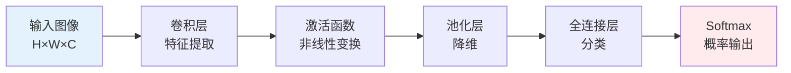
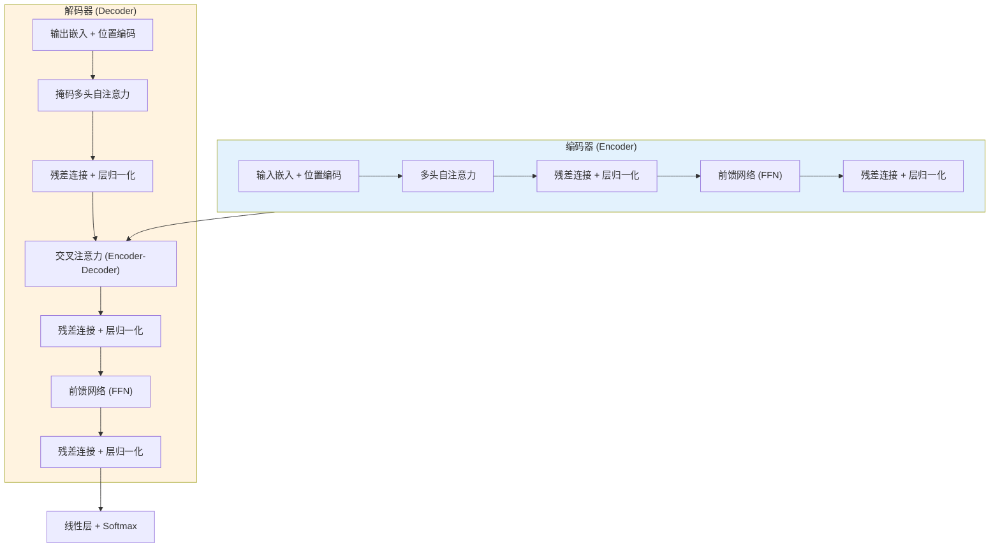

## 20.2 深度学习基础

深度学习是当前 AI/ML 安全攻防的主战场。理解深度学习的核心机制，是掌握对抗性攻击、模型窃取、后门注入等安全技术的前提。本节从安全视角出发，系统梳理深度学习的关键概念、主流架构和训练机制，并重点分析每种技术特性中蕴含的安全含义。

### 20.2.1 从机器学习到深度学习

传统机器学习（如 SVM、决策树）依赖人工特征工程——由人类专家手动设计输入特征。深度学习的核心突破在于**自动特征学习**：通过多层非线性变换，模型从原始数据中逐层提取越来越抽象的表示。

**为什么这对安全至关重要？**

| 维度 | 传统机器学习 | 深度学习 |
|------|------------|---------|
| 特征空间 | 低维、人工设计、可解释 | 高维、自动学习、难以解释 |
| 决策逻辑 | 通常可追溯 | 黑盒，难以审计 |
| 输入敏感性 | 特征工程过滤了噪声 | 对原始输入高度敏感 |
| 攻击面 | 主要在特征工程阶段 | 端到端，攻击面更广 |
| 数据依赖 | 小数据即可训练 | 依赖大规模数据，数据投毒风险更高 |

深度学习模型的自动特征学习能力是一把双刃剑：它赋予了模型强大的表达能力，同时也使得模型的决策过程变得不透明，为攻击者提供了可乘之机。

### 20.2.2 神经网络基础组件

#### 神经元与激活函数

单个神经元的计算过程：

$$z = \sum_{i=1}^{n} w_i x_i + b, \quad a = \sigma(z)$$

其中 $w_i$ 为权重，$b$ 为偏置，$\sigma$ 为激活函数，$a$ 为输出。

**常见激活函数及其安全含义**：

| 激活函数 | 公式 | 特性 | 安全相关性 |
|---------|------|------|-----------|
| Sigmoid | $\frac{1}{1+e^{-z}}$ | 输出 (0,1)，易梯度消失 | 梯度消失使对抗性攻击的梯度信号微弱 |
| Tanh | $\frac{e^z - e^{-z}}{e^z + e^{-z}}$ | 输出 (-1,1)，零中心 | 比 Sigmoid 稍好，但仍有梯度消失 |
| ReLU | $\max(0, z)$ | 简单高效，但存在"死神经元" | 死神经元区域梯度为零，对抗样本无法利用 |
| Leaky ReLU | $\max(\alpha z, z)$ | 解决死神经元问题 | 梯度处处非零，攻击面更连续 |
| GELU | $z \cdot \Phi(z)$ | Transformer 标配 | 平滑特性使梯度信号更稳定，攻击更易计算 |

激活函数的选择直接影响对抗性攻击的难度。ReLU 的分段线性特性使得基于梯度的攻击（如 FGSM）在激活区域内部非常高效，但在死神经元区域完全失效。

#### 损失函数

损失函数衡量模型预测与真实标签之间的差距，是训练的优化目标，也是攻击者利用的核心接口。

**交叉熵损失（Cross-Entropy Loss）**——分类任务标配：

$$\mathcal{L} = -\sum_{i=1}^{C} y_i \log(\hat{y}_i)$$

其中 $C$ 为类别数，$y_i$ 为真实标签的 one-hot 编码，$\hat{y}_i$ 为模型预测概率。

**安全含义**：攻击者通过最大化目标类别的交叉熵损失来生成对抗样本。损失函数的梯度 $\nabla_x \mathcal{L}$ 直接指示了使模型出错的最优扰动方向。

**均方误差损失（MSE Loss）**——回归任务常用：

$$\mathcal{L} = \frac{1}{n}\sum_{i=1}^{n}(y_i - \hat{y}_i)^2$$

#### 反向传播与梯度计算

反向传播（Backpropagation）是深度学习训练的核心算法，同时也是绝大多数对抗性攻击的计算基础。

前向传播计算输出：

$$h^{(l)} = \sigma(W^{(l)} h^{(l-1)} + b^{(l)})$$

反向传播计算梯度：

$$\frac{\partial \mathcal{L}}{\partial W^{(l)}} = \frac{\partial \mathcal{L}}{\partial h^{(l)}} \cdot \frac{\partial h^{(l)}}{\partial W^{(l)}}$$

**关键安全洞察**：对抗性攻击本质上就是利用反向传播计算输入空间的梯度。FGSM（快速梯度符号法）的公式直接来自链式法则：

$$x_{adv} = x + \epsilon \cdot \text{sign}(\nabla_x \mathcal{L}(x, y))$$

理解反向传播，就理解了为什么白盒攻击如此高效——攻击者拥有完整的计算图，可以精确计算任意层的梯度。

### 20.2.3 主流深度学习架构

#### 卷积神经网络（CNN）

CNN 是计算机视觉任务的基础架构，也是对抗性样本攻击研究最集中的目标。

**核心组件**：



**卷积运算**：使用可学习的卷积核（filter）在输入上滑动，提取局部特征：

$$\text{output}(i,j) = \sum_{m}\sum_{n} \text{input}(i+m, j+n) \cdot \text{kernel}(m,n) + b$$

**池化层**：最大池化（Max Pooling）和平均池化（Average Pooling）用于降低空间维度、增加平移不变性。

**经典架构演进**：

| 架构 | 年份 | 关键创新 | 参数量 | 安全研究意义 |
|------|------|---------|--------|-------------|
| AlexNet | 2012 | ReLU、Dropout、GPU训练 | 60M | 首个被大规模研究对抗样本的模型 |
| VGGNet | 2014 | 小卷积核堆叠 | 138M | 深层网络，梯度传播路径长 |
| GoogLeNet | 2014 | Inception模块 | 6.8M | 多分支结构增加攻击复杂度 |
| ResNet | 2016 | 残差连接 | 25.6M (50层) | 跳跃连接改变了梯度流动特性 |
| EfficientNet | 2019 | 复合缩放 | 5.3M (B0) | 轻量模型在边缘设备的安全隐患 |

**CNN 的安全特性**：

- **局部感受野**：卷积核只关注局部区域，对抗扰动可以局部化，不影响图像整体可感知性
- **平移不变性**：池化层赋予的平移不变性意味着对抗扰动不需要精确对准特定位置
- **特征层次性**：低层学习边缘、纹理，高层学习语义概念。攻击可以在不同层次进行

#### 循环神经网络（RNN）与变体

RNN 处理序列数据，广泛用于 NLP、语音识别、时间序列分析。

**基础 RNN**：

$$h_t = \sigma(W_{hh} h_{t-1} + W_{xh} x_t + b)$$

**梯度问题**：RNN 的梯度需要沿时间步反向传播，导致严重的梯度消失或梯度爆炸。这不仅是训练问题，也是安全问题——梯度爆炸使得基于梯度的对抗攻击在 RNN 上更加不稳定。

**LSTM（长短期记忆网络）**：

通过门控机制解决长距离依赖问题：

```text
遗忘门: f_t = σ(W_f · [h_{t-1}, x_t] + b_f)
输入门: i_t = σ(W_i · [h_{t-1}, x_t] + b_i)
候选值: C̃_t = tanh(W_C · [h_{t-1}, x_t] + b_C)
细胞状态: C_t = f_t * C_{t-1} + i_t * C̃_t
输出门: o_t = σ(W_o · [h_{t-1}, x_t] + b_o)
隐藏状态: h_t = o_t * tanh(C_t)
```

**GRU（门控循环单元）**：LSTM 的简化版本，合并了遗忘门和输入门，参数更少但性能接近。

**RNN 架构的安全含义**：

- 序列模型的对抗攻击需要考虑时间维度的依赖关系，比图像攻击更复杂
- 文本对抗样本受到离散输入空间的约束——不能对单词做连续微小扰动
- RNN 的记忆特性可能记住训练数据中的敏感序列，增加隐私泄露风险

#### Transformer 架构

Transformer 已成为现代 AI 的核心架构，从 BERT 到 GPT 到多模态模型，几乎所有前沿 AI 系统都基于 Transformer。

**自注意力机制（Self-Attention）**：

$$\text{Attention}(Q, K, V) = \text{softmax}\left(\frac{QK^T}{\sqrt{d_k}}\right) V$$

其中 $Q$（Query）、$K$（Key）、$V$（Value）分别由输入通过线性变换得到，$d_k$ 为缩放因子。

**多头注意力**：

$$\text{MultiHead}(Q, K, V) = \text{Concat}(\text{head}_1, ..., \text{head}_h) W^O$$

每个头独立计算注意力，捕捉不同子空间的信息。

**Transformer 架构概览**：



**Transformer 的安全特性**：

| 特性 | 安全影响 |
|------|---------|
| 全局注意力 | 每个 token 可以关注所有其他 token，攻击影响可全局传播 |
| 位置编码 | 位置信息的编码方式影响对抗扰动的空间分布 |
| 参数规模 | 大模型（数十亿参数）的记忆容量更大，隐私风险更高 |
| 上下文窗口 | 长上下文窗口增加了提示注入攻击的攻击面 |
| 涌现能力 | 大模型的涌现行为难以预测，可能产生意外的安全漏洞 |

**代表性 Transformer 模型的安全特征**：

- **BERT（编码器）**：双向注意力，常用于分类和信息抽取。其掩码语言模型预训练方式可能记住训练数据中的敏感实体
- **GPT 系列（解码器）**：自回归生成，单向注意力。生成能力使其可被用于自动化钓鱼、恶意代码生成
- **T5（编码器-解码器）**：统一的文本到文本框架，攻击面涵盖输入和输出两侧
- **Vision Transformer（ViT）**：将 Transformer 应用于图像，继承了 Transformer 的全局注意力特性，对抗样本行为与 CNN 有显著差异

### 20.2.4 训练过程与优化

#### 梯度下降与优化器

训练的核心是通过梯度下降最小化损失函数：

$$\theta_{t+1} = \theta_t - \eta \cdot \nabla_\theta \mathcal{L}(\theta_t)$$

**常用优化器**：

| 优化器 | 核心机制 | 安全相关性 |
|--------|---------|-----------|
| SGD | 基础梯度下降 + 动量 | 优化轨迹可预测，模型行为更规律 |
| Adam | 自适应学习率 + 动量 | 最常用，训练的模型可能有不同的对抗鲁棒性特征 |
| AdamW | Adam + 权重衰减解耦 | 权重衰减影响模型大小，间接影响窃取攻击难度 |

#### 正则化技术

正则化是防止过拟合的技术，同时也深刻影响模型的安全特性：

**Dropout**：训练时随机丢弃一定比例的神经元。

```python
class DropoutLayer:
    def __init__(self, p=0.5):
        self.p = p  # 丢弃概率

    def forward(self, x, training=True):
        if training:
            mask = (torch.rand_like(x) > self.p).float()
            return x * mask / (1 - self.p)  # 缩放补偿
        return x  # 推理时不做丢弃
```

**安全含义**：Dropout 本质上是一种模型集成——每次前向传播使用不同的子网络。这使得：
- 单次查询无法获取完整模型信息，增加了模型窃取的难度
- 但推理时 Dropout 关闭，模型行为固定，攻击者仍可针对固定模型生成对抗样本

**权重衰减（L2 正则化）**：

$$\mathcal{L}_{total} = \mathcal{L}_{data} + \lambda \sum_i w_i^2$$

限制权重大小，减少模型复杂度。较小的权重意味着模型对输入扰动的响应更温和，理论上可以提高对抗鲁棒性。

**批归一化（Batch Normalization）**：

$$\hat{x}_i = \frac{x_i - \mu_B}{\sqrt{\sigma_B^2 + \epsilon}}, \quad y_i = \gamma \hat{x}_i + \beta$$

**安全争议**：批归一化对对抗鲁棒性的影响一直存在争议。一方面，它稳定训练、加速收敛；另一方面，有研究表明批归一化会放大对抗扰动的影响，降低模型鲁棒性。在评估模型安全性时，需要特别关注是否使用了批归一化。

#### 过拟合与欠拟合

**过拟合**：模型在训练集上表现优异，但在测试集上表现差。

从安全角度看，过拟合不仅仅是泛化问题——过拟合的模型记住了训练数据的细节，这直接导致：

1. **成员推断攻击**：攻击者可以通过观察模型对特定样本的置信度来判断该样本是否在训练集中。过拟合模型对训练样本的置信度明显高于非训练样本
2. **模型逆向攻击**：过拟合模型更容易泄露训练数据的信息。研究表明，过拟合的分类器可以通过模型逆向技术重构训练数据的近似图像
3. **数据提取攻击**：在大语言模型中，过拟合会导致模型逐字记忆训练数据，攻击者可以通过特定提示触发模型输出训练数据中的原文

**欠拟合**：模型过于简单，无法捕捉数据中的模式。安全影响相对较小，但欠拟合模型可能更容易被简单的对抗扰动欺骗。

### 20.2.5 深度学习的安全特性分析

#### 黑盒特性与可解释性问题

深度学习模型通常被视为"黑盒"——我们可以观察输入和输出，但难以理解中间的决策过程。

**可解释性方法及其局限**：

| 方法 | 原理 | 安全应用 | 局限 |
|------|------|---------|------|
| 梯度可视化 | 计算输出对输入的梯度 | 识别模型关注区域，辅助攻击设计 | 梯度可能噪声大、难以解释 |
| LIME | 局部线性近似 | 理解单个预测的依据 | 近似可能不准确，被对抗样本欺骗 |
| SHAP | 基于 Shapley 值的特征重要性 | 量化每个特征的贡献 | 计算成本高，大规模模型不实用 |
| 注意力可视化 | 展示注意力权重 | 分析 Transformer 的关注模式 | 注意力不等于因果关系 |

**安全含义**：黑盒特性为攻击者和防御者都带来了挑战。攻击者难以精确控制攻击效果，防御者难以审计模型是否已被篡改。这种双向不透明性是 AI 安全研究的核心难题之一。

#### 高维特征空间与对抗性样本

深度学习模型通常在高维空间中操作——例如，一张 224×224 的 RGB 图像就有 150,528 个维度。高维空间的几何性质使得对抗性样本几乎不可避免。

**维度灾难与对抗性样本的关系**：

在高维空间中，数据点之间的距离趋于相等（距离集中现象），决策边界与数据点之间的距离在某些方向上非常小。Goodfellow 等人（2015）指出，即使是线性模型在高维空间中也存在大量对抗性方向——扰动的每个分量只需极小的变化，累积效应就足以改变模型的预测。

设模型为 $f(x) = w^T x + b$，对抗扰动 $\eta = \epsilon \cdot \text{sign}(w)$，则：

$$w^T (x + \eta) = w^T x + \epsilon \|w\|_1$$

当 $\|w\|_1$ 很大时（高维权重向量的典型特征），即使 $\epsilon$ 很小，输出变化也很大。

#### 模型记忆与隐私泄露

深度学习模型具有惊人的记忆能力。研究表明，标准训练的神经网络可以记住随机标签的数据（Zhang et al., 2017），这意味着模型确实存储了训练数据的具体信息。

**记忆的层次**：

1. **统计记忆**：学习数据的分布特征，是期望的行为
2. **实例记忆**：记住特定的训练样本，是隐私泄露的根源
3. **噪声记忆**：记住训练数据中的噪声和标注错误，是过拟合的表现

**安全影响**：

- 大语言模型可以逐字输出训练数据中的文本片段（Carlini et al., 2021）
- 图像分类器的模型逆向攻击可以重构训练图像的近似版本
- 成员推断攻击利用模型对训练数据的"熟悉度"差异

#### 对抗性脆弱性的深层原因

深度学习模型的对抗性脆弱性不仅是架构问题，还与以下因素密切相关：

**线性假设（Goodfellow et al., 2015）**：现代深度网络大量使用 ReLU 等分段线性激活函数。在高维空间中，线性行为占主导地位，对抗性扰动沿着权重向量的方向累积，产生巨大的输出变化。

**数据流形假说**：真实数据分布在一个低维流形上，但模型的决策边界在流形外的空间中没有约束。对抗样本往往位于数据流形附近但不在流形上，模型对这些"流形外"的输入没有合理的泛化能力。

**非鲁棒特征假说（Ilyas et al., 2019）**：深度学习模型会利用人类不可感知的"非鲁棒特征"进行预测。这些特征在统计上与标签相关，但对人类来说是不可理解的噪声。对抗扰动本质上是操纵这些非鲁棒特征。

### 20.2.6 深度学习框架与工具

掌握主流深度学习框架是进行 AI 安全研究的基本技能。

**主流框架对比**：

| 框架 | 开发者 | 动态图 | 部署 | 安全研究适用性 |
|------|--------|-------|------|---------------|
| PyTorch | Meta | 原生支持 | TorchScript/ONNX | 最流行，研究社区首选 |
| TensorFlow | Google | TF2 支持 | TF Serving/Lite | 工业部署广泛，模型格式标准化 |
| JAX | Google | 原生支持 | 导出到 TF/TFLite | 函数式编程，自动微分灵活 |
| ONNX | 微软等 | — | 跨框架通用 | 模型交换标准，便于模型分析 |

**安全研究工具链**：

```text
┌─────────────────────────────────────────────────────┐
│                   AI 安全研究工具链                    │
├──────────────┬──────────────┬───────────────────────┤
│  对抗攻击     │  模型分析     │  隐私保护              │
│              │              │                       │
│  CleverHans  │  Netron      │  PySyft               │
│  Foolbox     │  Captum      │  Opacus (DP-SGD)      │
│  ART (IBM)   │  TensorBoard │  TF Privacy           │
│  Torchattacks│  Weights &   │  CrypTen (MPC)        │
│  TextAttack  │  Biases      │  TenSEAL (HE)         │
└──────────────┴──────────────┴───────────────────────┘
```

**ART（Adversarial Robustness Toolbox）**——IBM 开源的 AI 安全工具库，支持 PyTorch、TensorFlow、Keras 等多种框架，提供攻击、防御、鲁棒性评估的统一接口：

```python
from art.attacks.evasion import FastGradientMethod, ProjectedGradientDescent
from art.estimators.classification import PyTorchClassifier

# 包装模型
classifier = PyTorchClassifier(
    model=model,
    loss=criterion,
    input_shape=(3, 224, 224),
    nb_classes=1000,
)

# FGSM 攻击
attack_fgsm = FastGradientMethod(estimator=classifier, eps=0.03)
x_adv = attack_fgsm.generate(x=x_test)

# PGD 攻击（更强的迭代攻击）
attack_pgd = ProjectedGradientDescent(
    estimator=classifier, eps=0.03, eps_step=0.007, max_iter=40
)
x_adv_pgd = attack_pgd.generate(x=x_test)

# 评估鲁棒性
accuracy = classifier.evaluate(x_adv, y_test)
```

### 20.2.7 深度学习安全的技术本质

理解深度学习的安全问题，关键在于认识到以下技术本质：

**1. 优化目标的不完美性**

模型优化的是训练集上的损失函数，而非真正的"理解"。损失函数的梯度为攻击者提供了精确的攻击方向——这不是 bug，而是梯度优化的固有特性。

**2. 泛化与记忆的张力**

模型需要记忆有用的知识（泛化）同时遗忘无用的细节，但这个边界在实践中难以精确控制。过拟合意味着过度记忆，欠拟合意味着记忆不足——两者都有安全含义。

**3. 连续空间与离散现实的鸿沟**

深度学习在连续的实数空间中优化，但现实世界的安全决策往往是离散的（是/否、恶意/良性）。这种不匹配使得模型在边界情况下的行为不可预测。

**4. 规模带来的涌现风险**

随着模型规模增大，会出现训练阶段未预期到的能力（涌现能力）。这些涌现能力可能包括潜在的安全漏洞——例如大语言模型突然获得了代码执行能力或越狱能力。

### 20.2.8 本节核心概念速查

| 概念 | 定义 | 安全关联 |
|------|------|---------|
| 前向传播 | 从输入到输出的计算过程 | 模型查询攻击的基础 |
| 反向传播 | 计算梯度的链式法则应用 | 对抗性攻击的计算基础 |
| 损失函数 | 衡量预测误差的函数 | 攻击目标函数 |
| 激活函数 | 引入非线性的函数 | 影响梯度流动和攻击难度 |
| Dropout | 随机丢弃神经元的正则化 | 增加模型窃取难度 |
| 批归一化 | 标准化中间层输出 | 争议性地影响对抗鲁棒性 |
| 过拟合 | 记住训练数据而非学习规律 | 成员推断和模型逆向攻击的前提 |
| 注意力机制 | 动态加权输入的不同部分 | 提示注入攻击的载体 |
| 梯度消失/爆炸 | 深层网络梯度传播问题 | 影响基于梯度的攻击的有效性 |
| 迁移学习 | 在预训练模型上微调 | 预训练模型可能携带后门 |
