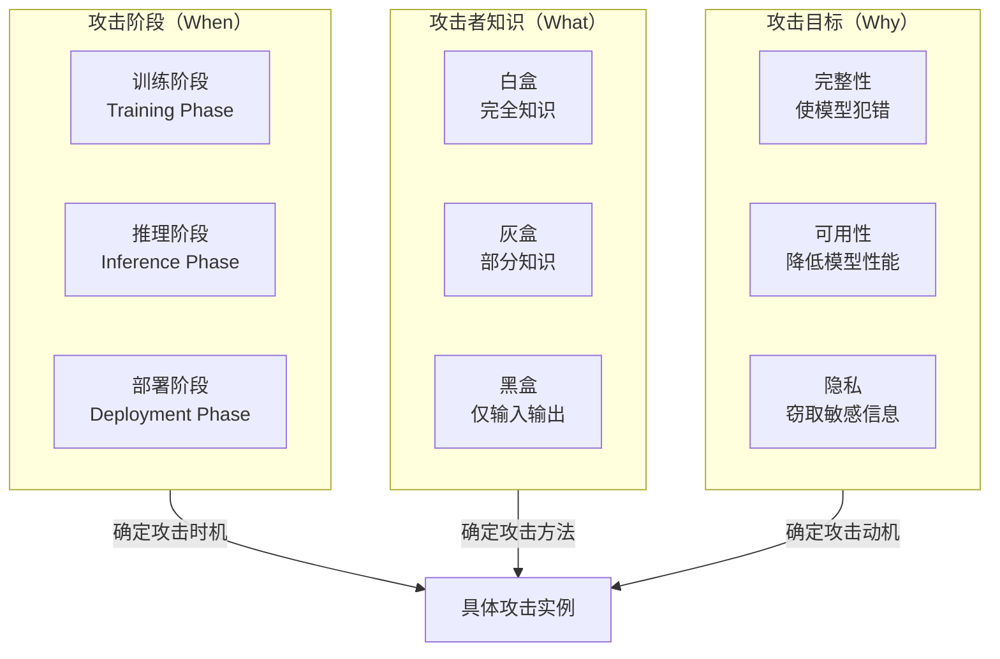
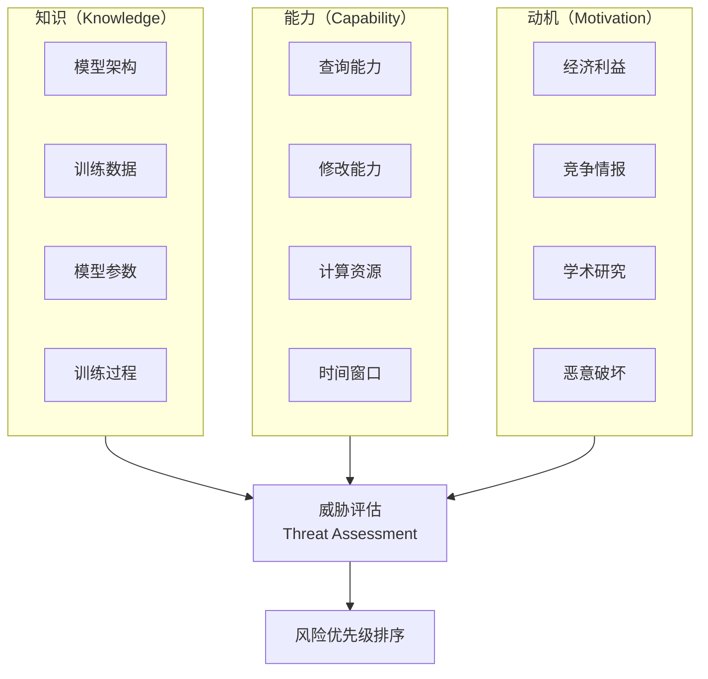
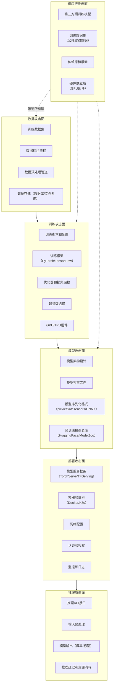

## 20.3 AI/ML安全威胁模型

威胁模型（Threat Model）是安全分析的起点——它回答了"谁在什么条件下能对什么目标造成什么程度的损害"这一根本问题。对于AI/ML系统，威胁模型的构建比传统软件更加复杂，因为攻击面不仅包括代码和接口，还延伸到数据流、模型参数、训练过程和推理行为。

本节将建立一个完整的AI/ML威胁分析框架：从攻击阶段、攻击者知识、攻击目标三个维度对威胁进行系统分类；深入分析攻击者的能力模型和动机；绘制攻击面全景图；并将所有理论映射到MITRE ATLAS实战框架中。

### 20.3.1 为什么AI/ML系统需要专门的威胁模型

传统软件的安全分析遵循STRIDE（Spoofing、Tampering、Repudiation、Information Disclosure、Denial of Service、Elevation of Privilege）模型。但直接将STRIDE套用到AI/ML系统上会导致严重的威胁遗漏，原因有三：

**第一，攻击面的维度不同。** 传统软件的攻击面由接口、协议、配置构成——这些都是代码层面的。AI/ML系统除了这些之外，还有数据攻击面（训练数据可以被污染）、模型攻击面（参数可以被窃取或逆向）、推理攻击面（输入可以被精心构造来欺骗模型）。一个图像分类API在传统安全评估中可能只关注认证和速率限制，但它的AI威胁面还包括对抗性样本、模型窃取、成员推断等完全不同的攻击向量。

**第二，漏洞的性质不同。** 传统漏洞源于代码实现的错误——缓冲区溢出、SQL注入、跨站脚本——可以通过修改代码来修复。AI/ML的"漏洞"往往是模型数学特性的固有表现：高维空间中决策边界的局部线性性使得对抗性样本在理论上必然存在，无论你如何训练模型。这不是一个可以"打补丁"修复的bug，而是模型本质的一部分。

**第三，修复的确定性不同。** 修复一个SQL注入漏洞后，你可以编写确定性测试来验证修复效果。但"修复"一个对抗性样本问题（例如通过对抗性训练）后，你无法保证模型对所有可能的扰动模式都具有鲁棒性——攻击者可能找到你没有防御的新扰动方向。

因此，AI/ML系统需要在传统威胁模型之上，叠加一个专门针对机器学习特性的威胁分析层。下表展示了STRIDE模型在AI/ML系统中的扩展映射：

| STRIDE类别 | 传统含义 | AI/ML系统扩展 | 典型攻击示例 |
|-----------|---------|-------------|------------|
| **Spoofing（仿冒）** | 伪造身份或数据来源 | 模型输出仿冒：对抗性样本使模型误分类；深度伪造生成虚假内容 | FGSM/PGD攻击使分类器将停止标志识别为限速标志 |
| **Tampering（篡改）** | 修改数据或代码 | 训练数据篡改：数据投毒、后门植入；模型参数篡改：模型中毒 | 在训练数据中注入后门样本，使模型对特定触发器响应 |
| **Repudiation（抵赖）** | 否认执行过操作 | 模型决策不可审计：黑盒模型无法解释其推理过程；生成式AI输出难以溯源 | LLM生成的有害内容无法追溯到具体的训练数据或提示 |
| **Information Disclosure（信息泄露）** | 未授权访问敏感数据 | 模型信息泄露：模型窃取、成员推断、训练数据提取 | 通过API查询重建替代模型；从LLM中提取训练数据中的个人信息 |
| **Denial of Service（拒绝服务）** | 系统不可用 | 模型可用性攻击：使模型输出无意义结果、触发异常推理时间 | 对抗性输入使目标检测模型完全失效；精心构造的输入触发模型无限循环 |
| **Elevation of Privilege（权限提升）** | 获取更高权限 | 系统级权限提升：提示注入使LLM执行未授权操作；绕过模型安全限制 | 提示注入覆盖系统提示，使LLM泄露系统指令或执行恶意代码 |

### 20.3.2 三维威胁分类框架

AI/ML安全威胁可以从三个正交维度进行分类：**攻击阶段**（什么时候攻击）、**攻击者知识**（攻击者知道多少）、**攻击目标**（攻击者想要什么）。这三个维度的组合构成了威胁模型的完整坐标系。



#### 维度一：按攻击阶段分类

**训练阶段攻击**发生在模型训练期间或之前。攻击者通过操纵训练数据或训练过程来影响最终模型的行为。这类攻击的危险性在于：被污染的模型在部署后看起来完全正常，只有在特定条件下才会表现出攻击者预设的异常行为。

| 攻击类型 | 攻击方式 | 攻击者前提条件 | 效果持续性 | 检测难度 |
|---------|---------|-------------|----------|---------|
| **数据投毒（Data Poisoning）** | 在训练数据集中注入恶意样本 | 需要对训练数据有写入权限（直接或间接） | 永久——模型一旦被污染，除非重新训练否则无法修复 | 高——正常样本和投毒样本在特征空间中可能高度相似 |
| **后门攻击（Backdoor Attack）** | 植入带触发器的样本 | 需要控制部分训练数据或训练流程 | 永久——触发器嵌入模型权重中 | 极高——模型在正常输入上表现完全正常 |
| **模型中毒（Model Poisoning）** | 直接修改模型参数或梯度 | 需要对模型权重或优化过程有写入权限 | 永久 | 中——可以通过模型完整性校验检测 |
| **训练流程篡改** | 修改损失函数、优化器或超参数 | 需要对训练代码有修改权限 | 永久 | 低——代码审计可以发现 |

训练阶段攻击的一个关键特征是**持久性**：一旦模型在投毒数据上完成训练，攻击效果就被永久编码到模型权重中。除非完全重新训练（使用干净数据），否则无法消除。这与推理阶段攻击形成鲜明对比——后者只在每次推理时临时影响模型输出。

**推理阶段攻击**发生在模型已经训练完成并部署之后。攻击者通过精心构造的输入来操纵模型的预测结果，或者通过观察模型的输入输出行为来推断敏感信息。

| 攻击类型 | 攻击方式 | 攻击者前提条件 | 信息需求 | 效果范围 |
|---------|---------|-------------|---------|---------|
| **对抗性样本（Adversarial Example）** | 对输入添加精心设计的扰动 | 需要能够向模型提交输入 | 白盒需要梯度；黑盒仅需查询 | 单次推理——每次攻击只影响当前输入 |
| **模型窃取（Model Stealing）** | 通过大量查询重建替代模型 | 需要对模型API有查询权限 | 需要大量输入-输出对（数千至数万次查询） | 持久——替代模型一旦训练完成可反复使用 |
| **成员推断（Membership Inference）** | 判断特定样本是否在训练集中 | 需要对模型API有查询权限 | 需要目标样本和模型输出的概率分布 | 单次判断——每次查询判断一个样本 |
| **模型逆向（Model Inversion）** | 从模型输出中重建训练数据 | 需要对模型API有查询权限 | 需要目标类别的模型输出 | 持久——重建的数据可反复使用 |
| **提示注入（Prompt Injection）** | 在输入中嵌入恶意指令覆盖系统提示 | 需要能够向LLM提交输入 | 需要了解目标系统的提示结构 | 单次推理——每次攻击影响当前会话 |

推理阶段攻击的核心特征是**临时性**（对抗性样本和提示注入）或**累积性**（模型窃取和成员推断需要大量查询的聚合分析）。

**部署阶段攻击**针对模型的运行环境和基础设施，利用系统层面的弱点来获取模型信息或干扰模型行为。

| 攻击类型 | 攻击方式 | 攻击前提条件 | 目标资产 |
|---------|---------|-----------|---------|
| **侧信道攻击** | 通过功耗、时间、电磁辐射等物理信号推断模型信息 | 物理接触或共址部署 | 模型架构、参数、推理数据 |
| **供应链攻击** | 在模型依赖链中植入恶意组件 | 对模型仓库或依赖库有写入权限 | 预训练模型、训练框架、数据集 |
| **物理世界攻击** | 在物理环境中构造对抗性物体 | 物理环境访问权限 | 部署在物理世界的感知模型（自动驾驶、安防） |
| **模型文件攻击** | 利用模型序列化格式的漏洞（如pickle反序列化） | 对模型文件有替换权限 | 运行模型的服务器（远程代码执行） |

#### 维度二：按攻击者知识分类

攻击者对目标模型的了解程度直接决定了可用的攻击方法和攻击效果。这个维度形成了一个从完全知识到零知识的连续谱。

**白盒攻击（White-box Attack）**

白盒攻击假设攻击者拥有目标模型的完整信息：架构（层数、激活函数、连接方式）、参数（权重和偏置的精确数值）、训练数据（或其统计分布）、以及训练过程（优化器、学习率、批大小等超参数）。

在白盒设定下，攻击者可以直接计算模型输出对输入的梯度 $\nabla_x f(x)$，这是最强大的攻击向量。FGSM、PGD、C&W等经典对抗性攻击算法都是在白盒设定下设计的。

白盒攻击的现实场景包括：
- **内部威胁**：离职员工带走了模型的完整副本
- **开源模型**：模型权重在HuggingFace等平台公开发布
- **模型泄露**：通过安全漏洞获取了服务器上的模型文件

白盒攻击的价值不仅在于直接利用——它为黑盒攻击提供了**上界基准**。如果一个防御方法连白盒攻击都无法抵御，那它在黑盒场景下也不会安全。

**灰盒攻击（Gray-box Attack）**

灰盒攻击假设攻击者拥有目标模型的部分信息。常见的灰盒设定包括：

| 灰盒类型 | 已知信息 | 未知信息 | 典型场景 |
|---------|---------|---------|---------|
| 架构已知 | 模型类型（如ResNet-50） | 具体参数值 | 目标使用了公开架构但训练了自己的权重 |
| 数据分布已知 | 训练数据的统计特征 | 具体样本 | 攻击者知道模型是在某个特定领域数据上训练的 |
| 部分输出已知 | 模型的top-K预测概率 | 完整的softmax向量 | API返回了置信度排名但隐藏了精确概率值 |
| 训练过程已知 | 训练算法和超参数 | 训练数据和最终权重 | 通过逆向训练代码获取了配置信息 |

灰盒攻击的核心策略是**利用已知信息约束搜索空间**。例如，如果知道目标模型使用ResNet-50架构，攻击者可以构建一个相同架构的替代模型进行迁移攻击，而不需要从头搜索。

**黑盒攻击（Black-box Attack）**

黑盒攻击假设攻击者只能通过查询接口观察模型的输入输出行为，对模型内部结构一无所知。这是最接近真实世界攻击场景的设定，也是最具有实际威胁性的。

黑盒攻击进一步分为两类：

- **基于分数的攻击（Score-based Attack）**：API返回完整的概率向量（如`[0.01, 0.02, 0.95, 0.02]`）。攻击者可以利用概率值的连续变化来估计梯度方向，从而进行基于梯度的优化攻击。这种方法的查询效率较高，通常需要数千次查询。

- **基于决策的攻击（Decision-based Attack）**：API只返回最终分类结果（如`"cat"`）。攻击者只能利用离散的决策信息来指导攻击。Boundary Attack和HopSkipJump是这类攻击的代表。由于信息量更少，所需的查询次数显著增加（数万至数十万次），但它对API的限制最少——只要能看到分类结果就能实施。

| 黑盒攻击策略 | 所需信息 | 查询次数 | 攻击效果 | 隐蔽性 |
|------------|---------|---------|---------|--------|
| **迁移攻击** | 完全不需要查询目标模型 | 0次（在本地替代模型上生成） | 中等（60-80%成功率） | 极高——不与目标交互 |
| **基于分数的查询攻击** | 完整概率向量 | 1,000-10,000次 | 高（>90%成功率） | 低——大量查询易被检测 |
| **基于决策的查询攻击** | 仅top-1标签 | 10,000-100,000次 | 中高（70-90%成功率） | 极低——查询量巨大 |
| **合成攻击（迁移+查询）** | 概率向量或标签 | 500-5,000次 | 高（>85%成功率） | 中——查询量可控 |

#### 维度三：按攻击目标分类

攻击者的最终意图可以归纳为三大类目标，每类目标对应不同的威胁场景和防御策略。

**完整性攻击（Integrity Attack）**

完整性攻击的目标是使模型产生特定的错误输出，而不影响模型在其他输入上的正常表现。这是一种**精确打击**——攻击者有一个特定的目标（如让自动驾驶系统忽略某个停车标志），并设计最小化的扰动来实现这个目标。

完整性攻击的典型场景：
- 在自动驾驶中，通过在停车标志上粘贴特定贴纸，使感知系统将其误识别为限速标志
- 在垃圾邮件过滤中，通过在垃圾邮件中添加特定词汇，使过滤器将其判定为正常邮件
- 在人脸识别中，通过佩戴特制眼镜，使系统将攻击者识别为特定目标人物

**可用性攻击（Availability Attack）**

可用性攻击的目标是降低模型的整体性能，使其无法正常为所有用户服务。与完整性攻击的"精确打击"不同，可用性攻击是"面杀伤"——它不需要针对特定输入，而是要使模型在大范围输入上都表现异常。

可用性攻击的典型场景：
- 数据投毒使模型在某一整个类别上的准确率大幅下降
- 对抗性输入触发模型的异常推理路径，导致推理延迟剧增（计算资源耗尽攻击）
- 联邦学习中的拜占庭攻击，使全局模型无法收敛

**隐私攻击（Privacy Attack）**

隐私攻击的目标是获取模型或训练数据中的敏感信息。这类攻击不要求改变模型行为——攻击者只需要观察模型的输出即可推断出有价值的信息。

隐私攻击的典型场景：
- 成员推断：判断某人的医疗记录是否参与了模型训练（泄露医疗隐私）
- 模型逆向：从人脸识别模型中重建训练集中的人脸图像
- 训练数据提取：从大语言模型的输出中提取训练数据中的个人信息（如电话号码、邮箱地址）
- 属性推断：推断训练数据集的统计属性（如某个数据集中女性占比）

### 20.3.3 攻击者能力模型

威胁分类只回答了"有哪些类型的攻击"，但完整的威胁模型还需要回答"谁在攻击"。攻击者能力模型从知识、能力、动机三个维度刻画攻击者的画像。



#### 知识维度详解

知识维度评估攻击者对目标系统了解的深度。每个知识要素对攻击方法的可用性有直接影响：

| 知识要素 | 获取方式 | 对攻击的价值 | 现实获取难度 |
|---------|---------|------------|------------|
| **模型架构** | 技术文档、逆向分析、开源信息 | 确定攻击算法的选择（CNN用FGSM，Transformer用特定扰动模式） | 低——很多模型架构在论文或文档中公开 |
| **训练数据** | 数据泄露、公开数据集、统计推断 | 数据投毒攻击的直接前提；训练数据分布知识可提升迁移攻击效果 | 中——需要特定的数据访问或推断能力 |
| **模型参数** | 模型文件泄露、侧信道攻击、开源模型 | 白盒攻击的直接前提；可精确计算梯度进行优化攻击 | 中——开源模型直接可获取，闭源模型需要安全漏洞 |
| **训练过程** | 代码泄露、文档分析、超参数推断 | 理解模型的弱点分布；预测对抗性样本的迁移性 | 低——通常可以通过API行为推断 |

#### 能力维度详解

能力维度评估攻击者能够执行的操作范围和资源投入：

**查询能力**是黑盒攻击的基础。不同的API设计对攻击者的信息泄露差异巨大：

| API输出类型 | 泄露信息量 | 支持的攻击类型 | 典型服务 |
|-----------|----------|-------------|---------|
| 完整softmax向量 | 极高 | 基于分数的攻击、模型窃取、成员推断 | 大多数MLaaS平台（AWS SageMaker、Azure ML） |
| Top-K概率 | 高 | 基于分数的攻击（K≥3时）、模型窃取 | 部分API（如Google Vision API） |
| 仅top-1标签+置信度 | 中 | 基于决策的攻击、有限的模型窃取 | 部分商业API |
| 仅top-1标签 | 低 | 基于决策的攻击（HopSkipJump等） | 最严格的API限制 |
| 二元输出（匹配/不匹配） | 极低 | Boundary Attack | 人脸识别比对API |

**修改能力**决定了攻击者能直接影响系统到什么程度：
- **只读**：只能观察输入输出，无法修改任何系统组件。对应黑盒查询攻击。
- **数据写入**：可以向训练数据中注入样本。对应数据投毒和后门攻击。
- **模型写入**：可以修改模型权重或替换模型文件。对应模型中毒和供应链攻击。
- **代码写入**：可以修改训练代码或推理服务代码。对应训练流程篡改和后门植入。

**计算资源**直接影响攻击的规模和速度：
- 对抗性样本生成：单GPU即可完成，通常只需秒级时间
- 模型窃取：需要训练替代模型，通常需要数小时至数天的GPU计算
- 大规模查询攻击：需要控制查询成本，可能需要代理IP池来绕过速率限制
- 训练数据提取（针对LLM）：需要大量计算资源和精心设计的提取策略

#### 动机维度详解

理解攻击者的动机有助于预判攻击的目标和策略选择：

| 攻击者画像 | 典型动机 | 偏好攻击类型 | 目标系统 | 历史案例 |
|-----------|---------|------------|---------|---------|
| **竞争对手** | 获取商业机密、复制技术优势 | 模型窃取、训练数据提取 | 商业AI产品API | 2023年多家AI公司的模型被竞品通过API逆向 |
| **内部威胁者** | 报复、经济利益、好奇心 | 数据投毒、模型泄露（白盒） | 公司内部AI系统 | Samsung员工将源代码粘贴到ChatGPT |
| **安全研究员** | 发现漏洞、学术研究、Bug Bounty | 对抗性样本、鲁棒性评估 | 公开模型和API | Goodfellow等人的对抗性样本研究 |
| **犯罪组织** | 经济欺诈、身份盗窃 | Deepfake、提示注入 | 金融验证系统、客服系统 | 2024年Deepfake绕过银行KYC系统 |
| **国家行为体** | 情报收集、基础设施破坏 | 供应链攻击、模型中毒 | 关键基础设施AI系统 | 2020年SolarWinds供应链攻击模式可迁移至AI供应链 |
| **黑客主义者** | 政治诉求、揭露问题 | 对抗性样本、提示注入 | 政府或企业AI系统 | 用对抗性样本暴露AI系统的不可靠性 |

### 20.3.4 AI/ML系统攻击面分析

攻击面（Attack Surface）是系统中所有可以被攻击者访问和利用的入口点的集合。AI/ML系统的攻击面比传统软件更加广泛，因为它不仅包括代码层面的接口，还包括数据管道、模型资产和推理行为。



#### 数据攻击面深度分析

数据是AI/ML系统最独特也最脆弱的攻击面。传统软件的数据在运行时通常是固定的（配置文件、数据库记录），而AI/ML的数据直接参与了模型的"编程"——训练数据本质上就是模型的隐式程序。

**训练数据的攻击向量：**

1. **直接数据污染**：攻击者获得训练数据的写入权限后，可以直接添加或修改样本。这在众包标注场景（如Amazon Mechanical Turk）中尤为危险——恶意标注员可以系统性地翻转标签。

2. **间接数据污染**：攻击者通过操纵数据来源来间接影响训练数据。例如，在网络爬取数据的场景中，攻击者可以在网上发布精心构造的内容，这些内容最终会被爬取并进入训练集。

3. **数据供应链**：公共数据集（如Common Crawl、LAION）被广泛用于预训练，但这些数据集的审计程度通常很低。2023年的研究表明，Common Crawl中存在大量有害内容和偏见数据，这些数据会直接影响在上面训练的模型。

#### 模型攻击面深度分析

模型文件本身是一个高价值攻击目标，因为它们包含了训练过程的全部"知识"。

**模型序列化格式的安全隐患：**

Python的pickle格式是PyTorch模型保存的默认格式，但它存在根本性的安全问题——pickle反序列化可以执行任意代码。攻击者可以在模型文件中嵌入恶意pickle操作，当受害者加载模型时自动执行恶意代码。

```python
# 恶意模型文件的原理示意（仅用于理解攻击机制，切勿用于攻击）
import pickle
import os

class MaliciousModel:
    """伪装成正常模型的恶意类"""
    def __reduce__(self):
        # 当pickle反序列化时，__reduce__方法会被调用
        # 攻击者可以在这里执行任意命令
        return (os.system, ('echo "恶意代码执行" && cat /etc/passwd',))

# 攻击者将恶意对象序列化为.pkl文件
# 受害者加载时：torch.load('malicious_model.pkl') → 触发代码执行
```

这正是HuggingFace推动SafeTensors格式的原因——它只存储张量数据，不支持任意代码执行。安全实践要求所有模型加载都应优先使用SafeTensors格式，或在加载pickle文件时使用`weights_only=True`参数。

#### 推理API攻击面深度分析

推理API是攻击者与模型交互的主要界面，也是信息泄露的最大源头。

**API设计对安全性的直接影响：**

```text
安全等级从低到高：

Level 0（最不安全）：返回完整softmax向量 + 中间层特征
  ↳ 攻击者可以精确计算梯度，进行高效的模型窃取和成员推断

Level 1：返回完整softmax向量
  ↳ 攻击者可以估计梯度方向，进行基于分数的攻击

Level 2：返回Top-K概率
  ↳ 攻击者信息受限，但仍可进行有限的梯度估计

Level 3：返回Top-1标签 + 置信度
  ↳ 攻击者只能利用置信度变化来估计梯度

Level 4（最安全）：仅返回Top-1标签
  ↳ 攻击者只能使用基于决策的攻击（查询量大，效率低）
```

### 20.3.5 威胁与防御的映射关系

每种威胁类型都需要针对性的防御策略。以下矩阵将威胁类型与防御手段进行了映射，帮助读者建立"攻击-防御"的对应思维：

| 威胁类型 | 主要防御手段 | 防御原理 | 防御局限性 |
|---------|------------|---------|----------|
| **对抗性样本** | 对抗性训练、输入预处理、认证鲁棒性 | 在训练中引入对抗样本提升鲁棒性；在推理时检测或净化异常输入 | 对抗性训练只能防御已知攻击类型；输入预处理可被自适应攻击绕过 |
| **数据投毒** | 数据审计、异常检测、鲁棒训练算法 | 在训练前检测和移除投毒样本；使用对异常值不敏感的训练算法 | 精心设计的投毒样本可能通过审计；鲁棒训练算法会降低模型准确率 |
| **后门攻击** | 神经元剪枝、Fine-pruning、STRIP检测 | 检测和移除后门相关的神经元；利用后门样本的行为模式差异进行检测 | 动态后门和隐蔽后门可以绕过检测 |
| **模型窃取** | 输出扰动、查询限制、模型水印 | 降低API输出的信息量；限制查询频率和数量；在模型中嵌入所有权标记 | 输出扰动会影响正常用户体验；查询限制可以被分布式攻击绕过 |
| **成员推断** | 差分隐私训练、正则化、输出校准 | 在训练过程中添加噪声保护数据隐私；限制模型对训练样本的记忆 | 差分隐私会降低模型准确率；正则化效果有限 |
| **提示注入** | 输入过滤、提示隔离、输出验证 | 在输入到达模型前检测恶意指令；将系统提示与用户输入严格隔离 | 输入过滤可被编码绕过；提示隔离的实现仍有待完善 |

### 20.3.6 风险评估方法论

有了威胁分类和攻击面分析，下一步是将这些信息转化为可操作的风险评估。AI/ML系统的风险评估需要考虑两个传统安全评估中不常涉及的因素：**模型的重要性**（替代难度）和**数据的敏感性**（泄露影响）。

#### 改良的DREAD风险评估模型

DREAD模型（Damage、Reproducibility、Exploitability、Affected Users、Discoverability）为AI/ML系统进行了适配：

| 因素 | 传统含义 | AI/ML适配 | 评分标准（1-10） |
|------|---------|----------|----------------|
| **Damage（损害）** | 漏洞造成的直接损害 | 模型错误输出造成的损害（物理安全、财务损失、声誉损害） | 1=无影响；10=危及生命安全 |
| **Reproducibility（可复现性）** | 攻击是否容易重复 | 对抗性样本的生成是否可靠；攻击成功率 | 1=极不稳定；10=100%成功率 |
| **Exploitability（利用难度）** | 发动攻击的技术门槛 | 攻击所需的知识、工具和计算资源 | 1=需要国家级资源；10=用公开工具即可完成 |
| **Affected Users（受影响用户）** | 受影响的用户规模 | 受模型错误输出影响的范围 | 1=单个用户；10=所有用户 |
| **Discoverability（可发现性）** | 漏洞被发现的概率 | 攻击面被发现和利用的概率 | 1=几乎不可能被发现；10=显而易见 |

风险评分 = (D + R + E + A + D) / 5。评分 ≥ 7 的威胁需要立即处理，4-6 需要计划缓解，< 4 可以接受风险。

#### 以自动驾驶感知系统为例的风险评估

| 威胁 | D | R | E | A | D | 总分 | 优先级 |
|------|---|---|---|---|---|------|--------|
| 物理对抗性贴纸使停车标志误识别 | 10 | 8 | 6 | 10 | 5 | 7.8 | 立即处理 |
| 训练数据中被注入错误标注 | 9 | 9 | 4 | 10 | 3 | 7.0 | 立即处理 |
| 模型权重通过API被窃取 | 5 | 9 | 5 | 8 | 4 | 6.2 | 计划缓解 |
| 成员推断攻击推断训练数据来源 | 3 | 7 | 4 | 6 | 3 | 4.6 | 计划缓解 |
| 侧信道攻击通过功耗推断模型结构 | 2 | 3 | 2 | 4 | 2 | 2.6 | 接受风险 |

### 20.3.7 MITRE ATLAS实战映射

MITRE ATLAS（Adversarial Threat Landscape for AI Systems）是将上述理论威胁模型落地到实战评估的关键框架。它基于MITRE ATT&CK的方法论，专门为AI系统构建了战术-技术矩阵。

ATLAS定义了14个战术阶段，每个阶段下列举了具体的技术和子技术。以下是核心战术与本节威胁模型的映射：

| ATLAS战术 | 对应威胁阶段 | 核心技术示例 | 与本章内容的关联 |
|----------|------------|------------|---------------|
| **侦察（Reconnaissance）** | 攻击前准备 | 搜索公开模型信息、分析API文档、收集训练数据情报 | 20.3.4 攻击面分析 |
| **资源开发（Resource Development）** | 攻击前准备 | 获取替代数据集、训练替代模型、开发攻击工具 | 20.3.2 黑盒攻击策略 |
| **初始访问（Initial Access）** | 渗透目标系统 | 利用供应链漏洞、获取API访问权限、物理访问 | 20.3.4 供应链攻击面 |
| **ML模型访问（ML Model Access）** | 获取模型交互权限 | 完整ML管道访问、模型推理API访问、训练数据访问 | 20.3.2 攻击者知识维度 |
| **执行（Execution）** | 实施攻击 | 恶意ML推理输入（对抗性样本）、提示注入 | 20.3.2 推理阶段攻击 |
| **持久化（Persistence）** | 维持攻击效果 | 后门植入、训练数据污染 | 20.3.2 训练阶段攻击 |
| **ML攻击ML（ML Attack Staging）** | 利用ML能力 | 训练对抗性模型、使用ML辅助攻击 | 20.3.3 攻击者能力模型 |
| **提权（Privilege Escalation）** | 扩大攻击范围 | 通过ML系统访问后端资源 | 提示注入导致的权限提升 |
| **防御绕过（Defense Evasion）** | 逃避检测 | 对抗性输入绕过ML检测器 | 对抗性样本的隐蔽性设计 |
| **发现（Discovery）** | 侦察系统内部 | 探索ML模型行为、API逆向 | 黑盒攻击的侦察阶段 |
| **收集（Collection）** | 获取目标数据 | 收集推理API输出用于模型窃取 | 模型窃取攻击的数据收集阶段 |
| **ML模型窃取（ML Model Theft）** | 窃取模型资产 | 通过API查询窃取模型 | 20.3.2 模型窃取攻击 |
| **影响（Impact）** | 造成最终损害 | ML模型完整性攻击、可用性攻击、AI供应链攻击 | 20.3.2 攻击目标维度 |

ATLAS的价值在于它提供了一个**可操作的检查清单**。在对实际AI系统进行安全评估时，安全团队可以逐项检查每个ATLAS战术下系统是否暴露了攻击面，系统性地识别威胁。

### 20.3.8 LLM时代的新型威胁模型

大语言模型（LLM）的兴起带来了传统ML安全模型未曾覆盖的新型威胁。LLM的威胁模型有几个独特特征：输入是自然语言（攻击向量无限）、模型具有通用能力（攻击效果不可预测）、系统提示和用户输入共享同一个上下文窗口（提示注入成为结构性问题）。

#### LLM特有的威胁分类

| 威胁类型 | 攻击机制 | 影响范围 | 传统ML中无对应 |
|---------|---------|---------|-------------|
| **直接提示注入** | 在用户输入中直接嵌入恶意指令 | 当前会话 | ✓——传统ML没有"指令覆盖"的概念 |
| **间接提示注入** | 在外部数据源（网页、文档）中嵌入恶意指令 | 使用RAG的系统 | ✓——传统ML不处理外部数据源中的指令 |
| **越狱攻击（Jailbreak）** | 绕过模型的安全对齐，诱导生成有害内容 | 当前会话 | 部分对应——对抗性样本使模型误分类 |
| **训练数据提取** | 通过精心构造的提示诱导模型输出训练数据 | 隐私泄露 | 对应——成员推断和模型逆向 |
| **工具调用劫持** | 通过提示注入操纵LLM的工具调用行为 | 后端系统 | ✓——传统ML不调用外部工具 |
| **多代理系统攻击** | 通过操纵一个代理来影响整个代理系统 | 系统级 | ✓——传统ML是单一模型 |

#### LLM威胁模型的特殊考量

LLM系统与传统ML系统在威胁模型上有三个关键差异：

**第一，攻击面是自然语言。** 传统ML的对抗性样本需要在数值空间（如像素值）中搜索扰动，搜索空间虽然巨大但受限于输入格式。LLM的输入是自然语言，攻击者可以用无限种方式表达同一个恶意意图。这意味着基于模式匹配的输入过滤很难穷举所有攻击变体。

**第二，攻击效果的语义范围更广。** 传统ML的对抗性攻击效果局限于"误分类"——模型把A认成B。LLM的攻击效果涵盖所有语言能表达的范围：泄露系统提示、生成有害内容、执行代码、操纵工具调用、影响下游系统。攻击效果的多样性使得威胁评估更加困难。

**第三，系统边界模糊。** 传统ML系统有清晰的输入输出边界——输入是数据，输出是预测。LLM系统通过RAG（检索增强生成）和工具调用与外部世界深度交互，系统边界变得模糊。一个提示注入可以通过LLM的工具调用能力影响数据库、文件系统甚至网络请求，攻击的连锁效应远超模型本身。

### 20.3.9 常见误区

在构建AI/ML威胁模型时，以下误区需要特别警惕：

**误区一："黑盒模型比白盒模型更安全"**

模型的黑盒特性保护的是模型知识产权，不是系统安全。攻击者不需要理解模型内部工作原理——他们只需要通过API查询来观察输入输出关系，就能进行有效的黑盒攻击。事实上，许多公开的黑盒攻击方法（如HopSkipJump）的攻击效果已经接近白盒攻击。

**误区二："攻击者需要大量计算资源"**

这是一种过时的认知。对抗性样本生成可以通过单个GPU在几秒内完成。公开的攻击工具（ART、Foolbox、CleverHans）使得实施攻击的技术门槛从"博士级研究者"降低到"会写Python的初学者"。即使是模型窃取攻击，也只需要数千次API查询和少量GPU计算时间。

**误区三："只关注推理阶段就够了"**

推理阶段攻击（对抗性样本、提示注入）是最直观的威胁，但训练阶段攻击（数据投毒、后门植入）的破坏力更大且更持久。一个被植入后门的模型在正常测试中表现完美，只在触发条件下才暴露问题——这种攻击更隐蔽、更危险。

**误区四："高准确率意味着高安全性"**

准确率衡量的是模型在正常输入上的表现，安全性衡量的是模型在对抗性输入上的表现。两者是独立的维度。研究表明，追求更高准确率的复杂模型（如更深的网络）往往更容易被对抗性样本攻击——它们的高维决策边界在对抗性扰动方向上更加脆弱。

**误区五："差分隐私可以解决所有隐私问题"**

差分隐私提供的是数学上的隐私保证，但这种保证是有代价的。差分隐私训练（DP-SGD）会显著降低模型准确率（通常5-15%），而且在数据量较小的情况下，隐私保护的实用性很差。差分隐私不是银弹——它是在隐私和效用之间的一个工程权衡。

**误区六："提示注入只是聊天机器人的安全问题"**

提示注入影响所有使用LLM的系统——搜索引擎（Bing Chat的间接提示注入事件）、代码助手（Copilot的提示注入风险）、客服系统、文档分析系统、甚至自动驾驶中的自然语言指令接口。任何将用户输入传递给LLM的系统都面临提示注入风险。

### 20.3.10 实战练习

**练习1：构建威胁模型**

选择一个具体的AI/ML系统（如HuggingFace上的图像分类API或一个开源聊天机器人），完成以下分析：
1. 识别系统的所有攻击面（数据、模型、API、供应链）
2. 对每个攻击面，列出可能的攻击类型
3. 使用DREAD模型评估每种威胁的风险等级
4. 绘制完整的威胁模型图

**练习2：MITRE ATLAS映射**

在ATLAS网站（atlas.mitre.org）上选择3个攻击案例研究，分析每个案例中攻击者使用了哪些ATLAS战术和技术，并将其映射到本节的三维威胁分类框架中。

**练习3：API安全性评估**

使用Python对一个公开的ML API进行安全性评估（在合法授权范围内）：
1. 测试API返回的信息粒度（完整概率向量 vs Top-K vs 仅标签）
2. 测试API的速率限制和查询频率限制
3. 设计简单的查询策略来推断模型的基本属性（如分类类别数量）
4. 评估API的输入验证机制（是否接受异常格式的输入）

### 20.3.11 本节小结

本节建立了AI/ML安全威胁分析的完整框架：

1. **为什么需要专门的威胁模型**：AI/ML系统的攻击面、漏洞性质和修复方式与传统软件有本质区别，STRIDE模型需要扩展才能覆盖AI特有的威胁。

2. **三维威胁分类**：攻击阶段（训练/推理/部署）、攻击者知识（白盒/灰盒/黑盒）、攻击目标（完整性/可用性/隐私）构成了威胁模型的三维坐标系。

3. **攻击者能力模型**：从知识、能力、动机三个维度刻画攻击者画像，帮助预判攻击策略。

4. **攻击面全景**：数据层、模型层、训练层、推理层、部署层、供应链层共同构成了AI/ML系统的六层攻击面。

5. **风险评估方法**：改良的DREAD模型为AI/ML系统提供了量化的风险评估方法。

6. **MITRE ATLAS实战框架**：将理论威胁映射到可操作的安全评估检查清单。

7. **LLM新型威胁**：大语言模型带来了提示注入、越狱、工具调用劫持等传统ML安全模型未覆盖的新型威胁。

掌握这个威胁模型框架后，读者在面对任何AI/ML系统时，都能够系统地识别威胁、评估风险、并选择针对性的防御策略。后续章节将在此框架基础上，深入每种攻击和防御技术的具体实现。
