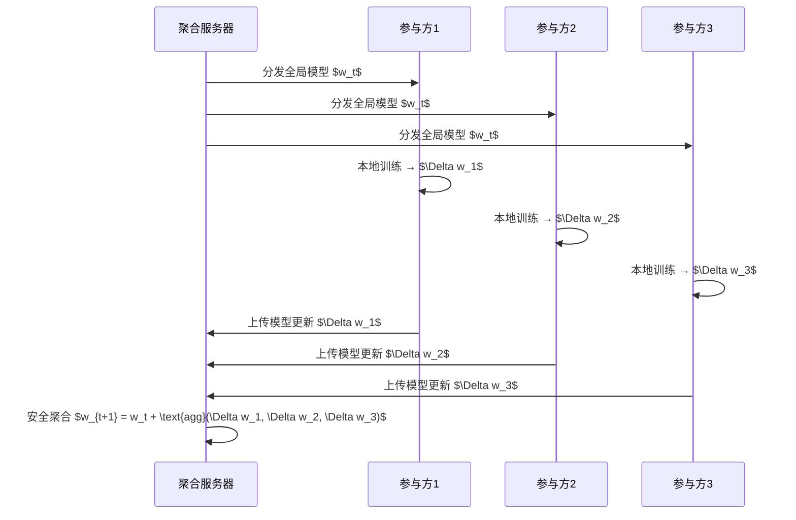
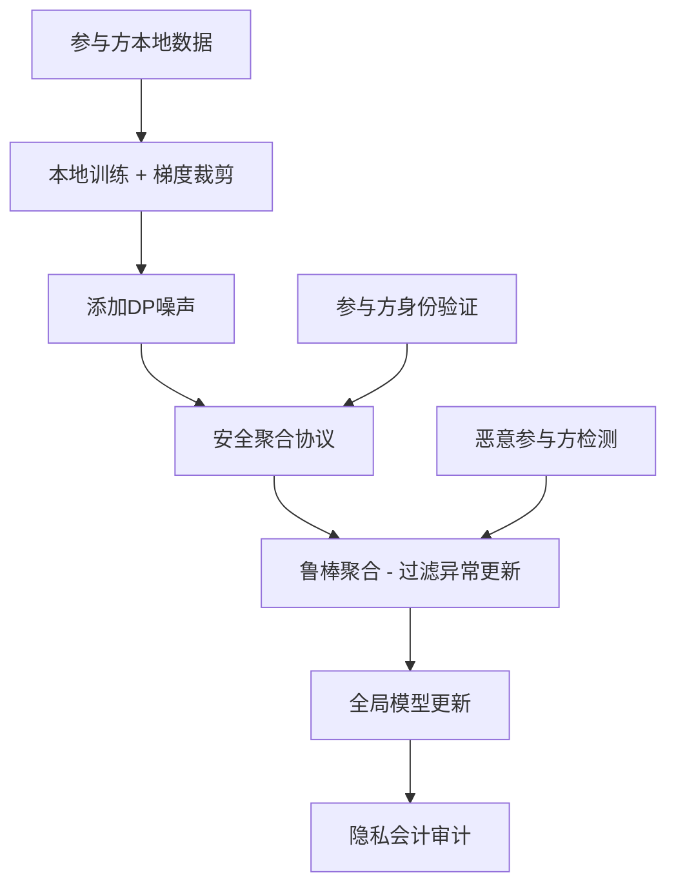
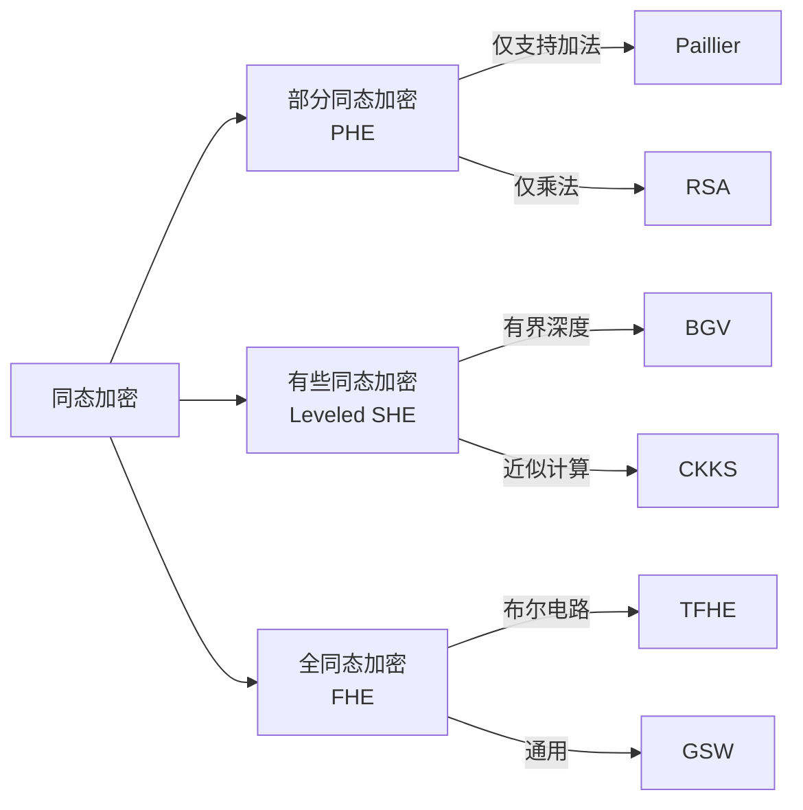
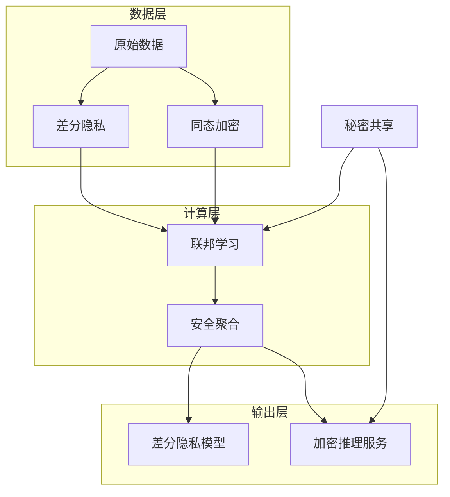
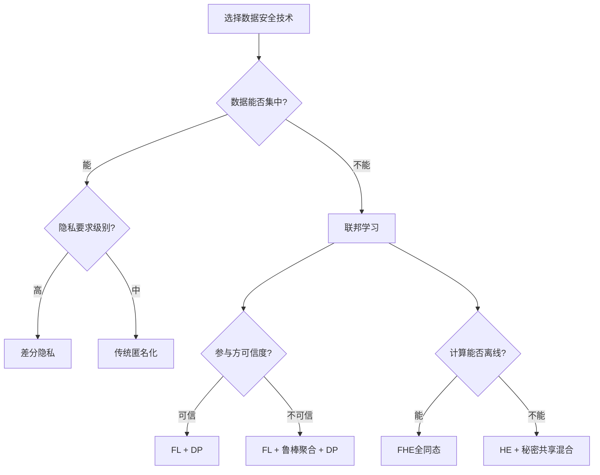

## 20.5 数据安全理论

数据是机器学习的燃料，也是攻击者觊觎的核心资产。本章从三个维度构建数据安全的理论体系：如何在使用数据时保护隐私（差分隐私）、如何在不共享数据的前提下协作建模（联邦学习安全）、以及如何在加密状态下完成计算（同态加密）。三者并非孤立存在——差分隐私为联邦学习提供隐私保障，同态加密为隐私计算提供密码学底座，它们共同构成了隐私保护机器学习（PPML）的理论基石。

### 20.5.1 差分隐私

#### 核心问题：为什么需要差分隐私

传统匿名化方法（如删除姓名、身份证号）已被反复证明不足以保护隐私。2006年Netflix推荐算法竞赛数据集被研究者通过关联IMDB公开评分重新识别出用户身份；2019年美国医疗数据集被证明可通过邮编+出生日期+性别三元组唯一标识87%的美国人。这些案例揭示了一个根本性事实：**确定性地发布数据统计信息必然泄露个体隐私**。

差分隐私（Differential Privacy, DP）的核心思想是：**通过引入受控的随机性，使单条记录的存在与否对输出结果的影响微乎其微**。这不是通过删除字段实现的，而是通过数学保证实现的——攻击者即使拥有全部背景知识，也无法判断某个个体是否在数据集中。

#### 形式化定义

**$(\epsilon, \delta)$-差分隐私**：随机算法 $\mathcal{M}$ 满足 $(\epsilon, \delta)$-差分隐私，当且仅当对于任意两个相邻数据集 $D$ 和 $D'$（仅相差一条记录），以及任意输出子集 $S$：

$$\Pr[\mathcal{M}(D) \in S] \leq e^\epsilon \cdot \Pr[\mathcal{M}(D') \in S] + \delta$$

参数解读：

| 参数 | 含义 | 典型取值 | 说明 |
|------|------|----------|------|
| $\epsilon$ | 隐私预算（privacy budget） | 0.1 ~ 10 | 越小保护越强，通常取1左右 |
| $\delta$ | 失败概率 | $< 1/n^2$（$n$为数据量） | 隐私被违反的极小概率 |

当 $\delta = 0$ 时，称为**纯差分隐私**（pure DP），隐私保证更强但噪声更大；$\delta > 0$ 时称为**近似差分隐私**（approximate DP），允许极小概率的隐私违反以换取更低的噪声。

#### 实现机制

**拉普拉斯机制**（适用于数值查询）：

对查询函数 $f$（全局敏感度为 $\Delta f = \max_{D, D'} \|f(D) - f(D')\|_1$），发布 $\tilde{f}(D) = f(D) + \text{Lap}(\Delta f / \epsilon)$。其中 $\text{Lap}(b)$ 是均值为0、尺度为$b$的拉普拉斯分布。

实现示例：

```python
import numpy as np

def laplace_mechanism(true_answer, sensitivity, epsilon):
    """拉普拉斯机制实现"""
    scale = sensitivity / epsilon
    noise = np.random.laplace(loc=0, scale=scale)
    return true_answer + noise

# 示例：统计年薪>50万的人数
true_count = 1247
sensitivity = 1  # 单条记录影响计数最多±1
epsilon = 1.0

noisy_count = laplace_mechanism(true_count, sensitivity, epsilon)
print(f"真实值: {true_count}, 发布值: {noisy_count:.0f}")
```

**高斯机制**（适用于需要较小$\delta$的场景）：

添加服从 $\mathcal{N}(0, \sigma^2)$ 的噪声，其中 $\sigma = \frac{\Delta_2 f}{\epsilon} \sqrt{2 \ln(1.25/\delta)}$，$\Delta_2 f$ 是 $L_2$ 敏感度。高斯机制更适合后续需要正态分布假设的统计分析。

**指数机制**（适用于非数值输出，如选择最优方案）：

为每个候选输出 $r$ 计算效用分数 $u(D, r)$，以正比于 $\exp(\epsilon \cdot u(D, r) / 2\Delta u)$ 的概率选择 $r$。常用于隐私保护的直方图发布和类别选择。

**高级组合定理**：

多次查询的隐私损失并非简单累加。设 $\mathcal{M}_1, \ldots, \mathcal{M}_k$ 各满足 $(\epsilon_i, \delta_i)$-DP，则组合后满足：

- **基本组合**：$(\sum \epsilon_i, \sum \delta_i)$-DP
- **高级组合**（Dwork等人2010）：对于$k$次 $(\epsilon, 0)$-DP 查询，组合满足 $(\epsilon', k\delta' + \delta)$-DP，其中 $\epsilon' = \sqrt{2k \ln(1/\delta')} \cdot \epsilon + k\epsilon(e^\epsilon - 1)$
- **Rényi差分隐私（RDP）**：通过Rényi散度跟踪隐私损失，组合更紧致

#### 隐私损失会计与自适应噪声

现代DP系统（如TensorFlow Privacy、Opacus）使用**隐私会计**（privacy accounting）精确跟踪累积隐私损失。核心方法包括：

- **Moments Accountant**（Abadi等人2016）：通过矩生成函数跟踪隐私损失分布，给出比高级组合更紧的界限
- **PRV Accountant**：基于隐私随机变量的卷积计算精确隐私损失
- **zCDP（零集中差分隐私）**：用Rényi散度的集中参数跟踪，计算效率高

```python
# 使用Opacus库的隐私会计示例
# pip install opacus
from opacus.accountants import RDPAccountant

accountant = RDPAccountant()
# 模拟100个训练步骤，每步ε=0.5, δ=1e-5
for _ in range(100):
    accountant.step(noise_multiplier=1.1, sample_rate=0.01)

epsilon_spent = accountant.get_epsilon(delta=1e-5)
print(f"100步训练后累计隐私损失: ε = {epsilon_spent:.2f}")
```

#### 差分隐私在机器学习中的应用

**DP-SGD（差分隐私随机梯度下降）**是将差分隐私应用于深度学习的核心算法：

1. 对每个样本的梯度进行裁剪（限制单个样本的影响）
2. 在聚合梯度中添加校准噪声
3. 使用隐私会计跟踪总体隐私消耗

```python
# DP-SGD核心逻辑
def dp_sgd_step(model, batch, epsilon, delta, max_grad_norm):
    # 1. 计算每个样本的梯度
    per_sample_grads = compute_per_sample_gradients(model, batch)
    
    # 2. 梯度裁剪（限制L2范数）
    clipped_grads = []
    for grad in per_sample_grads:
        grad_norm = torch.norm(grad)
        clip_factor = min(1.0, max_grad_norm / grad_norm)
        clipped_grads.append(grad * clip_factor)
    
    # 3. 聚合并添加噪声
    avg_grad = torch.stack(clipped_grads).mean(dim=0)
    noise_scale = max_grad_norm * sqrt(2 * log(1.25/delta)) / epsilon
    noise = torch.normal(0, noise_scale, size=avg_grad.shape)
    
    return avg_grad + noise
```

**实际效果与权衡**：DP-SGD在MNIST上可在 $\epsilon \leq 1$ 的强隐私下达到97%准确率（基线99%），但在ImageNet等复杂任务上精度损失可达5-15%。隐私-效用权衡是DP的根本挑战。

#### 隐私预算管理与常见误区

**常见误区**：

| 误区 | 事实 |
|------|------|
| $\epsilon < 1$ 才安全 | $\epsilon$ 的安全阈值取决于应用场景，$\epsilon \in [1, 10]$ 在很多实际部署中被认为可接受 |
| DP模型完全无法泄露信息 | DP提供的是概率保证，$\delta$ 参数允许极小概率的违反 |
| 加噪声越多越好 | 过多噪声导致数据完全不可用，需要在隐私和效用间平衡 |
| 一次查询就用完所有预算 | 现代隐私会计允许精细管理预算，不同查询消耗不同额度 |

**隐私预算管理最佳实践**：

- 为整个系统设定总隐私预算 $\epsilon_{\text{total}}$
- 按优先级分配预算给不同查询/模型训练
- 使用 Moments Accountant 精确跟踪消耗
- 当预算耗尽时停止所有数据访问
- 定期审计隐私保证是否仍然成立

### 20.5.2 联邦学习安全

#### 联邦学习基础架构

联邦学习（Federated Learning, FL）由Google在2016年提出，允许多个参与方在不共享原始数据的前提下协作训练机器学习模型。核心流程如下：



聚合算法最常用的是 **FedAvg**：$w_{t+1} = \sum_{k=1}^{n} \frac{n_k}{n} w_{t+1}^k$，其中 $n_k$ 是参与方 $k$ 的样本数。

#### 攻击分类与威胁分析

联邦学习面临四大类攻击，攻击者的能力假设各异：

**1. 拜占庭攻击（Byzantine Attacks）**

恶意参与方发送经过精心构造的错误模型更新，目的是破坏全局模型的收敛性或准确性。

典型攻击方式：

- **模型替换攻击**（Model Replacement）：发送一个被篡改的模型，使全局模型在特定输入上产生错误输出。攻击者放大自己的更新幅度：$\Delta w_{\text{mal}} = \alpha \cdot (w_{\text{target}} - w_t)$，其中 $\alpha \gg 1$
- **分布式拒绝服务攻击**：发送无穷大或NaN值使聚合崩溃
- **隐蔽攻击**：发送看似正常但方向有害的更新，难以被统计检测发现

**2. 数据投毒攻击（Data Poisoning Attacks）**

攻击者污染自己的本地训练数据，使全局模型学到错误的模式。

- **随机投毒**：随机翻转标签，降低模型整体准确率
- **目标投毒**（Backdoor）：在特定输入模式（如特定像素图案）下触发错误分类，正常样本上表现正常。这种后门极其隐蔽。

```python
# 后门攻击示例：在训练图像左上角插入触发模式
def add_backdoor_trigger(image, trigger_size=5):
    """在图像左上角添加白色方块触发器"""
    poisoned = image.clone()
    poisoned[:, :trigger_size, :trigger_size] = 1.0  # 白色方块
    return poisoned

# 攻击者本地训练时：
# - 90%正常数据正常训练
# - 10%数据添加触发器，并将标签改为目标类（如"飞机"）
```

**3. 梯度泄露攻击（Gradient Inversion Attacks）**

从共享的模型更新（梯度）中反向推断训练数据，是联邦学习最严重的隐私威胁之一。

**DLG（Deep Leakage from Gradients）**攻击（Zhu等人2019）：通过优化问题 $\min_{x', y'} \|\nabla_\theta L(x', y'; \theta) - \nabla_\theta L(x, y; \theta)\|^2$ 从梯度中恢复原始训练样本 $(x, y)$。实验表明，在图像分类任务中可以从单批次梯度中高保真还原训练图像。

**Inverting Gradients**（Geiping等人2020）：改进了DLG，使用余弦相似度作为损失函数，并引入总变差正则化，在批量大小为几十的场景下仍能成功恢复图像。

```python
# 梯度反转攻击简化示意
import torch

def gradient_inversion_attack(model, target_grad, iterations=1000):
    """从目标梯度恢复训练数据"""
    # 初始化随机假数据
    fake_data = torch.randn(1, 3, 32, 32, requires_grad=True)
    fake_label = torch.randint(0, 10, (1,))
    optimizer = torch.optim.Adam([fake_data], lr=0.01)
    
    for i in range(iterations):
        optimizer.zero_grad()
        # 计算假数据的梯度
        output = model(fake_data)
        loss = torch.nn.functional.cross_entropy(output, fake_label)
        fake_grad = torch.autograd.grad(loss, model.parameters())
        
        # 使假数据的梯度逼近真实梯度
        grad_diff = sum(
            torch.cosine_similarity(fg.flatten(), tg.flatten(), dim=0)
            for fg, tg in zip(fake_grad, target_grad)
        )
        grad_diff.backward()
        optimizer.step()
    
    return fake_data.detach()
```

**4. 推理攻击（Inference Attacks）**

- **成员推理攻击**：判断某个样本是否参与了模型训练。在联邦学习中，攻击者可以利用观察到的模型更新序列进行更精确的成员推理
- **属性推理攻击**：推断参与方数据集的全局属性（如某医院的患者中糖尿病患者比例）

#### 防御机制体系

**安全聚合（Secure Aggregation）**：

使用密码学协议确保服务器只能看到聚合结果，无法看到任何单个参与方的更新。核心方案包括：

- **Bonawitz等人（2017）协议**：使用秘密共享和掩码技术，即使有参与方中途退出也能正确聚合
- **核心思想**：每个参与方 $i$ 对其他参与方 $j$ 生成成对密钥 $s_{ij}$，上传 $g_i + \sum_j (s_{ij} - s_{ji})$，其中 $s_{ij} = -s_{ji}$，聚合后密钥相互抵消

```python
# 安全聚合简化示意
def secure_aggregate_masking(gradients, pairwise_keys):
    """
    pairwise_keys[i][j] = -pairwise_keys[j][i]
    聚合后密钥自动抵消
    """
    masked_grads = []
    for i, g_i in enumerate(gradients):
        mask = sum(pairwise_keys[i][j] for j in range(len(gradients)) if j != i)
        masked_grads.append(g_i + mask)
    
    # 服务器只能看到聚合结果
    aggregated = sum(masked_grads) / len(masked_grads)
    # 密钥项相互抵消: sum(pairwise_keys[i][j]) = 0
    return aggregated
```

**鲁棒聚合算法**：

抵抗拜占庭攻击的核心方法：

| 算法 | 原理 | 适用场景 |
|------|------|----------|
| **Krum** | 选择与其他更新距离之和最小的更新作为聚合结果 | 少量恶意参与方 |
| **Trimmed Mean** | 去掉每个维度上最大和最小的若干值后取平均 | 一般场景 |
| **Median** | 对每个维度取中位数 | 对称攻击 |
| **FLTrust** | 服务器维护一个小型根数据集作为信任基准 | 服务器可信场景 |
| **FLOD** | 使用检测模型识别异常更新 | 需要先验知识 |

**差分隐私联邦学习**：

在模型更新中添加噪声，保护参与方的隐私：

$$\tilde{g}_k = \text{clip}(g_k, C) + \mathcal{N}(0, \sigma^2 C^2 I)$$

其中 $C$ 是裁剪阈值，$\sigma$ 控制噪声强度。这使得梯度反转攻击变得不可行，但会降低模型精度。

**实际部署中的安全架构**：



#### 横向联邦 vs 纵向联邦 vs 联邦迁移学习

| 类型 | 数据分布 | 典型场景 | 主要安全挑战 |
|------|----------|----------|-------------|
| 横向联邦 | 特征相同，样本不同 | 各医院相同科室的患者数据 | 梯度泄露、拜占庭攻击 |
| 纵向联邦 | 样本相同，特征不同 | 银行+电商的联合建模 | 特征泄露、标签泄露 |
| 联邦迁移学习 | 特征和样本都不同 | 跨语言模型迁移 | 知识泄露 |

### 20.5.3 同态加密在机器学习中的应用

#### 同态加密基础

同态加密（Homomorphic Encryption, HE）允许在密文上直接执行计算，解密后得到的结果与在明文上执行相同计算的结果一致。形式化表达：

$$\text{Dec}(\text{Eval}(f, \text{Enc}(x_1), \ldots, \text{Enc}(x_n))) = f(x_1, \ldots, x_n)$$

这意味着数据可以始终保持加密状态——从存储、传输到计算、返回结果，只有数据拥有者才能解密最终结果。

#### 同态加密方案分类



| 方案 | 支持操作 | 精度 | 计算开销 | 适用场景 |
|------|----------|------|----------|----------|
| **Paillier** | 加法 | 精确 | 低 | 安全聚合、投票 |
| **RSA-EP** | 乘法 | 精确 | 低 | 简单乘法运算 |
| **BFV/BGV** | 加法+乘法 | 精确 | 中-高 | 整数运算、逻辑电路 |
| **CKKS** | 加法+乘法 | 近似 | 中 | 浮点计算、机器学习推理 |
| **TFHE** | 任意布尔门 | 精确 | 高 | 通用计算、查找表 |

#### CKKS方案详解

CKKS（Cheon-Kim-Kim-Song，2017）是机器学习中最常用的同态加密方案，因为ML本身对数值精度有一定容忍度，而CKKS的近似计算特性恰好匹配这一需求。

**核心创新**：CKKS将实数编码为多项式环中的元素，支持SIMD（单指令多数据）操作——一个密文可以同时编码数千个浮点数，并行执行相同的运算。

```python
# 使用TenSEAL库的CKKS示例
# pip install tenseal
import tenseal as ts
import numpy as np

# 创建CKKS上下文
context = ts.context(
    scheme=ts.scheme_type.CKKS,
    poly_modulus_degree=8192,
    coeff_mod_bit_sizes=[60, 40, 40, 60]
)
context.global_scale = 2**40
context.generate_galois_keys()

# 加密两个向量
v1 = [1.0, 2.0, 3.0, 4.0]
v2 = [5.0, 6.0, 7.0, 8.0]
enc_v1 = ts.ckks_vector(context, v1)
enc_v2 = ts.ckks_vector(context, v2)

# 在密文上执行计算
enc_sum = enc_v1 + enc_v2          # 加法
enc_product = enc_v1 * enc_v2      # 逐元素乘法
enc_dot = enc_v1.dot(enc_v2)       # 点积

# 解密结果
print("点积结果:", enc_dot.decrypt())  # [70.0] (1×5+2×6+3×7+4×8)
```

#### 同态加密机器学习推理

**场景**：用户将加密的输入发送给服务器，服务器使用训练好的模型进行推理，返回加密结果。服务器全程无法看到用户数据。

**线性层的加密推理**：

对于全连接层 $y = Wx + b$，服务器持有明文的 $W$ 和 $b$，用户发送 $\text{Enc}(x)$：

$$\text{Enc}(y) = W \cdot \text{Enc}(x) + b$$

这直接利用了同态乘法和加法。

**非线性激活函数的处理**：

同态加密不支持直接计算ReLU、sigmoid等非线性函数。常用替代方案：

| 方案 | 原理 | 精度 | 效率 |
|------|------|------|------|
| 多项式近似 | 用低阶多项式逼近激活函数 | 中等 | 高 |
| 分段线性近似 | 用多段线性函数逼近 | 较高 | 中 |
| 查找表+TFHE | 将激活函数值预计算为查找表 | 精确 | 低 |
| 避免激活函数 | 使用可逆矩阵或多项式网络 | 取决于架构 | 最高 |

```python
# 多项式近似ReLU: f(x) ≈ ax² + bx + c
def approx_relu_poly(coeffs, enc_x):
    """用多项式近似ReLU"""
    a, b, c = coeffs
    enc_x_sq = enc_x * enc_x  # 同态乘法
    return enc_x_sq * a + enc_x * b + c
```

#### 性能瓶颈与优化

同态加密的主要性能挑战：

**Bootstrapping**：FHE的核心操作，将"噪声满"的密文刷新为新的低噪声密文。这是支持任意深度计算的关键，但也是最耗时的操作——一次bootstrapping可能需要数秒到数分钟。

**优化策略**：

1. **SIMD打包**：CKKS单密文可编码数千个值，充分利用并行性
2. **电路深度优化**：精心设计计算图，减少乘法深度（乘法是噪声增长的主要来源）
3. **混合协议**：HE用于线性层，混淆电路（GC）或秘密共享用于非线性层
4. **硬件加速**：GPU/FPGA/专用ASIC加速NTT（数论变换）运算
5. **模型压缩**：量化、剪枝减少计算量

**实际性能参考**（2024年基准）：

| 模型 | 方案 | 推理时间 | 精度损失 | 硬件 |
|------|------|----------|----------|------|
| Logistic Regression | CKKS | <100ms | <1% | CPU |
| LeNet-5 | CKKS | ~2s | <2% | CPU |
| ResNet-20 | CKKS+GC混合 | ~30s | <3% | GPU |
| BERT-base | CKKS+SS混合 | ~10min | <5% | 8×GPU |

#### 实际应用框架

**Microsoft SEAL**：最成熟的C++ HE库，支持BFV、CKKS方案

**TenSEAL**：SEAL的Python封装，适合ML研究

**CrypTen**（Meta）：基于PyTorch的安全计算框架，支持HE和秘密共享的混合协议

**FHE.org生态**：开源社区推动标准化，Zama公司的concrete-ml库提供了scikit-learn兼容的HE模型

```python
# CrypTen示例：加密推理
import crypten
crypten.init()

# 加密模型和输入
model = SimpleNet()
dummy_input = torch.randn(1, 784)
encrypted_model = crypten.nn.from_pytorch(model, dummy_input)
encrypted_model.encrypt()

# 加密输入
private_input = crypten.cryptensor(torch.randn(1, 784))

# 加密推理
encrypted_model.eval()
encrypted_output = encrypted_model(private_input)
result = encrypted_output.get_plain_text()  # 仅参与方可解密
```

### 20.5.4 三大技术的综合应用

#### 隐私保护机器学习全景图

三种技术并非互斥，而是可以组合使用以提供更强的隐私保证：



**组合方案示例**：

| 场景 | 推荐组合 | 理由 |
|------|----------|------|
| 医院联合建模 | FL + DP + 安全聚合 | 数据高度敏感，法规要求严格 |
| 金融风控模型 | 纵向FL + 秘密共享 | 数据分布在不同机构，特征互补 |
| 用户设备推理 | 本地模型 + DP训练 | 设备资源有限，需要轻量方案 |
| 云端ML推理 | CKKS加密推理 | 用户数据不上云，服务器不可信 |
| 大规模模型训练 | FL + DP-SGD + 审计 | 平衡效率、隐私和可审计性 |

#### 技术选型决策框架

选择数据安全技术时需要考虑以下维度：



### 20.5.5 进阶话题

#### 隐私放大技术

- **子采样放大**（Amplification by Sampling）：如果每个样本以概率 $q$ 被选入mini-batch，则 $(\epsilon, \delta)$-DP 放大为 $(O(q\epsilon), q\delta)$-DP。这在DP-SGD中自然发生，因为mini-batch只是全数据集的子集
- **安全多方计算放大**：通过秘密共享将隐私保证放大
- **混洗模型放大**（Shuffle Model）：用户先本地添加小噪声，然后通过匿名混洗器打乱，可以获得比本地DP强得多的全局隐私保证（Balle等人2019）

#### 零知识证明与可验证计算

在隐私保护ML中引入零知识证明（ZKP），可以实现：

- **可验证的模型训练**：证明模型确实按协议训练，没有作弊
- **可验证的推理**：证明推理结果确实由声称的模型在声称的输入上计算得出
- **方案**：zk-SNARKs、Bulletproofs、Plonk等通用ZKP系统

#### 法规合规映射

| 法规 | 核心要求 | 对应技术 |
|------|----------|----------|
| GDPR（欧盟） | 数据最小化、目的限制、被遗忘权 | DP、FL |
| CCPA（加州） | 知情权、删除权、拒绝出售权 | DP、HE |
| PIPL（中国） | 最小必要、知情同意、跨境传输限制 | FL、HE、DP |
| HIPAA（美国医疗） | 最小必要标准、去标识化 | DP、FL |
| 欧盟AI法案 | 高风险AI系统数据治理 | 全部三项 |

### 20.5.6 常见误区与最佳实践

**误区1**："联邦学习天然保护隐私"

事实：联邦学习仅避免了原始数据的直接传输，但模型更新（梯度）仍可能泄露信息。必须结合差分隐私或安全聚合才能提供有意义的隐私保证。

**误区2**："同态加密太慢，不实用"

事实：FHE全同态确实慢，但部分同态和有些同态方案在特定场景下已经可以达到实用水平。对于线性模型，CKKS推理延迟可控制在100ms以内。

**误区3**："$\epsilon = 10$ 的差分隐私没有意义"

事实：即使 $\epsilon$ 较大，DP仍然提供了传统匿名化无法提供的数学保证。关键是根据威胁模型选择合适的参数。

**误区4**："这些技术只需要关注算法，不需要关注工程"

事实：DP的隐私会计精度、FL的通信效率、HE的参数选择都是工程问题，直接影响系统的实际安全性和可用性。

**最佳实践清单**：

1. **威胁建模先行**：明确攻击者的能力假设，再选择防御技术
2. **分层防御**：不依赖单一技术，组合使用DP+FL+HE
3. **隐私会计是必须的**：必须精确跟踪和报告隐私消耗
4. **持续审计**：定期验证隐私保证是否仍然成立
5. **关注可用性**：隐私保护不能以牺牲模型可用性为代价
6. **开源审计**：使用经过社区审计的开源实现（SEAL、Opacus、TenSEAL、CrypTen）
7. **法规对齐**：确保技术方案满足适用的法规要求
