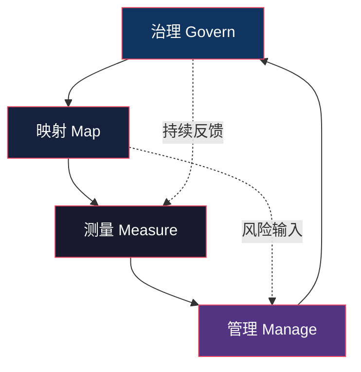
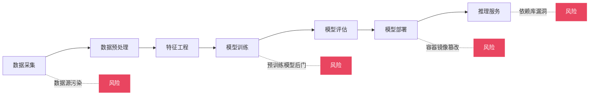
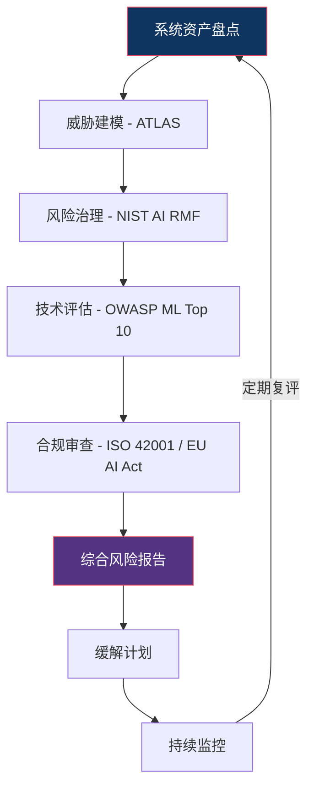

## 20.6 AI安全评估框架

AI安全评估框架是系统性识别、量化和管理AI/ML系统安全风险的方法论体系。与传统软件安全评估不同，AI系统面临的威胁面包括数据层面的投毒、模型层面的窃取与逆向、推理层面的对抗攻击，以及部署层面的供应链风险。评估框架的价值在于：将零散的安全关注点转化为可操作、可度量、可审计的系统化流程。

本节从全球主流的四大评估框架出发，深入讲解每个框架的架构设计、核心组件、实施方法和实际应用场景，最后给出综合评估实践指南。

### 20.6.1 MITRE ATLAS：AI系统对抗性威胁知识库

#### 框架定位与设计哲学

MITRE ATLAS（Adversarial Threat Landscape for AI Systems）是MITRE在2021年发布的专门针对AI系统的威胁知识库。它的设计哲学借鉴了经典网络安全领域的ATT&CK框架——通过结构化的战术（Tactic）和技术（Technique）分类，为AI安全防御者提供统一的威胁语言。

ATLAS与ATT&CK的关键区别在于攻击面不同。ATT&CK关注传统IT基础设施（网络、主机、云），而ATLAS聚焦于ML管线本身：数据采集→训练→部署→推理的完整生命周期。


#### 十四类战术详解

ATLAS定义了14个战术阶段，覆盖从初始侦察到最终影响的完整攻击链。以下是每个战术的详细说明：

**1. 侦察（Reconnaissance）**

收集目标AI系统的技术情报。攻击者在此阶段需要了解目标使用了什么模型架构、训练数据来源、部署方式（API/本地/边缘设备）以及防护措施。

具体技术包括：
- 公开信息搜集：扫描GitHub仓库、论文引用、招聘信息中暴露的技术栈信息
- API探测：通过目标系统的公开API推断模型类型、输入格式、响应模式
- 侧信道探测：测量响应时间推断模型复杂度（大模型通常推理更慢）

**2. 资源开发（Resource Development）**

准备攻击所需的工具、数据和基础设施。与传统攻击的资源开发不同，AI攻击的资源开发侧重于：

- 构建对抗性样本生成工具链
- 收集或生成用于数据投毒的恶意样本
- 训练替代模型（surrogate model）用于黑盒攻击
- 部署用于窃取模型推理结果的代理服务

**3. 初始访问（Initial Access）**

获取与目标AI系统的交互入口。常见路径：

| 访问方式 | 典型场景 | 风险等级 |
|---------|---------|---------|
| 公开API | 对外提供的模型推理服务 | 中 |
| 嵌入式SDK | 集成到应用中的模型组件 | 中-高 |
| 开源模型 | 下载预训练模型进行本地部署 | 高（供应链） |
| 内部系统 | 企业内部ML平台 | 高（内鬼） |
| 物理设备 | 边缘AI设备（摄像头、IoT） | 高 |

**4. ML模型访问（ML Model Access）**

获取对模型本身的访问权限。这是AI攻击区别于传统攻击的核心环节。按访问深度分为：

- **黑盒（Black-box）**：只能通过API发送输入、获取输出。攻击者不知道模型架构和参数。实际中最常见的攻击场景。
- **灰盒（Gray-box）**：部分了解模型信息（如知道架构但不知道权重，或知道训练数据分布）。
- **白盒（White-box）**：完全访问模型架构、权重和训练过程。常见于开源模型或内部泄露场景。

访问深度直接决定了攻击成本和成功率。黑盒攻击通常需要更多查询次数，但现实世界中大多数对外服务都是黑盒场景。

**5. 执行（Execution）**

在目标系统上运行恶意代码或触发恶意推理。AI场景中的执行包括：
- 通过精心设计的输入触发模型产生错误推理
- 利用模型服务端的代码漏洞执行任意代码（如通过序列化模型文件注入恶意代码）
- 利用LLM的代码执行能力进行攻击（如让AI Agent执行恶意命令）

**6. 持久化（Persistence）**

在AI系统中维持长期访问。AI系统的持久化手段与传统系统不同：

- **后门植入**：在模型训练过程中植入后门，使模型在特定触发条件下产生攻击者期望的输出
- **数据集污染**：在训练数据中持续注入恶意样本
- **依赖库篡改**：在ML依赖库（如特定版本的transformers）中植入后门

**7. 防御规避（Defense Evasion）**

绕过AI安全防御机制。主要技术：

- 对抗性扰动：在输入中添加人眼不可见的微小扰动，绕过输入验证
- 查询策略优化：使用自然查询模式避免触发异常检测
- 输出编码规避：通过特定的prompt格式绕过输出过滤
- 分布偏移：生成在统计分布上与正常样本相似的恶意输入

**8. 凭证访问（Credential Access）**

获取AI系统的访问凭证。目标包括：
- ML平台的API密钥（如OpenAI、AWS SageMaker的密钥）
- 模型仓库的访问令牌
- 训练集群的SSH凭证
- 数据管道的服务账户

**9. 发现（Discovery）**

在获取初始访问后，探测AI系统的技术细节：
- 通过大量查询推断模型架构（是CNN还是Transformer？多少层？）
- 探测模型的决策边界和置信度分布
- 识别模型的输入预处理和输出后处理流程
- 发现模型的版本和更新频率

**10. 横向移动（Lateral Movement）**

在AI基础设施中从一个组件移动到另一个组件：
- 从推理服务移动到训练集群
- 从模型仓库移动到数据仓库
- 从边缘设备移动到云端模型服务
- 利用ML平台的内部网络连接进行跳板攻击

**11. 收集（Collection）**

收集目标AI系统的关键数据：
- 训练数据样本（用于重建训练集或发现隐私泄露）
- 模型配置和超参数
- 输入输出日志（包含用户敏感数据）
- 评估指标和基准测试结果

**12. ML攻击阶段（ML Attack Staging）**

这是ATLAS独有的战术，专门描述ML攻击的准备工作。具体技术：

| 技术 | 描述 | 典型工具 |
|-----|------|---------|
| 对抗样本生成 | 生成能够欺骗模型的输入 | FGSM、PGD、C&W |
| 替代模型训练 | 训练目标模型的近似副本 | Knockoff Nets |
| 后门植入 | 在训练过程中植入隐蔽后门 | BadNets、TrojAI |
| 数据投毒 | 向训练数据注入恶意样本 | Poison Frog |
| 模型逆向 | 从输出推断模型内部信息 | 梯度估计、模型窃取 |
| 越狱攻击 | 绕过LLM的安全对齐 | GCG、AutoDAN |

**13. 渗出（Exfiltration）**

从AI系统中提取数据或模型：
- 模型窃取：通过大量API查询重建目标模型的功能
- 训练数据提取：从模型的输出中恢复训练数据片段
- 用户数据泄露：通过模型的记忆化效应提取用户提交的敏感数据
- 隐私推理：通过成员推断攻击判断特定数据是否在训练集中

**14. 影响（Impact）**

对目标AI系统造成实际损害：
- 功能破坏：使模型产生系统性错误输出
- 声誉损害：操纵模型产生有害内容
- 财务损失：通过操纵AI定价或推荐系统获利
- 信息泄露：提取模型中嵌入的敏感知识
- 物理安全：在自动驾驶、工业控制等场景中造成物理危害

#### 实施方法：构建ATLAS威胁模型

以下是基于ATLAS构建AI系统威胁模型的实操步骤：

```python
# ATLAS威胁模型评估模板（伪代码框架）
threat_model = {
    "system": {
        "name": "目标AI系统名称",
        "type": "LLM / CV / NLP / 推荐系统",
        "deployment": "API / 嵌入式 / 边缘 / 本地",
        "data_sensitivity": "公开 / 内部 / 敏感 / 高敏感"
    },
    "assets": {
        "model": "模型架构、权重、配置",
        "data": "训练数据、用户输入、输出日志",
        "infrastructure": "GPU集群、ML平台、数据管道"
    },
    "threats": [],
    "controls": []
}

# 对每个ATLAS战术评估威胁
for tactic in ATLAS_TACITCS:
    for technique in tactic.techniques:
        threat = {
            "tactic": tactic.name,
            "technique": technique.name,
            "applicability": "高/中/低/不适用",
            "impact": "高/中/低",
            "likelihood": "高/中/低",
            "existing_controls": "当前防护措施描述",
            "gaps": "防护缺口描述",
            "recommended_mitigations": ["缓解措施1", "缓解措施2"]
        }
        threat_model["threats"].append(threat)
```

实际评估时，建议按以下优先级排列：

1. 先评估系统面临的所有ATLAS战术
2. 标记每个战术的适用性和风险等级
3. 对高风险战术的每种技术进行详细分析
4. 识别现有防护措施的覆盖缺口
5. 制定针对性的缓解方案

---

### 20.6.2 NIST AI风险管理框架（AI RMF）

#### 框架概述

NIST AI RMF 1.0于2023年1月发布，是美国国家标准与技术研究院推出的AI风险管理框架。它的核心目标是帮助组织在AI系统的整个生命周期中识别、评估和管理风险，特别是那些与可信AI（Trustworthy AI）相关的风险。

NIST AI RMF的定位不是技术性的攻击知识库（那是ATLAS的事），而是组织层面的风险治理框架。它回答的核心问题是："一个组织应该如何系统地管理AI带来的风险？"

#### 四大核心功能

NIST AI RMF定义了四个核心功能（Function），每个功能下包含多个子类别（Category）：



**1. 治理（Govern）—— 建立AI风险管理的组织基础**

治理是所有其他功能的基石。它确保AI风险管理不是一个临时项目，而是嵌入组织文化中的持续实践。

治理功能的核心子类别：

- **GOVERN-1：建立AI风险管理的组织文化和治理结构**
  - 定义AI安全相关的角色和职责（如AI安全官、模型审计员）
  - 建立跨职能的AI治理委员会
  - 将AI风险管理纳入企业整体风险管理框架

- **GOVERN-2：识别和管理AI风险的法律与合规要求**
  - 跟踪适用的法规（如欧盟AI法案、个人信息保护法）
  - 建立AI系统的合规审查流程
  - 记录AI系统的决策逻辑以满足可解释性要求

- **GOVERN-3：建立AI风险管理的资源保障**
  - 为AI安全评估分配预算和人员
  - 建立AI安全培训计划
  - 部署AI安全工具链

**2. 映射（Map）—— 识别和评估AI风险的上下文**

映射功能回答"我们的AI系统面临什么风险"这个问题。它要求组织在具体上下文中理解AI风险，而不是抽象地谈论风险。

核心子类别：

- **MAP-1：建立AI系统的上下文**
  - 定义AI系统的预期用途和边界
  - 识别利益相关者及其需求
  - 评估系统对不同群体的影响差异

- **MAP-2：识别AI风险**
  - 识别数据风险（偏差、质量、隐私）
  - 模型风险（准确性、鲁棒性、可解释性）
  - 部署风险（滥用、误用、环境变化）
  - 识别系统级和生态级风险

- **MAP-3：评估AI风险的严重程度**
  - 使用风险矩阵评估每个风险的可能性和影响
  - 考虑风险的级联效应
  - 对比AI风险与替代方案的风险

**3. 测量（Measure）—— 量化AI风险**

测量功能将映射阶段识别的风险转化为可度量的指标。这是AI安全评估中最具技术含量的部分。

核心子类别：

- **MEASURE-1：选择和实施AI风险度量方法**
  - 性能指标：准确率、精确率、召回率、F1
  - 公平性指标：统计均等、机会均等、校准性
  - 鲁棒性指标：对抗样本成功率、分布偏移下的性能衰减
  - 隐私指标：成员推断攻击成功率、差分隐私预算

- **MEASURE-2：持续监控AI系统的风险指标**
  - 建立模型性能的基线和漂移检测
  - 监控输入数据分布的变化
  - 跟踪安全事件和攻击尝试

具体度量方法示例：

```python
# AI安全评估度量示例框架
class AISecurityMetrics:
    def __init__(self, model, test_data):
        self.model = model
        self.test_data = test_data
    
    def robustness_score(self, epsilon=0.03):
        """对抗鲁棒性评估：在FGSM攻击下的准确率保持比例"""
        clean_acc = self.evaluate(self.test_data)
        adv_data = self.fgsm_attack(self.test_data, epsilon)
        adv_acc = self.evaluate(adv_data)
        return {
            "clean_accuracy": clean_acc,
            "adversarial_accuracy": adv_acc,
            "robustness_ratio": adv_acc / clean_acc,
            "epsilon": epsilon
        }
    
    def privacy_leakage_score(self, sample_count=1000):
        """隐私泄露评估：成员推断攻击成功率"""
        member_scores = self.model.predict(member_samples[:sample_count])
        non_member_scores = self.model.predict(non_member_samples[:sample_count])
        threshold = 0.5  # 简化阈值
        member_correct = sum(1 for s in member_scores if s > threshold)
        non_member_correct = sum(1 for s in non_member_scores if s <= threshold)
        mia_success = (member_correct + non_member_correct) / (2 * sample_count)
        return {
            "mia_accuracy": mia_success,
            "baseline": 0.5,  # 随机猜测基线
            "leakage_risk": "高" if mia_success > 0.7 else "中" if mia_success > 0.55 else "低"
        }
    
    def bias_score(self, protected_attributes):
        """公平性评估：不同群体间的性能差异"""
        results = {}
        for attr in protected_attributes:
            groups = self.split_by_attribute(self.test_data, attr)
            group_metrics = {}
            for group_name, group_data in groups.items():
                group_metrics[group_name] = self.evaluate(group_data)
            max_diff = max(group_metrics.values()) - min(group_metrics.values())
            results[attr] = {
                "group_metrics": group_metrics,
                "max_disparity": max_diff,
                "fair": max_diff < 0.05  # 5%阈值
            }
        return results
```

**4. 管理（Manage）—— 缓解和控制AI风险**

管理功能将测量阶段的发现转化为具体的行动。它回答"我们如何应对这些风险"。

核心子类别：

- **MANAGE-1：制定和实施AI风险缓解计划**
  - 为每个已识别的风险制定缓解策略（规避、转移、缓解、接受）
  - 定义风险缓解的优先级和时间线
  - 分配风险缓解的责任人

- **MANAGE-2：建立AI安全事件响应机制**
  - 定义AI安全事件的分类和严重等级
  - 建立事件响应流程（检测→遏制→根除→恢复→复盘）
  - 定期进行AI安全演练

- **MANAGE-3：持续改进AI风险管理实践**
  - 根据安全事件和新兴威胁更新评估方法
  - 跟踪AI安全领域的最新研究和最佳实践
  - 定期审查和更新AI治理政策

#### NIST AI RMF实施路线图

以下是组织实施NIST AI RMF的推荐路线图：

| 阶段 | 时间 | 核心任务 | 产出物 |
|-----|------|---------|-------|
| 评估现状 | 第1-2月 | 盘点AI资产、识别现有治理结构 | AI资产清单、差距分析报告 |
| 建立治理 | 第2-4月 | 设立AI治理角色和委员会、制定政策 | AI治理章程、角色职责说明 |
| 风险映射 | 第3-5月 | 对关键AI系统进行风险评估 | 风险登记册、影响评估报告 |
| 度量建设 | 第4-7月 | 部署度量工具、建立基线 | 度量仪表盘、基线报告 |
| 管理实施 | 第6-9月 | 实施缓解措施、建立事件响应 | 缓解计划、事件响应手册 |
| 持续运行 | 持续 | 监控、审查、改进 | 季度审查报告、更新日志 |

---

### 20.6.3 OWASP机器学习安全Top 10

#### 框架定位

OWASP机器学习安全Top 10（ML Top 10）于2023年发布，是OWASP基金会专门针对ML系统安全风险的排名清单。它面向ML工程师、安全团队和决策者，提供了一份简洁但全面的ML安全风险地图。

OWASP ML Top 10的价值在于：它是面向开发者的安全检查清单，每个风险项都配有具体的描述、影响、示例和缓解措施。

#### 十大风险详解

**ML01:2023 — 输入操纵攻击（Input Manipulation Attack）**

攻击者通过精心设计的输入（对抗样本）操纵ML模型的推理结果。这是ML安全中最经典、研究最充分的攻击类型。

攻击原理：ML模型学习的是数据中的统计模式，而非真正的因果关系。通过在输入数据中添加特定方向的微小扰动，可以利用模型决策边界的脆弱性，使其产生攻击者期望的错误输出。

典型攻击方法：
- **FGSM（Fast Gradient Sign Method）**：利用模型梯度方向生成对抗扰动，一步即可生成对抗样本
- **PGD（Projected Gradient Descent）**：FGSM的迭代版本，攻击效果更强
- **C&W（Carlini & Wagner）**：优化目标函数生成最小扰动的对抗样本
- **AutoAttack**：自动化的对抗攻击评估方法，集成了多种攻击策略

在LLM场景中，输入操纵表现为prompt注入和越狱攻击：
- 直接注入：在用户输入中嵌入恶意指令覆盖系统提示
- 间接注入：在外部数据源（网页、文档）中嵌入隐藏指令
- 越狱攻击：使用特定格式绕过模型的安全对齐

缓解措施：
```python
# 输入验证与过滤示例
class InputValidator:
    def __init__(self, model, threshold=0.5):
        self.model = model
        self.threshold = threshold
    
    def validate(self, input_data):
        """多层输入验证"""
        # 1. 格式验证
        if not self.check_format(input_data):
            return REJECT, "格式不合规"
        
        # 2. 范围验证
        if not self.check_range(input_data):
            return REJECT, "数值超出预期范围"
        
        # 3. 对抗样本检测
        adv_score = self.detect_adversarial(input_data)
        if adv_score > self.threshold:
            return REJECT, f"疑似对抗样本（置信度: {adv_score:.2f}）"
        
        # 4. 分布偏移检测
        if self.detect_distribution_shift(input_data):
            return WARN, "输入分布与训练数据显著不同"
        
        return ACCEPT, "验证通过"
    
    def detect_adversarial(self, input_data):
        """基于特征压缩的对抗样本检测"""
        # 使用JPEG压缩去除高频扰动
        compressed = self.jpeg_compress(input_data, quality=75)
        original_pred = self.model.predict(input_data)
        compressed_pred = self.model.predict(compressed)
        # 对抗样本在压缩后通常会改变预测结果
        divergence = self.prediction_divergence(original_pred, compressed_pred)
        return divergence
```

**ML02:2023 — 数据投毒攻击（Data Poisoning Attack）**

攻击者在模型训练数据中注入恶意样本，使训练后的模型产生攻击者期望的行为。

两种主要类型：

| 类型 | 机制 | 难度 | 危害 |
|-----|------|-----|------|
| 无目标投毒 | 降低模型整体性能 | 中 | 性能下降 |
| 有目标投毒（后门） | 在特定触发条件下产生特定错误输出 | 高 | 定向误导 |

后门投毒是最危险的变体。攻击者在训练数据中添加少量带有特定触发器（如图片角落的特定图案）的样本，并标注为攻击者期望的类别。训练后的模型在正常输入下表现正常，但当输入包含触发器时，会输出攻击者预设的结果。

缓解措施：
- 数据来源审计和可信度验证
- 训练数据异常检测（统计分布分析、离群点检测）
- 差分隐私训练（限制单个样本对模型的影响）
- 模型鲁棒性训练（如剪枝、微调等后处理方法）

**ML03:2023 — 模型逆向工程（Model Inversion Attack）**

通过分析模型的输出推断模型的内部结构或训练数据特征。

攻击场景：
- 面部识别系统：通过模型输出重建训练集中的人脸图像
- 医疗诊断模型：推断特定患者的健康数据
- 商业模型：逆向分析竞争对手模型的决策逻辑

缓解措施：
- 限制模型输出的信息量（不返回置信度分数，只返回分类结果）
- 输出随机化（添加适当噪声）
- 差分隐私训练

**ML04:2023 — 模型窃取（Model Stealing）**

通过大量API查询重建目标模型的功能。攻击者发送精心设计的查询，收集输入-输出对，然后训练一个替代模型来模仿目标模型。

攻击成本分析：
- 简单分类模型：数千到数万次查询即可有效复制
- 大型语言模型：需要数十亿token的查询数据，成本极高但仍有可能
- 商业模型API：每次查询都有成本，但总体成本可能远低于自己训练

缓解措施：
- API查询频率限制和异常检测
- 输出混淆（添加不影响正确分类的微小随机噪声）
- 水印技术（在模型输出中嵌入不可见水印用于追踪）
- 模型分片（将模型拆分部署，限制单次查询获取的信息量）

**ML05:2023 — 供应链攻击（Supply Chain Attack）**

ML供应链中的任何一个环节被攻击都可能危及最终模型的安全性。

ML供应链的关键环节和风险：



高风险场景：
- 使用Hugging Face等平台下载的预训练模型（可能包含后门）
- ML框架本身的漏洞（如PyTorch、TensorFlow的历史CVE）
- 模型序列化格式的安全风险（pickle文件可执行任意代码）
- 容器镜像和基础环境的安全性

缓解措施：
- 模型来源验证（签名、哈希校验）
- 使用安全的模型格式（如safetensors替代pickle）
- 依赖库版本锁定和安全扫描
- 定期审计ML管线的安全配置

**ML06:2023 — 信息披露（Information Disclosure）**

AI系统泄露敏感信息，包括训练数据中的个人信息、系统提示、内部知识等。

在LLM时代，信息披露风险尤为突出：
- 训练数据记忆化：LLM可能在特定提示下输出训练数据的原文
- 系统提示泄露：通过精心设计的提示提取系统提示内容
- 用户数据泄露：多租户场景下的数据隔离失败

缓解措施：
- 训练数据去重和敏感信息过滤
- 系统提示与用户输入的严格隔离
- 输出过滤和敏感信息检测
- 差分隐私训练

**ML07:2023 — AI系统故障（AI System Failure）**

AI系统在非预期场景下产生错误输出或行为异常。

故障类型：
- 分布偏移（Distribution Shift）：部署环境的数据分布与训练时不同
- 概念漂移（Concept Drift）：数据中的统计关系随时间变化
- 对抗性故障：在极端输入下系统行为不可预测
- 级联故障：AI系统故障导致下游系统连锁失败

缓解措施：
- 输入分布监控和漂移检测
- 模型性能的持续监控
- 降级策略（模型不确定时回退到规则系统或人工审核）
- 冗余设计（关键决策使用多个独立模型交叉验证）

**ML08:2023 — 软件系统漏洞（Software System Vulnerability）**

传统软件安全漏洞在AI系统中的体现。AI系统首先是一个软件系统，因此面临所有传统安全风险：

- 注入漏洞（SQL注入、命令注入、Prompt注入）
- 不安全的反序列化（模型文件中的代码执行）
- 身份认证和会话管理缺陷
- 不安全的直接对象引用
- 安全配置错误

**ML09:2023 — 权限过度授予（Excessive Permission）**

AI系统被授予了超出其功能所需的权限。

典型场景：
- AI Agent被赋予过多的系统操作权限
- ML训练任务使用管理员权限运行
- 模型服务端拥有不必要的数据库写入权限

缓解措施：
- 最小权限原则：AI系统只获取完成任务所需的最小权限
- 权限分离：训练、推理、管理使用不同的权限角色
- 定期权限审计

**ML10:2023 — 访问控制不足（Insufficient Access Control）**

AI系统的访问控制配置不当，导致未授权访问。

风险场景：
- 模型API无认证或认证薄弱
- 模型仓库缺少访问控制
- 训练数据存储未加密
- 日志中包含敏感信息且访问不受限

---

### 20.6.4 其他重要评估框架

#### ISO/IEC 42001：AI管理体系标准

ISO/IEC 42001于2023年12月发布，是全球首个AI管理体系的国际标准。它提供了建立、实施、维护和持续改进AI管理体系（AIMS）的要求。

核心要求：
- 组织背景分析和利益相关方识别
- AI风险评估和处理
- AI治理目标和实施计划
- 运行控制和绩效评估
- 内部审核和管理评审
- 持续改进

与NIST AI RMF的关系：NIST AI RMF是自愿性的风险管理指南，ISO 42001是可以进行第三方认证的管理体系标准。组织可以先用NIST AI RMF建立风险评估基础，再通过ISO 42001将其体系化并通过认证。

#### 欧盟AI法案合规评估

欧盟AI法案（EU AI Act）于2024年正式通过，是全球首部全面的AI监管法规。它采用基于风险的分级管理方法：

| 风险等级 | 定义 | 要求 | 示例 |
|---------|------|------|------|
| 不可接受风险 | 威胁基本权利的AI应用 | 禁止 | 社会评分系统、实时生物识别（执法除外） |
| 高风险 | 影响安全或基本权利的AI系统 | 严格合规要求 | 医疗诊断、信用评估、自动驾驶 |
| 有限风险 | 与人类交互的AI系统 | 透明度要求 | 聊天机器人、深度伪造 |
| 最小风险 | 不直接影响个人的AI系统 | 无强制要求 | 垃圾邮件过滤、游戏AI |

高风险AI系统的合规评估清单：
1. 建立风险管理体系
2. 数据治理和数据集文档
3. 技术文档和说明
4. 记录保存和日志
5. 透明度和向用户提供信息
6. 人工监督措施
7. 准确性、鲁棒性和网络安全
8. 质量管理体系

#### Google安全AI框架（SAIF）

Google于2023年发布的SAIF（Secure AI Framework）提供了六个核心要素：

1. **扩展强大的AI安全基础**：将传统安全最佳实践扩展到AI领域
2. **扩展检测和响应**：将AI特有的威胁纳入安全运营
3. **自动化防御**：利用AI增强安全防御能力
4. **统一平台控制**：在ML平台上统一安全控制
5. **调整控制以适应AI部署环境**：根据部署场景调整安全措施
6. **威胁建模**：将AI威胁纳入整体威胁建模

---

### 20.6.5 综合评估实践

#### 多框架融合评估方法

在实际项目中，单一框架往往不足以覆盖所有评估需求。推荐的综合评估方法是：



各框架的适用场景：

| 框架 | 最佳用途 | 适用阶段 | 产出物 |
|-----|---------|---------|-------|
| MITRE ATLAS | 威胁建模和红队演练 | 设计/评估阶段 | 威胁模型、攻击路径图 |
| NIST AI RMF | 组织级风险管理 | 全生命周期 | 风险治理框架、度量仪表盘 |
| OWASP ML Top 10 | 开发阶段安全检查 | 开发/测试阶段 | 安全检查清单、修复计划 |
| ISO/IEC 42001 | 合规认证 | 运营阶段 | 管理体系文档、认证证书 |
| EU AI Act | 法规合规 | 产品上市前 | 合规评估报告、技术文档 |

#### AI安全评估检查清单

以下是综合各框架整理的AI安全评估核心检查项：

**数据安全**
- [ ] 训练数据来源可追溯且可信
- [ ] 数据预处理流程经过安全审查
- [ ] 敏感数据已脱敏或使用差分隐私处理
- [ ] 数据存储加密且访问受控
- [ ] 数据投毒检测机制已部署

**模型安全**
- [ ] 模型架构经过对抗鲁棒性评估
- [ ] 模型文件格式安全（避免不安全的序列化格式）
- [ ] 模型后门检测已完成
- [ ] 模型输出信息泄露风险已评估
- [ ] 模型水印或指纹已嵌入

**部署安全**
- [ ] API认证和授权机制已配置
- [ ] 输入验证和过滤已实现
- [ ] 查询频率限制已设置
- [ ] 输出过滤已部署
- [ ] 日志记录和审计已开启

**运维安全**
- [ ] 模型性能监控已建立
- [ ] 数据漂移检测已部署
- [ ] 安全事件响应流程已制定
- [ ] 模型更新和回滚流程已测试
- [ ] 供应链安全审查已完成

**治理合规**
- [ ] AI风险登记册已建立
- [ ] 利益相关方影响评估已完成
- [ ] 合规要求已识别并映射
- [ ] 人工监督机制已部署
- [ ] 文档和技术说明已完备

#### 常见评估误区

**误区一：只关注模型准确性，忽视安全性**

很多团队在评估AI系统时只看准确率、F1等性能指标，忽略了安全指标。一个准确率99%但容易被对抗样本攻击的模型，在安全关键场景中可能比准确率95%但鲁棒性强的模型更危险。

**误区二：将AI安全等同于传统软件安全**

AI系统面临传统软件安全风险，但还有独特的威胁面（数据投毒、模型窃取、对抗样本）。只做传统渗透测试而不评估ML特有的攻击面，会遗漏大量风险。

**误区三：评估是一次性工作**

AI系统的风险会随着数据分布变化、攻击技术演进、业务场景变化而持续变化。安全评估必须是持续的、周期性的活动，而非上线前的一次性检查。

**误区四：过度依赖自动化工具**

自动化工具可以发现已知模式的安全问题，但AI安全评估需要人类专家的判断力。特别是对业务上下文的理解、风险优先级的判定、以及新兴攻击技术的识别，都需要专业人员参与。

**误区五：忽视供应链安全**

很多团队精心评估了自研模型的安全性，却直接信任了从外部获取的预训练模型、开源库和第三方数据集。供应链中的任何一个环节被攻击都可能危及整个系统。
