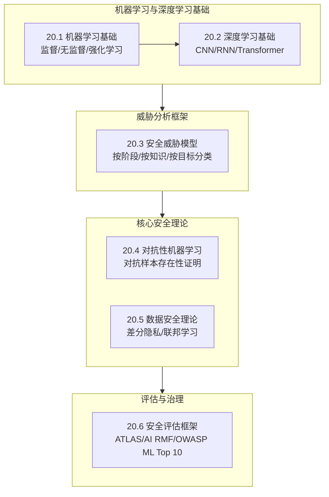

## 20.7 本章小结

### 理论基础全景回顾

本节从六个维度构建了AI/ML安全的理论基础，为后续攻防技术的学习提供了完整的认知框架。以下是各小节的核心知识脉络：

### 核心知识点梳理

#### 一、机器学习基础（20.1节）

本节回顾了机器学习的三大范式及其与安全的关系：

| 学习范式 | 核心机制 | 典型算法 | 安全关联 |
|---------|---------|---------|---------|
| 监督学习 | 从标注数据学习映射关系 | SVM、随机森林、神经网络 | 训练数据投毒直接影响决策边界 |
| 无监督学习 | 发现数据内在结构 | K-means、PCA、自编码器 | 异常检测可用于防御，但自身也可被绕过 |
| 强化学习 | 通过奖励信号优化策略 | DQN、PPO、A3C | 对抗性环境中的策略鲁棒性问题 |

关键认知：每种学习范式都有其特有的安全脆弱点。监督学习最容易受到数据投毒攻击，因为攻击者只需污染少量训练样本就能偏移决策边界。强化学习面临环境操纵风险——攻击者可以通过改变奖励信号引导模型学习有害策略。

#### 二、深度学习基础（20.2节）

深度学习的核心架构各有其安全特性：

| 架构 | 核心结构 | 主要安全关注点 |
|-----|---------|-------------|
| CNN | 卷积层→池化层→全连接层 | 对抗性样本敏感，高频特征易被扰动利用 |
| RNN/LSTM | 循环连接，长期依赖建模 | 梯度消失/爆炸导致长序列安全问题 |
| Transformer | 自注意力机制，全局依赖 | 注意力机制可被操纵，提示注入攻击面 |
| GAN | 生成器-判别器对抗训练 | Deepfake生成、数据增强中的安全风险 |

关键认知：深度神经网络的高维非线性特性是对抗性样本存在的根本原因。模型在训练过程中学到的特征表示中，存在人类不可感知但对模型决策至关重要的"非鲁棒特征"——这些特征在语义上无意义，却能主导模型输出。这是Goodfellow等人提出的"线性假说"的核心洞见：即使在高维线性模型中，对抗性扰动也天然存在。

#### 三、安全威胁模型（20.3节）

威胁模型提供了系统化的分析框架，从三个维度对AI/ML安全风险进行分类：

**维度一：按攻击阶段**

| 阶段 | 攻击类型 | 攻击者能力要求 | 防御难度 |
|-----|---------|-------------|---------|
| 训练阶段 | 数据投毒、后门植入 | 需要接触训练数据或训练流程 | 高——污染一旦进入模型即永久存在 |
| 推理阶段 | 对抗样本、模型窃取 | 仅需API访问权限 | 中——可通过输入检测缓解 |
| 部署阶段 | 模型逆向、侧信道攻击 | 需要访问部署环境 | 中——依赖系统级防护 |

**维度二：按攻击者知识**

白盒攻击者掌握模型全部信息（架构、参数、训练数据），攻击效果最强但现实性最低。灰盒攻击者掌握部分信息（如模型架构但不知参数），可利用架构特征缩小搜索空间。黑盒攻击者仅能观察输入输出，这是最现实的攻击场景——实际部署的AI系统通常只暴露API接口。

**维度三：按攻击目标**

完整性攻击（使模型输出错误结果）、可用性攻击（使模型服务不可用）、隐私攻击（从模型中提取训练数据信息）。三者构成CIA三元组在AI领域的映射。

关键认知：威胁模型不仅是分类工具，更是安全评估的方法论。面对任何AI系统，应系统性地遍历这三个维度的组合，识别暴露面和潜在攻击向量。一个常见的盲区是只关注推理阶段的攻击而忽视训练阶段——实际上，训练阶段攻击（如后门植入）的危害更大且更难检测。

#### 四、对抗性机器学习理论（20.4节）

本节建立了对抗性攻击的数学基础：

**对抗性样本的形式化定义**：给定分类器 $f$，原始输入 $x$，目标标签 $y$，寻找扰动 $\delta$ 使得 $f(x + \delta) \neq f(x)$ 且 $\|\delta\|_p \leq \epsilon$。其中 $L_p$ 范数控制扰动的"不可感知性"：$L_0$ 限制修改的像素数量，$L_2$ 限制欧几里得距离，$L_\infty$ 限制最大单点扰动。

**对抗性样本存在的根本原因**：

1. **线性假说（Goodfellow, 2015）**：在高维空间中，即使是线性模型也存在对抗性扰动。对于权重向量 $w$ 和输入 $x$，扰动 $\delta = \epsilon \cdot \text{sign}(w)$ 可以使线性模型的输出变化 $\epsilon \cdot n$（$n$ 为维度）。当 $n$ 很大时，即使 $\epsilon$ 很小，累积效应也足以翻转预测。

2. **决策边界几何**：深度网络的决策边界在输入空间中高度不规则，存在大量"平坦区域"——在这些区域中，微小扰动即可跨越决策边界。

3. **非鲁棒特征**：模型利用的某些特征在人类感知中无意义，但对预测至关重要。操纵这些特征即可欺骗模型。

关键认知：对抗性样本不是模型的"bug"，而是高维统计学习的固有特性。这意味着没有一种防御可以从根本上消除对抗性样本——只能提高攻击的成本和难度。

#### 五、数据安全理论（20.5节）

数据安全理论覆盖三个核心主题：

**差分隐私**：通过向计算过程添加校准噪声，保证单条数据的存在与否对输出的影响可忽略。核心参数 $\epsilon$（隐私预算）控制隐私-效用权衡——$\epsilon$ 越小隐私越强，但数据可用性越低。DP-SGD是机器学习中实现差分隐私的标准算法：裁剪每条样本的梯度（限制单样本影响），添加高斯噪声（模糊个体贡献），然后聚合。

**联邦学习安全**：联邦学习的初衷是"数据不出本地"，但模型更新（梯度）本身携带大量训练数据信息。梯度泄露攻击（DLG等）证明可以从共享梯度中精确重建训练图像。联邦学习面临的威胁还包括拜占庭攻击（恶意参与方发送篡改的模型更新）和模型投毒（通过更新植入后门）。

**安全聚合与防御**：安全聚合通过加密技术保护模型更新的传输过程，防止服务器观察到单个客户端的梯度。鲁棒聚合算法（如Krum、Trimmed Mean）通过统计方法检测和过滤异常更新，抵御拜占庭攻击。

关键认知：隐私保护不是单一技术能解决的问题，需要差分隐私、安全聚合、可信执行环境等多种技术的组合。每种技术都有其性能代价和适用场景——工程实践中需要根据数据敏感度和业务需求进行权衡。

#### 六、AI安全评估框架（20.6节）

三大框架从不同层面构建了AI安全的评估体系：

| 框架 | 定位 | 核心内容 | 适用场景 |
|-----|-----|---------|---------|
| MITRE ATLAS | 威胁知识库 | 14个战术阶段，50+攻击技术 | 红队评估、威胁建模 |
| NIST AI RMF | 治理框架 | 治理→映射→测量→管理四步法 | 组织级AI风险管理 |
| OWASP ML Top 10 | 风险清单 | ML系统十大安全风险排序 | 快速安全评估、优先级决策 |

关键认知：三个框架不是互相替代的关系，而是互补的。MITRE ATLAS帮助安全团队理解"攻击者会怎么做"，NIST AI RMF帮助管理层建立"如何系统化管理风险"，OWASP ML Top 10帮助工程师确定"优先修复什么"。完整的AI安全评估应同时参考这三个框架。

### 理论基础的核心联系

六个小节的知识并非孤立存在，它们之间存在紧密的逻辑联系：

1. **ML/DL基础（20.1-20.2）是理解一切的前提**——不理解CNN的卷积运算，就无法理解为什么高频对抗性扰动能欺骗分类器；不理解Transformer的注意力机制，就无法理解提示注入的工作原理。

2. **威胁模型（20.3）是分析框架**——它提供了系统化的方法，将分散的攻击技术组织成结构化的知识体系。后续学习任何新的攻击类型，都可以放入这个框架中定位。

3. **对抗性理论（20.4）揭示了安全问题的数学本质**——对抗性样本的不可消除性是所有后续防御策略必须面对的根本约束。

4. **数据安全理论（20.5）扩展了安全的边界**——从"保护模型不被攻击"延伸到"保护训练数据不被泄露"，覆盖了AI系统全生命周期的安全需求。

5. **评估框架（20.6）提供了实践指南**——将理论知识转化为可操作的安全评估流程，连接了理论与工程实践。

### 从理论到实践的衔接

本节建立的理论基础将在后续章节中得到直接应用：

- **20.2 核心技巧**：FGSM/PGD/C&W攻击的实现直接基于20.4节的对抗性理论，模型窃取和后门攻击基于20.3节的威胁模型分类
- **20.3 实战案例**：五个案例分别对应威胁模型中的不同攻击类型，验证了理论分析的实际有效性
- **20.4 常见误区**：大部分误区源于对理论基础的误解——如"黑盒模型不可攻击"忽视了黑盒攻击的存在，"高准确率等于安全"混淆了准确性和鲁棒性

掌握本节的理论基础后，读者应能回答以下关键问题：

1. 为什么深度学习模型天然存在对抗性脆弱性？（线性假说 + 高维空间几何）
2. AI/ML系统面临的最严重威胁是什么？为什么？（训练阶段攻击，因为污染永久存在）
3. 能否从根本上消除对抗性样本？为什么？（不能，这是统计学习的固有特性）
4. 差分隐私的 $\epsilon$ 参数如何影响模型性能？（$\epsilon$ 越小隐私越强，准确率越低）
5. 如何系统化评估一个AI系统的安全性？（参考ATLAS + AI RMF + OWASP ML Top 10）

带着这些问题进入下一节的攻防技术学习，将显著提升学习效率和理解深度。
