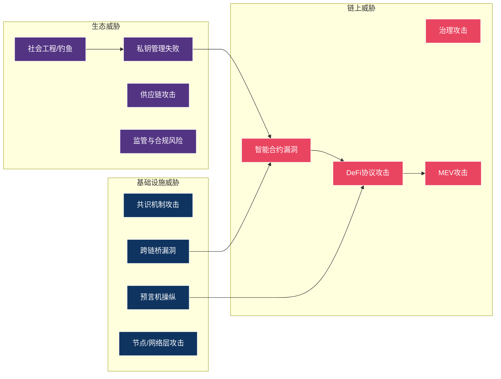

# 第21章 区块链安全

## 章节概览

### 引言

区块链技术自2008年中本聪发布《Bitcoin: A Peer-to-Peer Electronic Cash System》白皮书以来，已从单一的加密货币底层技术演变为支撑去中心化金融（DeFi）、非同质化代币（NFT）、去中心化自治组织（DAO）、现实世界资产代币化（RWA）等众多创新应用的基础设施。截至2025年，链上锁仓总价值（TVL）在高峰期超过1700亿美元，日均交易量达数百亿美元，承载着巨大的经济价值。

然而，伴随着区块链生态的急速扩张，安全问题也日益凸显。区块链系统的不可篡改性是一把双刃剑——它保障了交易的可信性，同时也意味着一旦智能合约存在漏洞，攻击造成的损失往往是不可逆的。从2016年The DAO事件中价值6000万美元的ETH被盗，到2022年Ronin Bridge被攻击导致6.25亿美元损失，再到2023年Euler Finance闪电贷攻击损失1.97亿美元，区块链安全事件造成的经济损失屡创新高。据慢雾科技（SlowMist）统计，仅2022年一年，区块链领域的安全事件就造成了超过38亿美元的损失；2023年这一数字约为16.9亿美元；2024年则再度攀升至超过23亿美元。

这些触目惊心的数字背后，折射出的是区块链安全领域人才的巨大缺口和安全知识体系的碎片化。本章旨在为读者构建一套系统、完整、深入的区块链安全知识框架，从底层密码学原理到上层DeFi协议攻防，从漏洞理论到实战复现，帮助安全从业者和开发者真正理解区块链系统中的安全风险本质，并掌握相应的检测、防御与应急响应技术。

### 学习目标

通过本章的学习，读者将能够：

**第一层：理解基础（Know What）**

1. **理解区块链安全基础**：掌握区块链的核心技术架构（交易、区块、默克尔树、状态机）、密码学基础（椭圆曲线数字签名ECDSA、Keccak-256哈希、Merkle Patricia Trie）和主流共识机制（PoW、PoS、BFT变体）的安全特性与攻击面，理解区块链安全问题的本质来源。

2. **掌握智能合约编程模型**：理解以太坊虚拟机（EVM）的执行原理、Gas机制、存储布局（storage/memory/calldata）、ABI编码规则，以及Solidity语言的安全相关特性（fallback/receive函数、delegatecall机制、可见性修饰符）。

**第二层：识别风险（Know Why）**

3. **识别智能合约漏洞**：能够识别重入攻击（Reentrancy）、整数溢出/下溢（虽然Solidity 0.8+已内置检查，但unchecked块和assembly中仍可能存在）、权限控制缺陷、访问控制绕过、预言机操纵、闪电贷攻击、签名重放、front-running等常见智能合约安全漏洞，理解各类漏洞的根本成因、利用条件和攻击路径。

4. **理解DeFi协议攻击面**：掌握AMM无常损失与价格操纵、借贷协议清算攻击、跨链桥验证机制缺陷、治理攻击（闪电贷治理投票）、MEV（最大可提取价值）三明治攻击等DeFi特有的安全风险模型。

**第三层：掌握方法（Know How）**

5. **掌握安全审计方法**：学习智能合约安全审计的完整流程——范围界定、威胁建模、代码审查、自动化扫描、手动验证、报告撰写，掌握静态分析（Slither、Mythril）、动态分析（Echidna、Foundry fuzzing）、符号执行（Manticore、HEVM）和形式化验证（Certora、K Framework）等技术手段。

6. **掌握应急响应能力**：学习安全事件发生后的响应流程——事件确认、攻击追踪、损失评估、合约暂停/升级、资产追回协调、事后复盘，了解链上取证工具（Blocksec Phalcon、Tenderly、Forta Network）的使用。

**第四层：建立思维（Think Security）**

7. **建立防御思维**：从攻击者视角理解区块链安全，建立"安全优先"的开发理念，掌握安全开发模式（Checks-Effects-Interactions、Pull over Push、Rate Limiting）和部署最佳实践（多签钱包、时间锁、升级代理模式的安全配置）。

8. **培养持续研究能力**：了解区块链安全领域的研究前沿（形式化验证、AI辅助审计、零知识证明安全）和社区资源，具备独立分析新协议安全性的能力。

### 知识结构

本章内容按照由浅入深、道法术器贯通的逻辑组织，共分为五个核心模块：

```mermaid
graph TD
    A[第21章 区块链安全] --> B[01 理论基础]
    A --> C[02 核心技巧]
    A --> D[03 实战案例]
    A --> E[04 常见误区]
    A --> F[05 练习方法]

    B --> B1[区块链架构与安全模型]
    B --> B2[密码学在区块链中的应用]
    B --> B3[共识机制的安全边界]
    B --> B4[智能合约编程基础]

    C --> C1[漏洞分类与识别]
    C --> C2[审计工具链]
    C --> C3[安全编码模式]
    C --> C4[DeFi协议安全分析]

    D --> D1[经典攻击事件深度复盘]
    D --> D2[攻击链还原与根因分析]
    D --> D3[防御方案验证]

    E --> E1[技术认知偏差]
    E --> E2[实践中的安全陷阱]
    E --> E3[审计流程盲区]

    F --> F1[靶场环境搭建]
    F --> F2[CTF竞赛路径]
    F --> F3[实战演练进阶]

    style A fill:#1a1a2e,stroke:#e94560,color:#fff
    style B fill:#16213e,stroke:#0f3460,color:#fff
    style C fill:#16213e,stroke:#0f3460,color:#fff
    style D fill:#16213e,stroke:#0f3460,color:#fff
    style E fill:#16213e,stroke:#0f3460,color:#fff
    style F fill:#16213e,stroke:#0f3460,color:#fff
```



各模块详细内容如下：

| 节次 | 主题 | 核心内容 | 关键技能点 | 难度 |
|------|------|----------|------------|------|
| 01 | 理论基础 | 区块链架构、密码学基础、共识机制安全分析、EVM执行模型 | 能够分析任意公链的安全模型和信任假设 | ⭐⭐ |
| 02 | 核心技巧 | 漏洞分类体系、审计工具链（Slither/Mythril/Echidna/Foundry）、安全编码模式、DeFi协议安全分析方法 | 能够独立完成一份中等复杂度合约的安全审计 | ⭐⭐⭐ |
| 03 | 实战案例 | The DAO、Wormhole、Ronin Bridge、Beanstalk、Euler Finance、Curve 等经典事件深度分析与攻击链还原 | 能够从攻击事件中提取通用的攻击模式和防御策略 | ⭐⭐⭐⭐ |
| 04 | 常见误区 | "代码即法律"的边界、审计报告的误读、升级合约的安全悖论、多签≠安全等认知陷阱 | 能够识别区块链项目中常见的安全认知偏差 | ⭐⭐ |
| 05 | 练习方法 | Ethernaut/Damn Vulnerable DeFi 靶场、CTF竞赛、漏洞赏金计划（Immunefi）、本地Fork环境实战 | 能够制定系统化的区块链安全学习路线 | ⭐⭐⭐ |

### 学习路线推荐

不同背景的读者可以根据自身情况选择不同的学习路径：

**路径A：零基础入门（预计4-6周）**

```text
01 理论基础（完整学习）
    ↓
05 练习方法 → Ethernaut 前20题（同步进行）
    ↓
02 核心技巧 → 漏洞分类 + 安全编码模式（跳过工具链深度使用）
    ↓
04 常见误区
    ↓
03 实战案例 → 选择2-3个经典案例精读
    ↓
05 练习方法 → Damn Vulnerable DeFi（巩固提升）
```

**路径B：有编程/安全基础（预计2-3周）**

```text
01 理论基础 → 快速浏览，重点看密码学和EVM模型
    ↓
02 核心技巧 → 完整学习，动手跑工具链
    ↓
03 实战案例 → 完整学习，尝试独立复盘
    ↓
04 常见误区
    ↓
05 练习方法 → 直接上 Damn Vulnerable DeFi + CTF
```

**路径C：安全审计从业者（预计1-2周）**

```text
01 理论基础 → 仅看共识机制安全和EVM执行模型
    ↓
02 核心技巧 → 重点：DeFi协议安全分析 + 工具链高级用法
    ↓
03 实战案例 → 全部案例，提取攻击模式
    ↓
04 常见误区 → 重点关注审计流程盲区
    ↓
直接进入真实审计项目或漏洞赏金计划
```

### 区块链安全威胁全景

在深入学习之前，先建立对区块链安全威胁的全景认知。下图展示了当前区块链生态系统面临的主要威胁类别及其相互关系：



**链上威胁**——直接作用于部署在区块链上的智能合约和协议逻辑，是本章的核心重点。包括智能合约代码层面的漏洞（重入、溢出、权限缺陷等）、DeFi协议经济模型层面的攻击（闪电贷、价格操纵、清算攻击等）、治理机制滥用（闪电贷投票、提案操纵等）和MEV提取（三明治攻击、时间盗取等）。

**基础设施威胁**——针对区块链网络底层的共识层、网络层和跨链互操作层。包括51%算力攻击（PoW链）、长程攻击（PoS链）、跨链桥验证者合谋或私钥泄露、预言机数据源操纵、以及P2P网络层面的Eclipse攻击和BGP劫持。

**生态威胁**——区块链项目运行所依赖的外部环境和运营环节。包括针对项目方和个人用户的社会工程攻击（钓鱼网站、假空投、恶意钱包授权）、私钥存储和管理的单点失败、开发依赖链的供应链攻击（恶意npm包、被篡改的编译器），以及不断变化的监管合规环境带来的法律风险。

### 历年重大安全事件时间线

| 时间 | 事件 | 损失金额 | 攻击类型 | 影响 |
|------|------|----------|----------|------|
| 2016.06 | The DAO 攻击 | 6,000万美元 ETH | 重入攻击 | 导致以太坊硬分叉（ETH/ETC分裂） |
| 2017.07 | Parity 多签钱包漏洞 | 3,000万美元 ETH | 权限控制缺陷 | 暴露钱包库初始化安全问题 |
| 2017.11 | Parity 冻结事件 | 5.13亿美元 ETH | 自毁函数误调用 | 资金永久锁定，无法恢复 |
| 2020.02 | bZx 闪电贷攻击 | 100万美元 | 闪电贷+预言机操纵 | DeFi闪电贷攻击先例 |
| 2021.08 | Poly Network 攻击 | 6.11亿美元 | 跨链桥权限缺陷 | 攻击者最终归还资金（史上最大白帽事件） |
| 2022.02 | Wormhole 跨链桥攻击 | 3.26亿美元 | 签名验证绕过 | Solana-ETH跨链桥崩溃 |
| 2022.03 | Ronin Bridge 攻击 | 6.25亿美元 | 验证者私钥泄露 | Axie Infinity生态重创 |
| 2022.04 | Beanstalk 治理攻击 | 1.82亿美元 | 闪电贷治理投票 | 首个大规模治理攻击案例 |
| 2022.10 | BNB Chain 跨链桥攻击 | 5.86亿美元（冻结前追回大部分） | 签名伪造 | BSC短暂暂停出块 |
| 2023.02 | Euler Finance 攻击 | 1.97亿美元 | 闪电贷+捐赠函数漏洞 | 攻击者最终归还全部资金 |
| 2023.07 | Curve Finance 池漏洞 | 7,300万美元 | Vyper编译器重入漏洞 | 暴露底层编译器安全盲区 |
| 2024.05 | DMM Bitcoin 攻击 | 3.08亿美元 | 私钥泄露（疑似） | 日本交易所重大安全事件 |
| 2024.10 | Radiant Capital 攻击 | 5,800万美元 | 多签钱包签名篡改 | 暴露硬件钱包签名验证盲区 |

这些事件并非简单的"黑客入侵"——绝大多数攻击利用的是合约逻辑缺陷、经济模型漏洞或验证机制的薄弱环节，而非暴力破解密码学原语。理解这些事件的攻击路径，是掌握区块链安全的核心方法论。

### 前置知识

学习本章之前，建议读者具备以下基础知识。每项都标注了具体需要掌握到什么程度：

**编程基础（必需）**

- 熟悉至少一门编程语言（推荐 JavaScript/TypeScript 或 Python），能够阅读和编写中等复杂度的程序
- 了解面向对象编程的基本概念（类、继承、多态），因为 Solidity 的合约模型与之有相似之处
- 了解基本的数据结构（数组、映射、链表）和算法概念
- 如果完全零编程基础，建议先学习 Python 基础（2-3周），再进入本章

**密码学基础（强烈建议）**

- 了解哈希函数的特性（确定性、抗碰撞、雪崩效应），知道 SHA-256 和 Keccak-256 的区别
- 了解非对称加密（公钥/私钥对）和数字签名的基本原理
- 了解什么是椭圆曲线密码学（不要求掌握数学推导，理解其功能即可）
- 如果不具备密码学基础，本章第1节会从零开始讲解，但学习进度会较慢

**网络与分布式系统基础（建议）**

- 了解 P2P 网络的基本概念（节点、对等通信、去中心化）
- 了解分布式系统中的基本问题（拜占庭将军问题、CAP定理）
- 了解 HTTP API 和 JSON-RPC 的基本用法（后续与区块链节点交互时需要）

**Web安全基础（有帮助）**

- 了解 OWASP Top 10 中的常见漏洞类型，特别是注入、访问控制和业务逻辑漏洞
- 了解前端与后端交互的基本模型，有助于理解 DApp 的攻击面
- 有 CTF 经验者在漏洞挖掘环节会更有优势

**经济学基础（有帮助，非必需）**

- 了解供需关系、博弈论基本概念，有助于理解 DeFi 经济攻击模型
- 了解期权、期货等基本金融衍生品概念，有助于理解复杂 DeFi 协议

**环境准备**

在开始学习前，请确保已准备以下开发环境：

```bash
# 1. 安装 Node.js（v18+）和 npm
node --version  # >= 18.0.0
npm --version

# 2. 安装 Foundry（以太坊开发工具链，推荐）
curl -L https://foundry.paradigm.xyz | bash
foundryup

# 3. 安装 Hardhat（备选）
npx hardhat --version

# 4. 安装 Python 和 pip（用于安全分析工具）
python3 --version  # >= 3.9
pip3 install slither-analyzer mythril

# 5. 安装 Docker（用于运行分析容器和本地节点）
docker --version

# 6. 准备一个测试钱包（不要使用包含真实资产的钱包）
# 使用 MetaMask 创建一个新的测试账户
```

### 本章特色

**理论与实践结合**——每个安全概念都配有完整的 Solidity 代码示例，展示漏洞的存在形式和修复方式。代码示例均使用 Foundry 测试框架编写，读者可以直接运行和验证。

**攻防视角并重**——不仅讲解攻击手法和利用链（Exploit），更深入分析防御策略的原理、局限性和适用场景。每种漏洞都提供"攻击代码 → 根因分析 → 防御代码 → 防御局限性"的完整链路。

**紧跟前沿技术**——覆盖 DeFi（AMM/借贷/衍生品/流动性质押）、NFT（版税绕过/元数据操纵）、跨链桥（验证机制/中继器安全）、MEV（三明治/时间盗取/区块重组）、AI 与区块链安全交叉领域等最新议题。

**提供实操路径**——提供详细的练习环境搭建指南，包括本地 Fork 主网环境配置、Ethernaut 和 Damn Vulnerable DeFi 靶场的通关指南、以及参与 Immunefi 等漏洞赏金计划的入门建议。

**中文社区资源**——除引用英文权威资料外，同步整理了慢雾科技、Certik、PeckShield、BlockSec 等国内安全团队的公开研究报告和工具，方便中文读者深入学习。

区块链安全是一个快速发展的领域，新的攻击手法和防御技术不断涌现。本章力求为读者打下坚实的基础，培养持续学习和独立研究的能力，使其能够应对不断变化的安全挑战。安全不是一次性的审计报告，而是一种贯穿系统全生命周期的思维方式。

---

> ⚠️ **安全警告与免责声明**
>
> 本章内容仅供**合法的安全测试与教育目的**使用。所有技术、工具和方法的讨论均旨在帮助安全从业者在**获得明确授权**的前提下进行防御性安全研究。
>
> - 🚫 **未经授权**对任何系统、网络或应用进行安全测试是**违法行为**。依据《中华人民共和国网络安全法》第二十七条和《刑法》第二百八十五条（非法侵入计算机信息系统罪）、第二百八十六条（破坏计算机信息系统罪），未经授权的渗透测试可面临刑事追诉
> - 🚫 禁止利用本章知识进行任何形式的资产盗窃、市场操纵或欺诈行为
> - ✅ 所有实践活动应在**隔离的实验环境**中进行（如本地 Hardhat/Foundry 网络、CTF 平台、测试网）
> - ✅ 参与漏洞赏金计划时，严格遵守项目方的赏金范围和规则（Scope & Rules of Engagement）
> - ✅ 遵守所在国家和地区的**网络安全法律法规**，包括但不限于《网络安全法》《数据安全法》《个人信息保护法》
> - ✅ 遵循**负责任的漏洞披露**原则（Responsible Disclosure）：发现漏洞后先通知项目方，给予合理修复时间后再公开
> - ✅ 在进行任何链上安全研究前，了解所在司法管辖区对加密资产的监管政策
>
> 作者不对因滥用本章内容造成的任何后果承担责任。
