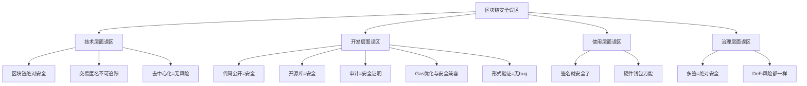
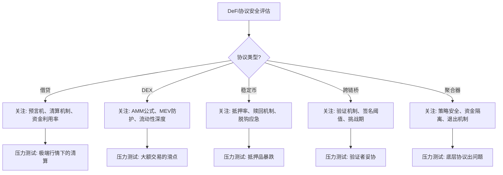

# 第21章 区块链安全 — 常见误区

区块链安全领域充斥着大量似是而非的观念，这些误区不仅存在于普通用户中，甚至在部分开发者和项目方中也根深蒂固。每一个误区背后都对应着真实的安全事件和巨额损失。本节系统梳理区块链安全中最常见的认知误区，通过原理分析、真实案例和代码示例，帮助读者建立正确的安全认知框架。



## 24.1 "区块链是绝对安全的"

### 误区描述

许多人认为区块链技术本身不可攻破，所有上链数据都是安全的。这种观念源于对区块链密码学基础的过度简化——既然SHA-256和ECDSA在数学上是安全的，那么建立在它们之上的整个系统也应该是安全的。

### 事实真相：安全是分层的

区块链的安全性至少存在于四个层面，每个层面都有独立的攻击面：

| 安全层面 | 安全机制 | 攻击面 | 典型事件 |
|----------|----------|--------|----------|
| 密码学层 | SHA-256、ECDSA、Keccak-256 | 量子计算威胁、弱随机数、私钥泄露 | Poly Network（私钥管理缺陷） |
| 共识层 | PoW/PoS/BFT | 51%攻击、长程攻击、Nothing-at-Stake | Ethereum Classic 51%攻击（2019-2020） |
| 应用层 | 智能合约、DApp | 逻辑漏洞、重入攻击、闪电贷操纵 | The DAO（重入）、Wormhole（签名验证） |
| 社会层 | 私钥管理、运维安全 | 社会工程、内部作恶、前端劫持 | Ronin Bridge（社会工程+私钥集中） |

密码学层面的安全并不等于系统层面的安全。一个类比是：即使你使用了最坚固的锁（密码学），如果门框是木头做的（应用层漏洞），攻击者仍然可以破门而入。

### 真实案例：Ronin Bridge 攻击（2022年3月）

Ronin Bridge 是 Axie Infinity 的跨链桥，损失6.25亿美元。攻击者并未破解任何密码学算法，而是通过社会工程获取了5个验证者私钥中的4个（只需要5个中的4个即可批准提款）。这个案例完美说明了：密码学层面的安全是充分的，但系统设计（验证者数量过少且集中）和运维安全（私钥管理不当）才是真正的薄弱环节。

### 数据支撑

据 Rekt 数据库统计，截至2025年，区块链领域的安全事件累计损失超过750亿美元。其中：
- 智能合约漏洞约占40%
- 预言机操纵约占15%
- 私钥泄露/管理不当约占20%
- 社会工程/内部作恶约占10%
- 其他（前端攻击、MEV等）约占15%

真正由密码学被破解导致的损失占比几乎为零。这组数据清楚地表明，区块链安全的瓶颈不在密码学，而在应用层和运维层。

### 正确认知

安全是一个系统工程，需要在每个层面都建立防御。密码学提供了坚实的基础，但从基础到上层建筑之间的每一步都需要独立的安全评估和防护措施。

## 24.2 "智能合约代码公开所以安全"

### 误区描述

智能合约代码部署在区块链上，任何人都可以查看源码（在Etherscan等区块浏览器上验证），因此经过了"众审"（many eyes），应该是安全的。这个误区套用了开源软件领域"Given enough eyeballs, all bugs are shallow"（足够多的眼睛注视下，所有bug都是浅层的）的论断。

### 事实真相：开源≠安全

代码公开和代码安全之间存在巨大的鸿沟：

**第一，阅读门槛极高。** Solidity、Vyper等智能合约语言并非主流编程语言，全球能熟练阅读Solidity代码并识别安全漏洞的开发者不超过数千人。相比之下，Linux内核有数万名活跃贡献者。"众审"的前提——"众"——在智能合约领域并不成立。

**第二，安全审计需要专业方法论。** 识别智能合约漏洞需要理解EVM执行模型、DeFi协议机制、攻击向量等专业知识。普通开发者即使能读懂代码逻辑，也很难发现微妙的安全问题。例如，以下代码看起来完全正常：

```solidity
// 看起来没问题，但存在重入漏洞
function withdraw(uint amount) external {
    require(balances[msg.sender] >= amount);
    // 危险：在更新状态之前进行外部调用
    (bool success, ) = msg.sender.call{value: amount}("");
    require(success);
    balances[msg.sender] -= amount;  // 状态更新在外部调用之后
}
```

攻击者可以通过实现`receive()`函数在`call`执行时回调`withdraw()`，在`balances`更新之前反复提取资金。这就是经典的重入攻击（Reentrancy Attack），The DAO事件中损失了360万ETH就源于此。

**第三，"经过审计"不等于"安全"。** 许多被攻击的项目都曾通过知名审计公司的审计：

| 项目 | 审计公司 | 攻击时间 | 损失金额 | 漏洞原因 |
|------|----------|----------|----------|----------|
| Parity Wallet | Trail of Bits | 2017年7月 | 3,000万美元 | 多签钱包初始化漏洞 |
| Cream Finance | Trail of Bits, PeckShield | 2021年10月 | 1.3亿美元 | 闪电贷+预言机操纵 |
| Wormhole | Neodyme | 2022年2月 | 3.26亿美元 | 签名验证逻辑漏洞 |
| Euler Finance | Sherlock, Halborn | 2023年3月 | 1.97亿美元 | 捐赠函数逻辑缺陷 |

**第四，审计是时间点评估。** 审计报告只反映审计时代码的安全状态。代码更新后，之前的审计结论可能不再适用。许多项目在审计后进行了代码修改但未重新审计，导致引入新的漏洞。

**第五，信息不对称。** 攻击者和防御者之间存在信息不对称。审计报告通常在攻击发生前不公开，而攻击者可能已经在研究公开代码并发现了审计师遗漏的漏洞。

### 正确认知

代码公开是安全的必要条件之一（不公开更不安全），但远非充分条件。安全需要专业的审计、形式验证、持续监控和完善的应急响应机制的共同保障。

## 24.3 "使用开源库就安全了"

### 误区描述

使用 OpenZeppelin、Solmate 等知名开源库就能保证合约安全。这些库经过了广泛的审计和实战检验，只要使用它们，安全问题就不用担心。

### 事实真相：库是组件，不是解决方案

开源库提供了经过审计的**基础组件**，但安全问题往往出现在组件的**组合方式**和**使用上下文**中：

**组合风险（Composability Risk）**：多个安全的组件组合在一起可能产生新的攻击面。DeFi协议的可组合性是其核心特性，但也是最大的安全风险来源。例如：

```solidity
// 单独看，ERC20和ReentrancyGuard都是安全的
// 但组合使用时可能产生问题
contract Vault is ReentrancyGuard {
    IERC20 public token;
    
    function deposit(uint amount) external nonReentrant {
        token.transferFrom(msg.sender, address(this), amount);
        shares[msg.sender] += calculateShares(amount);
    }
    
    // 如果token是恶意合约，在transferFrom中回调
    // nonReentrant可以防护，但其他操作可能被绕过
    function withdraw(uint shares_) external nonReentrant {
        uint amount = calculateAmount(shares_);
        shares[msg.sender] -= shares_;
        token.transfer(msg.sender, amount);  // 如果token回调呢？
    }
}
```

如果`token`不是标准的ERC20而是一个带有回调机制的代币（如ERC-777的`tokensReceived`钩子），即使使用了`ReentrancyGuard`，仍可能在其他维度上产生问题。

**配置风险（Configuration Risk）**：错误的参数配置可能引入严重漏洞。OpenZeppelin的`AccessControl`默认是安全的，但如果开发者错误地将`DEFAULT_ADMIN_ROLE`授予了不当地址，或者在初始化时遗漏了关键配置，整个访问控制就会失效。

**版本风险（Version Risk）**：旧版本可能包含已知漏洞。OpenZeppelin在v4.7.0之前存在`ECDSA.recover`的签名延展性问题（CVE-2022-31170），使用旧版本的合约面临重放攻击风险。此外，Solidity 0.8.0之前的版本不内置溢出检查，依赖SafeMath的项目如果升级编译器但未移除SafeMath，可能产生冗余代码掩盖真正的安全问题。

**业务逻辑风险**：开源库无法保护业务逻辑层面的漏洞。OpenZeppelin提供了安全的ERC20实现，但它无法阻止你在业务逻辑中错误地计算用户余额或错误地处理清算逻辑。

### 正确做法

1. **理解每个组件的安全假设**：不要黑箱使用，要理解每个函数的前提条件和边界情况
2. **锁定版本**：在`package.json`或`foundry.toml`中锁定确切版本，避免自动升级引入问题
3. **独立安全评估**：在组合使用多个组件时，对组合后的系统进行独立的安全评估
4. **关注安全公告**：订阅OpenZeppelin等库的安全公告，及时了解已知漏洞

## 24.4 "审计报告等同于安全证明"

### 误区描述

通过专业审计的项目就是安全的，审计报告是安全性的"保证书"或"认证"。许多项目在官网展示审计报告来吸引用户资金。

### 事实真相：审计的本质是有限范围的代码审查

审计报告有其固有的局限性，理解这些局限性对正确评估项目安全性至关重要：

**时间点评估**：审计只针对审计时的代码版本。Solidity代码在编译后部署到链上，之后的任何修改（通过代理模式升级、参数变更等）都不在审计范围内。许多使用代理模式的项目在审计后进行了实现合约的升级，新代码未经审计却直接管理着用户资金。

**范围限制**：审计通常有明确的范围和时间限制。一份典型的审计周期为2-4周，审计团队需要在有限时间内审查数万行代码。这意味着审计团队不可能对每一行代码都进行深度分析，更多依赖于模式识别和经验判断。

**非穷尽性**：审计无法保证发现所有漏洞。安全审计是一种采样检查，而非穷举验证。即使是最优秀的审计团队，也可能遗漏复杂的组合漏洞或新型攻击向量。行业数据显示，知名审计公司报告的漏洞覆盖率通常在70%-85%之间。

**审计质量差异**：不同审计团队的能力和方法差异很大。审计行业的质量参差不齐，部分审计公司使用自动化工具生成报告，缺乏深度的人工分析。一些"审计"实际上只是运行了Slither或Mythril等工具的自动化扫描，而非真正的安全审计。

**激励结构问题**：审计公司通常由项目方付费，这在一定程度上影响了审计的独立性。审计公司可能倾向于出具"通过"报告以维持客户关系，而非指出所有潜在问题。

### 正确认知

审计是安全过程的重要组成部分，但不是终点。一个成熟的安全策略应该包括：

1. **多轮审计**：至少由两家不同的审计公司进行独立审计
2. **形式验证**：对关键逻辑进行数学证明
3. **持续监控**：部署后使用Forta、OpenZeppelin Defender等工具持续监控
4. **漏洞赏金**：通过Immunefi等平台设立漏洞赏金计划
5. **应急响应**：制定详细的安全事件应急响应预案

## 24.5 "去中心化等于无风险"

### 误区描述

去中心化的系统没有单点故障，因此是无风险的。代码运行在区块链上，没有人可以控制或关闭它。

### 事实真相：去中心化是光谱而非二元

去中心化程度是一个连续的光谱，大多数项目处于完全中心化和完全去中心化之间的某个位置。声称"去中心化"并不意味着实际上去中心化：

**伪去中心化（Fake Decentralization）**：许多项目声称去中心化，但实际上由少数实体控制。治理代币的分配往往高度集中——项目团队和早期投资者持有大量代币，可以轻易通过治理提案。数据统计显示，大多数DeFi协议的治理代币前10个地址持有超过50%的供应量。

**基础设施中心化**：即使协议本身是去中心化的，访问协议的基础设施可能是中心化的：


- **RPC节点**：超过70%的以太坊用户通过Infura或Alchemy等中心化RPC提供商访问网络。2022年11月，Infura因配置错误导致部分地区无法访问以太坊网络，暴露了中心化基础设施的脆弱性。
- **前端网站**：DeFi协议的前端通常托管在中心化服务器上。2022年9月，Curve Finance的前端DNS被劫持，用户被引导至恶意合约，损失超过57万美元。
- **开发团队**：协议的升级和维护通常由核心开发团队控制，这本身就是一种中心化。

**验证者中心化**：在PoS网络中，质押服务的集中可能威胁共识安全。截至2025年，Lido持有以太坊约28%的质押ETH，Coinbase约12%，两者合计超过40%。如果这些实体合谋或被胁迫，可以对以太坊共识产生重大影响。

**渐进式中心化**：一些项目在初期是去中心化的，但随着时间推移逐渐走向中心化。治理参与率低（通常低于5%）使得少数积极投票者获得了不成比例的控制权。

### 正确认知

评估一个项目的去中心化程度时，需要从以下维度进行分析：

1. **治理代币分布**：使用Etherscan或Dune Analytics查看代币持有分布
2. **基础设施依赖**：是否依赖中心化RPC、前端或DNS
3. **验证者多样性**：验证者数量和分布是否足够分散
4. **升级机制**：谁有权升级合约，是否有时间锁
5. **紧急权限**：是否存在紧急暂停或管理员权限

## 24.6 "Gas优化和安全是兼容的"

### 误区描述

优化Gas消耗和确保代码安全可以同时完美实现。好的代码应该既省Gas又安全。

### 事实真相：Gas优化经常以牺牲安全性为代价

在EVM环境中，Gas优化和安全性之间经常存在权衡。以下是常见的Gas优化措施及其安全风险：

**unchecked 块**：Solidity 0.8.0默认进行溢出/下溢检查，使用`unchecked`可以跳过检查以节省Gas（约200 gas/次），但可能引入严重的溢出漏洞：

```solidity
// 安全版本：Solidity 0.8+ 默认检查溢出
function safeTransfer(uint a, uint b) public pure returns (uint) {
    return a - b;  // 如果 a < b 会自动revert
}

// Gas优化版本：跳过检查，可能溢出
function unsafeTransfer(uint a, uint b) public pure returns (uint) {
    unchecked {
        return a - b;  // 如果 a < b 会下溢为极大的正数！
    }
}
```

如果`a`来自用户输入而`b`代表余额，跳过检查可能导致用户提取远超其余额的资金。

**紧凑存储（Bit Packing）**：EVM按32字节（256位）存储槽操作，将多个小变量打包到一个存储槽可以节省Gas。但这增加了代码复杂度，位操作更容易出错：

```solidity
// 紧凑存储：3个变量打包到一个slot
struct PackedData {
    uint128 amount;    // 128位
    uint64 timestamp;  // 64位
    uint64 status;     // 64位 — 总计256位，刚好一个slot
}
```

当需要修改其中一个字段时，需要额外的位操作逻辑，增加了出错概率。相比之下，使用三个独立的`uint256`虽然多消耗Gas，但代码更清晰、更安全。

**内联汇编**：直接操作EVM可以大幅节省Gas，但跳过了Solidity编译器提供的所有安全检查：

```solidity
// Solidity版本：安全但较贵
function safeSum(uint[] memory data) public pure returns (uint total) {
    for (uint i = 0; i < data.length; i++) {
        total += data[i];
    }
}

// 汇编版本：便宜但不安全
function unsafeSum(uint[] memory data) public pure returns (uint total) {
    assembly {
        let len := mload(data)
        for { let i := 0 } lt(i, len) { i := add(i, 1) } {
            // 没有溢出检查，没有边界检查
            total := add(total, mload(add(data, add(0x20, mul(i, 0x20)))))
        }
    }
}
```

**减少require语句**：省略输入验证可以节省Gas（每个require约200 gas），但可能允许非法状态。例如，不检查`amount > 0`可能允许用户以零金额创建仓位，导致后续计算出现除零错误。

### 正确原则

**安全永远优先于Gas效率。** 具体而言：

1. **先安全后优化**：先写出安全的代码，再在不降低安全性的前提下优化Gas
2. **高价值合约安全优先**：管理大量资金的合约应该优先考虑安全性，Gas成本相对于TVL可以忽略不计
3. **使用成熟模式**：如果使用unchecked或内联汇编，必须经过严格的测试和审计
4. **基准测试**：量化Gas节省和安全风险，做出理性权衡

## 24.7 "交易签名就安全了"

### 误区描述

用户在签署交易前检查交易详情就能避免所有安全问题。只要认真看交易内容，就不会被骗。

### 事实真相：交易签名安全远比想象的复杂

现代区块链交易的复杂性使得普通用户几乎不可能完全理解一笔交易的所有影响：

**复杂交易难以理解**：一笔DeFi交易可能涉及多个步骤和合约调用。例如，在Uniswap V3上进行多跳交易，实际调用路径可能为：用户 → SwapRouter → Pool A → Pool B → Pool C → 目标代币。在钱包的交易确认界面中，用户看到的通常只是十六进制编码的calldata，无法理解其实际含义。

**恶意DApp前端**：前端网站可以显示与实际交易不同的信息。攻击者可以创建一个看起来正常的DApp界面，但在用户点击"Swap"时发送的是`approve`交易而非`swap`交易，从而获取用户代币的无限授权。

**Permit签名（ERC-2612）**：ERC-2612允许用户通过签名（而非交易）授权代币使用。这省去了单独的`approve`交易，但也带来了新的风险：

```solidity
// Permit签名不需要发送交易，但授权了代币使用
// 攻击者可以诱导用户签署permit，然后使用授权转走代币
function permit(
    address owner,
    address spender,
    uint256 value,
    uint256 deadline,
    uint8 v, bytes32 r, bytes32 s
) public virtual override {
    require(block.timestamp <= deadline, "ERC20: permit is expired");
    // 签名验证后直接授权
    _approve(owner, spender, value);
}
```

签名不会产生交易，不出现在交易历史中，用户可能不知道自己已经授权了代币。

**setApprovalForAll**：NFT领域常用的批量授权函数，一次授权即可转移该集合中的所有NFT。许多钓鱼攻击诱导用户签署`setApprovalForAll`，然后转走所有NFT。

**盲签名（Blind Signing）**：硬件钱包（如Ledger）在处理复杂交易时，可能无法完整解析交易数据，只能显示原始十六进制数据，要求用户进行"盲签名"。这实际上违背了硬件钱包"所见即所签"的安全承诺。2022年12月，Ledger的Connect Kit被攻击，恶意代码被注入前端，诱导用户签署恶意交易。

### 最佳实践

1. **使用交易模拟**：Tenderly、Forta等工具可以在执行前模拟交易结果
2. **限制授权范围**：避免无限授权，使用精确授权金额
3. **定期审查授权**：使用revoke.cash等工具定期审查和撤销不必要的授权
4. **分离账户**：将日常交易账户和大额存储账户分离
5. **警惕盲签名**：如果硬件钱包无法解析交易内容，不要签署

## 24.8 "区块链交易是匿名的"

### 误区描述

区块链上的交易是匿名的，无法追踪。这是加密货币被广泛用于非法活动的原因。

### 事实真相：区块链交易是伪匿名的（Pseudonymous）

区块链提供的是**伪匿名性**而非**匿名性**。地址不直接关联真实身份，但所有交易都是公开可追踪的：

**链上分析技术成熟**：Chainalysis、Elliptic、TRM Labs等链上分析公司已经发展出成熟的技术来追踪资金流向。它们使用聚类算法（Clustering）、启发式分析（Heuristics）和机器学习来将链上地址与真实身份关联。

**KYC将地址与身份关联**：交易所的KYC（了解你的客户）要求将地址与真实身份关联。一旦资金流入KYC交易所，执法机构可以通过传票获取用户身份。

**隐私币也不是万能的**：Monero等隐私币使用环签名和隐匿地址提供更强的隐私保护，但学术研究已多次证明可以在一定程度上追踪Monero交易。2020年，CipherTrace声称开发出可以追踪约45% Monero交易的工具。

**执法成果显著**：
- 2021年，FBI成功追踪并追回Colonial Pipeline攻击中支付的230万美元比特币赎金
- 2022年，Tornado Cash被美国财政部OFAC制裁，混币协议被列入SDN名单
- 2023年，多起DeFi攻击的攻击者被执法机构追踪并起诉
- Chainalysis报告显示，2023年加密货币犯罪收入约246亿美元，其中大量被追踪和冻结

**混币服务的匿名性持续降低**：Tornado Cash等混币服务虽然增加了追踪难度，但并非不可追踪。统计分析、时间关联和资金指纹等技术可以在一定程度上降低混币的有效性。此外，使用混币服务本身可能引起执法机构的关注。

### 正确认知

区块链提供的是有限的隐私保护，而非完全的匿名性。对于需要真正匿名的场景，需要额外的隐私保护技术（如零知识证明、混币、Tor网络等），但这些技术也面临着越来越大的监管和技术挑战。

## 24.9 "多签钱包就是绝对安全的"

### 误区描述

使用多签钱包（如Gnosis Safe）就万无一失了。需要多人签名才能执行交易，单个私钥泄露不会导致资金损失。

### 事实真相：多签降低了单点风险，但并非绝对安全

**阈值设置风险**：多签的安全性取决于签名阈值的设置。如果设置为3-of-5（5个签名者中需要3个），攻击者只需要获取3个私钥即可。Ronin Bridge事件中，攻击者通过社会工程获取了5个验证者中的4个私钥，远超2-of-5的阈值。

**签名者集中风险**：如果多个签名者的私钥由同一人或同一团队管理，多签就变成了"伪多签"。许多项目的多签钱包签名者都是团队核心成员，私钥可能存储在同一个物理位置或同一台设备上。

**社会工程攻击**：攻击者可以针对签名者进行社会工程攻击。2022年8月，Solana生态钱包Slope将用户私钥明文记录在日志文件中，导致约800万美元损失。如果多签签名者的设备存在类似问题，多签的安全性就无从谈起。

**合约漏洞**：多签钱包本身的代码可能存在漏洞。2017年Parity多签钱包因初始化函数漏洞被攻击，损失3,000万美元。攻击者通过调用`initWallet()`函数获得了钱包的所有权，然后调用`kill()`函数销毁了合约。

**交易可见性**：多签交易在收集签名的过程中，交易内容在内存池（mempool）中是可见的。攻击者可能通过监控mempool获取未确认的多签交易信息，并进行抢跑（front-running）。

### 正确做法

1. **合理的阈值设置**：至少设置为 (n/2 + 1)-of-n，确保少数签名者泄露不影响安全
2. **签名者分散**：确保签名者在地理上、组织上和设备上充分分散
3. **时间锁**：添加时间锁延迟，给其他签名者反应和否决的时间
4. **定期轮换**：定期更换签名者和私钥
5. **监控和告警**：部署多签交易的监控和告警机制

## 24.10 "DeFi协议的风险都是一样的"

### 误区描述

所有DeFi协议面临的安全风险是相同的，安全审计的方法和关注点也差不多。

### 事实真相：不同类型的DeFi协议有截然不同的攻击面

每种DeFi协议类型都有其独特的安全风险，需要针对性的分析和防护：

| 协议类型 | 核心机制 | 主要攻击向量 | 典型案例 | 关键防御 |
|----------|----------|-------------|----------|----------|
| 借贷协议 | 抵押+清算 | 预言机操纵、闪电贷攻击、清算机制缺陷 | Cream Finance（1.3亿）、Euler（1.97亿） | TWAP预言机、清算罚金、紧急暂停 |
| DEX | AMM/订单簿 | 三明治攻击、流动性操纵、滑点利用 | 无数三明治攻击 | 私有交易池、MEV保护、限价单 |
| 稳定币 | 抵押/算法 | 脱钩、抵押不足、死亡螺旋 | UST/LUNA（400亿）、USDC短暂脱钩 | 超额抵押、紧急赎回、储备证明 |
| 跨链桥 | 消息验证 | 签名验证漏洞、验证者妥协、重放攻击 | Wormhole（3.26亿）、Ronin（6.25亿） | 多重验证、乐观验证、挑战期 |
| 收益聚合器 | 策略执行 | 策略漏洞、组合风险、奖励操纵 | Harvest Finance（3,400万） | 策略审计、资金隔离、提款限制 |
| 衍生品 | 定价+结算 | 价格操纵、结算延迟、流动性枯竭 | Mango Markets（1.14亿） | 多源预言机、头寸限制、保险基金 |
| NFT市场 | 拍卖/固定价 | 竞价操纵、洗盘交易、元数据漏洞 | OpenSea Wyvern漏洞 | 版税保护、竞价验证、元数据验证 |
| 流动性质押 | 质押+衍生品 | 脱钩风险、验证者惩罚、智能合约风险 | stETH脱钩事件 | 赎回机制、缓冲池、多样化验证者 |

### 针对性安全评估框架

评估DeFi协议安全性时，需要根据其类型选择相应的评估框架：



### 跨协议风险传导

DeFi的可组合性意味着一个协议的风险可以传导到其他协议。例如：

- 如果Aave上的某个抵押品价格暴跌，可能导致大规模清算，进而影响使用Aave作为底层的收益聚合器
- 如果某个稳定币脱钩，所有持有该稳定币的协议都会受到影响
- 跨链桥被攻击可能影响目标链上的所有DeFi协议

## 24.11 "形式验证等于没有Bug"

### 误区描述

使用形式验证（Formal Verification）工具对智能合约进行验证，就能保证代码没有Bug。

### 事实真相：形式验证有其范围和局限

形式验证使用数学方法证明代码满足特定的规范（Specification），但它不能证明代码"没有Bug"——它只能证明代码满足你写下的规范。如果你的规范本身不完整或有误，形式验证就无法发现遗漏的问题。

**规范完整性问题**：形式验证需要人工编写规范（属性、不变量等）。如果规范遗漏了某个安全属性，形式验证就不会检查它。例如，你可能验证了"余额不会溢出"，但遗漏了"只有所有者可以提取"的验证。

**环境假设问题**：形式验证通常在特定的环境假设下进行（如"预言机返回的价格是正确的"）。如果这些假设在实际运行中不成立（如预言机被操纵），验证结果就不再有效。

**工具局限性**：不同的形式验证工具（Certora、KEVM、Halmos等）有不同的能力和局限性。有些工具只能验证特定类型的属性，有些工具在处理复杂的DeFi交互时可能产生误报或漏报。

### 正确认知

形式验证是安全工具箱中有力的工具之一，但不是银弹。它应该与传统审计、模糊测试（Fuzzing）、符号执行等方法结合使用，形成多层防御。

## 24.12 "硬件钱包万无一失"

### 误区描述

使用硬件钱包（如Ledger、Trezor）就绝对安全了，私钥永远不会泄露。

### 事实真相：硬件钱包降低了风险但并非万能

**物理攻击**：硬件钱包可能受到物理攻击。2018年，安全研究人员DemonSlayer92展示了对Trezor的电压毛刺攻击（Voltage Glitching），可以在物理接触设备的情况下提取私钥。Ledger也多次被发现物理攻击向量。

**供应链攻击**：硬件钱包在制造、运输和销售过程中可能被篡改。2023年，Ledger的Connect Kit（JavaScript库）被攻击者篡改，恶意代码被注入到使用该库的DApp前端中，诱导用户签署恶意交易。这不是硬件钱包本身的漏洞，但说明硬件钱包的安全性依赖于整个生态系统。

**固件漏洞**：硬件钱包的固码可能存在漏洞。2019年，Kraken Security Labs发现Trezor One和Trezor Model T的固件漏洞，攻击者可以在物理接触设备的情况下提取种子短语。

**用户操作失误**：硬件钱包的安全性最终取决于用户的行为。将种子短语拍照存储在手机中、在不安全的环境输入PIN码、使用非官方购买的设备等，都会大幅降低安全性。

**盲签名问题**：如前所述，硬件钱包在处理复杂DeFi交易时可能无法完整解析交易数据，要求用户进行盲签名。这在硬件钱包的安全模型中是一个根本性的矛盾——硬件钱包的核心价值是"所见即所签"，但盲签名意味着用户看不到实际签署的内容。

### 正确做法

1. **从官方渠道购买**：避免二手或非官方渠道
2. **验证包装完整性**：检查防拆封标识
3. **安全存储种子短语**：使用金属助记词板，离线存储，多地备份
4. **及时更新固件**：修补已知漏洞
5. **使用交易模拟**：在签署前使用Tenderly等工具模拟交易结果
6. **大额操作分步进行**：先小额测试，确认无误后再进行大额操作

## 24.13 本节小结

区块链安全领域的常见误区往往源于对技术的过度简化、营销话术的误导或对安全本质的误解。以下是对本节所有误区的核心纠正：

| 误区 | 正确认知 |
|------|----------|
| 区块链绝对安全 | 安全是分层的，密码学安全≠系统安全 |
| 代码公开所以安全 | 开源是必要条件而非充分条件 |
| 开源库就安全了 | 库是组件，组合方式和使用上下文才是关键 |
| 审计等于安全证明 | 审计是有限范围的时间点评估，不是终点 |
| 去中心化无风险 | 去中心化是光谱，多数项目存在中心化风险 |
| Gas优化与安全兼容 | 两者常有权衡，安全永远优先 |
| 签名就安全了 | 现代交易复杂性超出普通用户理解能力 |
| 交易是匿名的 | 区块链提供伪匿名性，链上分析技术已成熟 |
| 多签绝对安全 | 多签降低单点风险但引入新攻击面 |
| DeFi风险都一样 | 不同协议类型有截然不同的攻击面 |
| 形式验证无Bug | 只能验证规范内的属性，规范完整性是关键 |
| 硬件钱包万无一失 | 降低风险但受物理攻击、供应链和用户行为影响 |

建立正确的安全认知需要牢记以下原则：

1. **安全是过程而非状态**：需要持续的关注、投入和迭代
2. **分层防御**：没有任何单一措施能提供完全的安全，需要纵深防御
3. **风险评估**：理解不同类型的风险并采取相应的措施，不做盲目的信任假设
4. **持续学习**：区块链安全领域变化迅速，新的攻击向量不断出现，需要不断更新知识
5. **最小权限原则**：每个组件只拥有完成其功能所需的最小权限
6. **假设会被攻击**：以"系统会被攻击"为前提进行设计，而非"系统不会被攻击"

避免这些误区，建立系统化的安全认知框架，是区块链安全从业者的必修课，也是保护用户资金安全的第一步。
