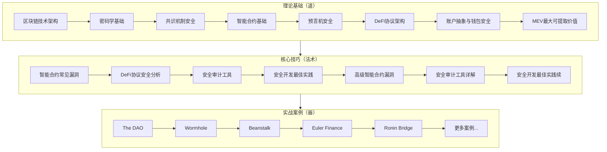

# 第21章 区块链安全 — 本章小结

## 本章知识全景

区块链安全是一个横跨密码学、分布式系统、博弈论和软件工程的交叉领域。本章从理论基础出发，经过核心技巧训练，到实战案例剖析，构建了一套完整的区块链安全知识体系。以下对全章内容进行系统性回顾，帮助读者巩固所学、查漏补缺。



## 核心知识回顾

### 理论基础：理解区块链安全的本质

本章第一节建立了区块链安全的理论根基，覆盖了从底层架构到上层应用的完整知识链。

**区块链分层安全架构**是理解所有安全问题的出发点。安全问题分布在三个层次：基础链层（共识机制、P2P网络、密码学原语）、扩展层（Layer 2、跨链桥、预言机）、应用层（智能合约、DeFi协议、DAO治理）。每一层都有独特的攻击面和防御策略，攻击者往往利用层间交互的薄弱环节发起攻击——跨链桥攻击（如Wormhole的6.25亿美元损失）正是利用了扩展层与基础链层之间的验证缺陷。

**密码学基础**涵盖了哈希函数（SHA-256、Keccak-256的碰撞性和原像抗性）、非对称加密（ECDSA在secp256k1曲线上的应用）、数字签名（交易验证的核心机制）以及Merkle树（轻客户端验证的基础）。理解这些原语的安全假设是评估整个系统安全性的前提——例如ECDSA的随机数k如果重复使用，私钥即可被推导（索尼PS3签名事件就是典型案例）。

**共识机制安全**部分对比了三大共识家族的安全特性：

| 共识机制 | 安全假设 | 主要攻击向量 | 代表链 |
|----------|----------|------------|--------|
| PoW | 算力诚实多数（51%） | 算力集中、自私挖矿、交易审查 | Bitcoin、（旧）Ethereum |
| PoS | 质押代币诚实多数 | 长程攻击、Nothing-at-Stake、验证者勾结 | Ethereum、Cardano |
| BFT | 诚实节点 ≥ 2/3 | Sybil攻击、领导者操纵 | Cosmos、Polygon |

**智能合约基础**部分介绍了EVM的执行模型（基于栈的字节码虚拟机、Gas计量机制、存储布局）、Solidity语言的关键特性（fallback/receive函数、delegatecall机制、状态变量布局）以及代币标准（ERC-20/721/1155的安全差异）。这些基础知识是后续漏洞分析的前提——不理解delegatecall就无法理解代理合约的存储冲突漏洞，不理解ERC-20的approve机制就无法理解前端运行攻击。

**预言机安全**部分揭示了DeFi系统中链上与链下数据交互的安全风险。价格预言机是DeFi协议的命脉——攻击者通过操纵预言机价格可以扭曲整个协议的经济逻辑。Chainlink的去中心化预言机网络通过多节点聚合、异常值过滤和心跳检查机制提供了一定程度的操纵抗性，但并非万无一失。TWAP（时间加权平均价格）机制通过平滑短期价格波动增加了操纵成本，但在流动性较低的池子中仍然可以被攻击。

**DeFi协议架构**部分分析了借贷协议（Aave/Compound的利率模型和清算机制）、AMM（Uniswap的恒定乘积公式和无常损失）、衍生品协议（dYdX、GMX的永续合约机制）的安全模型。DeFi的可组合性（"货币乐高"）既是创新的源泉也是风险的放大器——单一协议的漏洞可能通过组合关系波及整个生态系统。

**账户抽象与钱包安全**部分介绍了ERC-4337带来的安全范式转变：智能合约钱包支持社交恢复、批量交易、Gas代付等新功能，但也引入了新的攻击面（验证器逻辑漏洞、Bundler中心化风险）。传统EOA钱包的私钥管理（助记词存储、硬件钱包隔离签名）同样是安全链条中不可忽视的环节。

**MEV安全**部分揭示了区块生产者可提取价值对用户和系统的威胁：三明治攻击（Sandwich Attack）通过前后夹击用户的交易获利，清算机器人竞争导致Gas战争，而MEV-Boost等方案虽然将MEV收益从验证者扩展到构建者-提议者分离（PBS）架构，但也带来了新的中心化风险（Flashbots的MEV-Share协议正在尝试缓解这一问题）。

### 核心技巧：从漏洞识别到安全开发

本章第二节聚焦于实战技能，涵盖了漏洞识别、审计工具使用和安全开发方法论。

**智能合约常见漏洞**按严重程度排序的核心类型：

| 漏洞类型 | 严重度 | 成因 | 防御手段 |
|----------|--------|------|----------|
| 重入攻击 | 严重 | 状态更新前进行外部调用 | Checks-Effects-Interactions模式、ReentrancyGuard |
| 整数溢出/下溢 | 严重 | Solidity <0.8.0无自动检查 | 升级到0.8.0+或使用SafeMath |
| 访问控制缺陷 | 严重 | 权限设置不当或缺失 | OpenZeppelin AccessControl、最小权限原则 |
| 前端运行 | 高 | 交易在mempool中可见 | Flashbots私有交易、commit-reveal方案 |
| 闪电贷操纵 | 高 | 单交易内操纵价格/治理 | TWAP预言机、治理提案延迟 |
| 签名重放 | 中 | 缺少nonce/chainId/过期时间 | EIP-712结构化签名 |
| 代理存储冲突 | 中 | 升级合约存储布局不兼容 | 标准化存储布局（ERC-7201） |
| 拒绝服务 | 中 | 未限制循环/未处理失败调用 | Gas限制、pull模式替代push模式 |

**安全审计工具链**构成了多层检测体系：

- **Slither**（静态分析）：基于SSA的控制流分析，可检测100+种漏洞模式，执行速度快（秒级），适合CI/CD集成。典型用法：`slither ./contracts/ --checklist`生成审计清单。
- **Mythril**（符号执行）：基于符号执行和SMT求解，能发现复杂的多步攻击路径，但执行时间较长（分钟到小时级）。典型用法：`myth analyze Contract.sol --execution-timeout 300`。
- **Echidna**（模糊测试/属性测试）：基于遗传算法的fuzzer，通过定义不变量（invariant）自动探索状态空间。典型用法：定义`echidna_`前缀的测试函数，运行`echidna-test ./`。
- **Foundry**（开发+测试框架）：Forge支持fuzz testing和fork testing，可以在fork的主网状态上测试合约交互。典型用法：`forge test --fuzz-runs 10000 --fork-url $RPC_URL`。
- **Certora**（形式化验证）：使用CVL（Certora Verification Language）编写规范，通过数学证明确保合约行为符合规范。适用于关键金融逻辑的验证。

**安全开发最佳实践**部分强调了OpenZeppelin库的使用（不要自己实现密码学原语和访问控制）、全面的测试策略（单元测试、集成测试、fuzz测试、fork测试）、以及部署后的安全运维（Timelock、多签、监控告警、紧急暂停机制）。

### 实战案例：从历史事件中学习

本章第三节通过十余个真实安全事件的深度分析，将理论知识转化为实战认知。

**重大安全事件回顾**：

| 事件 | 时间 | 损失 | 攻击类型 | 核心教训 |
|------|------|------|----------|----------|
| The DAO | 2016.06 | $60M | 重入攻击 | 代码审计的重要性；硬分叉的治理争议 |
| Wormhole | 2022.02 | $3.25亿 | 跨链验证缺陷 | 系统变量必须验证；升级后的向后兼容性 |
| Beanstalk | 2022.04 | $1.82亿 | 闪电贷+治理攻击 | 治理提案必须有延迟期；闪电贷对治理的影响 |
| Ronin Bridge | 2022.03 | $6.25亿 | 密钥泄露/社工 | 运营安全的重要性；多签阈值设计 |
| Euler Finance | 2023.03 | $1.97亿 | 捐赠函数漏洞 | 复杂DeFi逻辑的组合风险；donate函数的权限 |
| Multichain | 2023.07 | $1.26亿 | 内部密钥泄露 | 团队信任假设的脆弱性；中心化桥的风险 |
| Curve Finance | 2023.07 | $73M | Vyper编译器重入 | 基础设施层漏洞的影响范围；编译器审计 |

**攻击类型统计**揭示了风险分布规律（基于Rekt Database数据）：

- 智能合约漏洞：35%，平均损失$50M
- 预言机操纵：25%，平均损失$30M
- 闪电贷攻击：20%，平均损失$40M
- 密钥泄露/社会工程：10%，平均损失$200M（单次损失最大）
- 治理攻击：5%，平均损失$100M
- 前端/DNS攻击：5%，平均损失$1M

一个关键观察：虽然密钥泄露占比仅10%，但平均损失高达$200M，这说明**运营安全和密钥管理是区块链安全中最被低估的领域**。技术上的代码审计再完善，如果多签私钥存储在同一个基础设施上（如Ronin事件），攻击者仍然可以一击致命。

### 常见误区：打破认知偏差

本章第四节澄清了区块链安全领域的典型认知误区：

**误区一："区块链是不可篡改的，所以是安全的"**
真相：区块链的不可篡改性仅保障了数据层的安全（交易记录不被篡改），但应用层的安全完全取决于智能合约代码的质量。一个有漏洞的智能合约被部署到区块链上，漏洞同样"不可篡改"——The DAO事件就是铁证。

**误区二："代码开源且经过审计就是安全的"**
真相：审计是时点评估，不是持续保证。合约依赖的外部环境（价格源、其他合约、链本身）都在变化。Beanstalk的治理合约本身没有代码漏洞，但经济设计允许闪电贷临时获得投票权——这是审计报告很难覆盖的经济模型风险。

**误区三："去中心化就能保证安全"**
真相：去中心化程度是一个光谱。很多"去中心化"项目的管理员密钥、升级权限、预言机数据源仍然高度中心化。Ronin Bridge名义上是去中心化跨链桥，但验证者节点由同一团队控制，本质上是中心化系统。

**误区四："Gas优化和安全可以兼顾"**
真相：两者经常冲突。unchecked块跳过了溢出检查以节省Gas，紧凑存储布局增加了存储冲突风险。原则是**安全永远优先于Gas优化**——用户多付几分钱的Gas远比数百万美元的漏洞损失便宜。

**误区五："交易是匿名的"**
真相：区块链交易是伪匿名的（pseudonymous），不是匿名的。链上分析工具（Chainalysis、Elliptic）可以通过交易图谱、时间关联、地址聚类等技术追踪资金流向。混币器（Tornado Cash）虽然增加了追踪难度，但并非不可破解。

### 练习方法：系统性成长路径

本章第五节提供了从入门到专业的完整学习路径：

| 阶段 | 目标 | 平台/资源 | 预期时间 |
|------|------|----------|----------|
| 基础阶段 | 掌握Solidity基础，理解常见漏洞 | Ethernaut（25+关卡）、OpenZeppelin文档 | 2-3个月 |
| 进阶阶段 | 独立完成合约审计，使用安全工具 | Damn Vulnerable DeFi（15个挑战）、SWC Registry | 3-6个月 |
| 实战阶段 | 参与审计竞赛，获取漏洞赏金 | Code4rena、Sherlock、Immunefi | 6-12个月 |
| 专业阶段 | 深度安全研究，发表技术文章 | 历史攻击复现、MEV研究、跨链安全 | 持续 |

每个阶段的关键不是"做完题目"，而是**理解每道题目背后的漏洞原理、攻击路径和防御方案**，并能够举一反三。

## 关键概念速查表

| 概念 | 定义 | 典型场景 | 重要度 |
|------|------|----------|--------|
| 重入攻击 | 在状态更新前重复调用提款函数，窃取资金 | The DAO $60M损失 | ⭐⭐⭐⭐⭐ |
| 闪电贷 | 单交易内无需抵押的借贷，用于临时获取巨额资金 | Beanstalk治理攻击 | ⭐⭐⭐⭐⭐ |
| 预言机操纵 | 通过操纵外部数据源影响合约逻辑 | Harvest Finance价格扭曲 | ⭐⭐⭐⭐ |
| 前端运行 | 观察mempool中待确认交易并抢先执行 | 三明治攻击（Sandwich） | ⭐⭐⭐⭐ |
| 治理攻击 | 利用治理机制漏洞获取控制权 | Beanstalk闪电贷治理 | ⭐⭐⭐⭐ |
| 跨链桥安全 | 跨链消息验证和资产托管的安全性 | Wormhole、Ronin、Multichain | ⭐⭐⭐⭐ |
| MEV | 区块生产者可提取的最大价值 | 清算竞争、三明治攻击 | ⭐⭐⭐ |
| 代理模式 | 支持合约升级的设计模式 | 存储冲突、初始化攻击 | ⭐⭐⭐ |
| 签名重放 | 重复使用有效签名进行未授权操作 | 缺少nonce/chainId验证 | ⭐⭐⭐ |
| 拒绝服务 | 使合约无法正常服务 | 未限制的循环、区块Gas限制 | ⭐⭐ |

## 工具速查

### 开发与测试工具

| 工具 | 类型 | 适用场景 | 核心命令 |
|------|------|----------|----------|
| Foundry | 开发框架 | Solidity开发、测试、部署 | `forge test --fuzz-runs 10000` |
| Hardhat | 开发环境 | TypeScript集成、插件生态 | `npx hardhat test` |
| Remix IDE | 在线IDE | 快速原型、教学演示 | 浏览器直接使用 |

### 安全审计工具

| 工具 | 分析方法 | 检测能力 | 执行速度 |
|------|----------|----------|----------|
| Slither | 静态分析（SSA） | 100+种漏洞模式 | 秒级 |
| Mythril | 符号执行 | 复杂多步攻击路径 | 分钟-小时 |
| Echidna | 模糊测试 | 状态空间探索、不变量违反 | 分钟级 |
| Manticore | 符号执行 | 多合约交互分析 | 分钟-小时 |
| Certora | 形式化验证 | 数学证明合约正确性 | 小时级 |

### 监控与运维工具

| 工具 | 功能 | 使用场景 |
|------|------|----------|
| Tenderly | 交易模拟、调试、监控 | 部署前模拟、生产监控 |
| Forta | 实时安全监控和告警 | 异常交易检测、攻击预警 |
| OpenZeppelin Defender | 安全运维平台 | 多签管理、自动化运维、紧急暂停 |
| Chainalysis | 链上分析和合规 | 资金追踪、反洗钱 |

### 工具使用示例

```bash
# 开发阶段：使用Slither进行静态分析
slither ./contracts/ --checklist > checklist.md

# 开发阶段：使用Foundry进行模糊测试
forge test --fuzz-runs 10000 --fork-url $MAINNET_RPC

# 审计阶段：使用Mythril进行符号执行
myth analyze contracts/Target.sol --execution-timeout 300

# 审计阶段：使用Echidna进行属性测试
echidna-test contracts/ --config echidna.yaml

# 部署阶段：使用Tenderly模拟交易
tenderly simulate --network mainnet --to 0x... --input 0x...

# 运维阶段：使用Forta监控
forta-agent run --contracts 0x...
```

## 安全审计检查清单

基于本章所有案例的综合分析，以下为智能合约安全审计的核心检查清单：

### 高优先级（必查）

1. **重入攻击防护**：所有涉及资金转移的函数必须遵循Checks-Effects-Interactions模式，或使用ReentrancyGuard
2. **访问控制正确性**：管理函数（pause、upgrade、withdraw等）的权限设置必须严格遵循最小权限原则
3. **预言机安全性**：价格源的可靠性和操纵抗性验证，单一来源的预言机必须有熔断机制
4. **闪电贷防护**：关键操作（价格计算、治理投票）不应在单个交易内可被闪电贷操纵
5. **整数溢出/下溢**：Solidity 0.8.0+的自动检查或SafeMath库的使用
6. **外部调用安全**：所有外部调用的返回值必须检查，外部调用后不应有状态更新

### 中优先级（应查）

7. **签名验证安全**：nonce防重放、chainId防跨链重放、过期时间防长期有效
8. **治理机制安全**：提案延迟期（Timelock）、投票权快照、紧急暂停机制
9. **代理合约升级安全**：存储布局兼容性、升级权限管理、初始化函数防重复调用
10. **事件日志完整性**：所有关键操作都有事件记录，便于链下监控

### 低优先级（建议查）

11. **Gas优化**：在不影响安全性的前提下优化Gas消耗
12. **代码风格和文档**：NatSpec注释、命名规范、接口文档
13. **测试覆盖率**：关键路径的单元测试和集成测试覆盖

## 后续学习建议

区块链安全领域的知识更新速度极快，以下是保持竞争力的建议：

### 信息获取

- **安全事件追踪**：Rekt News（rekt.news）、PeckShield Alert（Twitter）、SlowMist Security
- **技术研究**：Secureum（深度技术分析）、Paradigm Research（前沿研究论文）
- **漏洞披露**：Immunefi Blog、各审计平台的公开报告（Code4rena、Sherlock）

### 社区参与

- **EthSecurity Discord**：以太坊安全社区的核心讨论区
- **Secureum Epoch**：系统性的智能合约安全课程
- **各地区块链安全Meetup**：线下交流和networking

### 实践平台

- **审计竞赛**：Code4rena、Sherlock、Immunefi（从低奖金池的竞赛开始，逐步挑战高奖金池）
- **漏洞赏金**：Immunefi、Bugcrowd（在授权范围内对真实项目进行安全测试）
- **CTF竞赛**：Ethernaut、Damn Vulnerable DeFi、Paradigm CTF

### 深度研究方向

选择一个细分方向深入研究，建立专业壁垒：

- **MEV安全**：Flashbots生态、MEV-Share协议、PBS架构的安全影响
- **跨链安全**：轻客户端验证、乐观验证、ZK证明在跨链桥中的应用
- **ZK安全**：零知识证明系统的可信设置、电路审计、实现侧信道
- **账户抽象安全**：ERC-4337的验证器逻辑、Bundler中心化风险、Paymaster滥用
- **AI+区块链安全**：LLM辅助合约审计、AI驱动的异常交易检测

### 推荐阅读

| 资源 | 类型 | 适用阶段 | 链接 |
|------|------|----------|------|
| Consensys Best Practices | 最佳实践 | 基础-进阶 | [链接](https://consensys.github.io/smart-contract-best-practices/) |
| SWC Registry | 漏洞分类 | 基础-进阶 | [链接](https://swcregistry.io/) |
| DeFi Threat Matrix | 威胁模型 | 进阶 | [GitHub](https://github.com/defi-defense-dao/defi-threat-matrix) |
| Rekt News | 案例分析 | 全阶段 | [链接](https://rekt.news/) |
| OpenZeppelin Blog | 安全研究 | 进阶-专业 | [链接](https://blog.openzeppelin.com/) |
| Paradigm Research | 前沿研究 | 专业 | [链接](https://research.paradigm.xyz/) |

## 章节回顾总结

区块链安全不仅是技术问题，更是系统工程。本章的核心信息可以归纳为三条原则：

**第一，安全是分层的。** 从底层共识机制到上层应用逻辑，每一层都有独立的攻击面和防御策略。真正的安全需要全栈思维——一个在代码层面完美无缺的合约，可能因为预言机设计不当或治理机制缺陷而被攻破。

**第二，安全是动态的。** 审计报告只是时点评估，不是终身保证。新的攻击手法不断涌现（闪电贷、MEV利用、跨链攻击都是近几年才被广泛认知的威胁），安全从业者必须保持持续学习的状态。

**第三，安全是平衡的。** 去中心化程度、用户体验、Gas效率和安全性之间存在固有的张力。没有绝对安全的系统，只有在特定风险模型下的合理权衡。理解这些权衡并做出明智的设计决策，是安全工程师最核心的能力。

只有建立全面的安全意识，采用多层防御策略，持续学习和实践，才能在这个充满挑战的领域中保护好数字资产和用户信任。
