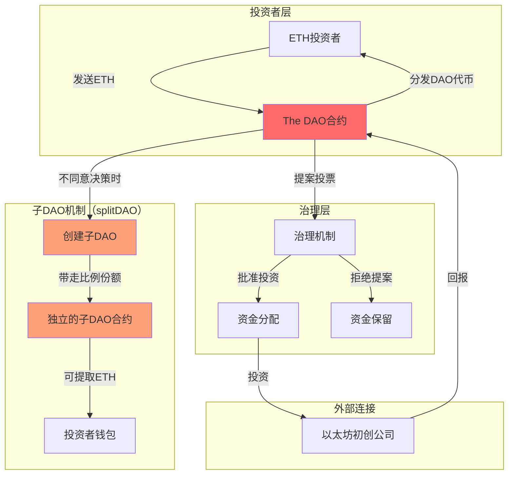
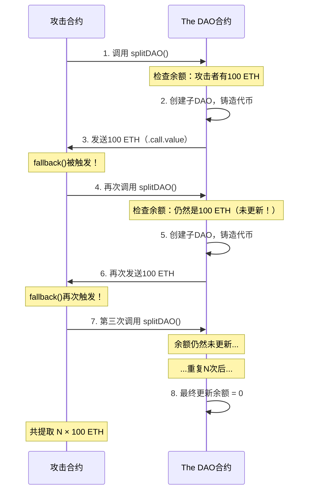

## 23.1 The DAO事件（2016年）

The DAO事件是区块链安全史上最具影响力的事件，没有之一。2016年6月，一个建立在以太坊上的去中心化自治组织因重入漏洞被盗走约360万个ETH（当时价值约6000万美元），直接导致以太坊社区分裂为ETH和ETC两条链。这一事件深刻改变了智能合约安全审计的行业标准，催生了"代码即法律"理念的全面反思，并间接推动了后续整个DeFi安全生态的建立。

### 23.1.1 历史背景：2016年的以太坊生态

要理解The DAO事件的冲击力，必须先理解当时的环境：

| 维度 | 2016年状况 | 2024年对比 |
|------|-----------|-----------|
| 以太坊价格 | ~$10-20/ETH | ~$3000+/ETH |
| DeFi生态 | 几乎不存在 | TVL超500亿美元 |
| 安全审计行业 | 不存在 | 数十家专业审计公司 |
| 智能合约语言 | Solidity 0.1.x（极不成熟） | Solidity 0.8.x（内置溢出保护） |
| 开发者工具 | 几乎为零 | Hardhat/Foundry/Slither等成熟工具链 |
| 社区规模 | 数千人 | 数百万开发者 |

2016年是以太坊主网上线的第二年，Solidity语言本身仍处于极早期阶段。没有成熟的开发框架，没有审计标准，没有安全最佳实践文档，开发者基本上是在"裸写"智能合约。The DAO项目在这样的背景下诞生，本身就蕴含着巨大的风险。

### 23.1.2 The DAO的设计与架构

#### 什么是DAO

DAO（Decentralized Autonomous Organization，去中心化自治组织）是一种通过智能合约实现治理的组织形式。其核心理念是：

- **去中心化决策**：没有传统公司中的CEO或董事会，所有决策由代币持有者投票决定
- **自动执行**：治理规则编码在智能合约中，投票结果自动执行，无需人工干预
- **透明公开**：所有资金流动和治理提案都在链上可查

#### The DAO的具体设计

The DAO的架构可以用以下mermaid图表示：



**The DAO的关键参数：**

- **众筹时间**：2016年4月30日至5月28日
- **募集总额**：约1270万个ETH（当时约1.5亿美元），占当时ETH总供应量的约14%
- **参与地址数**：约11,000个唯一地址
- **治理代币**：DAO Token，按ETH比例分发
- **投资对象**：以太坊生态系统中的初创项目
- **退出机制**：splitDAO函数——允许不同意治理决策的投资者退出并创建子DAO

**splitDAO机制的设计初衷**：这是一个"少数派保护"机制。如果多数投票通过了某个投资提案，但少数投资者认为该提案有风险，他们可以通过splitDAO分离出去，带走自己的比例份额到一个新创建的子DAO中。这个机制本意是好的，但它正是攻击者利用的入口。

### 23.1.3 重入漏洞的深度技术分析

#### 重入攻击的基本原理

在以太坊中，当合约A通过`call`方法向合约B发送ETH时，如果合约B的接收函数（fallback或receive）中有回调代码，它可以在A完成状态更新之前再次调用A的函数。这就是重入攻击。

重入攻击的执行流程如下：



#### The DAO合约中的具体漏洞代码

The DAO的漏洞代码比一般教材中的示例更复杂，因为它涉及多个合约的交互。以下是简化的漏洞逻辑：

```solidity
// The DAO合约 - splitDAO函数（简化版）
contract TheDAO {
    mapping(address => uint256) public balances;
    mapping(address => uint256) public tokenBalances;
    
    function splitDAO(
        uint256 _proposalID,
        address _newCurator
    ) returns (bool _success) {
        // 1. 计算投资者应得的ETH份额
        uint256 fundsToBeMoved = balances[msg.sender];
        
        // 2. 验证调用者是否有足够的DAO代币
        uint256 tokensToBeMoved = tokenBalances[msg.sender];
        require(tokenBalances[msg.sender] >= tokensToBeMoved);
        
        // 3. 创建子DAO并转移代币
        if (!createTokenProxy(...)) throw;
        
        // 4. 【关键漏洞】将ETH转移到rewardAccount
        //    这一步会触发msg.sender的fallback函数
        if (!withdrawRewardFor(msg.sender)) throw;
        
        // 5. 【关键漏洞】余额更新在转账之后
        balances[msg.sender] = 0;
        tokenBalances[msg.sender] = 0;
        
        Transfer(msg.sender, 0, tokensToBeMoved);
        return true;
    }
    
    function withdrawRewardFor(address _account) returns (bool) {
        uint256 amount = rewards[_account];
        // 使用call.value发送ETH——这会触发接收方的fallback
        if (_account.call.value(amount)()) {  // ← 漏洞触发点
            rewards[_account] = 0;
            return true;
        }
        return false;
    }
}
```

**漏洞的本质是三个问题的叠加：**

1. **状态更新顺序错误**：先转账后更新余额（违反Checks-Effects-Interactions模式）
2. **使用`.call.value()`转账**：这种调用方式会传递所有剩余gas，允许接收方执行任意代码
3. **`withdrawRewardFor`的双重支付**：`rewards[_account]`的清零在`call.value`之后，可以被重入绕过

#### 为什么`.call.value()`特别危险

以太坊中有三种发送ETH的方式，安全性依次递增：

| 方式 | Gas限制 | 能否触发fallback | 安全性 | 推荐度 |
|------|---------|-----------------|--------|--------|
| `address.send(amount)` | 2300 gas | 可以（但gas不足以执行复杂逻辑） | 中 | 有条件使用 |
| `address.transfer(amount)` | 2300 gas | 可以（但gas不足以执行复杂逻辑） | 中高 | 有条件使用 |
| `address.call.value(amount)("")` | 所有剩余gas | 可以执行任意复杂逻辑 | 低 | 不推荐直接使用 |

The DAO使用了`.call.value()`，这给了攻击者足够的gas来执行重入调用。如果使用`transfer()`或`send()`，2300 gas不足以发起一次新的函数调用（一次SSTORE操作就要5000-20000 gas），重入攻击就不会成功。

### 23.1.4 攻击者的完整攻击流程

#### 攻击者合约

攻击者部署了一个精心构造的恶意合约，其核心逻辑如下：

```solidity
// 攻击者合约（简化还原）
contract AttackerDAO {
    TheDAO public dao;
    address public owner;
    
    constructor(address _dao) {
        dao = TheDAO(_dao);
        owner = msg.sender;
    }
    
    // 攻击入口：以少量ETH加入DAO，然后调用splitDAO
    function attack() public {
        // 通过splitDAO反复提取资金
        dao.splitDAO(
            proposalID,    // 随便一个提案ID
            address(this)  // 新的curator设为自己
        );
    }
    
    // 收到ETH时自动触发——这是重入的核心
    function() payable {
        // 如果DAO合约中还有余额，继续攻击
        if (dao.balances(address(this)) > 0) {
            dao.splitDAO(proposalID, address(this));
        }
    }
    
    // 提取最终收益
    function drain() public {
        require(msg.sender == owner);
        owner.transfer(address(this).balance);
    }
}
```

#### 攻击时间线

| 时间（UTC） | 事件 | 备注 |
|-------------|------|------|
| 2016-06-17 03:34 | 攻击者开始执行第一次重入攻击 | 利用splitDAO函数 |
| 06-17 03:34 - 11:00 | 持续约7.5小时的攻击 | 每笔交易提取约300-600 ETH |
| 06-17 11:00 | The DAO团队发现异常 | 通过社区报告 |
| 06-17 | 社区紧急讨论应对方案 | 链上治理投票无法及时响应 |
| 06-17 ~ | 白帽黑客组织反攻 | 使用相同的重入漏洞回收剩余资金 |
| 06-17 - 07-20 | 持续的社区辩论 | 回滚 vs 不回滚 |
| 2016-07-20 | 以太坊硬分叉执行 | 区块高度1,920,000 |

**攻击细节数据：**

- 攻击者总共执行了约30-40笔攻击交易
- 每笔交易平均提取约10-25万ETH
- 总计被盗约3,641,694 ETH（约6000万美元）
- 攻击者合约地址：`0xc0ee9db1a9e07ca63e4ff0d5fb6f86bf68d47b89`（已被社区标记）
- DAO合约地址：`0xbb9bc244d798123fde783fcc1c72d3bb8c189413`

#### 白帽黑客救援行动

在发现攻击后，一群开发者组成的"白帽黑客"组织迅速行动。他们发现攻击者虽然停止了攻击（可能是出于法律考虑或技术限制），但DAO合约中仍有约720万个ETH面临风险。

白帽黑客的操作：

1. 使用相同的重入漏洞，将剩余资金转移到安全的"WhiteHatDAO"合约中
2. 利用The DAO自身的治理机制（需要27天的锁定期）来保护资金
3. 最终通过硬分叉将所有资金（包括攻击者已盗走的部分）归还给原始投资者

### 23.1.5 硬分叉争议与ETH/ETC分裂

#### 争议的核心："代码即法律"

The DAO事件引发了一场深刻的哲学和法律辩论：

**反对方的观点：**
- 区块链的不可篡改性是其核心价值，回滚交易违背了这一原则
- "Code is Law"——智能合约的执行结果就是最终结果，不论是否有漏洞
- 回滚会创造一个危险的先例：谁来决定哪些交易需要回滚？
- 如果The DAO可以回滚，那么未来任何被攻击的项目都可以要求回滚

**支持方的观点：**
- 攻击者利用的是明确的漏洞，而非合约的"合法"功能
- 14%的ETH供应量集中在有漏洞的合约中，威胁整个以太坊网络的安全
- 以太坊基金会和Vitalik Buterin有道义责任保护投资者
- 不回滚将导致攻击者持有大量ETH，对生态造成长期负面影响

#### 硬分叉的技术实现

2016年7月20日，以太坊在区块高度1,920,000执行硬分叉。分叉的技术方案非常简单粗暴：

```solidity
// 硬分叉中的状态变更（伪代码）
// 将DAO合约中的所有ETH转移到退款合约
contract DAO_Refund {
    // 记录每个投资者在DAO中的份额
    mapping(address => uint256) public credit;
    
    function withdraw() public {
        uint256 amount = credit[msg.sender];
        credit[msg.sender] = 0;
        msg.sender.transfer(amount);
    }
}
```

#### 结果

- **ETH链**：接受硬分叉，回滚攻击交易，投资者获得退款
- **ETC链**（以太坊经典）：拒绝硬分叉，保持原始区块链不变

这一分裂持续至今。ETH市值远超ETC，但ETC社区始终坚持"代码即法律"的纯粹理念。

### 23.1.6 The DAO事件对行业的深远影响

#### 1. 安全审计行业的诞生

The DAO事件之前，不存在专业的智能合约审计公司。事件之后：

- **2016-2017年**：Trail of Bits、OpenZeppelin等首批审计公司成立
- **2018年至今**：审计成为DeFi项目的标配，单次审计费用从数万到数百万美元不等
- **审计标准**：建立了包括形式化验证、模糊测试、人工审查在内的多层审计体系

#### 2. Solidity语言的改进

The DAO漏洞暴露了Solidity语言设计上的缺陷，推动了多项改进：

| 版本 | 改进内容 | 解决的问题 |
|------|---------|-----------|
| Solidity 0.4.22 | 引入`constructor`关键字 | 避免构造函数被外部调用 |
| Solidity 0.5.0 | 移除`throw`，强制使用`require/revert` | 更明确的错误处理 |
| Solidity 0.6.0 | 引入`receive()`和`fallback()`函数分离 | 明确ETH接收逻辑 |
| Solidity 0.8.0 | 内置整数溢出检查 | 消除整数溢出漏洞 |

#### 3. 开发模式的变革

The DAO事件直接催生了两个重要的安全开发模式：

**Checks-Effects-Interactions模式（CEI）**：

```solidity
// 错误模式（The DAO的做法）
function withdraw() public {
    uint amount = balances[msg.sender];
    msg.sender.call{value: amount}("");  // 先外部调用
    balances[msg.sender] = 0;            // 后更新状态
}

// 正确模式（CEI）
function withdraw() public {
    uint amount = balances[msg.sender];  // 1. Checks（检查）
    require(amount > 0);
    balances[msg.sender] = 0;            // 2. Effects（更新状态）
    msg.sender.call{value: amount}("");  // 3. Interactions（外部调用）
}
```

**Reentrancy Guard（重入锁）**：

```solidity
// OpenZeppelin的ReentrancyGuard
abstract contract ReentrancyGuard {
    uint256 private constant _NOT_ENTERED = 1;
    uint256 private constant _ENTERED = 2;
    uint256 private _status;
    
    constructor() {
        _status = _NOT_ENTERED;
    }
    
    modifier nonReentrant() {
        require(_status != _ENTERED, "ReentrancyGuard: reentrant call");
        _status = _ENTERED;
        _;
        _status = _NOT_ENTERED;
    }
}

contract SafeVault is ReentrancyGuard {
    mapping(address => uint256) public balances;
    
    function withdraw() public nonReentrant {  // 使用nonReentrant修饰符
        uint amount = balances[msg.sender];
        balances[msg.sender] = 0;
        msg.sender.call{value: amount}("");
    }
}
```

#### 4. SEC的监管态度

2017年7月，美国SEC发布调查报告，认定The DAO代币属于证券。这一裁定对整个区块链行业产生了深远影响：

- 所有在以太坊上发行的代币都可能被认定为证券
- ICO（首次代币发行）需要遵守证券法
- 推动了后续对ICO项目的全面监管
- 间接促进了IEO（交易所首发）和IDO（DEX首发）等合规模式的发展

### 23.1.7 从The DAO到现代：重入攻击的演变

The DAO事件已经过去多年，但重入攻击从未消失，而是不断进化：

#### 常见的重入攻击变体

| 变体类型 | 描述 | 代表案例 |
|---------|------|---------|
| 单函数重入 | 同一个函数内的重入（The DAO经典模式） | The DAO |
| 跨函数重入 | 攻击者重入到另一个有漏洞的函数 | Cream Finance |
| 跨合约重入 | 通过多个合约之间的交互实现重入 | Compound/ERC777 |
| 读取重入 | 不修改状态，但读取到未更新的状态变量 | 催生了ERC-4626的"虚拟余额"解决方案 |
| ERC777回调重入 | 利用ERC777代币的`tokensReceived`钩子 | imBTC/Uniswap V1 |

#### 现代防护体系

```text
防护层次架构：
┌─────────────────────────────────────────┐
│  第1层：代码模式                          │
│  - CEI（Checks-Effects-Interactions）     │
│  - ReentrancyGuard（重入锁）              │
│  - pull代替push支付模式                   │
├─────────────────────────────────────────┤
│  第2层：静态分析                          │
│  - Slither（自动检测重入模式）            │
│  - Securify2（形式化验证）                │
│  - Mythril（符号执行分析）                │
├─────────────────────────────────────────┤
│  第3层：动态测试                          │
│  - Echidna（模糊测试，自动生成重入用例）  │
│  - Foundry Fuzz Testing                 │
│  - Manticore（符号执行+状态探索）         │
├─────────────────────────────────────────┤
│  第4层：人工审计                          │
│  - 专业的安全审计公司                     │
│  - Bug Bounty赏金计划                    │
│  - 形式化验证（Certora等）                │
└─────────────────────────────────────────┘
```

#### Slither检测重入漏洞示例

```bash
# 安装Slither
pip install slither-analyzer

# 对合约进行静态分析
slither TheDAO.sol

# 专门检测重入漏洞
slither TheDAO.sol --detect reentrancy-eth,reentrancy-no-eth,reentrancy-events

# 输出示例：
# TheDAO.withdrawRewardFor (TheDAO.sol#L25-32) sends ETH to arbitrary user
#         Dangerous calls:
#             - _account.call.value(amount)() (TheDAO.sol#L28)
# Reference: https://github.com/crytic/slither/wiki/Detector-Documentation#reentrancy-eth
```

### 23.1.8 关键教训与防御清单

#### 给智能合约开发者的教训

1. **始终遵循CEI模式**：先检查条件，再更新状态，最后进行外部调用。这是防止重入攻击最基本的原则。

2. **优先使用transfer/send而非call.value**：虽然在EIP-1884之后transfer/send因gas限制可能在某些场景下不适用，但大多数情况下仍然更安全。

3. **使用ReentrancyGuard**：OpenZeppelin的ReentrancyGuard已经成为行业标准，几乎所有涉及ETH转移的函数都应该使用`nonReentrant`修饰符。

4. **大资金合约需要多轮审计**：The DAO持有14%的ETH供应量，但其代码几乎没有经过任何专业审计。对于管理大额资金的合约，至少需要2-3家不同审计公司的独立审查。

5. **建立应急响应机制**：The DAO事件暴露了去中心化治理在紧急情况下的低效。现代DeFi项目通常会设置"治理多签"或"紧急暂停"功能。

6. **不要急于上线**：The DAO在众筹结束后立即上线，没有经过充分的测试期。建议至少进行3-6个月的测试网运行和赏金计划。

#### 给安全审计师的教训

1. **关注状态更新顺序**：任何在外部调用之后进行状态更新的代码都是可疑的。

2. **理解代币标准的回调机制**：ERC777、ERC721等代币标准都有回调函数，可能被用于跨合约重入。

3. **检查第三方合约的安全性**：The DAO的漏洞部分源于它与其他合约（rewardAccount）的交互。审计时必须考虑外部调用的全部影响。

4. **不要只依赖自动化工具**：当时的Slither、Mythril等工具还不存在，但即使现在，这些工具也无法捕获所有类型的重入漏洞。人工审查仍然不可替代。

### 23.1.9 延伸阅读与原始资源

- **Etherscan原始交易**：可在Etherscan上查看The DAO合约（`0xbb9bc244d798123fde783fcc1c72d3bb8c189413`）的所有交易记录
- **SEC调查报告**：[Report of Investigation Pursuant to Section 21(a) of the Securities Exchange Act of 1934](https://www.sec.gov/litigation/investreport/34-81207.pdf)
- **以太坊社区讨论**：Ethereum Magicians论坛中关于The DAO事件的完整讨论记录
- **Phil Daian等人的学术论文**：*Flash Boys 2.0: Frontrunning, Transaction Reordering, and Consensus Instability in Decentralized Exchanges*（2019），详细分析了The DAO事件对后续DeFi安全的影响

The DAO事件是区块链安全史上的"创世事件"——它用6000万美元的代价，教会了整个行业什么是智能合约安全。十年后的今天，每当我们编写`nonReentrant`修饰符时，都应该记得这四个字背后的故事。
