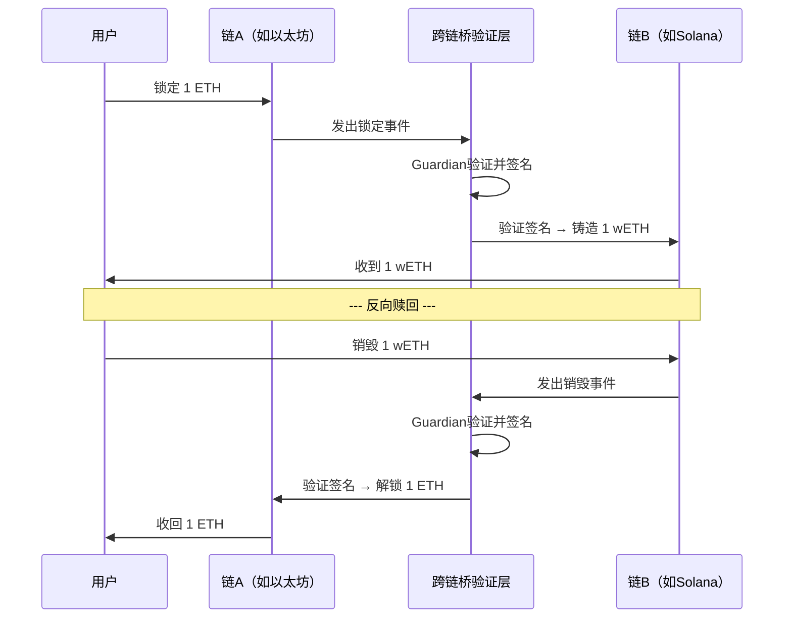
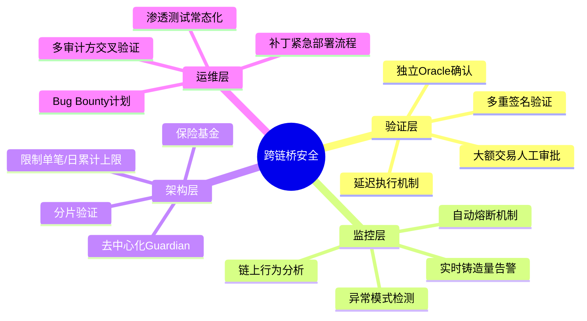

## 23.2 Wormhole跨链桥攻击（2022年）

### 23.2.1 事件概览

2022年2月2日，连接Solana和以太坊的跨链桥Wormhole遭遇攻击，约120,000枚wETH（当时价值约3.26亿美元）被凭空铸造并转移。这是2022年初期损失最大的DeFi安全事件之一，也是跨链桥安全领域的标志性案例。

| 维度 | 详情 |
|------|------|
| 攻击日期 | 2022年2月2日 18:28 UTC |
| 攻击目标 | Wormhole Solana端智能合约 |
| 损失金额 | ~120,000 ETH（约3.26亿美元） |
| 攻击类型 | 签名验证绕过 → 未授权铸币 |
| 漏洞组件 | `verify_signatures` 函数中的Sysvar账户验证缺陷 |
| 根本原因 | 合约未校验Sysvar账户地址的真实性 |
| 补救方 | Jump Crypto（Wormhole的支持方）自掏腰包补充了12万ETH |
| 链上痕迹 | Solana交易签名 `0xf9528a7d...`，以太坊交易 `0xa530c0b...` |

### 23.2.2 跨链桥基础：理解攻击的前置知识

#### 23.2.2.1 什么是跨链桥

区块链本质上是独立的分布式账本，链与链之间无法直接通信。跨链桥是一种允许资产和数据在不同区块链之间转移的协议，其核心思想是"锁定-铸造"模式：

1. 用户在链A上锁定资产
2. 跨链桥在链B上铸造等价的"包装"资产（wrapped token）
3. 当用户要取回资产时，在链B上销毁包装资产
4. 跨链桥在链A上解锁原始资产



这种模式的安全性完全依赖于第2步和第3步的验证逻辑——如果攻击者能伪造验证结果，就可以在不锁定任何资产的情况下凭空铸造包装资产。

#### 23.2.2.2 Wormhole的架构设计

Wormhole采用了"Guardian网络"架构，由一组受信任的验证节点（Guardian）负责监听和验证跨链消息。

**Guardian网络**：当时由19个Guardian节点组成，由Jump Trading、Certus One、Figment等知名机构运营。跨链消息需要至少2/3（即13个）Guardian的签名才能被视为合法。

**VAA（Verifiable Action Approval）**：这是Wormhole的核心数据结构，代表一条经过Guardian签名验证的跨链指令。VAA包含以下字段：

```text
┌─────────────────────────────────────────────┐
│                  VAA 结构                    │
├─────────────────────────────────────────────┤
│ version (1 byte)      - 协议版本号           │
│ guardian_set_index (4) - Guardian集合索引     │
│ signatures (N×66)     - Guardian签名列表     │
│ timestamp (4 bytes)   - 消息时间戳           │
│ nonce (4 bytes)       - 随机数               │
│ emitter_chain (2)     - 发送方链ID           │
│ emitter_address (32)  - 发送方地址           │
│ sequence (8 bytes)    - 消息序列号           │
│ consistency_level (1) - 一致性级别           │
│ payload (variable)    - 实际执行的操作       │
└─────────────────────────────────────────────┘
```

**处理流程**：用户在源链发起跨链请求 → 源链合约发出事件 → Guardian监听到事件 → Guardian验证并集体签名生成VAA → 用户或中继器将VAA提交到目标链 → 目标链合约验证VAA签名并执行操作。

#### 23.2.2.3 Solana账户模型的关键特性

要理解此漏洞，必须先理解Solana的账户模型，因为它与以太坊的存储模型有本质区别：

**以太坊**：合约状态存储在合约内部，合约代码和数据绑定在一起。

**Solana**：所有数据存储在独立的"账户"中，程序（合约）是无状态的——它接收一组账户作为输入，读取和修改这些账户的数据，然后返回。

这意味着Solana程序必须显式验证每一个传入账户的身份。如果一个程序需要读取系统时钟，它会接收一个名为 `sysvar_account` 的账户参数，然后通过 `Clock::from_account_info()` 来解析其中的数据。**但是，如果程序没有验证这个账户的地址是否确实是官方的Clock系统变量地址，攻击者就可以传入一个伪造的账户。**

Solana的官方系统变量（如Clock、Rent、StakeHistory等）都有固定的地址，例如：

- Clock: `SysvarC1ock11111111111111111111111111111111`
- Rent: `SysvarRent111111111111111111111111111111111`
- StakeHistory: `SysvarStakeHistory1111111111111111111111111`

程序应该检查传入的sysvar账户地址是否匹配这些已知地址。

### 23.2.3 漏洞深度分析

#### 23.2.3.1 漏洞位置

漏洞存在于Wormhole Solana端合约的 `verify_signatures` 函数中。该函数负责验证VAA中Guardian签名的合法性。核心问题在于：该函数使用了 `sysvar_account` 来读取Solana的时钟信息（用于检查签名是否过期），但从未验证 `sysvar_account` 的地址是否为合法的Clock系统变量地址。

漏洞代码简化表示：

```rust
// 漏洞代码：verify_signatures 函数（简化版）
fn verify_signatures(
    program_id: &Pubkey,
    sysvar_account: &AccountInfo,   // ← 攻击者可控的输入
    instruction_account: &AccountInfo,
    signature_set: &AccountInfo,
    guardian_set: &GuardianSet,
    signatures: &[SecpSignature],
) -> ProgramResult {
    // 问题所在：直接使用 sysvar_account 解析时钟
    // 但从未检查 sysvar_account.key 是否为 Clock 系统变量的官方地址
    let clock = Clock::from_account_info(sysvar_account)?;
    
    // 使用时钟检查签名是否过期
    let guardian_set_expiration = guardian_set.expiration_time;
    if clock.unix_timestamp > guardian_set_expiration {
        return Err(ErrorCode::GuardianSetExpired.into());
    }
    
    // 后续的签名验证逻辑...
    // 但关键问题在于：如果攻击者可以操纵clock的值，
    // 就可以让过期检查变得毫无意义
}
```

#### 23.2.3.2 为什么这个漏洞如此致命

这个漏洞的严重性在于它影响的不是某个边缘功能，而是整个跨链桥的信任根基——签名验证。具体来说：

**签名过期检查的本意**：Guardian集合会定期轮换，旧的Guardian集合在一定时间后会过期。`verify_signatures` 使用时钟来确保当前验证使用的Guardian集合仍然有效。如果攻击者能够伪造时钟，他就可以让系统认为一个已经过期的Guardian集合仍然有效。

**更深层的攻击路径**：在Wormhole的具体实现中，攻击者并不需要伪造一个过期的Guardian集合。漏洞的真正利用方式是：通过伪造sysvar账户，攻击者可以完全绕过 `verify_signatures` 的输入验证。Solana的 `AccountInfo` 结构允许程序接收任意账户，而 `create_account_with_seed` 指令允许创建大小和内容可控的账户。攻击者可以创建一个数据内容精心构造的伪造账户，使 `Clock::from_account_info()` 成功解析并返回攻击者期望的时钟值。

#### 23.2.3.3 为什么安全审计没有发现这个漏洞

Wormhole在攻击发生前曾接受过Neodyme的安全审计。这个漏洞之所以被遗漏，原因可能包括：

1. **审计范围局限**：安全审计通常在有限时间内完成，可能没有覆盖所有代码路径
2. **sysvar验证被当作"已知模式"**：审计人员可能假设Solana开发者都会自动验证系统变量地址，从而没有重点检查
3. **攻击面的复杂性**：跨链桥的攻击面包括源链、目标链和Guardian网络三个维度的组合，单链审计难以覆盖跨链交互的完整路径
4. **Solana生态成熟度**：2022年初，Solana生态的安全审计标准和工具链尚不如以太坊成熟，关于sysvar验证的最佳实践尚未成为行业共识

### 23.2.4 攻击过程全解析

#### 23.2.4.1 攻击准备阶段

攻击者在链上部署了一个自定义的Rust程序，该程序利用Solana的 `create_account_with_seed` 指令来创建一个伪造的系统变量账户。

```rust
// 攻击者的exploit程序（概念还原）
// 步骤1：创建一个伪造的Clock sysvar账户

use solana_program::{
    account_info::AccountInfo,
    entrypoint,
    instruction::{AccountMeta, Instruction},
    program::invoke,
    pubkey::Pubkey,
    system_instruction,
};

// 攻击者使用 create_account_with_seed 创建一个账户
// 该账户的大小与 Clock sysvar 完全一致（2+8+8+8+8=34 bytes）
// 数据内容经过精心构造，使 Clock::from_account_info() 返回预期值

fn create_fake_clock_account(
    payer: &AccountInfo,
    fake_clock: &AccountInfo,
    seed: &str,
    lamports: u64,
) -> ProgramResult {
    // create_account_with_seed 允许攻击者：
    // 1. 控制账户的大小
    // 2. 控制账户的数据内容（通过seed推导地址后，后续写入数据）
    invoke(
        &system_instruction::create_account_with_seed(
            payer.key,
            fake_clock.key,
            payer.key,      // base
            seed,           // seed
            lamports,
            34,             // Clock sysvar 的大小
            &Pubkey::default(), // 程序所有者（设为系统程序以允许写入）
        ),
        &[payer.clone(), fake_clock.clone()],
    )?;
    Ok(())
}
```

#### 23.2.4.2 攻击执行阶段

攻击的具体执行步骤如下：

**步骤1：创建伪造Sysvar账户**

攻击者调用 `create_account_with_seed`，创建了一个与Clock系统变量大小相同（34字节）的账户。这个账户的地址可以被攻击者精确控制（通过base pubkey + seed确定性推导）。

**步骤2：构造恶意交易**

攻击者构建了一个Solana交易，该交易包含以下指令序列：

```text
┌──────────────────────────────────────────────────────────┐
│                攻击交易结构（简化）                        │
├──────────────────────────────────────────────────────────┤
│ 指令1: create_account_with_seed                          │
│   - 创建伪造的Clock sysvar账户                            │
│   - 大小: 34 bytes                                       │
│   - 数据: 精心构造，使 Clock::from_account_info 成功解析   │
│                                                          │
│ 指令2: post_vaa (Wormhole核心合约)                        │
│   - 传入伪造的sysvar_account                              │
│   - 传入伪造的VAA（声称有合法Guardian签名）                 │
│   - VAA payload: mint 120,000 wETH                       │
│                                                          │
│ 指令3: complete_transfer (Wormhole核心合约)               │
│   - 使用步骤2发布的VAA                                    │
│   - 在Solana上铸造 120,000 wETH                          │
└──────────────────────────────────────────────────────────┘
```

**步骤3：铸造wETH**

由于 `verify_signatures` 函数使用了伪造的sysvar账户进行时钟读取，签名校验被绕过。Wormhole的Solana端合约接受了伪造的VAA，在Solana上凭空铸造了120,000枚wETH。

**步骤4：转移到以太坊**

攻击者随后将铸造的wETH通过Wormhole桥接回以太坊，兑换为真实的ETH。由于此时Wormhole的以太坊端仍然信任Solana端的铸造操作（因为这是通过合法的VAA流程完成的），赎回过程没有任何阻碍。

#### 23.2.4.3 攻击时间线

```mermaid
gantt
    title Wormhole攻击时间线 (2022-02-02)
    dateFormat HH:mm
    axisFormat %H:%M UTC
    
    section 攻击执行
    攻击者部署exploit程序      :done, 18:00, 15min
    创建伪造sysvar账户         :done, 18:15, 5min
    提交恶意铸造交易           :crit, done, 18:20, 5min
    12万wETH到账Solana钱包     :crit, done, 18:25, 3min
    
    section 资产转移
    wETH桥接到以太坊           :crit, done, 18:28, 10min
    ETH分散到多个地址          :done, 18:38, 20min
    
    section 响应处置
    Wormhole团队发现异常       :done, 18:45, 15min
    合约暂停                   :done, 19:00, 10min
    Jump Crypto公告补救方案    :done, 19:30, 30min
```



### 23.2.5 根因分析：五个层面的失败

这次攻击不是单一失误导致的，而是多层防御的同时失效。

#### 23.2.5.1 代码层：缺少账户验证

**直接原因**：`verify_signatures` 函数没有验证 `sysvar_account.key` 是否为 `SysvarC1ock11111111111111111111111111111111`。

**修复方式**（攻击后部署的补丁）：

```rust
// 修复后的代码
fn verify_signatures(
    program_id: &Pubkey,
    sysvar_account: &AccountInfo,
    // ...
) -> ProgramResult {
    // 新增：严格验证 sysvar 账户地址
    if sysvar_account.key != &solana_program::sysvar::clock::ID {
        return Err(ProgramError::IncorrectProgramId);
    }
    
    let clock = Clock::from_account_info(sysvar_account)?;
    // ...后续逻辑
}
```

#### 23.2.5.2 架构层：单一验证路径

Wormhole的跨链消息验证完全依赖 `verify_signatures` 这一个函数。一旦这个函数被绕过，没有任何备用验证机制。理想架构应该有多重签名验证层：

- 第1层：验证VAA格式和签名数量
- 第2层：验证Guardian集合的有效性（包含时钟检查）
- 第3层：独立的Oracle验证（对大额交易进行二次确认）
- 第4层：延迟执行机制（大额铸造设置时间锁）

#### 23.2.5.3 流程层：安全补丁未及时部署

根据链上记录和后续披露的信息，这个sysvar验证漏洞的修复方案在攻击前就已经被识别出来，但补丁尚未部署到生产环境。这说明Wormhole的补丁发布流程存在严重的管理漏洞——在跨链桥这种高价值目标上，安全补丁的部署应该是最高优先级的紧急事项。

#### 23.2.5.4 监控层：缺乏实时告警

120,000 ETH的铸造是一个极其异常的操作。正常情况下，Wormhole的单笔跨链转账量远远小于此数额。一个完善的监控系统应该能够：

- 对单笔铸造超过阈值的交易发出实时告警
- 检测短时间内的异常铸造模式
- 自动暂停合约功能（circuit breaker）

#### 23.2.5.5 治理层：中心化风险

Wormhole虽然有19个Guardian节点，但攻击者绕过了整个Guardian验证机制。更深层的问题是：Wormhole的合约升级权限是中心化的（由多签钱包控制），这意味着如果多签被攻破，攻击者可以直接修改合约逻辑。跨链桥的治理去中心化程度直接影响其安全上限。

### 23.2.6 攻击影响与补救措施

#### 23.2.6.1 直接影响

| 影响维度 | 详情 |
|----------|------|
| 资金损失 | 120,000 ETH（~3.26亿美元） |
| wETH脱锚 | Solana上wETH瞬间失去等值资产支撑 |
| 用户信心 | 大量用户恐慌性赎回，跨链桥TVL暴跌 |
| DeFi连锁反应 | 依赖wETH的Solana DeFi协议（如Saber、Mercurial）受到影响 |
| 行业信心 | 跨链桥安全叙事崩塌，后续引发行业对跨链桥的全面审视 |

#### 23.2.6.2 Jump Crypto的补救

Jump Crypto（Wormhole的主要投资方和技术支持方）在攻击发生后数小时内宣布将自掏腰包补充被盗的120,000 ETH。这一决策的原因包括：

1. **维护Wormhole生态**：如果不补充资金，Solana上的wETH将永久脱锚，Wormhole协议将失去信任
2. **保护投资**：Jump Crypto在Wormhole生态中有巨大的战略投资，不补救的损失远大于12万ETH
3. **行业信号**：展示负责任的态度，有助于恢复用户信心

补救的12万ETH从Jump Crypto的钱包转入Wormhole的以太坊端合约，用于支撑Solana上流通的wETH。

#### 23.2.6.3 技术修复

Wormhole团队在攻击后立即采取了以下技术措施：

1. **紧急暂停跨链功能**：停止所有跨链转账，防止进一步损失
2. **部署补丁**：修复 `verify_signatures` 中的sysvar验证缺陷
3. **重新初始化Guardian集合**：确保验证节点的密钥没有泄露
4. **逐步恢复服务**：经过全面安全审查后重新开放跨链功能

### 23.2.7 跨链桥安全横向对比

Wormhole攻击并非孤立事件。2022年被称为"跨链桥安全灾难年"，多个头部跨链桥遭受灾难性攻击。以下是主要事件的横向对比：

| 事件 | 时间 | 损失 | 攻击类型 | 根因 |
|------|------|------|----------|------|
| **Wormhole** | 2022-02 | $3.26亿 | 签名验证绕过 | Sysvar账户未校验 |
| **Ronin Bridge** | 2022-03 | $6.25亿 | 私钥泄露 | 验证节点密钥集中管理 |
| **Harmony Horizon** | 2022-06 | $1亿 | 私钥泄露 | 2/3多签门槛过低（仅需2个密钥） |
| **Nomad** | 2022-08 | $1.9亿 | Merkle根初始化缺陷 | 一行代码错误导致任意消息可验证 |

**共同特征**：

- 攻击目标都是跨链桥的验证机制
- 都涉及链间信任传递的设计缺陷
- 损失金额巨大（均为千万美元级以上）
- 攻击者都在链上留下了完整的攻击痕迹

**差异分析**：

- Wormhole和Nomad是代码层面的逻辑漏洞
- Ronin和Harmony是基础设施层面的密钥管理问题
- 所有案例都反映出跨链桥作为"蜜罐"（高价值、单点故障）的系统性风险

### 23.2.8 跨链桥安全防御框架

基于Wormhole攻击的教训，以下是构建安全跨链桥的关键原则。

#### 23.2.8.1 账户验证清单（Solana特有）

对于Solana上的跨链桥合约，必须执行以下账户验证：

```rust
// Solana 跨链桥安全验证清单
fn validate_all_accounts(accounts: &[AccountInfo]) -> ProgramResult {
    // 1. 验证系统变量地址
    require!(
        accounts[SYSVAR_CLOCK_INDEX].key == &sysvar::clock::ID,
        ErrorCode::InvalidSysvar
    );
    require!(
        accounts[SYSVAR_RENT_INDEX].key == &sysvar::rent::ID,
        ErrorCode::InvalidSysvar
    );
    
    // 2. 验证PDA（Program Derived Address）地址
    let (expected_pda, bump) = Pubkey::find_program_address(
        &[b"bridge_state"],
        program_id,
    );
    require!(
        accounts[BRIDGE_STATE_INDEX].key == &expected_pda,
        ErrorCode::InvalidPDA
    );
    
    // 3. 验证账户所有者
    require!(
        accounts[BRIDGE_STATE_INDEX].owner == program_id,
        ErrorCode::IncorrectOwner
    );
    
    // 4. 验证签名者权限
    require!(
        accounts[GUARDIAN_INDEX].is_signer,
        ErrorCode::MissingSignature
    );
    
    // 5. 验证账户数据大小
    require!(
        accounts[BRIDGE_STATE_INDEX].data_len() >= MIN_BRIDGE_STATE_SIZE,
        ErrorCode::AccountDataTooSmall
    );
    
    Ok(())
}
```

#### 23.2.8.2 跨链桥安全设计原则



#### 23.2.8.3 大额交易保护机制

针对Wormhole攻击中12万ETH一次性铸造的问题，跨链桥应实现以下保护：

```solidity
// 大额交易保护（以太坊端示例）
contract BridgeProtection {
    uint256 public constant SINGLE_TX_LIMIT = 1000 ether;
    uint256 public constant DAILY_LIMIT = 10000 ether;
    uint256 public constant TIMELOCK_DELAY = 24 hours;
    
    mapping(uint256 => uint256) public dailyMinted; // day => amount
    mapping(bytes32 => uint256) public pendingLargeMint; // hash => unlock time
    
    modifier checkLimits(uint256 amount) {
        require(amount <= SINGLE_TX_LIMIT, "Exceeds single tx limit");
        uint256 today = block.timestamp / 1 days;
        dailyMinted[today] += amount;
        require(dailyMinted[today] <= DAILY_LIMIT, "Exceeds daily limit");
        _;
    }
    
    modifier timelockLargeMint(uint256 amount, bytes memory vaa) {
        if (amount > SINGLE_TX_LIMIT) {
            bytes32 hash = keccak256(vaa);
            if (pendingLargeMint[hash] == 0) {
                pendingLargeMint[hash] = block.timestamp + TIMELOCK_DELAY;
                emit LargeMintPending(hash, amount, pendingLargeMint[hash]);
                return; // 第一次提交，进入等待期
            }
            require(block.timestamp >= pendingLargeMint[hash], "Timelock not expired");
            delete pendingLargeMint[hash];
        }
        _;
    }
    
    function executeMint(
        bytes memory vaa
    ) external checkLimits(decodeAmount(vaa)) timelockLargeMint(decodeAmount(vaa), vaa) {
        // 验证VAA签名并执行铸造
        // ...
    }
}
```

### 23.2.9 对安全研究者的实操建议

#### 23.2.9.1 跨链桥审计检查清单

审计跨链桥合约时，以下是最关键的检查项：

**Solana端**：
- 所有sysvar账户是否验证了官方地址
- PDA地址是否通过 `find_program_address` 验证而非硬编码
- 账户owner是否校验
- 签名者权限是否正确检查
- `create_account_with_seed` 的使用是否存在地址冲突风险
- 账户数据大小是否验证

**以太坊端**：
- VAA签名验证逻辑是否完整
- Guardian集合更新机制是否安全
- 重放攻击保护（nonce/sequence检查）
- 合约升级逻辑是否有多签和时间锁
- 重入攻击防护

**跨链逻辑**：
- 源链和目标链的事件一致性验证
- VAA序列号的唯一性保证
- Guardian签名阈值是否合理（建议≥2/3）
- Guardian密钥轮换机制的安全性

#### 23.2.9.2 如何复现此类漏洞

安全研究者可以通过以下步骤搭建本地测试环境来研究跨链桥漏洞：

```bash
# 1. 克隆Wormhole仓库（漏洞修复前的版本）
git clone https://github.com/wormhole-foundation/wormhole.git
cd wormhole
git checkout 0e74268  # 攻击前的提交

# 2. 启动本地Solana验证器
solana-test-validator

# 3. 部署Wormhole合约到本地验证器
cd solana
cargo build-bpf
solana program deploy target/deploy/wormhole.so

# 4. 编写fuzzing测试
# 使用 solana-program-test 框架测试各种边界条件
# 重点关注：传入非标准sysvar地址时的行为
```

### 23.2.10 经验教训总结

Wormhole攻击为整个区块链安全领域提供了深刻的教训：

**第一，信任链上的每一个环节都必须被验证**。在跨链场景中，"信任但不验证"是致命的。`verify_signatures` 本应是信任链的最底层，却因为一个简单的账户验证遗漏而整体失效。这就像一栋大楼的地基偷工减料——楼建得再高，地基不牢一切归零。

**第二，安全补丁的部署必须有紧急流程**。漏洞被发现到补丁部署之间的时间窗口就是攻击窗口。对于管理数亿美元资产的跨链桥，这个窗口应该是小时级而非天级。

**第三，单一审计远远不够**。Wormhole曾接受专业审计，但审计的覆盖范围和时间限制意味着它只能是安全体系的一层。真正的安全需要：内部审查 + 外部审计 + 形式化验证 + Bug Bounty + 持续监控的多重防线。

**第四，跨链桥的安全不能依赖单一验证路径**。即使签名验证完美无缺，也应该有独立的监控和熔断机制作为最后防线。一个能在铸造量异常时自动暂停的circuit breaker，就能在此次攻击中将损失从3.26亿降到接近零。

**第五，生态系统的责任感决定了最终损失的上限**。Jump Crypto自掏腰包补充12万ETH，不仅是商业决策，更是对整个跨链桥安全叙事的支撑。如果他们不这样做，Wormhole可能就此消亡，Solana上的DeFi生态也会受到严重打击。这提醒我们：跨链桥的安全不仅是一个技术问题，更是一个经济激励和治理设计问题。
