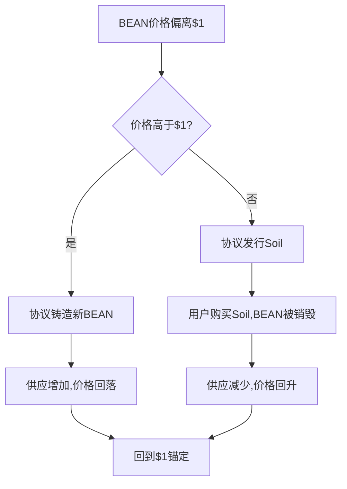
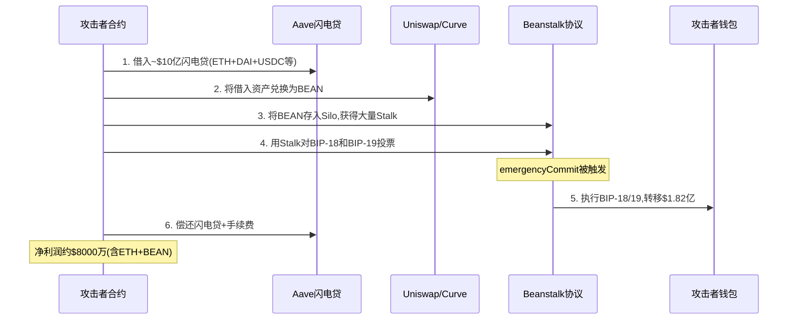
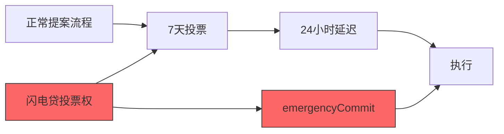
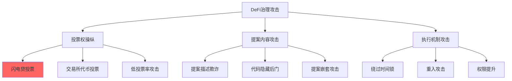

## 23.3 Beanstalk治理攻击（2022年）

2022年4月17日，去中心化稳定币协议Beanstalk遭受了一次精心策划的治理攻击。攻击者利用闪电贷在单笔交易中获取治理投票权，通过恶意提案将约1.82亿美元的协议资金转入自己控制的地址。这不是一次传统的智能合约漏洞利用——代码本身没有bug，而是治理机制的设计缺陷被巧妙地武器化了。这次攻击深刻地揭示了DeFi治理模型的根本性矛盾：去中心化决策的效率与安全性之间的博弈。

### 23.3.1 Beanstalk协议架构

#### 23.3.1.1 什么是Beanstalk

Beanstalk是一个基于以太坊的去中心化非抵押稳定币协议，目标是将BEAN代币的价格稳定锚定在1美元。与USDT、USDC等抵押型稳定币不同，Beanstalk采用纯算法调节机制——没有实物资产储备，完全依靠市场激励和套利机制维持价格稳定。

协议设计了一个三代币经济模型：

| 代币 | 角色 | 获取方式 |
|------|------|----------|
| BEAN | 稳定币，目标锚定$1 | 在Silo中存入资产铸造，或在市场交易 |
| Stalk | 治理代币，决定投票权 | 存入BEAN或LP代币获得，非流通 |
| Seeds | 收益代币，产生Stalk | 存入资产时附带获得，持续产出Stolk |

#### 23.3.1.2 核心机制：Silo与Field

Beanstalk的运转依赖两个核心组件：

**Silo（仓库）**是协议的资产存入池。用户将BEAN或BEAN LP代币存入Silo，获得Stalk和Seed。Stalk赋予持有者治理投票权，Seed则持续产出新的Stolk作为收益激励。这类似于银行存款：你存入本金（BEAN），获得利息（Stalk增长）和投票权（Stolk）。

**Field（农田）**是协议的债务融资市场。当BEAN价格低于1美元时，协议发行"土壤"（Soil），用户可以用ETH购买Soil，实际上是在向协议提供贷款。协议承诺在未来BEAN价格回到1美元以上时偿还贷款并支付利息。这构成了一种去中心化的债券机制。

#### 23.3.1.3 价格稳定算法

BEAN的锚定机制如下：



这种机制在正常市场条件下运作良好，但在极端情况下（如大规模抛售或本例中的治理攻击），算法无法抵御系统性风险。

#### 23.3.1.4 治理流程

Beanstalk的治理遵循标准的DAO模式：

1. **提案提交**：任何持有Stalk的用户都可以提交BIP（Beanstalk Improvement Proposal）
2. **投票期**：社区成员用Stalk投票，为期7天
3. **执行延迟**：通过的提案有一个24小时的等待期才能执行
4. **紧急通道**：emergencyCommit允许在紧急情况下跳过等待期

正常流程看起来安全——7天投票加上24小时延迟，给了社区充足的审查时间。但emergencyCommit的存在，以及它缺乏对"紧急"的严格定义，成了整个系统的阿喀琉斯之踵。

### 23.3.2 攻击全流程解析

#### 23.3.2.1 攻击者画像

攻击者（链上地址 `0x1c5dCdd006EA78a7E4783f9e6021C32935a10fb4`）在攻击前进行了精心准备。通过链上分析，安全研究者发现：

- 攻击者在攻击前数天提交了两个合法的治理提案（BIP-18和BIP-19），表面上看是正常的协议改进建议
- BIP-18声称是向乌克兰捐赠人道主义援助资金
- BIP-19实际上是将协议储备资金转移到攻击者地址
- 这两个提案在投票期前被提交，等待投票通过

#### 23.3.2.2 攻击时间线

```text
2022-04-16  攻击者提交BIP-18和BIP-19提案
2022-04-17 06:24:12 UTC  攻击交易发起
2022-04-17 06:24:35 UTC  攻击完成，资金转移
                   全程仅23秒（一个区块内完成）
```

#### 23.3.2.3 技术攻击步骤详解

攻击的核心流程可以分为六个阶段，全部在一个原子交易中完成：



**第一步：闪电贷借入资金**

攻击者通过Aave V2的闪电贷功能，在单笔交易中借入了约10亿美元的资产，包括ETH、DAI、USDC、USDT等。闪电贷的特点是：同一区块内借入和归还，无需抵押。这一步本身没有任何成本，只需要支付极低的闪电贷手续费（通常为0.09%）。

```solidity
// 闪电贷调用伪代码
function executeOperation(
    address[] calldata assets,
    uint256[] calldata amounts,
    uint256[] calldata premiums,
    address initiator,
    bytes calldata params
) external override returns (bool) {
    // 此处执行攻击逻辑
    // ...

    // 偿还闪电贷
    for (uint i = 0; i < assets.length; i++) {
        IERC20(assets[i]).approve(addressLENDING_POOL, amounts[i] + premiums[i]);
    }
    return true;
}
```

**第二步：资产转换与Stalk获取**

借入的资产被分批通过Uniswap和Curve等DEX兑换为BEAN代币。然后将BEAN存入Beanstalk的Silo，获得对应的Stalk治理代币。由于存入金额巨大，攻击者瞬间成为协议中最大的Stalk持有者，拥有了压倒性的投票权。

关键点在于：Stalk的获取不需要时间锁定。你今天存入BEAN，今天就获得完整的投票权。这意味着闪电贷获得的资金可以立即参与治理决策。

**第三步：提交并投票通过恶意提案**

攻击者在攻击前已经提交了两个提案：

- **BIP-18**：提案内容表面看起来是合法的——向乌克兰地址捐赠25万BEAN用于人道主义援助。这个提案实际上是一个"特洛伊木马"，让社区放松警惕。
- **BIP-19**：提案要求将协议的Silo资产（包括大量BEAN和LP代币）转移到攻击者控制的地址。提案的描述文字做了伪装，看起来像是协议改进。

在获得压倒性投票权后，攻击者立即对两个提案投了赞成票。由于他持有超过67%的投票权（闪电贷获得的），提案轻松通过法定人数门槛。

**第四步：触发emergencyCommit**

这是整个攻击链中最关键的一环。正常情况下，提案通过后需要等待24小时才能执行。但Beanstalk的emergencyCommit机制允许在"紧急情况"下立即执行提案。

```solidity
// Beanstalk治理合约中的emergencyCommit逻辑（简化）
function emergencyCommit(address target, bytes calldata data) external {
    require(googlerAddress == msg.sender, "Not a Googler");
    // 或者通过emergency DAO vote触发
    (bool success, ) = target.call(data);
    require(success, "Emergency commit failed");
}
```

问题在于：emergencyCommit的触发条件不够严格。攻击者利用闪电贷获得的投票权，不仅通过了恶意提案，还绕过了24小时执行延迟。

**第五步：资金转移**

恶意提案执行后，Silo中的资产被转移到攻击者预先设置的地址。转移的资产包括：

| 资产类型 | 估计价值 |
|----------|----------|
| BEAN | ~3600万枚 |
| BEAN3CRV LP | 大量 |
| BEANLUSD LP | 大量 |
| 其他协议资产 | 若干 |
| **总计** | **约$1.82亿** |

**第六步：偿还闪电贷并转移资金**

攻击者在同一个交易中偿还了Aave的闪电贷（约$10亿本金+约$900万手续费），净利润约$8000万（以ETH和BEAN形式）。随后，攻击者通过Tornado Cash混币器转移了部分ETH，试图切断资金追踪链。

### 23.3.3 漏洞根因深度分析

这次攻击不是一个简单的代码bug，而是多层设计缺陷的叠加效应。下面从四个维度剖析漏洞根因。

#### 23.3.3.1 治理机制设计缺陷：闪电贷与投票权的矛盾

最根本的问题是：**即时获得的投票权等同于历史积累的投票权**。

在现实世界的政治体系中，投票权通常与公民身份、居住时间等挂钩。你不能在选举当天才搬到一个地方就获得投票权。但Beanstalk的治理模型中，你今天存入资金，今天就能投票——而且金额不受限制。

闪电贷将这个问题放大了几个数量级。原本攻击者需要真实的$10亿资金才能获得足够的投票权，但闪电贷让攻击者可以在零成本的情况下临时借用这笔资金。治理系统没有区分"真实长期持有者"和"临时借用者"。

**核心矛盾**：去治理的"去中心化"理念要求任何人都能参与投票，但安全性要求投票权必须与利益绑定（只有长期持有者才有动力做出有利于协议的决策）。闪电贷完全打破了这种利益绑定。

#### 23.3.3.2 时间锁机制的致命缺口

Beanstalk的治理流程设计了两道时间防线：

1. **7天投票期**：社区有时间审查提案
2. **24小时执行延迟**：通过后还有24小时窗口

看起来合理，但emergencyCommit机制在紧急情况下可以绕过这两道防线。设计者的本意是：当协议面临紧急威胁时（如价格脱锚、资金被锁定），需要快速响应。但"紧急"的定义过于模糊，且emergencyCommit的触发机制可以通过治理投票来调用——这就形成了逻辑闭环：**用治理投票来绕过治理流程**。



#### 23.3.3.3 Quorum（法定人数）门槛过低

Beanstalk的提案通过条件中，法定人数（quorum）门槛设置过低。在正常情况下，这不会构成问题——因为大量Stalk分散在众多持有者手中，单个实体很难获得足够的投票权。但在闪电贷场景下，攻击者可以临时获得超过流通量50%的Stalk，轻松突破任何合理的quorum门槛。

实际上，攻击者在投票中获得了约78%的赞成票——这不是因为社区同意了他的提案，而是因为闪电贷赋予了他压倒性的投票权。正常社区成员根本来不及反应，提案就已经通过了。

#### 23.3.3.4 提案内容审查缺失

链上治理的一个根本性挑战是：**提案的链上执行逻辑与链下描述文字没有强制关联**。提案可能在描述中声称是"捐赠给乌克兰"，但实际执行的代码可能是"将所有资金转移到攻击者地址"。

Beanstalk的治理合约只验证投票是否通过，不验证提案内容是否与描述一致。这要求社区成员在投票前亲自审查提案的底层合约代码——但这在实践中很难做到，因为大多数治理参与者不具备审查Solidity代码的能力。

### 23.3.4 攻击的经济学分析

#### 23.3.4.1 攻击成本与收益

| 项目 | 金额 |
|------|------|
| 闪电贷本金 | ~$10亿（同区块归还，无实际成本） |
| 闪电贷手续费（0.09%） | ~$900万 |
| Gas费用 | ~$10万（以太坊主网） |
| **总成本** | **~$910万** |
| **窃取资金** | **~$1.82亿** |
| **净利润** | **~$1.73亿** |
| **成本利润率** | **约19倍** |

从纯经济角度看，这次攻击的ROI极高。但攻击者也面临风险：如果社区在24小时延迟期内发现问题并采取紧急措施（如合约暂停），攻击可能功亏一篑。emergencyCommit机制反而"帮"了攻击者——它移除了这最后的安全网。

#### 23.3.4.2 资金流向追踪

攻击后的资金流向：

```text
攻击合约
  ├── 15,304 ETH → Tornado Cash（混币，追踪困难）
  ├── 36,000,000 BEAN → 部分通过Uniswap兑换为ETH
  ├── 其他LP代币 → 在各DEX抛售
  └── 最终 → 通过Tornado Cash和跨链桥转移
```

Beanstalk社区随后通过FBI介入追踪资金。2022年12月，执法部门逮捕了两名嫌疑人——这也是链上犯罪可被追溯的有力证明。

### 23.3.5 漏洞复现：代码级分析

#### 23.3.5.1 漏洞治理合约代码片段

以下是Beanstalk治理合约中与本次攻击相关的核心逻辑（简化说明版本）：

```solidity
contract BeanstalkGovernance {
    mapping(address => uint256) public stalkBalance;
    uint256 public totalStalk;
    uint256 public votingPeriod = 7 days;
    uint256 public executionDelay = 1 days;
    
    // 漏洞点1：投票权基于当前持仓，而非历史快照
    function getVotingPower(address voter) public view returns (uint256) {
        return stalkBalance[voter];  // 实时余额，可通过闪电贷临时膨胀
    }
    
    // 漏洞点2：提案通过后可以通过emergencyCommit立即执行
    function emergencyExecute(uint256 proposalId) external {
        require(
            proposals[proposalId].forVotes > totalStalk * 2 / 3,
            "Need 2/3 majority"
        );
        // 直接执行，跳过executionDelay
        _executeProposal(proposalId);
    }
    
    // 正常执行路径（有延迟）
    function executeProposal(uint256 proposalId) external {
        require(
            proposals[proposalId].endBlock < block.number,
            "Voting not ended"
        );
        require(
            block.timestamp > proposals[proposalId].endTime + executionDelay,
            "Execution delay not passed"
        );
        _executeProposal(proposalId);
    }
}
```

#### 23.3.5.2 闪电贷投票攻击的最小复现示例

以下是一个概念性的攻击合约结构（仅用于教学目的）：

```solidity
// SPDX-License-Identifier: MIT
pragma solidity ^0.8.0;

import "./interfaces/IFlashLoanReceiver.sol";
import "./interfaces/IBeanstalk.sol";

contract GovernanceAttack is IFlashLoanReceiver {
    address public attacker;
    IBeanstalk public beanstalk;
    
    constructor(address _beanstalk) {
        attacker = msg.sender;
        beanstalk = IBeanstalk(_beanstalk);
    }
    
    // 攻击入口
    function executeAttack() external {
        require(msg.sender == attacker, "Not authorized");
        
        // Step 1: 请求闪电贷
        // 此时合约收到大量资产，进入executeOperation回调
        
        // Step 5: 攻击完成后，将资金转给攻击者
        // (在executeOperation内部已完成)
    }
    
    // Aave闪电贷回调
    function executeOperation(
        address[] calldata assets,
        uint256[] calldata amounts,
        uint256[] calldata premiums,
        address, /* initiator */
        bytes calldata /* params */
    ) external override returns (bool) {
        // Step 2: 将借入资产转换为BEAN
        _swapToBean(assets, amounts);
        
        // Step 3: 存入Silo获得Stalk
        uint256 stalkGained = beanstalk.deposit();
        
        // Step 4: 对恶意提案投票
        // votingPower现在是压倒性的
        beanstalk.voteForProposal(maliciousProposalId, stalkGained);
        
        // Step 4.5: 触发emergencyExecute
        beanstalk.emergencyExecute(maliciousProposalId);
        
        // 资金已通过恶意提案转移到本合约
        
        // Step 6: 偿还闪电贷
        for (uint i = 0; i < assets.length; i++) {
            IERC20(assets[i]).approve(
                address(LENDING_POOL), 
                amounts[i] + premiums[i]
            );
        }
        
        // 将利润转给攻击者
        _transferProfitToAttacker();
        
        return true;
    }
    
    function _swapToBean(address[] calldata, uint256[] calldata) internal {
        // 通过DEX将各种资产兑换为BEAN
    }
    
    function _transferProfitToAttacker() internal {
        // 转移利润
    }
}
```

### 23.3.6 对比：其他治理攻击案例

Beanstalk不是第一个，也不是最后一个治理攻击。以下是与同类攻击的对比：

| 特征 | Beanstalk (2022) | Steemit/Hive (2020) | Build Finance (2022) | Tornado Cash (2023) |
|------|------------------|---------------------|----------------------|---------------------|
| 攻击金额 | $1.82亿 | N/A（控制权） | $47万 | N/A（治理接管） |
| 攻击手法 | 闪电贷+治理投票 | 交易所代币投票 | 零售持仓投票 | 恶意提案控制 |
| 利用闪电贷 | 是 | 否 | 否 | 否 |
| 时间窗口 | 单笔交易 | 多日 | 多日 | 数日 |
| 资金追回 | 部分（FBI介入） | 链回滚 | 无 | 无 |
| 根本原因 | 投票权即时获取 | 交易所代币可投票 | 投票率过低 | 提案描述欺诈 |

Steemit事件中，Justin Sun通过交易所（Binance、Huobi、Poloniex）获得了大量STEEM代币，用于投票控制社区。社区的回应是硬分叉创建Hive链。这个案例说明：治理攻击的形式多样，不仅仅是闪电贷。

Build Finance DAO的攻击更为"文明"——攻击者通过持续积累代币，在投票率极低的提案中获得了多数票。这说明即使没有闪电贷，低投票率也是治理安全的威胁。

### 23.3.7 防御方案详解

#### 23.3.7.1 投票权时间加权（Time-Weighted Voting）

这是防御闪电贷治理攻击的最核心方案。核心思想：投票权与持仓时间成正比，持仓越久投票权越大。

```solidity
contract TimeWeightedVoting {
    struct VotingPower {
        uint256 balance;
        uint256 lastUpdateTime;
        uint256 accumulatedPower;
    }
    
    mapping(address => VotingPower) public voters;
    uint256 public constant POWER_ACCUMULATION_RATE = 1; // 每秒积累1单位
    
    // 每次存入时记录时间戳
    function deposit(uint256 amount) external {
        _updateVotingPower(msg.sender);
        voters[msg.sender].balance += amount;
        voters[msg.sender].lastUpdateTime = block.timestamp;
    }
    
    // 计算当前投票权 = 余额 × 持仓时间
    function getVotingPower(address voter) public view returns (uint256) {
        VotingPower storage v = voters[voter];
        uint256 timeHeld = block.timestamp - v.lastUpdateTime;
        return v.accumulatedPower + (v.balance * timeHeld * POWER_ACCUMULATION_RATE);
    }
    
    function _updateVotingPower(address voter) internal {
        VotingPower storage v = voters[voter];
        uint256 timeHeld = block.timestamp - v.lastUpdateTime;
        v.accumulatedPower += v.balance * timeHeld * POWER_ACCUMULATION_RATE;
        v.lastUpdateTime = block.timestamp;
    }
}
```

这个方案的变体包括：

- **线性增长**：持仓时间越长，投票权线性增长（上例）
- **对数增长**：前期增长快，后期趋缓（更适合鼓励早期参与）
- **阶梯式**：持仓30天获得50%投票权，90天获得100%（简单易懂）

#### 23.3.7.2 快照投票权（Snapshot Voting）

在提案创建时记录所有地址的Stalk余额快照，投票权基于快照时的持仓，而非投票时的持仓。

```solidity
contract SnapshotVoting {
    // proposalId => (address => snapshot balance)
    mapping(uint256 => mapping(address => uint256)) public snapshotBalances;
    
    function createProposal(string calldata description) external returns (uint256) {
        uint256 proposalId = nextProposalId++;
        
        // 在提案创建时记录所有余额快照
        // 实际实现中通常使用ERC20Snapshot或类似机制
        
        proposals[proposalId] = Proposal({
            description: description,
            startTime: block.timestamp,
            endTime: block.timestamp + votingPeriod,
            snapshotBlock: block.number  // 记录快照区块
        });
        
        return proposalId;
    }
    
    function getVotingPower(uint256 proposalId, address voter) 
        public view returns (uint256) 
    {
        // 返回快照时的余额，而非当前余额
        return _getBalanceAtBlock(voter, proposals[proposalId].snapshotBlock);
    }
}
```

#### 23.3.7.3 提案执行延迟的硬性保障

移除所有绕过执行延迟的机制，或至少要求极高的门槛：

```solidity
contract SecureGovernance {
    uint256 public constant EXECUTION_DELAY = 2 days;
    uint256 public constant EMERGENCY_DELAY = 4 hours;  // 紧急情况的最短延迟
    
    // emergencyExecute仍然存在，但有最短延迟
    function emergencyExecute(uint256 proposalId) external {
        require(
            proposals[proposalId].forVotes > totalVotingPower * 9 / 10, // 需要90%赞成
            "Emergency requires 90% approval"
        );
        require(
            block.timestamp > proposals[proposalId].endTime + EMERGENCY_DELAY,
            "Even emergency has minimum delay"
        );
        
        _executeProposal(proposalId);
    }
    
    // 正常执行需要完整延迟
    function executeProposal(uint256 proposalId) external {
        require(
            block.timestamp > proposals[proposalId].endTime + EXECUTION_DELAY,
            "Full delay not passed"
        );
        _executeProposal(proposalId);
    }
}
```

#### 23.3.7.4 提案金额分级审批

不同金额的提案需要不同的投票门槛和时间要求：

```solidity
contract TieredGovernance {
    struct TierConfig {
        uint256 quorumPercent;    // 法定人数百分比
        uint256 approvalPercent;  // 赞成票百分比
        uint256 votingPeriod;     // 投票期
        uint256 executionDelay;   // 执行延迟
    }
    
    // 分级配置
    TierConfig public constant TIER_1 = TierConfig(10, 50, 3 days, 1 days);   // <$10K
    TierConfig public constant TIER_2 = TierConfig(20, 60, 5 days, 2 days);   // $10K-$100K
    TierConfig public constant TIER_3 = TierConfig(30, 67, 7 days, 3 days);   // $100K-$1M
    TierConfig public constant TIER_4 = TierConfig(40, 75, 14 days, 7 days);  // >$1M
    
    function getTier(uint256 amount) public pure returns (TierConfig memory) {
        if (amount < 10_000e18) return TIER_1;
        if (amount < 100_000e18) return TIER_2;
        if (amount < 1_000_000e18) return TIER_3;
        return TIER_4;
    }
}
```

#### 23.3.7.5 综合防御矩阵

| 防御措施 | 防御效果 | 实现难度 | Gas成本增加 | 用户体验影响 |
|----------|----------|----------|-------------|-------------|
| 时间加权投票 | ★★★★★ | 中 | 低 | 中（新用户延迟获得投票权） |
| 快照投票 | ★★★★★ | 中 | 中 | 低 |
| 移除emergencyExecute | ★★★★ | 低 | 无 | 低（紧急响应变慢） |
| 分级审批 | ★★★★ | 中 | 低 | 低 |
| 提案冷却期 | ★★★ | 低 | 无 | 低（无法快速提交新提案） |
| 多重签名审批 | ★★★★★ | 高 | 高 | 高（中心化风险） |
| 治理代币时间锁定 | ★★★★ | 低 | 无 | 中（取款需等待） |

最佳实践是组合使用多种防御措施：时间加权投票（主防线）+ 快照投票（辅助防线）+ 分级审批（资金安全）+ 最短执行延迟（时间安全）。

### 23.3.8 Beanstalk的后续与重建

#### 23.3.8.1 协议重启

攻击发生后，Beanstalk团队并未放弃项目。他们进行了以下重建工作：

1. **治理机制重构**：完全重新设计了治理流程，引入时间加权投票和执行延迟
2. **安全审计**：聘请多家安全公司（包括Trail of Bits和Code4rena）进行全面审计
3. **社区资金恢复**：通过新的代币经济模型逐步恢复社区资金
4. **法律途径**：配合执法部门追踪攻击者

2022年12月，两名攻击者被美国FBI逮捕，面临电信欺诈和洗钱指控。这证明了即使在DeFi的匿名世界中，犯罪行为仍然有被追诉的风险。

#### 23.3.8.2 攻击者落网

2022年8月，美国司法部宣布逮捕了与Beanstalk攻击相关的两名嫌疑人。调查过程中，执法机构通过以下手段追踪到攻击者：

- **Tornado Cash并非万能**：尽管使用了混币器，但进出金额和时间模式可以被统计分析
- **交易所KYC**：部分资金最终流入了有KYC要求的交易所
- **IP地址追踪**：攻击者在某些环节暴露了真实IP
- **链上分析工具**：Chainalysis等工具可以追踪复杂的资金流向

### 23.3.9 对DeFi治理的系统性思考

#### 23.3.9.1 治理攻击的分类学

Beanstalk事件属于"闪电贷治理攻击"类别，但从更宏观的视角看，DeFi治理攻击可以分为以下几类：



#### 23.3.9.2 治理安全的"不可能三角"

DeFi治理面临一个类似于区块链三难困境的"不可能三角"：

1. **去中心化**：任何人都能参与治理决策
2. **效率**：治理决策能够快速响应市场变化
3. **安全性**：治理机制能够抵御各种攻击

Beanstalk的emergencyCommit机制试图同时满足效率和安全性，但在去中心化的前提下，这种设计必然存在漏洞。真正的解决方案需要在三者之间做出明确的取舍。

#### 23.3.9.3 链上治理 vs 链下治理

这次攻击也引发了对链上治理与链下治理孰优孰劣的讨论：

| 维度 | 链上治理 | 链下治理 |
|------|----------|----------|
| 执行方式 | 自动执行，无需信任 | 需要信任执行方 |
| 审查能力 | 代码审查（困难） | 人工审查（灵活） |
| 响应速度 | 可以很快（emergencyCommit） | 受限于人工流程 |
| 攻击面 | 合约漏洞、闪电贷 | 社交工程、内部腐败 |
| 透明度 | 完全透明（链上可查） | 部分透明 |

许多协议采用混合模式：链下讨论和提案筛选 + 链上投票和执行。这种模式在效率和安全性之间取得了较好的平衡。

### 23.3.10 开发者检查清单

在设计或审计DeFi治理系统时，请逐项检查以下要点：

- [ ] **投票权是否基于历史持仓**：投票权应与持仓时间挂钩，或基于快照余额
- [ ] **是否支持闪电贷投票**：确认闪电贷获取的代币不能立即参与投票
- [ ] **是否有执行延迟**：提案通过后应有24-72小时的执行延迟
- [ ] **是否有绕过延迟的机制**：如果存在emergencyCommit，确保其触发条件极其严格
- [ ] **法定人数门槛是否合理**：根据协议TVL设定合理的quorum，避免低投票率攻击
- [ ] **提案内容是否可验证**：链上执行逻辑是否与提案描述一致
- [ ] **是否有多重签名保护**：大额资金转移需要多重签名审批
- [ ] **是否有提案冷却期**：避免短时间内大量提案淹没社区
- [ ] **是否有升级机制的安全保障**：合约升级是否需要时间锁和多签
- [ ] **是否进行过治理攻击模拟**：在测试网上模拟各种治理攻击场景

### 23.3.11 延伸阅读

- [Beanstalk官方事后分析报告](https://bean.money/governance/beanstalk-post-mortem-04.22.pdf)
- [OpenZeppelin: 治理攻击防御指南](https://blog.openzeppelin.com/protect-your-governance-from-flash-loan-attacks)
- [Flashbots: 闪电贷治理攻击研究](https://writings.flashbots.net/)
- [a]16z: 加密治理研究](https://a16zcrypto.com/)
- [Compound治理安全改进提案](https://www.comp.xyz/)

---

> **本章小结**：Beanstalk治理攻击是DeFi历史上最具教学意义的安全事件之一。它告诉我们，智能合约的安全性不仅取决于代码质量，更取决于机制设计的健壮性。闪电贷使原本安全的治理流程变得脆弱，emergencyCommit机制为攻击者打开了最后一道防线。防御治理攻击的核心原则是：**投票权必须与时间绑定，执行必须有不可绕过的延迟，紧急机制必须有不可逾越的门槛**。
