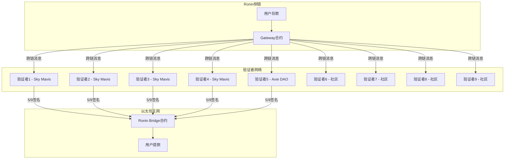

## 23.5 Ronin Bridge攻击（2022年）

Ronin Bridge攻击是加密货币历史上损失金额最大的安全事件之一，也是区块链安全领域最具警示意义的案例。这起事件并非源于智能合约代码漏洞，而是通过社会工程学和运营安全失败实现的——攻击者直接窃取了验证者的私钥，从而控制了跨链桥的资金转移权限。这一案例深刻揭示了"代码安全≠系统安全"的核心命题。

### 23.5.1 背景知识

#### 23.5.1.1 Axie Infinity与Ronin侧链

Axie Infinity是由越南游戏公司Sky Mavis开发的"边玩边赚"（Play-to-Earn）区块链游戏，玩家通过繁殖、战斗和交易虚拟宠物Axie来赚取SLP（Smooth Love Potion）代币。2021年，Axie Infinity在菲律宾、委内瑞拉等发展中国家爆火，日活跃用户一度超过270万，单月收入超过3亿美元，成为区块链游戏的标杆项目。

然而，以太坊主网的高Gas费和低吞吐量严重制约了游戏体验。一个简单的Axie交易可能需要支付数十美元的手续费，这对游戏经济系统是不可接受的。为了解决这个问题，Sky Mavis于2021年2月推出了Ronin——一条专门为Axie Infinity设计的以太坊侧链（Ethereum Sidechain）。

Ronin采用权威证明（Proof of Authority，PoA）共识机制，由一组预选的验证者节点负责区块生产和交易验证。这种设计牺牲了去中心化程度，但换来了低费用和高吞吐量，更适合游戏场景。

#### 23.5.1.2 Ronin Bridge跨链桥架构

Ronin Bridge是连接Ronin侧链和以太坊主网的跨链桥，允许用户将资产在两条链之间转移。其核心设计如下：

- **验证者数量**：9个独立验证者节点
- **签名阈值**：需要至少5个验证者签名才能批准跨链转账
- **验证者组成**：
  - Sky Mavis团队控制4个验证者节点
  - Axie DAO（去中心化自治组织）控制1个验证者节点
  - 其余4个由社区/合作伙伴控制



**设计缺陷分析**：

从表面上看，5/9的签名阈值是合理的——攻击者需要控制超过半数的验证者才能作恶。但实际部署中存在严重的中心化问题：

| 问题 | 详情 |
|------|------|
| 单一实体控制过多节点 | Sky Mavis控制4/9的验证者，接近半数 |
| 节点密钥管理分散不足 | 多个节点的私钥可能在相近的环境/人员范围内 |
| 信任假设过于乐观 | 假设验证者不会被同时攻破 |
| 缺乏异常检测机制 | 大额提款没有触发风控警报 |

### 23.5.2 攻击全过程还原

#### 23.5.2.1 攻击者身份：朝鲜Lazarus组织

2022年4月14日，美国财政部外国资产控制办公室（OFAC）将Ronin Bridge攻击的以太坊地址列入制裁名单，正式确认攻击者为朝鲜国家级黑客组织Lazarus Group（又称APT38、HIDDEN COBRA）。

Lazarus组织简介：

| 属性 | 详情 |
|------|------|
| 归属 | 朝鲜侦察总局（RGB）下属的121局 |
| 成立时间 | 约2009年 |
| 主要活动 | 网络间谍、金融盗窃、勒索软件 |
| 重大事件 | 2014年索尼影业攻击、2016年孟加拉国央行盗窃、2017年WannaCry勒索软件 |
| 加密货币攻击 | 已累计窃取超过30亿美元的加密货币 |

Lazarus组织对加密货币领域的攻击呈现出高度专业化的特征：
- 深入研究目标项目的架构和人员
- 使用复杂的社会工程学技术
- 能够长时间潜伏而不被发现
- 拥有先进的洗钱技术（混币器、链上跳转）

#### 23.5.2.2 第一阶段：社会工程学渗透

**时间**：2021年11月至2022年3月

Lazarus组织对Sky Mavis员工实施了精心策划的社会工程学攻击。根据事后调查，攻击过程如下：

1. **信息收集**：攻击者通过LinkedIn等职业社交平台识别Sky Mavis的关键员工，特别是那些能够接触验证者私钥或有权限部署合约的人员。

2. **建立接触**：攻击者冒充招聘人员或合作伙伴，通过LinkedIn向目标员工发送消息，声称有一个高薪职位机会。这种方式在加密货币行业非常常见，不会引起警觉。

3. **诱导执行恶意文件**：在多次沟通后，攻击者发送了一份伪装成"公司简介"或"职位说明"的PDF文件。当员工打开这个PDF时，其中嵌入的恶意代码被执行，攻击者获得了该员工电脑的远程访问权限。

4. **横向移动**：通过被感染的员工电脑，攻击者在Sky Mavis的内部网络中进行横向移动，逐步获取更高权限的访问。

5. **密钥窃取**：最终，攻击者获取了Sky Mavis控制的4个Ronin验证者节点的私钥。同时，还获取了Axie DAO的1个验证者私钥——这是因为Sky Mavis在2021年11月曾临时获得Axie DAO验证者的签名权限，用于帮助处理大量积压的交易请求，但后来未及时撤销该权限。

```text
时间线：
2021.11 - Sky Mavis获得Axie DAO验证者的临时签名权限
2021.11 - Lazarus开始社会工程学攻击
2022.01 - 攻击者感染员工电脑，开始横向移动
2022.02 - 攻击者获取多个验证者私钥
2022.03.23 - 攻击者完成所有准备，等待时机
```

#### 23.5.2.3 第二阶段：资金窃取

**时间**：2022年3月23日（UTC时间）

攻击者使用窃取的5个验证者私钥（Sky Mavis的4个 + Axie DAO的1个），签署了两笔恶意提款交易：

**第一笔交易**：
- 提取金额：173,600 ETH（约5.93亿美元）
- 交易哈希：0xc28fad5e8d5e0ce6a2eaf67b6afbbea9c7183a12601510bfac012b6da7e1c37c
- 时间：2022-03-23 01:06:25 UTC

**第二笔交易**：
- 提取金额：25,500,000 USDC
- 交易哈希：0x855810b4255646e476f586b15b30b4e80119c358067f1e07e1b2ab2b27d1c7c7
- 时间：2022-03-23 01:11:44 UTC

```solidity
// 伪代码：攻击者提交的提款请求
function withdraw(
    bytes32[] calldata signatures,  // 5个有效签名
    address token,
    uint256 amount
) external {
    // 验证签名数量 >= 5
    require(signatures.length >= threshold, "Not enough signatures");
    
    // 验证每个签名来自授权的验证者
    for (uint i = 0; i < signatures.length; i++) {
        address signer = recoverSigner(signatures[i]);
        require(isValidator[signer], "Invalid validator");
    }
    
    // 签名验证通过，执行提款
    // 此时合约无法区分"合法验证者签署的合法交易"
    // 和"被盗私钥签署的恶意交易"
    _transfer(token, msg.sender, amount);
}
```

**关键观察**：Bridge合约的代码本身没有漏洞。它正确地验证了签名数量和签名者身份。问题在于：验证者的私钥已经被攻击者控制，合约无法区分"合法验证者签署的合法交易"和"被盗私钥签署的恶意交易"。

#### 23.5.2.4 第三阶段：资金转移与洗钱

攻击发生后，被盗资金经历了复杂的链上转移和混币过程：

1. **初始转移**：资金从Bridge合约转移到攻击者控制的地址
2. **分散转移**：将大额资金拆分为多笔小额交易
3. **混币处理**：通过Tornado Cash等混币器进行资金混淆
4. **跨链转移**：通过跨链桥将资金转移到其他区块链
5. **法币变现**：通过各种交易所将加密货币兑换为法币

```text
资金流向简图：
Bridge合约 (173,600 ETH + 25.5M USDC)
    ↓
攻击者地址 0x098B6e...6be6f
    ↓
多个中间地址（分散）
    ↓
Tornado Cash（混币）
    ↓
多个新地址（去关联化）
    ↓
各种交易所（变现）
```

**延迟发现的原因**：

最令人震惊的是，这次攻击在发生6天后才被发现。2022年3月29日，当一名用户尝试通过Bridge提取5,000 ETH时，交易失败，这才引起了Sky Mavis的注意。为什么6天都没人发现？

- Bridge合约没有自动化的异常检测机制
- 大额提款没有触发任何警报
- 没有专门的安全团队实时监控Bridge的活动
- 验证者节点的运行状态缺乏实时监控

### 23.5.3 损失与影响

#### 23.5.3.1 直接经济损失

| 资产 | 数量 | 攻击时价格 | 说明 |
|------|------|-----------|------|
| ETH | 173,600枚 | ~$593M | 以太坊原生代币 |
| USDC | 25,500,000枚 | $25.5M | 美元稳定币 |
| **总计** | - | **~$618.5M** | 按当时价格计算 |

注：不同报道中提到的"6.25亿美元"是基于ETH价格波动的近似值。实际损失金额根据计算时点不同略有差异。

#### 23.5.3.2 生态系统影响

**对Axie Infinity玩家的影响**：
- 数百万玩家的资产被锁定在Ronin侧链上，无法提取
- 游戏经济系统遭受重创，SLP和AXS代币价格暴跌
- 大量玩家，特别是发展中国家依赖游戏收入的玩家，遭受严重经济损失

**对行业的影响**：
- 加密货币市场信心受到打击
- 监管机构加强对跨链桥的审查
- 跨链桥安全成为行业焦点议题
- 推动了跨链桥安全标准和最佳实践的制定

### 23.5.4 善后处理与恢复

#### 23.5.4.1 Sky Mavis的应对措施

1. **暂停Bridge运营**：发现攻击后立即暂停Ronin Bridge的所有提款操作

2. **配合调查**：与Chainalysis、CrowdStrike等安全公司合作追踪被盗资金

3. **补偿用户**：
   - Sky Mavis筹集了约2亿美元资金用于补偿受影响的用户
   - 部分资金来自Binance、Animoca Brands等投资者的融资
   - 剩余资金通过公司自有资产补充

4. **重建验证者网络**：
   - 将验证者数量从9个增加到21个
   - 重新设计验证者准入机制
   - 引入独立的第三方验证者

5. **升级Bridge合约**：
   - 部署新的Bridge合约，增加安全机制
   - 实施大额提款延迟机制
   - 添加异常检测和警报系统

6. **2022年6月28日**：Ronin Bridge重新上线，采用新的安全架构

#### 23.5.4.2 资金追回情况

截至目前，仅追回了约3,000万美元的被盗资金（约占总损失的0.5%）。大部分资金已被Lazarus组织通过复杂的洗钱网络转移，难以追踪和追回。

### 23.5.5 深度技术分析

#### 23.5.5.1 攻击向量分析

Ronin Bridge攻击的独特之处在于，它不是针对智能合约代码的攻击，而是针对运营层面的攻击。这揭示了区块链安全的一个重要盲区：

| 攻击类型 | 传统关注点 | Ronin案例 |
|----------|-----------|-----------|
| 智能合约漏洞 | 重入攻击、整数溢出、访问控制 | 无 |
| 密钥管理漏洞 | 私钥存储、生成、备份 | **核心攻击向量** |
| 运营安全漏洞 | 权限管理、监控、审计 | **核心攻击向量** |
| 社会工程学 | 钓鱼、伪装、诱导 | **核心攻击向量** |

#### 23.5.5.2 PoA共识的固有风险

Ronin采用的权威证明（PoA）共识机制在本案例中暴露了严重问题：

1. **中心化风险**：PoA依赖于少数验证者的诚实性，一旦这些验证者被攻破，整个系统即沦陷

2. **信任假设失败**：PoA假设验证者是可信的，但忽略了验证者本身可能被攻击的可能性

3. **缺乏去中心化保护**：与PoW或PoS不同，PoA没有经济激励机制来保证验证者的诚实行为

```text
PoA vs PoS 安全模型对比：

PoA (Ronin)：
  安全性 = 验证者数量 × 验证者独立性
  攻击成本 = 获取多数验证者私钥的成本
  
PoS (以太坊2.0)：
  安全性 = 质押代币总量 × 经济惩罚机制
  攻击成本 = 获取51%质押代币的成本 + 被罚没的风险
```

#### 23.5.5.3 跨链桥安全的系统性问题

Ronin Bridge攻击是2022年跨链桥攻击潮的一部分。同年发生的其他重大跨链桥攻击包括：

| 项目 | 损失金额 | 攻击方式 |
|------|---------|---------|
| Wormhole | $326M | 智能合约漏洞 |
| Nomad Bridge | $190M | 验证逻辑漏洞 |
| Harmony Horizon | $100M | 密钥泄露 |
| Ronin Bridge | $625M | 密钥泄露+社工 |

跨链桥成为攻击焦点的原因：

1. **高价值目标**：跨链桥持有大量锁定资产，是"蜜罐"
2. **复杂性**：涉及多条链的交互，攻击面大
3. **新兴领域**：安全实践和审计标准尚未成熟
4. **信任模型复杂**：需要在去中心化和效率之间权衡

### 23.5.6 关键教训与防御建议

#### 23.5.6.1 密钥管理最佳实践

**硬件安全模块（HSM）的必要性**：

验证者的私钥必须存储在硬件安全模块中，而不是软件钱包或普通服务器。HSM提供：
- 物理隔离：私钥永不离开硬件设备
- 防篡改：任何物理入侵尝试都会触发密钥销毁
- 访问控制：严格的权限管理和审计日志
- 合规性：满足金融级安全标准（FIPS 140-2 Level 3）

```solidity
// 不安全的做法（Ronin原始设计）
// 私钥存储在内存或文件系统中
function signTransaction(bytes32 hash) external returns (bytes memory) {
    // 直接使用私钥签名
    return ECDSA.sign(privateKey, hash);  // 私钥可能被窃取
}

// 安全的做法
// 私钥存储在HSM中，通过安全接口调用
function signTransaction(bytes32 hash) external returns (bytes memory) {
    // 请求HSM执行签名操作，私钥不离开硬件
    return hsm.sign(keyId, hash);  // 私钥始终在HSM内部
}
```

**密钥分散存储原则**：

- 不同验证者的私钥必须存储在不同的物理位置
- 私钥的备份必须采用Shamir秘密分享方案（SSS），分片存储
- 任何单一人员不应能够访问多个验证者的私钥
- 定期轮换密钥，减少泄露窗口

#### 23.5.6.2 验证者网络设计

**去中心化原则**：

```text
理想状态：
- 验证者数量 >= 21（拜占庭容错）
- 单一实体控制的验证者比例 < 33%
- 验证者分布在不同的：
  * 地理位置（不同国家/大洲）
  * 组织实体（独立公司/DAO）
  * 技术栈（不同操作系统/硬件）
  * 网络环境（不同云服务商/数据中心）
```

**验证者准入与退出机制**：

- 验证者必须通过严格的安全审计
- 建立验证者信誉评分系统
- 实施验证者质押机制，作恶时罚没质押
- 定期轮换验证者集合，防止长期合谋

#### 23.5.6.3 运营安全强化

**社会工程学防御**：

| 防御措施 | 实施方法 |
|----------|---------|
| 安全意识培训 | 定期进行钓鱼模拟演练，提高员工警惕性 |
| 最小权限原则 | 员工仅获得完成工作所需的最小权限 |
| 多因素认证 | 所有关键系统强制使用硬件安全密钥 |
| 代码审查 | 敏感操作需要多人审批 |
| 背景调查 | 对接触密钥的人员进行严格的背景调查 |

**异常检测系统**：

```python
# 伪代码：跨链桥异常检测系统
class BridgeAnomalyDetector:
    def __init__(self):
        self.withdrawal_history = []
        self.alert_thresholds = {
            'single_tx_max': 1000,  # 单笔最大提款量(ETH)
            'hourly_max': 10000,     # 每小时最大提款量
            'daily_max': 50000,      # 每日最大提款量
        }
    
    def check_withdrawal(self, amount, sender):
        # 检查单笔限额
        if amount > self.alert_thresholds['single_tx_max']:
            self.send_alert(f"大额提款: {amount} ETH")
            return False  # 拒绝交易
        
        # 检查小时限额
        hourly_total = self.get_hourly_total()
        if hourly_total + amount > self.alert_thresholds['hourly_max']:
            self.send_alert(f"小时累计超限: {hourly_total + amount} ETH")
            return False
        
        # 检查日限额
        daily_total = self.get_daily_total()
        if daily_total + amount > self.alert_thresholds['daily_max']:
            self.send_alert(f"日累计超限: {daily_total + amount} ETH")
            return False
        
        return True  # 允许交易
    
    def send_alert(self, message):
        # 发送警报到安全团队
        notify_security_team(message)
        log_to_monitoring(message)
```

#### 23.5.6.4 合约层安全机制

**提款延迟机制**：

对于大额提款，引入时间延迟，给安全团队反应时间：

```solidity
contract SecureBridge {
    uint256 constant DELAY_THRESHOLD = 1000 ether;
    uint256 constant DELAY_DURATION = 24 hours;
    
    mapping(bytes32 => uint256) public pendingWithdrawals;
    
    function initiateWithdrawal(
        address token,
        uint256 amount,
        bytes[] calldata signatures
    ) external {
        require(verifySignatures(signatures), "Invalid signatures");
        
        if (amount > DELAY_THRESHOLD) {
            // 大额提款需要延迟
            bytes32 withdrawalId = keccak256(abi.encode(token, amount, block.timestamp));
            pendingWithdrawals[withdrawalId] = block.timestamp + DELAY_DURATION;
            emit WithdrawalInitiated(withdrawalId, amount);
        } else {
            // 小额提款立即执行
            _executeWithdrawal(token, amount);
        }
    }
    
    function executeDelayedWithdrawal(bytes32 withdrawalId) external {
        require(pendingWithdrawals[withdrawalId] != 0, "No pending withdrawal");
        require(block.timestamp >= pendingWithdrawals[withdrawalId], "Delay not passed");
        
        // 执行提款
        delete pendingWithdrawals[withdrawalId];
        // ... 执行逻辑
    }
}
```

### 23.5.7 与其他跨链桥攻击的对比

| 对比维度 | Ronin Bridge | Wormhole | Harmony Horizon |
|----------|-------------|----------|-----------------|
| 损失金额 | $625M | $326M | $100M |
| 攻击类型 | 密钥泄露+社工 | 智能合约漏洞 | 密钥泄露 |
| 发现时间 | 6天后 | 几乎立即 | 2天后 |
| 攻击者身份 | 朝鲜Lazarus | 未知 | 朝鲜Lazarus |
| 资金追回 | 极少（<$30M） | Jump Crypto全额补偿 | 极少 |
| 根本原因 | 运营安全失败 | 代码审计不足 | 密钥管理不当 |

**共同点**：
1. 跨链桥持有大量锁定资产，是高价值目标
2. 安全机制不足以应对国家级攻击者
3. 发现和响应机制存在延迟

**差异点**：
1. Ronin和Harmony是运营层面的问题，Wormhole是技术层面的问题
2. Ronin的延迟发现最为严重（6天）
3. Wormhole是唯一获得全额补偿的案例

### 23.5.8 对区块链安全的启示

#### 23.5.8.1 安全是一个系统工程

Ronin Bridge攻击证明，区块链安全不仅仅是代码审计。一个安全的系统需要：

```text
安全 = 代码安全 × 运营安全 × 监控响应 × 治理机制

任何一项为零，整体安全性即为零。
```

#### 23.5.8.2 国家级攻击者的能力

Lazarus组织的攻击展示了国家级攻击者的能力：

- **资源充足**：可以投入大量时间和人力进行信息收集
- **技术先进**：拥有定制化的恶意软件和攻击工具
- **耐心持久**：可以花费数月时间进行渗透
- **洗钱能力**：能够通过复杂的链上操作清洗被盗资金

这意味着区块链项目需要将国家级攻击者纳入威胁模型，而不仅仅是防范普通黑客。

#### 23.5.8.3 去中心化的真正含义

Ronin的PoA共识机制名义上是"去中心化"的，但实际上高度中心化。真正的去中心化需要：

1. **验证者的独立性**：不同验证者不应有共同的利益关系或被同一实体控制
2. **经济安全性**：攻击系统的成本应该远大于攻击收益
3. **抗审查性**：任何单一实体都不应能够阻止合法交易
4. **透明性**：系统的运行状态应该是公开可审计的

### 23.5.9 实战练习

#### 练习1：分析Ronin Bridge合约

访问Ronin区块浏览器，分析Bridge合约的源代码：
- 找出验证签名的逻辑
- 分析提款流程的每一步
- 识别可能的安全改进点

#### 练习2：设计安全的跨链桥

基于Ronin的教训，设计一个更安全的跨链桥架构：
- 如何分散验证者权力？
- 如何实现异常检测？
- 如何平衡安全性和用户体验？

#### 练习3：社会工程学防御演练

为一个虚拟的区块链团队设计安全意识培训方案：
- 识别常见的社会工程学攻击向量
- 制定防御策略和流程
- 设计钓鱼模拟演练

### 23.5.10 延伸阅读

- [Ronin Bridge攻击官方报告](https://roninblockchain.substack.com/) - Sky Mavis的官方事后分析
- [美国财政部OFAC制裁公告](https://home.treasury.gov/) - Lazarus组织制裁详情
- [Rekt.news - Ronin Bridge](https://rekt.news/ronin-rekt/) - 详细的攻击分析
- [Chainalysis -追踪Ronin被盗资金](https://www.chainalysis.com/) - 资金流向追踪分析

### 23.5.11 本节小结

Ronin Bridge攻击是区块链安全史上最具警示意义的案例之一。它深刻揭示了以下核心教训：

1. **代码安全不等于系统安全**：即使智能合约代码没有漏洞，运营安全的失败同样可以导致灾难性后果

2. **密钥管理是跨链桥安全的核心**：验证者的私钥一旦泄露，整个系统的安全性即归零

3. **社会工程学是最难防御的攻击向量**：技术手段无法完全防范针对人的攻击，安全意识培训至关重要

4. **国家级攻击者的能力不应被低估**：区块链项目需要将国家级攻击者纳入威胁模型

5. **异常检测和监控是最后的防线**：6天的延迟发现是不可接受的，必须建立实时监控和警报机制

6. **去中心化不是口号**：PoA共识机制的中心化风险在此案例中暴露无遗，真正的去中心化需要技术、治理和经济激励的综合设计

这一案例将持续影响跨链桥的安全设计和行业标准，是每一位区块链安全从业者必须深入理解的里程碑事件。
