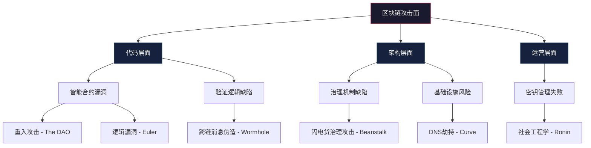
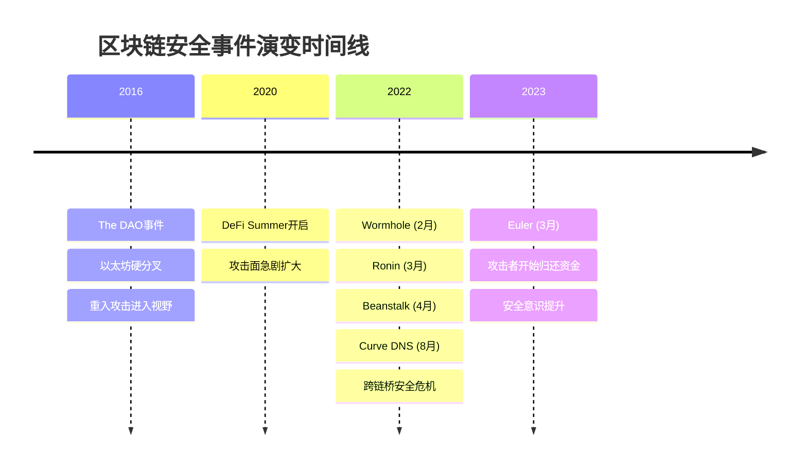
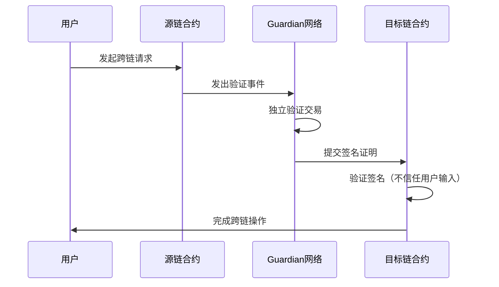
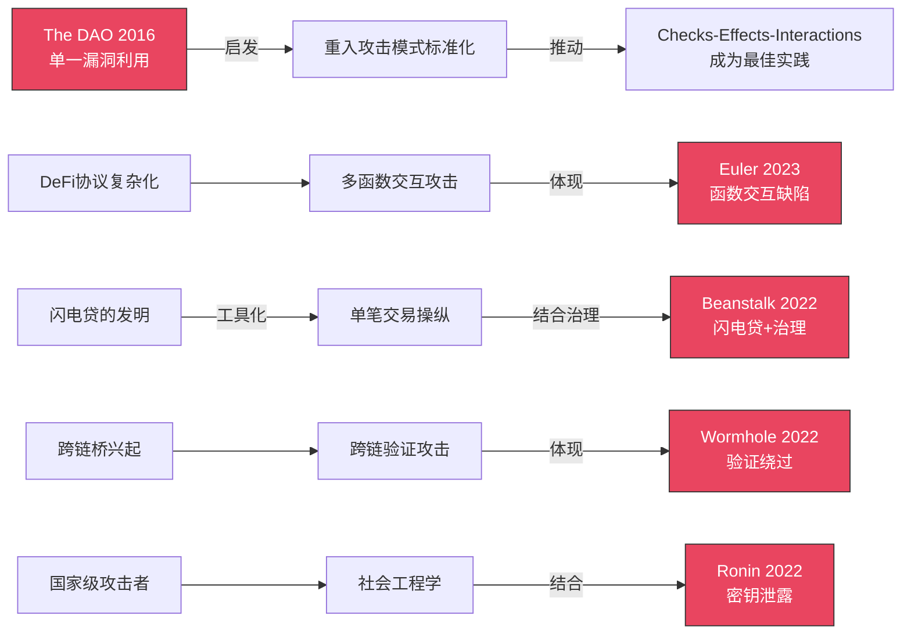
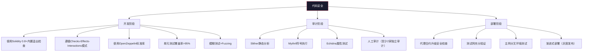
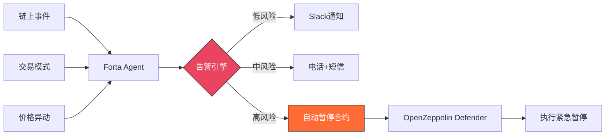

## 23.7 案例总结

前述六个案例横跨2016年至2023年，涵盖了区块链安全领域最典型、影响最深远的攻击事件。从The DAO的重入漏洞到Ronin Bridge的社会工程学攻击，每一事件都从不同维度暴露了去中心化系统在代码安全、架构设计、运营管理和治理机制上的脆弱性。本节对这些案例进行系统性总结，提炼共性规律，为构建全面的防御体系提供参考。

### 23.7.1 案例全景回顾

下表汇总了六个核心案例的关键信息，为后续分析提供数据基础：

| 事件 | 时间 | 损失金额 | 攻击类型 | 目标层 | 根本原因 | 攻击者身份 |
|------|------|----------|----------|--------|----------|------------|
| The DAO | 2016年6月 | 360万ETH（~6000万美元） | 重入攻击 | 智能合约 | 函数设计缺陷，状态更新在转账之后 | 未知（争议性） |
| Wormhole | 2022年2月 | 12万ETH（~3.26亿美元） | 验证绕过 | 跨链桥 | Solana端sysvar账户未校验 | 未知 |
| Beanstalk | 2022年4月 | ~1.82亿美元 | 治理攻击 | 治理机制 | 无提案延迟+闪电贷影响治理 | 未知（资金经Tornado Cash混币） |
| Euler Finance | 2023年3月 | ~1.97亿美元 | 逻辑漏洞 | 智能合约 | donate函数与清算逻辑交互缺陷 | 未知（后归还资金） |
| Ronin Bridge | 2022年3月 | 17.36万ETH+2550万USDC（~6.25亿美元） | 密钥泄露 | 运营安全 | 社会工程学获取验证者私钥 | 朝鲜Lazarus组织 |
| Curve Finance | 2022年8月 | ~57.5万美元 | DNS劫持 | 前端/基础设施 | DNS记录被篡改 | 未知 |

### 23.7.2 攻击向量分类与模式识别

从攻击向量的角度审视，六个案例可以归入三个大的攻击面：



**代码层面攻击（3例，占比50%）**：包括The DAO的重入漏洞、Euler Finance的函数交互缺陷、Wormhole的验证逻辑绕过。这类攻击直接利用代码中的逻辑错误，攻击者需要具备深入的智能合约理解和逆向分析能力。其特点是攻击过程完全在链上可追踪，但一旦发生难以即时阻止。

**架构层面攻击（2例，占比33%）**：包括Beanstalk的治理攻击和Curve的DNS劫持。这类攻击利用系统设计层面的缺陷而非具体的代码错误。Beanstalk暴露了治理机制在设计时未考虑闪电贷带来的投票权操纵风险；Curve事件则揭示了区块链应用对传统Web基础设施（DNS）的依赖所带来的安全隐患。

**运营层面攻击（1例，占比17%）**：Ronin Bridge事件是典型的运营安全失败。尽管技术上实现了多签机制（5/9），但验证者密钥的实际管理存在严重缺陷——Sky Mavis控制的4个密钥存储在同一个基础设施中，实质上将多签降级为单点信任。

### 23.7.3 损失规模与影响分析

从经济损失角度看，六个案例的累计损失超过13.5亿美元。以下从多个维度进行量化分析：

**按损失规模排序**：

| 排名 | 事件 | 损失（亿美元） | 占总损失比 | 是否追回 |
|------|------|---------------|-----------|----------|
| 1 | Ronin Bridge | 6.25 | 46.2% | FBI追回部分，Jump Crypto补充 |
| 2 | Wormhole | 3.26 | 24.1% | Jump Crypto全额补充 |
| 3 | Euler Finance | 1.97 | 14.6% | 攻击者归还大部分 |
| 4 | Beanstalk | 1.82 | 13.5% | 未追回 |
| 5 | The DAO | 0.60 | 4.4% | 以太坊硬分叉回滚 |
| 6 | Curve Finance | 0.06 | 0.4% | 部分追回 |

**关键观察**：

1. **运营安全失败造成的损失最大**：Ronin一案的损失金额超过其他五案之和。这说明技术层面的安全防护（智能合约审计、形式化验证）虽然是必要的，但如果不解决运营安全问题，技术防护形同虚设。

2. **跨链桥成为重灾区**：Wormhole和Ronin两个跨链桥案例的损失合计9.51亿美元，占总损失的70.3%。跨链桥因其需要管理跨链资产的锁定和铸造，天然成为高价值攻击目标。

3. **损失追回率差异显著**：The DAO通过社区治理硬分叉实现100%追回，Euler和Wormhole通过不同方式实现全额追回，但Beanstalk的资金则永久损失。损失追回的可能性与攻击类型、社区凝聚力、项目方财务实力密切相关。

### 23.7.4 时间线与趋势演变



从时间线可以观察到三个阶段性特征：

**2016年：启蒙期**。The DAO事件是区块链安全的分水岭。在此之前，社区对智能合约安全的认知尚处于萌芽阶段。The DAO事件不仅造成了直接经济损失，更引发了关于"代码即法律"理念的深刻辩论，最终导致以太坊社区的分裂——支持回滚的ETH和坚持不可变的ETC。

**2022年：爆发期**。2022年是区块链安全事件最密集的年份，四个重大案例集中发生。这一年也是DeFi TVL（总锁仓量）从峰值回落的时期，大量协议在牛市期间匆忙上线，安全审计不到位的问题在熊市中集中暴露。跨链桥成为攻击者的首选目标，因为它们管理着大量跨链资产，且技术复杂度高、攻击面广。

**2023年至今：成熟期**。Euler Finance事件出现了积极信号——攻击者在与项目方谈判后归还了大部分被盗资金，这反映了安全社区（如Immunefi漏洞赏金计划）的威慑力在增强。同时，安全工具链（Slither、Foundry、Echidna等）的成熟使得开发者能够更早发现和修复漏洞。

### 23.7.5 漏洞根因深度剖析

每个案例的根本原因都可以追溯到软件工程中的经典问题，但区块链的特殊性放大了这些问题的影响：

#### 23.7.5.1 重入漏洞的本质：状态管理缺陷

The DAO事件的核心是"检查-生效-交互"（Checks-Effects-Interactions）模式的违反。在传统软件中，状态管理错误通常只影响单个应用的逻辑正确性；但在智能合约中，由于资金直接由合约控制且交易不可逆，一个状态管理错误可以导致数千万美元的永久损失。

**防御模式**：

```solidity
// 正确的模式：先更新状态，再进行外部调用
function withdraw(uint256 amount) external {
    // 1. 检查（Checks）
    require(balances[msg.sender] >= amount, "Insufficient balance");
    
    // 2. 生效（Effects）—— 在外部调用之前更新状态
    balances[msg.sender] -= amount;
    
    // 3. 交互（Interactions）
    (bool success, ) = msg.sender.call{value: amount}("");
    require(success, "Transfer failed");
}

// 或使用OpenZeppelin的ReentrancyGuard
import "@openzeppelin/contracts/security/ReentrancyGuard.sol";

contract MyContract is ReentrancyGuard {
    function withdraw(uint256 amount) external nonReentrant {
        // 安全的提款逻辑
    }
}
```

#### 23.7.5.2 验证绕过的核心：信任边界模糊

Wormhole事件暴露了跨链桥设计中的一个根本问题——信任边界的定义不清晰。Solana端的合约信任了用户提供的sysvar账户数据，而未验证该账户是否确实是系统变量。这相当于在传统Web应用中信任了用户提供的HTTP头部信息而未做服务端验证。

**跨链验证的正确模式**：



关键原则：**永远不要信任来自不可信来源的数据，即使它看起来像系统数据**。

#### 23.7.5.3 治理攻击的根源：时间维度缺失

Beanstalk事件的根本原因是治理机制在时间维度上的设计缺陷。正常的治理流程应该包含：

1. **提案期**：社区讨论和审查（数天到数周）
2. **投票期**：持币者投票（数天）
3. **时间锁**：通过的提案在执行前有延迟期（数天）
4. **执行**：时间锁到期后自动执行

Beanstalk的`emergencyCommit`机制允许绕过前三步直接执行，且闪电贷获得的投票权与长期持有的投票权没有区分。

**安全治理模式**：

```solidity
// OpenZeppelin TimelockController 的正确使用
import "@openzeppelin/contracts/governance/TimelockController.sol";

contract SecureGovernance is TimelockController {
    constructor(
        uint256 minDelay,        // 最小延迟时间（如48小时）
        address[] proposers,     // 提案者列表
        address[] executors,     // 执行者列表
        address admin            // 管理员
    ) TimelockController(minDelay, proposers, executors, admin) {}
}

// 投票权应基于历史持仓快照
// OpenZeppelin Governor 的 _getPastVotes 实现
function _getPastVotes(address account, uint256 timepoint) {
    // 使用历史快照而非当前余额
    return _checkpointsLookup(ckpts, timepoint);
}
```

#### 23.7.5.4 运营安全的失败：单点信任

Ronin事件的核心教训是：**多签机制的安全性取决于签名者的独立性**。Ronin的5/9多签在设计上是合理的，但Sky Mavis控制的4个密钥在实践中被集中管理（部分密钥存储在AWS密钥管理服务中共享的访问凭据下），使得攻击者通过一次社会工程学攻击就获取了4个密钥。

**密钥管理的正确实践**：

| 维度 | 错误做法（Ronin的教训） | 正确做法 |
|------|----------------------|----------|
| 存储位置 | 多个密钥存储在同一基础设施 | 每个密钥独立的HSM/硬件钱包 |
| 访问控制 | 共享的云服务凭据 | 独立的访问权限和审批流程 |
| 地理分布 | 同一组织内集中管理 | 跨组织、跨地域分布 |
| 监控机制 | 无异常检测 | 大额交易实时告警 |
| 轮换策略 | 静态密钥长期不变 | 定期轮换+事件驱动轮换 |

### 23.7.6 攻击手法的演进与关联

这些案例中的攻击手法并非孤立存在，它们之间存在着清晰的演进和组合关系：



**趋势一：从单一漏洞到组合攻击**。早期的攻击（如The DAO）通常利用单一漏洞。而后期的攻击（如Beanstalk）则组合了闪电贷、治理机制、紧急执行等多个要素。攻击的复杂度在持续上升。

**趋势二：从链上到链下**。早期攻击完全在链上进行，而Ronin事件引入了社会工程学这一链下攻击向量。Curve的DNS劫持更是将攻击面扩展到了传统互联网基础设施。未来的安全防御必须覆盖链上和链下两个维度。

**趋势三：攻击者从个人到组织**。The DAO的攻击者身份至今不明，但Ronin事件被明确归因于朝鲜国家级黑客组织Lazarus。这意味着防御者面对的对手正在从技术爱好者升级为资源充足的国家级组织，攻击的持久性和复杂度都在上升。

### 23.7.7 系统性防御框架

基于对六个案例的深度分析，以下是针对区块链项目的系统性防御框架：

#### 23.7.7.1 代码安全层



**核心检查清单**：

| 检查项 | 关联案例 | 优先级 | 自动化工具 |
|--------|----------|--------|-----------|
| 重入攻击防护 | The DAO | P0 | Slither (reentrancy-eth) |
| 外部调用返回值检查 | The DAO | P0 | Slither (unchecked-transfer) |
| 系统变量/账户地址校验 | Wormhole | P0 | 人工审计 |
| 函数交互边界分析 | Euler | P0 | Echidna属性测试 |
| 整数溢出/下溢 | 通用 | P0 | Solidity 0.8+ 内置 |
| 访问控制正确性 | 通用 | P0 | Slither (access-control) |
| 预言机价格源校验 | 通用 | P1 | 人工审计 |
| 闪电贷防护 | Beanstalk | P1 | Foundry fuzz测试 |
| 治理时间锁 | Beanstalk | P1 | 人工审计 |
| 紧急功能安全审查 | Beanstalk | P2 | 人工审计 |

#### 23.7.7.2 架构安全层

**跨链桥安全设计原则**：

1. **验证者独立性**：每个验证者必须使用独立的HSM存储密钥，密钥不应在同一基础设施中管理
2. **经济安全模型**：验证者的质押金额应大于其可转移的资产金额，确保作恶成本高于收益
3. **异常检测**：实时监控跨链交易的频率和金额，超出阈值自动暂停
4. **渐进式信任**：大额跨链交易需要更多的验证者签名

**治理安全设计原则**：

1. **提案时间锁**：所有治理提案必须有最少48小时的延迟期
2. **投票权快照**：投票权基于提案创建时的持仓快照，而非实时余额
3. **闪电贷隔离**：闪电贷获得的代币不应具有投票权
4. **紧急机制上限**：紧急执行功能应设置单次执行的金额上限

#### 23.7.7.3 运营安全层

**密钥管理矩阵**：

| 角色 | 密钥类型 | 存储方式 | 访问控制 | 轮换周期 |
|------|----------|----------|----------|----------|
| 部署密钥 | EOA | 硬件钱包 | 多人审批 | 每次部署 |
| 管理员密钥 | 多签 | Gnosis Safe | 3/5或更高 | 每季度 |
| 验证者密钥 | BLS/ECDSA | HSM | 独立管理 | 每半年 |
| 监控密钥 | 只读 | 环境变量 | 只读权限 | 每月 |

**监控与告警体系**：



### 23.7.8 从案例到实践：安全开发检查流程

将上述分析转化为可执行的开发流程：

**阶段一：设计评审**

- [ ] 明确定义信任边界（哪些输入来自不可信来源）
- [ ] 绘制资金流向图（所有涉及资产转移的路径）
- [ ] 分析函数交互矩阵（哪些函数组合可能导致异常状态）
- [ ] 评估闪电贷攻击面（哪些操作可以在单个交易内被操纵）
- [ ] 设计治理安全机制（时间锁、投票权计算、紧急暂停）

**阶段二：实现审查**

- [ ] 检查所有外部调用是否遵循Checks-Effects-Interactions模式
- [ ] 验证所有访问控制是否正确设置
- [ ] 确认所有系统变量和地址是否经过验证
- [ ] 检查数学运算是否使用SafeMath或Solidity 0.8+
- [ ] 验证事件日志是否完整覆盖关键操作

**阶段三：测试验证**

- [ ] 单元测试覆盖率 > 95%
- [ ] 模糊测试运行 > 10,000次
- [ ] 属性测试覆盖所有关键不变量
- [ ] 主网分叉环境集成测试
- [ ] 至少两家独立安全审计

**阶段四：部署与监控**

- [ ] 测试网充分验证后，主网灰度部署
- [ ] 部署Forta监控Agent
- [ ] 配置OpenZeppelin Defender自动暂停
- [ ] 建立24/7安全响应团队
- [ ] 制定并演练应急响应计划

### 23.7.9 核心教训总结

从这六个案例中提炼出的十条核心教训，按重要性排序：

| 序号 | 教训 | 来源案例 | 一句话总结 |
|------|------|----------|-----------|
| 1 | 代码不可信，审计不能少 | The DAO, Euler | 任何未经审计的代码都不应该管理大额资金 |
| 2 | 跨链桥是最大攻击面 | Wormhole, Ronin | 跨链桥的安全性决定了整个生态的安全下限 |
| 3 | 运营安全比代码安全更脆弱 | Ronin, Curve | 最安全的合约也挡不住泄露的私钥 |
| 4 | 闪电贷改变了攻击经济学 | Beanstalk | 攻击者可以用零成本资金在单笔交易中完成攻击 |
| 5 | 治理机制需要时间维度保护 | Beanstalk | 没有时间锁的治理等于没有治理 |
| 6 | 紧急功能也是攻击面 | Beanstalk, Platypus | 紧急功能必须经过与其他功能同等的安全审计 |
| 7 | 不要信任单一数据源 | 通用（预言机） | 所有外部数据都应有偏差检查和多源验证 |
| 8 | 密钥管理是安全的基石 | Ronin, Multichain | 技术上完美的系统在泄露的密钥面前毫无意义 |
| 9 | 安全是持续过程而非一次性审计 | 所有案例 | 部署后的监控与应急响应同样重要 |
| 10 | 去中心化必须名副其实 | Ronin, Multichain | 真正的去中心化要求组件的独立性，而非仅仅是数量 |

### 23.7.10 进阶思考：安全的未来方向

这六个案例不仅揭示了当前的安全挑战，也指向了未来安全发展的方向：

**形式化验证的普及**。随着Certora、K Framework等形式化验证工具的成熟，未来的智能合约安全将从"测试找bug"转向"证明无bug"。形式化验证可以数学证明合约的行为符合预期规范，从根本上消除逻辑漏洞。

**零知识证明在安全中的应用**。ZK技术不仅用于隐私和扩容，也可以用于安全验证——例如，跨链桥可以使用ZK证明来验证源链交易的有效性，而无需信任验证者签名。

**AI辅助安全审计**。大语言模型正在被用于智能合约审计，可以快速识别常见的漏洞模式。但AI审计目前仍无法替代人工审计对复杂业务逻辑的理解，最佳实践是AI预审+人工终审。

**保险与风险管理**。随着DeFi保险协议（如Nexus Mutual、InsurAce）的成熟，安全事件的财务影响可以通过保险机制进行转移，这将改变项目方和用户的风险承受能力。

这六个案例共同构成了区块链安全的知识图谱。理解它们的共性与差异，掌握它们背后的原理与防御方法，是每一个区块链安全从业者的必修课。安全不是一个终点，而是一个持续演进的过程——攻击者在进步，防御者也必须不断进化。
