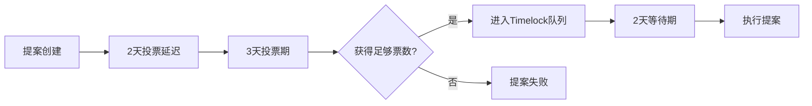
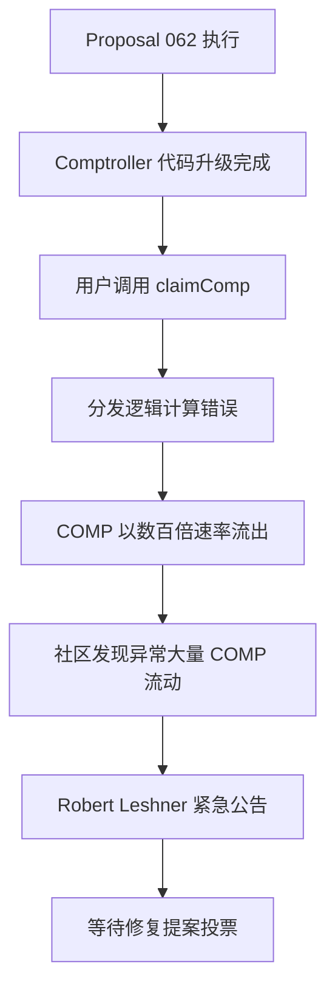
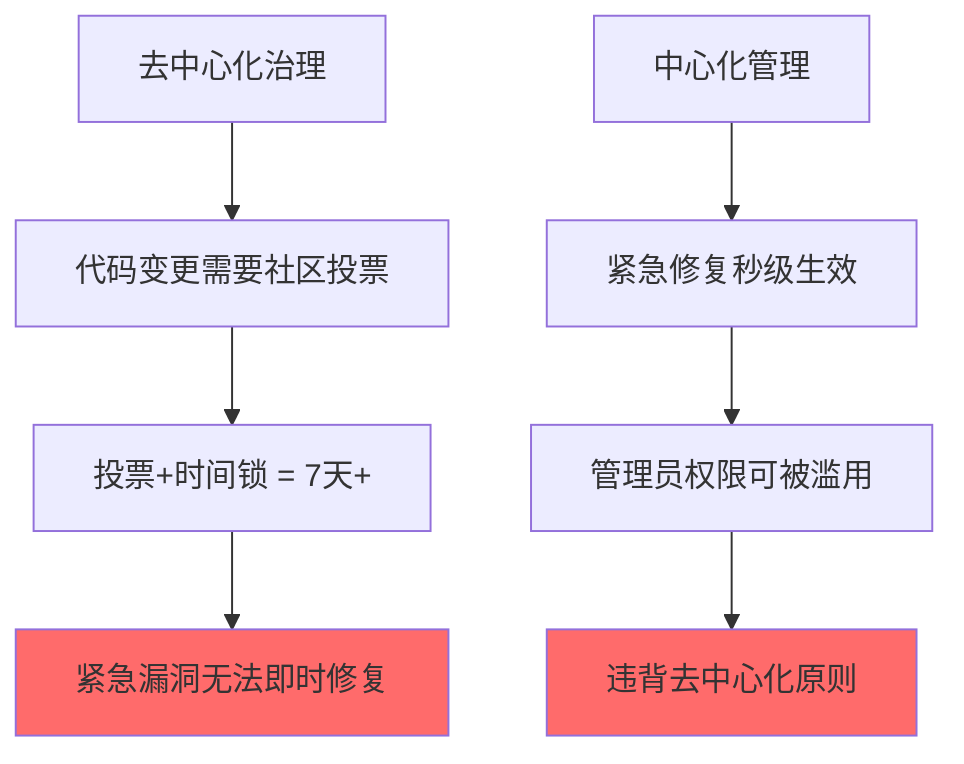

## 23.8 Compound协议漏洞（2021年）

Compound协议是DeFi借贷领域的奠基性协议之一，锁仓量一度超过百亿美元。2021年9月底，一次治理提案的代码升级却因一个单字符级的逻辑错误，导致约8000万美元的COMP代币被错误分发。这不是外部黑客攻击，而是"自己人"通过去中心化治理亲手引入的漏洞——暴露了DeFi治理升级机制在紧急响应能力上的根本缺陷。

### 23.8.1 Compound协议架构基础

要理解这次漏洞的根因，必须先理解Compound的核心架构。

#### 23.8.1.1 协议角色与核心合约

Compound是一个算法利率的去中心化借贷协议，其核心由三层合约构成：

| 合约 | 职责 | 关键功能 |
|------|------|----------|
| **Comptroller** | 中央控制器 | 管理市场准入、抵押因子、COMP代币分发逻辑 |
| **cToken (CEther/CERC20)** | 市场合约 | 每种资产对应一个cToken合约，管理存/借/清算 |
| **Governor (Timelock)** | 治理执行 | 提案排队→延时执行，确保社区有反应窗口 |

Comptroller是整个协议的"大脑"。用户与任何cToken交互时（存入、借出、还款、清算），cToken都会回调Comptroller来决定操作是否允许、更新用户的COMP奖励累积。

#### 23.8.1.2 COMP代币分发机制

Compound在2020年6月推出COMP流动性挖矿，将协议治理权通过代币分发给真实用户。其分发逻辑如下：

```solidity
// 简化后的COMP分发核心逻辑
function updateCompSupplyIndex(address cToken) internal {
    double memory supplyIndex = compSupplyState[cToken];
    uint supplyDelta = compSpeed[cToken] * deltaBlocks;

    if (totalSupply > 0) {
        supplyIndex = supplyIndex + (double(supplyDelta) / double(totalSupply));
    }

    compSupplyState[sToken] = supplyIndex;
}

// 计算单个供应商应得的COMP
function distributeSupplierComp(
    address cToken,
    address supplier,
    bool distributeAll
) internal {
    double memory supplyIndex = compSupplyState[cToken];
    uint supplierTokens = cToken.balanceOf(supplier);

    double memory indexDelta = supplyIndex - compSupplierIndex[cToken][supplier];
    uint supplierDelta = uint(indexDelta * supplierTokens);

    if (distributeAll) {
        // 直接发送给用户
        supplierDelta = supplierDelta + compAccrued[supplier];
        if (supplierDelta > 0) {
            compAccrued[supplier] = 0;
            transferComp(supplier, supplierDelta);
        }
    } else {
        // 只更新累积，不发送
        compAccrued[supplier] += supplierDelta;
    }
}
```

分发发生在三种场景：

- `claimComp()` — 用户主动领取
- `transfer()` — cToken转账时自动触发
- `redeem()` / `borrow()` — 存取款操作间接触发

**关键点**：COMP代币从一个预先填充的"水库"（Reservoir）合约中取出，通过Comptroller的分发逻辑流向用户。这个水库中的余额不是无限的，但在漏洞触发时余额充足。

### 23.8.2 治理提案机制与时间锁

Compound的治理流程严格遵循去中心化原则：



从提案创建到执行完成，最快也需要 **7天**。这个时间锁设计的初衷是防止恶意提案被执行——但正是这个"安全机制"在漏洞发生后成为了最大的障碍，因为修复漏洞本身也需要走完同样的流程。

### 23.8.3 漏洞触发：Proposal 062

#### 23.8.3.1 提案背景

2021年9月初，Compound社区发现了一个已有的bug：在某些特殊路径下，COMP代币的分发计算会出现微小的精度累积偏差。社区提出了Proposal 062来修复这个问题。该提案修改了Comptroller合约中的`claimComp`和相关分发函数的逻辑。

提案代码经过了社区审查，但审查的深度和时间显然不够充分——因为一个致命的逻辑错误悄悄地被合入了。

#### 23.8.3.2 根因分析：一个符号的毁灭性后果

Proposal 062在2021年9月30日执行后，核心错误出现在Comptroller的新`become()`函数中。这是一个代理升级函数，负责将旧Comptroller的状态迁移到新逻辑。

错误的核心在于条件判断：

```solidity
// 新Comptroller中的 become() 函数（简化）
function become(...) external {
    require(msg.sender == comptrollerImplementation, "only self");

    // 漏洞所在：条件判断方向错误
    if (supplierDelta > 0) {
        supplierDelta = min(supplierDelta, compAccrued[supplier]);
        // 正确分支：限制发放量不超过累积
    } else {
        // 错误分支：supplierDelta == 0 或 < 0 时，直接清零累积
        // 但实际上这个 else 分支不该做任何操作
        compAccrued[supplier] = 0;
    }
}
```

问题的本质更深层次。实际上，新Comptroller的`distributeSupplierComp`函数中，代码将"当前索引"和"旧索引"的差值计算逻辑搞反了：

```solidity
// 正确逻辑：计算新增的COMP量
double memory newIndex = compSupplyState[cToken];
double memory oldIndex = compSupplierIndex[cToken][supplier];
uint supplierDelta = uint((newIndex - oldIndex) * supplierTokens);

// 错误实现（Proposal 062引入的bug）：
// 当 newIndex == oldIndex 时，supplierDelta = 0
// 然后进入 else 分支，错误地清零了 compAccrued
// 但更严重的问题是：条件的方向搞反了
// 当用户没有新累积时（delta=0），不应该清零已累积的奖励
```

这个错误的实际后果：当用户调用`claimComp()`时，分发逻辑计算出的`supplierDelta`值远超应发量。部分用户的COMP发放量是正常值的数百倍。

更精确地说，Proposal 062重写了Comptroller中的分发索引更新逻辑，但在新旧索引的差值计算中，错误地使用了"减法"代替"除法"（或等价的数学操作）。在正常的double精度浮点数运算中：

```text
正常计算：supplierDelta = (supplyIndex - supplierIndex) * supplierTokens
错误计算：supplierDelta = supplyIndex * supplierTokens  （忽略了减去旧索引）
```

这使得每个用户获得的COMP量等于"从第一天起的全部累积"，而不是"自上次领取以来的增量"。相当于每次都把全部历史累积重新发一遍。

#### 23.8.3.3 漏洞影响的连锁反应

漏洞执行后的连锁影响如下：



**关键数据**：
- 漏洞触发时间：2021年9月30日
- 影响资金：约280,000 COMP（当时价值约8000万美元）
- 部分用户单笔提取了远超正常量的COMP
- Reservoir合约中的COMP余额快速下降

### 23.8.4 二次灾难：Proposal 064的雪上加霜

情况比预想的更加糟糕。Proposal 062修改了分发逻辑中的"索引计算"部分，但Reservoir合约的`drip()`函数中还有另一段相关逻辑。`drip()`函数的作用是将COMP从Reservoir转移到Comptroller的分发池中：

```solidity
// Reservoir 合约中的 drip() 函数
function drip() external {
    uint256 comptrollerCOMP = COMP.balanceOf(address(comptroller));
    uint256 reservoirCOMP = COMP.balanceOf(address(this));

    // 计算应该转移多少COMP到Comptroller
    uint amount = ...; // 基于速率和时间的计算

    COMP.transfer(address(comptroller), amount);
}
```

当有人在漏洞修复前调用了`drip()`函数，额外的大额COMP被注入到已经被破坏的分发逻辑中。这意味着：

1. 第一波损失来自Proposal 062执行后、`drip()`调用前 — 此时Comptroller中已有少量COMP可被超额分发
2. `drip()`调用后，更多COMP被注入，导致第二波更大规模的超额分发
3. 两波叠加，总损失接近280,000 COMP

### 23.8.5 Compound创始人Robert Leshner的公开信

漏洞发生后，Compound创始人Robert Leshner在Twitter上发表了公开声明。其中一段话成为了DeFi史上的经典争议：

> "For the majority of you who received extra COMP due to the bug: please return it. You're welcome to keep 10% as a white-hat bounty, but otherwise I'll be reporting it as income to the IRS, and most of you are not anonymous."

这段话引发了巨大争议：

| 支持方观点 | 反对方观点 |
|------------|------------|
| 智能合约代码即法律，调用公开函数是合法的 | 创始人威胁向IRS举报是道德绑架 |
| 10%的白帽赏金已经是慷慨的条件 | 协议自身bug不应让用户承担后果 |
| 未归还的资金等同于盗窃 | DeFi的不可撤销特性是双刃剑 |
| 社区协作有助于行业健康发展 | 去中心化项目不应使用中心化手段施压 |

最终确实有部分用户归还了多余的COMP，但大量代币仍然流失。

### 23.8.6 修复过程详解

由于治理提案的7天时间锁机制，Compound团队无法立即部署修复。修复过程分两步进行：

**第一步：Proposal 063 — 紧急暂停**
- 目标：通过治理暂停COMP分发，堵住漏洞
- 限制：治理流程仍需7天
- 实际效果：在投票期间，错误分发仍在持续

**第二步：Proposal 117 — 完整修复**
- 在Comptroller中增加`_become()`的参数验证
- 修正索引计算逻辑
- 增加了`_setCompSpeed()`的边界检查

修复后的关键代码改进：

```solidity
// 修复后的关键验证
function _becareful() public {
    // 增加了断言，确保索引增量不会异常放大
    require(newSupplyIndex >= oldSupplyIndex, "index must not decrease");

    // 增加了上限检查
    uint supplierDelta = ...;
    require(supplierDelta <= compAccrued[supplier], "over-distribution detected");

    // 增加了总量上限
    uint totalDistributed = compAccrued[supplier] + supplierDelta;
    require(totalDistributed <= MAX_DISTRIBUTION_PER_USER, "cap exceeded");
}
```

### 23.8.7 技术根因深度剖析

#### 23.8.7.1 代理升级模式的风险

Compound使用的是传统的透明代理（Transparent Proxy）升级模式。这种模式的固有风险在于：

1. **存储布局兼容性**：新合约的storage layout必须与旧合约完全兼容，一个额外的state变量就会导致所有后续变量读取偏移
2. **函数选择器冲突**：admin函数和implementation函数的选择器不能重叠
3. **初始化逻辑**：`become()`函数作为初始化入口，必须被正确调用且只调用一次

Proposal 062的问题实际上不属于存储布局冲突（那类bug更隐蔽），而纯粹是**业务逻辑层面的条件判断错误**。

#### 23.8.7.2 浮点数精度陷阱

Compound使用`double`（双精度浮点）来存储利率指数（supplyIndex / borrowIndex）。这个选择本身就存在精度问题：

```solidity
// double 类型在 Solidity 中是自定义实现的二进制浮点
// 精度约为 15-16 位有效数字
// 当 index 值很大时，小的增量可能被"吞掉"

// 示例：
double memory bigIndex = 1.0e18;     // 很大的基数
double memory smallDelta = 1.0;      // 很小的增量
double memory result = bigIndex + smallDelta;
// result == bigIndex，smallDelta 被精度截断
```

Proposal 062试图修复的正是这类精度问题，但由于修复代码本身有误，反而引入了更大的bug。

#### 23.8.7.3 治理攻击面分析

这次事件暴露了DeFi治理机制的一个根本矛盾：



DeFi协议面临两难选择：

- **完全去中心化**：安全但响应慢（Compound当时的情况）
- **保留紧急多签**：快速但引入信任假设
- **分层治理**：日常操作去中心化，安全操作保留紧急权限（行业趋势）

### 23.8.8 类似治理漏洞的横向对比

| 协议 | 时间 | 漏洞类型 | 损失 | 修复方式 |
|------|------|----------|------|----------|
| **Compound** | 2021.09 | 提案代码逻辑错误 | ~8000万美元COMP | 治理提案修复 |
| **Beanstalk** | 2022.04 | 闪电贷治理攻击 | 1.82亿美元 | 协议重启 |
| **Tornado Cash** | 2023.05 | 恶意治理提案接管 | 控制权丧失 | 社区分叉 |
| **Aave** | 2022.11 | 提案配置参数错误 | 未造成直接损失 | 提案撤回 |

**核心差异**：Compound事件不是恶意攻击，而是善意修复引入的bug。这比外部攻击更难防范——因为"自己人"的操作通常受到更低级别的审查。

### 23.8.9 防御措施与工程实践

#### 23.8.9.1 治理提案的代码审计清单

基于Compound事件的经验教训，治理提案的审计应覆盖以下方面：

```markdown
## 治理提案审计清单

### 1. 存储布局验证
- [ ] 新合约的 storage layout 与旧合约兼容
- [ ] 没有新增/删除/重排 state 变量
- [ ] 映射和数组的 slot 位置正确

### 2. 业务逻辑验证
- [ ] 所有条件分支（if/else）的方向正确
- [ ] 边界条件（0值、最大值）处理正确
- [ ] 数值计算的溢出/下溢保护
- [ ] 浮点精度损失在可接受范围内

### 3. 状态迁移验证
- [ ] become() 函数的初始化逻辑正确
- [ ] 旧状态能正确迁移到新逻辑
- [ ] 不会丢失或重置已有状态

### 4. 集成测试
- [ ] 在主网分叉上完整模拟提案执行
- [ ] 测试正常路径和异常路径
- [ ] 验证 COMP 分发量在合理范围内
- [ ] 检查事件日志与预期一致

### 5. 升级后监控
- [ ] 部署后24小时内持续监控关键指标
- [ ] 设置异常告警（如 COMP 分发速率突增）
- [ ] 准备好紧急暂停方案
```

#### 23.8.9.2 代币分发防护机制

```solidity
// 推荐的代币分发防护模式
contract SafeCompDistributor {
    uint256 public constant MAX_DISTRIBUTION_PER_BLOCK = 10000 * 1e18;
    uint256 public lastBlockDistributed;
    uint256 public blockDistributionTotal;

    function distributeComp(
        address user,
        uint256 amount
    ) internal {
        // 防护1：区块内总量上限
        if (block.number > lastBlockDistributed) {
            lastBlockDistributed = block.number;
            blockDistributionTotal = 0;
        }
        require(
            blockDistributionTotal + amount <= MAX_DISTRIBUTION_PER_BLOCK,
            "block distribution cap exceeded"
        );

        // 防护2：单用户单次上限
        uint256 maxPerClaim = getUserMaxClaim(user);
        require(amount <= maxPerClaim, "exceeds user max claim");

        // 防护3：双人确认的大额分发
        if (amount > LARGE_DISTRIBUTION_THRESHOLD) {
            // 进入pending状态，需要二次确认
            pendingDistributions[user] = amount;
            emit LargeDistributionPending(user, amount);
            return;
        }

        blockDistributionTotal += amount;
        COMP.transfer(user, amount);
        emit CompDistributed(user, amount);
    }
}
```

#### 23.8.9.3 治理升级的渐进式部署


**关键原则**：治理提案执行后不应立即信任其正确性。应设置一个"观察期"，在此期间持续监控协议核心指标（代币分发量、利息计算、清算阈值等），一旦发现异常立即触发紧急暂停。

### 23.8.10 对DeFi治理机制的深层反思

#### 23.8.10.1 治理参与者的技术门槛

Compound的治理投票者中，绝大多数并不具备审查Solidity代码的能力。他们依赖社区中少数技术专家的判断。这意味着：

- **名义上**的去中心化治理
- **实际上**的技术寡头决策
- 普通代币持有者的投票权形同虚设（对代码质量而言）

这种"治理幻觉"在DeFi行业普遍存在。真正的安全不能依赖于"有人会看代码"的假设，而应该通过工程手段（自动化测试、形式化验证、渐进部署）来保障。

#### 23.8.10.2 去中心化与响应速度的博弈

这次事件之后，Compound和其他DeFi协议开始采用"分层治理"模型：

| 层级 | 权限 | 决策方式 | 响应速度 |
|------|------|----------|----------|
| L0 紧急安全 | 暂停协议 | 3/6多签 | 秒级 |
| L1 参数调整 | 利率/阈值 | 治理提案 | 2-3天 |
| L2 逻辑升级 | 合约代码 | 治理+时间锁 | 7天+ |
| L3 架构变更 | 整体设计 | 链下讨论+链上投票 | 周级 |

Compound在事件后也引入了更灵活的紧急机制，在严重安全事件发生时可以绕过完整的7天治理流程。

### 23.8.11 攻击面扩展：如果有人故意利用此漏洞

虽然这次是意外引入的bug，但我们可以想象：如果有恶意提案伪装成正常升级，在代码中植入类似的逻辑错误，后果可能更加严重。

**恶意治理提案的攻击模式**：

1. 提交一个看起来合理的"优化"提案
2. 在大量代码变更中隐藏一个微妙的逻辑错误
3. 利用社区审查的时间有限和技术门槛高的弱点
4. 在提案执行后立即通过自动化脚本提取资金
5. 通过混币器转移资金，匿名性得到保障

**防御措施**：

- 强制要求所有代码变更必须有至少2个独立审计师的签名
- 引入自动化形式化验证工具（如Certora、Slither）
- 治理提案的代码变更量设置上限，防止大量代码中隐藏小bug
- 建立"治理蜜罐"机制——在测试网部署相同的提案进行长时间测试

### 23.8.12 事件时间线完整记录

| 日期 | 事件 |
|------|------|
| 2021-09-22 | Proposal 062 创建，包含Comptroller分发逻辑修改 |
| 2021-09-24 | 投票开始 |
| 2021-09-27 | 投票通过 |
| 2021-09-29 | Timelock等待期结束 |
| 2021-09-30 | **Proposal 062 执行，漏洞触发** |
| 2021-09-30 | 社区发现异常大量COMP流动，Robert Leshner紧急发声 |
| 2021-10-01 | Proposal 063 创建（紧急暂停COMP分发） |
| 2021-10-01 | 部分白帽用户开始归还多余COMP |
| 2021-10-03 | Proposal 064 被提出，但 **调用drip()导致第二波损失** |
| 2021-10-06 | Proposal 064 通过但修复仍不完整 |
| 2021-10-后续 | 完整修复提案逐步部署 |
| 持续数周 | 部分用户归还COMP，部分资金永久流失 |

### 23.8.13 核心教训总结

1. **一行代码可以价值8000万美元**：Proposal 062中的条件判断错误是一个极其微小的逻辑错误，但其在DeFi可组合性和自动化执行的放大下，造成了灾难性后果。在传统软件中，这种bug最多导致一个计算错误；在DeFi中，它直接意味着资金损失。

2. **治理时间锁是双刃剑**：7天的时间锁在平时是安全保障，在紧急时刻是致命枷锁。DeFi协议需要保留紧急通道，但这个通道本身需要足够的安全保障。

3. **善意修复比恶意攻击更危险**：攻击者触发的安全审查级别远高于"社区维护者"。Proposal 062作为社区公认的技术改进，其审查力度远低于对抗性安全审计。

4. **测试网≠主网**：Proposal 062可能在测试网上运行正确（因为测试网的COMP分发参数和用户行为模式与主网不同），但在主网的复杂状态下暴露出问题。主网分叉测试是必要的但仍然不够充分。

5. **DeFi的"不可撤销"特性是双刃剑**：Robert Leshner的公开信暴露了一个深层矛盾——在"代码即法律"的世界里，出错后的追索手段极为有限。行业需要建立更成熟的链上纠纷解决和资金追回机制（如多签冻结、保险基金等）。

6. **形式化验证不是奢侈品而是必需品**：对于管理数亿美元的智能合约，仅靠人工代码审查和传统测试远远不够。形式化验证工具（如Certora Prover）能够数学性地证明合约行为符合规范，是DeFi安全的下一道防线。
