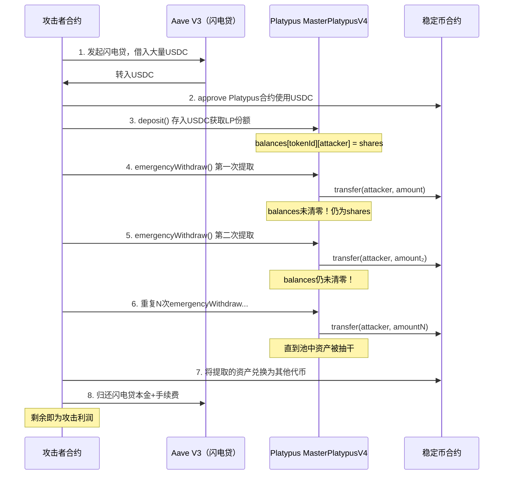

## 23.10 Platypus Finance闪电贷攻击（2023年）

Platypus Finance攻击是2023年DeFi安全领域的经典案例。攻击者仅凭一笔交易，利用紧急提款函数中的"忘记清零"逻辑缺陷，结合闪电贷的瞬时流动性，在数秒内窃取约850万美元。这一事件深刻揭示了一个道理：**安全审计不能放过任何"边缘路径"，哪怕那条路径的标签写着"紧急"。**

---

### 23.10.1 项目背景

#### 23.10.1.1 Platypus Finance是什么

Platypus Finance是部署在Avalanche链上的单边（single-sided）稳定币自动做市商（AMM）协议。与传统稳定币DEX（如Curve Finance的StableSwap）采用多资产池模式不同，Platypus使用了一种名为"覆盖比率（Coverage Ratio）"的创新机制：

| 特性 | 传统稳定币AMM（如Curve） | Platypus |
|------|--------------------------|----------|
| 池模型 | 多资产池，每种代币一个子池 | 单边敞口模型 |
| 流动性提供 | 同时提供多种代币 | 可以只提供一种代币 |
| 价格滑点 | 基于恒定乘积/稳定交换公式 | 基于覆盖比率（资产/负债） |
| LP代币 | 通用LP代币 | 每种资产对应独立LP代币 |
| 资本效率 | 中等 | 较高（单边无无常损失） |

Platypus在Avalanche生态中一度占据重要地位，TVL（总锁定价值）在高峰期达到数亿美元，是该链上最大的稳定币交换协议之一。

#### 23.10.1.2 覆盖比率机制

Platypus的核心创新在于覆盖比率（Coverage Ratio, CR）：

```text
CR = 总资产（totalAssets）/ 总负债（totalSupply of LP tokens）
```

- 当CR > 1时，意味着池中资产超过负债，流动性充裕
- 当CR < 1时，意味着资不抵债，流动性紧张
- 交易滑点与CR变化成正比——CR变化越大，滑点越高

这种设计让每种资产独立运作，用户只需提供单一资产即可获得LP收益，避免了传统AMM的无常损失问题。

#### 23.10.1.3 紧急提款功能的设计意图

DeFi协议通常会设计紧急提款（Emergency Withdraw）功能，作为治理层面对极端情况的应对措施：

- **正常场景**：协议出现严重漏洞或攻击时，治理层可以暂停主合约，允许白名单用户通过紧急路径提取资金，保护用户资产
- **设计意图**：作为"最后的安全网"，紧急提款功能应当是最简单、最可靠的资金提取路径
- **讽刺之处**：正是这条"安全网"本身成为了攻击的突破口

---

### 23.10.2 攻击时间线

| 时间 | 事件 |
|------|------|
| 2023年2月17日 06:38 UTC | 攻击者部署恶意合约，发起闪电贷攻击 |
| 同日 06:38 UTC | 单笔交易完成攻击，约850万美元被转出 |
| 同日 07:00 UTC左右 | Platypus团队察觉异常，暂停协议 |
| 同日 官方公告 | 团队确认遭受攻击，启动调查 |
| 2023年2月18日 | 链上分析社区追踪到攻击者地址及资金流向 |
| 2023年2月23日 | 法国警方逮捕两名嫌疑人 |
| 2023年后续 | 部分资金被追回，协议部署修复版本 |

值得注意的是，这是DeFi历史上少有的**攻击者被迅速逮捕**的案例，法国当局在不到一周内就锁定了嫌疑人。

---

### 23.10.3 漏洞根因分析

#### 23.10.3.1 核心缺陷：先转账后清零

Platypus的MasterPlatypusV4合约中，`emergencyWithdraw`函数存在致命的逻辑顺序错误：

```solidity
// Platypus MasterPlatypusV4 - emergencyWithdraw 函数（漏洞版本）
function emergencyWithdraw(uint256 tokenId) external {
    // 第一步：权限检查（正确）
    require(isEmergencyWhitelisted[msg.sender], "Not whitelisted");
    
    // 第二步：读取用户份额
    uint256 shares = balances[tokenId][msg.sender];
    
    // 第三步：计算应提取金额
    uint256 amount = shares * totalAssets / totalSupply;
    
    // 第四步：执行资金转移（先转了）
    IERC20(token).transfer(msg.sender, amount);
    
    // 第五步：更新状态（遗漏了！）
    // balances[tokenId][msg.sender] = 0;  // 这行被注释掉或遗漏
    // totalSupply -= shares;               // 总供应量也未更新
}
```

**问题的本质违反了Checks-Effects-Interactions模式。**

以太坊智能合约安全的基本原则之一就是CEI模式（Checks-Effects-Interactions）：


Platypus的紧急提款函数颠倒了第二步和第三步——**先执行了资金转移（Interactions），再更新状态（Effects）**，更糟糕的是，状态更新根本不存在。

#### 23.10.3.2 为什么这个缺陷能存活上线

1. **审计覆盖盲区**：紧急提款功能通常被视为"低频路径"，部分审计团队可能将其优先级降低
2. **代码重构遗留**：从项目Git历史推测，`emergencyWithdraw`可能是后期添加或从其他函数复制后修改的，遗漏了状态更新
3. **测试用例不足**：如果对紧急提款函数进行了多轮调用测试，应能发现重复提取问题
4. **权限控制的误导**：白名单检查（`isEmergencyWhitelisted`）给了开发者虚假的安全感——"只有授权用户能调用"并不等于"授权用户的每次调用都是安全的"

#### 23.10.3.3 漏洞的数学本质

假设攻击者的LP份额为 `S`，池中总资产为 `A`，总LP供应量为 `T`：

```text
第一次提取：amount₁ = S × A / T
  → 用户余额未清零，仍为S
  → 但池中实际资产已减少amount₁
  
第二次提取：amount₂ = S × (A - amount₁) / (T - 0)  // T也未更新
  → 如果T也未更新，则 amount₂ = S × (A - amount₁) / T
```

关键在于：即使 `totalAssets` 因转账而减少（ERC20的transfer会减少合约余额），但由于 `totalSupply` 和 `balances` 都未更新，攻击者可以用**同一个份额反复提取**，直到池中资产被抽干。

如果 `totalSupply` 也被正确更新了，那么第二次提取的计算基数会变小，但 `balances` 未更新仍然构成漏洞——攻击者至少还能提取一次。

---

### 23.10.4 攻击流程详解

#### 23.10.4.1 攻击前置条件

- **闪电贷来源**：Aave V3（Avalanche部署）
- **目标合约**：Platypus MasterPlatypusV4
- **攻击资产**：USDC、USDT、BUSD等稳定币
- **总损失**：约850万美元（主要以USDC计价）

#### 23.10.4.2 分步骤攻击流程



#### 23.10.4.3 攻击合约伪代码

```solidity
contract PlatypusExploiter {
    // 攻击主函数
    function executeAttack() external {
        // 1. 从Aave借闪电贷
        LENDING_POOL.flashLoan(
            address(this),           // 接收者
            new address[](1){USDC},  // 借入资产
            new uint256[](1){8500000e6}, // 借入金额
            new uint256[](1){0},
            address(this),           // 回调地址
            "",                      // 参数
            0                        // 模式
        );
    }
    
    // 闪电贷回调
    function executeOperation(
        address[] calldata assets,
        uint256[] calldata amounts,
        uint256[] calldata premiums,
        address initiator,
        bytes calldata
    ) external returns (bool) {
        uint256 borrowedAmount = amounts[0];
        
        // 2. 存入Platypus获取LP份额
        IERC20(USDC).approve(address(platypus), borrowedAmount);
        platypus.deposit(tokenId, borrowedAmount);
        
        // 3. 循环调用紧急提款
        uint256 balance = IERC20(USDC).balanceOf(address(this));
        while (IERC20(USDC).balanceOf(address(platypus)) > 0) {
            platypus.emergencyWithdraw(tokenId);
        }
        
        uint256 stolenAmount = IERC20(USDC).balanceOf(address(this)) 
                               - borrowedAmount - premiums[0];
        
        // 4. 将利润转换为ETH（增加追踪难度）
        // ... swap stolen tokens for ETH/AVAX
        
        // 5. 归还闪电贷
        IERC20(USDC).approve(address(LENDING_POOL), 
                             borrowedAmount + premiums[0]);
        
        return true;
    }
}
```

#### 23.10.4.4 攻击的关键细节

**为什么需要闪电贷？**

闪电贷不是简单的"借钱"——它是攻击的**放大器**：

1. **资金规模**：攻击者无需自有资金，可以借到协议流动性上限的巨额资金
2. **原子性**：整个攻击在一笔交易内完成，如果失败则回滚，攻击者零成本试错
3. **隐蔽性**：攻击前无任何链上准备行为，难以被监控系统预警

**资金转换策略**

攻击者在提取稳定币后，迅速将其兑换为ETH或其他非稳定币资产，增加资金追踪难度。这是DeFi攻击者的常见手法——稳定币可以被发行方冻结（如USDC的黑名单机制），而ETH无法被冻结。

---

### 23.10.5 同类漏洞对比

Platypus的"先转账后清零"并非孤例，以下是DeFi历史上同类漏洞的对比：

| 事件 | 时间 | 损失 | 漏洞类型 | 相同点 |
|------|------|------|----------|--------|
| Platypus Finance | 2023.02 | ~850万美元 | 紧急提款未清零 | 余额未清零 |
| Compound（COMP分发漏洞） | 2021.09 | ~8000万美元 | 分发逻辑错误 | 状态更新遗漏 |
| Hundred Finance | 2023.04 | ~700万美元 | 重入+余额未更新 | 先转账后更新 |
| Sentiment | 2023.04 | ~100万美元 | 价格计算后余额未更新 | 余额管理缺陷 |

这些案例的共同模式是：**在资金转移后，未能正确更新内部记账状态。**CEI模式的违反是DeFi漏洞中最常见也最致命的类别之一。

---

### 23.10.6 修复方案

#### 23.10.6.1 直接修复

将状态更新置于资金转移之前：

```solidity
// 修复后的emergencyWithdraw
function emergencyWithdraw(uint256 tokenId) external {
    require(isEmergencyWhitelisted[msg.sender], "Not whitelisted");
    
    uint256 shares = balances[tokenId][msg.sender];
    require(shares > 0, "No shares");
    
    // Effects：先更新状态
    balances[tokenId][msg.sender] = 0;       // 清零用户份额
    totalSupply[tokenId] -= shares;           // 减少总供应量
    uint256 amount = shares * totalAssets[tokenId] 
                     / totalSupply[tokenId];   // 基于更新后的值计算
    
    // Interactions：再执行转账
    IERC20(token).transfer(msg.sender, amount);
    
    emit EmergencyWithdraw(msg.sender, tokenId, shares, amount);
}
```

#### 23.10.6.2 架构层面的改进

1. **引入ReentrancyGuard**：即使状态更新遗漏，重入保护也能阻止重复调用
2. **分离紧急提款逻辑**：紧急提款应走独立的、经过严格审计的合约路径
3. **使用SafeERC20**：使用OpenZeppelin的SafeERC20进行代币转账，处理非标准ERC20的返回值问题
4. **事件日志**：所有关键操作（尤其是涉及资金的操作）必须发出事件，便于链上监控

```solidity
// 使用OpenZeppelin的ReentrancyGuard
import "@openzeppelin/contracts/security/ReentrancyGuard.sol";

contract MasterPlatypusV4 is ReentrancyGuard {
    function emergencyWithdraw(uint256 tokenId) 
        external 
        nonReentrant  // 重入保护
    {
        // ... 修复后的逻辑
    }
}
```

---

### 23.10.7 安全启示

#### 23.10.7.1 对开发者

1. **CEI模式是铁律**：Checks-Effects-Interactions不是建议，是必须遵守的编码规范。任何涉及资金转移的函数，状态更新必须在外部调用之前完成
2. **"紧急"不等于"简陋"**：紧急提款、紧急暂停等治理功能往往是攻击者的重点关注目标。越是"应急"的功能，越需要严格的测试和审计
3. **白名单不是万能的**：权限控制只解决了"谁能调用"的问题，不解决"调用是否安全"的问题
4. **测试覆盖率要完整**：每个函数都应有多轮调用测试，尤其是涉及资金的函数
5. **Git blame是审计工具**：在代码审查时，对后期添加或从其他函数复制的代码要加倍审查

#### 23.10.7.2 对审计人员

1. **不要跳过"简单"函数**：紧急提款、暂停、恢复等治理函数看似简单，但往往是漏洞高发区
2. **关注状态一致性**：在审计每个函数时，检查所有相关状态变量是否在正确的时间点被正确更新
3. **模拟多轮调用**：对涉及余额的函数，模拟同一用户的多次调用，检查状态是否正确演变
4. **闪电贷视角审计**：审计时要考虑"如果调用者拥有无限资金会怎样"——闪电贷让这个假设成为现实

#### 23.10.7.3 对DeFi用户

1. **分散风险**：不要将所有资金集中在单一协议中
2. **关注协议安全历史**：在存入资金前，了解协议的安全审计报告和历史漏洞事件
3. **监控链上异常**：使用Tenderly、Blocknative等工具监控与自己地址相关的异常交易
4. **理解紧急提款机制**：了解协议的紧急提款流程，包括谁有权触发、是否有锁定期等

#### 23.10.7.4 闪电贷攻击的演化趋势

Platypus攻击属于"逻辑漏洞+闪电贷放大"的典型模式。近年来闪电贷攻击呈现以下趋势：

- **攻击复杂度上升**：从单一合约漏洞到跨协议组合攻击
- **MEV与闪电贷结合**：攻击者利用MEV（最大可提取价值）机制优先执行攻击交易
- **跨链攻击增多**：随着跨链桥的普及，闪电贷攻击开始跨越多条链
- **防御也在进化**：链上监控（如Forta Network）、MEV保护（Flashbots Protect）、以及更严格的审计流程正在逐步提升防御水平

---

### 23.10.8 代码安全检查清单

基于Platypus事件，总结以下适用于所有DeFi智能合约的安全检查清单：

```text
□ 所有资金转移函数是否遵循CEI模式？
□ 紧急/治理功能是否经过同等严格的安全审计？
□ 每个涉及余额的函数是否正确更新了所有相关状态变量？
□ 是否使用了ReentrancyGuard或其他重入保护机制？
□ 是否使用了SafeERC20处理非标准代币？
□ 测试用例是否覆盖了同一函数的多轮调用场景？
□ 测试用例是否模拟了闪电贷场景（大额借入+快速操作）？
□ 是否对后期添加或复制的代码进行了独立审查？
□ 关键操作是否发出事件日志便于监控？
□ 是否有链上异常监控和告警机制？
```

---

### 23.10.9 总结

Platypus Finance攻击以极低的技术门槛（一个简单的状态更新遗漏）造成了约850万美元的损失。这个案例的警示意义在于：

**第一，安全审计必须覆盖所有代码路径。** 紧急提款、暂停、恢复等"边缘功能"不是审计的豁免区，恰恰是攻击者最关注的薄弱环节。

**第二，CEI模式违反是DeFi最致命的漏洞类型之一。** 这不是新知识，而是Solidity安全的基础原则——但在实际代码中仍然反复出现，说明编码规范的落地执行远比认知更重要。

**第三，闪电贷将理论风险转化为实际威胁。** 在没有闪电贷的世界里，"余额未清零"最多允许攻击者多提取一次；在有闪电贷的世界里，它意味着整个池子在一笔交易内被抽干。

**第四，技术安全与执法追回并行。** Platypus事件中，法国警方在不到一周内逮捕嫌疑人并追回部分资金，展示了链上透明性在执法中的价值——攻击者虽然可以在代码层面隐藏，但在链上的一切行为都是永久记录。
