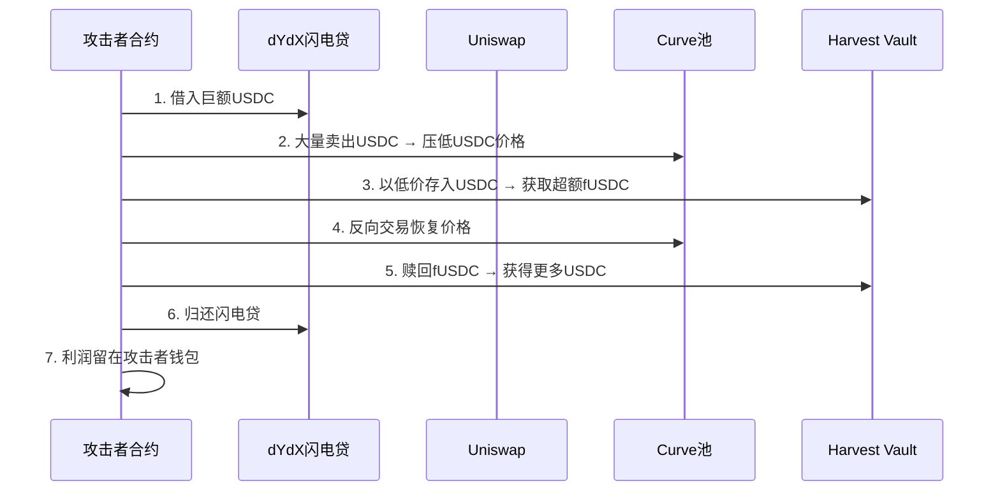
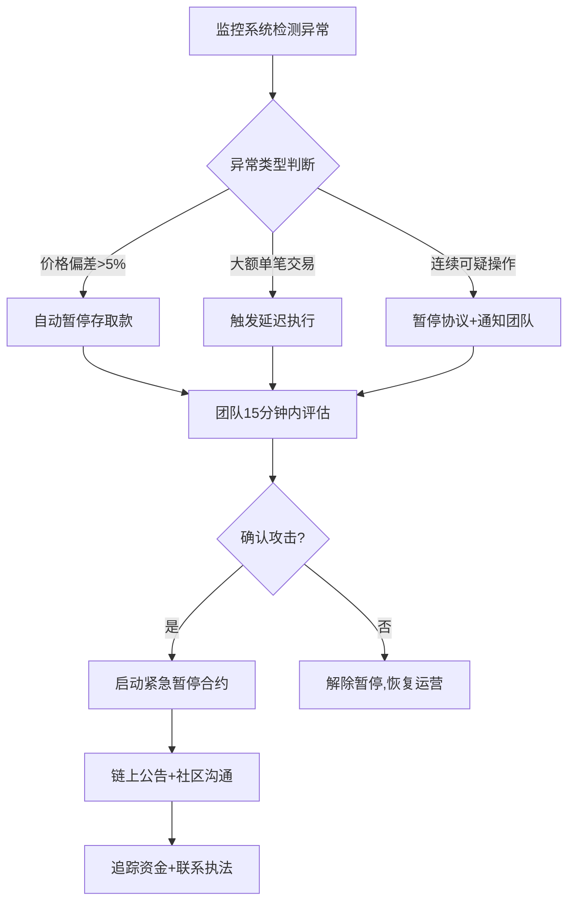

## 23.11 Harvest Finance预言机攻击（2020年）

### 23.11.1 事件概览

2020年10月26日，DeFi收益聚合协议Harvest Finance遭受了一次精心策划的预言机操纵攻击。攻击者利用闪电贷在一笔交易中反复操纵Curve Finance的USDC/USDT稳定币池价格，再利用Harvest Finance依赖Curve池价格作为资产定价来源的漏洞，在低价时存入资产获取超额vault份额，价格恢复后提取获利。整场攻击在7分钟内完成，直接窃取约2400万美元，引发的恐慌性提取导致协议总锁仓量暴跌约3400万美元。

| 关键信息 | 详情 |
|---------|------|
| 攻击日期 | 2020年10月26日 |
| 目标协议 | Harvest Finance（收益聚合器） |
| 攻击手段 | 闪电贷 + Curve池价格操纵 |
| 损失金额 | ~2400万美元直接损失，~3400万美元含恐慌撤资 |
| 被利用资产 | USDC、USDT |
| 攻击网络 | Ethereum主网 |
| 攻击次数 | 同一笔交易内重复约26次 |
| 攻击者归还 | 约250万美元被归还至协议部署者地址 |

### 23.11.2 协议背景与架构

#### Harvest Finance是什么

Harvest Finance是一个去中心化收益聚合器（Yield Aggregator），于2020年9月上线。其核心功能是自动将用户存入的资产分配到各DeFi协议中收益最高的策略中，实现"自动复投"。用户将资产（如USDC、USDT、DAI等稳定币）存入Harvest的vault，获得对应的fToken（如fUSDC）作为份额凭证，协议通过策略合约自动寻找最优收益来源。

#### 核心架构

```text
用户 → 存入USDC → Harvest Vault → 策略合约 → 部署到Curve/Compound/Aave等
         ↓
      获得fUSDC份额
```

Harvest Finance的fToken份额定价公式为：

```text
价格 = 底层资产池总价值(USD) / 已发行的fToken总量
```

关键问题在于：底层资产的USD价值如何确定？Harvest使用了一种轻量级的定价机制——直接从Curve Finance的流动性池中获取即时价格作为参考。

#### Curve Finance的StableSwap机制

Curve Finance是专注于稳定资产交易的去中心化交易所，其核心是StableSwap算法。与Uniswap的常量乘积公式（x·y=k）不同，StableSwap在1:1汇率附近提供极低滑点的交易，但在极端大额交易下仍会出现价格偏差。

Curve的USDC/USDT池在正常情况下，1 USDC ≈ 1 USDT ≈ 1 USD。但当有人用闪电贷借入数千万美元在该池中进行单边大额卖出时，价格会被临时压低——这就是攻击者利用的核心机制。

### 23.11.3 攻击原理深度剖析

#### 预言机脆弱性的本质

预言机（Oracle）是DeFi协议获取外部价格信息的机制。按安全性从低到高排列：

| 预言机类型 | 机制 | 抗操纵性 | 代表协议 |
|-----------|------|---------|---------|
| 即时池价格 | 直接读取DEX当前交易对价格 | 极弱 | 早期Harvest |
| TWAP（时间加权均价） | 取一段时间内的平均价格 | 中等 | Uniswap V2 Oracle |
| Chainlink去中心化预言机 | 多节点聚合链下数据 | 强 | Aave、Compound V2 |
| 多源聚合 | 同时参考多个价格来源+异常过滤 | 很强 | MakerDAO |

Harvest Finance采用的是最脆弱的第一种——直接读取Curve池的即时价格。这意味着任何能在单笔交易内大幅移动Curve池价格的攻击者，都能操纵Harvest的资产定价。

#### 闪电贷的杠杆效应

闪电贷是DeFi特有的无抵押借贷，允许用户在单笔交易内借入巨额资金，只要在同一交易结束前归还即可。这为攻击者提供了几乎无限的资金杠杆：

```text
攻击资金 = 闪电贷借入的数千万美元
攻击成本 = 闪电贷手续费（通常0.09%）+ Gas费
实际利润 = 窃取金额 - 手续费 - Gas费
```

对于本次攻击，攻击者通过dYdX和Uniswap等平台获取闪电贷，单笔交易内可动用的资金量高达数千万美元，足以在Curve池中制造显著的价格偏移。

#### 价格操纵的数学模型

以一个简化的例子说明Curve池价格操纵：

**初始状态（Curve USDC/USDT池）：**
- 池中 USDC: 50,000,000
- 池中 USDT: 50,000,000
- 价格比: 1:1

**攻击者卖出20,000,000 USDC后：**
- 池中 USDC: 70,000,000（增加了）
- 池中 USDT: ~35,714,285（减少了，按StableSwap公式计算）
- 此时1 USDC的"价格"在Curve池中被压低至约0.51 USDT

**Harvest Finance定价被误导：**
- Harvest读取Curve价格 → 认为1 USDC ≈ 0.51 USD
- 用户存入USDC时，按被压低的价格计算vault份额
- 1 USDC本应获得1个vault份额，但因为价格被压低，可以获得约1.96个份额

**价格恢复后：**
- 攻击者将Curve池交易方向反转，或等待套利者恢复价格
- Harvest重新读取Curve价格 → 1 USDC ≈ 1 USD
- 攻击者持有的vault份额价值翻倍
- 提取资产获利

### 23.11.4 攻击全过程还原

#### 攻击步骤时序图



#### 详细攻击流程

**第一步：获取闪电贷资金**

攻击者通过dYdX和Uniswap闪电贷借入大量USDC和USDT。dYdX的闪电贷不收取手续费，降低了攻击成本。

**第二步：操纵Curve池价格**

将借入的大量USDC在Curve的USDC/USDT池中单边抛售。由于StableSwap算法在大额单边交易下会出现价格偏移，USDC的池内价格被压低约3-5%。

**第三步：在Harvest低价存款**

被压低的Curve价格通过Harvest的定价逻辑传导：Harvest认为USDC"不值钱了"，因此攻击者用同样数量的USDC可以获得更多的vault份额（fUSDC）。

**第四步：恢复Curve价格**

攻击者进行反向交易（卖出USDT买入USDC），将Curve池价格恢复到接近1:1。由于Harvest只读取即时价格，价格恢复意味着攻击者持有的vault份额价值上升。

**第五步：高价提取获利**

攻击者赎回fUSDC，由于底层资产的定价已恢复正常，每份fToken可换回更多USDC。差额即为攻击利润。

**第六步：循环攻击**

上述五步在一笔交易内被重复执行了约26次，每次循环放大利润。攻击者利用单笔交易内闪电贷的特性，将每次操纵-获利循环串联执行。

#### 攻击合约分析

攻击者部署了一个专用合约，将上述步骤编码为可循环执行的逻辑。合约的核心逻辑伪代码如下：

```solidity
// 简化的攻击逻辑示意（非实际攻击合约）
function attack() external {
    // 第一步：闪电贷
    uint256 borrowed = flashLoan(usdcAmount);
    
    for (uint i = 0; i < 26; i++) {
        // 第二步：压低Curve价格
        curve.exchange(usdc, usdt, largeAmount, 0);
        
        // 第三步：低价存入Harvest
        uint256 sharesBefore = harvest.balanceOf(address(this));
        usdc.transfer(address(harvest), usdcBalance);
        harvest.deposit(usdcBalance);
        uint256 sharesGained = harvest.balanceOf(address(this)) - sharesBefore;
        
        // 第四步：恢复Curve价格
        curve.exchange(usdt, usdc, usdtBalance, 0);
        
        // 第五步：高价提取
        harvest.withdraw(sharesGained);
    }
    
    // 第六步：归还闪电贷，保留利润
    flashRepay(borrowed);
    // 利润留在合约中
}
```

实际攻击合约更为复杂，涉及跨多个DeFi协议的交互路径优化，但核心逻辑如上所示。

### 23.11.5 漏洞根因分析

#### 直接原因：即时池价格作为预言机

Harvest Finance的定价策略合约直接读取Curve池的即时交易价格来确定资产的USD价值。这种方式存在根本性缺陷：

1. **零时间延迟**：价格即时反映，任何一笔大额交易都能瞬间改变价格信号
2. **单一数据源**：只依赖Curve一个价格来源，没有交叉验证
3. **流动性依赖**：池子流动性决定了价格操纵的成本，但Curve的USDC/USDT池虽然TVL很高，仍无法承受数千万美元级别的单边冲击
4. **无异常检测**：没有价格偏差阈值检查，即使价格偏离5%也不会触发警报

#### 根本原因：信任外部协议的价格信号

Harvest Finance犯了DeFi安全中的经典错误——将外部协议的池状态等同于资产的真实市场价值。在DeFi的可组合性（Composability）范式下，每个协议的状态都可能被其上游协议的操纵所影响。

#### 为什么TWAP也不能完全防御

有人提出使用Uniswap V2的TWAP（时间加权平均价格）可以防御此类攻击。确实，TWAP要求攻击者在较长时间内维持价格偏移，大幅提高了攻击成本。但TWAP也有局限：

- 10分钟TWAP：攻击成本仍然可控，特别是在流动性较低的池中
- 价格滞后：TWAP在真实市场剧烈波动时反应迟钝，可能导致协议在危机中无法及时响应
- 多块操纵：攻击者可以通过跨多个区块的价格操纵来影响TWAP

### 23.11.6 资金流向追踪

攻击者获得约2400万美元的利润后，资金流向如下：

| 去向 | 金额 | 说明 |
|-----|------|------|
| 归还至Harvest部署者地址 | ~250万美元 | 攻击者主动退还，原因不明 |
| 通过Tornado Cash混币 | 大部分资金 | 隐匿资金去向 |
| 转移至多个中间地址 | 部分资金 | 多次跳转增加追踪难度 |
| 留在攻击合约 | 少量 | 合约残余资金 |

攻击者的身份至今未被公开确认。Harvest Finance团队曾公开呼吁攻击者归还资金，并承诺不追究法律责任，但大部分资金未被归还。

### 23.11.7 同类预言机攻击横向对比

Harvest Finance攻击并非孤例，它是DeFi预言机攻击浪潮中的典型案例。以下是同类攻击的对比：

| 攻击事件 | 时间 | 损失 | 预言机弱点 | 攻击手法 |
|---------|------|------|-----------|---------|
| Harvest Finance | 2020.10 | ~$24M | Curve即时价格 | 闪电贷+价格操纵 |
| bZx（第一次） | 2020.02 | ~$350K | Uniswap即时价格 | 闪电贷+价格操纵 |
| bZx（第二次） | 2020.02 | ~$600K | Uniswap即时价格 | 闪电贷+价格操纵 |
| Pancake Bunny | 2021.05 | ~$45M | PancakeSwap即时价格 | 闪电贷+价格操纵 |
| Venus | 2021.05 | ~$100M | Chainlink价格突变 | 价格预言机延迟 |
| Cream Finance | 2021.10 | ~$130M | 多资产定价缺陷 | 闪电贷+价格操纵 |
| Mango Markets | 2022.10 | ~$114M | 自身DEX薄流动性 | 价格操纵+借贷 |

这些攻击共享一个核心模式：**DeFi协议信任了可被操纵的价格来源**。

### 23.11.8 防御方案详解

#### 方案一：使用去中心化预言机

Chainlink等去中心化预言机网络通过多个独立节点从多个数据源获取价格，取中位数后上链。单个节点或数据源的操纵不会影响最终价格。

```solidity
// 使用Chainlink预言机的正确示例
import "@chainlink/contracts/src/v0.8/interfaces/AggregatorV3Interface.sol";

contract SafePriceOracle {
    AggregatorV3Interface internal priceFeed;
    
    constructor() {
        priceFeed = AggregatorV3Interface(
            0x5f4eC3Df9cbd43714FE2740f5E3616155c5b8419 // ETH/USD
        );
    }
    
    function getPrice() public view returns (int256) {
        (
            uint80 roundID,
            int256 price,
            uint startedAt,
            uint updatedAt,
            uint80 answeredInRound
        ) = priceFeed.latestRoundData();
        
        require(price > 0, "Invalid price");
        require(updatedAt > block.timestamp - 3600, "Stale price");
        require(answeredInRound >= roundID, "Stale round");
        
        return price;
    }
}
```

#### 方案二：TWAP + 偏差检查

如果必须使用DEX池价格，至少应采用时间加权平均价格并加入异常检查：

```solidity
// TWAP + 偏差检查示例
contract TWAPOracle {
    struct Observation {
        uint256 timestamp;
        uint256 priceCumulative;
    }
    
    uint256 public constant TWAP_PERIOD = 1800; // 30分钟
    uint256 public constant MAX_PRICE_DEVIATION = 5e16; // 5%
    
    function getTWAPPrice() public view returns (uint256) {
        Observation storage obs0 = observations[0];
        Observation storage obs1 = observations[1];
        
        uint256 timeElapsed = obs1.timestamp - obs0.timestamp;
        require(timeElapsed >= TWAP_PERIOD, "TWAP period not met");
        
        uint256 priceCumulativeDiff = obs1.priceCumulative - obs0.priceCumulative;
        uint256 twapPrice = priceCumulativeDiff / timeElapsed;
        
        // 检查TWAP与即时价格的偏差
        uint256 spotPrice = getSpotPrice();
        uint256 deviation = twapPrice > spotPrice 
            ? (twapPrice - spotPrice) * 1e18 / twapPrice
            : (spotPrice - twapPrice) * 1e18 / spotPrice;
        
        require(deviation < MAX_PRICE_DEVIATION, "Price deviation too high");
        
        return twapPrice;
    }
}
```

#### 方案三：存款/取款滑点保护

即使使用安全的预言机，也应该在存取款操作中加入滑点保护机制：

```solidity
// 带滑点保护的存款函数
function deposit(
    uint256 amount,
    uint256 minShares  // 用户预期最少获得的份额
) external {
    uint256 shares = calculateShares(amount);
    require(shares >= minShares, "Slippage exceeded");
    
    // 额外检查：份额价值不应偏离存款价值的合理范围
    uint256 shareValue = shares * pricePerShare() / 1e18;
    require(
        shareValue >= amount * 99 / 100, // 允许最多1%滑点
        "Abnormal share pricing"
    );
    
    _mintShares(msg.sender, shares);
}
```

#### 方案四：多源聚合 + 异常值过滤

最安全的做法是同时参考多个价格来源，过滤异常值后取加权平均：

```solidity
// 多源聚合预言机
contract MultiSourceOracle {
    struct PriceSource {
        address source;
        uint256 weight;
        bool active;
    }
    
    PriceSource[] public sources;
    uint256 public constant MAX_SOURCES = 5;
    
    function getAggregatedPrice() public view returns (uint256) {
        uint256[] memory prices = new uint256[](MAX_SOURCES);
        uint256 validCount = 0;
        
        // 收集所有源的价格
        for (uint i = 0; i < sources.length; i++) {
            if (!sources[i].active) continue;
            uint256 price = IPriceSource(sources[i].source).getPrice();
            if (price > 0) {
                prices[validCount] = price;
                validCount++;
            }
        }
        
        require(validCount >= 3, "Insufficient price sources");
        
        // 排序并去除最高和最低值（中位数法）
        _sort(prices, validCount);
        
        // 去掉最高和最低
        uint256 medianSum = 0;
        uint256 medianCount = 0;
        for (uint i = 1; i < validCount - 1; i++) {
            medianSum += prices[i];
            medianCount++;
        }
        
        uint256 medianPrice = medianSum / medianCount;
        
        // 检查中位数与各源的偏差
        for (uint i = 0; i < validCount; i++) {
            uint256 deviation = prices[i] > medianPrice
                ? (prices[i] - medianPrice) * 1e18 / medianPrice
                : (medianPrice - prices[i]) * 1e18 / medianPrice;
            require(deviation < 10e16, "Source deviates too much"); // 10%
        }
        
        return medianPrice;
    }
}
```

#### 方案五：存款缓冲期

对于大额存款引入时间锁，给协议和社区留出反应时间：

```solidity
// 带时间锁的存款机制
contract BufferedVault {
    struct PendingDeposit {
        uint256 amount;
        uint256 timestamp;
        uint256 expectedShares;
    }
    
    mapping(address => PendingDeposit) public pendingDeposits;
    uint256 public constant DEPOSIT_DELAY = 10 minutes;
    
    function initiateDeposit(uint256 amount) external {
        pendingDeposits[msg.sender] = PendingDeposit({
            amount: amount,
            timestamp: block.timestamp,
            expectedShares: calculateShares(amount)
        });
        // 转入资产但暂不分配份额
        token.transferFrom(msg.sender, address(this), amount);
    }
    
    function executeDeposit() external {
        PendingDeposit storage dep = pendingDeposits[msg.sender];
        require(dep.amount > 0, "No pending deposit");
        require(
            block.timestamp >= dep.timestamp + DEPOSIT_DELAY,
            "Delay period not elapsed"
        );
        
        // 延迟期结束后，使用最新价格重新计算份额
        uint256 shares = calculateShares(dep.amount);
        
        // 安全检查：份额不应偏离太多
        uint256 deviation = shares > dep.expectedShares
            ? (shares - dep.expectedShares) * 1e18 / dep.expectedShares
            : (dep.expectedShares - shares) * 1e18 / dep.expectedShares;
        require(deviation < 2e16, "Share price deviation too large"); // 2%
        
        _mintShares(msg.sender, shares);
        delete pendingDeposits[msg.sender];
    }
}
```

### 23.11.9 攻击检测与应急响应

#### 链上监控指标

对于收益聚合器项目，以下链上指标应设置实时监控：

| 监控指标 | 异常阈值 | 应对措施 |
|---------|---------|---------|
| 单笔存款金额 | >TVL的1% | 自动暂停存款，人工审查 |
| 短时间内连续存款 | 同一地址3次/10分钟 | 临时冻结该地址 |
| 价格偏差 | >1%相对于多源中位数 | 暂停所有存取款操作 |
| Curve/Uniswap池大额交易 | 单边交易>池子10% | 触发价格预言机切换至备用源 |
| vault份额价格突变 | 5分钟内波动>3% | 紧急暂停并通知团队 |
| 闪电贷大额借款 | >池TVL的5% | 预警并监控后续操作 |

#### 应急响应流程

当检测到异常时，协议应有一套预设的应急响应机制：



#### 紧急暂停（Emergency Pause）

每个DeFi协议都应部署紧急暂停功能，可以在发现攻击时瞬间冻结所有操作：

```solidity
contract EmergencyPausable {
    bool public paused = false;
    address public guardian;
    address public admin;
    
    modifier whenNotPaused() {
        require(!paused, "Protocol is paused");
        _;
    }
    
    // Guardian可以即时暂停（快速响应）
    function emergencyPause() external {
        require(
            msg.sender == guardian || msg.sender == admin,
            "Not authorized"
        );
        paused = true;
        emit EmergencyPaused(msg.sender, block.timestamp);
    }
    
    // 只有Admin可以解除暂停（防止Guardian被攻击后自动解除）
    function unpause() external {
        require(msg.sender == admin, "Not authorized");
        paused = false;
        emit Unpaused(msg.sender, block.timestamp);
    }
}
```

### 23.11.10 对DeFi安全设计的深远影响

Harvest Finance攻击对整个DeFi生态系统产生了深远影响：

#### 1. 预言机安全成为DeFi设计核心

此事件后，几乎所有主流DeFi协议都将预言机安全提升为最高优先级。Aave、Compound等协议从Uniswap V2 TWAP迁移到Chainlink，MakerDAO构建了多源聚合的Medianizer系统。

#### 2. 闪电贷攻击成为DeFi安全的头号威胁

Harvest Finance攻击证明了闪电贷可以在零成本前提下放大任何微小的经济漏洞。此后，DeFi安全审计将"闪电贷攻击向量"列为必检项目。

#### 3. 推动了协议间安全标准的建立

- ERC-4626（Tokenized Vault Standard）标准化了vault的接口和行为
- DeFi Safety等评级机构开始评估协议的预言机安全性
- 出现了专业化的预言机安全服务（如Chainlink、Pyth、Band Protocol）

#### 4. 协议间的隐性依赖关系被重新审视

DeFi的可组合性既是优势也是风险。Harvest Finance依赖Curve的价格信号，而Curve的池状态又受dYdX闪电贷影响——这种多层依赖关系在攻击前被忽视，此后成为安全审计的重点审查内容。

### 23.11.11 防御清单：收益聚合器安全自查

以下是收益聚合器项目应遵循的安全检查清单：

**预言机安全：**
- 不使用单一DEX池的即时价格作为定价来源
- 使用去中心化预言机（Chainlink、Pyth）或TWAP+多源聚合
- 设置价格偏差阈值，超过阈值自动暂停
- 预言机数据源定期轮换审查

**闪电贷防护：**
- 存取款操作不依赖同区块内的价格信号
- 大额操作引入时间锁或延迟执行
- 监控同区块内的闪电贷活动

**资金安全：**
- 单笔存款设置上限（不超过TVL的N%）
- 存取款操作设置滑点保护
- vault份额计算使用保守的价格估算

**运营安全：**
- 部署紧急暂停功能，Guardian和Admin分离
- 建立7×24小时链上监控和告警系统
- 制定应急响应手册并定期演练
- 购买DeFi保险（Nexus Mutual、InsurAce等）

**审计与测试：**
- 至少两家独立安全公司审计
- 模拟闪电贷攻击的集成测试
- 主网部署前进行长期测试网运行

### 23.11.12 总结

Harvest Finance预言机攻击是DeFi安全史上的标志性事件。它揭示了一个核心教训：在可组合的DeFi世界中，任何依赖外部协议状态作为安全假设的设计都可能成为攻击面。闪电贷将原本需要巨额资金才能执行的价格操纵攻击成本降至几乎为零，使得即使微小的定价漏洞也能被规模化利用。

这场攻击催生了DeFi行业对预言机安全的系统性重视，推动了Chainlink等去中心化预言机的广泛采用，也为后续的收益聚合器协议建立了安全设计的基准。对于今天的DeFi开发者和安全研究者而言，理解Harvest Finance攻击的每一个细节，是构建安全DeFi协议的基本功。
