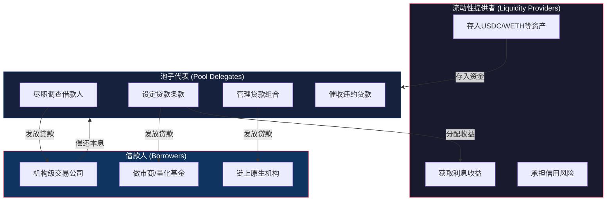
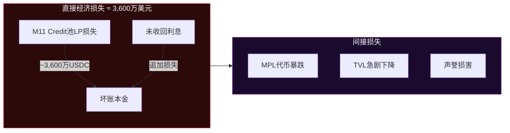
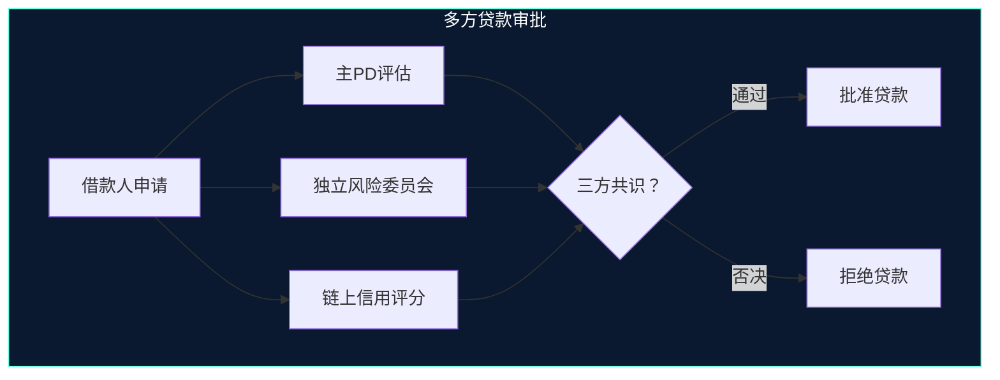

## 23.12 Maple Finance信用攻击（2022年）

### 23.12.1 概述

2022年12月，DeFi信用协议Maple Finance遭遇了由借款人Orthogonal Trading引发的大规模信用违约事件，导致约3,600万美元坏账。与典型的智能合约漏洞利用不同，这是一起纯粹的**信用风险事件**——借款人隐瞒了在FTX交易所破产中的重大损失，持续从Maple资金池中借贷直至无力偿还。

这起事件暴露了DeFi生态中一个被长期忽视的威胁面：当去中心化协议引入链下信用评估和机构借贷时，链上透明度并不能消除信息不对称带来的系统性风险。

| 项目 | 详情 |
|------|------|
| 协议 | Maple Finance（去中心化信用协议） |
| 攻击类型 | 信用欺诈 / 对手方风险 |
| 违约方 | Orthogonal Trading |
| 损失金额 | 约3,600万美元 |
| 发生时间 | 2022年12月 |
| 根本原因 | 借款人隐瞒FTX破产损失、Pool Delegate尽职调查失效 |
| 智能合约漏洞 | 无——纯信用/信息层面的攻击 |

### 23.12.2 Maple Finance协议架构深度解析

#### 23.12.2.1 什么是Maple Finance

Maple Finance是一个建立在以太坊和Solana上的去中心化机构借贷市场，由Sid Powell和Joe Flanagan于2021年创立。与Aave、Compound等超额抵押DeFi借贷协议不同，Maple的核心创新在于**低抵押甚至无抵押的机构贷款**——这在DeFi中属于高风险高收益的赛道。

Maple的设计理念是：链上DeFi借贷市场被过度抵押模型限制了效率，真实世界的机构借款人需要更灵活的融资条件。要实现这一点，就必须引入信用评估和对手方风险管控——而这正是此次事件的核心矛盾所在。

#### 23.12.2.2 三层角色模型

Maple Finance的协议架构包含三个核心角色，形成了一个委托代理链：



**流动性提供者（LP）**：将资产（主要是USDC）存入特定的资金池，获取利息收益，但需要承担底层借款人的违约风险。LP是整个链条中的"最后买单人"。

**池子代表（Pool Delegate，简称PD）**：这是Maple架构中最关键的中间层。PD负责对借款人进行尽职调查（KYC/KYB）、信用评估、设定贷款条款（利率、期限、抵押率）、持续监控借款人财务状况，并在违约时进行催收。PD通常是由专业信贷机构运营，如M11 Credit、Orthogonal Credit等。

**借款人（Borrower）**：机构级交易公司、做市商、量化基金等，通过Maple获取低于DeFi超额抵押模型要求的融资条件。

#### 23.12.2.3 贷款流程

一笔典型的Maple贷款经历以下生命周期：

```text
1. 借款人向Pool Delegate提交借贷申请
   ↓
2. PD进行KYC/KYB、信用评估、财务审计
   ↓
3. PD设定贷款条款（利率、期限、抵押率、违约条款）
   ↓
4. 贷款在链上创建为智能合约
   ↓
5. 资金从资金池转入借款人钱包
   ↓
6. 借款人按时偿还利息（通常每30天）
   ↓
7. 到期时偿还本金，或申请展期
   ↓
8. 违约时，PD启动催收程序
```

#### 23.12.2.4 设计缺陷分析

Maple的架构存在几个深层设计缺陷，这些缺陷直接导致了此次事件的发生：

**缺陷一：PD利益冲突**。PD从贷款管理中收取管理费和绩效费，这意味着PD有动机扩大贷款规模而非加强风控。当PD既负责放贷决策又从贷款规模中获利时，"把关人"变成了"推门人"。

**缺陷二：信息不对称的结构性矛盾**。Maple引入链下信用评估（KYC/KYB、财务报表审查），但这些信息并不在链上公开。LP无法自行验证借款人的财务状况，只能信任PD的判断。这与DeFi"公开透明"的核心理念直接矛盾。

**缺陷三：缺乏强制性链上验证**。贷款虽然在链上创建为智能合约，但借款人的抵押物状况、财务健康度等关键信息完全依赖链下审查。没有任何链上机制能够自动触发"借款人FTX敞口过大"之类的预警。

**缺陷四：违约追偿依赖链下法律行动**。与超额抵押DeFi协议不同，Maple的低抵押贷款一旦违约，追偿需要通过传统法律手段（诉讼、仲裁等），这既慢又贵，且跨境执行极其困难。

### 23.12.3 事件详细时间线

#### 23.12.3.1 前情：FTX崩盘的连锁反应

要理解Maple事件，必须先理解其上游触发因素——FTX交易所崩盘。

2022年11月2日，CoinDesk披露了Alameda Research（FTX关联公司）资产负债表的异常。11月6日开始，FTX遭遇大规模挤兑。11月11日，FTX、Alameda Research及130多家关联公司正式申请破产保护。

FTX破产的影响远超交易所本身。大量加密交易公司、做市商、量化基金在FTX上持有大量资产，这些资产在一夜之间被冻结。Orthogonal Trading就是其中之一。

#### 23.12.3.2 Orthogonal Trading的财务状况恶化

Orthogonal Trading是一家加密交易公司，在Maple Finance平台上是最大的借款人之一。该公司通过Maple的多个资金池获取了大量贷款，用于做市和套利交易。

FTX破产后，Orthogonal Trading遭受了严重的资产损失——该公司在FTX上持有大量资金，随着FTX申请破产保护，这些资金被冻结且短期内无法取回。据事后分析，Orthogonal Trading在FTX的损失可能达到其总资产的相当比例，直接导致其偿付能力大幅下降。

#### 23.12.3.3 关键转折：隐瞒与持续借贷

**这是此次事件中最关键、也是最具争议的环节。**

在FTX破产后，Orthogonal Trading并未向Maple Finance的Pool Delegates（M11 Credit、Orthogonal Credit）如实披露其在FTX的损失情况。相反，该公司：

1. **继续正常偿还既有贷款的利息**，维持表面的财务健康
2. **申请并获得新的贷款**，将从Maple获取的资金用于弥补其他头寸的损失
3. **隐瞒真实的财务状况**，未在PD要求的定期财务报告中披露FTX敞口

这种行为构成**故意欺诈（fraud）**而非单纯的信用恶化。Orthogonal Trading在明知自身偿付能力不足的情况下，选择隐瞒真相并继续借贷，本质上是用后来LP的资金填补自己的窟窿。

#### 23.12.3.4 违约爆发

2022年12月初，Orthogonal Trading的财务困境终于无法掩盖。当Pool Delegate M11 Credit对Orthogonal Trading进行例行审查时，发现了其隐瞒的FTX敞口。

M11 Credit随即向Maple Finance社区披露了这一情况。关键事实如下：

| 项目 | 数据 |
|------|------|
| 违约贷款总额 | 约3,600万美元（含本金和利息） |
| 涉及资金池 | M11 Credit管理的USDC池 |
| 未偿本金 | 约3,600万USDC |
| 抵押物 | 极低或几乎为零 |
| Orthogonal Trading财务状态 | 资不抵债 |

#### 23.12.3.5 Orthogonal Credit与Orthogonal Trading的关系

事件中一个容易混淆的点是**Orthogonal Credit**和**Orthogonal Trading**的关系。

两者虽然名称相近且存在关联，但在Maple生态中扮演不同角色：

- **Orthogonal Trading**：借款人，从Maple资金池中获取贷款用于交易
- **Orthogonal Credit**：Pool Delegate，负责另一个资金池的贷款管理和信用评估

事件爆发后，M11 Credit迅速与Orthogonal Trading划清界限并暂停了相关贷款。同时，Orthogonal Credit也因与Orthogonal Trading的关联关系而面临信任危机，其管理的资金池也受到影响。

### 23.12.4 损失分析与影响评估

#### 23.12.4.1 直接经济损失



直接损失为M11 Credit管理的资金池中约3,600万美元贷款无法收回。由于这些贷款几乎没有超额抵押，LP的损失接近100%。

#### 23.12.4.2 协议层面的连锁影响

**TVL暴跌**：事件发生后，Maple Finance的总锁仓价值（TVL）急剧下降。从2022年高峰期的约9亿美元TVL，在事件后数周内暴跌至约5,000万美元左右，降幅超过90%。这不是全部由此次事件直接造成，但此次事件是FTX破产潮之后的致命一击。

**MPL代币价格下挫**：Maple的原生代币MPL在事件后显著下跌，反映了市场对协议信用管理能力的严重质疑。

**其他借款人恐慌**：Maple上的其他借款人和Pool Delegate感受到了系统性的信任危机，部分PD主动加强了贷后管理，部分LP开始撤资。

#### 23.12.4.3 DeFi信用赛道的整体冲击

Maple Finance事件不仅影响了协议本身，还波及了整个DeFi信用借贷赛道。其他类似的无抵押/低抵押DeFi借贷协议（如TrueFi、Clearpool、Goldfinch等）也受到投资者的审视——"Maple的模式可能在其他协议上重演吗？"

### 23.12.5 根因分析：超越表面的深层原因

#### 23.12.5.1 信息不对称（Information Asymmetry）

这是此次事件的最根本原因。在传统金融中，信息不对称通过以下机制缓解：

| 机制 | 传统金融 | Maple Finance（事件时） |
|------|----------|------------------------|
| 监管披露 | 强制性定期财报（SEC要求的10-K/10-Q） | 依赖PD自行要求，无标准化 |
| 信用评级 | 穆迪/标普等第三方评级 | 无独立第三方评级 |
| 审计 | 年度审计由四大/八大会计事务所执行 | 无强制审计要求 |
| 存款保险 | FDIC/存款保险基金 | 无任何保险 |
| 司法追偿 | 完善的破产法和债权人保护 | 链下法律追偿困难 |

Orthogonal Trading正是利用了这种信息不对称——它知道自己的真实财务状况，但PD和LP不知道。在FTX破产后，Orthogonal Trading选择隐瞒而非披露，将损失转嫁给了Maple的LP。

#### 23.12.5.2 激励机制错位

Maple的激励结构存在根本性问题：

**Pool Delegate的激励错位**：PD的收入主要来自管理费（按AUM百分比）和绩效费（按利息收入百分比）。这意味着PD有动机扩大贷款规模以增加管理费收入，而"拒绝高风险贷款"虽然保护了LP利益，却直接减少了PD的收入。

**缺乏"吹哨人"激励**：在Maple的架构中，没有任何机制激励外部参与者发现并报告借款人的财务异常。这与传统金融市场中做空者、调查记者等"民间监管力量"的角色形成对比。

**违约成本外化**：当借款人违约时，损失由LP承担，PD虽然面临声誉损失，但已经收取的管理费和绩效费不会退还。这种"利润私有化、损失社会化"的结构是金融风险事件的典型根源。

#### 23.12.5.3 "去中心化"标签下的信任假象

Maple Finance虽然自称"去中心化"信用协议，但实际上高度依赖几个中心化环节：

1. **Pool Delegate是中心化决策节点**：贷款批准、条款设定、违约催收全部由PD人工决策
2. **借款人身份是中心化的**：只有通过KYC/KYB的机构才能借款
3. **信用评估是链下的**：财务报表审查、信用评分完全在链下完成
4. **违约追偿是链下的**：需要通过传统法律手段

这种"去中心化前端 + 中心化后端"的混合架构，给投资者传递了一个危险的模糊信号：他们可能因为"DeFi"标签而低估了实际风险。

#### 23.12.5.4 系统性风险传导

2022年的加密市场经历了一系列系统性冲击事件：

```text
2022年5月：Terra/LUNA崩盘 → 三箭资本破产
    ↓
2022年6月：Celsius/Voyager破产 → 流动性危机加深
    ↓
2022年11月：FTX破产 → 全行业资产冻结
    ↓
2022年12月：Orthogonal Trading违约 → Maple Finance危机
```

每一轮冲击都在消耗行业内的信任储备和流动性缓冲。Orthogonal Trading的违约发生在FTX破产之后仅一个月，这不是巧合——FTX事件暴露了一批在流动性宽松时期被掩盖的脆弱机构。

### 23.12.6 与超额抵押DeFi协议的对比分析

为了理解此次事件的特殊性，有必要将Maple的信用风险与超额抵押DeFi协议的智能合约风险进行对比：

| 对比维度 | 超额抵押DeFi（Aave/Compound） | Maple Finance信用贷款 |
|----------|-------------------------------|---------------------|
| 抵押率 | 150%-200%超额抵押 | 0%-50%低抵押 |
| 风险类型 | 智能合约漏洞、预言机操控 | 信用违约、信息欺诈 |
| 透明度 | 完全链上、任何人可审计 | 信用评估在链下、LP无法验证 |
| 违约处理 | 自动清算抵押物 | 依赖法律追偿、时间长 |
| 损失上限 | 超额抵押通常可覆盖 | 可能接近100%本金损失 |
| 风险定价 | 基于链上数据（TVL、清算阈值） | 基于链下信用评估（主观） |
| 典型损失案例 | 智能合约被黑（如Euler、Cream） | 借款人违约（如Orthogonal） |

这个对比揭示了一个关键洞察：**DeFi的"可组合性"和"透明度"优势在信用借贷场景中并不适用**。当协议引入链下信任假设时，DeFi的技术栈（智能合约、区块链、透明账本）无法自动消除传统金融中的信用风险。

### 23.12.7 防御策略与风控改进建议

#### 23.12.7.1 对DeFi协议的设计建议

**1. 强制性链上财务披露**

协议应要求借款人在链上发布加密证明（如零知识证明），证明其关键财务指标（资产负债率、流动性储备、集中度风险）在安全阈值内。不需要披露具体数字，只需要证明合规性。

```solidity
// 概念性智能合约：链上信用监控
interface ICreditMonitor {
    // 借款人必须定期提交加密财务证明
    function submitFinancialProof(
        bytes32 proofHash,
        uint256 timestamp,
        bytes calldata zkProof
    ) external;
    
    // 如果借款人超过N天未提交证明，自动冻结新贷款
    function checkCompliance(address borrower) external view returns (bool);
    
    // 触发公开审计：任何人可以挑战借款人的财务声明
    function challengeFinancialStatement(
        address borrower,
        bytes calldata counterProof
    ) external;
}
```

**2. 分散化Pool Delegate权力**

将贷款审批从单一PD决策改为多方投票机制：



**3. 实时监控与自动熔断**

在智能合约层面实现自动化的风险熔断机制：
- 当单一借款人敞口超过资金池总额的一定比例（如15%），自动暂停新增贷款
- 当借款人在其他协议上的异常行为被检测到（如大规模提取），自动触发审查
- 当市场波动率指数（如VIX对应物）超过阈值，自动收紧信贷条件

**4. 违约保险基金**

协议应建立保险基金，从每笔贷款利息中提取一定比例（如5%-10%）作为违约准备金。当违约发生时，保险基金先行赔付LP的部分损失。

#### 23.12.7.2 对流动性提供者（LP）的风控建议

**1. 分散化原则**

永远不要将超过一定比例的资金集中在一个借款人或一个Pool Delegate上。具体建议：

| 风控维度 | 建议阈值 | 说明 |
|----------|----------|------|
| 单一借款人敞口 | < 10% | 任一借款人不超过资金池总额的10% |
| 单一PD敞口 | < 25% | 任一Pool Delegate管理的资金不超过总额的25% |
| 单一协议敞口 | < 40% | 不超过总投资额的40%放在同一协议 |
| 单一链上 | < 50% | 不超过50%放在同一公链 |

**2. 主动监控**

LP不应被动等待PD的报告，而应主动监控：
- 链上资金流向：借款人是否将借到的资金用于高风险操作？
- 合约交互模式：借款人是否与大量可疑合约交互？
- 还款行为：是否存在延迟还款或最低还款额的模式？
- 链上身份分析：借款人的地址是否与已知的高风险实体关联？

**3. 压力测试**

定期进行个人投资组合的压力测试：
- 如果最大借款人违约，我的损失是多少？
- 如果PD管理的资金池出现系统性违约，我还能承受吗？
- 如果整个协议被暂停，我的流动性被锁定多久？

#### 23.12.7.3 对借款人的合规建议

对于合法运营的机构借款人，此次事件也提供了重要的合规教训：

1. **主动披露胜于被动暴露**：如果Orthogonal Trading在FTX破产后立即向PD披露损失并寻求展期或重组，结果可能完全不同。隐瞒只会将可控的信用事件变成不可挽回的信任危机。
2. **多元化融资来源**：过度依赖单一融资渠道（如Maple）增加了"融资挤兑"的风险。
3. **保持流动性缓冲**：在高波动的加密市场中，应始终保持足以覆盖数月利息支出的流动性储备。

### 23.12.8 与传统金融信用风险事件的类比

Maple Finance事件并非加密世界独有的现象，它与传统金融中的信用风险事件有着深刻的相似性。

#### 23.12.8.1 与安然事件的类比

安然（Enron）于2001年因会计欺诈而破产，其核心手法与Orthogonal Trading惊人相似：

| 对比维度 | 安然（2001年） | Orthogonal Trading（2022年） |
|----------|---------------|---------------------------|
| 核心手法 | 隐藏债务、虚增利润 | 隐藏FTX损失、维持正常还款表象 |
| 信息优势 | 管理层知道真实财务状况 | 管理层知道FTX敞口 |
| 中介失效 | 会计师事务所安达信未能发现 | Pool Delegate未能及时发现 |
| 触发事件 | 《财富》记者调查 | M11 Credit例行审查 |
| 连锁影响 | 加强了SOX法案和审计监管 | 推动了DeFi信用风控改革 |

#### 23.12.8.2 与2008年次贷危机的类比

在更宏观的层面，DeFi信用市场的风险结构与2008年次贷危机有相似之处：

**风险转移链**：在次贷危机中，风险从借款人→抵押贷款发起人→证券化机构→投资者，每一层都有信息损耗。在DeFi信用市场中，风险从借款人→Pool Delegate→资金池→LP，同样存在委托代理问题和信息损耗。

**评级失效**：次贷危机中，评级机构未能准确评估MBS的风险；DeFi信用市场中，Pool Delegate的信用评估同样可能失效。

**流动性错觉**：在市场平稳时期，两个体系都表现出"低风险、高收益"的特征，吸引了大量资金。但当系统性冲击来临时，才发现底层资产质量远低于预期。

### 23.12.9 Maple Finance的后续改革

事件发生后，Maple Finance采取了一系列改革措施：

#### 23.12.9.1 Maple 2.0

Maple Finance在2023年推出了Maple 2.0版本，主要改进包括：

1. **强化PD准入机制**：提高了Pool Delegate的资本金要求和背景审查标准
2. **引入链上透明度工具**：要求PD定期在链上发布贷款组合的概要信息
3. **改进违约处理流程**：明确了违约时的资产追偿程序和时间表
4. **建立保险机制**：从贷款利息中提取部分资金作为违约准备金
5. **多样化资产类型**：从单一USDC贷款扩展到更多资产类型和贷款结构

#### 23.12.9.2 生态重建

Maple在事件后逐步重建了TVL和市场信任。到2023年下半年至2024年，协议TVL有所回升，但始终未恢复到2022年的峰值。这一事实说明：**信用信任一旦被破坏，重建的成本远高于建立的初始成本。**

### 23.12.10 其他DeFi信用风险事件对比

Maple Finance事件并非孤立案例，2022年加密寒冬中暴露的信用风险事件包括：

| 事件 | 时间 | 损失 | 机制 | 与Maple的相似性 |
|------|------|------|------|-----------------|
| 三箭资本破产 | 2022年6月 | 数十亿美元 | 过度杠杆、Terra敞口 | 都是机构借款人隐瞒风险敞口 |
| Celsius破产 | 2022年6月 | ~47亿美元 | 资产负债错配 | 都涉及流动性错配和用户信任 |
| Voyager Digital | 2022年7月 | ~6.5亿美元 | 向三箭资本发放无抵押贷款 | 无抵押贷款违约的直接后果 |
| TrueFi违约 | 2022年 | 数百万美元 | 借款人信用恶化 | 同为DeFi无抵押贷款违约 |

这些事件共同指向一个结论：**2022年加密寒冬本质上是一次信用收缩周期**，类似于传统金融中"潮退了才知道谁在裸泳"的规律。

### 23.12.11 安全研究者的分析框架

对于区块链安全研究者和审计人员，Maple Finance事件提供了一个分析DeFi信用风险的系统框架：

#### 23.12.11.1 信用风险评估检查清单

```text
□ 借款人识别
  □ 是否有可靠的KYC/KYB？
  □ 借款人的链上行为是否可追溯？
  □ 是否存在关联地址或关联实体？

□ 信用评估
  □ 信用评估模型是否透明可审计？
  □ 是否有独立的第三方信用评级？
  □ 财务数据是否有链上验证机制？

□ 抵押物分析
  □ 抵押率是否足以覆盖极端市场波动？
  □ 抵押物类型是否多样化？
  □ 抵押物的流动性如何？

□ 监控机制
  □ 是否有实时的链上监控？
  □ 是否有自动化的预警阈值？
  □ 异常行为检测的灵敏度如何？

□ 违约处理
  □ 违约追偿的法律框架是否清晰？
  □ 是否有保险基金覆盖部分损失？
  □ 清算机制是否自动且公平？

□ 治理与透明度
  □ 协议的重大决策是否去中心化？
  □ 贷款组合信息是否定期公开？
  □ 是否有有效的"吹哨人"机制？
```

#### 23.12.11.2 链上监控方法

安全研究者可以通过以下链上工具监控DeFi信用协议的健康度：

**1. 资金流向分析**：使用Dune Analytics、Nansen等工具追踪借款人地址的资金流向，检测是否存在异常的大额转出、与高风险协议的交互、或向已知问题地址的转账。

**2. 还款行为监控**：监控贷款的还款模式——延迟还款、最低还款额还款、或突然的提前还款（可能意味着借款人准备跑路）。

**3. 关联图谱**：构建借款人、PD、关联实体之间的资金关系图谱，识别潜在的利益冲突和关联交易。

**4. 市场指标**：监控协议代币价格、TVL变化、新贷款发放速度等指标，作为市场信心的晴雨表。

### 23.12.12 总结与启示

Maple Finance信用攻击事件是DeFi安全史上一个具有里程碑意义的案例。它的意义不在于技术复杂性，而在于揭示了一个根本性问题：**当DeFi协议试图引入传统金融的信用功能时，是否也继承了传统金融的信用风险？**

核心启示如下：

**对协议设计者**：链上透明度不能替代链下信息的真实性验证。任何引入链下信任假设的DeFi协议，都必须设计对应的防欺诈机制，而不是依赖"去中心化"标签来回避这个问题。

**对投资者/LP**：DeFi中"无许可"和"去中心化"不等于"低风险"。投资者必须理解自己的资金在被谁使用、用于什么目的、以及当事情出错时的追偿路径是什么。

**对借款人**：在加密市场的高波动环境中，主动披露风险事件并寻求协商重组，几乎总是优于隐瞒并赌博市场反弹。

**对监管机构**：DeFi信用市场需要适度的监管框架，既保护投资者利益，又不扼杀创新。可能的方向包括强制性信息披露要求、独立审计要求、以及DeFi特定的存款保险机制。

**对安全研究者**：区块链安全不仅是智能合约审计。随着DeFi向更复杂的金融功能演进，安全研究的范围也必须扩展到信用风险、操作风险、治理风险等更广泛的领域。

这一案例深刻地说明了一个道理：**代码可以是无信任的（trustless），但借贷永远需要信任（trust）。** 当DeFi试图在两者之间架桥时，任何一端的薄弱环节都可能成为整个系统崩溃的起点。
