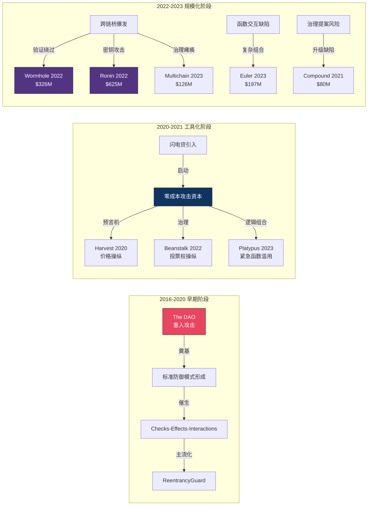
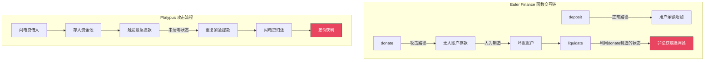
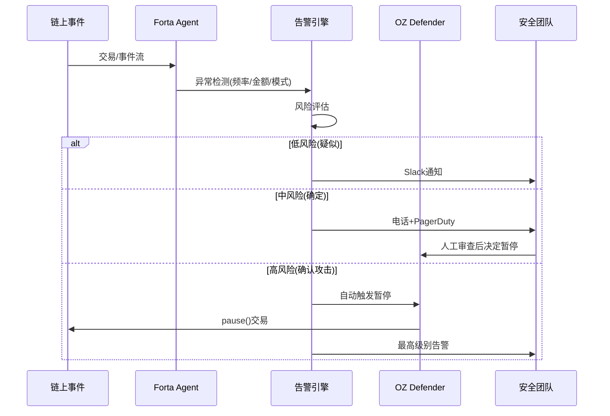

## 23.13 案例综合分析

前11节逐一剖析了2016年至2023年间DeFi和区块链领域最重大的安全事件。从The DAO的经典重入漏洞到Platypus的紧急提款逻辑缺陷，从Ronin的国家级社会工程学到Multichain的单点治理灾难——每一个案例都从独特角度揭示了去中心化系统安全的脆弱面。本节进行系统性综合分析，覆盖全部11个案例，提炼跨案例的共性规律、攻击演化的深层趋势，并形成可落地的综合防御体系。

### 23.13.1 案例全景与攻击类型分布

#### 23.13.1.1 全案例一览表

截至2024年底，前11个案例累计损失超过**15.6亿美元**。下表按时间顺序汇总所有案例的核心数据：

| 序号 | 事件 | 时间 | 损失（约） | 攻击类型 | 核心根因 | 攻击者动机 |
|------|------|------|-----------|----------|---------|-----------|
| 1 | The DAO | 2016.06 | 360万ETH（$60M） | 重入攻击 | Checks-Effects模式违反 | 经济利益 |
| 2 | Harvest Finance | 2020.10 | $34M | 预言机操纵 | 单池价格预言机 + 闪电贷 | 经济利益 |
| 3 | Compound | 2021.09 | $80M | 治理提案漏洞 | 升级代码条件判断错误 | 无（协议bug） |
| 4 | Wormhole | 2022.02 | $326M | 验证绕过 | Solana sysvar未校验 | 经济利益 |
| 5 | Ronin Bridge | 2022.03 | $625M | 密钥泄露/社会工程 | 验证者密钥集中管理 | 国家级（Lazarus） |
| 6 | Beanstalk | 2022.04 | $182M | 治理攻击 | 闪电贷投票权 + 无时间锁 | 经济利益 |
| 7 | Curve Finance | 2022.08 | $0.575M | 前端DNS劫持 | DNS记录被篡改 | 钓鱼用户 |
| 8 | Multichain | 2023.07 | $126M | 单点治理失败 | CEO被捕致MPC密钥失控 | 争议（内部/外部） |
| 9 | Euler Finance | 2023.03 | $197M | 逻辑交互漏洞 | donate + 清算函数组合缺陷 | 经济利益（后归还） |
| 10 | Platypus | 2023.02 | $8.5M | 闪电贷 + 逻辑漏洞 | 紧急提款函数"忘记清零" | 经济利益 |
| 11 | Maple Finance | 2022.12 | $36M | 信用违约 | 借款人欺诈（FTX影响） | 信用风险 |

#### 23.13.1.2 攻击类型分布（更新版）

以11个案例为基础，DeFi攻击类型的分布更为立体：

| 攻击类型 | 案例数 | 占比 | 累计损失 | 平均损失 | 典型案例 |
|----------|--------|------|---------|---------|---------|
| 智能合约逻辑漏洞 | 4 | 36.4% | ~$345M | ~$86M | The DAO, Euler, Compound, Platypus |
| 预言机操纵 | 1 | 9.1% | ~$34M | ~$34M | Harvest Finance |
| 验证/签名绕过 | 1 | 9.1% | ~$326M | ~$326M | Wormhole |
| 密钥泄露/社会工程 | 1 | 9.1% | ~$625M | ~$625M | Ronin Bridge |
| 治理机制攻击 | 1 | 9.1% | ~$182M | ~$182M | Beanstalk |
| 单点治理失败 | 1 | 9.1% | ~$126M | ~$126M | Multichain |
| 信用/对手方风险 | 1 | 9.1% | ~$36M | ~$36M | Maple Finance |
| 前端/基础设施攻击 | 1 | 9.1% | ~$0.575M | ~$0.575M | Curve DNS |

**关键发现**：

- **智能合约逻辑漏洞仍是最大类（36.4%）**，但已从单一重入漏洞演化为多函数交互的组合缺陷
- **运营/治理类攻击（密钥泄露+单点治理+信用风险=27.3%）的损失最大**，三案合计$787M，占总损失一半以上——技术漏洞虽然频繁，但人因失误的代价更惨重
- **跨链桥是最高价值目标**：Wormhole + Ronin + Multichain 三案合计损失 $1.077B，占全部损失的 **69%**
- **治理机制的漏洞近年才被充分认识**：Beanstalk和Compound暴露了投票权计算和提案升级流程的缺陷

### 23.13.2 攻击手法演化全景

将11个案例按时间排列，可以清晰观察到区块链攻击手法的四条演化主线：



#### 23.13.2.1 主线一：从单一漏洞到组合攻击

| 时期 | 特点 | 代表案例 | 漏洞数量/次 | 攻击复杂度 |
|------|------|---------|-----------|-----------|
| 2016 | 单一漏洞利用 | The DAO（1个重入点） | 1 | 低 |
| 2020 | 双要素组合 | Harvest（闪电贷+预言机） | 2 | 中 |
| 2022 | 多要素组合 | Beanstalk（闪电贷+治理+紧急执行） | 3+ | 高 |
| 2023 | 深度函数交互 | Euler（清算+donta+重组逻辑链） | 4+ | 极高 |

**早期（2016-2020）**：The DAO攻击只涉及一个函数的一次重入调用。防御也相对简单——遵循Checks-Effects-Interactions模式即可。

**中期（2020-2021）**：闪电贷的发明（2020年Aave V1引入）彻底改变了攻击经济学。Harvest Finance的预言机操纵攻击首次大规模展示了"零成本+高杠杆"的攻击模式。攻击者不再需要大量初始资本，只需一笔交易中完成借入→操纵→存入→恢复→提取的全部步骤。

**后期（2022-2023）**：Euler攻击涉及donate()、liquidate()、swap()等多个函数的不正当组合，任何单一的静态分析工具都难以发现这类跨函数的逻辑缺陷。Platypus的紧急提款函数漏洞则是从"最不可能出问题"的路径中挖掘出的突破口。

#### 23.13.2.2 主线二：从链上到链下

| 攻击层面 | 2016-2020 | 2020-2022 | 2022-2023 |
|----------|-----------|-----------|-----------|
| 链上（合约） | The DAO, Harvest | Wormhole, Beanstalk, Euler, Platypus | 持续进化 |
| 链下（治理/运营） | — | Compound（治理提案） | Multichain（单点治理） |
| 链下（密钥/人员） | — | Ronin（社会工程） | Multichain（CEO被捕） |
| 链下（基础设施） | — | Curve（DNS劫持） | — |

**观察**：2016年所有攻击都在链上完成；到2023年，链下攻击向量（DNS、密钥、人员、治理）已占到案例数的45%。攻击面的扩展意味着传统智能合约审计不足以覆盖全部风险。

#### 23.13.2.3 主线三：从个人攻击者到国家级组织

| 时期 | 攻击者画像 | 代表案例 | 资源水平 | 攻击持久性 |
|------|-----------|---------|---------|-----------|
| 2016 | 技术极客/白帽争议 | The DAO | 个人 | 一次性 |
| 2020-2021 | 职业黑客团队 | Harvest, Compound | 小团队 | 数天准备 |
| 2022 | 有组织犯罪/国家级 | Ronin(Lazarus), Wormhole | 国家级 | 数周准备+持续攻击 |
| 2023 | 混合（内外部争议） | Euler, Multichain, Platypus | 团队级 | 可能涉及内部信息 |

Ronin Bridge攻击被美国财政部明确归因于朝鲜Lazarus组织，标志着区块链攻击正式进入"国家级威胁"时代。Lazarus具备持续的社会工程学渗透能力（数月潜伏获取信任）、对加密基础设施的深度理解（精准攻击SKy Mavis的AWS凭据），以及资金洗白网络（使用Tornado Cash + 混币器）。这也解释了为什么运营安全类案件在损失规模上远超纯技术漏洞类案件。

#### 23.13.2.4 主线四：从追索难到可谈判

| 案例 | 损失 | 追回比例 | 追回方式 | 时间 |
|------|------|---------|---------|------|
| The DAO | $60M | 100% | 以太坊硬分叉（社区治理） | 数周 |
| Wormhole | $326M | 100% | Jump Crypto全额补充（资金雄厚） | 数天 |
| Euler | $197M | 96% | 攻击者主动归还（社区谈判） | 数周 |
| Ronin | $625M | 部分 | FBI追回 + Jump Crypto补充 | 数月 |
| Compound | $80M | 100% | 紧急治理提案修复 | 7天 |
| Beanstalk | $182M | 0% | 通过Tornado Cash混币，无法追回 | 永久 |
| Multichain | $126M | 部分 | 大部分未追回 | 永久 |
| Platypus | $8.5M | 部分 | 悬赏/谈判 | 数月 |
| Harvest | $34M | 部分 | 通过协议补偿 | 数月 |
| Maple | $36M | 部分 | 借款人还款计划 | 分期 |

**关键趋势**：2023年出现了"攻击者主动归还"的新现象。Euler攻击者在链上发出"投诚"消息并与项目方谈判后归还了96%的资金，这被部分解读为Euler采用的Tornado Cash黑名单策略发挥了效果——攻击者发现无路可洗钱。这一趋势催生了"链上声誉"和"攻击者博弈论"的新研究方向。

### 23.13.3 漏洞根因分类与深度机理

#### 23.13.3.1 代码层面的三类核心漏洞

11个案例暴露的代码漏洞可归入三种根因类型：

**类型一：状态管理缺陷（The DAO, Compound, Platypus）**

核心问题：合约在执行外部调用或复杂业务逻辑前，状态未能正确维护不变量。

```solidity
// 错误的模式（The DAO）：先调用再更新状态
function withdraw(uint _amount) public {
    // 检查余额
    if (balances[msg.sender] >= _amount) {
        // 先转账（外部调用，触发重入）
        msg.sender.call.value(_amount)();
        // 后更新状态——攻击者可以重入多次提款
        balances[msg.sender] -= _amount;
    }
}
```

Platypus的紧急提款函数漏洞也属于状态管理缺陷——在紧急模式下绕过了正常的"覆盖比率"检查，但忘记在函数结束时恢复相关状态变量，攻击者通过闪电贷在单笔交易中反复触发紧急提款。

**类型二：信任边界模糊（Wormhole, Beanstalk）**

核心问题：合约信任了来自不可信来源的输入，而未做充分验证。

| 案例 | 信任了什么 | 本应验证什么 | 防御策略 |
|------|-----------|-------------|---------|
| Wormhole | 用户提供的sysvar账户地址 | 该地址确实是Solana系统变量 | 硬编码系统账户地址 |
| Beanstalk | 闪电贷获得的ERC20余额 | 投票权应基于历史快照而非实时余额 | 使用_checkpointsLookup |
| Harvest | Curve单一资金池的价格 | 价格应从多个独立来源验证 | TWAP + 多源预言机 |

**类型三：函数交互的未预期组合（Euler, Platypus）**

核心问题：单个函数在逻辑上没有问题，但特定组合顺序触发了设计者未预料到的状态。这是现代DeFi中最难发现也最难防御的漏洞类型。



**防御方向**：函数交互漏洞无法通过单函数审计发现，需要：
1. **形式化状态建模**：使用Alloy/TLA+对合约状态机建模，穷举可能的函数调用序列
2. **差异模糊测试**：对比代码变更前后的行为差异（Echidna的diffFuzz模式）
3. **经济激励模拟**：使用Agent-Based Simulation模拟在特定经济博弈下，攻击者可能选择的操作路径

#### 23.13.3.2 运营层面的制度性漏洞

| 漏洞类型 | 代表案例 | 问题本质 | 影响程度 |
|----------|---------|---------|---------|
| 多签密钥集中管理 | Ronin | 5/9设计中4个密钥由同一团队控制 | 灾难性（$625M） |
| 单点治理失效 | Multichain | CEO掌握全部签名权 | 全损（$126M） |
| 人员安全缺口 | Ronin | 社会工程学渗透Sky Mavis员工 | 致命 |
| 缺乏紧急预案 | Compound, Beanstalk | 无法快速修复线上漏洞 | 损失扩大 |

**多签安全的真实含义**：Ronin的多签是5/9，看起来安全，但其中4个密钥由Sky Mavis控制并存储在同一AWS KMS中。安全分析时必须区分"账面上的多签"和"实际中的多签"——签名者的独立性比签名数量重要得多。

**Multichain的特殊警示意义**：这是一次**非技术驱动的安全事件**。MPC技术在理论上是正确的，但忽略了"如果密钥碎片持有者全部失联"的治理场景。这引出一个关键问题：**去中心化系统是否应该存在后门？** 没有后门意味着CEO被捕后资金永久锁仓；有后门则意味着攻击面。

### 23.13.4 综合防御体系

#### 23.13.4.1 七层防御模型

基于11个案例的教训，以下构建七层综合防御模型：

```mermaid
graph TB
    A[综合安全防御体系] --> B[Layer 1: 代码安全]
    A --> C[Layer 2: 架构安全]
    A --> D[Layer 3: 预言机安全]
    A --> E[Layer 4: 治理安全]
    A --> F[Layer 5: 运营安全]
    A --> G[Layer 6: 监控与应急]
    A --> H[Layer 7: 信用与风控]
    
    B --> B1[显式状态管理]
    B --> B2[形式化验证]
    B --> B3[多轮独立审计]
    
    C --> C1[最小权限设计]
    C --> C2[渐进式信任]
    C --> C3[防御性架构模式]
    
    D --> D1[多源预言机]
    D --> D2[TWAP价格]
    D --> D3[偏差检查]
    
    E --> E1[时间锁+提案延迟]
    E --> E2[投票权快照]
    E --> E3[紧急函数上限]
    
    F --> F1[密钥管理规范]
    F --> F2[人员安全审计]
    F --> F3[多组织分布]
    
    G --> G1[实时链上监控]
    G --> G2[自动化响应]
    G --> G3[应急演练]
    
    H --> H1[对手方评估]
    H --> H2[抵押品管理]
    H --> H3[保险覆盖]
    
    style A fill:#1a1a2e,stroke:#e94560,color:#fff
```



**Layer 1：代码安全**

| 技术 | 覆盖的漏洞类型 | 对应案例 | 实施建议 |
|------|-------------|---------|---------|
| Checks-Effects-Interactions | 重入攻击 | The DAO, Platypus | 所有外部调用的函数强制使用 |
| ReentrancyGuard | 重入攻击 | The DAO, Platypus | 涉及资金转移的函数加锁 |
| Solidity 0.8+ 内置溢出检查 | 整数溢出 | 通用 | 禁止使用unchecked{}除非有充分理由 |
| 形式化验证（Certora/TLA+） | 函数交互缺陷 | Euler | 建立状态模型，穷举所有函数组合 |
| 差异/回归测试 | 升级后引入漏洞 | Compound | 升级前对比新旧版本的函数行为 |
| 用户输入完全验证 | 信任边界模糊 | Wormhole | 所有外部输入必须经过白名单验证 |

**Layer 2：架构安全**

| 架构原则 | 说明 | 对应案例 | 实施检查点 |
|---------|------|---------|----------|
| 最小权限 | 每个合约/用户只获得完成功能所需的最小权限 | Multichain | 是否所有管理函数都需要多签？ |
| 渐进式信任 | 大额操作需要更高安全级别的审批 | Wormhole | 跨链交易是否根据金额分级验证？ |
| 去中心化的独立性 | 验证者/签名者必须在组织和基础设施层面独立 | Ronin | 签名者的密钥是否存储在不同的HSM中？ |
| 防御性降级 | 核心合约暂停时不影响用户提取资金 | Platypus | 紧急模式是否经过同等审计？ |

**Layer 3：预言机安全**

Harvest Finance的预言机操纵攻击暴露了单一价格源的风险。以下是多层防御策略：

```solidity
// 安全预言机组合模式
contract SecureOracle {
    // 1. 多源价格聚合器
    function getSafePrice(address token) external view returns (uint256) {
        uint256 priceChainlink = IChainlinkOracle(chainlinkFeed).latestAnswer();
        uint256 priceUniswap = IUniswapV3TWAP(twapOracle).consult(token, 30 minutes);
        uint256 priceMaker = IMakerOracle(makerFeed).peek();
        
        // 2. 去除极值
        uint256[] memory prices = new uint256[](3);
        prices[0] = priceChainlink;
        prices[1] = priceUniswap;
        prices[2] = priceMaker;
        sort(prices);
        
        // 3. 偏差检查：任何两个来源的偏差不得超过5%
        require(prices[2] - prices[0] <= prices[0] * 5 / 100, "Oracle deviation too high");
        
        // 4. 返回中位数而非平均数，防止单一源操纵
        return prices[1];
    }
}
```

**预言机安全检查清单**：

- [ ] 使用了至少3个独立的价格来源
- [ ] 每个来源是否有独立的故障切换机制
- [ ] TWAP时间窗口是否足够长（建议30分钟以上）
- [ ] 是否存在价格偏差上限检查（如5%）
- [ ] 是否支持价格冻结（当偏差超限时触发暂停）
- [ ] 闪电贷的瞬时价格波动是否被过滤

**Layer 4：治理安全**

从Beanstalk和Compound案例中提炼的治理安全原则：

| 治理组件 | 推荐设置 | 对应威胁 | 被攻击案例 |
|---------|---------|---------|-----------|
| 提案门槛 | ≥总供应量的1%（或等价市值） | 恶意提案泛滥 | — |
| 提案延迟 | ≥48小时（紧急提案≥24小时） | 闪电贷即时治理攻击 | Beanstalk |
| 投票期 | ≥3天 | 避免低参与率下被操纵 | Beanstalk |
| 执行时间锁 | ≥48小时（从提案通过算起） | 用户来不及退出 | Beanstalk |
| 投票权快照 | 提案创建时锁定 | 闪电贷投票权操纵 | Beanstalk |
| 紧急执行上限 | 单次≤TVL的1% | 紧急功能滥用 | Beanstalk, Platypus |
| 升级后冷却期 | ≥7天 | 升级后新漏洞暴露 | Compound |

```solidity
// 安全的治理投票权计算
function _getVotes(address account, uint256 blockNumber) internal view override returns (uint256) {
    // 使用历史快照（记录在提案创建时），而非当前余额
    // 这防止了闪电贷在投票期内获得临时投票权
    return _delegateSnapshot[blockNumber][account];
}

// 加上时间锁保护
function executeProposal(uint256 proposalId) external {
    Proposal storage p = proposals[proposalId];
    // 强制执行时间锁
    require(block.timestamp >= p.voteEnd + TIMELOCK_DELAY, "Timelock not expired");
    // 执行治理操作
    _execute(p.target, p.value, p.data);
}
```

**Layer 5：运营安全**

Ronin和Multichain事件的教训表明：运营安全是七层中最薄弱的一环。

**密钥管理"金标准"**：

| 密钥类型 | 最低要求 | 推荐做法 | 存储介质 |
|---------|---------|---------|---------|
| 合约管理密钥 | 3/5 Gnosis Safe多签 | 5/7，签名者来自不同组织 | 硬件钱包 |
| 验证者密钥 | 独立HSM | Geographically分散的HSM集群 | Ledger/Ledger Stax |
| 跨链桥签名 | 2/3 MPC | 容错+轮换 | AWS Nitro Enclave |
| 部署密钥 | 硬件钱包 | 每次部署后轮换 | Trezor/Ledger |
| CI/CD密钥 | 受限权限 | 只读 + 审批工作流 | Vault + 动态凭证 |

**人员安全程序**：

- **背景审查**：关键角色（持有签名权限）必须通过KYC/背景调查
- **最小知情原则**：员工只获得完成工作所需的信息
- **双人审批**：任何涉及资产转移的操作需要至少两人同时批准
- **职责分离**：开发者不应持有生产环境的签名密钥
- **安全培训**：定向钓鱼测试、社会工程学演练（Ronin的教训）

**Layer 6：监控与应急响应**

结合Forta、OpenZeppelin Defender、Tenderly的监控栈：



**异常检测规则**（参考各案例的攻击模式）：

| 检测规则 | 检测的攻击类型 | 触发阈值 | 参考案例 | 自动响应级别 |
|---------|--------------|---------|---------|------------|
| 单笔交易中多函数调用序列异常 | 组合攻击 | ≥3个敏感函数调用 | Euler, Platypus | 告警 |
| 大额跨链交易 | 桥攻击 | >TVL的2% | Wormhole, Ronin | 自动暂停 |
| 治理提案通过后快速执行 | 治理攻击 | 时间锁<48小时 | Beanstalk | 告警+延迟 |
| 预言机价格超限波动 | 价格操纵 | >5%在一个区块内 | Harvest | 自动冻结价格 |
| 异常的大额提款模式 | 多重提取 | 同一地址多次大额 | The DAO | 自动暂停 |
| DNS记录/前端变更 | 前端攻击 | 任何异常变更 | Curve | 告警 |

**Layer 7：信用与风控**

Maple Finance事件是一个重要的提醒：**DeFi的信用风险不能被智能合约审计覆盖**。

| 风控维度 | 检查项 | 工具/方法 |
|---------|-------|----------|
| 对手方风险评估 | 借款方的审计报告、团队背景、历史合规记录 | Chainalysis, Elliptic |
| 抵押品管理 | 抵押品折扣率（Haircut）、价格波动风险 | 动态LTV调整 |
| 系统性风险暴露 | 借款方对其他协议的风险敞口（如FTX的传染效应） | 链上数据分析（Nansen, Dune） |
| 保险覆盖 | 协议是否购买了DeFi保险 | Nexus Mutual, InsurAce, Sherlock |
| 风险分级 | 不同抵押率对应不同借款限额 | 三层风险模型（保守/平衡/进取） |

#### 23.13.4.2 安全开发全生命周期检查清单

将七层防御转化为开发流程中的可执行步骤：

**阶段一：需求与设计**
- [ ] 明确所有信任边界：哪些输入来自不可信来源？
- [ ] 绘制完整资金流向图：所有资产转移路径都记录？
- [ ] 识别闪电贷攻击面：哪些操作可在单笔交易内操纵？
- [ ] 设计治理时间锁：最短延迟时间设置了吗？
- [ ] 定义紧急响应角色：谁有权暂停合约？谁有权升级？

**阶段二：代码实现**
- [ ] 所有外部调用遵循Checks-Effects-Interactions模式
- [ ] 使用ReentrancyGuard保护涉及资金转移的函数
- [ ] 所有管理函数有正确的访问控制（Ownable/AccessControl）
- [ ] 系统账户地址硬编码而非用户提供（Wormhole的教训）
- [ ] 预言机使用多源+TWAP+偏差检查（Harvest的教训）
- [ ] 数学运算使用Solidity 0.8+或SafeMath

**阶段三：测试与审计**
- [ ] 单元测试覆盖率>95%（声明式测试框架最佳）
- [ ] 模糊测试（Foundry fuzz）运行>10,000次
- [ ] 属性测试（Echidna）覆盖所有核心不变量
- [ ] 差异测试（DiffFuzz）验证升级前后行为一致性
- [ ] 形式化验证（Certora）覆盖关键路径
- [ ] 至少2家独立安全审计
- [ ] 主网分叉集成测试

**阶段四：部署与发布**
- [ ] 多签部署（不是单EOA部署）
- [ ] 部署后立即验证代码一致性（使用Sourcify/Etherscan）
- [ ] 设置初始参数：时间锁、紧急暂停、费率等
- [ ] 配置监控Agent（Forta + Defender + Tenderly）
- [ ] TVL限制：初始阶段锁定资金上限

**阶段五：运营与维护**
- [ ] 建立24/7安全响应轮值
- [ ] 制定应急响应预案并每季度演练
- [ ] 定期密钥轮换（管理员密钥每季度，验证者密钥每半年）
- [ ] 持续的安全社区参与（Immunefi漏洞赏金计划）
- [ ] 建立Upgrade Council（升级审批委员会）

### 23.13.5 安全工具链对比

基于各案例中涉及的技术组件，构建以下工具链对比表：

#### 23.13.5.1 静态分析工具

| 工具 | 类型 | 检测能力 | 查出的案例漏洞 | 局限 |
|------|------|---------|--------------|------|
| Slither | 静态分析 | 重入、访问控制、未检查调用 | The DAO重入可以检出 | 无法发现跨函数交互缺陷 |
| Mythril | 符号执行 | 整数溢出、重入、逻辑错误 | Compound条件错误可以检出 | 状态爆炸，深度路径丢失 |
| Echidna | 属性测试 | 不变量违反、状态机异常 | Euler函数交互可能检出 | 需要精确定义属性 |
| Certora Prover | 形式化验证 | 数学证明的正确性 | 所有逻辑漏洞理论上可检出 | 学习成本高，需要TLA+/CVL |
| Manticore | 符号执行+动态分析 | 复杂执行路径探索 | Wormhole验证绕过可检出 | 速度慢，不适合大合约 |

#### 23.13.5.2 测试与验证工具

| 工具 | 适用场景 | 命令示例 | 与案例的关系 |
|------|---------|---------|------------|
| Foundry fuzz | 随机输入测试 | `forge test --fuzz-runs 100000` | 可测试Euler函数交互边界 |
| Echidna | 属性不变量测试 | `echidna-test . --config echidna.yaml` | 可定义"余额不变"等不变量 |
| Forge invariant | Foundry内置不变量测试 | `forge test --inv-runs 1000` | 替代Echidna的轻量方案 |
| Tenderly Fork | 主网分叉测试 | `tenderly fork --network mainnet` | 可复现攻击场景 |
| Hardhat Mainnet Fork | 本地主网模拟 | `hardhat fork` | 测试升级代码 |

#### 23.13.5.3 监控与响应工具

| 工具 | 功能 | 部署方式 | 价格 |
|------|------|---------|------|
| Forta | 链上异常实时检测 | 自建Agent或使用预置Agent | 免费（需节点） |
| OpenZeppelin Defender | 合约管理+自动响应 | SaaS平台 | 免费层+付费 |
| Tenderly | 交易模拟+告警 | SaaS平台 | 有免费层 |
| Chainalysis | 链上分析+AML | 企业级SaaS | 高 |
| Nansen | 链上数据分析 | SaaS | 按功能付费 |

### 23.13.6 行业趋势与未来展望

#### 23.13.6.1 2023-2025年攻击趋势预测

基于11个案例反映的演化方向和行业现状：

```text
趋势一：AI辅助攻击将成为现实
├── 攻击者使用LLM自动扫描开源合约的漏洞模式
├── AI驱动的社工钓鱼（更逼真的伪造邮件/消息）
└── AI自动生成变种攻击代码，绕过签名检测

趋势二：跨链桥安全进入"ZK时代"
├── ZK-Bridge替代MPC桥成为新标准
├── Wormhole已集成ZK验证（2023年）
└── ZK证明消除验证者信任假设

趋势三：L2/Rollup专属攻击向量出现
├── 排序器（Sequencer）的MEV提取
├── Sequencer宕机导致资产锁定
└── 证明系统（Prover）的零知识证明伪造

趋势四：合规化驱动的安全标准
├── SEC对DeFi协议监管加强
├── 保险要求更严格的安全审计标准
└── 机构入场要求SOC2/KYB级别的KYC
```

#### 23.13.6.2 工具链发展趋势

| 发展方向 | 现有状态 | 未来目标 | 时间表 |
|---------|---------|---------|-------|
| AI+安全审计 | ChatGPT辅助初步审查 | AI全自动审计（复杂逻辑仍有挑战） | 2-3年 |
| 形式化验证 | 仅头部协议使用 | 主流协议标准流程 | 3-5年 |
| 链上保险 | 覆盖率低 | 主流DeFi标配 | 2-3年 |
| 零知识证明桥 | 少数项目 | 跨链桥新标准 | 1-2年 |
| 自动化应急响应 | 手动为主 | AI驱动的自动化响应 | 2-3年 |

#### 23.13.6.3 给不同角色读者的建议

**对开发者**：
1. 将安全视为功能需求，而非最后一刻的检查项
2. 从第一行代码就应用Checks-Effects-Interactions模式
3. **不要信任用户输入**，即使它看起来像系统数据（Wormhole的教训）
4. 不要假设"紧急功能"不会出问题——Platypus的紧急提款函数正是攻击入口
5. Git提交前运行Slither，PR合并前通过差异测试

**对审计师**：
1. 不仅审计单个函数，还要审计函数之间的交互序列
2. 使用多种工具互补：静态分析（Slither）+ 动态分析（Echidna）+ 形式化验证（Certora）
3. 重点关注：资金流向、访问控制、外部依赖（预言机、治理）
4. 验证治理提案的代码变更是否有时间锁保护
5. 检查多签实现是否真正独立——不只是数字上的多签

**对项目方**：
1. 安全预算不应低于总开发预算的20%
2. 至少2家独立审计，并在两个审计结果不一致的地方重点审查
3. 建立完整的监控+应急响应体系（Forta + Defender + 24小时响应团队）
4. 密钥管理的安全等级应与合约资金量匹配（Ronin的教训）
5. 资金量大时购买DeFi保险（Nexus Mutual等）
6. 去中心化不能只停留在口头——验证者/签名者的实际独立性比理论数量更重要

**对投资者/用户**：
1. 投资前检查协议的安全审计报告（有几家审计？覆盖了哪些范围？）
2. 查看协议是否有时限锁和治理安全机制
3. 关注协议是否部署了持续监控系统（Forta Agent）
4. 了解协议是否有应急响应计划和用户补偿机制
5. 不要将所有资金放在一个协议中——分散风险
6. 对"过度创新"保持警惕：新机制在安全上未经验证

### 23.13.7 核心教训汇总

11个案例跨7年，损失超15亿美元，以下提炼出**十大核心教训**供每个区块链从业者铭记：

| 序号 | 教训 | 典型案例 | 一句话总结 |
|------|------|---------|-----------|
| 1 | **代码不可能完美，但不能不审计** | The DAO, Euler | 任何管理用户资金的合约都必须经过至少2家独立审计 |
| 2 | **闪电贷从根本上改变了攻击经济学** | Harvest, Beanstalk, Platypus | 攻击者可以零成本在单笔交易中完成从融资到获利的全过程 |
| 3 | **运营安全比代码安全更脆弱也更具破坏力** | Ronin, Multichain | 最安全的合约也挡不住泄露的私钥或失联的CEO |
| 4 | **跨链桥是最高价值的攻击目标** | Wormhole, Ronin, Multichain | 三桥合计损失$1.077B，占全部案例的69%；协议复杂度=攻击面 |
| 5 | **治理机制需要时间维度作为安全缓冲** | Beanstalk, Compound | 没有时间锁的治理等于没有治理，没有快照的投票等于无限制 |
| 6 | **多签的关键在于签名者真正独立** | Ronin | 5/9多签但4个密钥在同一个团队手中，实际上等于1/9 |
| 7 | **函数交互漏洞是审计中的盲区** | Euler, Platypus | 单个函数逻辑正确≠整体安全，需要形式化状态建模来发现组合缺陷 |
| 8 | **紧急功能也是攻击面，同样需要审计** | Platypus, Beanstalk | "安全的最后防线"如果设计缺陷，反而成为最脆弱的突破口 |
| 9 | **安全是持续的过程，不是一次性投入** | 所有案例 | 部署后的监控、应急响应和定期审计比上线前的审计更重要 |
| 10 | **去中心化不能只停留在理论上** | Ronin, Multichain | 真实的去中心化要求治理、验证和密钥管理在各维度上真正独立 |

**最终思考**：区块链安全是一场持续的攻防博弈。攻击者使用越来越复杂的技术组合，从单一漏洞利用到多函数交互、从链上到链下、从个人到国家级组织。防御者必须在代码、架构、治理、运营和监控七个层面建立分层防御体系。没有任何单一工具或方法能解决所有安全问题——深度防御（Defense in Depth）是唯一可行的策略。11个案例中每一个都是用真金白银买来的教训，理解它们才能在下一次攻击发生前建立足够坚固的防线。
