# 22.1 智能合约常见漏洞

## 概述

智能合约安全是区块链生态的基石。据 Rekt.News 统计，2021—2025 年间，Web3 领域因智能合约漏洞造成的资产损失累计超过 **800 亿美元**。其中，Euler Finance（1.97 亿）、Wormhole（3.26 亿）、Ronin Bridge（6.2 亿）等重大事件让 DeFi 行业付出了惨痛代价。理解这些漏洞的产生原理、攻击手法和防御策略，是每一位区块链开发者和安全从业者的必修课。

本章系统梳理 **7 大类最常被利用的智能合约漏洞**，每类均按以下框架展开：

> **原理机制 → 漏洞代码 → 攻击流程 → 防御方案 → 安全代码 → 真实案例 → 检测方法**

---

## 智能合约漏洞全景图谱

```mermaid
graph TB
    subgraph 漏洞分类["智能合约常见漏洞分类"]
        direction TB
        A["重入攻击<br/>Reentrancy"] --> A1["单函数重入"]
        A --> A2["跨函数重入"]
        A --> A3["跨合约重入"]
        
        B["整数溢出/下溢<br/>Integer Overflow"] --> B1["加法溢出"]
        B --> B2["减法下溢"]
        B --> B3["乘法溢出"]
        B --> B4["精度截断"]
        
        C["访问控制缺陷<br/>Access Control"] --> C1["未授权函数"]
        C --> C2["tx.origin滥用"]
        C --> C3["权限提升"]
        
        D["前端运行<br/>Front-Running"] --> D1["抢跑交易"]
        D --> D2["三明治攻击"]
        D --> D3["尾随攻击"]
        
        E["闪电贷攻击<br/>Flash Loan"] --> E1["价格操纵"]
        E --> E2["清算套利"]
        E --> E3["治理攻击"]
        
        F["签名/预言机漏洞<br/>Oracle & Sig"] --> F1["签名重放"]
        F --> F2["预言机操纵"]
        F --> F3["时间戳依赖"]
        
        G["底层调用漏洞<br/>Low-Level Calls"] --> G1["delegatecall"]
        G --> G2["call风险"]
        G --> G3["gas不足"]
    end

    style 漏洞分类 fill:#1a1a2e,color:#fff
    style A fill:#e74c3c,color:#fff
    style B fill:#e67e22,color:#fff
    style C fill:#f39c12,color:#fff
    style D fill:#2ecc71,color:#fff
    style E fill:#1abc9c,color:#fff
    style F fill:#3498db,color:#fff
    style G fill:#9b59b6,color:#fff
```



---

## 22.1.1 重入攻击（Reentrancy）

### 原理机制

重入攻击是利用**外部调用（External Call）将执行控制权交给目标合约**这一特性，让目标合约在**状态未更新**时回调原函数，重复执行同一段逻辑。

Solidity 中所有形式的 `call`、`delegatecall`、`staticcall` 以及 `transfer`/`send`（对于合约接收者）都会将执行权移交给目标地址。如果目标地址是一个合约，其 `receive()` 或 `fallback()` 函数会在转账时被自动触发，从而形成重入入口。

**重入发生的三个必要条件**：
1. 合约中存在外部调用（`addr.call{value: x}("")`、`addr.delegatecall(...)` 等）
2. 状态变量的更新发生在外部调用**之后**（Checks-Effects-Interactions 模式被违反）
3. 被调用的外部地址是一个攻击者可控的合约

### 漏洞代码分析

```solidity
// SPDX-License-Identifier: MIT
pragma solidity ^0.8.0;

// ⚠️ 漏洞合约：违反 Checks-Effects-Interactions 模式
contract VulnerableBank {
    mapping(address => uint256) public balances;

    // 存款函数
    function deposit() external payable {
        balances[msg.sender] += msg.value;
    }

    // ⚠️ 漏洞：外部调用后更新状态
    function withdraw(uint256 amount) external {
        require(balances[msg.sender] >= amount, "余额不足");

        // ❌ 第1步：外部调用（将控制权交给接收者）
        (bool success, ) = msg.sender.call{value: amount}("");
        require(success, "转账失败");

        // ❌ 第2步：状态更新（在外部调用之后！）
        balances[msg.sender] -= amount;
    }

    function getBalance() external view returns (uint256) {
        return address(this).balance;
    }
}
```

**漏洞关键行**：第 17 行的 `call` 将 ETH 发送给 `msg.sender`。如果 `msg.sender` 是一个合约，其 `receive()` 函数被触发，并可以在该函数中**再次调用** `withdraw()`。此时 `balances[msg.sender]` **尚未被扣减**（第 21 行还未执行），因此第二次 `withdraw()` 的 `require` 检查同样通过，攻击者可递归提款直至合约余额耗尽。

### 攻击合约实现

```solidity
// SPDX-License-Identifier: MIT
pragma solidity ^0.8.0;

// 攻击者合约
contract ReentrancyAttacker {
    VulnerableBank public target;
    uint256 public attackCount;
    address public owner;

    constructor(address _target) {
        target = VulnerableBank(_target);
        owner = msg.sender;
    }

    // 攻击入口：先存入少量ETH，然后触发重入
    function attack() external payable {
        require(msg.value >= 1 ether, "至少需要1 ETH");
        target.deposit{value: msg.value}();
        target.withdraw(msg.value);
    }

    // 重入入口：receive函数在收到ETH时被触发
    receive() external payable {
        attackCount++;
        if (address(target).balance >= msg.value) {
            target.withdraw(msg.value);
        }
    }

    // 提取赃款
    function drain() external {
        payable(owner).transfer(address(this).balance);
    }
}
```

**攻击流程详解**：

| 步骤 | 操作 | 状态变化 |
|------|------|---------|
| 1 | 攻击者部署 `ReentrancyAttacker`，传入目标地址 | 余额均为 0 |
| 2 | 攻击者用 1 ETH 调用 `attack()` | 合约存入 1 ETH，`balance[attacker] = 1` |
| 3 | `attack()` 调用 `target.withdraw(1 ETH)` | 进入 withdraw 函数 |
| 4 | `withdraw` 执行 `call{value: 1 ETH}("")` | 1 ETH 发送给攻击合约 |
| 5 | 攻击合约 `receive()` 被触发 | `attackCount++` |
| 6 | `receive()` 调用 `target.withdraw(1 ETH)` | **重入！`balances` 尚未更新！** |
| 7 | 重复步骤 4—6 | 逐次提取余额 |
| 8 | 目标合约余额耗尽，重入停止 | 攻击者收回全部资金 |

### 防御策略

#### 策略一：Checks-Effects-Interactions 模式（首选）

这是 Solidity 官方推荐的安全模式，核心在于**状态更新必须在外部调用之前完成**。

```solidity
// ✅ 安全：遵循 Checks-Effects-Interactions
contract SafeBankCEI {
    mapping(address => uint256) public balances;

    function withdraw(uint256 amount) external {
        // 🔍 Checks：验证条件
        require(balances[msg.sender] >= amount, "余额不足");

        // ✏️ Effects：先更新状态
        balances[msg.sender] -= amount;

        // 🔗 Interactions：后进行外部调用
        (bool success, ) = msg.sender.call{value: amount}("");
        require(success, "转账失败");
    }
}
```

#### 策略二：互斥锁（Reentrancy Guard）

使用 OpenZeppelin 的 `ReentrancyGuard` 或自定义修饰器。

```solidity
// ✅ 安全：使用互斥锁
contract SafeBankGuard {
    mapping(address => uint256) public balances;
    uint256 private _status; // 0 = 未锁定, 1 = 已锁定

    modifier nonReentrant() {
        // 检查是否已锁定（Checks）
        require(_status == 0, "禁止重入");
        // 锁定（Effects）
        _status = 1;
        _;
        // 解锁
        _status = 0;
    }

    function withdraw(uint256 amount) external nonReentrant {
        require(balances[msg.sender] >= amount, "余额不足");
        balances[msg.sender] -= amount;
        (bool success, ) = msg.sender.call{value: amount}("");
        require(success, "转账失败");
    }
}
```

**两种策略对比**：

| 维度 | Checks-Effects-Interactions | ReentrancyGuard |
|------|---------------------------|-----------------|
| 实现复杂度 | 低，只需调整代码顺序 | 中，需要额外修饰器 |
| Gas 成本 | 无额外开销 | 每次调用约 5000 gas |
| 保护范围 | 仅保护当前函数执行路径 | 保护整个合约跨函数重入 |
| 可绕过风险 | 能完全防御单函数重入 | 不能防御只读重入（无状态修改） |
| 推荐级别 | ⭐⭐⭐⭐⭐ 首选 | ⭐⭐⭐⭐ 辅助手段 |

#### 策略三：Pull-Over-Push 支付模式

将直接转账改为"提款制"——用户需主动提取资金，合约不主动发起外部调用。

```solidity
// ✅ 安全：Pull-Over-Push 模式
contract PullOverPushBank {
    mapping(address => uint256) public balances;
    mapping(address => uint256) public pendingWithdrawals;

    // 分离提款：仅记录待提取金额，不发起外部调用
    function requestWithdraw(uint256 amount) external {
        require(balances[msg.sender] >= amount, "余额不足");
        balances[msg.sender] -= amount;
        pendingWithdrawals[msg.sender] += amount;
    }

    // 提款函数：用户自己发起外部调用
    function claimWithdrawal() external {
        uint256 amount = pendingWithdrawals[msg.sender];
        require(amount > 0, "无待提取金额");
        pendingWithdrawals[msg.sender] = 0; // 先清空！防止重入
        (bool success, ) = msg.sender.call{value: amount}("");
        require(success, "转账失败");
    }
}
```

### 真实案例：The DAO 事件（2016）

- **损失金额**：364 万 ETH（当时约 6000 万美元，按今日价格超 800 亿美元）
- **漏洞类型**：单函数重入攻击
- **影响范围**：The DAO 是当时最大的众筹项目，持有全网约 15% 的以太币
- **攻击者**：匿名黑客（或黑客团队）
- **关键代码**：`splitDAO` 函数在向 `msg.sender` 发送 ETH 后，才更新账户余额

**事件时间线**：

| 日期 | 事件 |
|------|------|
| 2016-06-09 | 社区发现重入漏洞，但未予重视 |
| 2016-06-17 | 攻击者发起第一次攻击，提取 360 万 ETH |
| 2016-06-18 | 白帽社区尝试跟随攻击以保护剩余资金 |
| 2016-07-20 | 以太坊社区通过硬分叉（区块 1920000）恢复资金 |
| 2016-07-24 | 少数反对者继续原链，形成 Ethereum Classic（ETC） |

**关键教训**：The DAO 事件不仅让重入攻击广为人知，更**直接导致了以太坊的硬分叉和社区分裂**，深刻影响了整个区块链行业的发展方向。

### 检测方法

| 工具 | 类型 | 能否检测 | 命令示例 |
|------|------|---------|---------|
| Slither | 静态分析 | ✅ 检测外部调用后更新状态 | `slither . --detect reentrancy-eth` |
| Mythril | 符号执行 | ✅ 模拟所有可能的执行路径 | `mythril analyze --solc-json solc.json` |
| Echidna | 模糊测试 | ✅ 通过属性测试验证 | `echidna-test . --contract TestBank` |
| 人工审查 | 代码审计 | ✅ 最可靠，可发现逻辑变体 | 审查所有 `call/delegatecall` 位置 |

---

## 22.1.2 整数溢出/下溢（Integer Overflow/Underflow）

### 原理机制

整数溢出是计算机系统中最基础的安全问题之一。在 Solidity 中，`uint256` 类型的取值范围是 **0 到 2²⁵⁶ - 1**（约 1.15×10⁷⁷）。当运算结果超出这个范围时，会发生回绕（wrap-around）：

- **加法溢出**：`uint8(255) + uint8(1) = 0`（回绕到最小值）
- **减法下溢**：`uint8(0) - uint8(1) = 255`（回绕到最大值）
- **乘法溢出**：`uint8(10) * uint8(30) = 44`（300 % 256 = 44）

在 Solidity **0.8.0 之前**，编译器**不会自动检查**这些溢出，开发者必须手动验证或使用第三方库（如 SafeMath）。Solidity 0.8.0+ 在编译器层面内置了溢出检查（相当于在每个算术运算后插入 `require`）。

### 漏洞代码分析（Solidity < 0.8.0）

```solidity
// SPDX-License-Identifier: MIT
pragma solidity ^0.6.0; // ⚠️ 旧版本，无溢出保护

contract VulnerableToken {
    mapping(address => uint256) public balances;
    uint256 public totalSupply;

    constructor(uint256 _initialSupply) public {
        totalSupply = _initialSupply;
        balances[msg.sender] = _initialSupply;
    }

    // ⚠️ 转账函数存在下溢漏洞
    function transfer(address to, uint256 amount) public returns (bool) {
        // ❌ 如果 balances[msg.sender] < amount，减法下溢！
        balances[msg.sender] -= amount;    // 变成非常大的正数
        balances[to] += amount;             // 可能溢出
        emit Transfer(msg.sender, to, amount);
        return true;
    }

    // ⚠️ 批量转账：更隐蔽的溢出
    function batchTransfer(address[] memory recipients, uint256 amount)
        public returns (bool)
    {
        // ❌ 乘法溢出：如果 recipients.length * amount 超过 uint256 最大值
        uint256 total = recipients.length * amount;
        require(balances[msg.sender] >= total, "余额不足");

        for (uint256 i = 0; i < recipients.length; i++) {
            balances[msg.sender] -= amount;
            balances[recipients[i]] += amount;
        }
        return true;
    }

    event Transfer(address indexed from, address indexed to, uint256 value);
}
```

### 攻击场景：BEC 代币无限增发事件（BeautyChain, 2018）

BEC 代币的 `batchTransfer` 函数存在乘法溢出漏洞。攻击者传入两个非常大的 `amount` 和 `recipients` 数组长度，使得 `recipients.length * amount` **溢出为 0**，从而通过余额检查。结果攻击者在一次交易中**凭空创造了约 57 万亿个 BEC 代币**，导致代币价格归零。

**攻击参数示例**：

```text
recipients = [0xATTACKER, 0xATTACKER, ..., 0xATTACKER]
amount = 2^255 / recipients.length (精心计算使乘法溢出为 0)
```

### 防御策略

#### 方案一：升级到 Solidity 0.8.0+（推荐）

这是最简单有效的方法。Solidity 0.8.0+ 默认启用内置溢出检查，等价于在每个 `+`、`-`、`*` 运算后插入 `assert` 检查。

```solidity
// ✅ 安全：使用 Solidity 0.8.0+
pragma solidity ^0.8.20;

contract SafeToken {
    mapping(address => uint256) public balances;

    function transfer(address to, uint256 amount) public returns (bool) {
        // ✅ Solidity 0.8+ 自动检查溢出，这里 safe
        balances[msg.sender] -= amount; // 如果下溢，自动 revert
        balances[to] += amount;         // 如果溢出，自动 revert
        return true;
    }
}
```

#### 方案二：使用 SafeMath 库（Solidity < 0.8.0 时的选择）

```solidity
// ✅ 安全：使用 SafeMath 库
pragma solidity ^0.6.0;

import "@openzeppelin/contracts/math/SafeMath.sol";

contract SafeToken {
    using SafeMath for uint256;
    mapping(address => uint256) public balances;

    function transfer(address to, uint256 amount) public returns (bool) {
        // ✅ SafeMath 的 sub/add 内建 require 检查
        balances[msg.sender] = balances[msg.sender].sub(amount);
        balances[to] = balances[to].add(amount);
        return true;
    }
}
```

#### 方案三：`unchecked` 块（需要溢出的场景）

在某些场景中（如时间戳计算、计数迭代），开发者有意使用回绕行为。Solidity 0.8.0+ 提供了 `unchecked` 块来关闭溢出检查，降低 gas 成本。

```solidity
// 有意使用溢出的场景
function increment(uint256 i) external pure returns (uint256) {
    unchecked {
        return i + 1; // 允许回绕，不检查溢出
    }
}
```

### 精度截断（Precision Loss）陷阱

除标准的加减乘溢出外，Solidity 的整数除法**直接截断小数**，这是另一个容易被忽视的精度问题。

```solidity
// ⚠️ 精度截断漏洞
contract VulnerableExchange {
    uint256 public constant RATE = 3; // 1 ETH = 3 代币

    function buyToken() external payable {
        // ❌ 如果 msg.value = 1，结果为 0！
        uint256 tokenAmount = msg.value / RATE;
        // 用户支付 1 ETH 却得不到任何代币
        _mint(msg.sender, tokenAmount);
    }
}
```

**防御**：使用更高精度的数学运算或专门的定点数库（如 PRBMath）。

#### 精度操作的行业标准

```solidity
// ✅ 安全：使用 18 位精度
contract SafeExchange {
    uint256 public constant RATE = 3 * 1e18;  // 3 代币/ETH，18 位精度
    uint256 public constant DECIMALS = 1e18;

    function buyToken() external payable {
        // 先乘再除，保留精度
        uint256 tokenAmount = msg.value * DECIMALS / RATE;
        require(tokenAmount > 0, "金额太小");
        _mint(msg.sender, tokenAmount);
    }
}
```

### 检测方法

| 方法 | 检测能力 | 工具/命令 |
|------|---------|----------|
| 编译器版本检查 | 确认是否使用 Solidity 0.8+ | `solc --version` |
| Slither 检测 | 检测未保护的算术运算 | `slither . --detect integer-overflow` |
| Mythril | 符号执行发现溢出路径 | `myth analyze ...` |
| 模糊测试 | 随机输入触发边界条件 | `echidna-test ...` |

---

## 22.1.3 访问控制缺陷（Access Control）

### 原理机制

访问控制缺陷是最常见的智能合约漏洞之一，占据了所有安全事件的 **30% 以上**（根据 OpenZeppelin 2024 年安全报告）。这类漏洞本质上是因为**合约没有正确限制对敏感函数的调用权限**，导致攻击者可以执行本应只有管理员、所有者或特定角色才能执行的操作。

### 常见类型

| 类型 | 严重程度 | 说明 |
|------|---------|------|
| 函数未加修饰器 | 🔴 致命 | `public` 函数缺少 `onlyOwner` 检查 |
| `tx.origin` 误用 | 🔴 致命 | 使用 `tx.origin` 代替 `msg.sender` 验证身份 |
| 初始逻辑未初始化 | 🟡 高危 | 可升级合约的 `initialize()` 可被任意调用 |
| 角色赋值不当 | 🟡 高危 | 过度广泛的权限分配 |

### 漏洞代码分析

#### 类型一：缺少权限修饰器

```solidity
// ⚠️ 漏洞：withdrawAll 函数无权限控制
contract VulnerableVault {
    address public owner;

    constructor() {
        owner = msg.sender;
    }

    // ❌ 忘记添加 onlyOwner 修饰器
    function withdrawAll(address to) public {  // 任何人都可调用！
        payable(to).transfer(address(this).balance);
    }

    // ❌ 销毁合约也无权限控制
    function kill() public {
        selfdestruct(payable(msg.sender));
    }
}
```

#### 类型二：`tx.origin` 误用（钓鱼攻击）

```solidity
// ⚠️ 漏洞：使用 tx.origin 进行身份验证
contract PhishableWallet {
    address public owner;

    constructor() {
        owner = msg.sender;
    }

    // ❌ tx.origin 是原始交易发起者，不是当前调用者
    function transferAll(address to) public {
        // 如果用户调用恶意合约，恶意合约再调用本函数，
        // tx.origin 仍然是用户地址，但 msg.sender 是恶意合约
        require(tx.origin == owner, "非所有者");
        payable(to).transfer(address(this).balance);
    }
}
```

**攻击流程**：

```text
用户Alice ──→ 恶意合约 ──→ PhishableWallet.transferAll(attacker)
                                    ↑
                              tx.origin = Alice ✅ (通过检查！)
                              msg.sender = 恶意合约 ❌
```

#### 类型三：可升级合约的初始化劫持

```solidity
// ⚠️ 漏洞：initialize 函数可被任意调用
contract UpgradeableVault is Initializable {
    address public owner;

    // ❌ 缺少 initializer 修饰器，任何人都可调用
    function initialize() public {  // 应该用 initializer
        owner = msg.sender;  // 攻击者抢先初始化！
    }

    function withdraw() public {
        require(msg.sender == owner, "非所有者");
        payable(owner).transfer(address(this).balance);
    }
}
```

### 防御策略

#### 策略一：使用 OpenZeppelin Ownable

```solidity
// ✅ 安全：继承 Ownable
import "@openzeppelin/contracts/access/Ownable.sol";

contract SafeVault is Ownable {
    // onlyOwner 修饰器自动验证 msg.sender == owner()
    function withdrawAll(address to) external onlyOwner {
        payable(to).transfer(address(this).balance);
    }
}
```

#### 策略二：使用 AccessControl 进行细粒度权限管理

当有多个角色（管理员、暂停者、铸币者等）时，使用基于角色的访问控制（RBAC）。

```solidity
// ✅ 安全：使用 AccessControl 角色管理
import "@openzeppelin/contracts/access/AccessControl.sol";

contract MultiRoleVault is AccessControl {
    bytes32 public constant PAUSER_ROLE = keccak256("PAUSER");
    bytes32 public constant MINTER_ROLE = keccak256("MINTER");

    constructor() {
        _grantRole(DEFAULT_ADMIN_ROLE, msg.sender);
        _grantRole(PAUSER_ROLE, msg.sender);
    }

    function pause() external onlyRole(PAUSER_ROLE) {
        // 暂停业务
    }

    function mint(address to, uint256 amount) external onlyRole(MINTER_ROLE) {
        // 铸币
    }
}
```

#### 策略三：始终使用 `msg.sender` 而非 `tx.origin`

```solidity
// ✅ 安全：使用 msg.sender
contract SafeWallet {
    address public owner;

    constructor() {
        owner = msg.sender;
    }

    function transferAll(address to) public {
        require(msg.sender == owner, "非所有者");
        payable(to).transfer(address(this).balance);
    }
}
```

#### 策略四：确保初始化函数的安全

```solidity
// ✅ 安全：使用 initializer 修饰器（OpenZeppelin 可升级合约标准）
import "@openzeppelin/contracts-upgradeable/proxy/utils/Initializable.sol";

contract SafeUpgradeableVault is Initializable {
    address public owner;

    // initializer 确保此函数只被调用一次
    function initialize() external initializer {
        owner = msg.sender;
    }
}
```

### 真实案例：Beanstalk Farms 治理攻击（2022）

- **损失金额**：约 1.82 亿美元
- **漏洞类型**：访问控制 + 闪电贷组合攻击
- **攻击手法**：攻击者利用闪电贷获取大量 BEAN 代币（在单笔交易内），获得足够的治理投票权，然后通过治理提案将协议资金转移到自己的地址
- **关键教训**：治理系统需要防止**单笔交易内获得大量投票权**的攻击模式（如使用时间加权投票或快照机制）

### 检测方法

| 工具 | 检测方式 | 命令 |
|------|---------|------|
| Slither | 检测 `tx.origin` 使用 | `slither . --detect tx-origin` |
| Slither | 检测未受保护的函数 | `slither . --detect unprotected-upgrade` |
| Mythril | 符号执行检测权限绕过 | `myth analyze ...` |
| 人工审查 | 审查每个 `public`/`external` 函数 | 检查修饰器链 |

---

## 22.1.4 前端运行（Front-Running）

### 原理机制

在以太坊等公开区块链上，所有待确认交易都广播到**内存池（Mempool）**中等待矿工打包。当交易在 mempool 中时，任何人都可以查看交易内容。攻击者可以：

1. **观察** mempool 中感兴趣的待确认交易
2. **计算**抢先/夹击该交易的有利可图交易参数
3. **提交**带更高 Gas 费的同类型交易
4. **抢跑**：矿工优先打包高价 Gas 交易，使目标交易失败或受损

这种攻击方式属于 **MEV（Miner/Maximal Extractable Value）** 的一个子集，据 Flashbots 统计，2021—2025 年累计提取的 MEV 总值超过 **15 亿美元**。

### 攻击类型详解

#### 三明治攻击（Sandwich Attack）

这是 DEX 上最常见的 MEV 攻击形式，包含以下三个步骤：

```text
          T1（抢先买）               T3（跟风卖）
             │                          │
             ▼                          ▼
初始价格 ────► 价格上涨 ────► 目标买入 ────► 价格更高 ────► 卖方获利
                 时间轴 ──────────────────────────►
```

**攻击流程**：

| 步骤 | 交易 | 目的 |
|------|------|------|
| T1 | 攻击者买入大量代币 A | 推高价格 |
| T2 | 目标用户的买入交易被执行 | 在更高价格买入 |
| T3 | 攻击者卖出 T1 买入的代币 A | 套利获利 |

**典型场景**：用户在 Uniswap 上使用 `swapExactETHForTokens`。攻击者探查到这笔交易后：

1. 使用更高的 Gas 费先买入代币 A，价格从 100 推高到 105
2. 用户交易以 105 的价格执行（比预期贵 5%）
3. 攻击者卖出代币 A，价格回落到 100，攻击者赚取差价

#### 抢先交易（Front-Running）

观察到一个有利可图的交易（如套利机会、NFT 铸造），在它之前插入自己的相同交易。

```solidity
// ⚠️ 易受前端运行攻击的函数
contract VulnerableNFT {
    uint256 public nextTokenId = 1;
    uint256 public constant MINT_PRICE = 0.1 ether;

    // ❌任何人在发现有利可图的 rare 元数据后，可以抢先铸造
    function mint() external payable {
        require(msg.value >= MINT_PRICE, "价格不足");
        _safeMint(msg.sender, nextTokenId++);
    }
}
```

#### 尾随交易（After-Running）

交易执行后，攻击者利用价格滑点套利。例如在用户大量购买的交易执行后，攻击者立即卖出代币。

### 防御策略

#### 策略一：Commit-Reveal 方案

将交易分为**提交**和**揭示**两个阶段。

```solidity
// ✅ 安全：Commit-Reveal 方案
contract CommitRevealVote {
    struct Commit {
        bytes32 commitment;
        uint256 revealBlock;
        bool revealed;
    }

    mapping(address => Commit) public commits;

    // 阶段1：提交哈希（隐藏真实投票内容）
    function commitVote(bytes32 commitment) external {
        commits[msg.sender] = Commit({
            commitment: commitment,
            revealBlock: block.number + 10,
            revealed: false
        });
    }

    // 阶段2：揭示真实投票内容
    function revealVote(address candidate) external {
        Commit storage c = commits[msg.sender];
        require(block.number >= c.revealBlock, "还未到揭示阶段");
        require(!c.revealed, "已揭示");
        // 验证 commitment == keccak256(abi.encodePacked(candidate, secret))
        // ...
        c.revealed = true;
    }
}
```

#### 策略二：使用 Flashbots / 私有交易通道

通过 Flashbots RPC 提交交易，交易会直接发送给矿工（而非进入公开 mempool）：

```bash
// 使用 Flashbots RPC
curl -X POST https://relay.flashbots.net \
  -H "Content-Type: application/json" \
  -d '{
    "jsonrpc": "2.0",
    "method": "eth_sendBundle",
    "params": [{
      "txs": ["0x..."],
      "blockNumber": "0x...",
      "minTimestamp": 0
    }],
    "id": 1
  }'
```

**其他私有交易通道**：

| 服务 | 链 | 特点 |
|------|----|------|
| Flashbots | Ethereum | 最大 MEV 市场，支持 bundle 提交 |
| MEV Blocker | 多链 | 返回部分 MEV 给用户 |
| Eden Network | Ethereum | 优先打包策略 |
| FastLane | Polygon | Polygon 专用 MEV 方案 |

#### 策略三：最小化交易的 MEV 可提取性

```solidity
// ✅ 安全：使用最小接收量限制
contract SafeDEX {
    function swapExactETHForTokens(uint256 minTokens) external payable {
        uint256 tokensOut = getTokenAmount(msg.value);
        // 如果实际收到的代币少于 minTokens，交易回滚
        require(tokensOut >= minTokens, "滑点过大");
        _transferTokens(msg.sender, tokensOut);
    }
}
```

### 检测方法

| 方法 | 说明 |
|------|------|
| MEV 模拟 | 使用 Flashbots MEV-Inspect 分析合约的 MEV 暴露性 |
| Mempool 监控 | 使用公共 mempool API（如 Etherscan）监控前端运行风险 |
| 代码审查 | 检查是否有 Commit-Reveal、最小接收量等保护机制 |

---

## 22.1.5 闪电贷攻击（Flash Loan Attack）

### 原理机制

闪电贷（Flash Loan）是 DeFi 领域的一项**无抵押借贷创新**：用户可以在单笔交易中借入任意数量的资产，前提是在同一笔交易中归还本金和利息。如果未归还，整笔交易回滚（revert），仿佛借贷从未发生。

这一机制**本意是**为套利者提供便利（无需占用大量资金即可套利），但**攻击者利用**闪电贷在单笔交易中获取大量资金来操纵市场，发动攻击后归还闪电贷，**不承担任何资金风险**。

### 典型攻击模式

```text
┌─ 单笔交易 ─────────────────────────────────────────────┐
│                                                         │
│  1. 闪贷借入大量资产                                     │
│     │                                                    │
│     ▼                                                    │
│  2. 操纵价格预言机（在 DEX 池中大幅拉高/拉低价格）         │
│     │                                                    │
│     ▼                                                    │
│  3. 利用被操纵的价格获利                                   │
│     │                                                    │
│     ▼                                                    │
│  4. 归还闪电贷本金+费用                                   │
│     │                                                    │
│     ▼                                                    │
│  5. 净收益存入攻击者钱包                                  │
│                                                         │
└─────────────────────────────────────────────────────────┘
```

### 复杂攻击示例：价格预言机操纵

```solidity
// ⚠️ 漏洞：使用现货价格作为预言机
contract VulnerableLending {
    // 从 Uniswap 获取的现货价格（易被操纵！）
    function getCollateralFactor(address token) public view returns (uint256) {
        // ❌ 仅依赖单个 AMM 池的瞬时价格
        (uint256 reserve0, uint256 reserve1) = uniswapPool.getReserves();
        return reserve0 * 1e18 / reserve1; // 被闪电贷暂时改变的值
    }

    // 借贷函数：使用被操纵的现货价格
    function borrow(address token, uint256 amount) external {
        uint256 collateralFactor = getCollateralFactor(token);
        uint256 collateralValue = amount * collateralFactor / 1e18;
        require(collateralValue < userCollateral[msg.sender], "抵押不足");
        // ... 放贷
    }
}
```

**攻击流程详解（以 Euler Finance 2023 年攻击为蓝本）**：

| 步骤 | 操作 | 链上影响 |
|------|------|---------|
| 1 | 闪电贷借入 3 亿 USDC | 启动资金 |
| 2 | 在 DEX A 上大量卖出代币 X | 代币 X 价格暴跌 90% |
| 3 | 利用重入漏洞触发清算逻辑 | 以错误价格清算其他用户的仓位 |
| 4 | 获取清算奖励（被清算者的抵押品） | 获利 |
| 5 | 归还闪电贷 | 攻击完成，净收益约 1.97 亿美元 |

### 受到闪电贷攻击的高危特征

一个协议如果具有以下特征，应该特别警惕闪电贷攻击：

- **使用瞬时现货价格**作为预言机，而非时间加权平均价格（TWAP）
- **单笔交易内**可以完成价格操纵和获利
- **清算阈值**依赖当前市场价格且无防操纵保护
- **治理系统**允许闪贷获得的代币参与投票

### 防御策略

#### 策略一：使用 TWAP 预言机（而非瞬时空池价格）

```solidity
// ✅ 安全：使用 TWAP 预言机
import "@uniswap/v3-core/contracts/libraries/OracleLibrary.sol";

contract SafeLending {
    // 使用 30 分钟 TWAP（时间加权平均价格）
    function getTWAPPrice(address pool, uint32 twapPeriod)
        external view returns (int256)
    {
        // ✅ 返回过去 twapPeriod 秒的时间加权平均价格
        (int256 arithmeticMeanTick, ) = OracleLibrary.consulta(pool, twapPeriod);
        return OracleLibrary.getQuoteAtTick(
            arithmeticMeanTick,
            1e18,      // base amount
            WETH,      // base token
            USDC       // quote token
        );
    }
}
```

#### 策略二：使用 Chainlink 等去中心化预言机

```solidity
// ✅ 安全：使用 Chainlink 价格喂送
import "@chainlink/contracts/src/v0.8/interfaces/AggregatorV3Interface.sol";

contract ChainlinkOracle {
    AggregatorV3Interface internal priceFeed;

    constructor() {
        // ETH/USD 价格喂送
        priceFeed = AggregatorV3Interface(
            0x5f4eC3Df9cbd43714FE2740f5E3616155c5b8419
        );
    }

    function getLatestPrice() public view returns (uint256) {
        (, int256 price, , uint256 updatedAt, ) = priceFeed.latestRoundData();
        require(updatedAt >= block.timestamp - 1 hours, "预言机数据过期");
        require(price > 0, "无效价格");
        return uint256(price);
    }
}
```

**Chainlink vs 现货价格对比**：

| 维度 | 现货价格（AMM 池） | Chainlink 预言机 |
|------|------------------|-----------------|
| 更新频率 | 每个区块 | 基于偏差和心跳（约几秒到几分钟） |
| 抗操纵性 | ❌ 易受闪电贷影响 | ✅ 去中心化数据提供，无法单笔操纵 |
| 数据来源 | 单一流动性池 | 多个中心化交易所 + DEX 聚合 |
| 适用场景 | 套利、滑点计算 | 借贷清算定价、稳定汇兑 |

#### 策略三：设置交易限额和价格冲击保护

```solidity
// ✅ 安全：限制单次交易规模
contract WithLimits {
    uint256 public constant MAX_TRADE_SIZE = 100_000 * 1e18; // 最大 10 万代币
    uint256 public constant MAX_PRICE_CHANGE = 5; // 最大价格变动 5%

    function swap(uint256 amountIn) external returns (uint256 amountOut) {
        require(amountIn <= MAX_TRADE_SIZE, "超过交易限额");
        uint256 initialPrice = getCurrentPrice();
        // 执行交易
        amountOut = _executeSwap(amountIn);
        uint256 finalPrice = getCurrentPrice();
        // 验证价格变动不超过限制
        uint256 change = abs(finalPrice - initialPrice) * 100 / initialPrice;
        require(change <= MAX_PRICE_CHANGE, "价格冲击过大");
    }
}
```

### 真实案例：Platypus Finance 闪电贷攻击（2023）

- **损失金额**：约 850 万美元
- **漏洞类型**：闪电贷 + 价格操纵 + 清算逻辑缺陷
- **手法**：攻击者通过闪电贷获取大量 USDC，操纵 Platypus 的稳定币池价格，触发非预期的清算执行，提取被清算用户的抵押品
- **关键教训**：稳定币池的"单一资产移除"功能在极端价格条件下存在安全隐患，需要额外的滑点控制和价格验证

### 检测方法

| 工具 | 检测能力 | 命令 |
|------|---------|------|
| Slither | 检测现货预言机使用 | `slither . --detect` |
| Echidna | 验证不变量（invariant）在任意状态下的保持 | `echidna-test . --contract TestInvariant` |
| Foundry fuzz | 用随机参数测试清算/借贷函数 | `forge test --fuzz` |

---

## 22.1.6 签名与预言机漏洞

### 6.1 签名重放攻击（Signature Replay）

#### 原理机制

签名重放攻击利用**已经使用过的数字签名**再次执行相同的操作。攻击者截获一个合法的链下签名后，可以在**不同时间**或**不同链**上重复提交该签名，从而执行未经授权的操作。

#### 漏洞代码分析

```solidity
// ⚠️ 漏洞：缺少 nonce 和 chainId 检查
contract VulnerablePermit {
    mapping(address => bool) public authorizedSigners;

    // ❌ 签名可被多次使用，且可在不同链上重放
    function executeTransfer(
        address to,
        uint256 amount,
        bytes memory signature
    ) public {
        bytes32 hash = keccak256(abi.encodePacked(to, amount));
        address signer = ECDSA.recover(hash, signature);
        require(authorizedSigners[signer], "无效签名");

        // ❌ 没有 nonce 检查，签名可被反复使用
        // ❌ 没有 deadline，签名永不过期
        payable(to).transfer(amount);
    }
}
```

**重放攻击的两大维度**：

| 重放类型 | 描述 | 危害 |
|---------|------|------|
| 单链重放 | 同一签名在不同交易中多次提交 | 重复执行转账、授权等操作 |
| 跨链重放 | 同一签名被提交到不同的区块链 | 在多条链上重复执行同一操作 |

#### 防御策略

```solidity
// ✅ 安全：遵循 EIP-712 标准，包含 nonce、deadline、chainId
contract SafePermit {
    using ECDSA for bytes32;

    mapping(address => uint256) public nonces;

    // EIP-712 域分隔器（domain separator）
    bytes32 public DOMAIN_SEPARATOR;

    constructor() {
        uint256 chainId;
        assembly {
            chainId := chainid()
        }
        DOMAIN_SEPARATOR = keccak256(abi.encode(
            keccak256("EIP712Domain(string name,string version,uint256 chainId,address verifyingContract)"),
            keccak256(bytes("SafePermit")),
            keccak256(bytes("1")),
            chainId,
            address(this)
        ));
    }

    // 签名的结构类型哈希
    bytes32 public constant TRANSFER_TYPEHASH = keccak256(
        "Transfer(address to,uint256 amount,uint256 nonce,uint256 deadline)"
    );

    function executeTransfer(
        address to,
        uint256 amount,
        uint256 deadline,
        bytes memory signature
    ) public {
        // ✅ 检查 deadline
        require(block.timestamp <= deadline, "签名已过期");

        // ✅ 构造结构化签名哈希（包含 nonce）
        bytes32 structHash = keccak256(abi.encode(
            TRANSFER_TYPEHASH,
            to,
            amount,
            nonces[msg.sender]++,
            deadline
        ));

        bytes32 digest = keccak256(abi.encodePacked(
            "\x19\x01",
            DOMAIN_SEPARATOR,
            structHash
        ));

        address signer = digest.recover(signature);
        require(signer != address(0), "签名无效");

        payable(to).transfer(amount);
    }
}
```

**EIP-712 签名核心要素**：

| 要素 | 作用 | 示例 |
|------|------|------|
| `domainSeparator` | 区分不同合约和链 | 包含 `chainId`、`verifyingContract` |
| `nonce` | 防止签名被多次使用 | 每次使用后递增 |
| `deadline` | 限制签名的有效时间窗口 | `block.timestamp <= deadline` |
| `typeHash` | 定义签名的数据结构 | `keccak256("Transfer(...)")` |

### 6.2 预言机操纵（Oracle Manipulation）

#### 原理机制

预言机是连接区块链与现实世界数据的桥梁。当协议过度依赖**单一数据源**（如单个 AMM 池的现货价格）时，攻击者可以通过**操纵该数据源**来让合约做出错误的判断。

**预言机操纵与闪电贷的组合**是最具破坏力的攻击模式之一：

```text
闪电贷借入大量资金
    │
    ▼
在 AMM 池中大规模交易 → 价格被扭曲
    │
    ▼
被操纵的价格触发协议中的清算/借贷等逻辑
    │
    ▼
攻击者从协议中提取价值
    │
    ▼
归还闪电贷
```

#### 防御策略总结

| 防御方法 | 说明 | 适用场景 |
|---------|------|---------|
| 去中心化预言机 | Chainlink、Tellor 等多源数据聚合 | 所有 DeFi 协议 |
| TWAP 预言机 | Uniswap V2/V3 内置的时间加权平均价格 | AMM 交互较多的协议 |
| 多个数据源验证 | 同时查询 Chainlink + MakerDAO + Uniswap，取中位数 | 高价值清算 |
| 价格偏差限制 | 单笔交易后的价格变化不得超过一定百分比 | 交易执行 |
| 冷冻期（Cool-down） | 价格更新后延迟一段时间才能被使用 | 治理、清算 |

---

## 22.1.7 底层调用漏洞（Low-Level Call Issues）

### 7.1 `delegatecall` 与存储布局冲突

#### 原理机制

`delegatecall` 是 Solidity 中最危险的底层调用之一。它与普通 `call` 的核心区别：

| 特性 | `call` | `delegatecall` |
|------|--------|---------------|
| 执行上下文 | 目标合约的存储 | **调用者的存储** |
| `msg.sender` | 设置为调用者 | **保持不变** |
| 存储冲突风险 | 无 | ❌ 目标合约会覆盖调用者的存储 |
| 适用场景 | 发送 ETH、调用外部合约 | 可升级合约逻辑执行 |

**`delegatecall` 的最大危险**：目标合约中的任何存储写入操作，都会**直接覆盖主调合约的存储变量**，即使变量名不同，只要存储槽位对齐就会发生冲突。

#### 漏洞代码分析

```solidity
// ⚠️ 漏洞：delegatecall 导致存储覆盖
contract VulnerableProxy {
    address public implementation;
    address public owner;

    constructor() {
        implementation = address(new LogicV1());
        owner = msg.sender;
    }

    // ❌ delegatecall 到 logic 合约，logic 的 initialize 会覆盖
    //    本合约的 storage slot 0 (本来是 implementation)
    function upgradeTo(address newImpl) external {
        require(msg.sender == owner, "非所有者");

        // 危险：如果 newImpl 的 slot 0 存储了其他变量，
        // 执行 newImpl 的任何函数都可能破坏本合约的 storage
        (bool success, ) = newImpl.delegatecall(
            abi.encodeWithSignature("initialize()")
        );
        require(success);
    }
}
```

#### 正确的可升级模式

```solidity
// ✅ 安全：使用 OpenZeppelin 的透明代理（Transparent Proxy）
import "@openzeppelin/contracts/proxy/Proxy.sol";
import "@openzeppelin/contracts/proxy/ERC1967/ERC1967Upgrade.sol";

contract TransparentUpgradeableProxy is Proxy, ERC1967Upgrade {
    // 使用特定的 ERC1967 存储槽位，避免与逻辑合约冲突
    bytes32 private constant _ADMIN_SLOT =
        0xb53127684a568b3173ae13b9f8a6016e243e63b6e8ee1178d6a717850b5d6103;

    constructor(address _logic, address admin_, bytes memory _data) {
        _setImplementation(_logic);
        _changeAdmin(admin_);
        if (_data.length > 0) {
            (bool success, ) = _logic.delegatecall(_data);
            require(success);
        }
    }
}
```

### 7.2 未经检查的外部调用返回值

许多底层调用函数（`call`、`delegatecall`、`send`）**不会自动 revert**，而是返回一个布尔值表示成功或失败。忽略这个返回值是常见的安全隐患。

```solidity
// ⚠️ 漏洞：未检查外部调用返回值
function withdraw() external {
    uint256 amount = balances[msg.sender];
    balances[msg.sender] = 0;

    // ❌ send 失败时不回滚，只返回 false
    // 调用者会认为取款成功，但实际未收到 ETH
    msg.sender.send(amount); // 应使用 require(msg.sender.send(amount), "发送失败")
}

// ✅ 安全：始终检查返回值
function safeWithdraw() external {
    uint256 amount = balances[msg.sender];
    balances[msg.sender] = 0;
    (bool success, ) = msg.sender.call{value: amount}("");
    require(success, "转账失败");
}
```

### 7.3 Gas 限制相关漏洞

`send` 和 `transfer` 函数只提供 **2300 gas** 给目标合约。虽然这旨在防止重入攻击，但在以太坊 EIP-1884 后操作码成本增加，这一 gas 限额已变得不足，可能导致转账在不应失败时失败。

```solidity
// ⚠️ 不推荐：2300 gas 限制在当今主网可能不足
payable(receiver).transfer(amount);

// ✅ 推荐：使用 call 并检查返回值
(bool success, ) = receiver.call{value: amount}("");
require(success, "转账失败");
```

**最佳实践总结**：

| 方法 | Gas 上限 | 返回值检查 | 推荐程度 |
|------|---------|-----------|---------|
| `addr.send(x)` | 2300 | 返回 bool | ❌ 不推荐 |
| `addr.transfer(x)` | 2300 | 失败时 revert | ❌ 不推荐（gas 不足风险） |
| `addr.call{value: x}("")` | 无限制 | 返回 (bool, bytes) | ✅ 推荐（必须检查返回值） |
| `addr.delegatecall(data)` | 无限制 | 返回 (bool, bytes) | ⚠️ 仅用于可升级模式 |

---

## 22.1.8 综合防御清单

在实际开发中，可以使用以下清单逐项检查合约安全性：

### 阶段一：开发前设计

- [ ] 明确合约的信任模型和角色定义
- [ ] 绘制合约间调用关系图
- [ ] 评估预言机需求和风险
- [ ] 设计紧急暂停（Pausable）和紧急升级机制
- [ ] 确定有权限用户的提款延迟和阈值

### 阶段二：编码实现

- [ ] 所有外部函数都明确标注 `external`/`public`
- [ ] 敏感函数添加适当的权限修饰器
- [ ] 遵循 Checks-Effects-Interactions 模式
- [ ] 使用 `require` 检查函数输入合法性
- [ ] 外部调用返回值始终检查
- [ ] 避免使用 `tx.origin`
- [ ] Solidity 版本 ≥ 0.8.0（内置溢出保护）
- [ ] 在可升级合约中使用 EIP-1967 存储槽位
- [ ] 签名采用 EIP-712 标准（包含 nonce、deadline、chainId）
- [ ] 使用 `reentrancyGuard` 保护跨函数重入

### 阶段三：测试验证

- [ ] 编写单元测试覆盖正常路径和边界条件
- [ ] 使用 Foundry fuzz 测试随机参数
- [ ] 编写 Echidna 不变量测试
- [ ] 使用 Slither 进行全面静态分析
- [ ] 使用 Mythril 进行符号执行
- [ ] 测试最大/最小/零/空参数

### 阶段四：审计部署

- [ ] 至少经过两家独立安全审计公司审计
- [ ] 公开审计报告供社区审查
- [ ] 设置漏洞赏金计划（Bug Bounty）
- [ ] 部署后监控合约行为
- [ ] 准备应急响应预案

---

## 22.1.9 本章小结

本章系统覆盖了 **7 大类智能合约常见漏洞**，每个漏洞都从原理→代码→攻击→防御→案例→检测，构成了完整的知识闭环。

**关键要点回顾**：

| 漏洞类型 | 核心风险 | 关键防御 |
|---------|---------|---------|
| 重入攻击 | 外部调用后未更新状态 | Checks-Effects-Interactions |
| 整数溢出 | 算术运算回绕 | Solidity 0.8+ / SafeMath |
| 访问控制 | 未授权限的函数调用 | OpenZeppelin Ownable/AccessControl |
| 前端运行 | Mempool 中交易的抢先执行 | Commit-Reveal / Flashbots |
| 闪电贷攻击 | 无抵押资金的瞬时操纵 | TWAP / Chainlink 预言机 |
| 签名重放 | 签名跨链/跨时间重复使用 | EIP-712 nonce + deadline + chainId |
| 底层调用 | delegatecall 存储冲突 | 遵循 EIP-1967 存储布局 |

**安全开发的黄金法则**：

> 信任最小化、验证最大化。代码中所有边界条件都是攻击面，所有外部调用都是潜在入口点。不要信任用户输入，不要信任外部合约的返回值，不要信任单数据源的预言机——用代码保证安全，而不是用注释承诺安全。

下一节（22.2 DeFi 协议安全分析）将实际应用本章的知识，对主流 DeFi 协议进行系统性安全评估。