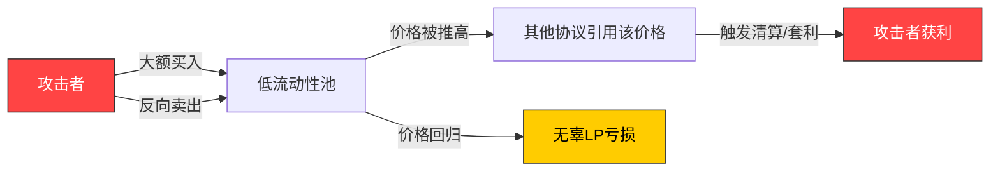
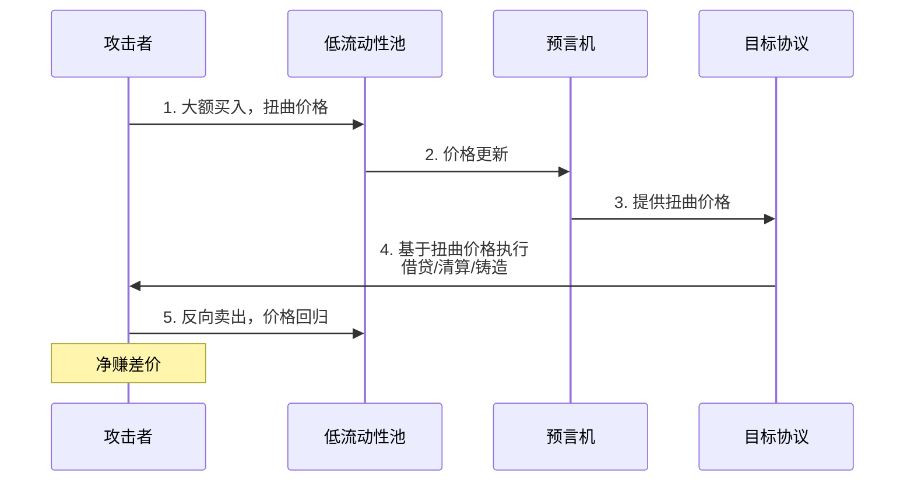
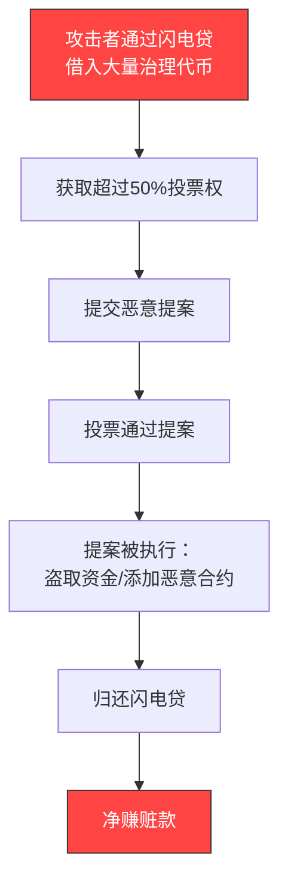
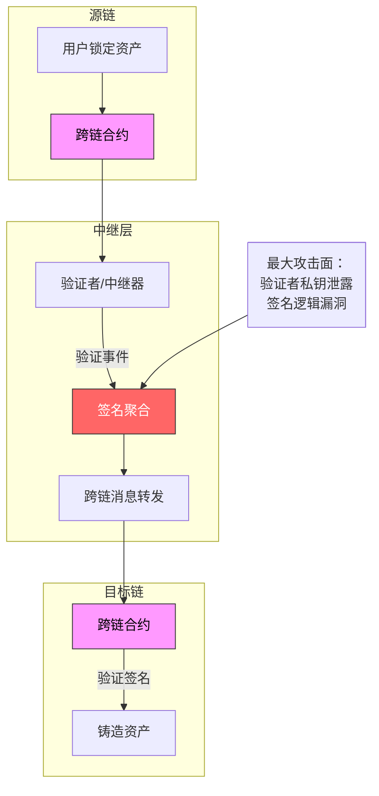
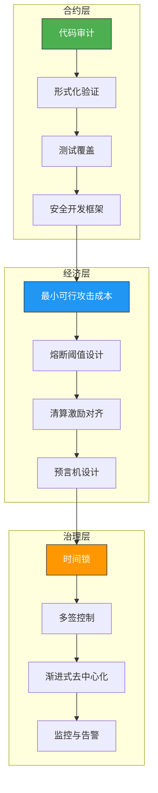

# 22.2 DeFi协议安全分析

去中心化金融（DeFi）是区块链生态中最具创新性也最脆弱的领域。截至2025年，DeFi协议累计安全损失超过150亿美元，涵盖了从闪电贷攻击到治理操控、从预言机操纵到跨链桥攻破的几乎所有攻击向量。本章将系统性地剖析三大核心攻击面——价格操纵、治理攻击、跨链桥安全——从理论原理到实战案例，再到防御体系，构建完整的安全分析知识框架。

***

## 22.2.1 价格操纵攻击

价格操纵是DeFi中最古老也最常见的攻击手法。其核心在于利用AMM（自动做市商）的**恒定乘积定价机制**（$x \times y = k$）的固有缺陷，通过人为扭曲资产价格来套利或触发清算。

### 22.2.1.1 恒定乘积定价的脆弱性

AMM的价格由池中两种资产的储备量决定。根据公式：

$$P_a = \frac{R_b}{R_a}$$

其中 $P_a$ 是资产A相对于资产B的价格，$R_a$ 和 $R_b$ 是池中两种资产的储备量。

**关键脆弱点**：当池中流动性不足时，少量交易即可大幅改变储备比例，从而剧烈扭曲价格。例如，在一个只有 $100 USDC 和 $100 ETH 的池中，用 $50 USDC 购买 ETH 可以将价格推移数倍——而在一个 $10M 的池中，同样 $50 对价格几乎没有影响。



### 22.2.1.2 闪电贷：放大效应的引擎

闪电贷（Flash Loan）是DeFi特有的无抵押借贷机制——只要在同一个交易（原子操作）中归还本金加利息即可。这为价格操纵提供了前所未有的杠杆：

| 维度 | 传统攻击 | 闪电贷攻击 |
|------|----------|------------|
| 初始资金需求 | 数百万美元 | 几乎为零 |
| 操作时间窗口 | 多区块 | 同一区块 |
| 攻击复杂度 | 需要前期建仓 | 原子操作，一键完成 |
| 取证难度 | 较高，链上可追溯 | 相对可追溯但高度自动化 |

**经典闪电贷攻击步骤**（以 PancakeBunny 事件为例）：

1. **借入巨额资产**：从闪电贷平台（如 dYdX、Aave）借入数百万代币
2. **操纵价格**：将借入资产注入低流动性池，推高/压低目标代币价格
3. **利用差价套利**：在依赖该价格的协议中执行有利可图的交易
4. **偿还闪电贷**：归还本金+利息，净赚差价

> **真实案例：PancakeBunny 攻击（2021年5月，损失$200M）**
>
> 攻击者通过闪电贷从 PancakeSwap 借入大量 BNB，在 BUNNY-BNB 池中抛售 BUNNY，导致 BUNNY 价格暴跌95%以上。随后利用 PancakeBunny 的铸造机制（该机制依赖池中 BUNNY 价格来决定铸造量），以极低成本铸造大量 BUNNY 代币，在市场卖出获利。

### 22.22.1.3 预言机操纵攻击

预言机（Oracle）是将链外数据引入链上的桥梁。攻击者并不直接攻击 AMM，而是攻击**提供价格数据的预言机**：

**TWAP 预言机（时间加权平均价格）** 通过计算一段时间内的平均价格来抵御瞬时操纵。但并非所有协议都采用 TWAP：

- **Uniswap V2 的即时价格预言机**：直接返回当前区块的现货价格，极易被操纵
- **Uniswap V2/V3 的 TWAP 预言机**：累积价格数据，每个区块记录一次，取一段时间均值
- **Chainlink 去中心化预言机**：聚合多个链下数据源，但仍有延迟和节点共谋风险



**防御策略：**

| 防御措施 | 原理 | 效果 |
|----------|------|------|
| TWAP预言机 | 取N个区块的平均价格 | 有效抵御单区块操纵，但响应慢 |
| Chainlink预言机 | 去中心化数据源+验证 | 抗单点故障，但仍有延迟窗口 |
| 熔断机制 | 价格波动超过阈值时暂停 | 止损，但可能误报 |
| 最小流动性要求 | 交易对需达到最低TVL | 提高攻击成本，但限制新池 |
| 价格偏差检查 | 验证价格是否在合理范围内 | 防御极端操纵 |

### 22.2.1.4 三明治攻击（Sandwich Attack）

这是一种Mempool层面的价格操纵方式。攻击者观察未确认交易，将自身交易"夹在"目标交易前后：

1. **前跑交易**：在目标买入前买入，推高价格
2. **目标交易被执行**：以更高价格买入
3. **后跑交易**：在高位卖出获利

**防御方案**：Flashbots 等 MEV 保护方案通过私有交易通道（如 Flashbots Protect、Etherspot）将交易直接发送给验证者，绕过公开 Mempool。CoW Swap 等协议通过批量拍卖聚合交易，从协议层面消除三明治攻击。

***

## 22.2.2 治理攻击

去中心化治理的设计目标是将协议控制权交给代币持有者，但这本身引入了新的攻击面——攻击者可以利用代币投票机制中的漏洞，合法地获得协议控制权。

### 22.2.2.1 闪电贷治理攻击

这是治理攻击中最致命的变种。攻击者利用闪电贷临时借入大量治理代币，在**一个区块内**完成提案创建、投票、执行的全部流程：

**典型攻击流程：**



> **真实案例：Beanstalk 攻击（2022年4月，损失$182M）**
>
> 攻击者从 Aave、Uniswap、SushiSwap 等协议通过闪电贷借入了约10亿美元的资产，其中包括大量 Beanstalk 的治理代币 STALK。在获得绝对多数投票权后，攻击者通过了一个看似正常的提案，该提案向一个由攻击者控制的地址转移了约$182M。整个过程在单个交易中完成，从借入到执行再到归还不到30秒。

### 22.2.2.2 恶意提案与代码后门

治理系统中的提案审查不严可能被植入恶意代码：

**常见恶意提案类型：**

| 类型 | 描述 | 典型案例 |
|------|------|----------|
| 资金转移提案 | 以"捐赠"或"矿工费"名义转移协议资金 | Beanstalk |
| 合约升级提案 | 将协议逻辑合约指向恶意实现 | Multichain |
| 参数修改提案 | 修改关键参数使攻击者获益 | Compound 118号提案 |
| 白名单添加提案 | 将攻击者地址加入白名单 | 各类跨链桥 |

**防御机制：**

- **时间锁（Timelock）**：治理提案通过后，必须等待N小时/天才能执行。这为安全团队提供了响应窗口，是防御治理攻击的最基础也最有效的手段。
- **投票快照（Snapshot）**：在提案提交时的区块快照中记录投票权，而非实时查询。这完全消除了闪电贷影响投票的可能性。
- **提案门槛**：只有持有一定数量代币的地址才能发起提案（通常占总供应量的0.1%-1%）。
- **多签治理**：关键操作（合约升级、资金转移）需要多个地址签名，而非仅依赖代币投票。
- **延迟升级+可观察性**：使用 UUPS 或其他代理模式，配合链上监控系统在升级执行时自动告警。

### 22.2.2.3 投票权积累与贿赂攻击

即使没有闪电贷，攻击者也可以通过公开市场购买或贿赂来积累投票权：

**工具体系：**

- **Convex / Yearn 等收益聚合器**：用户将其治理代币存入收益聚合器获取收益，但投票权被集中到少数"投票巨头"手中。例如，Convex 一度控制了 Curve 超过50%的投票权。
- **投票市场（如 Votium、Hidden Hand）**：允许项目方直接贿赂投票者以换取关键提案的通过。
- **直接购买**：在公开市场大量购买治理代币，对深度较深的代币成本极高。

**防御策略：**
- **二次方投票（Quadratic Voting）**：投票成本与票数的平方成正比，增加攻击者集中操纵的成本
- **委托投票权上限**：单一地址的委托投票权不能超过总供应量的某个百分比（如1%）
- **时延投票（Time-locked Voting）**：代币需要锁定一段时间后才能获得投票权

## 22.2.3 跨链桥安全

跨链桥是连接不同区块链的基础设施，其核心在于**共识跨越**——让一条链上的验证者集信任另一条链上发生的事件。由于跨链桥承载着数十亿资产且系统复杂，它们已成为攻击者的首选目标。据统计，2021-2025年间跨链桥攻击占总DeFi损失的60%以上。

### 22.2.3.1 跨链桥架构类型

| 架构类型 | 信任模型 | 安全性 | 典型案例 |
|----------|----------|--------|----------|
| **验证者网络桥** | 信任验证者多签 | 取决于验证者数量和安全性 | Ronin、Polygon Bridge |
| **轻客户端桥** | 信任源链共识 | 最高，无需额外信任 | IBC（Cosmos） |
| **流动性网络** | 信任做市商 + 预言机 | 中等，取决于流动性池安全 | Synapse、Multichain |
| **TEE桥** | 信任硬件安全 | 取决于TEE实现，有侧信道风险 | Intel SGX 方案 |

**核心攻击面：**



### 22.2.3.2 重大桥攻击案例分析

**1. Ronin Bridge 攻击（2022年3月，损失$622M）—— 验证者私钥泄露**

攻击者控制了 Sky Mavis（Ronin 的运营方）四个验证者节点中的两个，以及 Axie DAO 的验证者节点——5个验证者中控制了3个，满足了出金所需的4/5签名的75%。

**根因**：Sky Mavis 的一个员工通过 Slack 群聊下载了含恶意软件的 PDF，导致公司内部网络被入侵，验证者节点的私钥被窃取。Ronin 的验证者门限设置过低（4/5），且部分"验证者"实际上由同一实体控制。

**教训**：
- 验证者密钥必须离线存储（硬件钱包或多方计算 MPC）
- 验证者集必须实现真正的去中心化，避免同一实体控制多个节点
- 大额转账需要分层签名（如 4/5 起步，超过阈值需更激进的 7/9）

**2. Wormhole 攻击（2022年2月，损失$326M）—— 智能合约漏洞**

攻击者利用了 Wormhole 跨链桥验证逻辑中的一个漏洞——`verify_signatures` 函数在处理签名时存在 bug，攻击者可以构造一个特殊交易让 Solana 端的合约验证通过，从而在 Wormhole 的 Solana 侧铸造任何数量的 wETH。

**根因**：Solidity（以太坊侧）和 Rust（Solana侧）之间签名验证逻辑不一致。攻击者通过这个不一致性，构造了一个在 Solana 上能通过验证、在以太坊上却不存在的"签名"。
- 需要深刻理解两端的签名方案差异
- 攻击者向 Jump Crypto 发送了链上消息，声称愿意归还被盗资金，但需要 Wormhole 承认漏洞存在并设置赏金机制

**3. Nomad 桥攻击（2022年8月，损失$190M）—— 消息验证缺陷**

Nomad 桥的代理合约在初始化时，`process` 函数的默认消息哈希被设置为 `0x00`（零值）。这意味着**任何人都可以伪造一条"消息哈希为零"的跨链消息，而不需要提供有效签名**。更严重的是，当第一个攻击者利用此漏洞后，后续攻击者只需要简单地复制前人的 calldata 就能继续盗取资金——这使得攻击从"技术黑客"变成了"群众狂欢"。

**根因**：合约升级时未正确重设默认值。

**4. Multichain（AnyCall）攻击（2023年7月，损失$126M）—— 管理密钥泄露**

Multichain 的跨链路由器合约使用了由项目方控制的 MPC 签名。当项目方 CEO 被警方调查后，管理密钥被强制交出（或被盗），攻击者直接通过管理接口提取了大量锁定资产。

**根因**：完全中心化的管理权限，没有时间锁，没有多签，没有社区治理。

### 22.2.2.3.3 跨链桥安全最佳实践

| 实践 | 描述 | 优先级 |
|------|------|--------|
| **降低验证者门限** | 使用更大的验证者集和更高的签名门限（如 7/11 而非 4/5） | 🔴 最高 |
| **硬件安全模块** | 使用 HSM 或 TEE 保护验证者私钥 | 🔴 最高 |
| **乐观验证** | 引入挑战期，允许任何人质疑跨链消息的真实性 | 🟡 中 |
| **速率限制** | 限制单个区块内的跨链转账总额 | 🟡 中 |
| **多轮签名** | 大额转账需要额外的延迟签名轮次 | 🟡 中 |
| **安全审计** | 对合约逻辑、签名方案进行多次独立审计 | 🔴 最高 |
| **缺陷赏金** | 设置足够大的缺陷赏金（被盗资金的10%） | 🟡 中 |
| **灾难恢复** | 预先制定桥攻击后的资产冻结和恢复计划 | 🔴 最高 |

***

## 22.2.4 防御体系全景

### 22.2.4.1 分层防御架构

DeFi 协议应该在三个层面构建防御体系：



### 22.2.4.2 安全工具矩阵

| 工具类别 | 推荐工具 | 用途 |
|----------|----------|------|
| 静态分析 | Slither、Mythril、Securify | 自动检测常见漏洞模式 |
| 形式化验证 | Certora Prover、K Framework | 数学证明合约正确性 |
| 运行时监控 | Forta、Tenderly Alert | 实时检测异常链上活动 |
| MEV 保护 | Flashbots Protect、MEV Blocker | 防止三明治攻击和抢跑 |
| 审计公司 | Trail of Bits、OpenZeppelin、ConsenSys Diligence | 专业人工审计 |
| 风险分析 | Gauntlet、Chaos Labs、OpenRisk | 经济模型风险评估 |
| 安全指南 | Smart Contract Weakness Classification (SWC) | 漏洞分类参考 |

### 22.22.4.3 协议设计原则

1. **最小可行性攻击成本原则**：任何操纵操作的成本必须超过可能收益的5倍。例如，操纵价格需要购买至少50%的池中流动性，使攻击者无利可图。

2. **深度防御原则**：不依赖单一安全层。如果TWAP预言机失效，熔断机制应自动触发；如果熔断失败，时间锁应提供最后一道防线。

3. **升级可观测性**：合约升级时自动触发链上告警（通过 Forta 或 Tenderly），给社区24小时响应窗口。

4. **经济激励对齐**：验证者/节点运营者的收益应超过其作恶可能获得的收益（安全的纳什均衡）。

5. **渐进式去中心化**：在协议成熟之前，保持一定程度的中心化控制（如多签能力），随社区增长逐步移除权限。

***

## 22.2.5 安全分析实操指南

### 22.2.5.1 如何审查 DeFi 协议的安全性

**第一阶段：协议架构审查**
1. 阅读白皮书和技术文档，理解协议的核心机制
2. 识别所有关键的信任假设（预言机来源、治理方式、升级权限）
3. 绘制资金流图——资金从哪里来，经过哪些合约，最终到哪里去

**第二阶段：智能合约审计**
1. 运行 Slither 静态分析：`slither contracts/ --detect all`
2. 检查以下关键漏洞模式：
   - 重入攻击（Reentrancy）
   - 整型溢出（Integer Overflow/Underflow）
   - 未授权的初始化（Uninitialized Proxy）
   - 未检查的返回值（Unchecked Return Values）
   - 前端交易（Front-running）暴露
3. 使用 Foundry 进行 fuzz 测试

**第三阶段：经济模型分析**
1. 计算最小攻击成本：操纵价格需要多少资金
2. 评估闪电贷利用面：哪些函数的输入可以被闪电贷影响
3. 检查清算机制：清算是否有足够的激励且不被操纵

**第四阶段：治理安全审查**
1. 检查时间锁配置：提案通过后需要等待多久
2. 检查投票机制：是否使用快照，是否有委托上限
3. 检查升级权限：谁可以升级合约，是否需要多签

### 22.2.5.2 监控与告警设置

```yaml
# Forta Agent 示例：监控 Uniswap V3 池的异常价格波动
alert_rules:
  - name: "异常价格波动"
    condition: "price_change_5min > 15%"
    action: "notify_telegram/email/slack"
    
  - name: "大额转账告警"
    condition: "transfer_amount > $1M AND protocol != whitelisted"
    action: "investigate_immediately"
    
  - name: "治理提案通过"
    condition: "proposal_passed"
    action: "start_timelock_countdown"
```

***

## 22.2.6 常见安全误区

| 误区 | 事实 |
|------|------|
| "我们的合约经过审计，所以很安全" | 审计只是发现已知漏洞，无法保证无漏洞。历史证明多个经过顶级审计的协议仍被攻破 |
| "我们有时间锁，足够了" | 时间锁只是第一道防线，如果治理被完全控制，时间锁到期后资金仍然会丢失 |
| "我们使用Chainlink预言机，价格不可能被操纵" | Chainlink 数据是安全的，但如果协议内部使用自己的 AMM 价格而非 Chainlink，仍然存在操纵风险 |
| "多签方案绝对安全" | 多签取决于签名者的安全。Ronin 的验证者私钥泄露就是因为员工电脑被入侵 |
| "闪电贷是万恶之源" | 闪电贷本身是中性的，问题在于协议设计时未考虑原子操作的攻击面 |
| "我们的是新链，没有历史攻击案例" | 新链的跨链桥往往是最高风险的，因为验证者集小、安全审计经验不足 |

***

## 22.2.7 进阶学习路径

| 学习阶段 | 内容 | 推荐资源 |
|----------|------|----------|
| **基础** | DeFi 基础知识、AMM 原理、闪电贷机制 | Uniswap V2/V3 白皮书、Aave 文档 |
| **工具** | Foundry、Slither、Echidna 使用 | Defi-Security-SDK、Capture the Ether |
| **审计** | 阅读真实审计报告，理解漏洞模式 | Trail of Bits 公开报告、Code4rena 竞赛 |
| **经济安全** | 博弈论、纳什均衡、攻击成本计算 | Gauntlet 研究博客、顶级论文 |
| **MEV** | 三明治攻击、抢跑、Flashbots | Flashbots 文档、EigenPhi 数据分析 |
| **形式化验证** | Certora Prover、K Framework | Certora 教程、Runtime Verification |

> **学习建议**：从 DeFi 协议白皮书入手，配合 Capture the Ether 或 Paradigm CTF 等 CTF 竞赛进行实战练习。每学习一种漏洞模式，就在 Foundry 中编写对应的攻击测试，加深理解。同时，持续追踪 rekt.news 和 Forta 的每周安全报告，保持对最新攻击动态的敏感度。

***

*** 

*本章深入剖析了DeFi协议的三大核心攻击面——价格操纵、治理攻击和跨链桥安全，从底层数学原理到真实攻击案例，从漏洞模式到防御体系，构建了全面的安全分析框架。在下一节22.3中，我们将进一步探讨智能合约中的代码级安全与审计实践。*