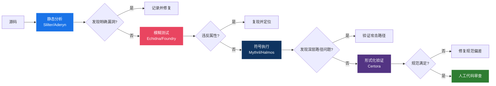
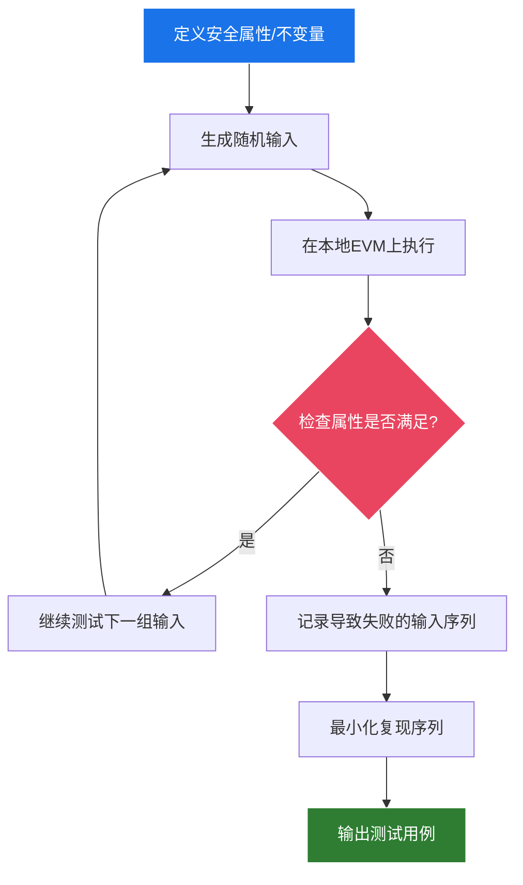
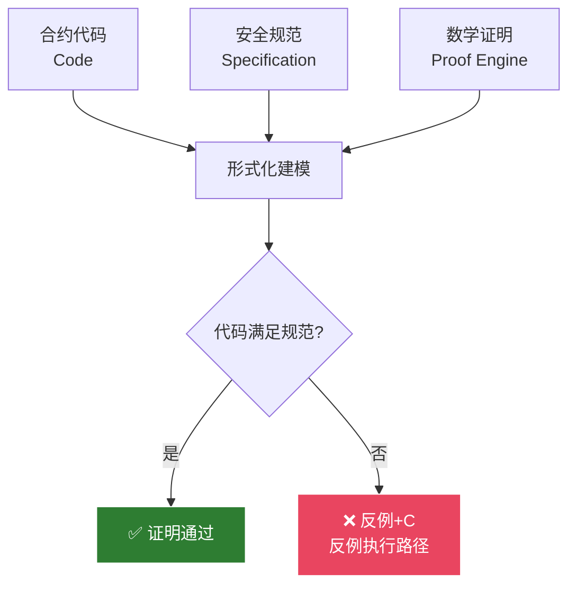
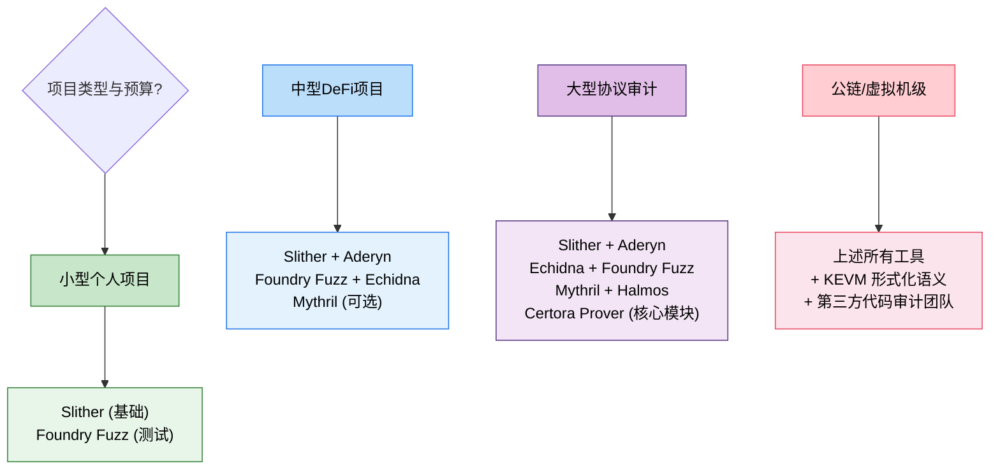

## 22.3 安全审计工具

### 22.3.1 为什么要使用安全审计工具

智能合约一旦部署上链便无法修改，这意味着代码中的任何安全缺陷都可能造成不可逆的资金损失。根据 Rekt News 和 SlowMist 的联合统计，2022年全年区块链安全事件造成超过38亿美元的损失，其中约60%的事件与智能合约代码层面的漏洞直接相关。即便是最顶尖的人工代码审计也无法保证100%的覆盖率——一个中等复杂度的 DeFi 协议通常包含 2000-5000 行 Solidity 代码，而人工审查在高强度工作4小时后，注意力集中度和缺陷发现率会显著下降。

这就引出了安全审计工具的核心价值：

1. **规模化检测**：工具可以在几秒到几分钟内扫描数百个合约文件，检测100+种已知漏洞模式，这是人工审计难以企及的规模
2. **一致性保证**：工具不受审计人员的经验波动和疲劳程度影响，每次运行都应用相同的检测标准
3. **路径探索能力**：符号执行和模糊测试工具能够探索人工难以想象的大量执行路径——Echidna 可以在数小时内运行数十万条随机构造的测试用例
4. **量化验证**：形式化验证工具能够从数学上证明或证伪合约的特定安全属性，提供比代码审查更强的保证

**但需要明确的是**：安全审计工具是辅助手段，而非万能的解决方案。没有任何工具能发现100%的漏洞。一份高质量的审计报告应该是"自动化扫描 + 人工代码审查 + 形式化验证 + 逻辑推理"的组合结果。

> ⚠️ **工具依赖的风险**：2023年7月，Curve Finance 的多个稳定币池（alETH、msETH、pETH等）遭到攻击，损失约7300万美元。攻击的根本原因是这些池合约使用 Vyper 0.2.15-0.3.0 版本编译，而这些版本存在重入锁（Reentrancy Guard）的实现缺陷——Vyper 编译器的特定版本未能正确应用锁机制。这个案例表明：**即使完全依赖自动化工具和审计流程，底层编译器或工具的缺陷本身也可能成为攻击面**。安全审计工具是必要手段，但永远不能替代对代码逻辑本身的深入理解。

---

### 22.3.2 安全审计工具的分类体系

智能合约安全审计工具按照分析技术的不同，可以分为四大类别，每一类都有其独特的原理、优势和局限性：

| 类别 | 核心原理 | 代表工具 | 检测能力 | 误报率 | 执行速度 |
|------|----------|----------|----------|--------|----------|
| **静态分析** | 在不执行代码的情况下，通过语法分析、数据流分析、控制流分析等方式检查源代码 | Slither、Aderyn、Solhint | 100+种已知漏洞模式 | 中-高 | 极快（秒级） |
| **动态分析/模糊测试** | 通过生成大量随机构造的输入，在运行时监控合约行为，检测违反预定义属性的情况 | Echidna、Foundry Fuzz、Dilithium | 逻辑缺陷、边界条件、状态不一致 | 低-中 | 较慢（小时级） |
| **符号执行** | 使用符号值代替具体值进行分析，探索合约的所有可能执行路径，数学化地求解路径条件 | Mythril、Manticore、Halmos | 深层路径漏洞、复杂的条件判断缺陷 | 中 | 中等（分钟级） |
| **形式化验证** | 将合约代码和规范翻译为数学逻辑，使用定理证明器或模型检查器证明合约满足规范 | Certora Prover、KEVM、VeriSol | 任意安全属性（理论上） | 极低 | 慢（可长达数小时） |

这四类工具不是互斥的替代关系，而是互补的关系。一个成熟的安全审计流程应该按阶段组合使用它们：



**流程说明**：

1. **静态分析打头阵**：在修改代码的快速迭代阶段，每次编译后自动运行静态分析，第一时间捕获已知漏洞模式
2. **模糊测试覆盖逻辑边界**：合约逻辑趋于稳定后，编写安全属性和不变量，运行 Echidna 或 Foundry Fuzz 进行大规模随机测试
3. **符号执行探索深层路径**：使用 Mythril 或 Halmos 深入分析复杂条件逻辑，特别是涉及多个合约交互的跨函数执行路径
4. **形式化验证最后把关**：对核心金融逻辑（如清算计算、费率模型、代币交换逻辑）进行形式化规范编写和证明
5. **人工审计贯穿始终**：上述每个阶段的结果都需要人工审查和验证，尤其是工具报告的疑似漏洞，需要确认是否是可利用的攻击路径

---

### 22.3.3 静态分析工具全景

静态分析是智能合约安全审计的"第一道防线"。它的核心优势在于速度快、覆盖面广，可以在开发周期的任何阶段运行，与 CI/CD 流程无缝集成。

#### 22.3.3.1 Slither——静态分析的标准

Slither 是 Trail of Bits 开发的 Solidity 静态分析框架，采用**中间表示（Intermediate Representation, IR）**技术，将 Solidity 源代码转化为更适合程序分析的 SlithIR 形式。这使得 Slither 不仅能够检测漏洞，还能提供数据流和控制流的精确分析。

**核心能力**：

- **100+ 内置检测器**：涵盖重入、未检查的外部调用返回值、权限控制缺陷、变量遮蔽、未使用的变量、不安全的 delegatecall 使用等
- **数据流分析**：跟踪变量和状态的传播路径，识别跨函数的变量污染
- **控制流分析**：构建合约的可达调用图，识别不可达代码和死路径
- **继承图分析**：检测多重继承中的线性化冲突（C3线性化问题）
- **API集成**：提供 Python API，支持开发自定义检测器

**CI/CD 集成示例（GitHub Actions）**：

```yaml
# .github/workflows/slither.yml
name: Slither Security Scan
on:
  pull_request:
    paths:
      - 'contracts/**/*.sol'
  push:
    branches: [main]

jobs:
  slither:
    runs-on: ubuntu-latest
    steps:
      - uses: actions/checkout@v4
      - uses: actions/setup-python@v5
        with:
          python-version: '3.10'
      - run: pip install slither-analyzer
      - run: |
          slither ./contracts/ \
            --filter-paths "lib,test,node_modules" \
            --exclude-dependencies \
            --fail-high \
            --print human-summary
```

**实用技巧**：

```bash
# 仅关注高严重性漏洞（忽略低严重性告警）
slither ./contracts/ --fail-high

# 生成人类可读的摘要报告
slither ./contracts/ --print human-summary

# 导出合约继承关系图
slither ./contracts/ --print inheritance-graph

# 导出函数调用图（用于分析攻击面）
slither ./contracts/ --print call-graph

# 同时运行多个 printers 生成综合报告
slither ./contracts/ --print human-summary --print contract-summary
```

**局限性**：
- 无法检测与外部状态（如链上价格、预言机数据）相关的运行时漏洞
- 对复杂的跨合约交互和闪电贷攻击路径的检测能力有限
- 高误报率（尤其是在 DeFi 协议中，约30-40%的高严重性告警可能是误报），需要大量人工确认

#### 22.3.3.2 Aderyn——新一代 Rust 静态分析器

Aderyn 是 Cyfrin（由知名审计专家 Patrick Collins 创立）开发的 Rust 语言静态分析工具。它的设计目标是解决 Slither 的两个痛点：**执行速度**和**安装依赖**。

**核心优势**：

```bash
# 安装（无需 Python 环境和依赖）
cargo install aderyn

# 使用
aderyn ./contracts/ --output report.md
```

- **极速执行**：基于 Rust 的特性，Aderyn 的扫描速度是 Slither 的 5-10 倍，对大型代码库（100+合约）尤为明显
- **零依赖安装**：单一二进制文件，无需 Python、solc-select 等依赖链
- **Detector-as-Code**：检测器使用 Rust 宏定义，性能极高
- **输出格式友好**：原生支持 Markdown、Sarif（SAST通用格式）和 JSON 输出

**适用的场景**：
- 大型 monorepo 项目的快速迭代扫描（每30秒跑一次全量扫描）
- CI/CD 中作为第一道快速检测防线
- 与 Slither 配合使用：Aderyn 快速扫描 → 发现问题后 Slither 深入分析

#### 22.3.3.3 辅助静态检查工具

除专业的智能合约分析工具外，一些通用的代码质量工具也可以作为辅助检查手段：

| 工具 | 定位 | 主要功能 | 使用方式 |
|------|------|----------|----------|
| **Solhint** | Solidity 语法和风格检查 | 编码规范检查、Gas 优化建议、命名约定验证 | `npm install -g solhint && solhint contracts/*.sol` |
| **Solhint Plugin** | Solhint 安全规则扩展 | 添加安全特定的检查规则 | `npm install @prb/solhint-plugin` |
| **solc 编译器内置检查** | 编译时静态检查 | 类型错误、可见性检查、重写检查 | `solc --strict-assembly` |
| **Diffcheck** | 智能合约升级差异分析 | 检测存储布局变化、接口断裂风险 | OpenZeppelin Upgrades 插件 |

---

### 22.3.4 动态分析与模糊测试

静态分析只能看到代码的静态结构，而**动态分析通过实际执行代码**来发现运行时的安全问题。模糊测试（Fuzzing）是动态分析的核心技术——通过生成大量随机、畸形或边缘的输入，迫使合约进入非预期的状态。

#### 22.3.4.1 模糊测试的基本原理



**关键概念**：

- **安全属性（Property）**：合约在任何状态下都应当保持为真的条件，例如"合约中的 ETH 余额应等于所有用户的存款总和"
- **不变量（Invariant）**：在整个合约生命周期中永远不变的事实，例如"治理代币的总供应量不应超过1亿"
- **断言（Assertion）**：在特定函数执行前后应当满足的条件，例如"每次存款操作后，用户的余额应增加对应的数量"

#### 22.3.4.2 Foundry Fuzz——最易上手的模糊测试

Foundry 框架内建了模糊测试支持，是当前最流行的 DeFi 协议测试方案。

**基本的模糊测试模式**：

```solidity
// SPDX-License-Identifier: MIT
pragma solidity ^0.8.20;

import "forge-std/Test.sol";
import "../src/VulnerableBank.sol";

contract VulnerableBankTest is Test {
    VulnerableBank public bank;
    address public alice = makeAddr("alice");
    address public bob = makeAddr("bob");

    function setUp() public {
        bank = new VulnerableBank();
        // 初始注资
        vm.deal(address(bank), 100 ether);
    }

    // 简单模糊测试：使用随机输入调用存款函数
    // Foundry 会自动为 uint256 amount 生成随机值
    function testFuzz_Deposit(uint256 amount) public {
        vm.assume(amount > 0 && amount < 100 ether);
        vm.prank(alice);
        bank.deposit{value: amount}();

        assertEq(bank.balances(alice), amount);
        assertEq(address(bank).balance, 100 ether + amount);
    }

    // 多参数模糊测试：同时测试存款和取款
    function testFuzz_DepositWithdraw(
        uint256 depositAmount,
        uint256 withdrawAmount
    ) public {
        vm.assume(depositAmount > 0);
        vm.assume(withdrawAmount > 0 && withdrawAmount <= depositAmount);
        vm.assume(depositAmount < 100 ether);

        // Alice 存款
        vm.prank(alice);
        bank.deposit{value: depositAmount}();

        // Alice 取款
        vm.prank(alice);
        bank.withdraw(withdrawAmount);

        // 验证：取款后余额 = 存款 - 取款
        assertEq(bank.balances(alice), depositAmount - withdrawAmount);
        // 验证：合约余额 = 初始注资 + 存款 - 取款
        assertEq(
            address(bank).balance,
            100 ether + depositAmount - withdrawAmount
        );
    }

    // 真实性约束：使用 vm.assume 过滤无效输入
    function testFuzz_RealisticDeposit(uint256 amount) public {
        // 使用 vm.assume 确保输入在合理的业务范围内
        vm.assume(amount >= 0.01 ether);  // 最小存款：0.01 ETH
        vm.assume(amount <= 1000 ether);  // 最大存款：1000 ETH

        vm.prank(alice);
        bank.deposit{value: amount}();
    }
}
```

#### 22.3.4.3 不变量的重要性——一个真实案例

**2023年 Euler Finance 攻击（1.97亿美元损失）**深刻说明了不变量测试的价值。攻击者利用闪电贷操纵资产价格后，通过捐赠函数（donate）的特殊行为绕过了 eToken 的内核检查，最终窃取了协议中近2亿美元的资产。

如果审计团队在 Euler Finance 上线前编写了如下不变量测试：

```solidity
// 核心不变量：任何用户的借贷价值不能超过其抵押品价值
function invariant_borrow_collateral_ratio() public {
    for (uint256 i = 0; i < allUsers.length; i++) {
        address user = allUsers[i];
        uint256 borrowValue = euler.getBorrowValue(user);
        uint256 collateralValue = euler.getCollateralValue(user);

        // 清算阈值检查
        assertLe(borrowValue, collateralValue * 90 / 100);
    }
}

// 核心不变量：总借贷量不能超过存款总量
function invariant_total_borrow_less_than_total_deposit() public {
    assertLe(euler.totalBorrows(), euler.totalDeposits());
}
```

**关键教训**：不变量一旦被违反，就意味着合约进入了非预期的、不安全的状态。攻击者通常通过违反一个或多个不变量来实现获利。因此，**不变量定义的质量直接决定了模糊测试的有效性**。一条优秀的不变量胜过10条单功能测试。

#### 22.3.4.4 Echidna——专业模糊测试框架

Echidna 是 Trail of Bits 开发的基于属性的模糊测试框架，支持更复杂的测试场景和配置。

**配置优化建议**：

```yaml
# echidna.yaml - 生产环境配置
testLimit: 100000         # 测试用例数量：越多覆盖率越高，但耗时越长
sequenceLength: 100       # 单次交易序列长度：测试多步交互的漏洞
shrinkLimit: 5000         # 最小化失败用例的收缩限制
deployer: "0x10000"       # 部署者地址
sender:
  - "0x10000"
  - "0x20000"
  - "0x30000"
  - "0x40000"             # 多发送者地址：模拟多用户交互
coverage: true            # 启用覆盖率追踪
coverageStopThreshold: 95 # 当代码覆盖率达到95%时自动停止（优化执行时间）
checkAsserts: true        # 检查合约中的 assert() 失败
filterFunctions:          # 指定测试的函数
  - "deposit(uint256)"
  - "withdraw(uint256)"
  - "transfer(address,uint256)"
```

**Echidna 特有的测试模式**：

```solidity
// 1. 带时间操纵的模糊测试
function echidna_test_timelock() public view returns (bool) {
    // 验证：时间锁合约的函数在执行时间限制之外不能被调用
    if (block.timestamp < timelock.releaseTime()) {
        return timelock.canCall();
    }
    return true;
}

// 2. 多用户余额不变量
function echidna_cumulative_balance() public view returns (bool) {
    uint256 sumUserBalances;
    for (uint256 i = 0; i < users.length; i++) {
        sumUserBalances += bank.balances(users[i]);
    }
    // 所有用户余额之和必须等于合约的总余额
    return sumUserBalances == address(bank).balance;
}
```

**Foundry Fuzz vs Echidna 对比**：

| 对比维度 | Foundry Fuzz | Echidna |
|----------|-------------|---------|
| **集成难度** | 内置，零配置 | 需要独立安装和配置 |
| **运行速度** | 中等（Solidity解释器） | 较快（基于 hevm） |
| **序列长度** | 单次调用为主 | 支持多步序列（sequenceLength） |
| **覆盖率追踪** | 基础支持 | 原生支持，可配置停止阈值 |
| **状态最小化** | 基础 shrink | 高级 shrink（序列最小化） |
| **多发送者** | 需要手动 vm.prank | 原生支持多 sender |
| **最佳场景** | CI/CD 快速反馈、单一函数测试 | 复杂多步交互、深度覆盖 |

**推荐策略**：日常开发使用 Foundry Fuzz（速度够快、集成方便），最终审计阶段补充 Echidna（覆盖率更深、多步测试更充分）。

---

### 22.3.5 符号执行工具

符号执行（Symbolic Execution）是一种介于静态分析和动态分析之间的技术。它使用符号值而非具体值来执行程序，将程序路径条件编码为约束系统，然后使用 SMT（Satisfiability Modulo Theories）求解器判断这些条件是否存在满足的赋值。

#### 22.3.5.1 Mythril——符号执行的经典工具

Mythril 是最早被广泛使用的智能合约安全分析工具之一，它在 EVM 字节码层面进行符号执行分析。

```bash
# 基础分析
myth analyze contracts/MyContract.sol

# 分析指定函数
myth analyze contracts/MyContract.sol --function withdraw

# 设置执行深度（避免路径爆炸）
myth analyze contracts/MyContract.sol --execution-timeout 120

# 生成可视化执行报告
myth analyze contracts/MyContract.sol --graph --graph-out mythril-graph/

# 分析已部署的合约（实时主网分析）
myth analyze -a 0x... --rpc https://eth-mainnet.g.alchemy.com/v2/KEY
```

**Mythril 的漏洞检测范围**：

| 漏洞类型 | 检测能力 | 典型误报场景 |
|----------|----------|-------------|
| 重入攻击 | ⭐⭐⭐ | OpenZeppelin ReentrancyGuard 可能误报 |
| 未检查调用返回值 | ⭐⭐⭐⭐ | 低级别调用（call/delegatecall/staticcall） |
| 整数溢出 | ⭐⭐⭐ | Solidity 0.8+ 内置检查后仍可检测 unchecked 块 |
| 时间戳依赖 | ⭐⭐⭐ | 真实使用 block.timestamp 的合法场景也会报 |
| 权限控制缺陷 | ⭐⭐ | 复杂多签逻辑难以精确建模 |
| 闪电贷攻击 | ⭐ | 经济学模型层面的缺陷超出检测范围 |

**核心局限性——路径爆炸**：符号执行面临的最大挑战是路径爆炸（Path Explosion）。一个合约中 if-else 分支的排列组合数随分支数量指数增长，当函数数量超过10-15个时，Mythril 可能无法覆盖所有执行路径，导致漏报。解决方法是使用 `--execution-timeout` 限制单次执行时间，或者将大型合约拆分为独立的子模块分别分析。

#### 22.3.5.2 Halmos——Foundry 生态的符号执行

Halmos 是更现代的符号执行工具，深度集成 Foundry 测试框架。

```solidity
// test/HalmosTest.t.sol
import {Test} from "forge-std/Test.sol";
import {SymTest} from "halmos-cheatcodes/SymTest.sol";

contract TokenHalmosTest is Test, SymTest {
    Token public token;

    function setUp() public {
        token = new Token();
        token.mint(address(this), 1000);
    }

    // 符号化测试：测试 transfer 函数的所有可能输入
    function check_transfer_all_paths() public {
        address symRecipient = svm.createAddress("recipient");
        uint256 symAmount = svm.createUint256("amount");

        // 约束：amount ≤ 余额
        vm.assume(symAmount <= token.balanceOf(address(this)));

        token.transfer(symRecipient, symAmount);

        // 验证：发送者余额减少，接收者余额增加
        assertTrue(
            token.balanceOf(address(this)) == 1000 - symAmount
        );
        assertTrue(
            token.balanceOf(symRecipient) == symAmount
        );
    }
}
```

**Mythril vs Halmos 对比**：

| 维度 | Mythril | Halmos |
|------|---------|--------|
| **分析层级** | EVM 字节码 | Solidity 源码级（通过 Foundry） |
| **集成方式** | 独立工具 | Foundry 插件 |
| **路径覆盖** | 自动探索 | 用户定义符号变量 |
| **使用门槛** | 低（简单命令即可） | 中等（需要编写符号测试） |
| **误报率** | 高（字节码级别精度有限） | 低（源码级精度） |
| **调试能力** | 有限 | 好（可以使用 vm.expectEmit 等） |

---

### 22.3.6 形式化验证

形式化验证（Formal Verification）是安全审计工具链的"终极武器"。它不是通过大量测试来"发现"漏洞，而是通过数学证明来"排除"特定类别的错误。

#### 22.3.6.1 形式化验证的原理

形式化验证的核心理念可以概括为一个三角模型：



**三个核心要素**：

1. **代码（Code）**：被验证的智能合约代码，通常需要先转化为某种中间表示（如 Certora 的 TAC、KEVM 的 K 定义）
2. **规范（Specification）**：用形式化语言（如 Certora 的 Spec 语言、K Framework 的规则）描述合约应该满足的属性，例如"代币总供应量不超过1亿"、"用户的余额在任何操作后都为非负"
3. **证明引擎（Proof Engine）**：SMT 求解器（如 Z3、CVC5）或定理证明器（如 Isabelle/HOL），自动检查代码是否满足规范

**形式化验证能保证什么，不能保证什么**：

| 能保证的 | 不能保证的 |
|----------|-----------|
| 核心数学逻辑的正确性（如代币交换公式、清算计算） | 外部系统（预言机、跨链桥）的数据正确性 |
| 状态转换的安全性（如"双重取款不可能"） | 经济博弈论层面的合理性（如 Flash Loan 攻击的经济条件） |
| Gas 消耗的恒定性和可预测性 | 前端/后端的业务逻辑 bug |
| 访问控制规则的精确落实 | 社会工程或运营安全漏洞 |
| 不变量在任何状态下的保持 | 未来协议升级引入的新漏洞 |

#### 22.3.6.2 Certora Prover——工业级形式化验证

Certora Prover 是目前应用最广泛的智能合约形式化验证工具，已被 Uniswap、Compound、Aave 等头部 DeFi 协议采用。

**规范编写示例**：

```cvl
// certora/specs/Token.spec
using Token as token;

// 规则1：总供应量不变规则
// 除了 mint 和 burn 函数之外，任何操作都不应改变总供应量
invariant totalSupplyInvariant()
    token.totalSupply() == token.totalSupply()
    {
        preserved with (env e) {
            // 在这些函数中允许总供应量变化
            requireInvariant !e.msg.sig == token.mint.selector;
            requireInvariant !e.msg.sig == token.burn.selector;
        }
    }

// 规则2：不重复记账规则
// 任意用户的余额永远不会超过总供应量
invariant individualBalanceInvariant(address user)
    token.balanceOf(user) <= token.totalSupply()

// 规则3：简单的不变量——用户的余额不为负
invariant balanceNonNegative(address user)
    token.balanceOf(user) >= 0

// 规则4：无额外铸造
// 只有 authorized minter 可以铸造代币
rule noUnauthorizedMinting() {
    env e;
    // 记录交易前后的总供应量
    uint256 supplyBefore = token.totalSupply();
    calldataarg args;
    token.transfer(e, args);
    uint256 supplyAfter = token.totalSupply();

    // 如果总供应量增加，则调用者必须是 minter
    assert supplyAfter == supplyBefore
        || e.msg.sig == token.mint.selector;
}
```

**运行 Certora Prover**：

```bash
# 1. 安装 Certora CLI
pip install certora-cli

# 2. 配置环境
# 需要 Certora 访问密钥（Certora Key），在 https://prover.certora.com 注册获取
export CERTORAKEY=your_certora_key

# 3. 运行验证
certoraRun \
    contracts/Token.sol \
    --verify Token:certora/specs/Token.spec \
    --solc solc8.20 \
    --msg "Token Core Invariants" \
    --rule_sanitize \
    --wait_for_results

# 4. 分析结果
# Certora Prover 会返回：
# - ✅ ALL_RULES_PASSED: 所有规则验证通过
# - ❌ RULE_FAILED: 发现违反规则的情况，提供反例（counterexample）
```

**Certora 的实际应用效果**：

| 项目 | 使用场景 | 发现的漏洞类型 | 规避的潜在损失 |
|------|----------|---------------|---------------|
| Compound III | 核心清算逻辑验证 | 清算计算中的精度损失问题 | 未公开（但 Compound 是高度精密协议） |
| Uniswap V3 | 流动性计算、费用累积验证 | 边界条件下的池状态不一致 | 未公开 |
| Lido | stETH 兑换逻辑验证 | 舍入误差累积导致的微小不平衡 | 数千万美元级 |
| MakerDAO | DAI 稳定费计算验证 | 多步交互中费率计算不一致 | 未公开 |

**行业经验**：据 Certora 官方报告和多个合作项目的公开披露，形式化验证在大规模 DeFi 协议审计中平均能发现 5-15 个传统审计遗漏的漏洞，其中约 2-3 个属于高严重性漏洞。

#### 22.3.6.3 KEVM——基于 K Framework 的形式化验证

KEVM 是由 Runtime Verification（RV）开发的基于 K Framework 的 EVM 形式化语义定义。它是目前最完整的 EVM 形式化模型之一。

**KEVM 的主要特点**：

- 将整个 EVM 执行规范形式化为 K Framework 的规则集
- 支持对任意 EVM 字节码进行符号执行
- 可以证明特定合约在**所有**输入下的行为等价性
- 已被用于验证 EIP（以太坊改进提案）的正确性

**典型使用场景**：

```text
# 使用 KEVM 证明某个合约不与 EVM 规范冲突
kevm prove MyContract.evm \
  --specification my-spec.k \
  --definition evm-semantics

# 验证合约升级前后的行为等价性
kevm equivalence Check \
  --old old-contract.evm \
  --new new-contract.evm
```

**Certora vs KEVM 对比**：

| 维度 | Certora Prover | KEVM |
|------|---------------|------|
| **使用门槛** | 中等（CVL 语言相对易学） | 极高（需要 K Framework 知识） |
| **抽象层级** | Solidity 源码级 | EVM 字节码级 |
| **证明能力** | 属性验证（快速检查特定规则） | 完整语义等价性证明 |
| **执行速度** | 快（几小时级） | 慢（数天到数周级） |
| **适用场景** | 日常审计和生产环境 | 核心虚拟机/编译器验证 |
| **代码库** | 主动开发，商业支持 | 学术项目，更新较慢 |

---

### 22.3.7 工具选择决策指南

在实际项目中，如何选择最合适的工具组合？以下决策树供参考：



**按场景细分**：

| 场景 | 推荐工具 | 工具投入时间 | 预期检测覆盖率 |
|------|----------|-------------|---------------|
| 快速原型开发（Hackathon / MVP） | Slither + Foundry Fuzz | 1-2 天配置 | 60-70% 已知漏洞模式 |
| 普通 NFT / 简单代币项目 | Slither + Aderyn + Foundry | 2-3 天 | 70-80% |
| DeFi 借贷/AMM 协议 | 全套工具链 | 1-2 周配置 | 80-90% |
| 跨链桥/桥接协议 | 全套 + Certora（核心模块） | 2-4 周 | 85-95% |
| 公链/Layer 2 核心合约 | 全套 + KEVM + 专业审计团队 | 1-3 月 | 95%+ |

---

### 22.3.8 工具链的实践陷阱与应对

即使使用了完整的安全审计工具链，仍有一些常见的陷阱需要注意：

#### 陷阱一：忽略工具的版本和依赖

**问题**：工具版本不匹配或依赖包过期可能导致检测结果不可靠。例如，Slither 的某些检测器依赖于 solc 版本的支持，使用过旧的 Slither 版本可能无法正确解析 Solidity 0.8.20+ 的语法。

**应对策略**：
```bash
# 保持工具更新
pip install --upgrade slither-analyzer
cargo install --git https://github.com/Cyfrin/aderyn

# 使用依赖锁定的环境（推荐）
# Docker 方式运行，确保环境一致
docker pull trailofbits/eth-security-toolbox
docker run -it -v $(pwd):/src trailofbits/eth-security-toolbox bash
```

#### 陷阱二：忽视假阴性（False Negative）

**问题**：没有告警不等于没有漏洞。工具的漏报远比误报危险——误报至少会引起注意，漏报则意味着漏洞被"静默通过"。

**应对策略**：
- 永远不要把工具报告作为"安全通过"的唯一标准
- 工具未发现问题的模块，恰恰应该是人工审计的重点
- 使用多种工具交叉验证相同模块
- 了解每个工具的能力边界（哪些漏洞它无法检测）

#### 陷阱三：工具覆盖不了经济学攻击

**问题**：绝大部分安全审计工具只关注代码层面的正确性，**无法检测经济学层面的攻击**。闪电贷攻击、治理攻击、价格操纵攻击等通常不违反任何代码层面的规则，而是利用了协议经济模型中的激励错配。

**案例**：2022年 Beanstalk 治理攻击（1.82亿美元损失）中，攻击者通过闪电贷借入大量 BEAN 代币，获得了足够的治理投票权后通过恶意提案转移协议资金。**从代码角度，整个攻击过程完全遵守了合约规则——问题出在治理机制的设计本身，而不是代码实现**。

**应对策略**：
- 工具扫描之外，必须进行**经济模型的安全审查**（Economic Security Review）
- 使用经济模拟工具（如 Gauntlet、Chaos Labs）进行压力测试
- 编写"经济不变量"——例如"任何用户通过闪电贷无法在单笔交易中获得超过 X 的利润"

#### 陷阱四：测试覆盖率不等于安全覆盖率

**问题**：许多团队将代码覆盖率（Code Coverage）作为安全性的指标，这是一个危险的误解。覆盖率只告诉你哪些代码被执行了，**不告诉你执行结果是否正确**。一个测试可以覆盖 100% 的代码行，但从未检查正确的状态转换。

```solidity
// 错误的测试：覆盖率100%但不验证任何东西
function testFuzz_Deposit(uint256 amount) public {
    vm.assume(amount > 0);
    bank.deposit{value: amount}();
    // 没有 assert！测试通过只是因为没报错
}

// 正确的测试
function testFuzz_Deposit_VerifyBalance(uint256 amount) public {
    vm.assume(amount > 0 && amount < 100 ether);
    vm.prank(alice);
    bank.deposit{value: amount}();
    // 验证状态变更
    assertEq(bank.balances(alice), amount);
    // 验证事件
    vm.expectEmit(true, true, true, true);
    emit Deposited(alice, amount);
}
```

---

### 22.3.9 从工具使用者走向工具开发者

对于想深入智能合约安全的读者，理解工具的局限性后，更进一步是**能够为审计工具贡献自定义检测器**。这不仅能加深对漏洞原理的理解，也是参与公共安全研究的重要方式。

**开发自定义 Slither 检测器**：

```python
# custom_detectors/unchecked_external_call.py
from slither.detectors.abstract_detector import AbstractDetector, DetectorClassification
from slither.visitors.expression.expression import ExpressionVisitor
from slither.core.expressions import CallExpression

class UncheckedExternalCallDetector(AbstractDetector):
    """检测未检查返回值的外部调用"""

    ARGUMENT = "unchecked-external-call"
    HELP = "Detect external calls whose return values are not checked"
    IMPACT = DetectorClassification.MEDIUM
    CONFIDENCE = DetectorClassification.HIGH

    def _detect(self):
        results = []

        for contract in self.contracts:
            for function in contract.functions:
                for node in function.nodes:
                    # 检查 low-level call 的返回值是否被使用
                    for ir in node.irs:
                        if hasattr(ir, 'function') and \
                           ir.function and \
                           ir.function.is_low_level:
                            # 检查返回值是否被检查（if 语句或者 require）
                            if not self._return_value_checked(node, ir):
                                results.append(self.generate_result(
                                    f"Unchecked low-level call in {function.name}() "
                                    f"at line {node.source_mapping.lines}"
                                ))
        return results

    def _return_value_checked(self, node, ir):
        """检查 IR 节点的返回值是否被后续节点检查"""
        successors = node.sons
        for succ in successors:
            for succ_ir in succ.irs:
                if isinstance(succ_ir, 'If') or isinstance(succ_ir, 'Binary'):
                    if str(ir).split('=')[0].strip() in str(succ_ir):
                        return True
        return False
```

**提交自定义检测器**：
- **Slither**：向 Trail of Bits 的 `crytic/slither` 仓库提交 PR，将自定义检测器添加到 `slither/detectors/` 目录下
- **Aderyn**：向 Cyfrin 的 `Cyfrin/aderyn` 仓库提交 Rust 检测器实现
- **Mythril**：向 ConsenSys 的 `ConsenSys/mythril-classic` 仓库提交新的探测模块

---

### 22.3.10 小结

| 工具类型 | 代表工具 | 核心价值 | 最佳使用时机 |
|----------|----------|----------|-------------|
| 静态分析 | Slither, Aderyn | 高速扫描已知漏洞模式 | 每次代码更改后的 CI 检查 |
| 模糊测试 | Foundry Fuzz, Echidna | 发现逻辑缺陷和边界条件 | 合约逻辑稳定后的深度测试 |
| 符号执行 | Mythril, Halmos | 探索深层执行路径 | 复杂条件逻辑的专项分析 |
| 形式化验证 | Certora Prover, KEVM | 数学化证明安全属性 | 核心金融逻辑的最终验证 |

安全审计工具不是银弹，但它们是现代智能合约开发中**不可缺失的安全基础设施**。正如编写代码需要 IDE 的语法高亮和自动补全，编写安全的智能合约需要这些审计工具的持续陪伴。关键是要理解每个工具的能力边界，合理组合使用，并将工具检测结果作为人工审计的输入而非替代。

在下一节（22.4 安全开发最佳实践）中，我们将从"检测"转向"预防"，学习如何在编写合约的初始阶段就融入安全意识，从源头减少漏洞的产生。
