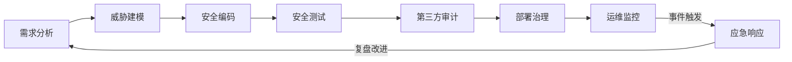
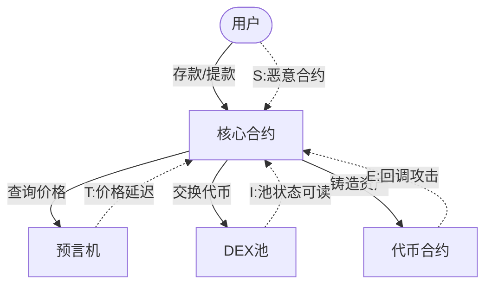
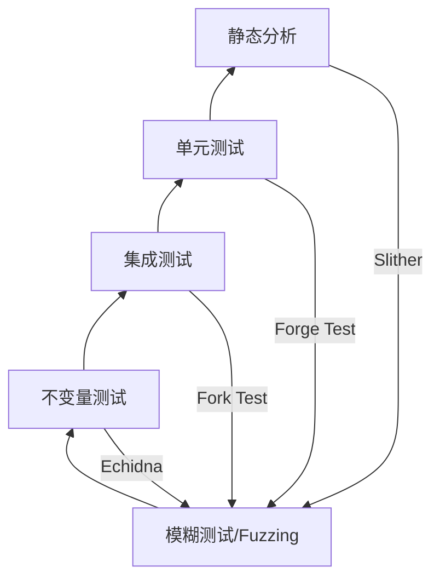
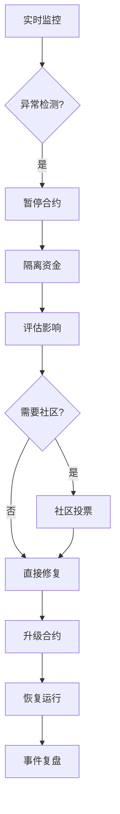

## 22.4 安全开发最佳实践

区块链安全事件的经济损失在2022年首次突破了30亿美元大关。深入剖析这些事件会发现：绝大多数攻击并非利用复杂的密码学突破或底层协议漏洞，而是源于开发过程中的安全实践缺失。从The DAO的重入攻击到Ronin Bridge的验证者密钥泄露，从Wormhole的签名验证缺陷到Euler Finance的清算逻辑错误——每一场灾难背后，都对应着某个安全开发实践环节的失效。

本章将安全开发从"经验之谈"提升为可执行、可验证、可度量的工程方法体系。

### 22.4.1 安全开发生命周期（SSDLC）

安全不能是上线前的"亡羊补牢"，而应嵌入软件开发的每一个环节。下图展示了专为智能合约定制的安全开发生命周期：



#### 22.4.1.1 需求分析阶段

在编写任何代码之前，团队必须清晰地定义系统的安全边界：

- **资产定义**：明确合约管理的资产类型（ETH、ERC-20、ERC-721、跨链资产等）及风险评级
- **信任假设**：列出所有外部依赖（预言机、桥接器、第三方合约），明确每个依赖的信任模型
- **合规要求**：是否需要符合特定标准（如ERC-4626金库标准、ERC-3525半同质化标准）
- **异常场景**：枚举合约可能面临的极端情况——ERC-777闪电贷回调、1 wei攻击、归零价格等

**实战检查表**：

| 问题 | 示例 |
|------|------|
| 合约锁定的资产最大金额是多少？ | 1,000万 USDC |
| 这些资产在极端市场条件下如何变化？ | 流动性池TVL可能下降90% |
| 哪些外部合约可以调用本合约？ | Uniswap V3 Router、Chainlink Oracle |
| 本合约可调用哪些外部合约？ | 所有用户可调用的public函数 |

#### 22.4.1.2 威胁建模

威胁建模的核心目标是"在攻击者之前找到攻击面"。智能合约领域最有效的威胁建模方法论是**STRIDE-EVM**——在微软STRIDE基础上针对EVM环境做了适配：

| 威胁类别 | EVM场景 | 真实案例 |
|----------|---------|---------|
| **S**poofing（身份伪造） | 未检查msg.sender、签名被重放 | Wormhole签名验证缺陷（3.2亿美元） |
| **T**ampering（篡改） | 存储碰撞、delegatecall参数篡改 | Parity多签库冻结（2.8亿美元） |
| **R**epudiation（抵赖） | 事件日志不完整导致争议 | 多签执行缺少操作记录 |
| **I**nformation Disclosure（信息泄露） | 私钥硬编码、未加密的链上敏感数据 | Nomad Bridge的代理管理员私钥泄露 |
| **D**enial of Service（拒绝服务） | Gas耗尽、自毁制造僵局 | Akutars NFT合约永久冻结（3400万美元） |
| **E**levation of Privilege（权限提升） | 初始化函数未保护、自毁授权后接管 | 多个因initialize无保护导致合约被接管 |

**实操步骤**：

1. **绘制数据流图**：将所有外部输入和输出映射出来，用Mermaid可视化
2. **遍历STRIDE-EVM**：对每个数据流逐一问"这个交互可能被攻击吗？"
3. **评分优先级**：按影响×可能性打分，决定修复顺序
4. **记录假设**：明确哪些攻击不在当前考虑范围内，避免"安全臆想"



#### 22.4.1.3 编码阶段

编码阶段的安全投入能产生最大的ROI（投入产出比）。具体措施包括：

**里程碑1：架构评审**

在完成第一版合约结构后、正式编码前，进行一次架构级安全评审：

- 合约间调用关系是否形成有向无环图（DAG）？循环调用应被标记
- 状态变量是否按函数职责进行了合理分组？
- 是否有不必要的继承链（菱形继承）？

**里程碑2：安全编码规范**

团队应建立并执行统一的编码规范。以下是一个经过实战检验的规范框架：

```solidity
// 通用规范结构示例
pragma solidity ^0.8.20;  // 使用最新稳定大版本

// 1. 导入包必须明确声明，禁止通配符导入
import {IERC20} from "@openzeppelin/contracts/token/ERC20/IERC20.sol";
import {ReentrancyGuard} from "@openzeppelin/contracts/utils/ReentrancyGuard.sol";

// 2. 每个合约用NatSpec完整注释
/// @title 安全金库
/// @notice 支持ERC-4626标准的安全金库，含时间锁提款机制
/// @dev 所有涉及资金的函数都经过ReentrancyGuard保护
contract SecureVault is ReentrancyGuard {
    // 3. 状态变量分组：纯状态 > 配置 > 映射
    // 4. 每个mapping使用嵌套映射而非结构体数组（防Gas炸弹）
    mapping(address => uint256) private _balances;
    
    // 5. 事件定义紧跟在状态变量之后
    event Deposit(address indexed user, uint256 amount);
    event Withdraw(address indexed user, uint256 amount);
    
    // 6. 构造函数中完成所有初始化
    constructor() {
        // 显式初始化而非使用initializer模式
    }
    
    // 7. 外部函数按功能分组，可见性明确
    /// @notice 存入ETH
    /// @param beneficiary 实际收款人（防前端操纵）
    function deposit(address beneficiary) 
        external 
        payable 
        nonReentrant 
    {
        require(beneficiary != address(0), "Zero address");
        require(msg.value > 0, "Zero value");
        _balances[beneficiary] += msg.value;
        emit Deposit(beneficiary, msg.value);
    }
}
```

**里程碑3：安全函数清单**

每次新增public/external函数前，必须填写以下清单：

- [ ] 该函数是否处理资产？→ 需要ReentrancyGuard
- [ ] 该函数是否接受外部地址？→ 需验证address(0)、contract地址
- [ ] 该函数是否进行外部调用？→ 调用在状态更新之后（CEI模式）
- [ ] 该函数的可见性是否正确？→ never `public` if `external` suffices
- [ ] 该函数的参数是否有边界？→ 检查数组匹配、数值范围

### 22.4.2 代码规范与质量体系

#### 22.4.2.1 编译器版本策略

选择Solidity编译器版本不是简单"用最新版"：

| 版本 | 特点 | 适用场景 |
|------|------|---------|
| ^0.8.0+ | 内置溢出检查 | 所有新项目首选 |
| ^0.8.13+ | 支持`push0`优化、`bytes.concat` | 需要Gas优化的项目 |
| ^0.8.20+ | 支持PUSH0、Cancun EVM | 部署在以太坊主网的新项目 |
| ^0.8.24+ | transient storage（TSTORE/TLOAD）支持 | 需要临时存储的项目 |

**不要使用** 0.8.0之前的版本（无内置溢出检查）或 `pragma solidity >=0.7.0 <0.9.0` 这样的宽范围声明（不同编译器版本的行为差异可能导致意外）。

#### 22.4.2.2 代码复杂度控制

智能合约的不可变性和高价值特性决定了其代码必须比传统软件更"清晰"：

**圈复杂度红线**：

- 单个函数不超过50行（EVM字节码限制是一个方面，更重要的是一致性审查的可行性）
- 单个函数中不超过3个外部调用（超过3个外部调用意味着风险组合爆炸）
- 嵌套if/require不超过4层
- 避免在循环中执行外部调用（Gas耗尽DoS + 重入风险）

**Check-Effects-Interactions（CEI）模式的严格实践**：

```solidity
// ✗ 危险：Interactions在Effects之前
function withdraw(uint256 amount) external {
    uint256 balance = _balances[msg.sender];
    require(balance >= amount, "Insufficient");
    (bool success, ) = msg.sender.call{value: amount}("");  // Interaction
    require(success, "Transfer failed");
    _balances[msg.sender] = balance - amount;  // Effect（太晚了！）
}

// ✓ 安全：严格遵循CEI
function withdraw(uint256 amount) external nonReentrant {  // 防御纵深
    uint256 balance = _balances[msg.sender];
    require(balance >= amount, "Insufficient");  // Check
    _balances[msg.sender] = balance - amount;    // Effect（先改状态）
    (bool success, ) = msg.sender.call{value: amount}("");  // Interaction
    require(success, "Transfer failed");
}
```

> **为什么CEI有效？** 攻击者如果想重入，在外部调用处将控制权交给攻击合约时，转账金额已经记录为0，攻击再调用withdraw时会因`balance >= amount`检查不通过而失败。CEI不是消除重入，而是让重入无利可图。

#### 22.4.2.3 事件日志规范

事件是链下监控系统的唯一数据来源。一个好的事件设计应该：

```solidity
// ✗ 不足：缺少索引参数、未包含上下文
event Deposit(address, uint256);

// ✓ 完整：三个索引参数、包含所有必要上下文
event Deposit(
    address indexed user,      // 索引便于链下检索
    address indexed vault,     // 多金库系统下区分来源
    uint256 amount,            // 实际金额
    uint256 timestamp          // 时间戳便于链下排序
);
```

**事件设计原则**：

1. **至少索引一个参数**（最多三个索引），便于链下过滤
2. **所有状态变更必须对应事件**——这是审计追踪的基础
3. **包含足够的上下文**，让链下系统能独立验证事件的有效性
4. **不使用匿名事件**（`event Deposit(...) anonymous`），因为无法通过签名过滤

### 22.4.3 治理与权限管理

权限管理是智能合约安全的"命门"。数据显示，超过30%的安全审计高严重问题与权限控制有关。

#### 22.4.3.1 最小权限原则

每个函数只授予完成其职责所需的最小权限集：

```solidity
// 角色定义
contract MyProtocol is AccessControl {
    bytes32 public constant PAUSER_ROLE = keccak256("PAUSER_ROLE");
    bytes32 public constant WITHDRAWER_ROLE = keccak256("WITHDRAWER_ROLE");
    bytes32 public constant CONFIGURATOR_ROLE = keccak256("CONFIGURATOR_ROLE");
    
    // 精确定义的权限范围
    function pause() external onlyRole(PAUSER_ROLE) { ... }
    function emergencyWithdraw(address to) external onlyRole(WITHDRAWER_ROLE) { ... }
    function setFee(uint256 newFee) external onlyRole(CONFIGURATOR_ROLE) { ... }
}
```

> **不要这样做**：一个`onlyOwner`装饰所有敏感函数。一旦owner私钥泄露，攻击者拥有全部权限。

#### 22.4.3.2 时间锁（Timelock）

时间锁是除多签外最重要的安全装置。它在"权限被滥用"和"资金被转移"之间建立了一个时间屏障：

```solidity
contract TimelockController {
    uint256 public constant MINIMUM_DELAY = 2 days;  // 最短延迟
    uint256 public delay;
    
    mapping(bytes32 => bool) public queuedTransactions;
    
    /// @notice 排队一个待执行的操作
    function queueTransaction(
        address target,           // 目标合约
        uint256 value,            // 发送的ETH
        string memory signature,  // 函数签名
        bytes memory data,        // calldata
        uint256 eta               // 最早执行时间
    ) external onlyExecutor returns (bytes32) {
        bytes32 txHash = keccak256(abi.encode(target, value, signature, data, eta));
        require(!queuedTransactions[txHash], "Already queued");
        queuedTransactions[txHash] = true;
        emit TransactionQueued(txHash, target, value, signature, data, eta);
        return txHash;
    }
    
    /// @notice 执行已排队的操作（必须在eta之后）
    function executeTransaction(
        address target,
        uint256 value,
        string memory signature,
        bytes memory data,
        uint256 eta
    ) external onlyExecutor {
        require(block.timestamp >= eta, "Too early");
        require(block.timestamp <= eta + 7 days, "Expired");  // 过期保护
        bytes32 txHash = keccak256(abi.encode(target, value, signature, data, eta));
        require(queuedTransactions[txHash], "Not queued");
        queuedTransactions[txHash] = false;  // 防止重放
        // ... 执行逻辑
    }
}
```

**时间锁配置建议**：

| 操作类型 | 推荐延迟 | 理由 |
|----------|---------|------|
| 参数调整（费率、阈值） | 24-48小时 | 给社区反应时间 |
| 新合约升级 | 3-7天 | 允许审计和分析 |
| 紧急暂停 | 0-30分钟 | 不影响响应速度 |
| 资金提取 | 7天+ | 最高风险操作 |

#### 22.4.3.3 多签钱包

多签钱包（Multi-Sig）是智能合约管理者的"最后防线"。推荐使用Gnosis Safe（已更名为Safe）：

| 配置参数 | 推荐值 | 说明 |
|----------|--------|------|
| 签名者数量 | 5-9人 | 兼顾安全与效率 |
| 最小确认数 | 3/5 或 4/7 | 至少过半数 |
| 签名者背景 | 多元（开发、运营、社区） | 避免单点共谋 |
| 备用密钥 | Hardware wallet | 热钱包不可用于管理 |

**常见误区**：

- **误区**：多签签名者都是团队核心成员就足够安全了
- **事实**：所有签名者来自同一团队意味着单点社会工程攻击就可以攻破所有签名者
- **最佳实践**：至少1-2个签名者来自独立实体（如基金会成员、社区代表）

### 22.4.4 升级模式深度分析

由于智能合约的不可变性，升级能力是一把双刃剑——提供灵活性，但也引入新的攻击面。

#### 22.4.4.1 三种主流升级模式对比

| 特性 | 透明代理 | UUPS代理 | Diamond (EIP-2535) |
|------|---------|---------|-------------------|
| 升级函数位置 | 代理合约 | 逻辑合约 | 逻辑合约（diamondCut） |
| 存储冲突风险 | 中（非结构化存储） | 中 | 低（显式命名空间） |
| Gas开销 | 略高（每次delegatecall） | 最低 | 中（fallback查找） |
| 部署成本 | 高（3个合约） | 低（2个合约） | 最高（多facets） |
| 模块化程度 | 低 | 低 | 高（按功能分facet） |
| 复杂度 | 低 | 中 | 高 |
| 安全风险 | 初始化守护 | 自毁风险 | 存储布局管理 |

#### 22.4.4.2 透明代理模式详解

透明代理是最广泛使用的升级模式（OpenZeppelin的实现）：

```solidity
// 代理合约：存储状态，通过delegatecall委托执行逻辑
contract TransparentProxy {
    // 存储槽：EIP-1967标准槽位
    bytes32 private constant _IMPLEMENTATION_SLOT = 
        0x360894a13ba1a3210667c828492db98dca3e2076cc3735a920a3ca505d382bbc;
    
    address private immutable _admin;
    
    // 管理员可以通过upgradeTo升级，普通用户只能调用逻辑合约
    modifier ifAdmin() {
        if (msg.sender == _admin) {
            _;
        } else {
            _fallback();
        }
    }
    
    function upgradeTo(address newImplementation) external ifAdmin {
        _setImplementation(newImplementation);
        emit Upgraded(newImplementation);
    }
    
    function _fallback() private {
        // 普通用户调用→delegatecall到逻辑合约
        _delegate(_implementation());
    }
}
```

**关键安全规则**：

1. **初始化保护**：逻辑合约的初始化函数必须被保护——防止未经授权调用导致状态被覆盖
2. **存储槽碰撞**：代理和逻辑合约都使用非结构化存储（EIP-1967指定槽位）避免碰撞
3. **构造函数注入**：逻辑合约不应在构造函数中写入存储（因为构造函数在代理上下文中不会执行）

#### 22.4.4.3 UUPS代理

UUPS将升级函数放在逻辑合约中，更节省Gas但增加了逻辑合约的复杂度：

```solidity
// UUPS逻辑合约示例
abstract contract UUPSUpgradeable {
    address private immutable __self = address(this);
    
    /// @dev 升级到新实现（必须在逻辑合约中被保护）
    function upgradeTo(address newImplementation) external virtual onlyProxy {
        _authorizeUpgrade(newImplementation);
        _setImplementation(newImplementation);
    }
    
    /// @dev 子类必须实现此函数控制谁能升级
    function _authorizeUpgrade(address newImplementation) internal virtual;
    
    /// @dev 防止实现合约被自毁
    function upgradeToAndCall(address newImplementation, bytes memory data)
        external payable virtual onlyProxy 
    {
        _authorizeUpgrade(newImplementation);
        _setImplementation(newImplementation);
        (bool success, ) = newImplementation.delegatecall(data);
        require(success, "Upgrade failed");
    }
}
```

**UUPS独有风险**：

- **自毁攻击**：如果逻辑合约包含`selfdestruct`操作，攻击者可以通过销毁逻辑合约使代理合约"变砖"
- **升级权限泄露**：`_authorizeUpgrade`必须用多签+时间锁双重保护
- **存储布局一致性**：每次升级都不能改变已有存储变量的布局顺序

#### 22.4.4.4 Diamond模式（EIP-2535）

Diamond模式引入"切面"（Facet）概念，将功能模块化：

```solidity
// Diamond核心：通过fallback查找并委托到对应facet
contract Diamond {
    // facet地址查找表
    mapping(bytes4 => address) private _selectorToFacet;
    
    // Diamond切面管理函数
    function diamondCut(
        FacetCut[] calldata _diamondCut,  // 要添加/替换/删除的切面
        address _init,                     // 初始化合约地址
        bytes calldata _calldata           // 初始化调用数据
    ) external onlyOwner {
        for (uint256 i = 0; i < _diamondCut.length; i++) {
            FacetCut memory cut = _diamondCut[i];
            // 处理每个切面的函数选择器
            for (uint256 j = 0; j < cut.functionSelectors.length; j++) {
                if (cut.action == FacetCutAction.Add) {
                    _selectorToFacet[cut.functionSelectors[j]] = cut.facetAddress;
                } else if (cut.action == FacetCutAction.Remove) {
                    delete _selectorToFacet[cut.functionSelectors[j]];
                }
            }
        }
        // 初始化调用
        if (_init != address(0)) {
            (bool success, ) = _init.delegatecall(_calldata);
            require(success, "Init failed");
        }
        emit DiamondCut(_diamondCut, _init, _calldata);
    }
    
    // fallback：查找并委托
    fallback() external payable {
        address facet = _selectorToFacet[msg.sig];
        require(facet != address(0), "Function does not exist");
        // delegatecall到facet
        assembly {
            calldatacopy(0, 0, calldatasize())
            let result := delegatecall(gas(), facet, 0, calldatasize(), 0, 0)
            returndatacopy(0, 0, returndatasize())
            switch result
            case 0 { revert(0, returndatasize()) }
            default { return(0, returndatasize()) }
        }
    }
}
```

**适用场景**：

- 合约功能庞大（超过24KB的EVM合约大小限制）
- 需要模块化升级——只升级一个功能模块而不是整个合约
- 多个团队并行开发不同功能模块

**风险**：

- **存储碰撞**：不同facet如果使用相同的存储槽位，可能互相覆盖
- **函数选择器冲突**：两个facet包含相同签名（如`transfer(address,uint256)`）的情况
- **管理复杂度**：需要额外的工具来管理钻石的切面和存储布局

### 22.4.5 测试策略与质量保证

#### 22.4.5.1 测试金字塔

智能合约的测试应当分层推进：



**各层要求**：

| 层级 | 工具 | 覆盖率要求 | 说明 |
|------|------|-----------|------|
| 静态分析 | Slither | 100%检测器通过 | 零例外 |
| 单元测试 | Foundry Forge | 每函数≥2个用例（正常+异常） | 覆盖所有require分支 |
| 集成测试 | Foundry Fork Test | 与外部合约交互的完整场景 | 模拟主网环境 |
| 不变量测试 | Echidna | 核心状态不变量 | 如"总存款=总余额" |
| 模糊测试 | Foundry Fuzz | 所有接收uint/address参数的函数 | 边界值+随机值 |

#### 22.4.5.2 关键不变量示例

```solidity
contract CoreInvariants is Test {
    Vault vault;
    
    // 不变量1：协议的总ETH余额等于所有用户存款之和
    function invariant_totalBalance() public {
        assertEq(
            address(vault).balance,
            vault.totalDeposits()
        );
    }
    
    // 不变量2：任何用户无法提取超过其存款
    function invariant_noOverdraft() public {
        for (uint256 i = 0; i < users.length; i++) {
            assertLe(
                vault.userWithdrawn(users[i]),
                vault.userDeposits(users[i])
            );
        }
    }
    
    // 不变量3：代币供应量等于各个池的代币数之和
    function invariant_tokenSupply() public {
        assertEq(
            token.totalSupply(),
            vault.tokenBalanceOf(address(vault)) + 
            vault.tokenBalanceOf(stakingPool) + 
            vault.tokenBalanceOf(feeCollector)
        );
    }
}
```

#### 22.4.5.3 覆盖率的正确理解

代码覆盖率（Coverage）是必要但不充分的条件：

- **行覆盖率 > 90%**：必要但不保证安全
- **分支覆盖率 > 80%**：每个if/else分支都被测试
- **路径覆盖率**：对于智能合约更重要，但难以穷举
- **状态覆盖率**：从初始状态到所有可能状态转移的测试

> 一个反例：Coverage 100% 的合约仍然可能存在经济模型漏洞（如Curve Finance的USDM池操纵攻击，2023年损失4700万美元）。覆盖率高只说明代码执行了，不说明逻辑正确。

### 22.4.6 应急响应机制

即使做了所有预防措施，也要假设攻击可能发生。提前准备响应计划是关键。

#### 22.4.6.1 应急预案架构



#### 22.4.6.2 必备应急函数

每个涉及资金的合约都应包含以下应急机制：

```solidity
/// @notice 紧急暂停 - 由多签触发
function emergencyPause() external onlyRole(PAUSER_ROLE) {
    _pause();
    emit EmergencyPaused(msg.sender, block.timestamp);
}

/// @notice 紧急提款 - 将资金撤回多签钱包
/// @dev 仅在暂停状态可用，防止与正常提款冲突
function emergencyWithdraw(
    IERC20 token,
    address to
) external onlyRole(WITHDRAWER_ROLE) whenPaused {
    uint256 balance = token.balanceOf(address(this));
    require(balance > 0, "No balance");
    token.safeTransfer(to, balance);
    emit EmergencyWithdrawn(address(token), to, balance, block.timestamp);
}
```

#### 22.4.6.3 事件响应SOP

| 阶段 | 时间目标 | 行动 |
|------|---------|------|
| 发现 | <5分钟 | 确认攻击是否真实，评估严重性 |
| 响应 | <30分钟 | 暂停合约（如可暂停）；冻结受影响合约 |
| 隔离 | <2小时 | 将剩余资金撤回到多签安全地址 |
| 分析 | <24小时 | 还原攻击路径；确定受影响资产清单 |
| 修复 | <72小时 | 开发修复版本；内部测试 |
| 恢复 | <1周 | 部署修复；分批解冻资金；发布安全事件报告 |

### 22.4.7 审计验收标准

智能合约审计不是"走过场"，而是必须设立明确的验收标准：

**Gate 1：静态分析零高严重度**

- Slither需通过所有`HIGH`和`MEDIUM`严重度检测器
- 所有`OPTIMIZATION`级别的检测器建议需评审

**Gate 2：手动审计合规**

- 每位审计师至少投入5个工作日
- 审计报告需包含：漏洞描述、影响范围、复现步骤、修复建议
- 至少经过2轮修复确认（Fix Verification）

**Gate 3：模糊测试覆盖**

- Echidna不变量运行≥50,000个测试用例
- Foundry fuzz每个参数至少测试1,000个随机值
- 核心函数（如lend/borrow/swap）进行目标导向模糊测试

**Gate 4：经济模型审计**

独立验证以下经济参数的鲁棒性：

- 清算边界与市场波动率的匹配
- 价格操纵的量化影响分析（考虑攻击者的资金成本）
- 极端市场条件下协议的偿付能力

**审计公司选择对比**：

| 审计公司 | 专长领域 | 典型周期 | 费用范围 |
|----------|---------|---------|---------|
| Trail of Bits | 深度代码分析，形式化验证 | 2-4周 | $100K-$500K+ |
| OpenZeppelin | ERC标准合规，常见漏洞 | 1-3周 | $50K-$200K |
| ConsenSys Diligence | 综合审计，经济模型 | 2-4周 | $80K-$300K |
| Code4rena | 众包审计，多方竞争 | 1-2周 | $30K-$100K+ |
| Certora | 形式化验证专用 | 2-3周 | $50K-$200K |

> **建议**：大型项目应至少选择2家不同风格的审计公司（如1家深度代码审计+1家众包审计），交叉验证结果。

---

**扩展阅读**：
- [22.5 高级智能合约漏洞](05-225高级智能合约漏洞.md)——超越常见漏洞的深层攻击面
- [22.6 安全审计工具详解](06-226安全审计工具详解.md)——Slither、Foundry、Echidna上手实操
- [22.7 安全开发最佳实践（续）](07-227安全开发最佳实践续.md)——OpenZeppelin库用法与安全检查清单