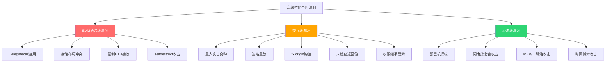
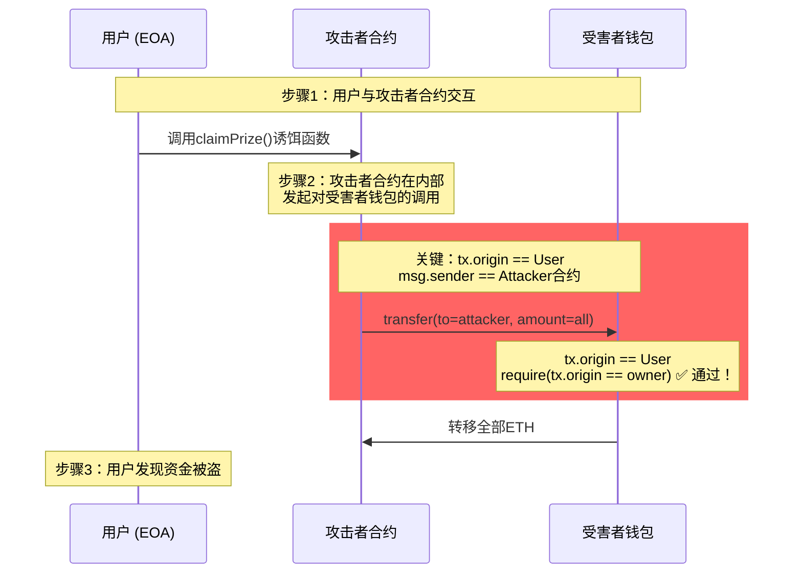
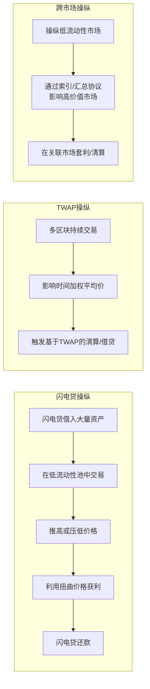
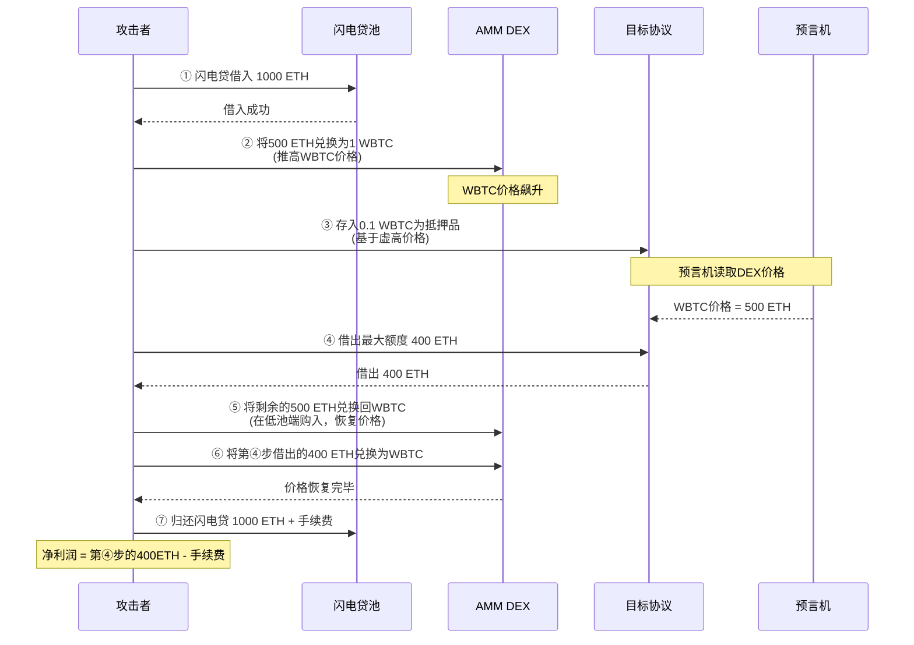
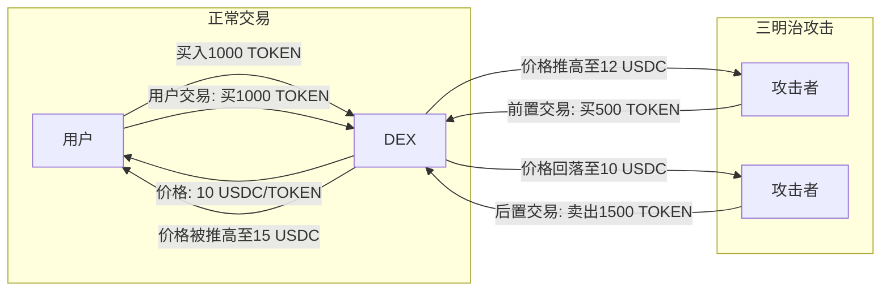

## 22.5 高级智能合约漏洞

### 知识体系总览

高级智能合约漏洞是Solidity开发中最危险、最难防范的安全陷阱。不同于基础漏洞（如整数溢出），高级漏洞往往涉及EVM底层机制、合约间交互模式和经济博弈，攻击手法更为隐蔽，损失金额动辄上亿美元。

本节的漏洞分类体系如下：



**图22.5-1：高级智能合约漏洞分类体系。EVM语义级漏洞根植于EVM底层设计，交互级漏洞源于合约间通信模式，经济级漏洞涉及代币经济博弈。**

---

### 22.5.1 Delegatecall 深度剖析——EVM最危险的指令

#### 原理与机制

`delegatecall`是EVM中五种CALL指令之一，其核心特性是**在调用者的存储上下文中执行被调用者的逻辑**。具体来说：

| 属性 | `call` | `delegatecall` | `staticcall` |
|------|--------|----------------|--------------|
| 存储上下文 | 被调用者 | **调用者** | 被调用者 |
| `msg.sender` | 调用者合约 | **维持不变** | 调用者合约 |
| `msg.value` | 传递ETH | **维持不变** | 禁止 |
| 修改状态 | 允许 | 允许 | **禁止** |
| 适用场景 | 普通跨合约调用 | **代理/升级模式** | 只读查询 |

**表22.5-1：EVM三种主要CALL指令的语义对比**

`delegatecall`的设计初衷是实现合约的"可插拔逻辑升级"——代理合约通过`delegatecall`将调用转发到最新逻辑实现。但这一强大能力也带来了双重风险：

- **存储篡改风险**：被调用的逻辑合约可以任意修改代理合约的存储变量
- **上下文欺骗风险**：`msg.sender`保持不变，使权限验证变得复杂

#### 攻击场景一：Parity多签钱包事件（1.5亿美元冻结）

2017年7月，Parity多签钱包的`WalletLibrary`合约遭遇攻击，直接导致约1.5亿美元ETH被冻结，是区块链史上最著名的`delegatecall`漏洞案例之一。

**漏洞代码复现：**

```solidity
// Parity Wallet 的简化版本
contract WalletLibrary {
    address public owner;
    mapping(address => bool) public isOwner;
    uint256 public dailyLimit;
    
    // 注意：initWallet 没有权限控制！
    function initWallet(address[] memory _owners, uint256 _dailyLimit) public {
        isOwner[msg.sender] = true;  // 任何人都能将自己设为owner
        owner = msg.sender;
        dailyLimit = _dailyLimit;
    }
}

contract WalletProxy {
    address public owner;
    mapping(address => bool) public isOwner;
    uint256 public dailyLimit;
    address public library;
    
    function() external payable {
        // 低层级delegatecall，未验证目标地址
        library.delegatecall(msg.data);
    }
}
```

**攻击流程（两步）：**

1. **第一步**：攻击者通过代理合约的`fallback`调用`WalletLibrary.initWallet()`，传入自己的地址。由于`delegatecall`在代理合约的存储上下文中执行，攻击者成功将`isOwner[attacker]=true`写入代理合约的存储槽。

2. **第二步**：攻击者调用`WalletLibrary.kill()`（如果存在）或其他资金转移函数，从代理合约中提取ETH。

**实际后果**：攻击导致约513,774.16 ETH（当时价值约1.5亿美元）被永久冻结，因为最终修复方案是"自杀"了`WalletLibrary`合约本身，导致所有依赖它的多签钱包彻底无法操作。

#### 攻击场景二：存储碰撞（Storage Collision）

当代理合约和逻辑合约的存储布局不一致时，`delegatecall`会导致灾难性的数据覆盖：

```solidity
// 合约A（原始实现）slot 0=owner, slot 1=balance
contract A {
    address owner;      // slot 0
    uint256 balance;    // slot 1
    
    function setOwner(address _owner) public {
        owner = _owner;
    }
}

// 合约B（更新后的实现！）slot 0=balance, slot 1=owner  
contract B {
    uint256 balance;    // slot 0——这会覆盖A的owner！
    address owner;      // slot 1——这会覆盖A的balance！
    
    function withdraw() public {
        // 攻击者调用此函数时，实际上修改的是owner变量！
    }
}
```

**关键原理**：`delegatecall`严格按照**存储槽编号**映射，而非变量名。合约B的`balance`（slot 0）会覆盖合约A的`owner`（slot 0），即使它们的语义完全不同。

#### 攻击场景三：selfdestruct 配合 delegatecall

更隐蔽的攻击手法是将`selfdestruct`注入到通过`delegatecall`调用的逻辑中：

```solidity
contract MaliciousImpl {
    function hijack() public {
        selfdestruct(payable(address(0)));  // 销毁代理合约！
    }
}
```

当代理合约通过`delegatecall`调用`hijack`时，`selfdestruct`在代理合约的上下文中执行，导致**代理合约本身被销毁**。所有资金被强制发送到指定地址（此处是黑洞地址），造成永久性损失。

#### 防御体系：三层防护策略

**第一层——存储布局保护（必须执行）：**
- 使用EIP-1967标准存储槽（`0x360894...`）存储实现地址，避开常规存储槽
- 实现合约和代理合约必须使用**完全相同的继承顺序和变量声明顺序**
- 使用OpenZeppelin的`StorageSlot`库来管理实现地址
- 实现合约继承`Initializable`而非使用`constructor`，避免初始化冲突

**第二层——升级权限控制（强烈推荐）：**
- `upgradeTo()`函数必须限制权限：`onlyOwner`或`onlyGovernance`
- 升级权限使用**多签钱包**（至少3/5安全模型）或**时间锁**（48小时延迟）
- 推荐OpenZeppelin的`UUPSUpgradeable`模式（EIP-1822），将升级逻辑放在实现合约中
- 避免代理模式中的`initialize`函数可被任何人调用

**第三层——运行时保护（防御纵深）：**
- 实现合约中加入`onlyDelegatecall`修饰器，防止被直接调用（`address(this)==address(this) check`）
- 使用OpenZeppelin的透明代理模式（Transparent Proxy Pattern）
- 在`upgradeTo`中检查新实现合约的`DELEGATECALL`安全性
- 部署前进行Echidna/Hardhat invariant测试，验证存储布局一致性

> **防御黄金法则**：绝不在升级后的实现合约中移除或重排存储变量。如果必须添加新变量，追加到最后；如果必须删除变量，保留存储槽并添加注释`__DEPRECATED_SLOT_X`。

---

### 22.5.2 tx.origin 深度钓鱼攻击

#### 原理解析

`tx.origin`和`msg.sender`是Solidity中最容易被混淆的两个全局变量：

```solidity
// EOA_A → 合约B → 合约C
// 在合约C中：
//   msg.sender == 合约B  （直接调用者）
//   tx.origin == EOA_A   （交易发起者）
```

`tx.origin`返回的是整个调用链的**最原始发起者**（EOA地址），而不是直接调用者。当合约使用`tx.origin`进行权限验证时，任何诱导用户调用的合约都可以借用用户的身份。

#### 攻击流程详解



**图22.5-2：tx.origin钓鱼攻击完整流程。攻击者合约借用了用户的交易起源身份。**

#### 诱饵手段（攻击者如何诱导用户）

攻击者常用的诱导手段包括：
- 空投领取代币（`claimAirdrop()`）
- 免费铸造NFT
- 参与抽奖/竞猜
- ETH 2.0质押合约伪装
- 部署看起来合法的DApp界面（钓鱼站）

#### 防御方法

**第一优先级：使用`msg.sender`替代`tx.origin`**
```solidity
// 正确写法
function transfer(address to, uint256 amount) public {
    require(msg.sender == owner, "Not owner");  // ✅ 安全
    payable(to).transfer(amount);
}
```

**第二优先级：使用OpenZeppelin的AccessControl库**
```solidity
import "@openzeppelin/contracts/access/AccessControl.sol";

contract MyWallet is AccessControl {
    bytes32 public constant OWNER_ROLE = keccak256("OWNER_ROLE");
    
    constructor() {
        _grantRole(OWNER_ROLE, msg.sender);
    }
    
    function transfer(address to, uint256 amount) public onlyRole(OWNER_ROLE) {
        payable(to).transfer(amount);
    }
}
```

**第三优先级：严格限制合约间调用**
- 使用`require(msg.sender == tx.origin)`来**拒绝合约调用**（仅允许EOA直接调用）
- 但这会破坏与DeFi协议的互操作性，仅适用于特定场景

> **最佳实践**：在你的整个代码库中全局搜索`tx.origin`，除了极少数特定场景（如拒绝合约调用），应该全部替换为`msg.sender`。

---

### 22.5.3 未检查的外部调用返回值

#### 历史背景

EVM提供了三种发送ETH的方式，它们在错误处理语义上有本质区别：

| 方法 | 失败行为 | 返回值 | Gas限制 | 推荐程度 |
|------|---------|--------|---------|---------|
| `transfer(amount)` | 自动回滚 | 无 | 2300 gas | Solidity <0.8.0推荐 |
| `send(amount)` | 返回false | bool | 2300 gas | **不推荐** |
| `call{value: amount}("")` | 返回false | (bool,) | 无限制 | ✅ **推荐** |

**表22.5-2：三种ETH发送方式的对比。`transfer`和`send`的2300 gas上限在EVM版本升级（Istanbul硬分叉后）下可能不足以完成事件日志和fallback中的操作，因此现在`call`是最佳选择。**

#### 攻击场景：跨链桥深度回调陷阱

```solidity
// 漏洞合约——跨链桥的资金提取逻辑
contract VulnerableBridge {
    mapping(address => uint256) public balances;
    
    function withdraw(uint256 amount) external {
        require(balances[msg.sender] >= amount, "Insufficient balance");
        balances[msg.sender] -= amount;  // 先扣余额
        
        // 漏洞！使用send但未检查返回值
        payable(msg.sender).send(amount);  // send失败仅返回false！
        
        // 事件依然触发，链下监控认为提取成功
        emit Withdrawn(msg.sender, amount);
    }
}
```

**攻击场景**：当接收合约的`fallback`或`receive`函数消耗超过2300 gas时（例如在Istanbul硬分叉后，SLOAD成本从200增加到800），`send`调用会静默失败。但状态已经更新（`balances`被扣减），事件已触发，导致链下索引器记录错误的提款记录。

#### 防御方法：四层防护

**第一层——使用`call`并检查返回值（最推荐）：**
```solidity
function withdraw(uint256 amount) external {
    require(balances[msg.sender] >= amount, "Insufficient balance");
    balances[msg.sender] -= amount;  // 提前扣款（checks-effects-interactions模式）
    
    (bool success, ) = payable(msg.sender).call{value: amount}("");
    require(success, "Transfer failed");  // ✅ 关键！检查返回值和回滚
}
```

**第二层——使用OpenZeppelin的Address库：**
```solidity
import "@openzeppelin/contracts/utils/Address.sol";

contract SafeBridge {
    using Address for address payable;
    
    function safeWithdraw(uint256 amount) external {
        // sendValue内部已经包含require(success)
        payable(msg.sender).sendValue(amount);
    }
}
```

**第三层——Checks-Effects-Interactions模式（全局适用）：**
1. **Checks**：先检查所有前置条件（余额检查、权限检查）
2. **Effects**：更新合约内部状态（扣减余额、更新状态变量）
3. **Interactions**：最后执行外部调用

**第四层——使用ReentrancyGuard（防御重入+未检查返回值的复合攻击）：**
```solidity
import "@openzeppelin/contracts/security/ReentrancyGuard.sol";

contract SecureWithdraw is ReentrancyGuard {
    function withdraw(uint256 amount) external nonReentrant {
        // ...
        (bool success, ) = msg.sender.call{value: amount}("");
        require(success);
    }
}
```

> **误区澄清**：很多人认为`transfer`是最安全的方式，但在Istanbul硬分叉后，2300 gas的限制可能导致接收合约的`fallback`函数因gas不足而失败，特别是在需要写入事件日志时。因此**2024年最佳实践是使用`call`+返回值检查+Checks-Effects-Interactions模式**。

---

### 22.5.4 强制ETH接收——来自区块链底层的强制力

#### 原理

以太坊中存在三种无需经过合约`receive`或`fallback`函数就能向合约发送ETH的机制：

| 机制 | 是否可绕过receive/fallback | 是否可预防 |
|------|---------------------------|-----------|
| `selfdestruct` 目标地址 | ✅ 完全绕过 | ❌ 无法预防 |
| 合约挖矿收益地址（已废弃） | ✅ 完全绕过 | ❌ 无法预防 |
| 创世区块余额预分配 | ✅ 完全绕过 | ❌ 无法预防 |

**表22.5-3：三种强制ETH发送机制**

其中`selfdestruct`是最常见的攻击途径：

```solidity
// 攻击合约——只需消耗21,000 gas基础费用
contract ForceEther {
    constructor(address payable target) payable {
        // 在部署时或通过kill函数向目标强制发送ETH
    }
    
    function attack() public {
        selfdestruct(payable(target));  // 强制将合约余额发送到target
    }
}
```

#### 影响范围

强制ETH接收会破坏以下逻辑：

**场景1——余额检查型合约：**
```solidity
// 有漏洞的彩票合约
contract Lottery {
    function selectWinner() public {
        // 基于合约余额选择赢家——有漏洞！
        uint256 winnerIndex = uint256(keccak256(abi.encodePacked(block.timestamp))) % (address(this).balance / 1 ether);
        // ...
    }
}
```
攻击者可以通过`selfdestruct`注入ETH，操纵`address(this).balance`，控制赢家选择逻辑。

**场景2——精确余额依赖型合约：**
- AMM池子中通过`balance`计算储备量的合约（如果依赖于原生ETH而非ERC-20）
- 借贷协议中检查清算阈值的合约
- 链上保险合约中验证资本充足率的合约

#### 防御方法

**正确的做法——使用内部记账：**
```solidity
contract SecureLottery {
    // 使用内部变量跟踪用户存款
    mapping(address => uint256) public deposits;
    uint256 public totalDeposits;
    
    function deposit() external payable {
        deposits[msg.sender] += msg.value;
        totalDeposits += msg.value;
    }
    
    function selectWinner() public {
        // 使用内部记账而非address(this).balance
        require(totalDeposits > 0, "No deposits");
        uint256 winnerIndex = uint256(keccak256(abi.encodePacked(block.timestamp))) % totalDeposits;
        // ...
    }
}
```

**额外的保护措施：**
- 在关键函数中添加`require(address(this).balance >= totalDeposits)`作为一致性检查
- 在合约初始化时记录初始余额
- 在`receive`和`fallback`函数中加入验证逻辑（虽然不能阻止`selfdestruct`，但可以检测异常）

---

### 22.5.5 预言机操纵深度进阶

#### 攻击分类与机制

预言机操纵是DeFi中最致命的攻击向量之一，2020-2024年间因预言机操纵导致的损失超过30亿美元。攻击类型可以分为三个层次：



**图22.5-3：三种预言机操纵攻击的时间尺度对比。闪电贷操纵在单个交易（约12秒）内完成，TWAP操纵需要多个区块（分钟级），跨市场操纵则依赖协议间的价格关联。**

#### 闪电贷瞬时价格操纵

这是2020-2022年间最频繁的攻击类型，核心原理是利用闪电贷瞬时获得大量资金，在低流动性AMM池中操纵价格：

**攻击流程（以bZx事件为例）：**

1. **闪电贷借入**：攻击者从dYdX闪电贷借入10,000 ETH
2. **杠杆做空**：在Compound存入ETH作为抵押，借出112 WBTC
3. **价格压制**：在Uniswap V2上将112 WBTC全部卖出，获得6,871 ETH，WBTC/ETH价格暴跌
4. **收割利润**：在bZx的WBTC杠杆做多合约中，由于预言机读取Uniswap池价格，触发低价清算
5. **还款获利**：攻击者以低价平仓，归还闪电贷，获利约350,000美元

**真实案例数据：**

| 攻击事件 | 时间 | 损失金额 | 攻击类型 | 预言机来源 |
|---------|------|---------|---------|-----------|
| bZx (2020.02) | 2020-02-15 | $350K | 闪电贷+Uniswap价格 | Uniswap单源 |
| Harvest Finance (2020.10) | 2020-10-26 | $24M | 闪电贷+Curve池操纵 | Curve单源 |
| PancakeBunny (2021.05) | 2021-05-20 | $45M | 闪电贷+LP价格操纵 | PancakeSwap单源 |
| Cream Finance (2021.10) | 2021-10-27 | $130M | 闪电贷+多池操纵 | Compound Fork |
| Mango Markets (2022.10) | 2022-10-11 | $114M | 预言机操纵+治理攻击 | 自建预言机 |

**表22.5-4：历史上最大的五次预言机操纵攻击事件**

#### TWAP操纵——慢但更难防范

时间加权平均价格（TWAP）虽然比瞬时价格更安全（因为需要跨多个区块持续影响价格），但并非不可突破：

```solidity
// TWAP计算的简化实现
uint256 public twap;
uint256 public lastUpdateBlock;
uint256 public lastPrice;

function updateTWAP(uint256 currentPrice) internal {
    uint256 elapsed = block.number - lastUpdateBlock;  // 经过的区块数
    // TWAP = (上一周期价格 × 经过区块数 + 当前价格) / (总时间窗口)
    twap = (twap * elapsed + currentPrice) / (elapsed + 1);  // 简化实现有漏洞
}
```

**攻击方式**：在TWAP窗口期的最后几个区块中，攻击者利用大额交易拉高/压低价格，虽然TWAP会缓冲部分影响，但如果攻击者的交易量远超正常交易量，TWAP仍会被显著扭曲。

**真实案例**：2023年2月的pGALA事件，攻击者利用低流动性的GALA/ETH池，在多个区块买入GALA，推高TWAP价格，然后在协议中以虚高价格借出资产。

#### 防御体系：多层预言机安全

**第一层——来源多样化（Oracle Diversity）：**
- 使用**多个独立的预言机源**：Chainlink + MakerDAO + 自建节点
- 要求`N个源中有M个达成一致`才执行操作（如3/5多源共识）
- **核心指标**：每个数据源的数据源数量不少于3个

**第二层——价格合理性检查（Sanity Checks）：**
```solidity
// 价格偏差检测器
contract PriceGuard {
    uint256 public constant MAX_DEVIATION = 5e16;  // 最大允许5%偏差
    uint256 public lastPrice;
    uint256 public priceUpdatedAt;
    
    function checkPrice(uint256 newPrice) internal returns (bool) {
        if (lastPrice == 0) {
            lastPrice = newPrice;
            return true;
        }
        
        // 计算价格变化百分比
        uint256 change = newPrice > lastPrice 
            ? (newPrice - lastPrice) * 1e18 / lastPrice
            : (lastPrice - newPrice) * 1e18 / lastPrice;
        
        require(change <= MAX_DEVIATION, "Price deviation too high");
        lastPrice = newPrice;
        return true;
    }
}
```

**第三层——时间缓冲（Time Delays）：**
- 使用TWAP预言机，窗口期至少30分钟
- 关键操作（借贷、清算、大额交易）添加15-60分钟延迟
- 使用Chainlink的`latestRoundData`而非`latestAnswer`，并检查`updatedAt`时间戳

**第四层——经济安全边界（Economic Boundaries）：**
- 设置价格下限和上限（`minPrice`和`maxPrice`）
- 使用Chainlink的聚合层而非底层Uniswap价格
- 对预言机更新频率设置限制

---

### 22.5.6 重入攻击——DAO梦魇的现代变种

#### 原理解析

重入攻击的核心是利用**外部调用后将控制权交给接收者**的特性，让接收者在被调用的合约状态更新完成之前，再次调用该合约的函数。

2016年The DAO攻击是重入攻击最著名的案例，导致约360万ETH（当时价值约7000万美元）被盗，最终引发了以太坊的硬分叉。

#### 变种一：跨函数重入

即使单个函数已经防止了重入，攻击者仍可能通过**同一个函数的多次外部调用**实现跨函数重入：

```solidity
contract CrossFunctionReentrancy {
    mapping(address => uint256) public shares;
    mapping(address => bool) public claimed;
    
    // 函数A：赎回首轮代币
    function redeemFirstRound() external {
        require(!claimed[msg.sender], "Already claimed");
        (bool success, ) = msg.sender.call{value: shares[msg.sender]}("");
        require(success, "Transfer failed");
        claimed[msg.sender] = true;  // 状态更新在外部调用之后！
    }
    
    // 函数B：赎加第二轮代币（共享同一状态）
    function redeemSecondRound() external {
        require(!claimed[msg.sender], "Already claimed");
        (bool success, ) = msg.sender.call{value: shares[msg.sender] / 2}("");
        require(success, "Transfer failed");
        claimed[msg.sender] = true;  // 同样在外部调用之后！
    }
}
```

**攻击方式**：攻击者合约在`redeemFirstRound`的`call`回调中再次调用`redeemSecondRound`，此时`claimed[attacker]`还未被设置为true，两次赎回都成功执行。

#### 变种二：只读重入（Read-Only Reentrancy）

这是2023年才被广泛认知的新型攻击向量：

```solidity
// 协议A在balanceOf()中不更新状态
contract ProtocolA {
    mapping(address => uint256) public lastBalance;
    
    function balanceOf(address user) public view returns (uint256) {
        return lastBalance[user];
    }
    
    function processTransfer(address user) external {
        // 读取balanceOf来决定转账金额——被重入攻击
        uint256 bal = balanceOf(user);
        
        // 在外部调用中，协议B回调balanceOf()
        (bool success, ) = user.call{value: bal}("");
        require(success);
        
        lastBalance[user] = 0;  // 状态更新在外部调用之后
    }
}
```

**关键特性**：如果接收合约在回调中调用了**同一个合约的`view`函数**（如`balanceOf`），而`view`函数由于EVM的设计**不会检测重入**，攻击者可以读取到未更新的状态值，欺骗依赖这些值的下游合约。

#### 防御方法：五层防护

**第一层——Checks-Effects-Interactions（CEI）模式：**
```solidity
function withdraw(uint256 amount) external {
    // Checks
    require(balances[msg.sender] >= amount, "Insufficient balance");
    
    // Effects（在外部调用之前更新状态！）
    balances[msg.sender] -= amount;
    totalSupply -= amount;
    
    // Interactions
    (bool success, ) = msg.sender.call{value: amount}("");
    require(success);
}
```

**第二层——ReentrancyGuard（互斥锁）：**
```solidity
import "@openzeppelin/contracts/security/ReentrancyGuard.sol";

contract SecureWithdraw is ReentrancyGuard {
    function withdraw(uint256 amount) external nonReentrant {
        // 所有外部风险函数都添加nonReentrant修饰器
        (bool success, ) = msg.sender.call{value: amount}("");
        require(success);
    }
}
```

**第三层——条件限制修饰器：**
```solidity
modifier onlyOnceAfterStateChange() {
    // 确保状态已更新
    require(stateUpdated, "State not updated yet");
    _;
}
```

**第四层——只读重入的特殊防护：**
- 在`view`函数中加入重入检查（虽然EVM不限制，但可以使用自定义`_reentrancyStatus`）
- 对敏感`view`函数使用`whenNotPaused`条件
- 考虑将关键数据从EVM存储迁移到L2或链下

**第五层——完整的单元测试覆盖：**
- 使用 Foundry 的 fuzz testing 测试各种重入场景
- 编写专门的"攻击者合约"来模拟重入攻击
- 测试不仅在单个函数上，还要跨函数、跨合约测试

---

### 22.5.7 签名重放攻击——跨链的幽灵

#### 原理解析

EIP-712结构化签名在以太坊生态中被广泛使用（Permit、MetaTx等），但签名缺乏域隔离时会导致重放攻击：

**签名重放的三种类型：**

| 类型 | 描述 | 跨链/跨合约 | 防御难度 |
|------|------|------------|---------|
| 同链重放 | 同一合约上同一个签名被多次提交 | 否 | 低（使用nonce） |
| 跨合约重放 | 同一签名被用于同一链上的不同合约 | 是 | 中（使用合约地址） |
| **跨链重放** | 同一签名被用于不同链（ETH/BSC/Polygon） | **是** | **高**（使用chainId） |

**表22.5-5：三种签名重放攻击类型**

#### 跨链重放攻击详解

```solidity
// 有漏洞的Permit签名验证——没有绑定chainId
contract VulnerablePermit {
    using ECDSA for bytes32;
    
    function permit(
        address owner, address spender, uint256 value,
        uint256 deadline, uint8 v, bytes32 r, bytes32 s
    ) external {
        // 漏洞！没有在签名中包含chainId
        bytes32 digest = keccak256(abi.encodePacked(
            "\x19Ethereum Signed Message:\n32",
            keccak256(abi.encode(owner, spender, value, nonces[owner]++, deadline))
        ));
        
        address recovered = digest.recover(v, r, s);
        require(recovered == owner, "Invalid signature");
        // ...
    }
}
```

**攻击流程**：
1. 用户在主网（Ethereum Mainnet）签署一笔Permit，授权某个DApp使用其代币
2. DApp在链上提交并执行该签名
3. 攻击者捕获该签名（从交易的`input data`中提取）
4. 攻击者在其他链（BSC、Polygon、Arbitrum）上提交**同一个签名**
5. 如果目标合约在其他链上部署并缺少链ID验证，攻击者可以**重复使用同一个签名**

#### 防御方法：Domain Separator

```solidity
// 正确的EIP-712签名验证
import "@openzeppelin/contracts/utils/cryptography/EIP712.sol";

contract SecurePermit is EIP712 {
    bytes32 private constant PERMIT_TYPEHASH = keccak256(
        "Permit(address owner,address spender,uint256 value,uint256 nonce,uint256 deadline)"
    );
    
    mapping(address => uint256) public nonces;
    
    constructor() EIP712("TokenName", "1") {}  // 自动绑定chainId
    
    function permit(...) external {
        bytes32 structHash = keccak256(
            abi.encode(PERMIT_TYPEHASH, owner, spender, value, nonces[owner]++, deadline)
        );
        bytes32 digest = _hashTypedDataV4(structHash);  // ✅ 自动包含chainId和合约地址
        
        address recovered = ECDSA.recover(digest, v, r, s);
        require(recovered == owner, "Invalid signature");
        // ...
    }
}
```

**使用OpenZeppelin的EIP712库后，`_hashTypedDataV4`会自动将`chainId`和`verifyingContract`地址编码到摘要中，完全防止跨链和跨合约重放。**

#### 额外的防御层

- **Nonce机制**：每个地址维护递增的nonce，防止同链重放
- **截止时间**：添加`deadline`参数，限制签名有效时间窗口
- **双链部署检查**：确保部署在不同链上的合约地址不同
- **链ID验证**：在签名中显式包含`block.chainid`

---

### 22.5.8 闪电贷复合攻击——多步骤攻击链

#### 攻击架构

闪电贷复合攻击是当前最复杂的攻击形式，它将闪电贷、预言机操纵、重入、签名重放等多种攻击手法组合在一个交易中完成：



**图22.5-4：典型的闪电贷复合攻击链。整个攻击在单一交易（约12秒）内完成。**

#### 真实案例：Cream Finance攻击（1.3亿美元）

2021年10月，Cream Finance遭遇史上最复杂的闪电贷复合攻击之一，损失约1.3亿美元。

**攻击步骤分解：**

1. **闪电贷借入**：从多个闪电贷协议（Aave + dYdX）借入大量ETH和代币
2. **LP份额操纵**：将借入的代币存入Cream的crETH/crToken池，获得LP份额
3. **LP价格扭曲**：利用Cream的LP代币价格计算漏洞（读取池子储备量而非使用TWAP），通过大量交易扭曲LP价格
4. **超额借贷**：以虚高的LP份额为抵押，借出大量资产
5. **闪电贷还款**：归还闪电贷，净获利约1.3亿美元

**漏洞根因**：Cream使用`ethPerLP()`函数直接从AMM池的当前储备量计算LP代币价格，未使用TWAP或外部预言机，使闪电贷驱动的价格扭曲成为可能。

#### 防御架构：多层防御纵深

**第一层——价格源安全（预测机层）：**
- 所有价格计算必须使用TWAP或Chainlink，禁止使用AMM即时价格
- LP代币的估值公式必须包含时间加权因素
- 设置每个用户/每笔交易/每个区块的借贷上限

**第二层——借贷参数（协议层）：**
- 抵押率上限：最高75%（即每1美元抵押品最多只能借0.75美元）
- 清算阈值与抵押率保持至少15%的缓冲
- 初始借贷上限：新资产前7天的借贷上限不超过总流动性的10%

**第三层——运行时风控（执行层）：**
- 交易级别的gas消耗上限（防止闪电贷的复杂调用栈）
- 单笔交易的跨合约调用深度限制
- 同一区块内的交易排名监控和价格验证

---

### 22.5.9 MEV与三明治攻击

#### 原理解析

MEV（Miner Extractable Value / Maximum Extractable Value）是指矿工或验证者通过重新排序、插入或审查交易来提取的价值。三明治攻击是MEV中最常见的形式：



**图22.5-5：三明治攻击的完整流程。攻击者通过前置买入抬高价格，等待用户买入进一步推高价格后，后置卖出来获利。**

#### 统计数据与影响

根据Flashbots的数据：

- 以太坊上每天因三明治攻击损失的用户约**$15-25M**
- 约**12-15%** 的Uniswap V2/V3交易受到三明治攻击
- 攻击者平均收益率约为**0.03-0.1%** 每笔交易
- 2022年，MEV提取总值约**$700M**

#### 防御方法

**用户侧防御——使用RPC防御：**
- 使用Flashbots Protect RPC（`https://rpc.flashbots.net`）
- 使用MEV Blocker（`https://rpc.mevblocker.io`）
- 使用CoW Swap聚合器，通过批量拍卖实现零滑点

**协议侧防御：**
```solidity
// 使用commit-reveal方案防止前置交易
contract CommitReveal {
    mapping(bytes32 => bool) public commitments;
    mapping(address => uint256) public lastBatchId;
    
    function commit(bytes32 hash) external {
        commitments[hash] = true;
        emit Committed(msg.sender, hash);
    }
    
    function reveal(uint256 amount, uint256 nonce) external {
        bytes32 hash = keccak256(abi.encodePacked(msg.sender, amount, nonce));
        require(commitments[hash], "Invalid commit");
        delete commitments[hash];
        
        // 执行交易，此时攻击者无法获取交易内容
        executeTrade(amount);
    }
}
```

**三明治攻击特定的防御调整：**
- AMM池添加**价格限幅**（Price Impact Limit）
- 使用**时间加权自动做市商**（TWAMM）
- 实现**批量拍卖**机制，所有订单在同一价格执行

---

### 安全审计与工具链

#### 审计工具比较

| 工具 | 类型 | 检测能力 | 误报率 | 适用阶段 |
|------|------|---------|-------|---------|
| Slither | 静态分析 | 基础漏洞~DeFi模式 | 中 | 开发期 |
| Mythril | 符号执行 | 组合漏洞 | 高 | 开发期 |
| Echidna | Fuzz测试 | 不变量违例 | 低 | 测试期 |
| Certora Prover | 形式化验证 | 任意属性 | 低 | 审计期 |
| Foundry fuzz | Fuzz测试 | 状态空间探索 | 低 | 测试期 |
| Halmos | 符号测试 | 复杂路径 | 低 | 审计期 |

**表22.5-6：主流智能合约审计工具对比。没有工具能发现所有漏洞，推荐组合使用。**

#### 推荐审计流程

```text
代码开发 → Slither静态扫描 → Foundry单元测试+模糊测试
    → Echidna不变量测试 → 内部代码审查 →
        外部审计（2-3家） → 修复+再审计 →
            正式部署 → 持续监控（Forta/Tenderly警报）
```

#### 安全参考资料

- **书籍**：《Blockchain Security: The Complete Guide》— SmartContractSecurity
  - 《Solidity Programmer's Guide to Smart Contract Security》— N. Atzei
- **文档**：OpenZeppelin Security Audits（https://blog.openzeppelin.com/security-audits）
  - ConsenSys Diligence（https://consensys.net/diligence/）
  - Trail of Bits（https://blog.trailofbits.com/category/ethereum/）
- **实战平台**：Ethernaut（https://ethernaut.openzeppelin.com/）
  - Damn Vulnerable DeFi（https://www.damnvulnerabledefi.xyz/）
  - Capture the Ether（https://capturetheether.com/）

---

### 最佳实践总结

```mermaid
flowchart TD
    A[智能合约安全开发] --> B[开发前]
    A --> C[开发中]
    A --> D[部署前]
    A --> E[部署后]
    
    B --> B1[安全架构设计]
    B --> B2[威胁建模分析]
    B --> B3[选择审计过的库]
    
    C --> C1[CEI模式]
    C --> C2[ReentrancyGuard]
    C --> C3[多源预言机]
    C --> C4[正确的存储布局]
    C --> C5[EIP-712域隔离]
    C --> C6[内部记账(非balance)]
    
    D --> D1[Slither + Mythril扫描]
    D --> D2[Echidna不变量测试]
    D --> D3[第三方审计]
    D --> D4[漏洞赏金计划]
    
    E --> E1[实时监控告警]
    E --> E2[升级备选方案]
    E --> E3[应急预案]
    
    style A fill:#4a90d9,color:#fff
    style B fill:#7ed6df,color:#000
    style C fill:#e056fd,color:#fff
    style D fill:#f0932b,color:#fff
    style E fill:#6ab04c,color:#fff
```

**图22.5-6：智能合约安全开发全生命周期。安全不是部署前的单一检查，而是贯穿整个开发流程的持续实践。**

> **核心心法**：将安全性从"修复措施"提升为"设计原则"。最安全的合约不是审计最多的合约，而是从架构层面就最小化了攻击面的合约。信任最小值原则——不要信任任何人，包括预言机、管理员和用户。

---

### 本节练习

1. **基础题**：解释`delegatecall`和`call`在存储上下文上的核心区别，并说明为什么EIP-1967存储槽可以防止存储碰撞。

2. **进阶题**：分析以下代码中的漏洞，并给出修复方案：
   ```solidity
   contract TokenSale {
       address public owner;
       uint256 public price;
       mapping(address => bool) public purchased;
       
       function buy(uint256 amount) external payable {
           require(msg.value >= price * amount, "Insufficient payment");
           purchased[msg.sender] = true;
           (bool success, ) = msg.sender.call{value: address(this).balance}("");
           require(success);
       }
   }
   ```

3. **挑战题**：设计一个包含闪电贷、预言机和重入三种攻击向量的复合攻击流程，并用mermaid图描述。然后论述你用哪三层防御机制来阻止这个攻击。

---

### 扩展阅读

如需深入了解更多高级安全话题，请参阅本指南的以下相关内容：

- [22.1 智能合约常见漏洞](01-221智能合约常见漏洞.md)：整数溢出、访问控制、随机数预测
- [22.2 DeFi协议安全分析](02-222DeFi协议安全分析.md)：AMM、借贷、收益聚合器安全
- [22.3 安全审计工具](03-223安全审计工具.md)：签名劫持、钱包钓鱼、前端注入
