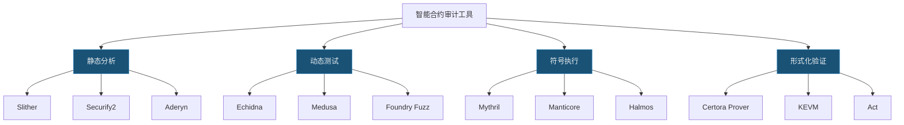
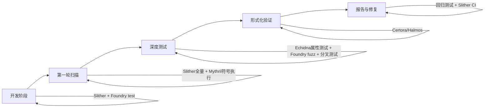
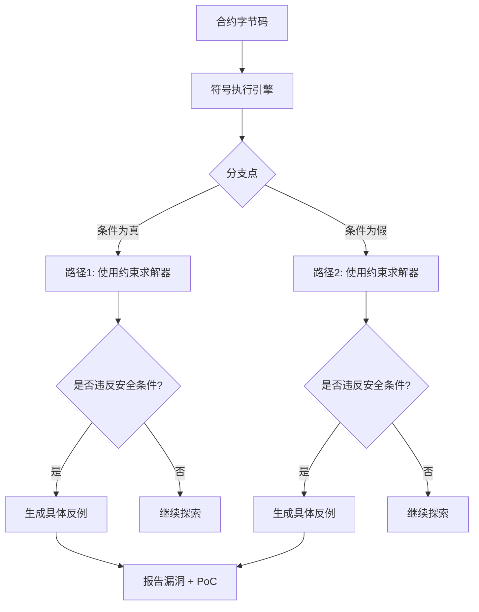
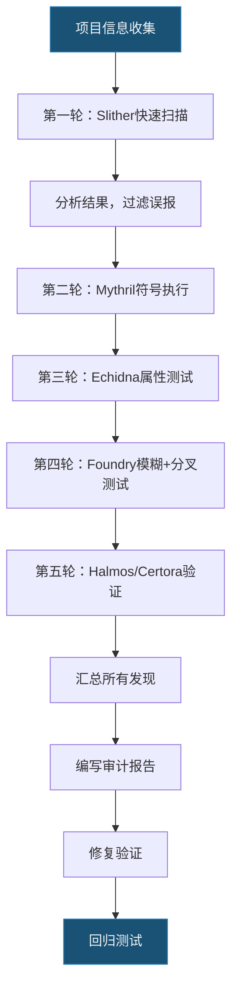
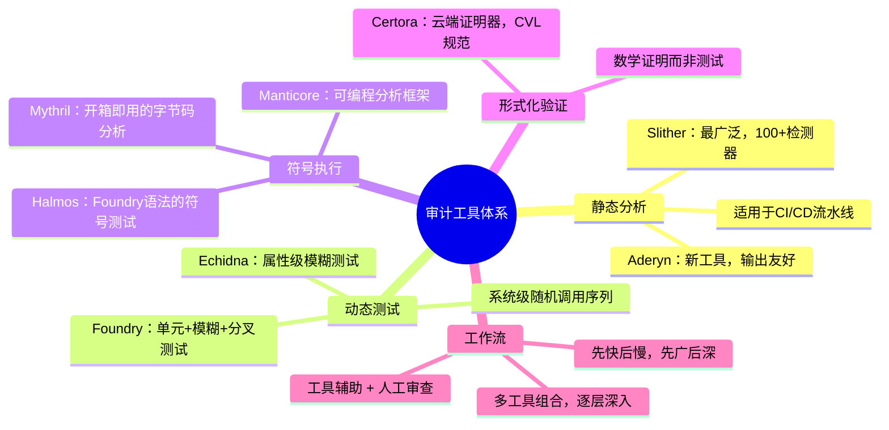

## 22.6 安全审计工具详解

智能合约审计工具是安全工程师的"武器库"。每种工具的检测原理、适用场景和局限性各不相同——静态分析快但有漏报，符号执行深但有状态爆炸问题，模糊测试覆盖面广但无法穷举路径，形式化验证最严格但需要大量人力编写规范。真正专业的审计能力体现在**根据目标合约的特征选择最合适的工具组合**，并能解读工具输出、过滤误报、补足工具盲区。

本节对主流审计工具进行系统性深度讲解，从工作原理到高级用法，从单工具精通到多工具协同，帮助读者建立完整的工具链思维。

### 22.6.1 审计工具全景概览

在深入单个工具之前，先建立全局视角。智能合约安全审计工具按检测技术可分为四大类：



| 工具 | 检测技术 | 速度 | 深度 | 误报率 | 适用阶段 |
|------|---------|------|------|--------|---------|
| Slither | 静态分析（AST/IR） | 秒级 | 中 | 中 | 开发全程、CI/CD |
| Mythril | 符号执行 | 分钟级 | 高 | 低 | 审计中期 |
| Echidna | 属性模糊测试 | 小时级 | 中高 | 低 | 审计深度测试 |
| Foundry | 单元+模糊+分叉测试 | 秒~分钟级 | 中 | 极低 | 开发全程 |
| Manticore | 符号执行 | 分钟~小时级 | 高 | 低 | 审计深度分析 |
| Certora | 形式化验证 | 小时级 | 极高 | 零 | 审计最终验证 |
| Halmos | 符号测试 | 分钟级 | 高 | 极低 | CI/CD、回归测试 |
| Aderyn | 静态分析 | 秒级 | 中 | 中 | 开发全程 |

**典型审计流程中的工具组合**：



### 22.6.2 Slither 静态分析框架（深度使用）

#### 工作原理

Slither 由 Trail of Bits 开发，是目前使用最广泛的 Solidity 静态分析工具。它不执行合约代码，而是将 Solidity 源码转换为内部的中间表示（IR），然后在 IR 层面进行图分析，包括控制流图（CFG）分析、数据依赖分析和污点分析。

核心分析步骤：

1. **编译**：调用 solc 编译器获取 AST（抽象语法树）
2. **IR 生成**：将 AST 转换为 SlithIR（Slither 自有的中间表示）
3. **图构建**：构建控制流图和数据依赖图
4. **检测器执行**：按优先级运行所有启用的检测器
5. **输出报告**：汇总检测结果

Slither 的速度快（通常几秒内完成分析），是因为它做了大量近似和启发式判断，这导致了速度快但存在误报（false positive）和漏报（false negative）的权衡。

#### 安装与环境配置

```bash
# 推荐使用虚拟环境
python3 -m venv slither-env
source slither-env/bin/activate

# 安装
pip install slither-analyzer

# 确保solc已安装（版本需匹配项目）
solc --version
# 如需管理多版本solc
pip install solc-select
solc-select install 0.8.20
solc-select use 0.8.20

# 验证安装
slither --version
```

#### 基础使用命令

```bash
# 分析单个文件
slither ./contracts/MyContract.sol

# 分析整个项目（需找到编译配置）
slither .

# 对Hardhat项目
slither . --hardhat-ignore-compile

# 对Foundry项目
slither . --foundry-ignore-compile

# 指定solc路径
slither ./contracts/MyContract.sol --solc /path/to/solc

# 指定solc-remaps
slither ./contracts/MyContract.sol \
  --solc-remaps "@openzeppelin/=lib/openzeppelin/"
```

#### 检测器分类与详解

Slither 内置 100+ 种检测器，按严重程度分为四类：

**高危检测器（High）**：

| 检测器ID | 漏洞类型 | 说明 |
|----------|---------|------|
| `reentrancy-eth` | 重入攻击（ETH） | 检测在ETH转账后未更新状态变量的模式 |
| `reentrancy-no-eth` | 重入攻击（非ETH） | 检测在外部调用后依赖未更新状态的模式 |
| `arbitrary-from-in-transferfrom` | transferFrom参数可操控 | from参数由用户输入而非msg.sender |
| `controlled-delegatecall` | delegatecall目标可控 | delegatecall地址可被攻击者控制 |
| `suicidal` | 自毁漏洞 | 合约包含可被外部调用的selfdestruct |
| `uninitialized-state` | 未初始化状态变量 | 存储指针变量可能未初始化 |
| `uninitialized-storage` | 未初始化存储 | storage引用变量未初始化导致覆盖 |

**中危检测器（Medium）**：

| 检测器ID | 漏洞类型 | 说明 |
|----------|---------|------|
| `tx-origin` | tx.origin认证 | 使用tx.origin进行身份验证，易被钓鱼攻击 |
| `unchecked-transfer` | 未检查转账返回值 | 忽略ERC20 transfer的返回值 |
| `locked-ether` | ETH被锁定 | 合约接受ETH但无提取函数 |
| `incorrect-equality` | 危险的相等判断 | 使用严格相等判断可能受操纵的值 |
| `divide-before-multiply` | 先除后乘精度损失 | 整数运算顺序不当导致精度损失 |

**低危/信息级检测器**：

```bash
# 列出所有检测器及其说明
slither --list-detectors

# 按严重程度过滤
slither ./contracts/ --detect high

# 仅运行特定检测器
slither ./contracts/MyContract.sol \
  --detect reentrancy-eth,reentrancy-no-eth,unchecked-transfer

# 排除特定检测器
slither ./contracts/MyContract.sol \
  --exclude naming-convention,external-function

# 排除特定路径（如第三方依赖）
slither ./contracts/ --filter-paths "node_modules|lib/openzeppelin"
```

#### 高级配置：slither.config.json

在项目根目录创建 `slither.config.json` 可以持久化分析配置，避免每次敲长命令：

```json
{
  "detectors_to_run": "all",
  "detectors_to_exclude": "naming-convention,solc-version",
  "exclude_dependencies": true,
  "filter_paths": "node_modules,lib,test,script",
  "json": "reports/slither-report.json",
  "checklist": true,
  "markdown": "reports/slither-report.md",
  "root_path": "./contracts",
  "solc_remaps": [
    "@openzeppelin/=lib/openzeppelin-contracts/"
  ]
}
```

#### 输出报告解读

**JSON报告结构**：

```json
{
  "success": true,
  "error": null,
  "results": {
    "detectors": [
      {
        "check": "reentrancy-eth",
        "impact": "High",
        "confidence": "Medium",
        "description": "Reentrancy in Vault.withdraw(IERC20).\n\tState variables written after the call...",
        "elements": [
          {
            "type": "function",
            "name": "withdraw",
            "source_mapping": {
              "start": 450,
              "length": 280,
              "filename_relative": "contracts/Vault.sol",
              "lines": [42, 43, 44, 45, 46]
            }
          }
        ]
      }
    ]
  }
}
```

**解读关键字段**：
- `check`：检测器ID，对应具体的漏洞模式
- `impact`：影响程度（High/Medium/Low/Informational）
- `confidence`：置信度（High/Medium/Low），低置信度结果需要人工验证
- `elements`：漏洞涉及的代码位置，包含精确的文件名和行号

**高置信度 + 高影响**的结果通常是真阳性（true positive），应优先修复。**低置信度**的结果需要逐个分析——可能是误报，也可能是工具缺乏足够上下文做出准确判断。

#### CI/CD 集成

将 Slither 集成到 CI 流水线中，在每次提交时自动扫描：

```yaml
# .github/workflows/security.yml
name: Security Analysis
on: [push, pull_request]

jobs:
  slither:
    runs-on: ubuntu-latest
    steps:
      - uses: actions/checkout@v4
      - uses: actions/setup-python@v5
        with:
          python-version: "3.11"
      - run: pip install slither-analyzer solc-select
      - run: solc-select install 0.8.20 && solc-select use 0.8.20
      - run: slither . --config-file slither.config.json --json reports/slither.json

      # 解析报告，高危问题直接失败
      - name: Check for High-severity findings
        run: |
          HIGH_COUNT=$(python3 -c "
          import json
          with open('reports/slither.json') as f:
              data = json.load(f)
          count = sum(1 for d in data['results']['detectors']
                      if d['impact'] == 'High')
          print(count)
          ")
          if [ "$HIGH_COUNT" -gt 0 ]; then
            echo "Found $HIGH_COUNT High-severity issues!"
            exit 1
          fi
```

**GitHub Action方式**（更简单）：

```yaml
- uses: crytic/slither-action@v0.4.0
  with:
    target: "contracts/"
    slither-config: "slither.config.json"
    fail-on: "high"
```

#### 自定义检测器开发

当内置检测器无法覆盖项目特有的业务逻辑漏洞时，需要编写自定义检测器：

```python
# detectors/my_custom_detector.py
from slither.core.cfg.node import NodeType
from slither.detectors.abstract_detector import (
    AbstractDetector, DetectorClassification
)
from slither.slithir.operations import LowLevelCall

class UnprotectedOwnerTransfer(AbstractDetector):
    """
    检测 owner 变量是否在没有 emit 事件的情况下被修改。
    安全规范要求所有权转移必须发出事件以便链下监控。
    """

    ARGUMENT = "unprotected-owner-transfer"
    HELP = "Owner transfer without event emission"
    IMPACT = DetectorClassification.HIGH
    CONFIDENCE = DetectorClassification.MEDIUM

    WIKI = "https://example.com/wiki/owner-transfer"
    WIKI_TITLE = "Unprotected Owner Transfer"
    WIKI_DESCRIPTION = "Owner transfer should emit an event."
    WIKI_EXPLOIT_SCENARIO = """
    Bob deploys a contract and transfers ownership to Eve without
    emitting an event. No one can detect the change off-chain.
    """

    def _detect(self):
        results = []
        for contract in self.compilation_unit.contracts_derived:
            for func in contract.functions:
                if not func.is_implemented:
                    continue
                # 检查函数是否修改了名为 owner 的状态变量
                owner_vars = [
                    v for v in contract.state_variables
                    if v.name == "owner"
                ]
                if not owner_vars:
                    continue

                for node in func.nodes:
                    for ir in node.irs:
                        if hasattr(ir, 'lvalue'):
                            for owner_var in owner_vars:
                                if ir.lvalue == owner_var:
                                    # 检查同函数是否有事件发出
                                    has_event = any(
                                        hasattr(i, 'event')
                                        for n in func.nodes
                                        for i in n.irs
                                    )
                                    if not has_event:
                                        info = [
                                            f"Owner variable {owner_var.name} "
                                            f"modified in {func.name} "
                                            f"without event emission.\n"
                                        ]
                                        results.append(
                                            self.generate_result(info)
                                        )
        return results
```

注册自定义检测器的两种方式：

```bash
# 方式1：命令行指定
slither ./contracts/ --plugin-detectors ./detectors/

# 方式2：Python包方式
# setup.py 中注册 entry_point
```

#### Slither 工具集成

```bash
# slither-check-erc：检查ERC标准合规性
slither-check-erc ./contracts/MyToken.sol erc20
# 输出不符合ERC20规范的函数和事件

# slither-prop：自动生成属性测试
slither-prop ./contracts/MyToken.sol --contract MyToken
# 在 ./test/ 下自动生成属性测试文件

# slither-format：自动修复简单问题
slither-format ./contracts/MyContract.sol
```

### 22.6.3 Foundry 测试框架（审计级使用）

#### 为什么Foundry是审计的核心工具

Foundry 用 Rust 编写，编译和测试速度极快。更重要的是，Foundry 的 `forge test` 支持内联的 Solidity 测试——审计员可以用与被审计合约相同的语言编写测试用例，无需切换到 JavaScript 或 Python。这意味着测试代码本身也可以被审查，且测试用例可以直接复用为 CI 回归测试。

Foundry 在审计中最强大的三个能力：**模糊测试**（自动寻找违反不变量的输入）、**分叉测试**（在主网真实状态下测试）、**作弊码**（`vm.prank`、`vm.deal`、`vm.warp` 等精确控制 EVM 环境）。

#### 安装与项目设置

```bash
# 安装 Foundry
curl -L https://foundry.paradigm.xyz | bash
foundryup

# 创建新项目
forge init my-audit-project
cd my-audit-project

# 导入依赖（如 OpenZeppelin）
forge install OpenZeppelin/openzeppelin-contracts

# 项目结构
# src/        - 合约源码
# test/       - 测试文件
# script/     - 部署脚本
# lib/        - 依赖（git submodules）
# foundry.toml - 项目配置
```

`foundry.toml` 关键配置：

```toml
[profile.default]
src = "src"
test = "test"
out = "out"
libs = ["lib"]
solc_version = "0.8.20"
optimizer = true
optimizer_runs = 200

# 模糊测试配置
[fuzz]
runs = 10000        # 默认只跑256次，审计时应大幅增加
max_test_rejects = 65536
seed = "0x1"        # 固定种子便于复现

# 内联配置
[invariant]
runs = 256
depth = 32
fail_on_revert = false
call_override = false
```

#### 基础测试命令

```bash
# 编译
forge build

# 运行所有测试
forge test

# 运行特定测试函数
forge test --match-test testReentrancy

# 运行特定合约的测试
forge test --match-contract VaultTest

# 详细输出（显示Gas消耗和日志）
forge test -vvvv

# 运行模糊测试
forge test --match-test testFuzz

# 运行不变量测试
forge test --match-contract Invariant

# Gas报告
forge test --gas-report

# 代码覆盖率
forge coverage
# 覆盖率详情（逐行）
forge coverage --report lcov
genhtml lcov.info -o coverage-report
```

#### 模糊测试（Fuzz Testing）

模糊测试的核心思想：不是手动编写输入值，而是让框架自动生成随机输入，寻找违反断言的边界条件。在审计中，模糊测试能发现人类难以想到的边界 case。

```solidity
// test/Vault.fuzz.t.sol
// SPDX-License-Identifier: MIT
pragma solidity ^0.8.20;

import "forge-std/Test.sol";
import "../src/Vault.sol";

contract VaultFuzzTest is Test {
    Vault public vault;
    address public alice = makeAddr("alice");
    address public bob = makeAddr("bob");

    function setUp() public {
        vault = new Vault();
    }

    /// @notice 模糊测试：任意金额存款后，余额必须正确
    function testFuzz_Deposit(uint256 amount) public {
        // vm.assume 限制输入范围，避免无效测试用例
        vm.assume(amount > 0.01 ether && amount < 100 ether);

        vm.deal(alice, amount);
        vm.prank(alice);
        vault.deposit{value: amount}();

        assertEq(vault.balanceOf(alice), amount);
        assertEq(address(vault).balance, amount);
    }

    /// @notice 模糊测试：提取金额不能超过余额
    function testFuzz_CannotWithdrawMoreThanDeposit(uint256 deposit, uint256 withdraw) public {
        vm.assume(deposit > 0 && deposit < 100 ether);
        vm.assume(withdraw > deposit); // 尝试提取超过存入的金额

        vm.deal(alice, deposit);
        vm.prank(alice);
        vault.deposit{value: deposit}();

        vm.prank(alice);
        vm.expectRevert("Insufficient balance");
        vault.withdraw(withdraw);
    }

    /// @notice 模糊测试：任意两笔操作后合约总余额 >= 用户可提取总额
    function testFuzz_SolvencyInvariant(uint256 a1, uint256 a2, uint256 w1) public {
        vm.assume(a1 > 0.01 ether && a1 < 10 ether);
        vm.assume(a2 > 0.01 ether && a2 < 10 ether);
        vm.assume(w1 <= a1);

        vm.deal(alice, a1);
        vm.deal(bob, a2);

        vm.prank(alice);
        vault.deposit{value: a1}();

        vm.prank(bob);
        vault.deposit{value: a2}();

        vm.prank(alice);
        vault.withdraw(w1);

        // 核心断言：合约持有的ETH必须足以覆盖所有用户存款
        uint256 totalDeposits = vault.totalDeposits();
        assertGe(address(vault).balance, totalDeposits);
    }
}
```

#### 不变量测试（Invariant Testing）

不变量测试是更高级的模糊测试形式：定义一组"在任何操作序列之后都必须为真"的条件，然后让Foundry随机调用合约函数，检查不变量是否被破坏。

```solidity
// test/Vault.invariant.t.sol
contract VaultInvariantTest is Test {
    Vault vault;
    Handler handler;

    function setUp() public {
        vault = new Vault();
        handler = new Handler(vault);
        targetContract(address(handler)); // 告诉Foundry随机调用handler的函数
    }

    /// @notice 核心不变量：合约总资产 >= 用户总存款
    function invariant_Solvency() public view {
        assertGe(address(vault).balance, vault.totalDeposits());
    }

    /// @notice 不变量：用户总余额 == 合约总存款
    function invariant_BalanceConsistency() public view {
        uint256 sum = 0;
        address[] memory users = handler.getUsers();
        for (uint256 i = 0; i < users.length; i++) {
            sum += vault.balanceOf(users[i]);
        }
        assertEq(sum, vault.totalDeposits());
    }
}

/// @notice Handler封装了随机调用的函数，控制参数范围
contract Handler {
    Vault vault;
    address[] users;

    constructor(Vault _vault) {
        vault = _vault;
    }

    function deposit(uint256 amount, address user) public {
        amount = bound(amount, 0.01 ether, 10 ether);
        vm.deal(user, amount);
        vm.prank(user);
        vault.deposit{value: amount}();

        if (users.length < 10 && !_contains(user)) {
            users.push(user);
        }
    }

    function withdraw(uint256 amount, address user) public {
        amount = bound(amount, 0, vault.balanceOf(user));
        vm.prank(user);
        vault.withdraw(amount);
    }

    function getUsers() public view returns (address[] memory) {
        return users;
    }

    function _contains(address a) internal view returns (bool) {
        for (uint256 i = 0; i < users.length; i++) {
            if (users[i] == a) return true;
        }
        return false;
    }
}
```

#### 分叉测试（Fork Testing）

分叉测试可以在本地复刻主网状态，在真实环境下验证合约行为。这对审计 DeFi 协议至关重要——许多漏洞只在特定主网状态（如极端价格、流动性枯竭）下才会触发。

```solidity
// test/ForkVault.t.sol
contract ForkVaultTest is Test {
    Vault vault;

    function setUp() public {
        // 复刻以太坊主网区块 19000000 的状态
        vm.createSelectFork("mainnet", 19000000);
        vault = new Vault();
    }

    /// @notice 使用真实USDC余额测试大额存款
    function testFork_LargeUSDCDeposit() public {
        // 主网上的USDC合约地址
        IERC20 usdc = IERC20(0xA0b86991c6218b36c1d19D4a2e9Eb0cE3606eB48);

        // 模拟一个持有大量USDC的地址
        address whale = 0x47ac0Fb4F2D84898e4D9E7b4DaB3C24507a6D503;
        uint256 whaleBalance = usdc.balanceOf(whale);
        assertGt(whaleBalance, 1_000_000e6); // 至少100万USDC

        // 在分叉环境中操作
        vm.startPrank(whale);
        usdc.approve(address(vault), whaleBalance);
        vault.depositToken(address(usdc), whaleBalance / 2);
        vm.stopPrank();

        assertEq(vault.tokenBalance(address(usdc)), whaleBalance / 2);
    }

    /// @notice 模拟闪电贷攻击场景
    function testFork_FlashLoanAttackSimulation() public {
        // 复刻主网 + 创建一个闪电贷攻击者合约
        address attacker = makeAddr("attacker");
        AttackerContract attack = new AttackerContract(vault);

        vm.deal(attacker, 1 ether);
        vm.startPrank(attacker);
        attack.executeAttack();
        vm.stopPrank();

        // 验证攻击后合约未被掏空
        assertGe(address(vault).balance, 0);
    }
}
```

#### Foundry Cheatcodes 审计必备速查

```solidity
// 地址与权限
vm.prank(alice);           // 下一笔调用的msg.sender = alice
vm.startPrank(alice);      // 后续所有调用的msg.sender = alice
vm.stopPrank();            // 停止prank
vm.deal(alice, 100 ether); // 给alice 100 ETH

// 时间控制
vm.warp(block.timestamp + 1 days);  // 快进1天
vm.roll(block.number + 100);         // 推进100个区块

// 事件与错误
vm.expectRevert("Vault: insufficient balance");
vm.expectEmit(true, true, false, true); // 期望事件发出
emit Transfer(alice, bob, amount);

// 存储操作
vm.load(address(contract), slot);     // 读取存储槽
vm.store(address(contract), slot, val); // 写入存储槽

// 字节码注入
vm.etch(address, hex"6080..."); // 注入任意字节码
```

### 22.6.4 Echidna 属性模糊测试

#### 工作原理

Echidna（Trail of Bits开发）采用基于属性的模糊测试（Property-Based Fuzzing）：审计员定义一组安全属性（以布尔返回值的函数形式），Echidna 自动生成大量随机交易序列，试图找到一种调用方式使属性函数返回 `false`。

与 Foundry fuzz 的区别：Foundry fuzz 测试是"函数级"的——对单个测试函数的参数进行随机化；Echidna 是"系统级"的——随机组合多个函数的调用顺序和参数，更接近真实攻击者的行为模式。

#### 配置与运行

```bash
# 安装（需要Haskell环境或使用Docker）
docker pull trailofbits/echidna

# 或者从源码安装
pip install crytic-compile slither-analyzer
# 下载预编译二进制
# https://github.com/crytic/echidna/releases
```

完整的 `echidna.yaml` 配置：

```yaml
# 测试配置
testLimit: 50000           # 最大测试次数
seqLen: 100                # 每个序列的最大交易数
shrinkLimit: 5000          # 缩减失败用例的尝试次数
testMode: assertion         # assertion/property/dapptest
prefix: echidna_           # 属性函数前缀

# 部署配置
deployer: "0x10000"
sender: ["0x10000", "0x20000", "0x30000"]
contractAddr: "0x00a329c0648769A73afAc7F9381E08FB43dBEA72"

# 高级配置
checkAsserts: true
allContracts: false        # true则测试所有合约
estimateGas: true          # 估算每笔交易的Gas
psender: "0x30000"         # 属性调用者的地址
filterFunctions: ["deposit", "withdraw"]  # 只调用这些函数

# 预加载（在测试开始前执行的交易）
cryticArgs: ["--solc-remaps", "@openzeppelin/=lib/openzeppelin/"]
```

```bash
# 运行
echidna-test contracts/Target.sol --config echidna.yaml

# 指定合约名（当文件中有多个合约时）
echidna-test contracts/Target.sol --contract TargetContract --config echidna.yaml
```

#### 属性编写模式

```solidity
contract EchidnaTest {
    Vault vault;
    mapping(address => uint256) public deposits;

    constructor() {
        vault = new Vault();
    }

    // 辅助函数：记录存款
    function deposit() public payable {
        vault.deposit{value: msg.value}();
        deposits[msg.sender] += msg.value;
    }

    function withdraw(uint256 amount) public {
        if (deposits[msg.sender] < amount) return; // 不违反属性，只是跳过
        vault.withdraw(amount);
        deposits[msg.sender] -= amount;
    }

    // 属性1：合约必须保持偿付能力
    function echidna_solvency() public view returns (bool) {
        return address(vault).balance >= vault.totalDeposits();
    }

    // 属性2：单个用户的余额不应超过合约总额
    function echidna_no_overallocation() public view returns (bool) {
        return vault.totalDeposits() <= address(vault).balance;
    }

    // 属性3：owner不应该是零地址
    function echidna_owner_set() public view returns (bool) {
        return vault.owner() != address(0);
    }
}
```

#### 解读Echidna输出

Echidna 发现违反属性时，会输出导致失败的最小交易序列（shrunk sequence）：

```text
Assertion violation in echidna_solvency() at contracts/EchidnaTest.sol:28
  Call sequence:
    deposit() with value 5000000000000000000
    deposit() with value 3000000000000000000
    withdraw(8000000000000000000)
```

这个输出告诉你：先存入 5 ETH，再存入 3 ETH，然后尝试提取 8 ETH 时触发了偿付能力属性的违反。审计员需要分析这个序列，确认是真实漏洞还是属性定义不准确。

### 22.6.5 Mythril 符号执行

#### 工作原理

Mythril 使用符号执行（Symbolic Execution）技术分析 EVM 字节码。与静态分析（Slither）不同，符号执行不使用具体值运行代码，而是用符号变量代表所有可能的输入，然后探索所有可能的执行路径。当某条路径可能违反安全约束（如整数溢出、重入、未授权访问）时，Mythril 会报告一个可复现的具体输入。



符号执行的核心挑战是**路径爆炸**：每个条件分支都将路径数量翻倍。Mythril 通过深度限制、超时和启发式搜索来缓解这个问题。

#### 安装与使用

```bash
# 安装
pip install mythril

# 分析单个文件
myth analyze ./contracts/MyContract.sol

# 分析已部署的合约（需要RPC节点）
myth analyze --rpc infura-mainnet --address 0xContractAddress

# 指定分析深度和超时
myth analyze ./contracts/MyContract.sol \
  --execution-timeout 600 \
  --max-depth 22

# 只检查特定漏洞类型
myth analyze ./contracts/MyContract.sol \
  --execution-timeout 300 \
  -t 3  # 3 = 整数溢出

# 输出JSON格式
myth analyze ./contracts/MyContract.sol -o json

# 分析字节码
myth analyze -c "6080604052..."
```

#### 输出解读

```text
==== Unprotected Ether Withdrawal ====
SWC ID: 105
Severity: High
Contract: Vault
Function name: withdraw(uint256)
PC address: 432
Estimated Gas Usage: 1234 - 35210

Anyone can withdraw ETH from the contract account
    Arbitrary senders other than the contract creator can profitably
    extract Ether from the contract account.

--------------------
Transaction Sequence:
    Caller: [attacker], function: withdraw(uint256), txdata: 0x2e1a7d4d0000000000000000000000000000000000000000000000000de0b6b3a7640000, decoded: (1000000000000000000), value: 0x0
```

Mythril 的输出包含：
- **SWC ID**：对应 [Smart Contract Weakness Classification](https://swcregistry.io/) 的标准编号
- **严重程度和描述**：漏洞的人类可读描述
- **Transaction Sequence**：复现漏洞的具体交易序列（calldata 和 value），可以直接用 `cast` 工具复现

#### 与Slither的互补关系

| 维度 | Slither | Mythril |
|------|---------|---------|
| 分析对象 | 源码（AST/IR） | 字节码（EVM） |
| 技术 | 静态分析 | 符号执行 |
| 速度 | 秒级 | 分钟到小时级 |
| 漏报率 | 较高（近似分析） | 较低（路径穷举） |
| 误报率 | 中等 | 较低 |
| 可分析的漏洞 | 结构性漏洞 | 所有可形式化的漏洞 |
| 无法分析的 | 需要运行时状态的漏洞 | 路径爆炸导致未探索的路径 |

**最佳实践**：先用 Slither 快速扫描，修复明显问题；再用 Mythril 深入分析，关注 Slither 未覆盖的复杂漏洞类型。

### 22.6.6 Manticore 符号执行框架

#### 与Mythril的区别

Manticore 同样使用符号执行，但提供了更多编程接口和控制能力。Mythril 更像是一个"开箱即用"的扫描器，而 Manticore 更像是一个可编程的分析框架，适合编写复杂的自定义分析逻辑。

**Manticore 的优势**：
- 支持 Python 编程接口，可自定义分析逻辑
- 可以同时跟踪多个状态（多路径并行）
- 支持以太坊之外的目标（原生二进制、WASM）
- 可以在特定路径上设置约束条件

**Manticore 的劣势**：
- 安装和配置更复杂
- 运行速度比 Mythril 慢
- 维护活跃度下降（Trail of Bits 已将更多精力转向 Slither + Echidna）

#### 安装与使用

```bash
pip install manticore
```

```python
from manticore.ethereum import ManticoreEVM

m = ManticoreEVM()

# 部署合约
with open("VulnerableBank.sol") as f:
    source = f.read()

user_account = m.create_account(balance=1000 * 10**18)
contract = m.solidity_create_contract(source, owner=user_account)

# 创建攻击者账户
attacker = m.create_account(balance=10 * 10**18)

# 符号化输入：让Manticore探索所有可能的金额
symbolic_amount = m.make_symbolic_value()

# 执行攻击序列
contract.deposit(value=symbolic_amount, caller=user_account)
contract.withdraw(symbolic_amount, caller=attacker)

# 分析所有已探索的状态
for state in m.ready_states:
    # 检查攻击者是否获利
    attacker_balance = state.platform.get_balance(attacker)
    if state.can_be_true(attacker_balance > 10 * 10**18):
        print("发现漏洞：攻击者可以获利！")
        m.generate_testcase(state, name="reentrancy_poc")
```

#### 自定义分析：检测特定漏洞模式

```python
from manticore.ethereum import ManticoreEVM
from manticore.core.smtlib import operators

m = ManticoreEVM()
contract = m.solidity_create_contract("Token.sol", owner=m.create_account())

# 追踪所有状态
@m.on_state
def check_overflow(state):
    """在每个状态检查是否存在整数溢出"""
    world = state.platform
    for tx in world.transactions:
        if hasattr(tx, 'return_data') and tx.return_data:
            # 检查返回值是否可能因溢出而异常大
            pass

@m.on_state
def check_reentrancy(state):
    """检测重入攻击的可行性"""
    world = state.platform
    # 检查是否存在在状态更新前进行外部调用的路径
    pass

# 运行探索
symbolic_amount = m.make_symbolic_value()
contract.deposit(value=symbolic_amount)
contract.withdraw(symbolic_amount)

m.finalize()
```

### 22.6.7 Certora 形式化验证

#### 为什么需要形式化验证

前述工具（Slither、Mythril、Echidna、Manticore）都是"测试"方法——它们可以发现漏洞，但不能证明"没有漏洞"。形式化验证则不同：如果你的规范（specification）正确且验证通过，数学上可以保证合约满足规范中的所有性质。

当然，形式化验证也有局限：
- 规范本身可能有遗漏（"验证了错误的性质"）
- 编写规范需要大量时间和专业知识
- 只验证规范中声明的性质，未声明的不在保证范围内

#### Certora Prover 使用

```bash
# 安装
pip install certora-cli

# 设置API密钥（Certora Prover是云服务）
export CERTORAKEY=your_api_key
```

编写验证规范（.spec 文件）：

```cvl
// spec/Vault.spec

// 导入合约接口
using Vault as vault;

// 定义ghost变量，用于追踪Solidity层面的总和
ghost mathint sumBalances {
    init_state axiom sumBalances == 0;
}

// 钩子：每次余额映射被写入时，更新ghost
hook Sstore vault.balances[KEY address user] uint256 new_val
    (uint256 old_val) STORAGE {
    sumBalances = sumBalances - to_mathint(old_val) + to_mathint(new_val);
}

// 规则1：偿付能力——合约ETH余额 >= 所有用户余额之和
rule solvency(env e, uint256 amount) {
    require sumBalances <= to_mathint(currentContract.balance);

    // 模拟任意操作
    deposit(e, amount);

    // 验证操作后偿付能力仍成立
    assert sumBalances <= to_mathint(currentContract.balance),
        "Solvency violated after deposit";
}

// 规则2：提取不能使余额减少超过提取金额
rule withdrawIntegrity(env e, uint256 amount) {
    uint256 balanceBefore = vault.balances[e.msg.sender];

    withdraw(e, amount);

    uint256 balanceAfter = vault.balances[e.msg.sender];

    assert to_mathint(balanceAfter) == balanceBefore - amount,
        "Balance not correctly decremented after withdraw";
}

// 规则3：提取后用户不能获得更多ETH
rule noValueCreation(env e, uint256 amount) {
    uint256 ethBefore = nativeBalances[e.msg.sender];

    withdraw(e, amount);

    uint256 ethAfter = nativeBalances[e.msg.sender];

    // 用户的ETH增加量 <= 提取量
    assert to_mathint(ethAfter) - to_mathint(ethBefore) <= to_mathint(amount),
        "User gained more ETH than withdrawn";
}

// 方法限定：只验证特定函数
methods {
    function balanceOf(address) external returns (uint256) envfree;
    function totalDeposits() external returns (uint256) envfree;
}
```

```bash
# 运行验证
certoraRun contracts/Vault.sol:Vault \
  --verify Vault:spec/Vault.spec \
  --solc solc-0.8.20 \
  --rule solvency withdrawIntegrity noValueCreation

# 带多个合约
certoraRun contracts/Vault.sol:Vault \
  contracts/Token.sol:Token \
  --verify Vault:spec/Vault.spec
```

#### 验证结果解读

Certora 的输出有三种：

1. **Verified**：规则在所有可能的执行路径上都成立。数学证明，不是测试。
2. **Violated**：发现违反规则的路径，Certora 会生成一个反例（counterexample），包含具体的输入值和状态。
3. **Timeout**：验证超时，无法确定规则是否成立。可以通过简化规则或增加超时时间来解决。

### 22.6.8 Halmos 符号测试

#### 定位与优势

Halmos 是 a16z 开发的轻量级符号测试工具。它的核心理念是：**用 Foundry 的测试语法编写测试，但用符号执行来运行它们**。这意味着：
- 无需学习新语言（Certora 的 CVL），直接用 Solidity 写测试
- 可以无缝集成到现有的 Foundry 测试套件中
- 运行速度比 Certora 快得多（本地运行，无需云端）

```bash
# 安装
pip install halmos

# 运行
halmos --contract MyContractTest
```

#### 符号测试编写

```solidity
// test/Vault.halmos.t.sol
// SPDX-License-Identifier: MIT
pragma solidity ^0.8.20;

import "forge-std/Test.sol";
import "../src/Vault.sol";

/// @notice 测试函数名以 check_ 开头，Halmos会自动用符号值调用
contract VaultHalmosTest is Test {
    Vault vault;

    function setUp() public {
        vault = new Vault();
    }

    /// @notice 符号测试：任意用户的余额不会为负
    function check_balance_nonNegative(address user) public view {
        // user 是符号值，Halmos会探索所有可能的地址
        uint256 balance = vault.balanceOf(user);
        assertGe(balance, 0); // uint256 本身不会为负，但验证逻辑正确
    }

    /// @notice 符号测试：deposit + withdraw 后余额守恒
    function check_deposit_withdraw_roundtrip(
        address user,
        uint256 depositAmount,
        uint256 withdrawAmount
    ) public {
        // 约束输入
        vm.assume(depositAmount > 0 && depositAmount <= 100 ether);
        vm.assume(withdrawAmount <= depositAmount);

        // 存入
        vm.deal(user, depositAmount);
        vm.prank(user);
        vault.deposit{value: depositAmount}();

        // 提取
        vm.prank(user);
        vault.withdraw(withdrawAmount);

        // 断言：提取后余额正确
        assertEq(vault.balanceOf(user), depositAmount - withdrawAmount);
    }
}
```

Halmos 的关键特性是**完备性**：它会探索所有可能的符号值组合（在约束范围内），因此如果通过了，就不是"可能正确"，而是"对所有有效输入都正确"——这与形式化验证等价，但用了更少的规范编写成本。

### 22.6.9 Aderyn 快速静态分析

#### 定位

Aderyn 由 Cyfrin 开发，是一个比 Slither 更新的静态分析工具，专注于 Solidity 源码分析。它的特点是输出格式友好、误报率较低、对 Foundry 项目支持更好。

```bash
# 安装
cargo install aderyn
# 或者使用npm
npm install -g @cyfrin/aderyn

# 分析Foundry项目
aderyn .

# 指定输出
aderyn . --output reports/aderyn-report.md

# 过滤特定路径
aderyn . --skip node_modules,lib,test
```

Aderyn 的输出是结构化的 Markdown 报告，按严重程度分类，包含代码片段和行号，比 Slither 的终端输出更适合生成审计报告。

### 22.6.10 审计工作流实战：多工具协同

#### 专业审计流程

真实的安全审计不是用单一工具跑一遍就结束，而是多工具、多角度的系统性验证：



#### 实际命令流程

```bash
#!/bin/bash
# audit-pipeline.sh - 完整审计流水线

CONTRACT_DIR="./contracts"
REPORT_DIR="./audit-reports"
mkdir -p $REPORT_DIR

echo "=== Step 1: Slither 静态扫描 ==="
slither $CONTRACT_DIR \
  --config-file slither.config.json \
  --json $REPORT_DIR/slither.json \
  --markdown $REPORT_DIR/slither.md

echo "=== Step 2: Aderyn 辅助扫描 ==="
aderyn . --output $REPORT_DIR/aderyn.md

echo "=== Step 3: Mythril 符号执行 ==="
for contract in $CONTRACT_DIR/*.sol; do
  name=$(basename "$contract" .sol)
  echo "Analyzing $name..."
  myth analyze "$contract" \
    --execution-timeout 600 \
    -o json > "$REPORT_DIR/mythril_${name}.json" 2>&1
done

echo "=== Step 4: Foundry 测试 ==="
forge test -vvvv --gas-report > $REPORT_DIR/foundry-test.log 2>&1
forge coverage --report lcov > $REPORT_DIR/coverage.txt 2>&1

echo "=== Step 5: Echidna 属性测试 ==="
echidna-test contracts/EchidnaTest.sol \
  --config echidna.yaml \
  > $REPORT_DIR/echidna.log 2>&1

echo "=== Step 6: Halmos 符号测试 ==="
halmos --contract AuditTest \
  --statistics \
  > $REPORT_DIR/halmos.log 2>&1

echo "=== 汇总 ==="
echo "报告已生成到 $REPORT_DIR/"
ls -la $REPORT_DIR/
```

#### 工具组合决策表

| 审计目标 | 推荐工具组合 | 理由 |
|---------|------------|------|
| DeFi协议（借贷、DEX） | Slither + Echidna + Foundry分叉 + Certora | DeFi涉及复杂经济逻辑，需要属性测试和形式化验证 |
| ERC20/ERC721代币 | Slither + slither-check-erc + Foundry fuzz | 标准合规性检查 + 模糊测试足够 |
| 跨链桥 | Slither + Mythril + Echidna + 分叉测试 | 跨链逻辑复杂，需要深度符号执行和属性测试 |
| 代理合约（Upgradeable） | Slither + Foundry + 手动审查 | 存储布局冲突需要人工分析，工具辅助 |
| 治理合约 | Slither + Echidna | 投票权重计算需要属性测试 |
| 闪电贷策略 | Foundry分叉 + Echidna | 必须在真实链上状态模拟 |

### 22.6.11 常见误区与纠正

**误区一："工具扫描没有问题就是安全的"**

工具只能检测已知的漏洞模式。零日漏洞、业务逻辑漏洞、经济模型缺陷等需要人工审计才能发现。工具是辅助，不是替代。

**纠正**：将工具视为"第一道防线"，覆盖80%的常见问题；剩下20%需要人工审查和代码走读。

**误区二："Slither报告的每个问题都要修"**

Slither 的某些检测器（如 `assembly`、`low-level-calls`）是信息性的——标记使用了这些特性，但不一定是漏洞。

**纠正**：按 `impact` 和 `confidence` 排序，优先处理 High impact + High confidence 的结果。Low confidence 的需要人工判断。

**误区三："Echidna跑了几分钟没发现问题就安全了"**

Echidna 的覆盖率与测试时间成正比。5万次测试对于复杂合约远远不够。

**纠正**：审计时至少运行100万次测试，持续数小时。同时提高 `seqLen`（序列长度），让 Echidna 探索更长的函数调用链。

**误区四："Foundry fuzz runs=256就够了"**

Foundry 默认的模糊测试只有256次迭代，这个数量仅适用于开发阶段的快速检查，审计需要大幅增加。

**纠正**：审计时设置 `runs=10000` 以上，关键函数设置 `runs=50000`。

**误区五："形式化验证通过就万无一失了"**

形式化验证只验证你写下的规范。如果规范有遗漏（例如没有声明某个关键性质），验证通过也不代表合约安全。

**纠正**：形式化验证是最后一道防线，而非唯一防线。规范的完整性需要有经验的安全工程师审查。

**误区六："符号执行会找到所有漏洞"**

符号执行面临路径爆炸问题——当合约有大量条件分支和循环时，工具可能在超时内只能探索很小一部分路径。

**纠正**：对于复杂合约，结合符号执行和模糊测试。Echidna 的随机性可能偶然发现符号执行遗漏的路径。

### 22.6.12 本节要点回顾



审计工具链的核心认知：
1. **没有银弹**——任何单一工具都无法覆盖所有漏洞类型
2. **快慢结合**——Slither秒级扫描做第一道过滤，符号执行/模糊测试做深度分析
3. **人机协同**——工具处理模式化问题，人类处理逻辑和经济模型问题
4. **持续集成**——将Slither和Foundry测试集成到CI，每次提交都自动检查
5. **关注覆盖率**——模糊测试和符号执行的覆盖率是分析质量的关键指标
