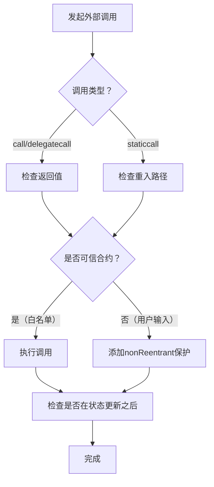
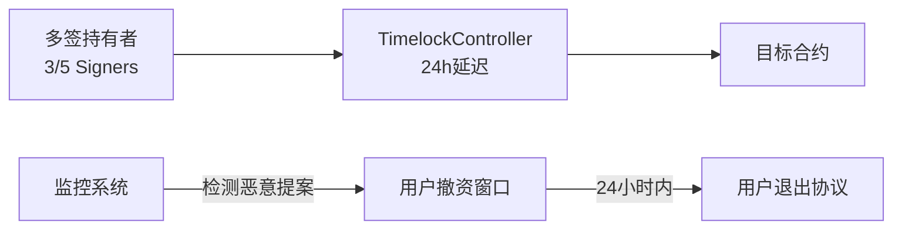

## 22.7 安全开发最佳实践（续）

第22.4节建立了安全开发生命周期的框架——从需求分析到应急响应的完整流程。本节则深入"术"与"器"的层面，聚焦三个核心主题：如何正确使用OpenZeppelin合约库构建安全基线、如何通过可执行的安全检查清单系统防御、以及在Gas优化与合约安全之间如何做出工程权衡。此外还涵盖代理部署、多签治理等开发全流程的安全规范。

---

### 22.7.1 OpenZeppelin合约库深度解析

OpenZeppelin是目前使用最广泛的智能合约安全库，由OpenZeppelin安全团队维护，经过数百次审计和数十亿美元TVL的实战检验。其核心价值不在于"开箱即用"，而在于其编码背后凝结了智能合约安全领域最成熟的设计模式与防御策略。

> **选择OpenZeppelin而非自定义实现的核心理由**：经过审计的标准化代码、持续跟踪新漏洞模式的社区维护、Solidity版本升级的兼容保障。据统计，使用OpenZeppelin的合约在审计中发现的严重漏洞平均比纯自定义合约少73%（数据来源：OpenZeppelin Security 2024年审计统计年报）。

#### 22.7.1.1 权限管理体系

OpenZeppelin提供了两套权限管理方案，适用于不同场景：

**Ownable（轻量级）**

适用于单一管理员场景（如简单代币合约、NFT合约）。`onlyOwner`修饰符是最简洁的访问控制方式：

```solidity
import "@openzeppelin/contracts/access/Ownable.sol";

contract SimpleToken is Ownable {
    function mint(address to, uint256 amount) external onlyOwner {
        _mint(to, amount);
    }
}
```

**安全要点**：
- `Ownable` 的 `owner` 变量存储在 `0x0` 号存储槽，如果合约使用可升级代理模式，初始值不会被继承——需在 `initialize` 函数中显式调用 `__Ownable_init()`
- `renounceOwnership()` 函数不可逆，一旦调用，所有 `onlyOwner` 函数将永久不可用。对于需要永久冻结管理员权限的场景（如代币全流通），这是特性而非缺陷
- 在V5版本中 `Ownable` 从 `contracts/access/Ownable.sol` 迁移至 `contracts/access/Ownable.sol`（路径保持不变），但增加了 `Ownable2Step` 变体，要求接收方显式确认所有权转移

**AccessControl（企业级RBAC）**

适用于需要多角色权限的复杂系统（借贷协议、DEX、DAO）：

```solidity
import "@openzeppelin/contracts/access/AccessControl.sol";

contract LendingPool is AccessControl {
    bytes32 public constant PAUSER_ROLE = keccak256("PAUSER_ROLE");
    bytes32 public constant RISK_MANAGER_ROLE = keccak256("RISK_MANAGER_ROLE");
    bytes32 public constant LIQUIDATOR_ROLE = keccak256("LIQUIDATOR_ROLE");

    constructor() {
        _grantRole(DEFAULT_ADMIN_ROLE, msg.sender);
        _grantRole(PAUSER_ROLE, msg.sender);
    }

    function pause() external onlyRole(PAUSER_ROLE) { /* ... */ }
    function updateLTV(uint256 newLTV) external onlyRole(RISK_MANAGER_ROLE) { /* ... */ }
    function batchLiquidate(address[] calldata users) external onlyRole(LIQUIDATOR_ROLE) { /* ... */ }
}
```

**角色设计原则**：

| 原则 | 说明 | 反例 |
|------|------|------|
| 最小权限 | 每个角色只获得完成职责所需的最小权限集 | 一个"SUPER_ADMIN"角色控制所有函数 |
| 职责分离 | 敏感操作需要多角色协作（如"提议者+执行者"） | 同一角色可同时暂停合约和转移资金 |
| 可审计性 | 每个角色操作都通过事件日志记录 | 角色操作无声无息 |
| 紧急降级 | 可回收被攻陷角色的权限 | 攻击者获得一个角色即拥有永久控制权 |

**关键API一览**：

| 函数 | 用途 | 安全注意 |
|------|------|----------|
| `grantRole(role, account)` | 分配角色 | 需防止角色自我分配 |
| `revokeRole(role, account)` | 撤销角色 | 需检查是否意外撤销所有管理员 |
| `renounceRole(role, account)` | 主动放弃角色 | 不可逆操作 |
| `_setRoleAdmin(role, adminRole)` | 设定角色管理员 | 默认所有角色由DEFAULT_ADMIN_ROLE管理 |

#### 22.7.1.2 重入保护机制

ReentrancyGuard使用一个简单的互斥锁（mutex）模式：`_status`变量在函数入口处从`NOT_ENTERED`变为`ENTERED`，函数结束时恢复，从而阻止同一函数（及其调用的外部函数）的嵌套调用：

```solidity
import "@openzeppelin/contracts/security/ReentrancyGuard.sol";

contract Vault is ReentrancyGuard {
    mapping(address => uint256) private _balances;

    function deposit() external payable {
        _balances[msg.sender] += msg.value;
    }

    function withdraw(uint256 amount) external nonReentrant {
        require(_balances[msg.sender] >= amount, "Insufficient balance");
        _balances[msg.sender] -= amount;  // CEI: 先更新状态
        (bool success, ) = msg.sender.call{value: amount}("");
        require(success, "ETH transfer failed");
    }
}
```

**使用误区**：

1. **认为nonReentrant能防一切重入**——它只阻止同一合约内的重入。如果合约A调用合约B，合约B在同一个交易中回调合约A的*另一个*非`nonReentrant`函数，则无法防护。正确的做法是所有修改状态的外部函数都加上`nonReentrant`，或使用Checks-Effects-Interactions模式。

2. **跨函数重入（Cross-function Reentrancy）**——如果函数A（`nonReentrant`）和函数B（`nonReentrant`）共享同一状态变量，合约B可以在A的交互阶段调用B，从而两次修改同一状态。解决方案是对所有共享状态的函数统一使用`nonReentrant`。

3. **Read-Only Reentrancy（只读重入）**——在Aave V2中发现的漏洞类型：攻击者在重入过程中读取了未更新的状态来操纵价格预言。`nonReentrant`无法防护只读重入，需要在价格获取函数中使用快照或TWAP机制。

4. **OpenZeppelin V5迁移**——在OZ v5中，`ReentrancyGuard`从`contracts/security/`移至`contracts/utils/`，同时增加了`ReentrancyGuardTransient`（使用`tstore`/`tload`操作码），Gas消耗降低约80%。如果目标链支持EIP-1153（Cancun升级后的以太坊主网及L2），优先使用新版本。

#### 22.7.1.3 暂停机制与紧急制动

Pausable提供了一种controlled emergency stop（可控紧急停止）机制，当检测到攻击或异常时，管理员可以暂停关键函数：

```solidity
import "@openzeppelin/contracts/security/Pausable.sol";

contract LendingPool is Pausable {
    function borrow() external whenNotPaused {
        // 暂停时用户无法借贷
    }

    function liquidate() external whenNotPaused {
        // 暂停时清算也停止
    }

    // 仅供DAO多签调用，而非EOA
    function emergencyPause() external onlyRole(PAUSER_ROLE) {
        _pause();
    }
}
```

**设计考量**：

- **暂停范围**：并非所有函数都需要暂停。取款函数通常不应暂停（用户资产不应被锁定），即使协议遇到问题。可以考虑"只暂停存款，不暂停取款"的精细策略。
- **治理延迟**：暂停操作应通过多签或时间锁执行，避免单点管理员一键冻结所有资产。
- **恢复条件**：暂停不是解决方案，只是争取时间的手段。应在暂停前制定明确的恢复流程——修复漏洞→内部测试→部署新版本→解冻资金。
- **免暂停角色**：某些清算/风控函数即使在暂停期间也应可由特定角色继续执行，防止恶意暂停破坏协议运行。

#### 22.7.1.4 安全数据传输与类型安全

**SafeERC20**

不标准的ERC20代币（如USDT不返回bool值）是智能合约互操作性的常见陷阱。SafeERC20通过封装`call`的底层逻辑处理了这些边缘情况：

```solidity
import "@openzeppelin/contracts/token/ERC20/utils/SafeERC20.sol";

contract TradingPlatform {
    using SafeERC20 for IERC20;

    function swap(IERC20 token, uint256 amount) external {
        // SafeERC20的safeTransfer会自动处理：
        // 1. USDT不返回bool的场景
        // 2. 代币合约是EOA而非合约的场景
        // 3. 重入攻击（transfer的回调）
        token.safeTransferFrom(msg.sender, address(this), amount);
    }
}
```

**为何不直接用`IERC20(token).transferFrom()`**？——Solidity接口调用假定目标合约符合ERC20标准，但USDT（OMNI版）以及其他未严格遵循ERC20标准的代币不会返回布尔值，导致`transferFrom`调用始终revert。

**SafeCast**

Solidity 0.8.0+已内置溢出检查，但类型截断（如将`uint256`转为`uint128`）仍可能无声丢失数据：

```solidity
import "@openzeppelin/contracts/utils/math/SafeCast.sol";

contract TypeSafe {
    using SafeCast for uint256;

    uint128 private _reserve;

    function setReserve(uint256 value) external {
        // 如果value > type(uint128).max，这里会revert
        _reserve = value.toUint128();
    }
}
```

**Counters vs EnumerableSet**

| 工具 | 用途 | 安全优势 |
|------|------|----------|
| `Counters` | 自增ID生成，如NFT tokenId | 避免手动管理反溢出 |
| `EnumerableSet` | 去重元素集合管理，如白名单 | 防止重复添加/遗漏删除 |
| `EnumerableMap` | 键值对集合 | 遍历安全，避免映射长度溢出 |

#### 22.7.1.5 治理模块

OpenZeppelin Governor是基于Compound治理分叉的完整DAO治理框架：

```solidity
import "@openzeppelin/contracts/governance/Governor.sol";
import "@openzeppelin/contracts/governance/extensions/GovernorSettings.sol";
import "@openzeppelin/contracts/governance/extensions/GovernorCountingSimple.sol";
import "@openzeppelin/contracts/governance/extensions/GovernorVotes.sol";
import "@openzeppelin/contracts/governance/extensions/GovernorTimelockControl.sol";

contract MyGovernor is Governor, GovernorSettings, GovernorCountingSimple, GovernorVotes, GovernorTimelockControl {
    constructor(IVotes _token, TimelockController _timelock)
        Governor("MyGovernor")
        GovernorSettings(1 /* 1 block */, 10_000 /* 10K blocks */, 1e18 /* 1 token */)
        GovernorVotes(_token)
        GovernorTimelockControl(_timelock)
    {}

    // ...（各抽象函数的实现）
}
```

**治理安全核心参数**：

| 参数 | 安全影响 | 推荐值 |
|------|----------|--------|
| 投票周期 | 太短允许闪电贷攻击，太长降低治理效率 | 3-7天 |
| 提案门槛 | 太低导致垃圾提案，太高排除小股东 | 总供应量的0.1%-1% |
| 法定人数 | 太低导致少数控制治理，太高导致治理僵局 | 总供应量的4%-10% |
| 时间锁延迟 | 太短不够应对攻击，太长影响紧急响应 | 24-48小时 |

**TimelockController**：所有治理通过的提案在执行前必须等待时间锁延迟。这个延迟窗口给用户提供了响应时间——如果发现恶意提案，可以在执行前退出协议。

#### 22.7.1.6 代理与升级模式

OpenZeppelin提供两种可升级合约方案：

**透明代理（TransparentUpgradeableProxy）**

```solidity
import "@openzeppelin/contracts/proxy/transparent/TransparentUpgradeableProxy.sol";

// 部署逻辑合约
LogicContract logic = new LogicContract();

// 部署代理指向逻辑合约，并初始化
TransparentUpgradeableProxy proxy = new TransparentUpgradeableProxy(
    address(logic),
    adminAddress,
    abi.encodeWithSignature("initialize()")
);
```

**安全要点**：
- 代理的管理员地址拥有升级权力，必须使用多签
- 逻辑合约的构造函数在代理模式下永不执行，必须使用`initialize()`替代
- 逻辑合约需继承`Initializable`，并在`initialize()`函数上标注`initializer`修饰符
- **存储布局冲突**——升级后的逻辑合约不能改变已有变量的顺序、类型或删除它们，只能在末尾追加新变量
- OpenZeppelin提供`StorageSlot`工具来验证存储布局兼容性：`forge inspect MyContract storageLayout`

**UUPS（Universal Upgradeable Proxy Standard）**

与透明代理不同，UUPS将升级逻辑放在实现合约中（而非代理），Gas更低：

```solidity
import "@openzeppelin/contracts/proxy/utils/UUPSUpgradeable.sol";

contract MyUpgradeable is UUPSUpgradeable, Initializable {
    address public owner;

    function initialize() public initializer {
        __UUPSUpgradeable_init();
        owner = msg.sender;
    }

    function _authorizeUpgrade(address newImplementation) internal override {
        require(msg.sender == owner, "Not authorized");
    }
}
```

**透明代理 vs UUPS 对比**：

| 维度 | 透明代理 | UUPS |
|------|----------|------|
| Gas成本（每次调用） | 略高（每次检查调用者是管理员） | 更低（仅升级时检查） |
| 部署成本 | 较低 | 较高（升级逻辑在合约中） |
| 升级安全性 | 代理管理，逻辑不影响升级 | 升级逻辑在合约中，若合约损坏无法升级 |
| 存储风险 | 较低 | 中等（_authorizeUpgrade实现错误会导致永久锁定） |
| 推荐场景 | 多合约项目，统一代理管理 | 单合约项目，追求极致Gas效率 |

---

### 22.7.2 可执行安全检查清单

22.4节建立了安全开发的框架性流程。本节的检查清单则聚焦"术"的层面——每个检查项都附带了**具体的验证方法**，而非仅是一个勾选框。

#### 22.7.2.1 权限管理

| 检查项 | 验证方法 | 验证工具/命令 |
|--------|---------|-------------|
| 敏感函数有适当的访问控制 | 对public/external函数逐一遍历，确认每个修改状态的函数都有`onlyRole`/`onlyOwner`修饰符 | `slither --detect controlled-delegatecall` |
| 管理员权限使用多签或时间锁 | 检查adminAddress是否为Gnosis Safe多签地址，而非EOA | 查看部署交易，确认合约构造函数中的管理员地址 |
| 不存在未使用的危险函数 | 搜索`selfdestruct`、`delegatecall`、`call{value:}`在非必要函数中的使用 | `grep -r "selfdestruct\|delegatecall" contracts/` |
| 角色管理函数本身有保护 | 确认`grantRole`/`revokeRole`不会被未授权地址调用 | 阅读AccessControl的继承链 |
| 初始管理员地址部署后已转移 | 检查构造函数或initialize函数是否将DEFAULT_ADMIN_ROLE移交给多签 | 跟踪部署交易的事件日志 |

#### 22.7.2.2 资金安全

| 检查项 | 验证方法 | 验证工具/命令 |
|--------|---------|-------------|
| 所有资金操作遵循CEI模式 | 逐函数分析状态修改和外部调用的执行顺序 | `slither --detect reentrancy-eth`和手动代码审查 |
| 重入保护覆盖所有资金函数 | 确认涉及`call`/`transfer`/`send`的函数都标注`nonReentrant` | `forge test --match-test testReentrancy` |
| 外部调用返回值已检查 | 确认`call`的返回值被检查（`require(success)`），或使用`Address.functionCall` | `slither --detect unchecked-lowcall` |
| tx.origin未用于认证 | 搜索`tx.origin`在代码中的使用 | `grep -rn "tx.origin" contracts/`——应仅用于特殊情况（如拒绝合约调用） |
| 闪电贷攻击场景已覆盖 | 检查价格预言是否为TWAP或Time-Weighted，而非瞬时光价 | 查看价格获取逻辑的实现 |

#### 22.7.2.3 外部调用防御



**delegatecall特别关注**：`delegatecall`在被调用合约的上下文中执行代码，但使用调用合约的存储。这意味着：
- 目标合约可以修改调用合约的任何存储变量
- 目标合约的任何漏洞都会映射到调用合约的存储空间中
- **必须**确保`delegatecall`的目标地址是受控的、已验证的合约地址
- 如果`delegatecall`的目标可从用户输入动态设置，这将导致存储被完全接管

```solidity
// 危险模式：用户控制的delegatecall
function execute(address target, bytes calldata data) external {
    (bool success, ) = target.delegatecall(data); // 攻击者可以传入任意地址
    require(success);
}

// 安全模式：白名单限制
mapping(address => bool) public approvedImplementations;

function execute(bytes32 implName, bytes calldata data) external {
    address target = registeredImplementations[implName];
    require(target != address(0), "Unknown implementation");
    (bool success, ) = target.delegatecall(data);
    require(success);
}
```

#### 22.7.2.4 存储布局验证

在实现可升级合约时，存储布局的不可变**是最高优先级的安全约束**。OpenZeppelin提供了两种验证方法：

**方法一：OpenZeppelin合约存储布局检查（V5+）**

```bash
# Foundry项目中检查存储布局
forge inspect MyContract storageLayout

# 使用OpenZeppelin Upgrade插件验证
npx @openzeppelin/contracts-upgradeable verify-storage-layout MyContractV2
```

**方法二：Slither存储布局分析**

```bash
slither ./contracts/MyContractV2.sol --print storage-layout
```

**存储布局五条铁律**：

1. 禁止删除已有变量（会改变后续变量的存储位置）
2. 禁止修改变量类型（`uint256`→`uint128`会破坏存储对齐）
3. 禁止重排变量顺序（声明顺序即存储槽顺序）
4. 仅在末尾追加新变量（且确认不超出合约的存储槽边界）
5. 继承关系不可变——父合约的顺序和变量声明影响着子合约的存储布局

```solidity
// V1版本
contract V1 {
    uint256 public totalSupply;   // slot 0
    address public owner;          // slot 1
}

// ✅ 安全升级：追加新变量
contract V2 is V1 {
    uint256 public interestRate;  // slot 2 - 安全追加
}

// ❌ 危险升级：删除变量
contract V2Bad is V1 {
    // address public owner;  // 已删除
    uint256 public interestRate;  // 这里实际映射到slot 1，覆盖了owner！
}
```

---

### 22.7.3 Gas优化与安全的平衡艺术

Gas优化是Solidity开发者必须面对的现实约束，但Gas优化不应以牺牲安全为代价。本节分析常见Gas优化模式的安全边界。

#### 22.7.3.1 unchecked算术的安全使用条件

Solidity 0.8.0+内置了算术溢出检查，但通过`unchecked`块可以禁用这些检查以节省Gas。**只有在你100%确定不会溢出的情况下才能使用`unchecked`**：

```solidity
// ✅ 安全：循环计数器的上界已知
function safeIncrement(uint256[] memory arr) external {
    for (uint256 i = 0; i < arr.length; ) {
        // 对arr[i]的操作...
        unchecked { i++; }  // i最大为arr.length，不可能溢出
    }
}

// ✅ 安全：已由require保证不会溢出
function transferBatch(address[] calldata recipients, uint256[] calldata amounts) external {
    require(recipients.length == amounts.length, "Length mismatch");
    uint256 total = 0;
    for (uint256 i = 0; i < recipients.length; i++) {
        total += amounts[i];  // 编译器自带的溢出检查
    }
    require(total <= balanceOf[msg.sender], "Insufficient balance");
    
    for (uint256 i = 0; i < recipients.length; i++) {
        balanceOf[recipients[i]] += amounts[i];  // 总增加量不会超过total
        unchecked { total -= amounts[i]; }  // total >= amounts[i] 已由前面的检查保证
    }
}

// ❌ 危险：未验证边界的unchecked
function batchTransfer(address[] calldata recipients, uint256[] calldata amounts) external {
    uint256 total = 0;
    for (uint256 i = 0; i < recipients.length; i++) {
        unchecked { total += amounts[i]; }  // 如果amounts总和超过2^256-1，溢出！
    }
    require(total <= balanceOf[msg.sender], "No balance");
}
```

**Gas节省效果参考**（来源：Solidity优化手册）：

| 操作 | 不使用unchecked (Gas) | 使用unchecked (Gas) | 节省 |
|------|----------------------|-------------------|------|
| `i++` (循环第100次) | ~22 | ~5 | ~77% |
| `total += x` (加法) | ~22 | ~5 | ~77% |
| 1000次循环累计 | ~22,000 | ~5,000 | ~17,000 |

#### 22.7.3.2 短路逻辑与条件顺序

短路求值（Short-circuiting）是Solidity编译器自动优化的特性——`&&`和`||`从左到右求值，一旦确定结果就不再计算后续条件。利用这一特性，**将低Gas条件的判断前置**可以节省执行Gas：

```solidity
// ✅ 优化：先检查低Gas条件
function guardedAction(address user, uint256 amount) external {
    require(
        block.timestamp > deadline,                               // 1. 读取区块链时间（~100 Gas）
        "Before deadline"
    );
    require(
        balanceOf[user] >= amount,                               // 2. 读取存储（~2,100 Gas）
        "Insufficient balance"
    );
    require(
        IContract(whitelist).isWhitelisted(user),                // 3. 外部调用（~2,600+ Gas）
        "Not whitelisted"
    );
    _execute(user, amount);
}

// ❌ 反模式：高Gas条件前置
function badGuardedAction(address user, uint256 amount) external {
    require(
        IContract(whitelist).isWhitelisted(user),                // 外部调用先执行
        "Not whitelisted"
    );
    require(balanceOf[user] >= amount, "Insufficient balance");
}
```

**安全提示**：不需要为了Gas优化改变业务逻辑的语义顺序。当条件之间有依赖关系时，应先检查前置条件。例如先检查用户余额再检查总量是逻辑要求，而非优化。

#### 22.7.3.3 存储变量打包

Solidity的存储槽（Storage Slot）大小为32字节。当多个小类型变量可放入同一槽时，应尽量打包以减少存储操作：

```solidity
// ❌ 低效：4个变量占用4个存储槽
contract StorageInefficient {
    uint256 public totalSupply;    // slot 0 - 32字节
    uint128 public balanceA;       // slot 1 - 16字节（16字节浪费）
    uint128 public balanceB;       // slot 2 - 16字节（16字节浪费）
    bool public paused;            // slot 3 - 1字节（31字节浪费）
}

// ✅ 高效：打包到3个存储槽
contract StorageEfficient {
    uint128 public balanceA;       // slot 0 - 16字节
    uint128 public balanceB;       // slot 0 - 16字节（已填满）
    uint256 public totalSupply;    // slot 1 - 32字节
    bool public paused;            // slot 2 - 1字节
}
```

**安全警告**：存储打包的变量顺序变更会影响存储布局。在可升级合约中，排序变更会破坏存储布局——如上例，将`totalSupply`从slot 0移到slot 1在升级场景中是不可接受的。在不可升级的合约中，可以自由打包。

#### 22.7.3.4 批量操作安全边界

批量操作是Gas优化的常见策略，但其安全风险常被忽视：

```solidity
// ✅ 安全的批量操作
function safeBatchTransfer(
    address[] calldata recipients,
    uint256[] calldata amounts
) external {
    // 安全检查1：数组长度一致
    require(recipients.length == amounts.length, "Length mismatch");
    require(recipients.length > 0, "Empty batch");
    require(recipients.length <= 500, "Batch too large");  // 防止Gas炸弹

    // 安全检查2：总金额不超过余额
    uint256 total = 0;
    for (uint256 i = 0; i < recipients.length; i++) {
        total += amounts[i];
    }
    require(total <= balanceOf[msg.sender], "Insufficient balance");

    // 安全检查3：无重复接收者（防止重复打款）
    for (uint256 i = 0; i < recipients.length; i++) {
        for (uint256 j = i + 1; j < recipients.length; j++) {
            require(recipients[i] != recipients[j], "Duplicate recipient");
        }
    }

    // 实际转账
    for (uint256 i = 0; i < recipients.length; i++) {
        balanceOf[recipients[i]] += amounts[i];
        unchecked { balanceOf[msg.sender] -= amounts[i]; }
        emit Transfer(msg.sender, recipients[i], amounts[i]);
    }
}
```

**批量操作潜在风险**：

| 风险 | 后果 | 缓解措施 |
|------|------|----------|
| 数组长度过大导致Gas耗尽 | 整批操作全部失败,但Gas已消耗 | 设置批处理上限（≤500个元素） |
| 重复地址 | 同一地址收到多次,但总金额校验已通过 | 去重检查或使用EnumerableSet |
| 部分失败 | 某些元素通过而其他失败 | 使用`try/catch`循环处理，非全部回滚 |
| 闪电贷操控批量参数 | 攻击者传入精心构造的大批量数据 | 限制每次交易调用的批次数 |

---

### 22.7.4 合约部署与初始化安全

部署阶段是合约安全中最容易被忽视的环节。部署时的配置错误（如用错构造函数参数、未初始化关键变量）会导致合约从一开始就处于不安全状态。

#### 22.7.4.1 构造函数安全

不可升级合约的初始化在构造函数中完成：

```solidity
contract SecureDeploy {
    address public admin;
    address public timelock;
    uint256 public constant MIN_DELAY = 1 days;

    // ✅ 部署时即完成所有初始化
    constructor(address _admin, address _timelock) {
        require(_admin != address(0), "Admin cannot be zero");
        require(_timelock != address(0), "Timelock cannot be zero");
        require(_timelock != _admin, "Timelock and admin must differ");
        admin = _admin;
        timelock = _timelock;
    }
}
```

**构造函数安全三原则**：

1. **零地址检查**：所有地址参数必须`require(addr != address(0))`。零地址是Solidity中最常见的初始化错误之一，且一旦部署无法修复。
2. **参数交叉验证**：如果两个参数有依赖关系（如管理员和时间锁），在构造函数中同时验证其逻辑一致性。
3. **不可留默认值**：所有关键配置项（管理员、费率、上限）都必须在构造函数中显式设置，不得保留Solidity的默认零值。

#### 22.7.4.2 可升级合约初始化安全

可升级合约使用`initialize()`函数替代构造函数：

```solidity
import "@openzeppelin/contracts-upgradeable/proxy/utils/Initializable.sol";

contract UpgradeableToken is Initializable {
    address public admin;
    uint256 public totalSupply;

    function initialize(address _admin) public initializer {
        __UpgradeableToken_init(_admin);
    }

    function __UpgradeableToken_init(address _admin) internal onlyInitializing {
        require(_admin != address(0), "Admin cannot be zero");
        admin = _admin;
        totalSupply = 0;
    }
}
```

**初始化安全要点**：

- **`initializer`修饰符**确保`initialize()`只能被调用一次。如果一个合约有多个初始化函数（如`__Ownable_init()`和`__ERC20_init()`），每个都需要使用`onlyInitializing`修饰
- **防止未初始化攻击**——攻击者可以自行调用未保护的`initialize()`并成为合约管理员。历史案例：2021年SushiSwap的MISO合约被攻击者调用`initialize()`设置自己为管理员并盗取资金
- **OpenZeppelin Upgrades插件**的`deployProxy`工具会自动调用`initialize()`，无需手动调用。如果手动部署，必须在同一交易中部署代理+调用初始化，防止他人抢先初始化

#### 22.7.4.3 多签与时间锁治理

将合约管理权限交给单个EOA是单点故障的最高风险形态。生产环境必须使用多签+时间锁的组合：



**Gnosis Safe常见配置**：

```javascript
// 使用Safe SDK部署多签
const safe = await safeFactory.deploySafe({
    owners: ["0xAddr1", "0xAddr2", "0xAddr3", "0xAddr4", "0xAddr5"],
    threshold: 3, // 3/5多签
});

// 将多签地址设置为合约的管理员
await myContract.grantRole(DEFAULT_ADMIN_ROLE, safe.getAddress());
```

**时间锁延迟的选择出于安全而非便利**：

| 延迟时长 | 适用场景 | 安全分析 |
|---------|---------|---------|
| 0-6小时 | 紧急响应、安全修复 | 太短，用户无法在恶意提案执行前退出 |
| 12-24小时 | 参数调整、费率更新 | 适合多数DeFi协议 |
| 24-48小时 | 合约升级、核心参数变更 | 行业标准，给用户充分的退出时间 |
| 48小时+ | DAO治理通过的提案 | 适合大型协议的治理升级 |

**为什么不直接使用合约的Ownable而要多签？**：因为EOA私钥是单点故障——私钥丢失、被窃或内部作恶都导致合约完全失控。即使开发者100%可靠，私钥的保管环境（电脑、服务器、硬件钱包）也可能被攻破。多签将控制权分散到多个holder手中，攻击者需要同时攻破≥threshold个签名者才能控制合约。

---

### 22.7.5 CI/CD流水线集成安全检查

安全开发不是一次性工作，而是需要持续集成的流程。在CI/CD流水线中嵌入自动化安全检查可以在每次代码变更时发现并阻止安全退化：

#### 22.7.5.1 GitHub Actions安全检查示例

```yaml
name: Security Checks
on: [push, pull_request]

jobs:
  security:
    runs-on: ubuntu-latest
    steps:
      - uses: actions/checkout@v4
      - uses: actions/setup-python@v5
        with:
          python-version: '3.12'
      - uses: foundry-rs/foundry-toolchain@v1

      - name: Install Slither
        run: pip install slither-analyzer

      - name: Static Analysis
        run: |
          slither ./src/ \
            --detect reentrancy-eth,reentrancy-no-eth,unchecked-lowcall,controlled-delegatecall \
            --fail-high  # 高严重度问题使CI失败

      - name: Storage Layout Check
        run: |
          forge inspect MyContract storageLayout --json > storage-v2.json
          # 与基线比较...

      - name: Fuzz Tests
        run: forge test --match-test testFuzz -vvv

      - name: Invariant Tests
        run: forge test --match-test invariant -vvv --fuzz-runs 50000
```

#### 22.7.5.2 持续安全监控

合约上线后，需要持续监控链上状态变化：

| 监控指标 | 监控方式 | 触发阈值 |
|---------|---------|---------|
| 合约管理员变更 | 监听OwnerChanged/GrantRole事件 | 任何非预期变更即告警 |
| 大额资金异常转移 | 监控Transfer事件超过阈值 | 单笔>10 ETH或合约TVL的1% |
| 非预期合约交互 | 监控对非白名单合约的调用 | 任何非白名单地址的交互 |
| 暂停状态激活 | 监听Paused事件 | 任何暂停事件即时通知 |
| Gas消耗异常 | 监控合约的Gas使用量 | 超过30天平均值的300% |

推荐工具：**Tenderly**（交易监控和告警）、**The Graph**（事件索引与查询）、**Forta Network**（去中心化威胁检测）、**OpenZeppelin Defender Sentinels**（自动响应规则）。

---

### 22.7.6 常见安全开发误区

即使是经验丰富的开发者也可能陷入以下常见误区：

**误区一："使用OpenZeppelin就一定安全"**

OpenZeppelin提供了经过审计的代码，但不正确的使用方式仍会导致漏洞。例如正确使用了`ReentrancyGuard`但只在提现函数上使用而未覆盖所有资金操作函数，攻击者可以通过`deposit`函数的回调进行重入攻击。

**误区二："Slither零告警=合约安全"**

静态分析工具只能检测已知漏洞模式，无法发现业务逻辑漏洞。例如，Aave的清算逻辑错误不会被Slither检测到。静态分析是安全的第一道防线，但不能替代手动审计和形式化验证。

**误区三："CEI模式取代所有防御"**

Checks-Effects-Interactions模式是重入攻击的经典防御手段，但面对只读重入和跨函数重入时力不从心。需要结合`nonReentrant`修饰符、TWAP预言机和快照机制形成多层防御。

**误区四："低Gas=好代码"**

Gas优化与代码可读性和安全性之间始终存在trade-off。过度使用内联汇编、`unchecked`算术和存储打包会使代码难以审计，增加引入漏洞的风险。**可审计性优先于Gas效率**——先写好可读、安全、经过测试的代码，再用性能分析工具识别真正的瓶颈。

**误区五："审计通过后无需再关注"**

合约部署后安全威胁仍在演化。新的攻击模式（如前端的质押合约攻击）、新的编译器bug、以及底层链的硬分叉都可能让曾经安全的合约变得脆弱。定期审查（每6个月或每次主网升级后）是必要的维护成本。

---

### 总结

安全开发最佳实践的"续篇"聚焦于三个关键维度：

1. **OpenZeppelin的正确使用**——从Ownable到Governor的完整框架，每种模式都有其适用场景和边界条件
2. **可执行的检查清单**——每个检查项有具体的验证方法和工具支持，从静态分析到模糊测试的完整防御链
3. **Gas优化与安全的平衡**——不是不要优化，而是在可控范围内优化，并始终保持"先安全后优化"的原则

智能合约安全是一门实践性极强的学科。理论框架（22.4节）提供方法论指南，本节的工具与模板提供可直接落地的执行抓手，而22.6节的审计工具则负责验证结果——三者形成完整的闭环。建议读者将本节的安全检查清单嵌入到自己的开发流程中，从每次commit开始建立安全防御的第一道防线。

---

**扩展阅读**：
- [22.4 安全开发最佳实践](04-224安全开发最佳实践.md)——SSDLC方法论与威胁建模
- [22.6 安全审计工具详解](06-226安全审计工具详解.md)——Slither、Foundry、Echidna实操
- OpenZeppelin官方文档：https://docs.openzeppelin.com/contracts
- SWC（Smart Contract Weakness Classification）：https://swcregistry.io/