# 21.1 区块链技术架构

## 21.1.1 从中心化到去中心化：区块链的哲学与技术本质

### 拜占庭将军问题与分布式信任

区块链技术要回答的核心问题，在计算机科学中被称为**拜占庭将军问题（Byzantine Generals Problem）**——在存在不可靠节点（可能故障或恶意）的分布式系统中，如何让所有诚实节点对某一决策达成一致？1982年，Leslie Lamport、Robert Shostak和Marshall Pease在论文《The Byzantine Generals Problem》中正式提出此问题，并证明在异步网络中，当恶意节点数不超过总节点数的1/3时，系统可以通过特定协议达成共识。

区块链通过**经济激励 + 密码学证明**的方式，将拜占庭容错从理论模型落地为可运行的工程系统。这是区块链区别于传统分布式数据库（如BigTable、DynamoDB）的根本——它不假设节点可信，而是通过设计让作恶成本高于收益。

### 区块链 vs. 传统分布式数据库

| 维度 | 传统分布式数据库 | 区块链 |
|------|----------------|--------|
| 信任模型 | 中心化管理员 + ACL | 去中心化共识 + 密码学验证 |
| 数据写入 | CRUD（增删改查） | 追加写入（Append-Only），不可删除或回滚 |
| 一致性 | 强一致性（Paxos/Raft） | 最终一致性（概率最终性） |
| 节点角色 | 主从/分片 | 对等节点（Peer），角色可动态转换 |
| 性能 | 数万TPS | 比特币7 TPS / 以太坊15-30 TPS |
| 容错能力 | 容忍节点崩溃，难容忍拜占庭故障 | 容忍1/3以下的拜占庭节点 |
| 数据隐私 | 基于角色的访问控制 | 公开透明（公链），或选择性披露（隐私链） |

这一对比揭示了一个核心安全推论：**区块链选择牺牲性能来换取无信任环境的可用性**，因此其安全性并非来自"不可破解"，而是来自"攻击成本 > 收益"的经济博弈模型。

---

## 21.1.2 区块链的核心技术基础

理解区块链安全，必须首先吃透其四大技术基石：密码学、数据结构、共识机制、智能合约。任何一层的弱点都会传导为上层风险。

### 密码学基础：哈希函数与非对称加密

**哈希函数**是区块链最频繁使用的密码学原语，区块链中主要使用SHA-256（比特币）或Keccak-256（以太坊）。其关键特性：

- **抗原像性（Pre-image Resistance）**：给定哈希值 `h`，几乎不可能反推出 `x` 使得 `hash(x) = h`
- **抗第二原像性（Second Pre-image Resistance）**：给定 `x`，几乎不可能找到 `y ≠ x` 使得 `hash(y) = hash(x)`
- **碰撞抵抗性（Collision Resistance）**：几乎不可能找到任意一对 `(x, y)` 使得 `hash(x) = hash(y)`
- **雪崩效应（Avalanche Effect）**：输入一位改变，输出约半数位翻转

**安全影响**：哈希函数是区块链不可篡改性的数学基础。每个区块头包含前一个区块的哈希值，形成一条哈希链。要修改历史区块，攻击者必须重新计算该区块及之后所有区块的哈希值——计算成本随链长指数增长。

**非对称加密**用于交易签名和地址派生：

- **ECDSA（椭圆曲线数字签名算法）**：以太坊和比特币均使用 secp256k1 曲线
- **EdDSA（Ed25519）**：Solana、Cardano 等新一代链采用，性能更高
- **BLS 签名**：以太坊2.0的共识层使用，支持签名聚合（降低验证开销）

**私钥安全是第一安全底线**：私钥一旦泄露，攻击者可以伪造任何交易。据 Chainalysis 2023年报告，私钥泄露导致的总损失超过12亿美元，其中约68%来自私钥存储不当（明文存储、截图保存、网络传输）。

### 数据结构：Merkle树与账户模型

**Merkle Patricia Trie**（以太坊采用）是一种结合了Merkle树和Patricia Trie的数据结构，用于高效验证大量数据。其核心优势：

- **Merkle证明（Merkle Proof）**：只需要 O(log n) 个哈希值就能证明某笔交易存在于区块中
- **轻节点**：无需下载完整区块链，仅保留区块头（80字节）即可验证交易
- **状态根（State Root）**：区块头的 stateRoot 字段是整个链状态的密码学承诺

**账户模型对比**：

| 模型 | 代表链 | 特点 | 安全影响 |
|------|--------|------|---------|
| UTXO（未花费交易输出） | 比特币 | 每次交易消耗旧UTXO创建新UTXO | 天然防止双花，隐私性更好 |
| 账户余额模型 | 以太坊 | 类似银行账户，有余额+nonce | 适合智能合约，但重放攻击需 nonce 防护 |
| 对象模型 | Sui / Aptos (Move) | 每个资源独立存储 | 资源所有权明确，减少重入攻击 |

---

## 21.1.3 区块链分层架构深度解析

### 整体架构图

```mermaid
graph TB
    subgraph 区块链整体架构["区块链分层架构全景图"]
        direction TB
        
        subgraph AppLayer["Layer 3 应用层"]
            A1["DeFi协议<br/>Uniswap/Aave/Compound"]
            A2["NFT市场与协议<br/>OpenSea/Blur/ERC-721"]
            A3["DAO治理框架<br/>Aragon/Snapshot"]
            A4["去中心化社交<br/>Lens Protocol"]
            A5["GameFi/元宇宙"]
            A6["去中心化身份<br/>ENS/DID"]
        end
        
        subgraph L2Layer["Layer 2 扩展层"]
            L2A["状态通道<br/>Lightning Network"]
            L2B["Optimistic Rollup<br/>Optimism/Arbitrum"]
            L2C["ZK-Rollup<br/>zkSync Era/StarkNet"]
            L2D["侧链<br/>Polygon PoS"]
            L2E["Validium<br/>Immutable X"]
            L2F["Volition<br/>混合数据可用性"]
        end
        
        subgraph L1Layer["Layer 1 基础链层"]
            L1A["共识层<br/>PoW/PoS/DPoS/PBFT"]
            L1B["网络层<br/>P2P发现/传输/路由"]
            L1C["数据层<br/>区块结构/交易/状态"]
            L1D["密码学层<br/>哈希/签名/零知识证明"]
            L1E["执行层<br/>EVM/WASM/SVM"]
            L1F["激励层<br/>Gas/质押/通胀模型"]
        end
        
        subgraph InfraLayer["基础设施层"]
            D1["RPC节点服务<br/>Infura/Alchemy/QuickNode"]
            D2["去中心化存储<br/>IPFS/Arweave/Filcoin"]
            D3["预言机网络<br/>Chainlink/Pyth/API3"]
            D4["跨链通信<br/>LayerZero/Wormhole/CCIP"]
            D5["链上数据索引<br/>The Graph/Dune Analytics"]
            D6["账户抽象<br/>ERC-4337/账户工厂"]
        end
    end
    
    subgraph 安全攻击面["各层安全攻击面"]
        direction LR
        S1["重入攻击/闪电贷<br/>智能合约漏洞"]
        S2["经济模型攻击<br/>治理攻击/闪电贷攻击"]
        S3["MEV攻击/三明治攻击<br/>交易排序操纵"]
        S4["路由攻击/NAT穿透<br/>网络层攻击"]
        S5["数据可用性欺诈<br/>L2状态伪造"]
        S6["跨链桥攻击<br/>验证节点被控"]
    end
    
    AppLayer --> L2Layer
    L2Layer --> L1Layer
    L1Layer --> InfraLayer
    
    AppLayer --> 安全攻击面
    L2Layer --> 安全攻击面
    L1Layer --> 安全攻击面
    InfraLayer --> 安全攻击面

    style 区块链整体架构 fill:#f5f5f5,stroke:#333,stroke-width:2px
    style AppLayer fill:#e3f2fd,stroke:#1565c0
    style L2Layer fill:#fff3e0,stroke:#e65100
    style L1Layer fill:#e8f5e9,stroke:#2e7d32
    style InfraLayer fill:#f3e5f5,stroke:#6a1b9a
    style 安全攻击面 fill:#ffebee,stroke:#c62828
```



> **图21-1：区块链分层架构全景图**。从基础设施层到应用层共四层，每层右侧列出对应的安全攻击面。实际攻击往往跨越多个层面（例如跨链桥攻击同时涉及L1共识层、预言机层和桥合约应用层）。

### 第一层（Layer 1）—— 基础链层：安全的根基

#### ① 共识层：谁有权决定下一个区块

共识机制决定了区块链的安全性模型。当前主流机制对比如下：

| 共识机制 | 代表链 | 最终性 | 吞吐量 | 安全阈值 | 攻击成本 | 能耗 |
|----------|-------|--------|--------|---------|---------|------|
| PoW（工作量证明） | 比特币 | 概率最终性 ≈6区块（~60分钟） | 7 TPS | ≤25% 算力 | 极高（须掌握总算力的51%） | 极高 ~150 TWh/年 |
| PoS（权益证明） | 以太坊2.0 | 概率最终性（多数） + 确定性（检查点） | 15-30 TPS | ≤33% 质押 | 高（须质押≥32 ETH且被罚没风险） | 低（~99.95%节能） |
| DPoS（委托权益证明） | EOS / TRON | 确定性最终性 | 数千 TPS | ≤33% 受托人 | 中（控制多数受托人节点） | 低 |
| PBFT及其变体 | Hyperledger Fabric | 即时最终性 | 数千 TPS | ≤33% 节点 | 中（控制节点身份） | 低 |
| Avalanche共识 | Avalanche | 亚秒级概率最终性 | 4500+ TPS | ≤20% 验证者 | 高 | 低 |

**关键安全概念——最终性（Finality）**：

- **概率最终性**（比特币/以太坊老版本）：随着新区块叠加，交易被回滚的概率指数级下降。通常约定6个区块确认（比特币）或最终化检查点（以太坊PoS）后视为安全。
- **确定性最终性**（PBFT链）：一旦区块被共识确认，不可逆转。代价是复杂度更高、网络假设更强。

**51%攻击的数学分析**：对于比特币PoW，攻击者试图伪造一条更长的链。假设攻击算力占比 `q`，诚实算力 `p=1-q`，攻击者需要追赶上 `z` 个区块才能让网络接受其伪造链。追上的概率为：

```text
P(z) = (q/p)^z  当 q < p 时
```

当 `q=0.3`（30%算力）、`z=6` 时，攻击概率约为 `(0.3/0.7)^6 ≈ 0.0038`（0.38%）。这是比特币自2009年以来从未被成功51%攻击的数学保障——攻击成本远超收益。

#### ② 网络层：P2P通信的安全威胁

区块链底层的P2P网络面临特有的网络攻击向量：

- **日蚀攻击（Eclipse Attack）**：攻击者通过控制目标节点的所有入站出站连接，将其与诚实网络隔离。目标节点只能看到攻击者构造的伪造区块和交易。防御措施包括：随机连接选择、确定性连接、节点身份绑定（如以太坊的enode标识）。
  
- **分区攻击（Partition Attack）**：在以太坊PoS中，攻击者可以利用网络分区让诚实验证者从不同视角提交冲突的见证消息，导致两个分叉同时被最终化——这将触发"削減（Slashing）"惩罚，大量验证者被罚没质押。

- **BGP劫持**：2018年曾发生攻击者利用BGP路由劫持比特币矿池流量的事件。攻击者重定向矿池的网络流量，使其长时间连接到攻击者控制的假节点上。防御：使用加密的P2P传输（如比特币的BIP324 v2传输协议）。

- **Sybil攻击**：攻击者创建大量虚假节点ID来获得对P2P网络的不成比例影响力。PoS从根本上缓解了Sybil攻击——成为验证者需要经济质押。

#### ③ 密码学层：量子威胁与抗量子密码

当前区块链广泛使用的椭圆曲线密码（ECDSA / secp256k1）理论上受**Shor算法**的量子威胁——一台足够大的量子计算机可以在多项式时间内破解离散对数问题。

**量子威胁时间线**（行业共识估计）：
- 短期（0-5年）：量子计算处于NISQ（含噪声中等规模量子）阶段，尚无法破解ECC
- 中期（5-15年）：如果量子纠错取得突破，破解secp256k1的可能性出现
- 长期（15年以上）：所有基于ECDSA的区块链需要完成迁移

**抗量子签名方案**（正在研究和部署中）：
| 方案 | 签名大小 | 验证速度 | 部署状态 |
|------|---------|---------|---------|
| Falcon-512 | 666 bytes | 快 | NIST已标准化 |
| CRYSTALS-Dilithium | 2,400 bytes | 中等 | NIST已标准化 |
| SPHINCS+ | 8,000+ bytes | 慢 | NIST已标准化 |
| Stark-based签名 | 几百KB | 极慢 | 理论/试验 |

#### ④ 执行层：虚拟机的安全边界

以太坊虚拟机（EVM）是当前最广泛部署的智能合约执行环境。其安全设计要点：

- **沙箱隔离**：合约代码在独立执行上下文中运行，不能直接访问宿主机系统资源
- **Gas计量**：每个操作码有固定的Gas成本，防止无限循环和拒绝服务攻击
- **栈虚拟机**：最大栈深度1024，防止栈溢出攻击
- **deterministic execution**：同一交易在不同EVM节点上执行结果完全一致

**EVM 操作码安全分类**：

| 类别 | 操作码示例 | 安全风险 |
|------|-----------|---------|
| 栈操作 | POP, DUP, SWAP | 栈深度溢出 |
| 算术运算 | ADD, MUL, EXP | 整数溢出/下溢 |
| 存储 | SSTORE, SLOAD | Gas消耗高，重入 |
| 外部调用 | CALL, DELEGATECALL | 重入攻击，代理漏洞 |
| 区块信息 | BLOCKHASH, TIMESTAMP | 矿工操纵 |
| 日志 | LOG0-LOG4 | 链上信息泄露 |

> **关键洞察**：EVM的安全边界在2024年经历了严格验证。以太坊基金会对所有操作码进行了形式化验证（使用KEVM框架），证明开源的EVM实现（如go-ethereum、besu）在规范层面不存在已知设计级漏洞。

### 第二层（Layer 2）—— 扩展层：安全性的新维度

Layer 2 解决方案在提高吞吐量的同时，引入了全新的安全模型和攻击面。

#### Rollup 的安全模型对比

| 维度 | Optimistic Rollup | ZK-Rollup |
|------|------------------|-----------|
| 安全假设 | 存在至少1个诚实节点提交欺诈证明 | 底层零知识证明方案正确 |
| 最终性延迟 | ~7天（欺诈挑战窗口期） | 几分钟（ZK证明验证） |
| 数据可用性 | 所有交易数据上传L1（Calldata/BLOB） | 仅状态根上传L1 |
| 活跃性 | 依赖排序器提交批次，或做逃生舱 | 依赖排序器，可强制包含 |
| 桥的安全性 | 依赖于欺诈证明 | 依赖于ZK证明 |
| 主要风险 | 欺诈证明窗口期内的流动性操纵 | ZK电路漏洞（历史上发生过） |

**排序器（Sequencer）的中心化风险**：大多数Rollup的排序器是中心化的——单一实体控制交易排序和批次提交。虽然安全模型通常保证"排序器无法盗取资金"，但排序器可以：

1. 审查特定用户的交易（将其排除在批次外）
2. 通过重排序提取MEV
3. 暂停批次提交（拒绝服务）

**数据可用性（Data Availability）**是L2安全中最微妙的问题。如果排序器发布批次但隐藏了原始交易数据，诚实节点无法重建L2状态来构造欺诈证明（Optimistic）或验证状态转换（ZK）。以下方法解决了此问题：

- Ethereum Blob（EIP-4844 / Proto-Danksharding）：为L2数据提供专用的临时存储空间，成本比Calldata低10-100倍
- 数据可用性委员会（DAC）：由受信节点委员会签名确认数据可用
- Celestia / EigenDA：独立的DA层，提供可用性证明

### 第三层（Layer 3）—— 应用层：最活跃的攻击面

应用层是当前区块链安全事件最集中的层面。据Immunefi 2024年报告，应用层漏洞占所有区块链安全事件的**85%以上**。

**DeFi协议安全的核心挑战**：

| 漏洞类型 | 损失占比（2023-2024） | 典型案例 | 根本原因 |
|---------|-------------------|---------|---------|
| 重入攻击 | 18% | Compound 121事件（$8M） | CEI模式违反 |
| 闪电贷攻击 | 22% | Euler Finance（$197M） | 价格预言机+条件组合 |
| 权限控制漏洞 | 15% | Multichain跨链桥（$1.4B） | Owner权限滥用 |
| 整数溢出 | 8% | BNB Chain（~$570M） | 代币合约未用SafeMath |
| 价格操纵 | 20% | Mango Markets（$100M+） | 预言机单源依赖 |
| 重放攻击 | 5% | 各种跨链场景 | Nonce/ChainID未验证 |
| 治理攻击 | 12% | Beanstalk Farms（$182M） | 闪电贷+治理合谋 |

> **表21-4：应用层主要漏洞类型及损失占比**。注意闪电贷攻击和价格操纵合计占42%，表明经济模型漏洞比纯代码漏洞更致命。本表数据来源于Rekt News数据库（分析范围2023.1-2024.6）。

---

## 21.1.4 交易生命周期深度解析

一笔区块链交易从被构造到最终确认，经历6个阶段。现将每个阶段的安全风险展开分析：

### 阶段一：交易构造与签名

用户发起交易时：
- **Nonce管理**：以太坊中每笔交易包含一个nonce（账户已发送交易数），用于防止重放攻击。若nonce使用混乱，可能导致交易被拒绝或意外替换。
- **Gas限制**：Gas Limit设置过低导致交易"卡死"，过高则在pending状态容易成为MEV目标。
- **签名过程**：secp256k1签名需要一次性随机数k，若k值重复或可预测（如Android的随机数生成器漏洞），私钥会被直接恢复。
  - **真实案例**：2013年，安卓系统PRNG漏洞导致大量比特币钱包私钥泄露，因为重复使用的k值允许攻击者从两个签名中推导出私钥。
- **EIP-1559 费用模型**：引入基础费用（Base Fee）+ 优先费用（Priority Fee / Tip）。基础费用被销毁，优先费用付给验证者。

**安全实践**：使用硬件钱包（Ledger、Trezor）确保私钥永不离开安全芯片；使用EIP-1559类型交易以更准确地预测费用。

### 阶段二：交易广播与内存池（Mempool）

交易被签名后广播到网络，进入每个节点的内存池等待被打包。

**Mempool安全威胁**：

1. **交易可见性**：默认以太坊mempool是公开的，任何人都能查看待处理交易。这是**MEV提取**的基础——机器人和矿工监视mempool寻找套利、清算或三明治攻击机会。

2. **三明治攻击（Sandwich Attack）**：攻击者在目标交易前后插入自己的交易：
```text
   攻击者交易A（买入）：推高价格
   受害者交易（买入）：按抬高后的价格成交
   攻击者交易B（卖出）：在高位卖出获利
   ```
   据统计，DEX上约15-25%的普通交易被机器人三明治攻击。

3. **抢先交易（Front-running）**：机器人监视mempool中的有利可图交易（如清算触发、大额swap），在受害者之前发起相同交易，抢走利润。

**防御措施**：

| 方法 | 原理 | 效果 | 代价 |
|------|------|------|------|
| Flashbots Protect | 交易直接发给矿工，跳过公开mempool | 完全预防 | 须信任Flashbots基础设施 |
| 私有mempool | 使用专用RPC节点（如Titan、bloxroute） | 高度有效 | 额外费用 |
| 滑点保护 | 设置最大滑点百分比 | 减少损失 | 交易可能失败 |
| 批量交易 | 原子性批量操作（如Flashbots Bundle） | 确保多笔交易原子执行 | 复杂度高 |
| MEV税 | 对MEV提取行为征税（如ETH X等实验性协议） | 减少MEV激励 | 尚未大规模采用 |

### 阶段三：交易排序与MEV

区块生产者（PoW矿工 / PoS验证者）从mempool中选择交易并构建区块。排序权本身就是经济价值——这产生了**最大可提取价值（Maximal Extractable Value, MEV）**概念。

**MEV的类型与规模**：

| MEV类型 | 描述 | 日均提取价值（以太坊，2024估算） |
|---------|------|-------------------------------|
| DEX套利 | 跨DEX价格差套利 | ~$3-5M |
| 清算 | DeFi协议借贷头寸清算 | ~$1-2M |
| 三明治攻击 | 夹在用户交易之间 | ~$2-3M |
| NFT MEV | NFT交易包抄底/狙击 | ~$0.3-0.5M |
| 长尾MEV | 独创性MEV策略 | ~$0.5-1M |

**以太坊的应对**：通过PBS（提议者-构建者分离）机制，将区块构建权交给专业的构建者，验证者仅负责选择出价最高的区块。这降低了验证者的信息优势，但引入构建者中心化问题。

### 阶段四：区块生产与传播

区块被构建后，通过Gossip协议广播到网络：

- **叔叔/孤块**：两个矿工几乎同时出块时，一个区块成为孤块。PoW下不补偿；以太坊PoW下叔叔块有部分奖励。
- **空块**：矿工/验证者不包含交易的区块，通常意味着Gas价格太低没有激励。
- **区块重组（Reorgs）**：
  - **短期重组**：1-2个区块的回滚，通常因网络延迟导致
  - **大规模重组**：51%攻击导致，超过6个区块的重组被视为攻击

**安全参数**：以太坊PoS的**最终化（Finalization）**每epoch（32个slot ≈ 6.4分钟）发生一次。一旦检查点被最终化，即使出现恶意网络分区也无法回滚。

### 阶段五：共识确认与最终性

不同链的最终性模型差异巨大，直接影响交易安全的"等多久"问题：

| 链 | 确认数 | 时间 | 回滚概率（经济上不可能） |
|----|-------|------|------------------------|
| 比特币 | 6区块 | ~60分钟 | <0.1%（30%算力假设） |
| 以太坊PoS | 2 epochs | ~12.8分钟 | 一旦最终化=0%（需>33%质押） |
| Solana | ~32个投票 | ~400ms | <10^-12（理论值） |
| Avalanche C链 | 1区块 | ~2秒 | 实际几乎为0（亚秒概率最终性） |
| Polygon PoS | 128区块 | ~2-3分钟（检查点） | 取决于以太坊最终性 |
| Arbitrum | L1确认+7天挑战 | ~10分钟+L1 | 欺诈证明有效则100%安全 |

### 阶段六：状态更新与执行

交易执行后，状态数据库被更新。对于涉及智能合约的交易：

- **状态回滚**：如果交易因Gas不足或执行异常而revert，所有状态变化撤销，但Gas仍被消耗
- **Reentrancy Guard**：明确执行顺序——先更新状态（减少用户余额），再发起外部调用。违反此模式（CEI模式：Checks-Effects-Interactions）即产生重入攻击面

---

## 21.1.5 跨链桥：多层面交织的安全困境

跨链桥涉及L1、预言机、应用合约等多个层面的安全，是区块链史上损失最惨重的攻击面。

### 跨链桥的三种架构与安全模型

| 桥类型 | 代表项目 | 安全模型 | 历史损失 |
|-------|---------|---------|---------|
| 验证节点桥 | Wormhole, Multichain | 多签/验证者网络验证跨链消息 | Wormhole ~$326M, Multichain ~$1.4B |
| 轻客户端桥 | IBC (Cosmos), Rainbow | 在目标链验证源链区块头+共识签名 | 理论上最安全，无重大损失 |
| 流动性网络 | Stargate, Hop | 使用AMM模型，原子性swap | 受限于底层桥安全性 |

**根本困境**：桥的资产安全性不可能超过其最弱链的安全性。当把以太坊的高价值资产转移到安全性较低的链上时，这些资产实际上的安全级别被降低了。

---

## 21.1.6 常见误区与认知纠偏

### 误区1：「区块链是不可篡改的」
**纠正**：不可篡改是一个近似值，并非绝对。
- **51%攻击**可回滚历史块
- **社交层攻击**（如以太坊DAO分叉）可通过社区决策修改状态
- **区块重组**在PoS链上存在理论可能（如Snow White链的long-range attack）

### 误区2：「区块链不需要信任」
**纠正**：区块链将信任从中心化权威转移到数学协议+经济博弈，但信任并没有消失——只是重新分配：
- 信任底层密码学的安全性（量子计算机能否破解）
- 信任核心开发团队（是否在代码中留后门或引入bug）
- 信任节点运营者（Sybil/shard攻击）
- 信任社区治理过程（是否公正、不受贿选）

### 误区3：「Layer 2 的安全性与 Layer 1 相同」
**纠正**：L2的安全模型引入了新的假设和信任边界：
- Optimistic Rollup：依赖欺诈证明挑战期的诚实节点存在假设
- ZK-Rollup：依赖ZK证明方案的正确性（电路漏洞曾多次发生）
- 侧链：依赖侧链自己的共识机制，与以太坊安全模型解耦
- 状态通道：依赖参与者实时监控链上状态（数据可用性风险）

### 误区4：「智能合约审计过的就安全」
**纠正**：审计只是减少漏洞概率，不能保证安全：
- 2023年审计后的协议仍发生了超过$500M的漏洞利用（如Curve Vyper漏洞、Bonq DAO）
- 审计范围有限（不覆盖经济模型攻击、治理攻击、预言机操纵）
- 审计后的代码迭代需要重新审计
- 审计团队水平参差不齐——2023年多个被审计的协议在1周内被攻击

### 误区5：「交易确认数越多越安全」
**纠正**：确认数对应概率安全性，但存在**trade-off**：
- 6个比特币区块 = 约0.4%回滚风险（30%算力攻击假设下）
- 过多确认对用户体验和经济效率是损害
- 实时性需求（支付终端、高频交易）无法接受长确认时间
- 有些链（如Avalanche、Solana）的设计目标就是亚秒级最终性

---

## 21.1.7 进阶专题

### 形式化验证与区块链安全

形式化验证（Formal Verification）使用数学方法证明代码满足特定规范。在区块链领域的应用：

- **KEVM框架**：对EVM语义的形式化规范，已用于验证多个EVM实现的正确性
- **Certora Prover**：验证Solidity合约的特定属性（如不变量、访问控制规则）
- **Vyper语言**：从设计上减少攻击面（限制继承、修饰器、无限循环）

形式化验证的局限性：无法发现规范本身的设计缺陷、无法覆盖经济模型攻击。

### 区块链安全的发展趋势

- **账户抽象（ERC-4337）**：将交易验证逻辑从协议层移到合约层，允许自定义签名验证、社交恢复、多签逻辑，同时减少了用户私钥管理的单点故障
- **ZK安全**：zk-SNARK/zk-STARK 在隐私保护交易中的应用（Tornado Cash后更谨慎），以及ZK作为可验证计算通用方案
- **MEV缓解技术的成熟**：PBS（提议者-构建者分离）纳入以太坊协议、SUAVE（去中心化MEV排序层）
- **多层次审计**：代码审计 → 经济模型审计 → 形式化验证 → 赏金计划（ImmuneFi、Hats Finance）
- **链上保险协议**：Nexus Mutual、Cover Protocol 为DeFi用户提供安全网

---

## 小结

区块链技术架构安全性根植于四个层次——密码学层的数据不可伪造性、共识层的交易不可逆转性、执行层的沙箱隔离性、应用层的经济博弈稳定性。每一层的安全缺陷都会向上传导，而攻击往往跨层进行（如跨链桥攻击同时涉及L1共识、预言机和应用合约）。后续章节将逐一深入每层具体攻击技术的原理、复现方法和防御手段。

| 层次 | 核心安全贡献 | 核心安全风险 |
|------|------------|------------|
| 密码学层 | 哈希链不可篡改、签名不可伪造 | 量子威胁、签名随机数泄露 |
| 共识层 | 分布式一致性、攻击成本>收益 | 51%攻击、Long-range攻击 |
| 网络层 | P2P冗余、无中心故障点 | 日蚀攻击、BGP劫持 |
| 执行层 | 沙箱隔离、确定性执行 | 智能合约漏洞、Gas问题 |
| 应用层 | 可组合性、开放创新 | 闪电贷攻击、经济模型缺陷 |
| L2扩展层 | 吞吐量提升、低费用 | 数据可用性、排序器信任 |
| 跨层（桥） | 互操作性、资产流动 | 多信任模型叠加风险 |

> **表21-5：各层次安全贡献与风险总结**。本表是后续各章攻击技术的索引——遇到特定攻击时，可返回到该表快速定位涉及哪些层级。