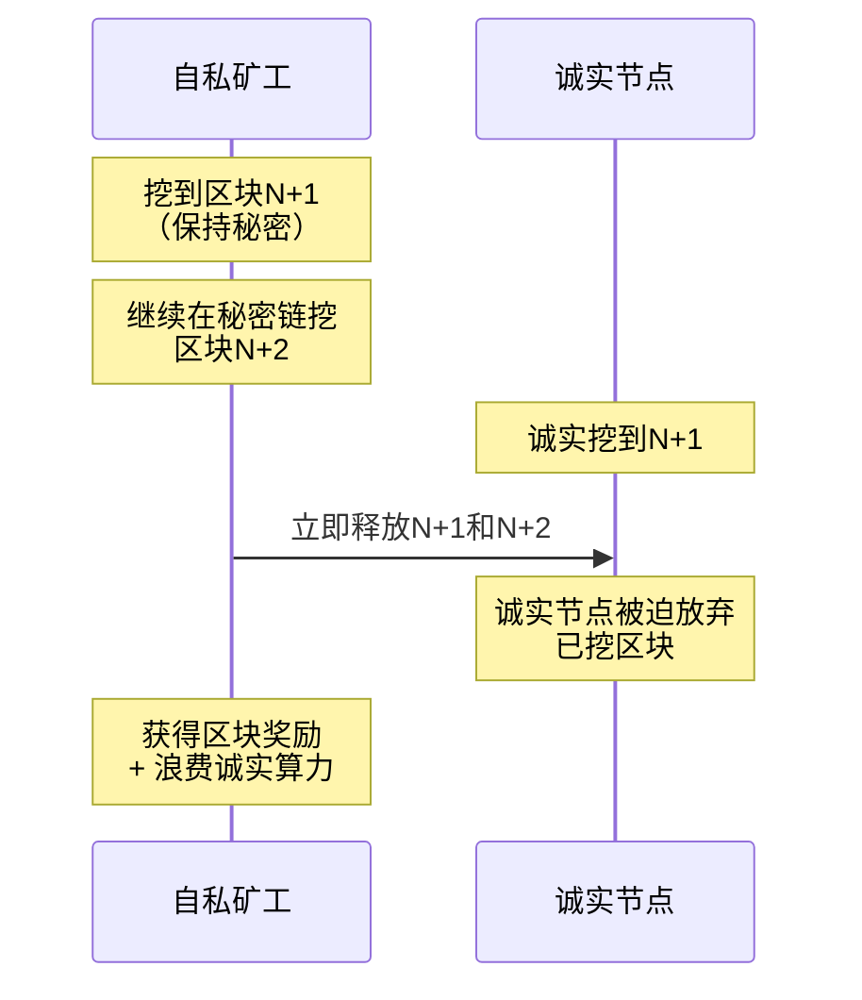
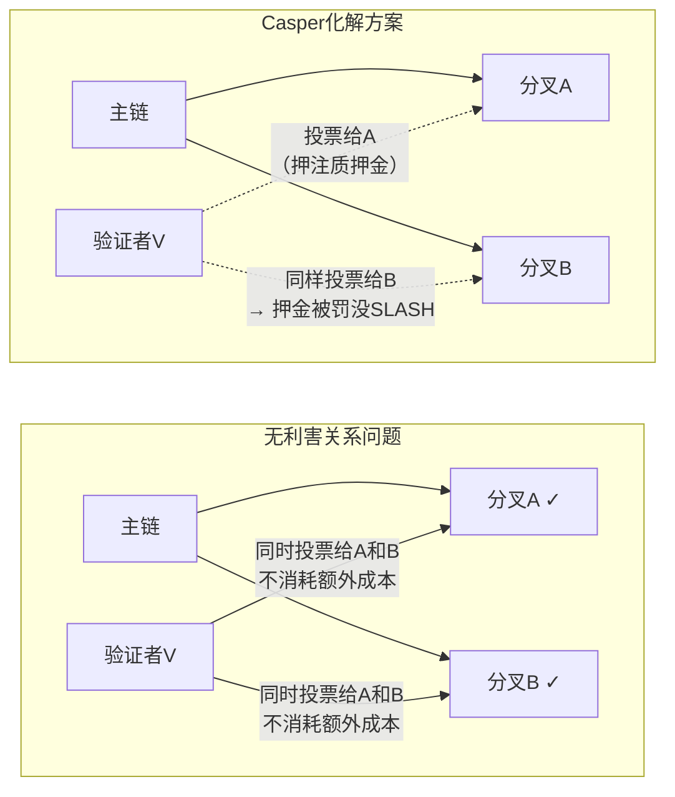
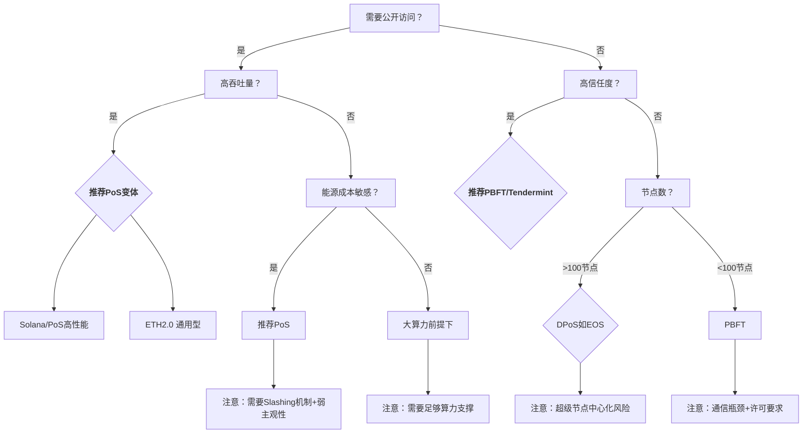

# 21.3 共识机制安全

## 21.3.0 共识机制概述

共识机制（Consensus Mechanism）是区块链网络中各节点达成一致状态的算法规则，是保证分布式账本一致性、安全性和去中心化的核心基础设施。从比特币的PoW到以太坊的PoS，再到各类BFT变体，每一次共识机制的演进都伴随着新的安全挑战。

```mermaid
graph TD
    A[共识机制三大核心目标] --> B[一致性<br/>所有节点数据最终一致]
    A --> C[可用性<br/>系统持续对外服务]
    A --> D[安全性<br/>恶意节点无法破坏]
    
    B --> B1[经典: FLP不可能性<br/>异步系统中无法同时保证<br/>一致性、安全性、活性]
    C --> C1[经典: CAP定理<br/>一致性、可用性、分区容错性<br/>最多三者取其二]
    D --> D1[拜占庭容错<br/>容忍节点任意行为<br/>包括恶意攻击]
    
    style A fill:#1a1a2e,stroke:#e94560,stroke-width:2px
    style D fill:#16213e,stroke:#e94560,stroke-width:2px
    style D1 fill:#0f3460,stroke:#e94560,stroke-width:1px
```



**共识机制安全评估维度：**

| 维度 | PoW | PoS | BFT类 | DPoS |
|------|-----|-----|-------|------|
| 拜占庭容错能力 | <全网50%哈希算力 | <全网33%质押资产 | <33%验证者节点 | <33%超级节点 |
| 最终性 | 概率最终性(约6区块) | 概率/即时(视实现) | 即时最终性 | 概率最终性 |
| 抗Sybil攻击 | 算力验证(能源成本高) | 资金验证(质押成本) | 身份验证(许可网络) | 投票验证(声誉成本) |
| 抗长程攻击 | 强(链越长成本越高) | 弱(需要检查点辅助) | N/A(即时确定性) | 中等 |
| 分叉风险 | 高(天然存在叔块) | 中(无利害关系问题) | 低(投票即决) | 中 |
| 通信复杂度 | O(n) | O(n) | O(n²)以上 | O(n) |

---

## 21.3.1 工作量证明（PoW）安全

### 理论基础

PoW（Proof of Work）由中本聪在2008年比特币白皮书中提出，要求节点通过计算SHA-256哈希值寻找满足特定难度目标的nonce值。安全模型建立在**算力-经济**基础上：攻击者需投入与诚实节点相当的物理资源（电力、硬件）才能破坏共识。

核心安全公式：
```text
攻击成本 = 算力占比 × 全网总算力 × 单位算力成本
```

### 21.3.1.1 51%攻击（多数攻击）

**原理：** 当单个矿工或矿池掌握超过全网50%的总哈希算力时，可以在不违反密码学规则的前提下控制链的走向。

**攻击者可实施的操作：**

1. **双花攻击（Double Spending）**——攻击者同时在两条链上花费同一笔币
   - 步骤1：攻击者用A地址向交易所转入100 BTC（公开链记录）
   - 步骤2：攻击者私下在另一条链上挖矿，将相同100 BTC转回自己的B地址
   - 步骤3：等待交易所确认入账并允许提现（通常6个区块确认）
   - 步骤4：立即提现其他币种，同时释放私链
   - 步骤5：由于私链算力更高，成为主链，原交易被回滚
   - 结果：攻击者同时保留了100 BTC原币和交易所提出的资产

2. **交易审查（Transaction Censorship）**——拒绝将特定交易打包进区块
3. **区块重组（Reorganization）**——回滚已确认的历史区块

**真实案例：**

| 时间 | 链名称 | 攻击方式 | 攻击损失 |
|------|--------|---------|---------|
| 2018年5月 | Bitcoin Gold (BTG) | 51%攻击，回滚超过22个区块 | 约1800万美元 |
| 2019年1月 | Ethereum Classic (ETC) | 51%攻击，回滚12433个区块 | 约110万美元（双花） |
| 2020年8月 | Ethereum Classic (ETC) | 连续三次51%攻击 | 约560万美元 |
| 2021年6月 | Bitcoin SV (BSV) | 51%攻击，链重组 | 多交易所暂停充提 |

> **从数据看趋势：** 采用PoW的小市值链（算力<1EH/s）是最易受攻击的目标。ETC曾被认为"足够安全"，但算力仅比特币的<1%使其反复成为靶子。

**防御策略：**

- **确认次数动态调整：** 根据链算力波动设置可变的确认数要求
- **监控告警系统：** 实时检测算力分布异常和大额回滚
- **检查点机制：** 核心团队定期对关键区块进行检查点标记
- **算力多元化：** 鼓励独立矿工和小矿池加入，避免单一矿池算力集中
- **PoW+PoS混合：** 如Decred同时使用PoW出块和PoS投票确认

### 21.3.1.2 自私挖矿（Selfish Mining）

**原理：** 由Emin Gün Sirer等人在2013年提出。攻击者挖到新区块后故意不广播，而是秘密继续挖下一个区块，当主链接近自己秘密链时，再释放秘密链以废弃诚实节点的算力。



**核心发现：**

| 策略参数 | 阈值 | 影响 |
|---------|------|------|
| 自私挖矿获利阈值 | >25%总算力 | 自私行为开始有净收益 |
| 可废其他节点区块 | >33% | 可频繁制造链重组 |
| 完全控制 | 50% | 等同于51%攻击 |

**防御方法：**

- **随机广播延迟监听：** 节点在收到新块后随机等待0-500ms再广播，降低自私矿工预判能力
- **FruitChain协议：** 将区块奖励与区块产生分离，减少自私挖矿动机
- **幽灵协议（GHOST）：** 以太坊早期采用，奖励叔块（Uncle Block），减轻算力浪费

### 21.3.1.3 日蚀攻击（Eclipse Attack）

**原理：** 攻击者填充目标节点的对等连接表（Peer Table），使其所有网络连接都指向攻击者控制的恶意节点。被隔离的节点无法收到真实的区块广播。

**攻击步骤：**

1. **信息收集：** 扫描比特币/以太坊网络中的节点IP
2. **连接表填充：** 攻击者运行大量恶意节点，持续向目标发起连接请求
3. **合法节点驱逐：** 利用比特币/以太坊节点连接管理机制的漏洞（如每连接槽位到期自动淘汰）
4. **孤立完成：** 目标节点的所有对外连接均为攻击者控制的节点
5. **视图操纵：** 攻击者可以向目标节点选择性推送伪造的区块头和交易数据

**检测方法：**

```bash
# 检查节点连接的唯一性（比特币core）
bitcoin-cli getpeerinfo | jq '[.[].addr] | unique | length'

# 若单一子网IP数量超过总连接数30%，存在问题
# 对比正常值：合理值是<10%的连接来自同一/24子网
```

**防御措施：**

| 层面 | 具体措施 |
|------|---------|
| 协议层 | 增加随机连接发现机制（如Bitcoin的AddrMan的桶式随机化） |
| 节点层 | 限制单IP/子网的最大连接数 |
| 网络层 | 使用DNS种子固定发现源，缓存已验证节点 |
| 应用层 | 运行全节点时启用`-maxconnections=125`、`-maxuploadtarget`参数 |

---

## 21.3.2 权益证明（PoS）安全

### 理论基础

PoS（Proof of Stake）以验证者质押的代币数量（Stake）作为记账权分配依据。以太坊在2022年9月的"合并"（The Merge）中正式从PoW切换至Gasper协议（Casper FFG + LMD GHOST）的PoS。

安全模型建立在**权益-经济**基础上：攻击者需要质押大量资产才能破坏共识，且攻击行为会导致质押资产被罚没（Slashing），损失远大于收益。

### 21.3.2.1 长程攻击（Long-Range Attack）

**原理：** 攻击者从区块链历史的某个早期分叉点开始，用自己控制的验证者私钥重新验证区块，构建一条替代链。由于PoS出块不需要计算，理论上可以从创世块开始伪造整个历史。

**三种变体：**

| 类型 | 描述 | 窗口期 | 应对策略 |
|------|------|--------|---------|
| 简单长程攻击 | 从创世块重建一条完整链 | 永久 | 弱主观性（Weak Subjectivity）检查点 |
| 事后攻陷攻击 | 攻击者被罚没后仍用旧密钥签名 | 密钥有效期内 | 密钥轮换+严格罚没条件 |
| 勾结长程攻击 | 历史验证者集体勾结重建旧链 | 和解约期（Withdrawal Period） | 延迟提现+惩罚条款 |

**以太坊的防御方案——弱主观性（Weak Subjectivity）：**

```text
核心思想：每个新节点在首次同步时，信任一个"近期"的社会共识检查点
而非极早期的区块。

公式：弱主观性期 = 矿工数量 × 平均出块时间 × 2
示例（以太坊）：约 2周 内是安全的，超过此期限需要信任外部来源
```

**代码示例：检查是否在弱主观性期内（简化模型）：**

```python
# 以太坊PoS弱主观性检查示例
MAX_WEAK_SUBJECTIVITY_PERIOD = 10800  # 约2周的slot数（每个slot12秒）
CURRENT_EPOCH = 12345                      # 当前epoch编号
TRUSTED_CHECKPOINT_EPOCH = 12250           # 可信检查点

def is_within_weak_subjectivity(checkpoint_epoch, current_epoch):
    elapsed = current_epoch - checkpoint_epoch
    active_validators_count = 500000  # 从链上读取
    
    ws_period = int(
        active_validators_count * 12 / (60 * 60 * 24)  # 天数
    ) + 1
    
    return elapsed < MAX_WEAK_SUBJECTIVITY_PERIOD or elapsed < ws_period

if is_within_weak_subjectivity(TRUSTED_CHECKPOINT_EPOCH, CURRENT_EPOCH):
    print("✅ 弱主观性检查通过")
else:
    print("⚠️ 需要外部可信检查点验证")
```

### 21.3.2.2 无利害关系问题（Nothing-at-Stake）

**原理：** 在PoS中，验证者在多个分叉上同时投票不会消耗额外资源（不像PoW那样需要消耗电量）。理论上，理性验证者可以在所有分叉上投票以"确保"自己始终获得奖励，这导致区块链网络永远无法达成最终共识。



**Casper FFG（以太坊）的Slashing机制：**

| 违规行为 | 罚没金额 | 结果 |
|---------|---------|------|
| 双投票（在同一高度投两个不同的块） | 全部质押 | 强制退出验证者集 |
| 环绕投票（违反Casper投票投票约束） | 全部质押 | 强制退出验证者集 |
| 不活跃（长期离线不参与投票） | 逐步递减（最多-99%） | 自动退出 |

**Slashing条件检验代码示例：**

```solidity
// 简化版Casper FFG slashing条件检测合约
pragma solidity ^0.8.0;

contract CasperSlashing {
    mapping(address => uint256) public stakes;
    mapping(uint256 => mapping(address => bytes32)) public votes; // epoch -> validator -> vote_hash
    
    // Slashing条件1：同一epoch投两票
    function slashDoubleVote(address validator, uint256 epoch, bytes32 voteHash1, bytes32 voteHash2) external {
        require(votes[epoch][validator] == bytes32(0), "Already voted");
        
        // 投票记录检查在此省略——实际需要验证签名和voteHash的对应关系
        // 条件: voteHash1 != voteHash2，且都是在同一epoch
        _slash(validator);
    }
    
    // Slashing条件2：违反Casper包围规则
    // 验证者不能对(s1→t1)和(s2→t2)投票，使得:
    // s1 < s2 < t2 < t1 （环绕投票）
    function slashSurroundVote(address validator, uint64 s1, uint64 t1, uint64 s2, uint64 t2) external {
        require(s1 < s2 && s2 < t2 && t2 < t1, "Not a surround vote");
        _slash(validator);
    }
    
    function _slash(address validator) internal {
        uint256 penalty = stakes[validator];
        stakes[validator] = 0;
        // 部分罚没金额奖励给举报者
        // 部分销毁
    }
}
```

### 21.3.2.3 远程攻击（Remote Attack / Grinding Attack）

**原理：** 验证者影响未来随机数的生成，使自己未来被选为区块生产者的概率增加。在PoS中，区块生产者选择通常依赖可验证随机函数（VRF），而VRF的种子（Seed）可能受已出块的验证者影响。

**攻击向量：**

```text
典型场景（以太坊2.0信标链）：
1. 当前epoch的随机种子 = hash(prev_epoch_seed + mix_of_current_epoch)
2. 每个slot的出块验证者由VRF(seed, slot_number)决定
3. 攻击者如果在一个epoch中出多个块，可以通过选择性地丢弃特定区块
   来影响下一个epoch的随机种子
4. 虽然影响有限（每个验证者每epoch最多影响一个输出），但多个验证者
   勾结时影响增大
```

**以太坊的防御方案：**
- 每epoch使用RANDAO（多个验证者贡献的随机值混合）
- 每个验证者每epoch只能贡献一个随机值（防止刷量）
- 未来计划引入VDF（可验证延迟函数）进一步增强随机性

### 21.3.2.4 验证者中心化风险

**质押集中化（Staking Centralization）现状：**

截至2025年，以太坊PoS质押数据存在以下集中化风险：

| 服务商 | 质押占比 | 风险等级 |
|-------|---------|---------|
| Lido (stETH) | ~32% | 高风险（接近1/3阈值） |
| Coinbase | ~15% | 中风险 |
| Binance | ~7% | 中风险 |
| Rocket Pool | ~4% | 低风险 |
| 单个独立验证者 | 均<1% | 低 |

> **核心矛盾：** PoS的去中心化承诺与现实中质押服务的集中化趋势相冲突。Lido单一实体控制近1/3的质押量，一旦受到合规压力或攻击，将对以太坊共识产生致命影响。

**防御建议：**

1. **分布式验证者技术（DVT）：** 使用SSV.network、Obol等协议将单个验证者密钥拆分为多份，由多个节点共同运营，任一节点作恶不影响全局
2. **质押上限：** 协议层限制单一流动性质押协议的总质押量上限
3. **验证者多样性：** 个人质押者应选择不同的执行客户端和共识客户端组合（如Lighthouse + Nethermind、Prysm + Besu等），避免客户端垄断

**客户端多样性检查命令：**

```bash
# 以太坊验证者客户端分布查询（使用Dune或Prometheus+Grafana）
# 本地监控
curl -s http://localhost:9000/metrics | grep "^validator_client_version"

# 输出示例：
# validator_client_version{version="Lighthouse/v4.5.0"} 200
# validator_client_version{version="Prysm/v4.2.1"} 150

# 理想分布：任一客户端占比不应超过50%
```

### 21.3.2.5 PoS出块攻击真实案例

| 时间 | 事件 | 详情 |
|------|------|------|
| 2023年3月 | 以太坊Goerli测试网重置 | 重复提现漏洞导致测试网重组 |
| 2024年2月 | Solana共识停滞 | 低质押验证者问题导致无法达成最终性 |
| 2025年初 | BNB Chain重新组织 | PoS验证者勾结，回滚10个区块阻止黑客 |
> **注意：** 最后一个案例中，"重组回滚"本身是社区治理的正当行为，但也展示了Pos下"软分叉回滚"的可能性，引发了对去中心化的担忧。

---

## 21.3.3 拜占庭容错（BFT）类共识安全

### 理论基础

BFT（Byzantine Fault Tolerance）解决的是**拜占庭将军问题**：在存在不可靠、可能叛变的通信者的系统中，如何使诚实节点达成一致。BFT类共识在联盟链和许可链中广泛应用。

```text
经典BFT前提条件（Lamport 1982）：
- 总节点数 N
- 容错节点数 f
- 需满足 N ≥ 3f + 1
```

### 21.3.3.1 PBFT（实用拜占庭容错）攻击面

**协议流程简述：**

```text
客户端→主节点→（Pre-Prepare→Prepare→Commit）→所有节点→回复客户端

通信复杂度：O(n²)  —— 每次共识需要约 2f+1 条消息
```

**安全威胁：**

| 攻击类型 | 原理 | 影响 | 防御措施 |
|---------|------|------|---------|
| 视图变更攻击 | 恶意主节点频繁发起视图变更投票 | 共识停滞 DoS | 限制视图变更频率，设置超时惩罚 |
| 主节点作恶 | 主节点分发不一致的Pre-Prepare消息 | 共识失败 | 验证Pre-Prepare时检查消息签名一致性 |
| 拜占庭延迟 | 恶意节点发送高延迟但合法的消息 | 拖延最终性 | 使用超时机制，标记高延迟节点 |
| 女巫攻击 | 攻击者创建大量虚假身份 | 突破BFT容错阈值 | 许可链使用CA认证，公链与PoS结合 |

**PBFT在许可链中的安全配置建议：**

```yaml
# Hyperledger Fabric PBFT调优参数（参考）
consensus:
  orderer_type: etcdraft  # Raft变体，非严格PBFT
  batch_timeout: 2s
  batch_size: 500  # 每批最大交易数
  
  # BFT安全相关
  tls_enabled: true
  mutual_tls: true
  identity_verification: true
  
  # 抗攻击配置
  max_view_change_retries: 3
  view_change_timeout: 10s
  min_prepare_quorum: "2f+1"
  min_commit_quorum: "2f+1"
```

### 21.3.3.2 Tendermint/Cosmos安全

Tendermint是改进的BFT共识引擎，已被Cosmos生态广泛采用，提供即时最终性和安全活性保障。

**安全特性：**

- 投票分两轮（Pre-Vote、Pre-Commit）
- 锁机制（Locked）防止分叉
- 超过1/3验证者离线时网络停止（安全优于活性）
- 惩罚条件：重复签名的验证者被锁定的质押金

**安全攻击面分析：**

```text
攻击类型1：Amnesia攻击
- 验证者参与两个不同高度的Pre-Commit
- 利用Tendermint锁机制的"记性丢失"
- 防御：引入证据机制（Evidence），自动检测并Slash

攻击类型2：节流攻击（Throttling Attack）
- 攻击者操纵交易广播，使主节点超时
- 导致频繁视图变更，降低系统吞吐量
- 防御：动态超时调整，基于历史表现的自适应

攻击类型3：验证者贿赂
- 在Cosmos生态中，验证者可以通过链上治理提案投票
- 贿赂攻击者用链外方式买通验证者
- 防御：无完美方案，依赖社区监督
```

**Tendermint安全配置检查：**

```bash
# 查询当前验证者集大小和状态
gaiad q tendermint-validator-set

# 检查是否存在重复签名证据
gaiad query evidence

# 监控验证者在线率
curl -s http://localhost:26657/validators | jq '.result.validators | length'
# 理想值：≥2/3的验证者在线可继续出块
```

### 21.3.3.3 HotStuff共识安全

HotStuff（2020）是FBFT（Fast BFT）类共识的改进版本，Libra/Diem和Aptos/Sui等采用其变体。

**相比PBFT的优势与风险：**

| 对比项 | PBFT | HotStuff |
|-------|------|----------|
| 通信复杂度 | O(n²) | O(n)（线性） |
| 视图变更 | 复杂，多轮投票 | 简洁，集成在正常流程中 |
| 管道化（Pipelining） | 不支持 | 支持多轮同时进行 |
| 主要攻击面 | 视图变更DoS | 领导者（Leader）单点故障 |
| 抗审查性 | 中等 | 较弱（领导者可排序交易） |

**HotStuff领导者作恶攻击（Leader-Based Censorship）：**

```python
# 模拟HotStuff领导者审查攻击场景
class HotStuffAttackSimulator:
    def __init__(self, malicious_leader=True):
        self.leader = "malicious" if malicious_leader else "honest"
        self.pending_transactions = []
        self.blacklisted_addresses = set(["0xBAD..."])
    
    def propose_block(self, transactions):
        if self.leader == "malicious":
            # 审查特定地址的交易
            filtered = [
                tx for tx in transactions 
                if tx.sender not in self.blacklisted_addresses
            ]
            return filtered
        return transactions
    
    def rotate_leader(self):
        # HotStuff是轮换领导者制
        # 防御：快速切换领导+随机排序
        pass
```

---

## 21.3.4 新兴共识机制安全

### 21.3.4.1 历史证明（PoH, Proof of History）

Solana采用了PoH + Tower BFT的组合共识，其中PoH作为全局时钟。

**安全挑战：**

| 挑战 | 描述 | 影响 |
|------|------|------|
| VDF可验证延迟函数的算力中心化 | 生成PoH序列需要特定GPU | 验证者硬件门槛高 |
| 时间戳操纵 | 恶意节点生成伪造的时间序列 | 难以篡改（VDF保证） |
| 区块传播延迟 | 大区块传播导致验证者落后 | 高吞吐量下的网络拥塞 |

### 21.3.4.2 Avalanche共识

Avalanche使用亚稳态协议（MetaStable Protocol），通过随机抽样投票达成共识。

**安全特性：**

- 无需等待2/3节点确认，概率最终性
- 抗51%攻击能力随网络规模增长
- 无领袖（Leaderless），单点故障风险低

**攻击面：**

```mermaid
graph TD
    subgraph "Avalanche共识攻击面"
        A[雪崩攻击 Avalanche Attack] --> A1[攻击者填充大量验证者<br/>影响随机抽样结果]
        B[延迟攻击 Latency Attack] --> B1[操纵网络延迟使诚实节点<br/>接收信息滞后]
        C[女巫攻击 Sybil Attack] --> C1[创建虚假身份<br/>突破概率容错]
    end
    
    style A fill:#1a1a2e,stroke:#e94560
    style B fill:#1a1a2e,stroke:#e94560
    style C fill:#1a1a2e,stroke:#e94560
```



**Avalanche安全参数调优：**

| 参数 | 默认值 | 安全增强建议 | 影响 |
|------|-------|-------------|------|
| k（抽样大小） | 20 | 40-50 | 提高抗攻击性但增加延迟 |
| α（确认阈值） | 15 | 30-40 | 降低误判率 |
| β（轮数） | 20 | 30-40 | 降低错误最终性概率 |
| 超时时间 | 500ms | 1000-2000ms | 提升网络分区容错性 |

---

## 21.3.5 共识机制综合安全性评估

### 攻击成本对比

| 攻击类型 | PoW成本 | PoS成本 | BFT成本 |
|---------|---------|---------|---------|
| 双花攻击 | 算力>50%全网 | 质押>33%总价值 | 无法（即时最终性） |
| 共识停滞 | 算力>50%（可审查） | 质押>33%（可停止） | 节点>33%（可停止） |
| 历史篡改 | 极高（需重挖所有区块） | 中等（需获取历史私钥） | 低（即时最终性） |
| 长程回滚 | 指数增长 | 线性增长（受检查点限制） | 不可能 |
| 贿赂验证者 | 低（PoW矿工可切换矿池） | 中（质押有锁定期） | 高（身份可追溯） |

### 共识机制选择安全决策树



### 共识安全"黄金法则"

1. **经济安全 > 技术安全：** 攻击者最有效的博弈手段是经济激励，而非远程漏洞利用——设计共识时应优先考虑经济博弈论
2. **最终性 ≠ 确定性：** 概率最终性的链（如PoW）永远存在小概率回滚风险，需要根据安全要求设置充分的确认数
3. **安全与活性的权衡（FLP impossibility）：** 在异步网络中，没有共识算法能同时保证安全性（Safety）和活性（Liveness），设计时必须二选一
4. **去中心化是安全的基础保障：** 任何形式的中心化（算力集中、质押集中、验证者集中）都直接降低共识安全
5. **攻击者总是从最薄弱环节切入：** 共识安全不仅仅在共识层，还包括P2P网络层、应用层、经济层——攻击者会寻找整个系统中的最弱点

### 安全审计清单

```yaml
# 共识机制安全审计——关键检查项
网络层:
  - [ ] 检查点对点连接是否限制单IP连接数
  - [ ] 验证节点发现机制是否抗日蚀攻击
  - [ ] 确认消息传播延迟是否可控

共识层:
  - [ ] 验证拜占庭节点容错比例是否合理
  - [ ] 检查是否存在无成本投票漏洞
  - [ ] 确认最终性机制实现是否完整
  - [ ] 测试视图变更流程是否存在拒绝服务风险

经济层:
  - [ ] 评估攻击成本是否显著高于潜在收益
  - [ ] 检查惩罚（Slashing）机制是否足以威慑
  - [ ] 验证检查点/弱主观性机制是否正确部署
  - [ ] 评估代币分配是否存在质押集中化趋势

实现层:
  - [ ] 检查共识协议的密码学实现（签名、哈希、VRF）
  - [ ] 验证状态机的正确性（使用模型检查如TLA+）
  - [ ] 确认所有已知CVE补丁已应用
  - [ ] 执行模糊测试（Fuzzing）覆盖消息处理流程
```

---

## 21.3.6 进阶：共识安全的理论前沿

### FLP不可能性与共识安全的关系

Fischer、Lynch和Paterson在1985年证明：在**异步**系统中，即使只有一个节点可能故障，也无法设计出一个确定性共识算法同时保证**一致性**、**可用性**和**活性**。这意味着所有实用共识都必须在某种条件下做出妥协：

- PoW/Bitcoin：牺牲**最终确定性**，采用概率最终性
- PoS/Casper：牺牲**严格活性**，通过Slashing惩罚保证安全优于活性
- PBFT/Tendermint：牺牲**异步活性**，在异步网络中可能停滞

### 混合共识的安全增强

前沿方向：将多种共识机制的优势结合

| 混合方案 | 代表项目 | 安全增强 |
|---------|---------|---------|
| PoW + PoS | Decred | PoW出块，PoS投票确认，双重保护 |
| PoS + BFT | Cosmos (Tendermint) | PoS提供经济安全，BFT提供即时最终性 |
| DAG + BFT | Fantom (Lachesis) | DAG提供高吞吐，BFT保证安全性 |
| VRF + BFT | Algorand | VRF随机选验证者，BFT投票保证 |
| PoH + BFT | Solana | PoH提供不可逆时间戳，Tower BFT提供最终性 |

### Liveness vs Safety 实战权衡指南

| 场景 | 优先保证 | 推荐共识 | 原因 |
|------|---------|---------|------|
| 金融结算系统 | Safety | BFT/Tendermint | 宁停勿乱，交易绝对不能回滚 |
| 社交媒体数据 | Liveness | PoW/DAG | 宁乱勿停，可用性比精准更重要 |
| 资产跨链桥 | Safety | PoS+多签 | 跨链错误损失极大，宁可慢也要准 |
| 游戏侧链 | Liveness | DPoS/Avalanche | 用户对游戏暂停零容忍 |
| 物联网(IoT)微支付 | Both | DAG (IOTA) | 高频小额，需同时保证速度和安全性 |

---

## 本章总结

共识机制安全是区块链安全的基石，任何一个共识缺陷都可能导致整个链上的资产和经济体系崩溃。掌握共识安全需要同时理解：

1. **经济博弈论**：攻击者不是随机破坏者，而是理性的利益最大化者
2. **分布式系统理论**：FLP不可能性、CAP定理决定了共识在设计层面的根本约束
3. **密码学基础**：签名、哈希、VRF、VDF等密码原语是共识底层安全保证
4. **工程实践**：从PBFT到HotStuff到DAG共识，每种共识在实际部署中都有自己的攻击面

**给安全从业者的建议：**

- **审计者：** 不要只盯着代码漏洞——算力集中、质押集中、验证者勾结往往比缓冲区溢出危害更大
- **开发者：** 选择共识协议时，安全性要优先于性能——一个每秒处理10万笔交易但可以被1/3节点停止的系统不是好系统
- **白帽黑客：** 关注跨链桥和DeFi中与共识相关的漏洞——如链重组攻击、引用数据源操纵等

> **延伸阅读：**
> - 《Bitcoin: A Peer-to-Peer Electronic Cash System》——Satoshi Nakamoto, 2008
> - 《Casper the Friendly Finality Gadget》——Buterin & Griffith, 2017
> - 《The Byzantine Generals Problem》——Lamport, Shostak & Pease, 1982
> - 《HotStuff: BFT Consensus with Linearity and Responsiveness》——Yin et al., 2019
> - 《Avalanche: A Novel Metastable Consensus Protocol》——Rocket, 2018