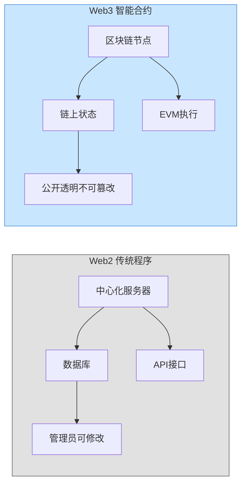
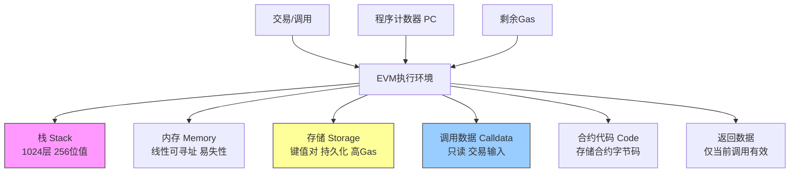
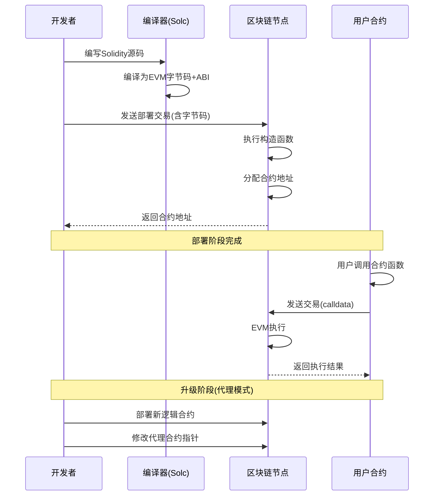
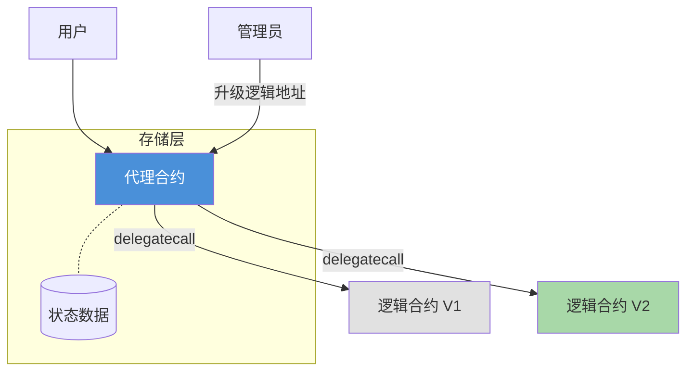
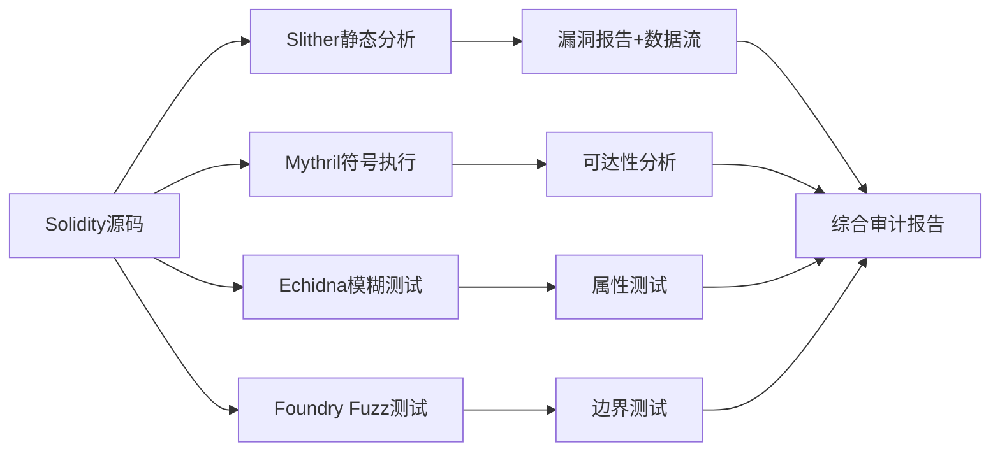
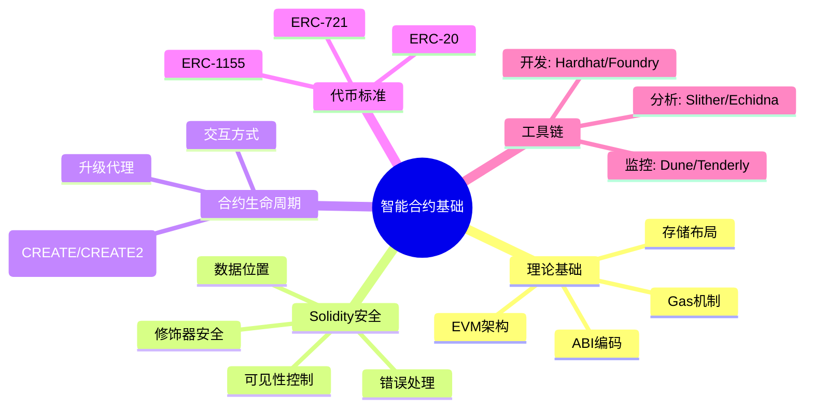

# 21.4 智能合约基础

## 21.4.1 智能合约概述

### 21.4.1.1 定义与起源

智能合约（Smart Contract）是部署在区块链上的**自动执行程序**，它在满足预设条件时自动执行合约条款。这个概念最早由计算机科学家尼克·萨博（Nick Szabo）在1994年提出，但直到以太坊在2015年问世，才真正具备了图灵完备的智能合约执行环境。

智能合约的本质是一段**存储在区块链上的代码**，由区块链节点共同执行，执行结果经过共识机制达成一致后永久记录在链上。与传统的法律合约不同，智能合约不需要第三方信任中介——信任来源于代码的确定性执行和区块链的不可篡改性。

### 21.4.1.2 核心特征

| 特征 | 说明 | 安全含义 |
|------|------|----------|
| **不可变性** | 部署后代码通常无法修改（代理模式除外） | 部署前的安全审计至关重要 |
| **确定性** | 相同输入产生相同输出，所有节点执行结果一致 | 杜绝随机数依赖（需预言机） |
| **透明性** | 字节码和源码对所有节点公开 | 攻击者可分析代码寻找漏洞 |
| **可组合性** | 合约之间可相互调用，形成"可组合乐高" | 带来依赖链风险（如闪电贷攻击） |
| **原子性** | 交易要么全部执行成功，要么全部回滚 | 防止部分状态更新 |
| **图灵完备** | 支持循环和条件分支（受Gas限制） | 需要Gas机制防止无限循环 |

### 21.4.1.3 与Web2程序的本质区别



**关键差异：**

1. **部署不可逆**：Web2可以随时回滚数据库；智能合约一旦部署，bug修复需要复杂的升级模式
2. **执行成本**：每次状态变更都需要Gas（燃料费），而Web2的操作通常是免费的
3. **公开性**：所有合约代码对所有人可见，没有"隐藏安全"
4. **开源生态**：DeFi协议大多开源，可被直接分叉和组合

---

## 21.4.2 以太坊虚拟机（EVM）深入解析

EVM是以太坊智能合约的运行时环境，理解EVM是安全分析的基础。

### 21.4.2.1 EVM架构概览



### 21.4.2.2 四类数据存储

#### 栈（Stack）
- **容量**：最多1024层，每层256位（32字节）
- **特点**：后进先出（LIFO），所有EVM操作都在栈上进行
- **安全含义**：栈深度溢出（>1024）会导致异常中止，恶意合约可通过精心构造的调用栈耗尽Gas或触发栈溢出

#### 内存（Memory）
- **结构**：线性可寻址的字节数组，按32字节字对齐扩展
- **生命周期**：仅当前EVM调用期间有效，调用结束后释放
- **成本**：按字节扩展收费，首次访问新字时支付扩展费用
- **安全含义**：内存越界读写可能导致数据泄露或控制流劫持

#### 存储（Storage）
- **结构**：2^256个槽位的键值存储，每个槽位32字节
- **持久性**：永久存储，合约状态变更的根源
- **成本**：所有操作中Gas消耗最高（SLOAD: 2100, SSTORE: 20000~29000）
- **安全含义**：存储布局与继承顺序相关，错误的布局分析是很多漏洞的根源

#### Calldata
- **结构**：交易的输入数据，只读
- **编码**：ABI编码（Application Binary Interface），函数选择器（前4字节）+ 参数数据
- **安全含义**：calldata可包含任意数据，未正确验证calldata可能导致代理调用漏洞

### 21.4.2.3 常见EVM操作码

| 类别 | 操作码 | 功能 | Gas消耗 | 安全关注点 |
|------|--------|------|---------|-----------|
| 算术 | ADD/SUB/MUL | 加减乘 | 3~5 | 整数溢出（需Solidity 0.8+内置检查） |
| 比较 | EQ/LT/GT | 等于/小于/大于 | 3 | 比较逻辑绕过 |
| 存储 | SLOAD | 读存储槽 | 2100（首次）/ 100（重复） | 重入锁缺失 |
| 存储 | SSTORE | 写存储槽 | 20000~29000 | Gas消耗高，DoS攻击向量 |
| 调用 | CALL | 调用外部合约 | 700+ | **重入攻击的核心操作码** |
| 调用 | DELEGATECALL | 以本合约上下文调用 | 700+ | **代理模式的基石** |
| 调用 | CALLCODE | 已弃用 | 700+ | 不推荐使用 |
| 返回 | RETURN | 返回数据 | 0 | 返回值验证 |
| 回滚 | REVERT | 回滚状态 | 0 | 条件检查失败时使用 |
| 日志 | LOG0~LOG4 | 写事件日志 | 375+数据费用 | 事件伪造 |
| 自毁 | SELFDESTRUCT | 销毁合约 | 5000+ | 已废弃（EIP-6780限制） |

### 21.4.2.4 Gas机制详解

Gas是以太坊执行操作的计算成本计量单位，既是经济机制也是安全机制。

**Gas计费规则：**
- 每条EVM指令有固定Gas成本（如ADD=3, SLOAD=2100）
- 交易发送者设置Gas Limit（愿意支付的最大Gas）和Gas Price（每单位Gas的价格）
- 未用完的Gas退还，Gas耗尽时交易回滚但已消耗的Gas不退还

**EIP-1559后的Gas模型：**
```text
交易费 = Gas Used × (Base Fee + Priority Fee)
- Base Fee: 根据网络拥堵自动调整，燃烧（销毁）
- Priority Fee: 给验证者的小费，激励优先打包
```

**Gas相关的安全风险：**

1. **Gas耗尽攻击**：攻击者构造交易使目标合约在执行过程中耗尽Gas，导致关键操作回滚
2. **Gas griefing**：在DELEGATECALL调用中消耗过多Gas，使主调用方的Gas不足以完成后续操作
3. **无限循环**：没有Gas限制的区块链（如早期以太坊）会遭受拒绝服务攻击；Gas机制正是为了解决这个问题
4. **Gas Price操纵**：在拥堵期间，高Gas Price交易可抢跑（front-run）低Gas Price交易

---

## 21.4.3 Solidity语言安全特性详解

Solidity是以太坊上最流行的智能合约语言，这里重点分析其安全相关的语言特性。

### 21.4.3.1 可见性修饰符（Visibility Modifiers）

```solidity
contract VisibilityExample {
    uint256 private privateVar;    // 仅当前合约可读（但仍链上可见）
    uint256 internal internalVar;  // 当前合约+子合约
    uint256 public publicVar;      // 自动生成getter，任何人都可读
    uint256 externalVar;           // 仅外部可调用（不能内部this.方式）
    
    function test() public {
        // public: 内部和外部均可调用
    }
}
```

**安全要点：**
- `private` **不等于秘密**：链上数据永远公开，`private`仅仅阻止其他合约代码访问，任何人都可以通过读取存储槽来获取数据
- `external`比`public`省Gas：参数不复制到内存
- 错误的可见性是TOP5漏洞来源之一：将`internal`函数错误声明为`external`等于向所有人开放内部逻辑

### 21.4.3.2 修饰器（Modifier）

修饰器用于在函数执行前后注入检查逻辑：

```solidity
contract ModifierExample {
    address public owner;
    
    constructor() {
        owner = msg.sender;
    }
    
    modifier onlyOwner() {
        require(msg.sender == owner, "Not owner");
        _;  // 在此处执行原函数体
    }
    
    modifier nonReentrant() {
        // 重入锁模式
        require(!locked, "Reentrant call");
        locked = true;
        _;
        locked = false;
    }
    
    function withdraw() external onlyOwner nonReentrant {
        // 受权限和重入双重保护
    }
}
```

**修饰器安全陷阱：**
- 修饰器中的`_`插入原函数体，如果修饰器在`_`前后有状态变更，可能导致**状态不一致**
- 多个修饰器的执行顺序：从上到下，`_`位置决定函数体插入点
- 修饰器内部的条件判断**不要依赖外部调用结果**，否则可能被重入攻击绕过

### 21.4.3.3 回退与接收函数（Fallback & Receive）

```solidity
contract FallbackExample {
    // 接收ETH时调用（data为空）
    receive() external payable {
        emit Received(msg.sender, msg.value);
    }
    
    // 调用不存在的函数时触发
    fallback() external payable {
        emit FallbackTriggered(msg.sender, msg.value, msg.data);
    }
}
```

**安全要点：**
- `receive()`和`fallback()`是所有合约的**攻击入口**——攻击者通过向合约发送ETH或调用不存在函数来触发
- 如果这两个函数为空或逻辑简单，重入攻击的可能性降低
- 在`receive()`中进行外部调用是高危操作

### 21.4.3.4 错误处理机制

```solidity
contract ErrorHandling {
    // 方式一：require（推荐用于输入验证和条件检查）
    function deposit() external payable {
        require(msg.value > 0, "Amount must be positive");
        require(msg.value <= maxDeposit, "Exceeds max deposit");
        // require失败：回滚所有状态，退还剩余Gas
    }
    
    // 方式二：revert（用于复杂条件逻辑）
    function withdraw(uint256 amount) external {
        if (amount > balance[msg.sender]) {
            revert InsufficientBalance(amount, balance[msg.sender]);
        }
        // revert失败：回滚并附带错误数据
    }
    
    // 方式三：assert（用于内部不变量检查，0.8+消耗所有Gas）
    function invariantCheck() internal view {
        assert(totalSupply >= 0);  // 仅用于不应该发生的条件
    }
    
    // 自定义错误（EIP-6093，推荐使用）
    error InsufficientBalance(uint256 requested, uint256 available);
}
```

**三种方式的选择原则：**
| 方式 | Gas行为 | 适用场景 |
|------|---------|----------|
| `require` | 退还剩余Gas | 输入验证、权限检查、条件守卫 |
| `revert` | 退还剩余Gas（可带参数） | 复杂错误、自定义错误类型 |
| `assert` | **消耗所有Gas**（0.8+） | 不应发生的内部错误、不变量检查 |

---

## 21.4.4 EVM存储布局与数据位置

### 21.4.4.1 状态变量存储布局

Solidity按照**变量声明顺序**将状态变量映射到存储槽，每个槽32字节：

```solidity
contract StorageLayout {
    uint256 a;      // 槽0
    uint256 b;      // 槽1
    address c;      // 槽2（占用20字节，剩余12字节可被下一个变量打包）
    uint96 d;       // 槽2（与c共用一个槽，因为total=20+12 < 32）
    uint256 e;      // 槽3（新的槽，因为前一个槽剩余0字节）
}
```

**变量打包规则：**
1. 从槽0开始按声明顺序分配
2. 如果当前槽剩余空间 ≥ 下一个变量的大小，则打包在同一槽
3. 基本类型按自然对齐
4. 结构体和数组从新槽开始（但内部元素可能跨槽）

### 21.4.4.2 映射与动态数组

```solidity
contract DynamicStorage {
    mapping(address => uint256) public balances;  // 槽N
    uint256[] public items;                        // 槽M
    
    // balances[key]的实际存储位置：
    // keccak256(key . 槽号)
    // 例如 keccak256(abi.encode(user, 0))
    
    // items[index]的实际存储位置：
    // 槽M存储数组长度
    // keccak256(槽号) + index
}
```

**安全含义：**
- 映射的存储槽不是连续的，无法通过遍历槽位来枚举所有键
- 读取任意存储槽可通过`{owner: slot}`语法（Solidity 0.8+）
- 存储布局了解后，通过`DELEGATECALL`调用时，如果调用合约与被调用合约的存储布局不一致，会导致**存储碰撞（Storage Collision）**

### 21.4.4.3 三种数据位置的对比

| 数据位置 | 特点 | 默认规则 | Gas消耗 | 可修改性 |
|----------|------|----------|---------|---------|
| **storage** | 持久化到链上 | 状态变量默认 | 最高（SSTORE） | 可读写 |
| **memory** | 临时，函数内有效 | 函数参数（除引用类型） | 中等（MSTORE） | 可读写 |
| **calldata** | 只读交易数据 | 外部函数的引用类型参数 | 最低 | 只读 |

**安全陷阱：**
- `storage`与`memory`混用导致修改未持久化
- 将`calldata`赋值给`memory`会复制数据，可能消耗大量Gas
- 未显式指定数据位置时，内部函数的数组参数默认`storage`引用，修改会影响原始数据

---

## 21.4.5 智能合约生命周期



### 21.4.5.1 合约部署

```solidity
// 部署流程示例
contract MyContract {
    address public owner;
    uint256 public value;
    
    // 构造函数：部署时运行一次
    constructor(uint256 _initialValue) {
        owner = msg.sender;  // 部署者
        value = _initialValue;
    }
}
```

部署的核心步骤：
1. **编译**：Solc将Solidity编译为EVM字节码 + ABI（应用二进制接口）
2. **构造**：部署交易不指定接收地址（to=空），data字段为合约字节码+构造参数
3. **部署地址计算**：`address = keccak256(rlp.encode([sender, nonce]))[12:]`（CREATE操作码）
4. **CREATE2**：`address = keccak256(0xff ++ sender ++ salt ++ keccak256(init_code))[12:]`，可预先计算地址，且相同salt在不同链上地址相同

### 21.4.5.2 合约交互

合约交互通过ABI编码实现：

```text
函数调用编码: 0x + 函数选择器(4字节) + 参数编码(32字节对齐)
```

```solidity
// 内部调用与外部调用的区别
contract Caller {
    // 外部调用（通过地址）
    function callExternal(address target) external {
        (bool success, bytes memory data) = target.call(
            abi.encodeWithSignature("someFunction(uint256)", 100)
        );
        require(success, "Call failed");
    }
    
    // 接口调用
    function callViaInterface(ITarget target) external {
        target.someFunction(100);  // 推荐方式
    }
    
    // 低级调用
    function lowLevelCall(address target, bytes calldata data) external {
        (bool success, ) = target.call(data);
        require(success);  // 必须检查返回值
    }
}
```

**三种调用方式对比：**

| 方式 | 安全性 | Gas效率 | 灵活性 | 使用建议 |
|------|--------|---------|--------|---------|
| **接口调用** | 高（类型安全） | 中 | 低 | 优先使用 |
| **低级别call** | 低（需手动检查） | 高 | 高 | 必须检查返回值 |
| **delegatecall** | 最低（存储碰撞风险） | 中 | 最高 | 仅用于代理模式 |

---

## 21.4.6 智能合约升级模式

### 21.4.6.1 为什么需要升级

虽然区块链承诺不可变性，但现实需求驱动了升级模式的诞生：
- **修复安全漏洞**（最紧急）
- 添加新功能
- 调整业务参数
- 修复经济模型bug

### 21.4.6.2 代理模式（Proxy Pattern）



**工作原理：**
- 用户与**代理合约**交互
- 代理合约通过`DELEGATECALL`将调用转发到**逻辑合约**
- `DELEGATECALL`的特点是：使用代理合约的存储上下文执行逻辑合约的代码
- 升级只需修改代理合约中存储的逻辑合约地址

**关键安全考量：**

1. **存储布局冲突**：新版本的逻辑合约必须保持与旧版本相同的存储布局。如果V1的`uint256 a`在槽0，V2不能将`address b`放在槽0
2. **初始化函数**：代理合约不能使用构造函数，需要使用`initialize()`函数（只能调用一次）
3. **Ownable冲突**：`owner`变量在代理合约和逻辑合约中指向同一个存储槽
4. **函数选择器冲突**：代理合约的`fallback()`会捕获所有调用，但如果代理合约本身也有同名函数，会优先执行代理合约的函数

### 21.4.6.3 透明代理与UUPS

**透明代理（Transparent Proxy，EIP-1967）：**
- 管理员函数（升级）由代理合约直接处理
- 用户函数通过`DELEGATECALL`转发
- 根据`msg.sender`判断走哪条路径，额外消耗Gas

**UUPS（Universal Upgradeable Proxy Standard，EIP-1822）：**
- 升级逻辑写在**逻辑合约**中（不再是代理合约）
- 更省Gas，但升级函数本身也可能有漏洞
- 如果逻辑合约自毁，代理合约将彻底失去升级能力

### 21.4.6.4 钻石标准（EIP-2535）

```solidity
// 钻石标准将合约拆分为多个Facet（面）
// 每个Facet负责一组功能
// 代理合约维护一个函数选择器→Facet地址的映射
```

钻石标准解决了单一代理解码的合约大小限制问题，但也引入了更复杂的管理和存储冲突问题。

---

## 21.4.7 主流代币标准安全分析

### 21.4.7.1 ERC-20 安全细节

```solidity
interface IERC20 {
    function totalSupply() external view returns (uint256);
    function balanceOf(address account) external view returns (uint256);
    function transfer(address to, uint256 amount) external returns (bool);
    function allowance(address owner, address spender) external view returns (uint256);
    function approve(address spender, uint256 amount) external returns (bool);
    function transferFrom(address from, address to, uint256 amount) external returns (bool);
}
```

**已知安全问题：**

1. **Approve前端运行（Front-running）**：用户先approve(Alice, 100)，再approve(Alice, 50)。Alice在中间抢先使用旧的100额度。**解决方案**：先将额度设为0，再设为新值，或者使用`increaseAllowance()/decreaseAllowance()`

2. **缺少返回值检查**：某些代币（如USDT）不返回`bool`，直接返回成功。使用`SafeERC20`库包装所有调用

3. **转账钩子**：`_beforeTokenTransfer`和`_afterTokenTransfer`在转账前后执行检查，ERC-20标准不要求但OpenZeppelin实现中包含

4. **精度问题**：不同代币的decimals不同（通常18，但USDT=6，WBTC=8），精度不匹配导致计算错误

### 21.4.7.2 ERC-721 安全细节

```solidity
interface IERC721 {
    function ownerOf(uint256 tokenId) external view returns (address);
    function safeTransferFrom(address from, address to, uint256 tokenId, bytes calldata data) external;
    // 安全转账会调用目标合约的onERC721Received，防止代币永久锁定
}
```

**已知安全问题：**
1. **重入攻击**：在`safeTransferFrom`中，如果接收方是合约，会回调`onERC721Received`，可能引发重入
2. **元数据操纵**：`tokenURI()`返回的内容来自中心化服务器，项目方可以修改
3. **ID碰撞**：未正确处理ID递增可能导致代币ID重复
4. **闪电贷风险**：NFT闪电贷可绕过稀缺性检查

### 21.4.7.3 ERC-1155 安全细节

ERC-1155通过**单合约管理多种代币类型**，减少部署和Gas成本：

```solidity
interface IERC1155 {
    function balanceOf(address account, uint256 id) external view returns (uint256);
    function safeBatchTransferFrom(
        address from, address to, 
        uint256[] calldata ids, uint256[] calldata amounts,
        bytes calldata data
    ) external;
}
```

**安全关注点：**
1. **批量操作原子性**：批量转账中一个元素失败则全部回滚，但Gas耗尽会导致部分状态更新
2. **ID范围冲突**：同质化和非同质化代币使用相同的ID空间，需确保ID范围不重叠
3. **回调复杂性**：批量转账中的`onERC1155BatchReceived`回调更加复杂，攻击面更大

---

## 21.4.8 开发与安全工具链

### 21.4.8.1 开发框架

| 框架 | 语言 | 特色 | 适用场景 |
|------|------|------|---------|
| **Hardhat** | JavaScript/TypeScript | 本地网络、console.log调试、插件生态丰富 | 初学者、快速原型 |
| **Foundry** | Solidity原生 | 极速编译、模糊测试（Fuzz）、作弊码 | 专业开发、安全审计 |
| **Truffle** | JavaScript | 成熟稳定、Mocha测试 | 遗留项目维护 |
| **Brownie** | Python | Python生态集成 | 数据科学背景团队 |

### 21.4.8.2 安全分析工具



**核心工具详解：**

1. **Slither**（Trail of Bits出品）
   - 静态分析，检测200+种漏洞模式
   - 输出数据流和控制流图（CFG）
   - `slither . --print human-summary` 快速概览
   - `slither . --detect reentrancy-eth` 专门检测重入

2. **Echidna**（Trail of Bits出品）
   - 基于属性的模糊测试工具
   - 开发者定义不变量（invariant），Echidna自动寻找破坏不变量的输入
   ```solidity
   // 示例不变量：总供应量不应超过最大值
   function echidna_total_supply_never_exceeds_max() public view returns (bool) {
       return token.totalSupply() <= MAX_SUPPLY;
   }
   ```

3. **Foundry Fuzz测试**
   ```solidity
   // 使用foundry内置模糊测试
   function testFuzz_WithdrawNeverExceedsBalance(uint256 amount) public {
       vm.assume(amount > 0 && amount <= userBalance);
       uint256 balanceBefore = token.balanceOf(user);
       vm.prank(user);
       contract.withdraw(amount);
       uint256 balanceAfter = token.balanceOf(user);
       assertEq(balanceBefore - balanceAfter, amount);
   }
   ```

4. **Mythril**（ConsenSys出品）
   - 符号执行分析，检测已知漏洞模式
   - 支持控制台和CI集成

### 21.4.8.3 链上监控工具

| 工具 | 用途 | 特点 |
|------|------|------|
| **Dune Analytics** | SQL查询区块链数据 | 无需索引，直接链上查询 |
| **The Graph** | 索引合约事件 | 自定义子图（Subgraph） |
| **Tenderly** | 交易模拟和调试 | 重现任何交易执行详情 |
| **Etherscan** | 基础交易查看 | 合约源码验证、读写合约 |

---

## 21.4.9 常见安全误区（Frequently Misunderstood Concepts）

### 误区1："private变量是安全的"
**事实**：`private`仅阻止其他合约代码访问，链上数据**全部公开**。任何人都可以通过读取存储槽读取"private"数据：
```solidity
// 在JavaScript中读取private变量的值
const slotValue = await web3.eth.getStorageAt(contractAddress, slotNumber);
```

### 误区2："Solidity的数学运算是安全的"
**事实**：Solidity 0.8之前（包括大多数已部署合约），整数溢出不会自动回滚，需要使用SafeMath库。0.8+内置了溢出检查，但在`unchecked`块中仍可能溢出。

### 误区3："Gas越多越安全"
**事实**：过多的Gas可能导致：
- 攻击者在一次交易中执行更多操作
- Gas griefing攻击成本降低
- 建议在函数中设置合理的Gas限制

### 误区4："开源代码就是安全的"
**事实**：开源增加了审计可能性，但也为攻击者提供了完美武器。The DAO、Poly Network等著名攻击都是针对**开源且已审计**的代码。

### 误区5："构造函数只执行一次，所以是安全的"
**事实**：代理模式中构造函数不会执行（存储没有被初始化），需要通过`initialize()`函数补充初始化逻辑。如果`initialize()`可以被多次调用，攻击者可重新初始化合约。

---

## 21.4.10 总结与学习路径

### 知识体系回顾



### 推荐学习路径

1. **入门**（1-2周）：通过CryptoZombies或SpeedRunEthereum完成20+个小型合约练习
2. **进阶**（2-4周）：阅读OpenZeppelin标准合约源码，理解常见模式
3. **安全**（4-8周）：学习Capture The Ether或Ethernaut闯关，掌握常见漏洞
4. **实战**（8+周）：参与Code4rena或Sherlock审计竞赛，阅读真实审计报告

### 延伸阅读

| 资源 | 地址 | 说明 |
|------|------|------|
| Solidity官方文档 | docs.soliditylang.org | 语言参考 |
| OpenZeppelin合约 | github.com/OpenZeppelin/openzeppelin-contracts | 标准实现 |
| SWC Registry | swcregistry.io | 智能合约漏洞分类 |
| Ethereum Yellow Paper | ethereum.github.io/yellowpaper | EVM形式化规范 |
| Trail of Bits Blog | blog.trailofbits.com | 安全研究深度文章 |

---

> **下一节预告**：21.5 智能合约常见漏洞分析——我们将深入分析重入攻击、闪电贷攻击、预言机操纵等真实世界中发生的经典漏洞案例。