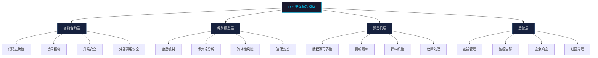
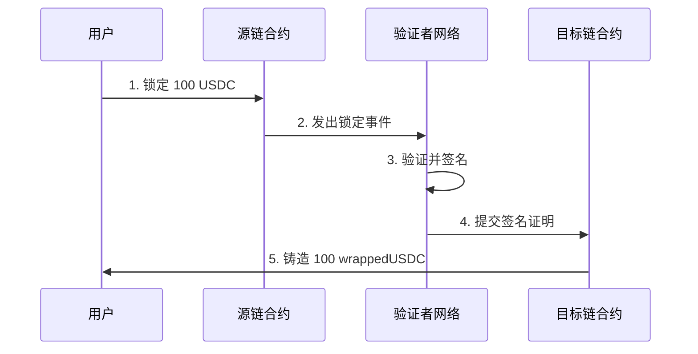

## 21.6 DeFi协议架构与安全模型

DeFi（Decentralized Finance）是构建在区块链之上的开放式金融基础设施，截至2025年，DeFi协议的总锁仓量（TVL）超过1500亿美元。然而，DeFi也是安全事件最高发的领域——仅2023年，DeFi协议因漏洞造成的损失就超过10亿美元。理解DeFi协议的架构分层和安全模型，是进行区块链安全研究的基础能力。

本节从协议分类、安全层次模型、核心机制深度解析、跨链桥架构、真实攻击案例分析五个维度，系统性地构建DeFi安全知识体系。

### 21.6.1 DeFi协议分类与安全特征

DeFi协议按功能可分为五大类，每类具有不同的架构设计和攻击面。

#### 借贷协议（Lending Protocols）

借贷协议是DeFi的基石，允许用户存入资产赚取利息，或抵押资产借出其他代币。

**代表项目与机制差异：**

| 协议 | 链 | 特点 | 抵押模式 | 清算机制 |
|------|------|------|----------|----------|
| Aave V3 | 多链 | 隔离模式、高效模式、跨链借贷 | 超额抵押 | 闪电清算 |
| Compound V3 | 以太坊 | Comet架构、单一基础资产 | 超额抵押 | 渐进式清算 |
| MakerDAO | 以太坊 | 多抵押DAI、去中心化稳定币 | 超额抵押 | 拍卖清算 |
| Venus | BNB Chain | Fork自Compound，集成稳定币 | 超额抵押 | 即时清算 |

**核心安全机制——清算（Liquidation）：**

当借款人的抵押品价值低于维持保证金（Maintenance Margin）时，任何人可以触发清算，替借款人偿还部分或全部债务，并获得抵押品折扣作为奖励。

```text
清算触发条件：
  health_factor = (抵押品价值 × 清算阈值) / 借款价值
  当 health_factor < 1.0 时，头寸可被清算

示例（Aave V3）：
  用户存入 10 ETH（价值 $30,000），清算阈值 80%
  借出 $20,000 USDC
  health_factor = 30000 × 0.8 / 20000 = 1.2（安全）
  
  若 ETH 价格跌至 $2,200：
  health_factor = 22000 × 0.8 / 20000 = 0.88（可清算）
  清算人偿还部分债务，获得 ETH 抵押品 + 5% 奖励
```

**借贷协议典型攻击面：**

1. **价格预言机操纵**：攻击者通过操纵预言机价格，使正常头寸被错误清算，或使不健康头寸看起来健康
2. **闪电贷攻击**：利用无抵押借贷在单笔交易内完成价格操纵、借贷、还款的闭环攻击
3. **利率模型操控**：通过大量存入或借出操纵利率，影响其他用户
4. **治理攻击**：通过获取治理代币投票权，修改关键参数（如添加低质量抵押品）

#### 去中心化交易所（DEX）

DEX允许用户无需中介即可交换代币，核心机制是自动做市商（AMM）。

**AMM数学模型：**

```text
恒定乘积公式（Uniswap V2）：
  x × y = k
  其中 x、y 分别为池中两种代币的储备量，k 为常数

价格计算：
  价格 = y / x（以代币A计价的代币B价格）

滑点计算：
  输入 Δx，获得 Δy = y - k/(x + Δx) = y·Δx/(x + Δx)
  有效价格 = Δy/Δx
  滑点 = 1 - 有效价格/市场价格

集中流动性（Uniswap V3）：
  流动性提供者在 [P_a, P_b] 价格范围内提供流动性
  资本效率提升最高4000倍
  但增加了主动管理的复杂度
```

**DEX安全威胁：**

**三明治攻击（Sandwich Attack）**是最常见的DEX攻击模式：

```text
攻击流程：
1. 攻击者监控内存池（mempool）中的大额交易
2. 在目标交易之前插入一笔买入交易（frontrun）
3. 目标交易执行，推高价格
4. 攻击者在目标交易之后卖出（backrun）
5. 攻击者获利 = 价差收益 - Gas成本

防御措施：
- 使用私有交易池（Flashbots Protect）
- 设置合理的滑点容忍度（通常0.5%-1%）
- 使用聚合器（1inch、Paraswap）的最优路由
- 使用意图协议（UniswapX、CoW Swap）
```

**MEV（Maximal Extractable Value）**是指验证者或搜索者通过交易排序、插入、审查获得的利润。MEV对DeFi安全的影响包括：

- **套利（Arbitrage）**：利用不同池子间的价格差异获利，这是良性MEV
- **清算提取**：监控链上头寸，在触发清算时第一时间执行
- **时间强盗攻击（Time-Bandit Attack）**：验证者重组区块以提取历史MEV，威胁共识安全

#### 衍生品协议（Derivatives）

衍生品协议提供合成资产、永续合约、期权等金融工具。

**永续合约核心机制：**

```text
资金费率（Funding Rate）：
  作用：使永续合约价格锚定现货价格
  计算：funding_rate = clamp(溢价指数 - 指数价格, -上限, +上限)
  
  当永续价格 > 现货价格：多头付给空头（负激励，吸引做空）
  当永续价格 < 现货价格：空头付给多头（正激励，吸引做多）

强制平仓：
  当保证金率 < 维持保证金率时触发
  保证金率 = (账户权益 + 未实现盈亏) / 持仓价值
```

**衍生品协议安全关注点：**

1. **预言机延迟**：价格更新不及时导致错误清算或套利机会
2. **清算引擎**：大额仓位清算时的级联效应，可能引发市场崩盘
3. **流动性枯竭**：极端行情下流动性提供者撤出，导致滑点剧增
4. **资金费率操纵**：攻击者通过操纵现货价格影响资金费率

#### 稳定币（Stablecoins）

稳定币是DeFi的流动性基础，按机制分为三类：

| 类型 | 代表 | 机制 | 优势 | 风险 |
|------|------|------|------|------|
| 法币抵押 | USDC、USDT | 1:1美元储备 | 简单稳定 | 中心化、审查风险 |
| 加密超额抵押 | DAI、LUSD | 超额抵押加密资产 | 去中心化 | 清算风险、资本效率低 |
| 算法稳定币 | UST（已崩盘）、FRAX | 算法调节供给 | 资本效率高 | 死亡螺旋风险 |

**UST崩盘案例分析：**

```text
UST-LUNA 死亡螺旋（2022年5月）：

1. UST脱锚：UST价格从$1.00跌至$0.98
2. 套利机制启动：用户可以1 UST兑换$1的LUNA → 卖出LUNA
3. LUNA增发：大量LUNA被铸造，供给急剧膨胀
4. LUNA价格下跌：抛压导致LUNA价格暴跌
5. 螺旋加速：UST抵押品（LUNA）价值下降 → 更多人赎回 → 更多LUNA增发
6. 死亡螺旋：LUNA从$80跌至$0.0001，UST跌至$0.10

损失：约400亿美元市值蒸发
教训：算法稳定币需要足够的外部抵押品或强大的套利激励
```

#### 收益聚合器（Yield Aggregators）

收益聚合器自动将用户资金分配到收益最高的策略中。

**Yearn V3 策略架构：**

```solidity
// 策略接口简化示意
interface IStrategy {
    function deposit() external;          // 存入资金
    function withdraw(uint amount) external; // 提取资金
    function harvest() external;          // 收割收益并复投
    function emergencyWithdraw() external; // 紧急提取
}

// 安全关注点：
// 1. harvest() 中的重入风险
// 2. 策略与底层协议的兼容性
// 3. 滑点保护：harvest 中的大额交易是否设置滑点限制
// 4. 策略迁移时的资产安全
```

**收益聚合器安全关注点：**

1. **策略漏洞**：自定义策略中的逻辑错误可能导致资金损失
2. **底层风险传导**：底层协议被攻击时，策略中的资金也会受损
3. **权限滥用**：策略管理者（Strategist）是否有过大的权限
4. **紧急退出**：Black Swan事件时，策略能否快速安全地撤出资金

### 21.6.2 DeFi安全层次模型

DeFi协议的安全性可以从四个层次进行分析，每个层次都有独立的威胁模型和防御策略。



#### 智能合约层

智能合约层是DeFi安全的基础，涵盖所有链上代码相关的风险。

**代码正确性**：
- 重入攻击：在状态更新之前进行外部调用，攻击者通过回调函数重复执行关键逻辑
- 整数溢出/下溢：Solidity 0.8+已内置检查，但unchecked块中仍需注意
- 逻辑漏洞：业务逻辑设计缺陷，如精度丢失、边界条件未处理

**访问控制**：
- 角色分离：Owner、Admin、Operator等角色是否合理分离
- 权限过大：单一地址拥有修改所有参数的能力
- Timelock：关键操作是否有时间锁，给社区反应时间

**升级安全**：
- 代理模式（Proxy Pattern）：UUPS vs Transparent Proxy的取舍
- 存储冲突：升级时新版本的存储布局是否与旧版本兼容
- 初始化函数：是否正确使用`initializer`修饰符防止重复初始化

**外部调用安全**：
- 不信任的返回值：ERC20的`transfer`和`approve`返回值不统一
- 回调风险：与外部合约交互时的回调利用
- 接口兼容性：不同版本ERC标准的差异

#### 经济模型层

经济模型层关注的是即使代码无漏洞，经济激励是否可能被利用。

**激励机制分析**：
- 代币分发是否过度集中
- 流动性挖矿激励是否可持续
- 代币释放曲线是否合理

**博弈论分析**：
- 理性行为者在各种场景下的最优策略
- 是否存在"破坏性获利"的场景
- 多方博弈中的纳什均衡

**流动性风险**：
- 银行挤兑（Bank Run）：当大量用户同时提取资金时的应对能力
- 流动性碎片化：跨链部署导致的流动性分散
- 极端行情：市场暴跌时清算链式反应

**治理安全**：
- 投票权集中度：前N个地址是否持有超过50%的投票权
- 闪电贷治理攻击：利用闪电贷获取临时投票权
- 提案审查：恶意提案是否能通过技术审查

#### 预言机层

预言机是连接链上和链下世界的桥梁，也是DeFi最脆弱的环节之一。

**预言机类型对比：**

| 类型 | 代表 | 优势 | 劣势 | 适用场景 |
|------|------|------|------|----------|
| 链下聚合 | Chainlink | 去中心化、多源数据 | 成本高、延迟 | 价格馈送 |
| TWAP | Uniswap V3 | 无需信任、链上原生 | 可被操纵、延迟 | DEX内部 |
| 链下推送 | Pyth Network | 低延迟、高频更新 | 依赖发布者 | 衍生品 |
| 预言机网络 | API3 | 第一方数据 | 生态较小 | 专用场景 |

**TWAP（时间加权平均价格）操纵：**

```solidity
// TWAP 计算原理
// 在 Uniswap V3 中，累积价格存储在 oracle 观察数组中
// TWAP = (priceCumulative[t2] - priceCumulative[t1]) / (t2 - t1)

// 攻击场景：
// 1. 攻击者使用大量资金在短时间内大幅改变池价格
// 2. 如果 TWAP 窗口设置过短（如几分钟），攻击者可以在窗口内操纵价格
// 3. 利用操纵后的 TWAP 在其他协议中获利

// 防御措施：
// - 使用较长的 TWAP 窗口（30分钟+）
// - 结合多个预言机源
// - 设置价格偏差阈值，超过则暂停操作
```

#### 运营层

运营层涵盖链下和链上管理相关的安全问题。

**密钥管理**：
- 多签钱包（Multi-sig）：Gnosis Safe是主流方案，建议至少3/5配置
- Timelock：关键操作执行前的延迟期
- 密钥轮换：定期更换签名者

**监控告警**：
- 实时监控大额交易和异常模式
- 使用Forta、OpenZeppelin Defender等工具
- 建立分级告警和响应流程

**应急响应**：
- Pauser角色：紧急暂停合约的能力
- 资金迁移：紧急情况下将资金转移到安全地址
- 事件响应计划：明确的角色和沟通流程

### 21.6.3 核心机制深度解析

#### 闪电贷（Flash Loan）

闪电贷是DeFi最具创新性的原语之一，允许用户在单笔交易内借入任意数量的资金，只要在同一交易结束前归还即可。

```solidity
// 闪电贷接口（Aave V3）
interface IFlashLoanReceiver {
    function executeOperation(
        address[] calldata assets,      // 借入的资产地址
        uint256[] calldata amounts,     // 借入的数量
        uint256[] calldata premiums,    // 手续费
        address initiator,              // 发起者
        bytes calldata params           // 自定义参数
    ) external returns (bool);
}

// 闪电贷攻击模式：
// 1. 借入大量资金（通常数百万美元）
// 2. 用借入资金操纵目标协议的价格预言机
// 3. 利用被操纵的价格在目标协议中获利
// 4. 归还闪电贷 + 手续费
// 5. 攻击者净利润 = 获利 - 手续费（通常0.09%）

// 典型闪电贷攻击案例：bZx（2020年2月）
// - 攻击者借入 10,000 ETH
// - 用 5,500 ETH 做空 ETH（通过 Compound）
// - 用 1,300 ETH 在 Uniswap 大量买入 ETH，推高价格
// - Compound 上的空头仓位获利
// - 归还闪电贷，净赚约 1,300 ETH（约 $350,000）
```

**闪电贷防御策略：**

1. **使用TWAP而非即时价格**：闪电贷只能操纵单笔交易内的即时价格
2. **多区块价格验证**：要求关键操作在多个区块中确认价格
3. **借贷限制**：限制单笔借贷的最大金额
4. **检查交易来源**：验证调用者是否为EOA而非合约

#### 清算机制

清算是借贷协议的生命线，确保协议不会积累坏账。

**清算模式对比：**

| 模式 | 协议 | 机制 | 优势 | 劣势 |
|------|------|------|------|------|
| 即时清算 | Compound | 清算人直接获得抵押品折扣 | 简单高效 | 大额清算时滑点大 |
| 拍卖清算 | MakerDAO | 荷兰拍或英式拍出售抵押品 | 价格发现 | 复杂、gas高 |
| 渐进式清算 | Aave V3 | 部分清算，逐步降低风险 | 减少冲击 | 清算效率较低 |
| 社会化清算 | Liquity | 稳定池吸收坏账 | 资本效率高 | 依赖稳定池深度 |

**清算级联风险：**

```text
级联清算场景：
1. ETH 价格突然下跌 20%
2. 大量接近清算线的头寸被触发清算
3. 清算人抛售获得的 ETH 抵押品，进一步压低价格
4. 更多头寸被触发清算（级联效应）
5. 如果流动性不足，价格可能进一步暴跌
6. 协议可能积累坏账（抵押品无法完全覆盖债务）

历史案例：2020年3月12日「黑色星期四」
- ETH价格在24小时内下跌50%
- MakerDAO清算人利用0 DAI起拍的漏洞，以接近0的价格获得抵押品
- 损失约800万美元
- 后续改进：引入清算罚款、最低起拍价
```

#### 治理攻击

治理攻击是经济模型层最常见的攻击向量之一。

**治理攻击模式：**

1. **闪电贷治理攻击**：
```text
   攻击步骤：
   1. 闪电贷借入大量治理代币
   2. 对恶意提案投票
   3. 提案通过并执行
   4. 归还闪电贷
   
   防御：使用快照机制，只计算提案创建时的持仓
   ```

2. **长期渗透攻击**：
```text
   攻击步骤：
   1. 长期积累治理代币（通过市场购买或流动性挖矿）
   2. 逐步建立信任（参与正常治理投票）
   3. 提交恶意提案（如添加低质量抵押品）
   4. 利用其他投票者的信任和惰性通过提案
   
   防御：Timelock + 多签确认 + 社区监督
   ```

### 21.6.4 跨链桥架构与安全

跨链桥是连接不同区块链的关键基础设施，也是安全事件的高发区域。2022年跨链桥攻击损失超过20亿美元。

#### 跨链桥架构模式

**锁定-铸造模式（Lock-and-Mint）**：



- **安全依赖**：锁定合约的不可变性、验证者网络的诚实多数假设
- **代表项目**：Wormhole、Ronin Bridge、Polygon Bridge
- **风险点**：验证者密钥泄露、签名验证逻辑漏洞

**燃烧-铸造模式（Burn-and-Mint）**：

- 用户在源链燃烧代币，在目标链铸造等量代币
- 需要可靠的跨链消息传递机制
- **代表项目**：LayerZero、Axelar、Wormhole
- **优势**：不需要维护锁定资金池，减少资金集中风险

**流动性池模式（Liquidity Pool）**：

- 在两条链上各维护一个流动性池
- 用户在源链存入资产，从目标链的池中提取
- **代表项目**：Thorchain、Synapse Protocol、Stargate
- **风险点**：流动性枯竭、池资产不平衡、LP代币定价

**原子交换（Atomic Swap）**：

```solidity
// 哈希时间锁合约（HTLC）原理
// 1. Alice 生成秘密 S，计算 H = hash(S)
// 2. Alice 在链A锁定资产，条件：提供 S 或超时后 Alice 可取回
// 3. Bob 看到 Alice 的锁定，用同样的 H 在链B锁定资产
// 4. Alice 在链B用 S 取走 Bob 的资产（S 因此在链上公开）
// 5. Bob 用公开的 S 在链A取走 Alice 的资产

// 安全性：双方都不需要信任对方
// 局限性：需要双方在线、流动性差、不支持复杂操作
```

#### 跨链桥安全事件案例

**Wormhole攻击（2022年2月，$3.26亿）**：

```text
攻击过程：
1. 攻击者发现 Wormhole 的 Solana 端合约中缺少对 guardian 
   签名的验证
2. 攻击者构造了一个伪造的跨链消息，声称已经在以太坊端
   锁定了 120,000 ETH
3. 由于签名验证漏洞，Solana 端合约接受了伪造的消息
4. 攻击者在 Solana 端铸造了 120,000 wETH
5. 攻击者将 wETH 兑换为 SOL 和 USDC

根因：合约升级时引入的签名验证绕过漏洞
损失：120,000 ETH（约 $3.26 亿）
```

**Ronin Bridge攻击（2022年3月，$6.24亿）**：

```text
攻击过程：
1. 攻击者通过社会工程学获取了 Ronin 验证者节点的私钥
2. Ronin 网络只有 9 个验证者，需要 5 个签名确认
3. 攻击者控制了 5 个验证者的私钥
4. 攻击者伪造了合法的提款请求
5. 由于签名数量满足要求，资金被转移

根因：验证者数量过少、私钥管理不善、缺乏异常监控
损失：173,600 ETH + 25.5M USDC（约 $6.24 亿）
```

**Nomad Bridge攻击（2022年8月，$1.9亿）**：

```text
攻击过程：
1. Nomad 合约升级时，将初始化的根哈希设为 0x00
2. 这意味着任何消息都可以被验证为合法
3. 第一个攻击者发现了这个漏洞并成功提取资金
4. 其他攻击者复制了相同的交易（只修改地址）
5. 几百个地址参与了"群体抢劫"

根因：合约升级流程缺乏审计、初始化参数错误
损失：约 $1.9 亿
```

#### 跨链桥安全最佳实践

1. **验证机制**：使用去中心化的验证者网络，避免单点故障
2. **密钥管理**：使用HSM或MPC（多方计算）保护验证者密钥
3. **监控告警**：实时监控大额跨链交易和异常模式
4. **渐进式限制**：新桥先设置低限额，逐步提升
5. **保险基金**：预留资金应对潜在的安全事件
6. **代码审计**：至少两个独立审计团队交叉审计
7. **Bug Bounty**：提供有吸引力的漏洞赏金计划

### 21.6.5 DeFi攻击模式与防御策略

#### 常见攻击模式总结

| 攻击类型 | 目标层 | 复杂度 | 潜在损失 | 防御难度 |
|----------|--------|--------|----------|----------|
| 重入攻击 | 合约层 | 低 | 高 | 低 |
| 闪电贷攻击 | 经济层 | 中 | 极高 | 中 |
| 预言机操纵 | 预言机层 | 中 | 极高 | 中 |
| 三明治攻击 | 经济层 | 低 | 中 | 中 |
| 治理攻击 | 经济层 | 高 | 极高 | 高 |
| 跨链桥攻击 | 合约层 | 高 | 极高 | 高 |
| 闪电贷治理 | 经济层 | 中 | 高 | 低 |
| 密钥泄露 | 运营层 | 低 | 极高 | 中 |

#### DeFi安全审计检查清单

```text
智能合约层：
□ 使用 Checks-Effects-Interactions 模式
□ 所有外部调用后检查返回值
□ 使用 ReentrancyGuard 保护关键函数
□ 整数运算使用 SafeMath 或 Solidity 0.8+
□ 访问控制使用 role-based 权限
□ 升级合约前进行存储布局验证
□ 使用 timelock 保护关键操作
□ 事件日志覆盖所有关键状态变更

经济模型层：
□ 模拟极端市场条件下的协议行为
□ 验证清算机制在极端行情下的有效性
□ 分析代币经济模型的长期可持续性
□ 检查治理机制的抗攻击能力
□ 验证流动性激励的合理性

预言机层：
□ 使用去中心化预言机（如 Chainlink）
□ 设置合理的价格偏差阈值
□ 使用 TWAP 而非即时价格
□ 多预言机源交叉验证
□ 预言机故障时的应急机制

运营层：
□ 多签钱包管理关键权限
□ 实时监控异常交易
□ 建立应急响应流程
□ 定期进行安全演练
□ Bug Bounty 计划覆盖所有合约
```

#### DeFi安全工具

| 工具 | 类型 | 功能 | 适用场景 |
|------|------|------|----------|
| Slither | 静态分析 | 检测常见漏洞模式 | 开发阶段 |
| Mythril | 符号执行 | 深度漏洞检测 | 审计阶段 |
| Echidna | 模糊测试 | 属性测试 | 测试阶段 |
| Foundry | 开发框架 | fuzz + invariant 测试 | 全阶段 |
| Tenderly | 监控平台 | 交易模拟和监控 | 运营阶段 |
| Forta | 威胁检测 | 实时异常告警 | 运营阶段 |
| OpenZeppelin Defender | 安全平台 | 自动化安全操作 | 运营阶段 |
| Rekt | 事件追踪 | 攻击案例库 | 学习研究 |

### 21.6.6 进阶：DeFi可组合性风险

DeFi的"金钱乐高"（Money Legos）特性使得协议之间可以无许可地组合，但也引入了独特的风险——**可组合性风险（Composability Risk）**。

**风险传导路径**：

```text
协议A（借贷） ← 用户抵押品
    ↓
协议B（收益聚合） ← 策略存入协议A的aToken
    ↓
协议C（稳定币） ← 用协议B的LP代币作为抵押品
    ↓
协议D（衍生品） ← 用协议C的稳定币作为保证金

当协议A出现安全事件时：
→ 协议B的策略无法提取资金
→ 协议C的抵押品价值归零
→ 协议D的保证金不足
→ 级联清算和坏账
```

**可组合性风险管理**：

1. **依赖图分析**：绘制协议依赖图，识别关键路径和单点故障
2. **压力测试**：模拟底层协议故障时的传导效应
3. **隔离机制**：使用隔离模式限制风险传导范围
4. **保险覆盖**：对关键依赖购买协议保险
5. **实时监控**：监控依赖协议的安全事件和状态变化

**DeFi安全研究者的思维框架**：

```text
1. 理解协议的目标和机制（What & Why）
2. 识别信任假设和攻击面（Where）
3. 分析经济激励和博弈关系（Who & How）
4. 寻找机制设计缺陷和边界条件（When）
5. 构造攻击场景和PoC（Proof of Concept）
6. 评估防御措施的有效性（Defense）
```

DeFi安全是一个快速演进的领域，攻击手段和防御策略都在不断进化。安全研究者需要持续跟踪最新的攻击事件、审计报告和安全工具，同时深入理解底层的经济模型和博弈论原理，才能在这个领域保持竞争力。
