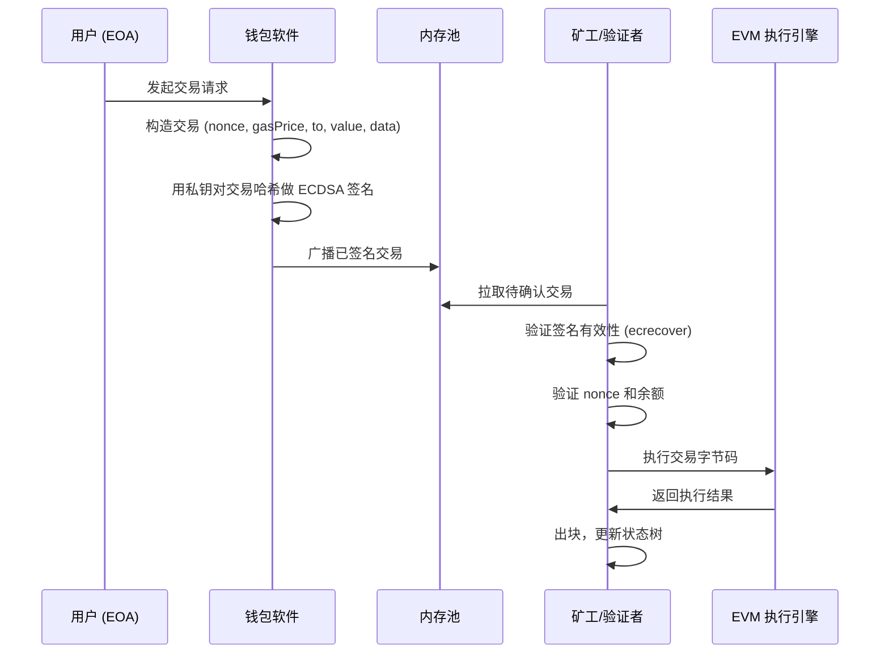
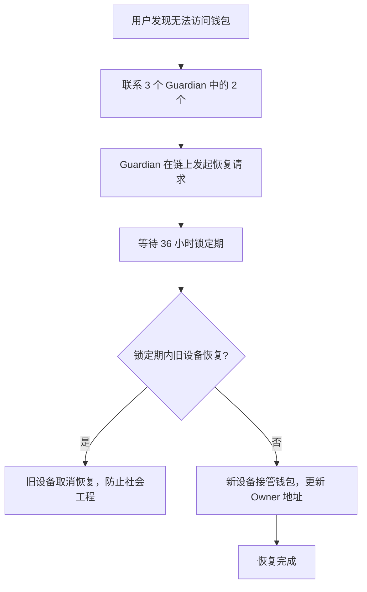
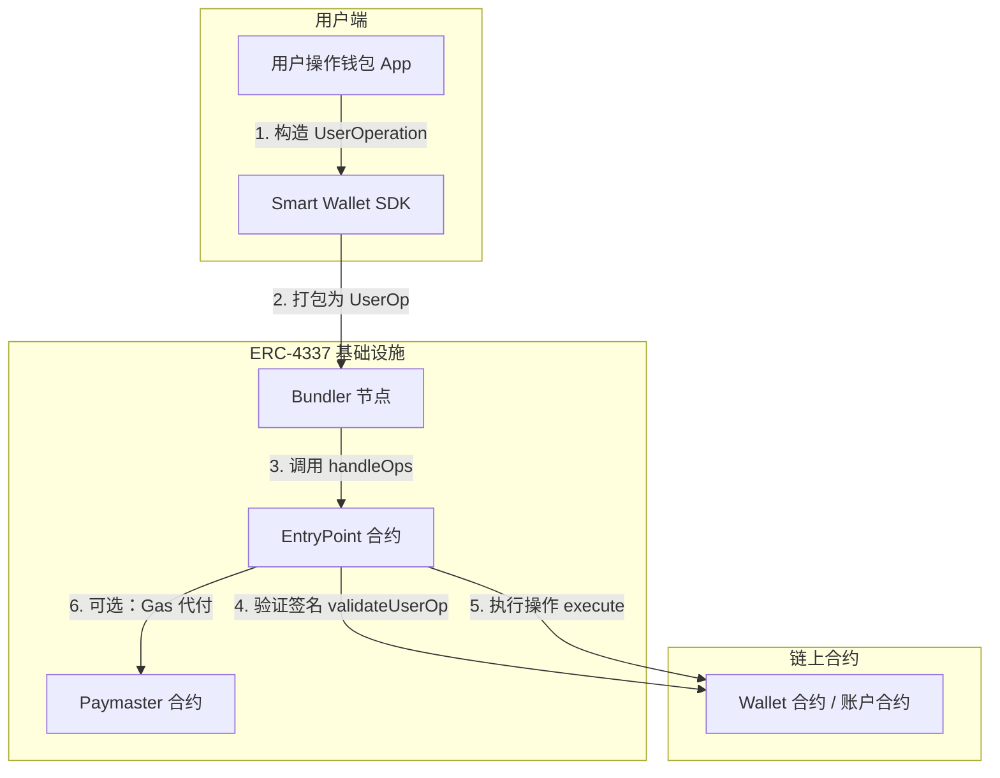
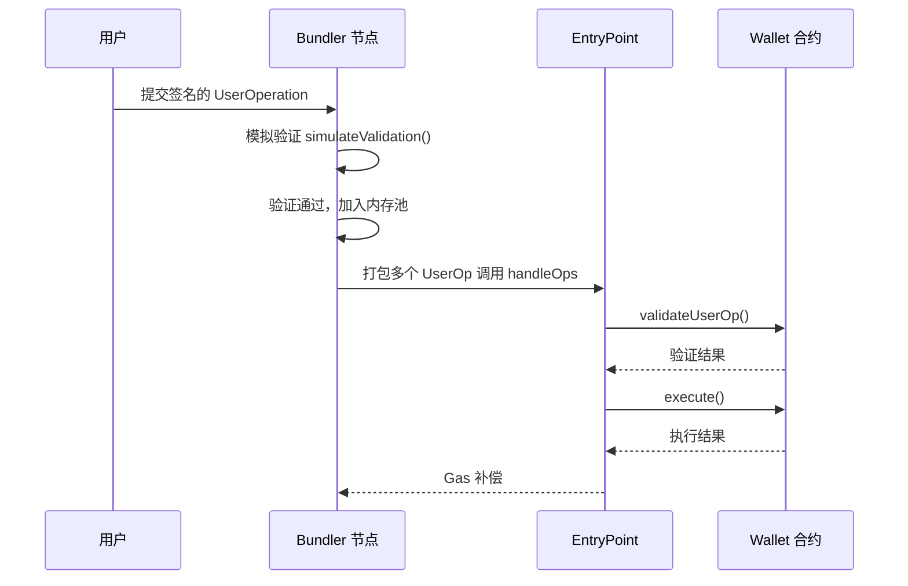
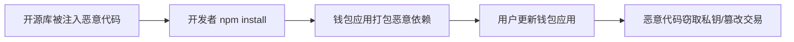
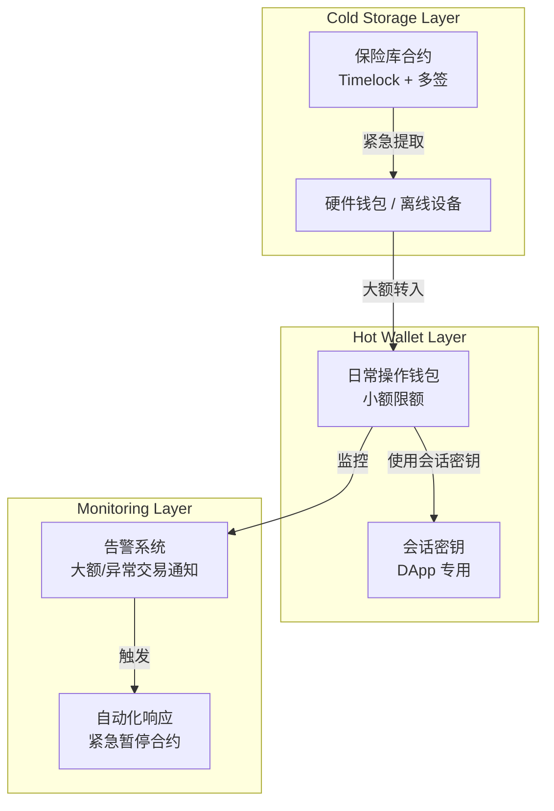
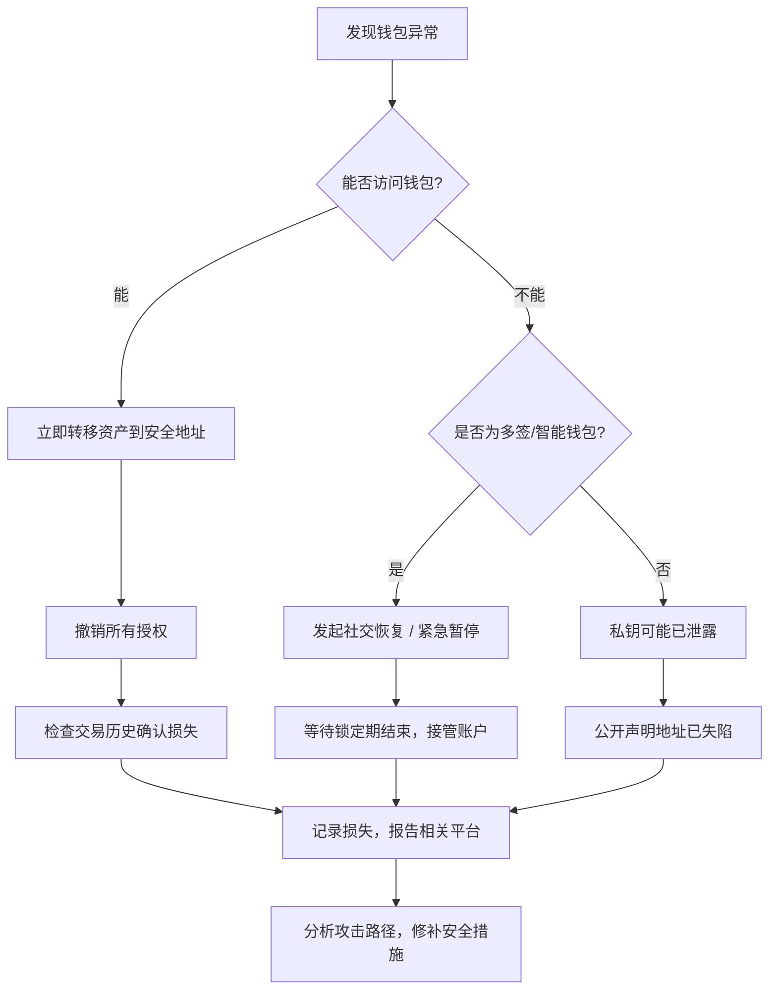

## 21.7 账户抽象与钱包安全

以太坊的钱包安全体系经历了三代演化：第一代是纯 EOA（私钥即账户），第二代是智能合约钱包（Gnosis Safe、Argent），第三代是账户抽象（Account Abstraction）。每一代都在前一代的基础上解决了特定的安全痛点——EOA 无法实现多签和恢复、合约钱包无法被协议层原生支持、账户抽象则通过标准化将可编程安全策略推向协议层。

本节从以太坊账户模型的底层原理出发，系统讲解钱包安全的完整知识体系：账户类型与安全模型、ERC-4337 账户抽象协议细节、常见攻击手法与真实案例、防御策略与工程实践，以及钱包生态的前沿发展。

### 21.7.1 以太坊账户模型基础

#### 账户类型：EOA 与合约账户

以太坊有两种账户类型，它们在代码层面有本质区别：

```solidity
// 以太坊状态数据库中的账户结构（Go-Ethereum 源码简化）
type Account struct {
    Nonce    uint64      // 交易计数器
    Balance  *big.Int    // ETH 余额
    Root     common.Hash // 状态树根（仅合约账户有值）
    CodeHash common.ByteHash // 代码哈希（EOA 为空）
}
```

| 属性 | 外部拥有账户（EOA） | 合约账户 |
|------|-------------------|---------|
| 私钥 | 有，由 secp256k1 生成 | 无，由合约代码控制 |
| 发起交易 | 可以主动发起 | 只能被动响应调用 |
| Gas 支付 | 用自己的 ETH 支付 | 无法直接支付（被调用时消耗调用方 Gas） |
| 验证逻辑 | 固定为 ECDSA 签名验证 | 任意自定义逻辑（`receive` / `fallback`） |
| 可升级性 | 不可升级 | 通过代理模式可升级 |
| Nonce 机制 | 全局单一线性递增 | 每个调用者独立维护 |

EOA 的交易验证逻辑硬编码在以太坊协议层，流程固定为：检查签名 → 验证 nonce → 扣除 Gas → 执行交易。这意味着所有 EOA 共享同一套安全模型，无法定制。

#### 交易生命周期



这个流程暴露了 EOA 的核心安全约束——签名验证是协议层唯一认可的方式，私钥丢失或泄露等同于账户永久失陷。这就是账户抽象要解决的根本问题。

### 21.7.2 钱包类型与安全模型

#### 热钱包（Hot Wallet）

热钱包指私钥存储在联网设备上的软件钱包，随时可签名交易。

**安全模型**：私钥暴露于操作系统和网络环境，攻击面包括浏览器扩展漏洞、恶意 JavaScript、操作系统后门、内存读取攻击。热钱包的私钥通常存储在以下位置之一：

| 存储方式 | 代表产品 | 安全等级 | 风险 |
|---------|---------|---------|------|
| 浏览器 localStorage/IndexedDB | 早期 MetaMask 版本 | 低 | 任何浏览器扩展可读取 |
| 浏览器加密存储 | MetaMask（当前版本） | 中 | 主密码被暴力破解或钓鱼 |
| 操作系统 Keychain | Trust Wallet Mobile | 中高 | Root/Jailbreak 设备可读取 |
| 安全芯片（TEE/SE） | 系统级钱包（如苹果 Wallet） | 高 | 硬件攻击成本极高 |

**MetaMask 密钥存储结构**（旧版 Vault 格式）：

```json
{
  "data": "加密后的密钥数据（AES-256-GCM）",
  "iv": "初始化向量",
  "salt": "密钥派生盐",
  "lib": "原始加密库标识"
}
```

加密使用用户的主密码，通过 PBKDF2 或 scrypt 派生 AES 密钥。暴力破解的门槛取决于密码强度——8 位纯数字密码在现代 GPU 上几秒即可破解。

#### 硬件钱包（Hardware Wallet）

硬件钱包的核心设计目标是「私钥永不离开安全芯片」。

**Ledger Nano 签名流程**：
1. 主机端构造未签名交易，通过 USB 发送到硬件设备
2. 硬件设备在安全芯片内解析交易内容并展示给用户
3. 用户在设备上物理确认（按下物理按钮）
4. 安全芯片内的私钥对交易哈希签名
5. 签名结果通过 USB 返回主机，主机组装已签名交易并广播

**关键安全特性**：
- 私钥由安全芯片（SE）保护，即使 USB 通信被拦截也无法提取私钥
- 物理确认机制防止远程攻击（但不防止物理攻击）
- 固件签名验证防止固件篡改

**已知攻击面**：
- 供应链攻击：设备在物流环节被替换为恶意设备（可验证包装完整性）
- 固件漏洞：2018 年 Ledger 固件被发现可通过侧信道攻击提取私钥（已修复）
- 物理攻击：对安全芯片进行故障注入（Voltage Glitching），需要专业设备和物理接触
- 主机端攻击：主机端恶意软件替换交易数据，修改目标地址和金额（Ledger 的「What You See Is What You Sign」机制试图缓解此问题）

#### 多签钱包（Multi-Signature Wallet）

多签钱包通过 M-of-N 签名机制分散信任——N 个私钥持有者中至少 M 个同意才能执行交易。

```solidity
// 简化版多签钱包核心逻辑
contract MultiSigWallet {
    address[] public owners;
    mapping(address => bool) public isOwner;
    uint public required; // 最少签名数

    struct Transaction {
        address to;
        uint value;
        bytes data;
        bool executed;
        uint confirmCount;
    }

    mapping(uint => mapping(address => bool)) public confirmations;

    function confirmTransaction(uint txId) public {
        require(isOwner[msg.sender], "not owner");
        require(!confirmations[txId][msg.sender], "already confirmed");

        confirmations[txId][msg.sender] = true;
        transactions[txId].confirmCount++;

        if (transactions[txId].confirmCount >= required) {
            executeTransaction(txId);
        }
    }

    function executeTransaction(uint txId) internal {
        Transaction storage txn = transactions[txId];
        require(txn.confirmCount >= required, "insufficient confirmations");
        txn.executed = true;
        (bool success, ) = txn.to.call{value: txn.value}(txn.data);
        require(success, "execution failed");
    }
}
```

**Gnosis Safe 的设计进化**：

| 版本 | 特性 | 安全改进 |
|------|------|---------|
| v1.0 | 基础多签 | 基本 M-of-N |
| v1.1 | 委托调用 | 支持模块化 |
| v1.2 | EIP-1271 签名验证 | 合约签名标准化 |
| v1.3 | EIP-712 结构化签名 | 防止签名重放 |
| v1.4 | Safe{Core} 协议 | 账户抽象兼容 |
| v1.5 | Safe{Core} AA | 原生支持 ERC-4337 |

**多签的安全假设与局限**：
- 假设 M 个密钥不会同时失陷——如果 M-1 个密钥被同一攻击者控制（社会工程），安全模型崩溃
- 链上多签交易的 Gas 成本随签名数线性增长
- 密钥轮换需要发起链上交易，存在窗口期风险
- 多签本身不防钓鱼——如果用户在恶意网站上确认了多签交易，需要 M 个人都确认才会执行，这实际上是一个保护机制

#### 智能合约钱包（Smart Contract Wallet）

智能合约钱包将账户逻辑完全用 Solidity 实现，支持任意复杂的验证和执行逻辑：

```solidity
// 智能合约钱包核心接口
interface ISmartWallet {
    function execute(address dest, uint value, bytes calldata func) external;
    function executeBatch(address[] calldata dests, bytes[] calldata funcs) external;
    function addOwner(address owner) external;
    function removeOwner(address owner) external;
    function changeThreshold(uint threshold) external;
    function addModule(address module) external;
    function enableModule(address module) external;
}
```

**Argent 钱包的社交恢复机制**：

Argent 的设计哲学是「不用助记词」。它的账户恢复流程如下：



锁定期是关键的安全设计——如果攻击者通过社会工程控制了 Guardian，真正的用户有 36 小时发现并取消恢复。这个时间窗口的安全性取决于用户是否能及时发现问题。

### 21.7.3 账户抽象深度解析（ERC-4337）

#### 背景：为什么需要账户抽象

以太坊协议层的 EOA 验证逻辑存在三个根本性限制：

1. **签名算法固定**：只支持 secp256k1 ECDSA，无法支持 BLS、Ed25519、量子安全签名
2. **验证逻辑固定**：只能验证签名和 nonce，无法实现多签、生物识别、设备绑定
3. **交易原子性**：一笔交易只能执行一个操作，无法批量操作

以太坊社区曾多次尝试通过协议层修改来解决（EIP-86、EIP-2938），但协议层修改需要硬分叉，风险大且周期长。ERC-4337 的创新在于完全在应用层（智能合约）实现账户抽象，不需要修改以太坊协议本身。

#### ERC-4337 协议架构



#### UserOperation 数据结构

UserOperation 是账户抽象的核心数据结构，替代了传统的交易格式：

```solidity
struct UserOperation {
    // 发送者智能钱包地址
    address sender;
    // 用于重放保护的随机数
    uint256 nonce;
    // 发送者调用 initCode 的编码数据（仅在第一次部署时非空）
    bytes initCode;
    // 发送者调用 calldata 的编码数据
    bytes callData;
    // 执行操作所需的 Gas 上限
    uint256 callGasLimit;
    // 验证操作所需的 Gas 上限
    uint256 verificationGasLimit;
    // 用于预验证的 Gas 上限
    uint256 preVerificationGas;
    // 发送者愿意为 Gas 支付的最大金额
    uint256 maxFeePerGas;
    // 发送者愿意支付给验证器的金额
    uint256 maxPriorityFeePerGas;
    // 用于签名验证的数据（ABI 编码后的签名）
    bytes paymasterAndData;
    // 由发送者签名的数据
    bytes signature;
}
```

**UserOperation 与传统交易的关键差异**：

| 属性 | 传统交易 | UserOperation |
|------|---------|--------------|
| 签名字段 | v, r, s（ECDSA 固定格式） | `signature` bytes（任意格式） |
| Gas 支付 | 必须由发送者支付 | 可由 Paymaster 代付 |
| 批量操作 | 不支持 | `callData` 可编码多个调用 |
| 初始化 | 账户独立部署 | `initCode` 实现部署+使用一步完成 |
| 验证逻辑 | 协议层固定 ECDSA | 账户合约自定义 `validateUserOp` |

#### EntryPoint 合约

EntryPoint 是整个 ERC-4337 体系的核心单例合约，负责协调所有账户的操作验证和执行：

```solidity
// EntryPoint 核心流程简化
contract EntryPoint {
    function handleOps(UserOperation[] calldata ops, address beneficiary) public {
        // 第一阶段：验证
        for (uint i = 0; i < ops.length; i++) {
            UserOperation calldata op = ops[i];

            // 1. 如果 sender 未部署，通过 initCode 部署
            if (op.initCode.length > 0) {
                _deployAccount(op.sender, op.initCode);
            }

            // 2. 调用账户合约的 validateUserOp
            uint256 validationGas = _callValidateOp(op);

            // 3. 如果有 Paymaster，调用 validatePaymasterUserOp
            if (op.paymasterAndData.length > 0) {
                _validatePaymaster(op);
            }
        }

        // 第二阶段：执行
        for (uint i = 0; i < ops.length; i++) {
            _executeOp(ops[i]);
        }

        // 第三阶段：Gas 结算
        for (uint i = 0; i < ops.length; i++) {
            _compensate(beneficiary, ops[i]);
        }
    }
}
```

**两阶段设计的安全考量**：

EntryPoint 将「验证」和「执行」严格分离，这是账户抽象安全模型的核心。验证阶段的约束包括：
- 验证函数不能读取其他账户的存储（防止交叉依赖攻击）
- 验证函数不能调用除 EntryPoint 和预编译合约以外的地址
- 验证阶段的 Gas 消耗必须在 `verificationGasLimit` 以内

这些约束防止了验证阶段的重入攻击和状态污染。

#### Bundler 节点

Bundler 是 ERC-4337 基础设施中的关键角色，相当于传统交易中矿工的角色：



**Bundler 收益模型**：
- Bundler 自己支付 `handleOps` 调用的 Gas
- 通过 UserOperation 中的 `maxFeePerGas` 和 `maxPriorityFeePerGas` 获得补偿
- 从每个 UserOperation 中赚取 Gas 差价（类似 MEV）
- 如果验证失败，Bundler 承担 Gas 损失——这激励 Bundler 只打包验证通过的 UserOp

**Bundler 市场现状**（截至 2025 年）：
- Stackup（开源 Bundler 实现）
- Alchemy（托管 Bundler 服务）
- Pimlico（Bundler + Paymaster 服务）
- eth-infinitism（参考实现）

#### Paymaster 机制

Paymaster 允许第三方代付 Gas，是账户抽象最灵活的特性之一：

```solidity
contract MyPaymaster is BasePaymaster {
    mapping(address => bool) public whitelistedTokens;

    function validatePaymasterUserOp(
        UserOperation calldata userOp,
        bytes32 userOpHash,
        uint256 maxCost
    ) external returns (bytes memory context, uint256 validationData) {
        // 验证：UserOp 的 callData 是否涉及白名单代币的转账
        bytes4 selector = bytes4(userOp.callData[:4]);
        if (selector == IERC20.transfer.selector) {
            address token = decodeTransferToken(userOp.callData);
            require(whitelistedTokens[token], "token not whitelisted");
            // Paymaster 愿意为此 UserOp 支付 Gas
            return (abi.encode(userOp.sender), VALIDATION_SUCCESS);
        }
        // 不愿意代付
        revert("unsupported operation");
    }

    function postOp(
        PostOpMode mode,
        bytes calldata context,
        uint256 actualGasCost
    ) external override {
        // 从用户账户扣除 Gas 费用（以代币形式）
        address sender = abi.decode(context, (address));
        _collectFee(sender, actualGasCost);
    }
}
```

**Paymaster 的商业模式**：
- DApp 开发者为用户代付 Gas（onboarding 引导）
- 用 ERC-20 代币支付 Gas（用户用 USDC 支付 Gas 而非 ETH）
- 订阅制 Paymaster（用户按月付费，不限次数）
- 广告商 Paymaster（看广告换 Gas）

### 21.7.4 常见钱包安全攻击手法

#### 私钥泄露攻击

**1. 钓鱼攻击（Phishing）**

钓鱼是钱包安全中最常见、损失最大的攻击类型。攻击手法从简单的假网站进化到了高度复杂的社会工程：

**案例：2022 年 Bored Ape Yacht Club Discord 钓鱼**

2022 年 4 月，BAYC 的 Discord 社区管理员的 Discord 账户被盗，攻击者利用管理员权限发布公告，诱导用户点击恶意链接。钓鱼页面要求用户连接钱包并签署交易，实际是一个 `setApprovalForAll` 调用，将用户 NFT 的全部授权转移给攻击者。

```text
受害者看到的界面："领取免费 BAYC 空投"
实际签名的交易数据：
Function: setApprovalForAll(address operator, bool approved)
- operator: 0x079E...（攻击者控制的合约）
- approved: true

结果：受害者钱包中所有 NFT 被授权给攻击者
```

**案例：2023 年 Inferno Drainer 钓鱼工具包**

Inferno Drainer 是一个专业的钓鱼即服务（Phishing-as-a-Service）平台：
- 攻击者购买服务后获得钓鱼网站模板和自动化工具
- 支持 600+ 种代币和 NFT 的自动窃取
- 通过 EIP-712 签名诱导用户签署恶意授权
- 总窃取金额超过 8000 万美元

**技术分析——EIP-712 签名钓鱼**：

```solidity
// EIP-712 结构化签名数据
{
    types: {
        Permit: [
            { name: "owner",   type: "address" },
            { name: "spender", type: "address" },
            { name: "value",   type: "uint256" },
            { name: "nonce",   type: "uint256" },
            { name: "deadline", type: "uint256" }
        ]
    },
    primaryType: "Permit",
    domain: {
        name: "USD Coin",
        chainId: 1,
        verifyingContract: "0xA0b86991c6218b36c1d19D4a2e9Eb0cE3606eB48"
    },
    message: {
        owner: "受害者地址",
        spender: "攻击者地址",
        value: "115792089237316195423570985008687907853269984665640564039457584007913129639935",
        nonce: 0,
        deadline: 1999999999
    }
}
```

用户看到的是一个标准的 MetaMask 签名弹窗，显示的是结构化的域名、代币名称和授权金额。很多用户不会仔细阅读就直接确认。

**2. 剪贴板劫持（Clipboard Hijacking）**

恶意软件监控系统剪贴板，当检测到用户复制了加密地址时，替换为攻击者的地址。由于地址是 42 个字符的十六进制字符串，用户很难肉眼辨别是否被替换。

**防御方式**：
- 粘贴后逐字符比对地址的前 4 位和后 4 位
- 使用 ENS 域名（如 `vitalik.eth`）代替裸地址
- 硬件钱包显示完整地址，用户在设备上比对

**3. 供应链攻击**



**案例：2023 年 Ledger Connect Kit 供应链攻击**

Ledger 的 Connect Kit（一个用于 DApp 连接 Ledger 硬件钱包的 JavaScript 库）的 npm 发布权限被攻击者获取。攻击者发布了一个包含恶意代码的版本，该恶意代码会替换所有交易的目标地址为攻击者地址。影响了使用 Connect Kit 的数十个 DApp。

#### 交易签名攻击

**1. 签名重放攻击**

```solidity
// 签名重放攻击场景
// 攻击者收集用户在 A 链上签署的授权签名
// 然后在 B 链上重放同一签名

// ERC-20 Permit 签名包含以下字段：
struct Permit {
    address owner;
    address spender;
    uint256 value;
    uint256 nonce;
    uint256 deadline;
}

// 如果代币合约没有正确处理 chainId（使用 EIP-712 的 domain separator），
// 或者如果用户签署了没有 deadline 的授权，
// 攻击者可以在任何时间、任何链上重放这个签名
```

**防御**：ERC-2612 Permit 标准通过 EIP-712 的 domain separator 绑定 chainId 和合约地址，从协议层面防止跨链重放。但旧版本的 Permit 实现可能缺少这些字段。

**2. Permit2 签名钓鱼**

Uniswap 的 Permit2 是一个通用的代币授权合约，它引入了更灵活的签名格式，但也带来了新的攻击面：

```solidity
// Permit2 的 SignatureTransfer 结构
struct SignatureTransferDetails {
    address to;          // 接收地址
    uint256 requestedAmount; // 转账金额
}

struct PermitBatchTransferFrom {
    TokenPermissions[] permitted;
    uint256 nonce;
    uint256 deadline;
}

struct TokenPermissions {
    address token;
    uint256 amount;
}
```

攻击者诱导用户签署 Permit2 的 `SignatureTransfer` 签名，授权攻击者在截止日期前随时转移指定数量的代币。与传统的 `approve` 不同，Permit2 签名是链下操作，不会出现在链上交易历史中，更难被发现。

**3. 盲签攻击**

某些 DApp 要求用户签署不透明的数据（如哈希值），用户无法理解签名的实际含义：

```text
// MetaMask 显示的信息：
Message: 0x6f726967696e616c... (随机哈希)

// 用户无法知道这个签名实际授权了什么操作
```

**EIP-712 的解决方案**：要求签名数据以结构化的、人类可读的格式展示。但只有当 DApp 和钱包都支持 EIP-712 时才有效。

#### 智能合约漏洞攻击

**1. 无限授权滥用**

```solidity
// 危险的无限授权操作
IERC20(token).approve(
    untrustedContract,
    type(uint256).max  // 授权最大值：2^256 - 1
);

// 一旦被授权的合约存在后门或被升级为恶意版本，
// 攻击者可以在任意时间转走用户的所有该代币余额
// 而且用户不会收到任何通知（无需额外交易）
```

**真实案例：WETH Permit + 无限授权组合攻击**

2023 年，多个 DeFi 协议的用户遭受了此类攻击：用户此前对某些合约设置了无限授权，这些合约被发现存在漏洞或被恶意升级。攻击者利用这些授权，分批转移了用户钱包中的全部代币余额。

**2. 重入攻击对钱包的影响**

```solidity
// 受重入攻击影响的钱包实现
contract VulnerableWallet {
    mapping(address => uint) public balances;

    function withdraw() public {
        uint bal = balances[msg.sender];
        require(bal > 0);

        // 危险：先发送 ETH，再更新状态
        (bool success, ) = msg.sender.call{value: bal}("");
        require(success);

        balances[msg.sender] = 0; // 攻击者可以在收到 ETH 后再次调用 withdraw
    }
}

// 攻击合约
contract Attacker {
    VulnerableWallet wallet;

    function attack() public {
        wallet.withdraw();
    }

    // receive 函数在收到 ETH 时被调用
    receive() external payable {
        if (address(wallet).balance >= 1 ether) {
            wallet.withdraw(); // 重入：余额还未清零，再次提取
        }
    }
}
```

### 21.7.5 账户抽象的安全优势与实现

#### 原子化批量操作

账户抽象允许将多个操作打包在一笔 UserOperation 中，消除中间状态：

```solidity
// 智能钱包的批量操作实现
contract SmartWallet {
    function executeBatch(
        address[] calldata dests,
        bytes[] calldata funcs
    ) external onlyEntryPoint {
        require(dests.length == funcs.length, "length mismatch");
        for (uint i = 0; i < dests.length; i++) {
            (bool success, bytes memory result) = dests[i].call(funcs[i]);
            if (!success) {
                assembly { revert(add(result, 32), mload(result)) }
            }
        }
    }
}

// 实际用例：将 DeFi 交互中的 3 步操作合并为 1 步
// 传统 EOA：1. approve(1笔交易) → 2. swap(1笔交易) → 3. stake(1笔交易)
// 账户抽象：1. approve + swap + stake(1笔 UserOperation)
```

安全优势：传统多步操作中，每一步之间都有时间窗口，攻击者可以在 approve 完成但 swap 尚未执行时，利用已授权的额度进行三明治攻击（sandwich attack）。原子化批量操作消除了这些时间窗口。

#### 社交恢复机制

```solidity
contract SocialRecoveryWallet {
    address[] public guardians;
    uint public guardianThreshold;
    address public owner;
    uint public recoveryLockTime = 36 hours;

    struct RecoveryRequest {
        address newOwner;
        uint confirmCount;
        mapping(address => bool) confirmed;
        uint startTimestamp;
    }

    RecoveryRequest public currentRecovery;

    // Guardian 发起恢复
    function initiateRecovery(address newOwner) external onlyGuardian {
        require(currentRecovery.startTimestamp == 0, "recovery already active");
        currentRecovery = RecoveryRequest({
            newOwner: newOwner,
            confirmCount: 1,
            startTimestamp: block.timestamp
        });
        currentRecovery.confirmed[msg.sender] = true;
    }

    // 其他 Guardian 确认
    function confirmRecovery() external onlyGuardian {
        require(currentRecovery.startTimestamp > 0, "no active recovery");
        require(!currentRecovery.confirmed[msg.sender], "already confirmed");
        currentRecovery.confirmed[msg.sender] = true;
        currentRecovery.confirmCount++;
    }

    // 达到阈值后，等待锁定期结束再执行
    function executeRecovery() external {
        require(currentRecovery.confirmCount >= guardianThreshold, "insufficient confirmations");
        require(
            block.timestamp >= currentRecovery.startTimestamp + recoveryLockTime,
            "still in lock period"
        );

        owner = currentRecovery.newOwner;
        delete currentRecovery;
    }

    // 原 Owner 可在锁定期取消恢复（防止 Guardian 被社会工程攻击）
    function cancelRecovery() external onlyOwner {
        delete currentRecovery;
    }
}
```

**社交恢复的安全分析**：

| 攻击向量 | 防御机制 | 局限性 |
|---------|---------|-------|
| Guardian 被社会工程 | 36 小时锁定期 | 用户必须在 36 小时内发现问题 |
| Guardian 串通 | M-of-N 阈值要求 | 增加 Guardian 数量可降低风险 |
| 攻击者替换 Guardian | 添加/删除 Guardian 需要 Owner 签名 | Owner 本身被控制则无法防御 |
| 恢复发起与执行同一笔交易 | 强制锁定期 | 恢急使用场景（如 Owner 私钥确认泄露）不方便 |

#### 会话密钥（Session Keys）

会话密钥是账户抽象的一项创新特性，允许用户为特定应用创建受限的临时密钥：

```solidity
contract SessionKeyWallet {
    struct SessionKey {
        address key;           // 会话密钥地址
        address target;        // 允许交互的目标合约
        bytes4 selector;       // 允许调用的函数选择器
        uint256 maxValue;      // 单次最大转账金额
        uint256 maxUses;       // 最大使用次数
        uint256 validAfter;    // 生效时间
        uint256 validUntil;    // 失效时间
        uint256 uses;          // 已使用次数
    }

    mapping(bytes32 => SessionKey) public sessionKeys;

    function validateSessionKey(
        bytes32 sessionId,
        address target,
        bytes calldata data
    ) internal returns (bool) {
        SessionKey storage sk = sessionKeys[sessionId];
        require(block.timestamp >= sk.validAfter, "not yet valid");
        require(block.timestamp <= sk.validUntil, "expired");
        require(sk.uses < sk.maxUses, "usage limit exceeded");
        require(target == sk.target, "wrong target");
        require(bytes4(data[:4]) == sk.selector, "wrong function");

        sk.uses++;
        return true;
    }
}
```

**应用场景**：区块链游戏需要频繁发起小额交易，如果每笔都需要主私钥签名，用户体验极差。会话密钥允许游戏在一定时间窗口内、在一定的限额内自动签名交易，无需用户每次确认。

**安全边界**：
- 会话密钥只能调用指定的合约和函数
- 有单次金额上限和总使用次数上限
- 有过期时间，过期自动失效
- 即使会话密钥被泄露，攻击面也被严格限制在上述范围内

#### 多因素认证（MFA）钱包

```solidity
// MFA 钱包验证逻辑
contract MFAWallet {
    enum AuthFactor {
        Password,      // 知识因素
        Biometric,     // 生物特征因素
        HardwareKey,   // 持有因素
        DeviceBound    // 设备因素
    }

    function validateUserOp(
        UserOperation calldata userOp,
        bytes32 userOpHash
    ) external returns (uint256 validationData) {
        // 解析签名，提取各因素的验证数据
        MFASignature memory sig = abi.decode(userOp.signature, (MFASignature));

        // 验证至少满足 2 个因素
        uint8 factorsVerified = 0;
        if (_verifyPassword(sig.passwordSig, userOpHash)) factorsVerified++;
        if (_verifyBiometric(sig.biometricSig, userOpHash)) factorsVerified++;
        if (_verifyHardwareKey(sig.hardwareSig, userOpHash)) factorsVerified++;

        require(factorsVerified >= 2, "insufficient auth factors");

        // 根据风险等级动态调整因素数量
        if (_isHighRisk(userOp)) {
            require(factorsVerified >= 3, "high risk requires 3 factors");
        }

        return VALIDATION_SUCCESS;
    }

    function _isHighRisk(UserOperation calldata userOp) internal view returns (bool) {
        // 大额转账、新地址交互、非白名单合约调用视为高风险
        return _decodeTransferValue(userOp.callData) > HIGH_VALUE_THRESHOLD;
    }
}
```

### 21.7.6 授权管理安全

#### ERC-20 Approve 机制的安全问题

```solidity
// 标准 ERC-20 approve 的安全问题
function approve(address spender, uint256 amount) external returns (bool) {
    _allowances[msg.sender][spender] = amount; // 直接覆盖旧值
    return true;
}

// 经典的 approve 前端攻击：
// 1. 用户已授权 100 tokens 给合约 A
// 2. 用户想将授权改为 200
// 3. 用户发起 approve(A, 200) 交易
// 4. 在交易上链前，攻击者监控到这笔交易
// 5. 攻击者利用旧授权(100)转走用户的代币
// 6. 用户的 approve(A, 200) 交易确认后，攻击者再转走剩余的 100
// 结果：攻击者转走了 200 tokens，而非用户预期的 200
```

**安全的 Approve 模式**：

```solidity
// 先将授权设为 0，再设为目标值
function safeApprove(address spender, uint256 amount) external returns (bool) {
    _approve(msg.sender, spender, 0);  // 先清零
    _approve(msg.sender, spender, amount); // 再设置
    return true;
}

// 或使用 increaseAllowance / decreaseAllowance
function increaseAllowance(address spender, uint256 addedValue) external returns (bool) {
    _approve(
        msg.sender,
        spender,
        _allowances[msg.sender][spender] + addedValue
    );
    return true;
}
```

#### 授权监控与撤销

```bash
# 使用 ethers.js 查询用户对所有合约的授权
npx hardhat run scripts/check-allowances.js --network mainnet

# 使用 revoke.cash 网页工具（支持多链）
# https://revoke.cash

# 使用 approval-eth 工具行查询
npx approval-eth --address 0xYourAddress --network ethereum
```

**授权审计自动化**：

```javascript
// 使用 viem 查询授权状态
import { createPublicClient, http, parseAbi } from 'viem';
import { mainnet } from 'viem/chains';

async function checkAllowances(ownerAddress, tokenAddresses) {
    const client = createPublicClient({ chain: mainnet, transport: http() });

    const erc20Abi = parseAbi([
        'function allowance(address owner, address spender) view returns (uint256)'
    ]);

    for (const token of tokenAddresses) {
        // 查询该代币对所有 spender 的授权（需要知道 spender 地址）
        // 实际使用中，通过事件日志来追踪
        const logs = await client.getLogs({
            address: token,
            event: {
                type: 'event',
                name: 'Approval',
                inputs: [
                    { type: 'address', name: 'owner', indexed: true },
                    { type: 'address', name: 'spender', indexed: true },
                    { type: 'uint256', name: 'value', indexed: false }
                ]
            },
            fromBlock: 'earliest',
            args: { owner: ownerAddress }
        });

        for (const log of logs) {
            const currentAllowance = await client.readContract({
                address: token,
                abi: erc20Abi,
                functionName: 'allowance',
                args: [ownerAddress, log.args.spender]
            });

            if (currentAllowance > 0n) {
                console.log(`Token: ${token}, Spender: ${log.args.spender}, Allowance: ${currentAllowance}`);
            }
        }
    }
}
```

#### Permit2 的安全管理

```solidity
// 推荐使用 Permit2 的 SignatureTransfer（一次性签名）而非 PermitAllowance（持久授权）
// SignatureTransfer：签名仅可使用一次，nonce 递增后失效
ISignatureTransfer(token).permitTransferFrom(
    ISignatureTransfer.PermitTransferFrom({
        permitted: ISignatureTransfer.TokenPermissions({
            token: tokenAddress,
            amount: exactAmount  // 使用精确金额，而非无限
        }),
        nonce: currentNonce,
        deadline: shortDeadline  // 使用较短的有效期
    }),
    ISignatureTransfer.SignatureTransferDetails({
        to: recipientAddress,
        requestedAmount: exactAmount
    }),
    ownerAddress,
    signature
);
```

### 21.7.7 钱包安全实战防御

#### 硬件钱包配置最佳实践

```text
Ledger/Trezor 安全配置清单：
1. 设置高强度 PIN 码（8 位以上，非生日等易猜数字）
2. 启用 Passphrase（隐藏钱包）
   - 每个 Passphrase 对应独立的钱包地址
   - 主 PIN 进入「诱饵钱包」（小额），Passphrase 进入真实钱包
3. 固件定期更新，验证更新来源（官方签名）
4. 助记词在离线环境备份，不存储在任何联网设备
5. 使用 25 个单词的助记词（24 + 1 Passphrase）
6. 禁用蓝牙（Ledger），仅使用 USB 连接
```

#### 多层安全架构



**推荐的钱包分配策略**：

| 用途 | 钱包类型 | 资产上限 | 安全措施 |
|------|---------|---------|---------|
| 长期存储（HODL） | 硬件钱包 + 冷存储 | 无上限 | 离线存储、多重备份 |
| 中期操作（DeFi） | 多签钱包 | $50K+ | 3-of-5 多签、Timelock |
| 日常交易 | 智能合约钱包 | $1K-$10K | 日限额、白名单合约 |
| DApp 交互 | 会话密钥 | $100 | 受限合约、受限金额 |
| 空投/测试 | 独立 EOA | $0（不存储资产） | 隔离地址、仅交互用 |

#### 交易签名审查清单

```text
签名前检查清单：
□ 确认 DApp 网站 URL 正确（检查域名拼写）
□ 确认钱包连接的是正确的网络（Chain ID）
□ 检查交易目标地址是否为你预期的合约地址
□ 检查函数调用的参数（金额、授权对象）
□ 如果是 EIP-712 签名，检查 domain separator 中的合约地址
□ 确认授权金额（避免无限授权，使用精确金额）
□ 检查交易截止日期是否合理（避免过长有效期）
□ 对大额操作使用硬件钱包确认
```

#### 紧急响应流程



### 21.7.8 前沿发展与未来方向

#### ERC-4337 的演进

**EIP-7702（EOA 代码设置）**：

以太坊 Pectra 升级引入的 EIP-7702 允许 EOA 设置临时的合约代码，使 EOA 可以在不部署为合约账户的情况下，获得账户抽象的部分能力（如批量操作、Gas 代付）。

```solidity
// EIP-7702 的核心机制
// EOA 签署一个特殊的委托交易，将其代码设置为指向某个实现合约
// 该 EOA 在后续交易中表现为一个合约账户

// 类型 4 交易结构
struct Authorization {
    uint256 chainId;
    address delegate;   // 委托的实现合约地址
    uint256 nonce;
    uint8 v;
    bytes32 r;
    bytes32 s;
}
```

这意味着所有现有 EOA 可以「升级」为智能钱包，而不需要迁移资产到新地址。这是账户抽象普及的重要里程碑。

**RIP-7560（原生账户抽象）**：

RIP-7560 提出了在 Layer 2 网络上实现协议层原生账户抽象的方案，将 UserOperation 验证直接嵌入区块生产流程，减少对独立 Bundler 的依赖。

#### 量子安全钱包

量子计算对当前 ECDSA 签名算法构成威胁。账户抽象允许钱包升级为后量子密码学签名：

```solidity
// 使用 CRYSTALS-Dilithium（后量子签名算法）的钱包验证逻辑
contract QuantumSafeWallet {
    function validateUserOp(
        UserOperation calldata userOp,
        bytes32 userOpHash
    ) external returns (uint256) {
        // 使用后量子签名算法验证
        bytes memory dilithiumPublicKey = getDilithiumPublicKey();
        bytes memory signature = userOp.signature;

        bool valid = CRYSTALSDilithium.verify(
            userOpHash,
            signature,
            dilithiumPublicKey
        );

        return valid ? VALIDATION_SUCCESS : VALIDATION_FAILURE;
    }
}
```

#### 智能钱包与 AI 代理

随着 AI 代理在区块链上的应用，智能钱包为 AI 代理提供了受控的执行环境：

- AI 代理持有会话密钥而非主私钥
- 会话密钥限定 AI 代理只能调用特定的 DeFi 协议
- 设置单次交易金额上限和总使用次数上限
- 主账户持有者可以随时撤销会话密钥

### 21.7.9 常见误区与纠正

| 误区 | 事实 | 纠正方法 |
|------|------|---------|
| 「硬件钱包绝对安全」 | 硬件钱包防远程攻击，但不防物理攻击和供应链攻击 | 验证设备完整性、设置 Passphrase、使用诱饵钱包 |
| 「多签一定比单签安全」 | 多签引入了更多密钥管理复杂性，每个密钥都是独立的攻击面 | 合理设置阈值、定期轮换密钥、密钥分地域存储 |
| 「撤销授权就安全了」 | 撤销授权只防止未来的授权滥用，已发生的恶意交易无法撤回 | 审查历史授权记录，使用监控工具持续跟踪 |
| 「ERC-4337 已经解决了所有问题」 | ERC-4337 是应用层方案，Bundler 单点故障、EntryPoint 漏洞等风险仍然存在 | 关注 EntryPoint 审计报告、使用多个 Bundler |
| 「社交恢复不需要备份」 | 如果所有 Guardian 同时不可用，恢复机制失效 | 至少保留一份助记词离线备份，Guardian 分散在不同社交圈 |
| 「会话密钥不会泄露」 | 会话密钥的私钥也存在被泄露的风险 | 限制会话密钥的权限范围、使用短有效期 |
| 「关闭浏览器就能防止签名钓鱼」 | 签名可以离线进行，攻击者可以收集签名后延迟提交 | 仔细阅读签名内容，设置短 deadline |
