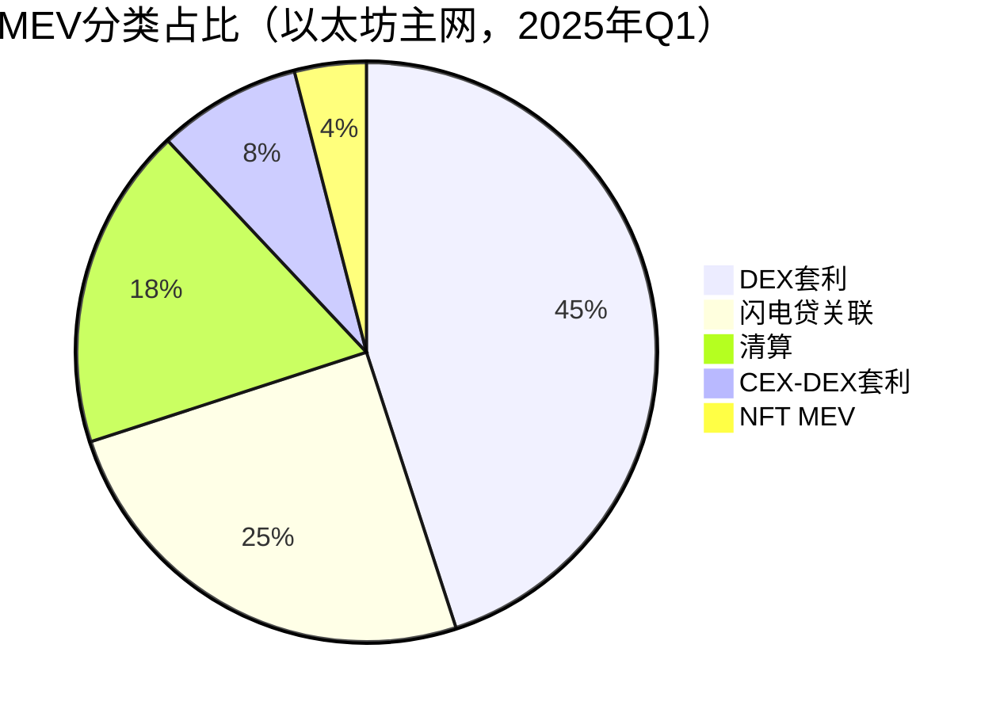
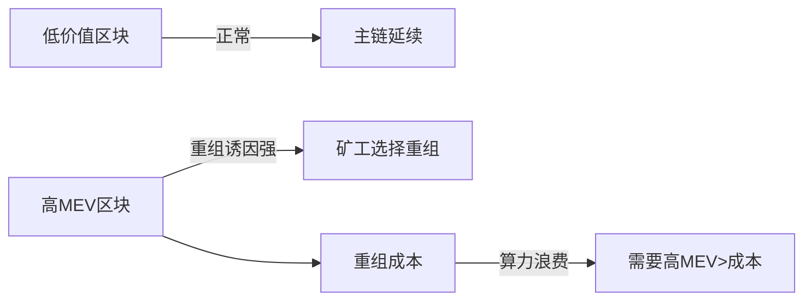
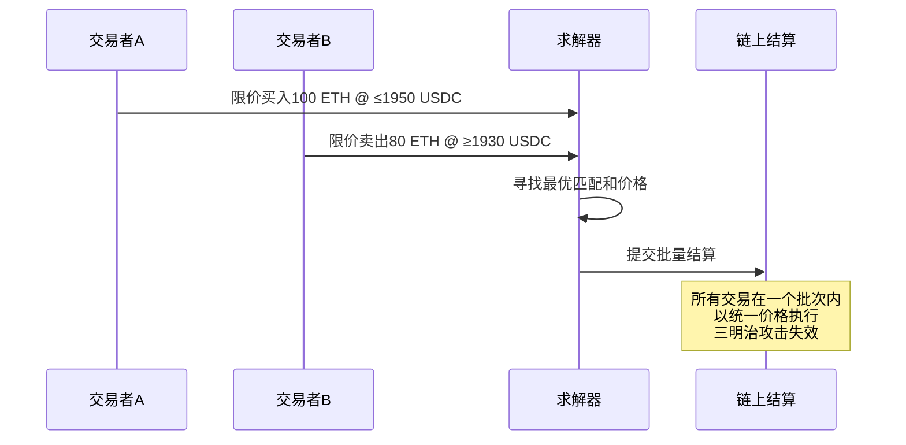

## 21.8 MEV（最大可提取价值）安全

### 21.8.1 MEV概述

#### 21.8.1.1 定义与起源

**MEV（Maximal Extractable Value，最大可提取价值）** 的概念最早由 **Philip Daian** 等人在 2019 年的论文《Flash Boys 2.0: Frontrunning, Transaction Reordering, and Consensus Instability in Decentralized Exchanges》中系统提出。原称为"矿工可提取价值"（Miner Extractable Value），随着以太坊转向 PoS（权益证明），学术界广泛改用"最大可提取价值"（Maximal Extractable Value），涵盖矿工和验证者。

> **核心定义**：MEV 是指区块提议者（Proposer）通过在区块中对交易进行**选择（Selection）**、**排序（Ordering）** 和**插入（Insertion）** 而能够提取的最大经济价值。

这个定义的关键在于：区块提议者拥有交易的**排序权**，而不同的排序方式会导致不同的经济结果。在一个区块中，同一组交易的不同顺序，可能产生数百万美元的价差。

#### 21.8.1.2 MEV的生态博弈

MEV 已经发展成一个庞大的产业链，涉及多个角色：

| 角色 | 定义 | 收益来源 | 技术门槛 |
|------|------|----------|----------|
| **搜索者（Searcher）** | 寻找 MEV 机会的机器人 | 执行套利、清算、三明治攻击 | 高（定量交易+区块链知识） |
| **构建者（Builder）** | 负责组装区块的实体 | 区块价值的分成 | 中高（MEV-Boost 基础设施） |
| **中继者（Relay）** | 连接构建者和验证者的中介 | 交易手续费 | 中 |
| **验证者/矿工（Validator/Miner）** | 最终确认区块的节点 | MEV 贿赂 + 区块奖励 | 中 |
| **用户（User）** | 提交交易到网络 | 被提取的价值（负收益） | 无 |

这个生态类似于传统金融市场的**做市商-交易所-清算所**结构，但在去中心化环境下更加透明和激烈。

#### 21.8.1.3 MEV的经济规模

根据 Flashbots 和 Dune Analytics 的数据统计：

- **累计提取 MEV（截至2025年）**：超过 7 亿美元（以太坊主网）
- **日均 MEV**：通常在 100-500 万美元之间波动
- **MEV-Boost 占比**：超过 90% 的以太坊验证者使用 MEV-Boost
- **最高单次 MEV**：超过 100 万美元（单笔三明治攻击）

这些数字说明 MEV 已经从学术概念演变为影响数十亿美元的产业。



---

### 21.8.2 MEV的底层经济学原理

理解 MEV 需要从区块链的经济机制设计出发。

#### 21.8.2.1 交易的"排序权"为什么值钱？

在传统金融中，订单的排序由交易所的撮合引擎决定（优先价格-时间优先）。但在区块链上，交易的最终顺序由区块提议者决定，这造成了**排序权溢价**。

假设三个用户分别想交易某代币：

| 交易 | 方向 | Gas价格 | 优先级 |
|------|------|---------|--------|
| Alice | 买入 100 ETH 的 Token X | 50 Gwei | 中 |
| Bob | 买入 50 ETH 的 Token X | 100 Gwei | 高 |
| Charlie | 卖出 Token X | 30 Gwei | 低 |

如果构建者将 Bob 排在 Alice 之前，Bob 以更低价格买入，然后 Alice 的买入推高价格——这就是排序权的经济价值。区块提议者可以将这个排序权通过 MEV-Boost 拍卖给出价最高的构建者。

#### 21.8.2.2 优先Gas拍卖（Priority Gas Auction, PGA）

当多个搜索者发现同一个 MEV 机会时，他们会通过提高 Gas 价格来竞争。这被称为**优先Gas拍卖**：

```text
场景：某 DEX 上出现套利机会（价差5%）

搜索者 A 提交 Gas=100 → 搜索者 B 提交 Gas=150
→ 搜索者 A 提交 Gas=200 → 搜索者 C 提交 Gas=250
→ ...最终 Gas 价格可能飙升到正常的 10倍以上
```

这种 Gas 战争导致两个后果：
1. **网络拥堵**——大量无效竞争交易占用区块空间
2. **利润蚕食**——套利利润被 Gas 费用消耗殆尽

Flashbots 的 **捆绑包（Bundle）** 机制就是为了解决 PGA 的低效问题——搜索者提交一个"支付给矿工/验证者"的贿赂价格，而不是通过 Gas 竞争。

---

### 21.8.3 MEV攻击类型详解

#### 21.8.3.1 三明治攻击（Sandwich Attack）

**原理**：
这是最常见的 MEV 攻击，占以太坊 MEV 总量的 30-40%。攻击者将受害者的交易"夹在"自己的两笔交易之间。

**完整执行流程**：
1. **监控阶段**：搜索者监听公共内存池（Public Mempool），寻找大额 DEX 交易
2. **前端交易（Front-run）**：在受害者交易之前，攻击者提交一笔买入交易（使用更高的 Gas 价格确保优先执行）
3. **受害者交易执行**：受害者的买入/卖出被执行，导致价格朝不利方向滑动
4. **后端交易（Back-run）**：攻击者在受害者交易之后立即提交一笔反向交易获利

**代码示例**（概念性伪代码）：

```python
# 三明治攻击的核心逻辑（简化示意）
class SandwichBot:
    def __init__(self, dex_router, token_in, token_out):
        self.router = dex_router
        self.token_in = token_in
        self.token_out = token_out
    
    def detect_opportunity(self, victim_tx):
        """检测可三明治的交易"""
        # 条件1: 交易金额足够大（>阈值）
        if victim_tx.amount < 10 * 10**18:  # 10 ETH以下跳过
            return None
        # 条件2: 流动性池深度有限（滑点大）
        pool_depth = self.get_pool_depth()
        price_impact = victim_tx.amount / pool_depth
        if price_impact < 0.01:  # <1%价格影响跳过
            return None
        return {
            'victim': victim_tx,
            'expected_profit': self.calc_profit(pool_depth, victim_tx.amount)
        }
    
    def execute_sandwich(self, victim_tx):
        bundle = [
            self.build_buy_tx(victim_tx, gas_price=victim_tx.gas + 5),
            victim_tx,
            self.build_sell_tx(gas_price=victim_tx.gas - 2)
        ]
        return bundle
```

**实际案例**（2023年某真实攻击）：

| 参数 | 数值 |
|------|------|
| 受害者交易额 | 500 ETH（约 $950,000） |
| 攻击者前端买入 | 100 ETH |
| 价格滑点 | 从 $1.90 到 $2.05（+7.9%） |
| 攻击者利润 | ~2.3 ETH（约 $4,370） |
| 受害者额外损失 | 增加的滑点 $37,000+ |

**进阶：三明治攻击的变种**：

- **JIT 三明治（Just-In-Time Sandwich）**：攻击者不是在内存池中等待，而是通过 Flashbots 等私有通道在受害者交易到达前的一瞬间创建并提交自己的交易，更难被检测。
- **跨池三明治**：涉及多个 DEX 池的三明治攻击，利用不同池之间的价差获得更大利润。
- **多跳三明治**：通过多个代币对的中间桥接来模糊攻击轨迹。

**三明治攻击的约束条件**：
- 需要足够的流动性（否则无法有效推价）
- 需要较高的 Gas 竞价能力
- 在 AMM（自动做市商）中更有效（基于恒定乘积公式）
- 在订单簿 DEX 中较难执行

---

#### 21.8.3.2 清算抢跑（Liquidation Frontrunning）

**原理**：
在借贷协议（如 Aave、Compound）中，当用户的抵押品价值低于清算阈值时，任何人都可以触发清算并获得清算奖励。搜索者竞相成为"第一个"触发清算的人。

**清算MEV的博弈模型**：

```text
清算奖励 = 抵押品价值的 5-15%
清算者需要 支付债务 + 获取抵押品

真实案例（Compound USDC池）：
- 抵押品：1000 ETH（约 $1,900,000）
- 债务：600,000 USDC
- 清算阈值：80%
- ETH跌至 $750 → 抵押品价值 $750,000 < $800,000（80%×$1M）
- 触发清算
- 清算奖励：~5% = 约 $30,000
```

**搜索者的技术栈**：

```python
# 清算监控的核心组件
class LiquidationMonitor:
    def __init__(self, provider, protocol_contract):
        self.w3 = provider
        self.contract = protocol_contract
        
    def monitor_pools(self):
        """监控所有借贷池的健康因子"""
        while True:
            positions = self.get_all_positions()
            for pos in positions:
                # 健康因子 = 抵押品价值 / (债务价值 × 清算阈值)
                health = pos.collateral_value / (pos.debt_value * pos.liquidation_threshold)
                
                if health < 1.0:  # 可清算
                    # 计算预期利润
                    profit = pos.collateral_value * 0.05  # 5%奖励
                    gas_cost = self.estimate_gas()
                    
                    if profit > gas_cost:
                        self.submit_liquidation_tx(pos)
```

**清算抢跑的危害**：
1. 小额清算者被挤出市场（Gas 竞争导致）
2. 协议中大量抵押品集中到少数专业清算者手中
3. 在极端行情下，清算延迟可能导致坏账

---

#### 21.8.3.3 套利MEV（Arbitrage MEV）

**原理**：
同一代币在不同 DEX 上的价格差异为套利者提供无风险机会。

**典型套利路径**：

```text
Uniswap V3 (ETH/USDC)   价格: $1,900/ETH
Sushiswap (ETH/USDC)    价格: $1,915/ETH
                                   ↑ 价差 +0.79%

套利者执行：
1. 从 Uniswap 买入 ETH（$1,900）
2. 在 Sushiswap 卖出 ETH（$1,915）
3. 利润 = 0.79% - Gas费用 ≈ 0.5%

注：如果不包含三明治攻击，DEX 套利实际有助于市场——使各交易所价格趋于一致
```

**套利MEV的正面作用**：
套利 MEV 通常被认为是对市场**有益的**，因为它：
- 缩小了不同 DEX 之间的价差
- 提高了整体市场的价格发现效率
- 为流动性提供者创造了更一致的收益

**恶性套利 vs 良性套利的边界**：

| 维度 | 良性套利 | 恶性MEV |
|------|---------|---------|
| 对用户影响 | 无（或正面） | 增加滑点 |
| 对市场作用 | 价格统一 | 扭曲价格 |
| 典型形式 | DEX-CEX 套利 | 三明治、抢跑 |
| 社区态度 | 接受 | 抵制 |

---

#### 21.8.3.4 时间强盗攻击（Time-Bandit Attack）

**原理**：
在 PoW（工作量证明）链上，矿工发现某个历史区块包含高价值 MEV 时，可以选择**重组区块链**（即在一个更高的区块上"重新挖"包含该 MEV 交易的区块），从而窃取该 MEV。

**在 PoS 下的变化**：
以太坊 PoS 通过**最终性（Finality）** 机制大大降低了时间强盗攻击的风险——一旦一个 epoch 被最终确认，重组需要惩罚 1/3 以上的验证者（约 33% 的质押 ETH），成本极高。

**重组概率与 MEV 关系（PoW 时代）**：



---

#### 21.8.3.5 跨域 MEV（Cross-domain MEV）

随着 L2（Layer 2）和跨链桥的发展，MEV 已经从以太坊主网扩展到多链环境：

| 环境 | MEV形式 | 复杂度 |
|------|---------|--------|
| L2（Optimism/Arbitrum） | 排序器（Sequencer）MEV | 中 |
| Solana | 内存池可见性受限，MEV 较少 | 低 |
| Cosmos IBC | 跨链套利 | 高 |
| 跨链桥 | 桥接抢跑 | 很高 |

**L2 的特殊性**：大多数 L2 使用中心化或去中心化排序器，排序器有权自行提取 MEV，用户无法通过 Flashbots 等方案保护自己。

---

### 21.8.4 MEV的测量与监测

#### 21.8.4.1 常用工具

| 工具 | 类型 | 功能 | 链接 |
|------|------|------|------|
| **Flashbots Dashboard** | Dune 仪表盘 | 追踪实时 MEV | https://dune.com/flashbots |
| **eigenphi.io** | 专业分析平台 | 可视化 MEV 交易流 | https://eigenphi.io |
| **LibMEV** | 开源数据 | 研究级数据集 | https://github.com/flashbots/libmev |
| **MEV-Explore** | 浏览器 | Flashbots 官方探索器 | https://explore.flashbots.net |
| **MevWatch** | 实时监控 | 关键 MEV 事件通知 | https://mevwatch.info |

#### 21.8.4.2 关键指标

```text
MEV提取率 = 实际提取的MEV / 理论最大可提取MEV

误判率(FPR)= 被识别但非MEV的交易 / 所有被识别的交易

验证者MEV收益占比 = 验证者从MEV中获得收益 / 总区块奖励
```

以以太坊为例，后合并时代验证者的 MEV 收入占比通常在 **10-30%** 之间，高峰期可达 40% 以上。

---

### 21.8.5 MEV防护方案

#### 21.8.5.1 Flashbots 生态系统

Flashbots 是目前最成熟的 MEV 生态基础设施，由以下组件构成：

**Flashbots Bundle**：
搜索者将交易打包成"捆绑包"提交给验证者。验证者可以选择执行整个捆绑包或完全不执行——这保证了交易的原子性，防止部分执行导致搜索者亏损。

```json
{
  "bundle": [
    "tx1_encoded_hex",  // 前端买入
    "tx2_encoded_hex",  // 受害者交易
    "tx3_encoded_hex"   // 后端卖出
  ],
  "blockNumber": 18500000,
  "minTimestamp": 1699000000,
  "maxTimestamp": 1699000100,
  "revertingTxHashes": ["tx2_hash"]  // 如果tx2失败，整个bundle回滚
}
```

**Flashbots Protect**：
为用户提供免 MEV 的交易提交服务。用户发送交易到 Flashbots Protect RPC 端点，交易被保密发送到构建者，避免在公共内存池暴露。

- RPC 端点：`https://rpc.flashbots.net`
- 支持的链：以太坊主网、Sepolia 测试网
- 费用：免费（2025年）

**Flashbots MEV-Boost**：
MEV-Boost 是后合并时代以太坊的**核心基础设施**。它将验证者的区块构建权外包给专业的构建者，通过**提议者-构建者分离（PBS）** 机制运行。

```text
验证者 → MEV-Boost（中间件）→ 多个中继（Relay）→ 多个构建者（Builder）

流程：
1. 每个 slot（12秒），验证者通过 MEV-Boost 向多个中继请求区块
2. 中继将请求转发给其注册的构建者
3. 构建者提交完整的区块（包含支付给验证者的费用）
4. 验证者选择出价最高的区块并签署
5. 中继验证区块合法性后交给验证者广播
```

#### 21.8.5.2 私有内存池（Private Mempool）

除 Flashbots 外，还有其他私有交易通道：

| 方案 | 特点 | 费用模型 | 适用场景 |
|------|------|----------|----------|
| **Bloxroute** | 全球分布式私有网络 | 按月订阅 | 专业搜索者 |
| **Eden Network** | 基于代币的优先访问 | EDEN 质押 | DeFi 交易者 |
| **Manifold** | 去中心化 RPC 聚合 | 按交易收费 | 普通用户 |
| **SecureRPC** | 隐私优先 | 免费 | 小型协议 |

#### 21.8.5.3 公平排序协议（Fair Ordering Protocols）

**Chainlink FSS（Fair Sequencing Services）**：
Chainlink 提出的公平排序方案，旨在减少排序者的自由裁量权：

```text
FSS工作流程：
1. 用户提交交易到FSS网络
2. FSS节点通过基于时间的排序协议确定交易顺序
3. 排序结果提交给链上执行
4. 所有交易以确定性的顺序执行
```

**Shutter Network**：
使用阈值加密（Threshold Encryption）在区块被密封之前隐藏交易内容：

1. 交易内容在提交时被加密
2. 只有当区块被选中并提出后，加密密钥才被揭示
3. 排序者无法知道交易内容，因此无法进行抢跑

#### 21.8.5.4 批量拍卖机制（Batch Auctions）

**代表性协议**：

- **CoW Protocol**：使用批量拍卖 + 链下订单匹配
- **Gnosis Protocol v2**：通过求解器（Solver）竞争产生最优结果
- **0x Protocol**：RFQ（请求报价）模式

批量拍卖的核心机制：



**批量拍卖为什么能防御三明治**：
- 批次内所有交易在同一时间点、以同一价格执行
- 不存在"先执行 A 再执行 B"的排序优势
- 攻击者无法通过插入交易来影响价格

#### 21.8.5.5 对用户的关键建议

| 场景 | 建议方案 | 操作 |
|------|---------|------|
| 普通 DEX 交易 | 使用 Flashbots Protect | 钱包设置 RPC 为 rpc.flashbots.net |
| 大额交易（>10 ETH） | 使用 CoW Swap 或 1inch | 选择"MEV保护"模式 |
| 清算交易 | 使用私有通道 | Bloxroute 或 Flashbots |
| L2 交易 | 检查排序器 MEV 政策 | 选择反抢跑的排序器 |
| NFT 铸造 | 使用 Protect RPC | 防止被机器人在前面抢铸 |

---

### 21.8.6 MEV在不同链上的表现

#### 21.8.6.1 以太坊（PoS时代）

- MEV-Boost 渗透率 > 90%
- 主要攻击形式：三明治攻击、清算抢跑
- 日均 MEV：$1-5M
- 核心防护：Flashbots 全家桶

#### 21.8.6.2 Solana

Solana 的架构与以太坊有本质区别：

| 特性 | 以太坊 | Solana |
|------|--------|--------|
| 内存池 | 公共内存池（交易可见） | 无公共内存池 |
| 排序机制 | Gas拍卖 | 权益加权排序 |
| MEV 规模 | 巨大 | 相对较小 |
| 主要 MEV | 三明治/套利 | 夹击（Jito）|

Solana 上 **Jito Labs** 提供类似 Flashbots 的 MEV 基础设施。

#### 21.8.6.3 L2（Arbitrum / Optimism）

L2 的排序器（Sequencer）拥有更大的权力：

- 排序器可以自主选择交易顺序
- 用户没有公共内存池的保护
- 部分 L2 承诺"无 MEV"排序策略（但难以验证）
- **去中心化排序器** 是解决 L2 MEV 问题的关键方向

---

### 21.8.7 MEV的未来演进

#### 21.8.7.1 提议者-构建者分离（PBS）的正式化

当前 MEV-Boost 是一个可选组件，但以太坊路线图计划将 PBS 原生化（ePBS）：

- **当前状态**：MEV-Boost 是中间件，信任中继
- **目标状态**：协议层内嵌 PBS，消除对中继的信任需求
- **时间线**：预计在 Pectra 或更后升级中引入

#### 21.8.7.2 MEV 的最小化（MEV Minimization）

MEV 对用户和协议的危害推动了"MEV 最小化"运动：

- **交易加密**：使用阈值加密或可验证延迟加密
- **意图架构（Intent-based Architecture）**：用户声明意图，求解器竞标执行
- **MEV 分配**：将 MEV 收益重新分配给用户或协议

```mermaid
graph TD
    subgraph 当前（MEV最大化的世界）
        A[用户提交交易] --> B[公共内存池]
        B --> C[搜索者提取MEV]
        C --> D[用户受损]
    end
    
    subgraph 未来（MEV最小化的世界）
        E[用户声明意图] --> F[求解器竞标]
        F --> G[用户获得最优价格]
        G --> H[MEV收益返还用户]
    end
```

#### 21.8.7.3 MEV-Share（MEV 分配共享）

Flashbots 提出的 MEV-Share 将 MEV 收益返还一部分给用户：

1. 用户提交交易时附带部分订单信息可见性
2. 搜索者可以基于这些信息提供回扣
3. 用户获得比直接交易更好的价格

---

### 21.8.8 常见误区与陷阱

#### 误区1：MEV 只影响大额交易

**事实**：虽然大额交易受影响更明显，但即使是交易对上有 500 USDT 的小额交易，在三明治攻击中也可能损失 1-3% 的滑点。在活跃的 Top 池中，多笔小额三明治攻击的累计收益甚至可能超过单笔大额攻击。

#### 误区2：使用 Ledger/Trezor 硬件钱包可以避免 MEV

**事实**：硬件钱包只能保护私钥安全，交易一旦提交到公共内存池，其内容对搜索者完全可见。硬件钱包不能阻止三明治攻击。

#### 误区3：更高的 Gas 保证更好交易执行

**事实**：在某些情况下，高 Gas 反而增加被三明治攻击的风险，因为搜索者更容易在内存池中识别高优先级交易并作为攻击目标。

#### 误区4：MEV 在 PoS 下被消除了

**事实**：PoS 减少了时间强盗攻击，但没有消除 MEV。实际上，MEV-Boost 使得 MEV 提取更加系统化和高效。从某些角度看，PoS 下的 MEV 生态更加成熟和专业。

#### 误区5：Flashbots 完全解决了 MEV 问题

**事实**：Flashbots 将 MEV 从"秘密战争"变成了"有组织的拍卖市场"，但 MEV 本身仍然存在，只是转移到了"谁给验证者支付最多"的竞争上。用户仍然需要主动选择 MEV 保护方案。

---

### 21.8.9 总结

| 维度 | 要点 |
|------|------|
| **核心机制** | 区块提议者拥有交易排序权，排序影响价格 |
| **主要威胁** | 三明治攻击、清算抢跑、套利MEV |
| **影响用户** | 普通用户因滑点增加而损失 0.1-5% 的交易价值 |
| **当前方案** | Flashbots、私有内存池、批量拍卖、公平排序 |
| **推荐行动** | 大额交易使用 MEV 保护 RPC 或 CoW Swap |
| **未来趋势** | ePBS、意图架构、MEV 收益共享 |
| **生态规模** | 累计提取超 7 亿美元，日均 100-500 万美元 |

MEV 是区块链去中心化目标与现实经济激励之间的核心矛盾。它不能被完全消除（只要有排序权就有 MEV），但可以通过协议设计、基础设施和用户教育来**最小化其危害**并**合理分配其收益**。无论你是开发 DeFi 协议、运行验证节点，还是仅仅作为普通用户进行交易，理解 MEV 的运作机制都是区块链安全不可或缺的一环。

---

### 21.8.10 延伸阅读与资源

| 资源 | 类型 | 说明 |
|------|------|------|
| [Flash Boys 2.0 (Daian et al. 2019)](https://arxiv.org/abs/1904.05234) | 学术论文 | MEV概念的起源论文 |
| [Flashbots 文档](https://docs.flashbots.net) | 官方文档 | MEV-Boost + Protect 部署指南 |
| [EigenPhi](https://eigenphi.io) | 分析平台 | 可视化MEV交易探索器 |
| [MEV 数据面板 (Dune)](https://dune.com/flashbots/mev) | 数据仪表盘 | 实时MEV统计 |
| [Paradigm: MEV 研究](https://www.paradigm.xyz/tag/mev) | 研究博客 | 深度技术分析 |
| [Jito Labs (Solana MEV)](https://www.jito.wtf) | Solana 基础设施 | Solana 的 MEV 解决方案 |

> **版权声明**：本章节内容仅供学习参考，不构成投资建议。利用 MEV 漏洞进行攻击可能违反相关法律，请遵守当地法规。