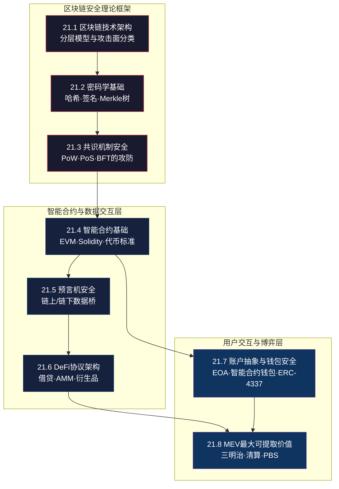

## 21.9 本节小结

### 知识全景：理论基础的八根支柱

本节（21.1-21.8）构建了区块链安全的完整理论基础，涵盖从底层密码学原语到上层MEV博弈的八层知识体系。这八个主题并非孤立的知识点，而是一条从基础到应用、从抽象到具体的逻辑链条。



**依赖关系解读**：区块链技术架构（21.1）定义了整体分层模型，为所有后续讨论提供了坐标系。密码学（21.2）和共识机制（21.3）是区块链安全的两大底层基石——前者保障数据的机密性和完整性，后者保障状态的一致性。智能合约（21.4）在此基础上构建可编程逻辑层，预言机（21.5）和DeFi协议（21.6）则是智能合约在数据流通和金融场景中的具体应用。钱包安全（21.7）关注用户与区块链交互的接口安全，MEV（21.8）则是博弈论在区块链层面的集中体现，深刻影响着用户交易的安全性和公平性。

---

### 第一层：底层基础（21.1-21.3）

#### 区块链技术架构（21.1）

区块链分层架构是理解安全问题的根本坐标系。从安全角度，可将攻击面划分为三个层次：

| 层次 | 核心组件 | 典型攻击面 | 安全假设 |
|------|----------|-----------|----------|
| 基础链层 | 共识机制、P2P网络、密码学原语 | 51%攻击、自私挖矿、日蚀攻击、非确定性签名 | 算力/质押诚实多数；网络同步假设 |
| 扩展层 | Layer 2、跨链桥、预言机、状态通道 | 跨链验证缺陷、Sequencer中心化、轻客户端欺骗 | 验证者诚实假设；消息中继可靠性 |
| 应用层 | 智能合约、DeFi协议、DAO治理 | 重入攻击、闪电贷操纵、治理攻击、经济模型漏洞 | 代码正确性假设；经济激励相容 |

**关键洞察**：大多数重大安全事件（损失超过1亿美元的攻击）发生在层间交互的边界上。Wormhole跨链桥攻击利用了扩展层（Validator）与基础链层（Solana）之间的验证缺陷，而非单一层次内的漏洞。这意味着安全从业者必须具备跨层次的安全视野，不能仅局限于单一层次的分析。

#### 密码学基础（21.2）

密码学是区块链安全的数学根基，但大多数安全漏洞并非密码学原语本身的缺陷，而是实现层面的错误。

**哈希函数的安全性边界**：
- 碰撞抗性（Collision Resistance）：SHA-256和Keccak-256目前无已知的碰撞攻击，但在抗量子密码学标准（如SPHINCS+、CRYSTALS-Dilithium）已经发布的背景下，后量子时代的安全迁移应纳入长期规划
- 原像抗性（Preimage Resistance）：哈希函数在该属性上仍保持安全，但实现层面常见的漏洞包括：哈希截断导致熵降低（如事件签名哈希的4字节选择器碰撞）、哈希链长度扩展攻击（SHA-256/MD5构造的Merkl-Damgård结构存在长度扩展攻击，SHA-3和BLAKE2不受影响）

**ECDSA的关键实现陷阱**：
- 随机数k（nonce）的重复使用将直接导致私钥泄露——两个签名如果使用了相同的k值，攻击者即可计算私钥。索尼PS3的签名密钥正是因此被破解
- 以太坊使用secp256k1曲线，相比于NIST P-256，secp256k1由比特币选定，主要优势在于曲线参数的可验证随机性（没有"NSA后门"的争议），但理论上安全性等价于其他256位椭圆曲线
- ECDSA签名中公钥恢复（ecrecover）默认可行，但该操作可能被用于重放攻击——在不同链上使用相同的签名参数可以恢复出相同的地址

**Merkle树的安全含义**：
- Merkle树的正确性依赖于哈希函数的碰撞抗性，但更常见的安全问题是Merkle证明的验证不完整（如未验证树的深度、未验证叶节点在树中的正确位置）
- 以太坊的Patricia Trie相比标准Merkle树增加了路径压缩机制，降低了树的深度但也增加了实现的复杂性

#### 共识机制安全（21.3）

共识机制的安全性直接决定了区块链网络的抗攻击能力。

**三种共识家族的安全对比**：

| 属性 | PoW（工作量证明） | PoS（权益证明） | BFT（拜占庭容错） |
|------|-------------------|-----------------|-------------------|
| 安全基础 | 算力成本 | 质押价值 | 节点身份/声誉 |
| 攻击成本 | 算力垄断（51%算力） | 质押垄断（51%代币） | 2/3节点腐败 |
| 长程攻击 | 不适用（链的延续需要持续算力） | 脆弱（可伪造历史链） | 不适用（确定性最终性） |
| Nothing-at-Stake | 不存在 | 存在（需要Slashing机制） | 不存在 |
| 交易最终性 | 概率性（6个区块确认≈99.9999%） | 经济最终性 | 绝对最终性 |
| 能源消耗 | 极高 | 极低 | 低 |
| 代表案例 | Bitcoin、Litecoin | Ethereum 2.0、Cardano | Cosmos、Polygon、Avalanche |

**PoS特有的新攻击向量**：
1. **长程攻击（Long-Range Attack）**：攻击者从较早的区块分叉出链，由于PoS没有算力限制，理论上可以构建任意长度的替代链。防御方案包括检查点机制（Checkpointing，每N个区块由信任的节点签署检查点）和弱主观性（Weak Subjectivity，新加入节点需要从某个受信任的检查点开始同步）
2. **Nothing-at-Stake问题**：在PoS中，验证者可以在多个分叉上同时投票而不付出额外成本，导致分叉无法收敛。Ethereum通过Casper FFG的惩罚机制（Slashing）解决此问题——验证者在两个冲突的检查点上投票将被罚没全部质押
3. **验证者集中化风险**：Lido等流动性质押协议使得质押权趋向集中。如果单一质押池控制了超过1/3的质押量，就可以阻止链的最终性（Liveness Failure）；超过1/2则可以在短期内控制链
4. **Grinding攻击**：验证者操纵随机数生成过程以增加自己被选中的概率。Ethereum的RANDAO方案通过所有验证者提交随机数的哈希值来生成不可预测的随机数，降低了Grinding风险

---

### 第二层：中层应用（21.4-21.6）

#### 智能合约基础（21.4）

智能合约的安全分析需要理解三个层面的知识：执行环境（EVM）、编程语言特性（Solidity）、以及代币标准的安全约定。

**EVM执行模型中的安全隐患**：
- 栈式字节码执行，操作的原子性仅限于单次调用（External Call会创建新的调用上下文）
- Gas计量机制既是DoS的防御措施也是攻击向量——Gas耗尽时状态回滚但已执行的子调用不会回滚（Ethereum的EIP-150修复了此问题）
- 存储是持久化的key-value数据库，32字节存储槽按顺序映射到状态变量。存储冲突是代理模式升级中最常见的安全问题
- CALL vs DELEGATECALL的区别：CALL在当前上下文中创建新的消息调用，目标合约有自己的存储和状态；DELEGATECALL保持当前合约的存储和msg.sender，仅复用目标合约的代码。如果DELEGATECALL的目标合约存储布局与调用者不兼容，将导致存储冲突

**Solidity核心安全隐患**：
- fallback和receive函数的隐式调用——当其他合约向本合约发送ETH时，receive或fallback被自动触发，这为重入攻击提供了入口
- tx.origin与msg.sender的区别：tx.origin是交易的最初发起者（EOA），msg.sender是直接调用者。使用tx.origin进行身份验证将使合约容易受到钓鱼攻击（中间合约可以伪装调用者）
- this.balance的可操纵性：不应依赖合约的余额进行业务逻辑判断，因为可以通过自毁（selfdestruct）强制向合约发送ETH

**代币标准安全差异**：
| 标准 | 安全注意事项 | 经典漏洞 |
|------|-------------|----------|
| ERC-20 | approve/transferFrom的前端运行问题；返回值的兼容性（部分代币不返回bool） | batchOverflow（2018年多个交易所因此受损） |
| ERC-721 | 非同质化特性使得Floor Price操纵成为可能 | 闪电贷攻击导致Blur等NFT市场遭受价格操纵 |
| ERC-1155 | 多代币标准引入了批量操作的安全边界 | 单个回调钩子（onERC1155Received）执行多个代币转移时需要特别验证 |
| ERC-4626 | Vault标准中rebase机制的舍入误差 | 存款/取款计算中的精度损失可被利用于提取额外资产 |

#### 预言机安全（21.5）

预言机是DeFi安全链中最脆弱的一环——它是链上逻辑依赖链外数据的唯一通道。

**预言机数据流的信任链**：
```text
链下数据源（CEX价格/链外数据）
        ↓ 数据采集（节点从多个源获取）
   预言机网络（节点聚合/验证）
        ↓ 数据聚合（中位数/加权平均）
   链上价格源合约
        ↓ 价格读取
   DeFi协议（借贷/AMM/衍生品）
```

**三层攻击面**：
1. **数据源层攻击**：操纵CEX/链外数据源的价格来影响预言机输出。2020年bZx事件利用bZx协议依赖Uniswap单一资金池价格，通过闪电贷同时操纵Uniswap价格和bZx的借贷清算。此类攻击的核心问题是**单一价格源依赖**——将关键协议的资产定价建立在单一流动性池的基础上。
2. **聚合层攻击**：操纵预言机网络的节点聚合逻辑。Chainlink的聚合合约使用中位数而非平均数的原因在于中位数对异常值更鲁棒——即使少数节点提供异常价格，中位数不受影响（需要超过50%的节点被控制才能影响中位数）。相同数量的异常值在平均数中可以显著扭曲结果。
3. **消费层攻击**：协议自身对价格的处理逻辑缺陷。TWAP（时间加权平均价格）机制通过平滑短期波动来增加操纵成本，其安全性与窗口长度正相关——Uniswap V2的TWAP实现是累积价格差除以时间差，窗口越长操纵成本越高。

**预言机安全性对比**：
| 方案 | 去中心化程度 | 延迟 | 操纵成本 | 适用场景 |
|------|-------------|------|---------|---------|
| Chainlink | 高（多节点+多数据源） | 分钟级 | 极高 | 主流资产定价、高频更新 |
| TWAP（Uniswap V2/V3） | 取决于底层AMM的去中心化 | 窗口长度可配置 | 与窗口长度正相关 | 低流动性资产的抗操纵定价 |
| 单一来源（自有节点） | 低 | 实时 | 低 | 非核心定价、内部系统 |
| MakerDAO Oracle | 中 | 小时级 | 中等 | Maker生态内部使用 |

#### DeFi协议架构与安全模型（21.6）

DeFi协议的可组合性（"货币乐高"）是最大的创新同时也是最大的风险来源。

**三种主流DeFi协议的安全模型**：

**借贷协议（Aave/Compound）**：
- 核心安全机制：超额抵押（Over-collateralization，通常要求120%-150%的抵押率）、清算阈值（Liquidation Threshold，触发清算的价格点）、健康因子（Health Factor = 抵押品价值 × 清算阈值 / 借款价值）
- 攻击面：预言机价格操纵（扭曲抵押品估值）、闪电贷清算竞争（Gas War导致用户损失溢价）、利率模型操纵（通过闪电贷临时改变供需比例）
- Aave的安全创新：安全模块（Safety Module，由AAVE代币质押者承担初始损失）、GHO稳定币的生态风险管理

**AMM（Uniswap/Curve）**：
- 核心安全机制：恒定乘积公式（x×y=k）、滑点保护（slippage参数）、流动性池的代币比例维持
- 攻击面：三明治攻击（Sandwich Attack）、无常损失（Impermanent Loss，流动性提供者的固有风险）、闪电贷操纵临时价格（操纵池中代币比例导致后续交易执行在扭曲的价格上）
- Curve的特色优势：稳定币兑换池使用StableSwap公式（在价格接近1:1时提供更低滑点），减少了MEV套利空间但引入了非均匀分布的流动性风险

**衍生品与永续合约（dYdX/GMX）**：
- 核心安全机制：保证金率（Maintenance Margin）、强平机制（Liquidation）
- 攻击面：资金费率操纵（Funding Rate Manipulation）、指数价格与标记价格差异（Price Divergence）、流动性黑洞（Liquidity Crunch，市场剧烈波动时流动性耗尽）
- GMX的创新：GLP池（多资产流动性池而非订单簿模式）、X2Y2联合市场降低大额交易的影响

**交叉协议风险——可组合性攻击链**：
闪电贷不仅是攻击工具，更是攻击链的"杠杆器"。一个典型的可组合性攻击路径如下：
```text
闪电贷借入巨额资产 → 在协议A中操纵价格 → 在协议B中以扭曲价格借贷更多资产 → 重复操作 → 偿还闪电贷 → 净获利
```
Beanstalk治理攻击、Euler Finance攻击都是此模式的变种。防御可组合性攻击需要协议层面的TWAP预言机、借贷上限、和跨协议风险监控。

---

### 第三层：上层交互（21.7-21.8）

#### 账户抽象与钱包安全（21.7）

账户抽象（Account Abstraction）是区块链账户模型从"密钥即身份"向"逻辑即身份"的范式转变。

**EOA钱包与智能合约钱包对比**：

| 属性 | EOA（外部拥有账户） | 智能合约钱包（ERC-4337） |
|------|-------------------|----------------------|
| 安全模型 | 私钥全权控制 | 可编程安全策略 |
| 密钥恢复 | 无法恢复（助记词丢失即资产丢失） | 社交恢复、时间锁恢复 |
| 交易签名 | 固定的ECDSA签名 | 可验证的任意签名方案（支持BLS、聚合签名） |
| 批量交易 | 不支持（每笔交易独立签名） | 支持（一次签名执行多笔操作） |
| Gas支付 | 必须用原生代币（ETH） | 支持ERC-20代币付Gas（Paymaster模式） |
| 权限管理 | 无（私钥拥有全部权限） | 细粒度权限（日限额、白名单应用） |
| 侧信道攻击面 | 助记词泄露、钓鱼签名 | 验证器逻辑漏洞、Bundler审查 |

**ERC-4337的三大组件及其攻击面**：
1. **UserOperation（用户操作）**：包含sender、nonce、callData、signature等字段。nonce管理不当可导致签名重放攻击，callData长度未限制可导致DoS攻击
2. **Bundler（打包者）**：将多个UserOperation打包并提交到EntryPoint合约。Bundler的审查行为（选择性打包）引入了MEV提取和交易审查的风险
3. **EntryPoint（入口点合约）**：验证和执行UserOperation的核心合约。其安全依赖于handleOps函数中模拟（simulation）和实际执行的一致性——如果模拟通过的验证在实际执行时失败，Bundler将损失Gas费用

**钱包安全的实操要点**：
- **硬件钱包的使用场景**：Ledger/Trezor等高价值资产的离线签名设备，所有助记词必须离线生成、离线存储
- **助记词存储的三原则**：分开存储（一份不放在同一个地方）、物理存储（不截屏、不云同步、不输入联网设备）、基于备份计划设计继承方案
- **钓鱼签名攻击的防范**：永远不在Etherscan等公共场所签署"验证所有权"的签名；使用Ledger的Clear Signing功能验证签名内容后再确认
- **多签钱包的阈值设计**：传统的3/5多签（3个签名者中5人中的任意3人可执行）在团队场景中常见，但Ronin Bridge的教训表明所有签名者不应使用相同的冷热钱包基础设施

#### MEV（最大可提取价值）安全（21.8）

MEV是区块链安全中最具博弈论色彩的子领域，直接改变了用户交易的安全环境。

**MEV的三类主要形式**：

1. **三明治攻击**：搜索者在目标交易前后分别下单买入和卖出，利用价格滑点获利。攻击者的利润与交易规模和代币的流动性成反比——在低流动性代币中，一笔大额交易可以产生极高的滑点，三明治攻击的利润可达交易金额的1%-5%。**用户防护手段**：设置合理的滑点容忍度（Uniswap的slippage参数）；使用Flashbots Protect等私有交易通道；使用CoW Protocol的批量拍卖机制

2. **清算抢跑**：搜索者监控借贷协议的清算事件，在原始清算人之前执行清算以获取清算奖励。这导致Gas价格飙升（Gas War），稀释了清算人的利润。**协议层缓解**：使用荷兰式拍卖的清算机制（如MakerDAO的Liquidations 2.0），让清算奖励随Gas消耗递减；使用批量清算（Batch Liquidation）减少竞争

3. **时间强盗攻击（Time-Bandit Attack）**：矿工/验证者为了中继自己的MEV交易而重新排列或重组区块链。这是对区块链最终性的直接威胁，尤其在PoW链中更容易发生。Ethereum的PBS（提议者-构建者分离）方案通过分离区块生产（构建者）和区块提议（验证者）的职责，限制了验证者提取MEV的能力——验证者只能选择接受或拒绝构建者提供的完整区块，不能在其中插入交易

**MEV防护方案的技术路线**：

| 方案 | 原理 | 优点 | 局限性 |
|------|------|------|--------|
| Flashbots Protect | 私有交易通道，绕过公共mempool | 用户免费、易于使用 | 依赖Flashbots可信基础设施 |
| MEV-Share | 允许用户分享MEV收益 | 用户获得部分MEV补偿 | 隐私泄露风险增加 |
| CoW Protocol | 批量拍卖，所有交易同一价格执行 | 完全消除三明治攻击 | 执行延迟、适合大额交易 |
| PBS（提议者-构建者分离） | 分离区块生产和提议权 | 减少验证者MEV能力 | 构建者中心化风险 |
| SUAVE | 去中心化的MEV执行平台 | 隐私保护、去中心化 | 仍处于早期阶段 |

**MEV的经济学影响**：MEV已从概念演变为一个独立的产业链——搜索者（Searchers）、构建者（Builders）、验证者（Validators）、Flashbots等MEV基础设施构成了多层的MEV供应链。MEV提取的总量从2021年的年化8亿美元增长至2023年的年化20亿美元以上。这一现象表明：**MEV不再是可被忽视的边缘问题，而是区块链安全的新常态**——每个区块链应用都必须在其威胁模型中考虑MEV的影响。

---

### 知识图谱：理论与实践的联系

本节的理论基础与后续的实战案例之间存在清晰的映射关系。以下对照表展示了理论知识点如何直接对应到具体的攻击事件：

| 理论知识点 | 关联案例 | 原理对应 |
|-----------|---------|---------|
| 重入攻击原理（21.4） | The DAO事件（$60M损失） | 在发送ETH之前未更新内部余额状态 |
| 预言机价格操纵（21.5） | Harvest Finance（$24M损失） | 使用单一池的现货价格而非TWAP |
| 闪电贷+治理攻击（21.6） | Beanstalk攻击（$1.82亿损失） | 治理提案无延迟期，闪电贷获取投票权 |
| 跨链验证缺陷（21.1/21.3） | Wormhole（$3.25亿损失） | 跨链消息验证逻辑缺陷，系统变量未验证 |
| 签名随机数重用（21.2） | 索尼PS3密钥泄露 | 相同k值导致私钥可推导 |
| 存储冲突/代理模式（21.4） | OpenZeppelin Proxy UUPS升级 | delegatecall后的存储布局不兼容 |
| MEV三明治攻击（21.8） | 绝大多数DEX用户交易 | Front-run + Back-run提取滑点利润 |

这种映射关系意味着：**理论不是空洞的知识，而是每一笔安全损失背后活生生的教训**。掌握了理论基础就等于获得了洞察历史攻击事件的分析框架。

---

### 知识体系自检清单

读者应能回答以下问题来验证对理论基础的掌握程度：

**基础层（必须掌握）**：
- [ ] 区块链的三层安全架构是什么？每一层的核心攻击面有哪些？
- [ ] ECDSA签名的随机数k重复使用会导致什么后果？
- [ ] PoW、PoS、BFT三种共识机制的安全假设各是什么？
- [ ] DELEGATECALL和CALL的核心区别是什么？DELEGATECALL的典型安全风险是什么？

**进阶层（应能解释原理）**：
- [ ] 为什么Chainlink使用中位数而非平均数进行价格聚合？
- [ ] ERC-4337的UserOperation如何防止签名重放攻击？
- [ ] 三明治攻击者如何确定交易的执行顺序？用户在什么情况下最容易被三明治攻击？
- [ ] TWAP预言机为什么比现货价格预言机更难操纵？
- [ ] "货币乐高"的可组合性如何放大安全风险？

**精通层（应能举一反三）**：
- [ ] 能推导出一个新的DeFi协议中可能存在的预言机-借贷交互风险
- [ ] 能设计一套跨链桥的验证方案，并指出其中的信任假设
- [ ] 能评估不同MEV防护方案的适用范围和局限性
- [ ] 能从存储布局层面分析一个代理合约是否存在升级冲突风险

---

### 核心要点速记

本节覆盖的知识可以归结为以下八条核心原则：

1. **分层安全思维**：区块链安全是分层的，每层都有不同的攻击面，真正的漏洞往往出现在层间交互的边界——这是区块链安全的第一性原理
2. **密码学是基石，实现才是脆弱点**：密码学原语本身经过数十年检验，但实现层面的错误（随机数重用、哈希长度扩展、签名验证不完整）是绝大多数安全事件的根本原因
3. **共识机制决定信任模型**：每种共识机制都有其独特的安全假设和攻击向量，理解这些假设是评估一个区块链网络安全性的前提
4. **智能合约的不可变性放大安全成本**：一旦部署，修复漏洞需要复杂的升级流程（代理模式）或硬分叉，这使得前期审计的重要性不可估量
5. **预言机是DeFi的致命弱点**：链上逻辑需要依赖链外数据，这个数据桥梁是DeFi安全链条中最脆弱的一环——了解预言机的三层攻击面是评估任何DeFi协议安全性的必要技能
6. **DeFi的可组合性是双刃剑**：协议之间的交互是创新的源泉，也是攻击面被指数级放大的原因——单一协议的漏洞可通过组合关系波及整个生态系统
7. **钱包安全是用户的最后一道防线**：从私钥管理到交易签名验证，钱包安全覆盖了用户操作的全链条。ERC-4337的账户抽象降低了密钥管理的门槛，但引入了新的攻击面
8. **MEV是区块链安全的博弈论维度**：MEV已经从概念演变为价值数十亿美元的行业，深刻影响着用户交易的公平性和DeFi协议的经济安全性。每个区块链应用都必须将MEV纳入威胁模型

这八条原则不是孤立的知识点，而是一套相互关联的分析框架——掌握了它们，就获得了系统性地评估任何区块链系统安全性的能力。
