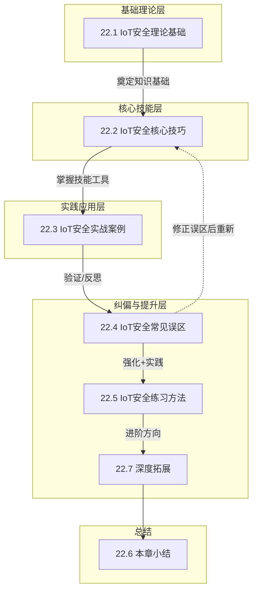

# 第22章 IoT安全

## 章节概述

### IoT安全：一场正在爆发的危机

物联网（Internet of Things，IoT）已不再是概念层面的未来愿景，而是深度嵌入现代社会的每一根毛细血管。从你手中的智能手表到家中的智能音箱，从工厂车间的PLC控制器到高速公路上的车联网系统，IoT设备正以前所未有的速度渗透到人类生活的方方面面。

**规模数据**：根据IoT Analytics 2024年发布的报告，全球联网IoT设备数量在2023年已突破160亿台，预计到2027年将超过290亿台。到2030年，IoT市场规模预计突破1.5万亿美元。但比增长数字更令人担忧的是安全现状——Gartner预测，到2025年超过25%的企业网络攻击将涉及IoT设备，而目前所有IoT设备中有超过50%存在至少一个严重安全漏洞（来源：Unit 42 IoT Threat Report 2023）。

**为什么IoT安全与众不同？** 与传统IT安全相比，IoT安全面临三重根本性挑战：

| 维度 | 传统IT安全 | IoT安全 |
|------|-----------|---------|
| **设备生命周期** | 3-5年，可频繁打补丁 | 10-20年，固件更新困难甚至不可行 |
| **资源约束** | CPU/内存/电源充裕 | 微控制器级计算能力，KB级内存，电池供电 |
| **物理暴露** | 服务器在机房内 | 设备暴露在公共场所、户外、人体内 |
| **影响后果** | 数据泄露、服务中断 | 人身安全、物理设施损毁、生产事故 |
| **协议标准化** | 协议统一（HTTP/TLS/IP） | 数十种协议各自为政 |
| **安全运维** | 有专职安全团队 | 多数无运维接口，用户自行管理 |

**典型案例警示**：2016年Mirai僵尸网络利用IoT设备的默认密码漏洞，在短短数小时内控制了超过60万台IoT设备，发起了1.2Tbps的DDoS攻击，导致Twitter、Netflix、CNN等多家全球知名网站大面积瘫痪。该攻击所使用的漏洞并非复杂的零日漏洞，而是——设备出厂时的默认密码未被修改。这个案例深刻揭示了IoT安全问题的本质：**最致命的安全威胁往往源自最基础的安全缺失**（来源：Mirai DDoS攻击回顾，Cloudflare，2023）。

### 本章定位与作用

本章是**IoT安全领域从入门到实战的全景指南**。它既不是泛泛而谈的概念介绍，也不是杂乱无章的技巧堆砌，而是按照"道法(理论)→术(技巧)→器(实战)→法(体系)"四大层次递进展开，帮助读者建立完整的IoT安全知识体系。

在本章中，你将学习：

- **道（理论）**：IoT系统架构、通信协议、设备分类、威胁模型和评估方法论——理解IoT安全"为什么"重要、"是什么"在威胁
- **术（技巧）**：固件分析、协议安全测试、漏洞挖掘、防护实践——掌握"怎么做"安全评估和渗透测试
- **器（实战）**：从智能家居到工业控制系统、从医疗设备到车联网的完整安全案例——看到"真实世界"中安全是如何被攻破和防御的
- **法（体系）**：常见误区纠偏、练习方法指引、深度拓展方向——建立"可持续"的安全学习和发展路径

> 💡 **核心观点**：IoT安全不是一个产品，也不是一个工具，而是一种**从设计阶段就应该深度嵌入的思维方式**。真正的IoT安全专家，不仅要知道如何攻击，更要知道如何从架构层面系统性防御。

## 学习目标

通过本章系统学习，读者将获得以下能力和可衡量的学习成果：

### 知识层面
| 编号 | 目标 | 衡量标准 |
|------|------|---------|
| K1 | **理解IoT系统架构** | 能准确描述感知层、网络层、平台层、应用层的功能及安全特性 |
| K2 | **掌握主流通信协议** | 能分析MQTT、CoAP、Zigbee、BLE四种协议的安全机制和常见漏洞 |
| K3 | **熟悉安全模型和标准** | 能列举OWASP IoT Top 10、NIST框架和ETSI EN 303 645的核心要求 |
| K4 | **掌握威胁分类框架** | 能使用MITRE ATT&CK for IoT分析实际攻击路径 |

### 技能层面
| 编号 | 目标 | 衡量标准 |
|------|------|---------|
| S1 | **固件分析能力** | 能独立完成固件提取、解包、文件系统分析和关键信息搜索 |
| S2 | **协议安全测试能力** | 能使用Wireshark、MQTT.fx、Zigbee sniffer等工具抓包分析 |
| S3 | **漏洞挖掘能力** | 能执行基本漏洞扫描、固件逆向、Web接口测试 |
| S4 | **安全评估能力** | 能参照渗透测试方法论完成对消费级IoT设备的完整评估 |

### 思维层面
| 编号 | 目标 | 衡量标准 |
|------|------|---------|
| T1 | **建立安全评估思维** | 拿到任何IoT设备时，能快速定位其攻击面和风险关键点 |
| T2 | **培养纵深防御意识** | 在设计IoT系统时，能主动考虑多层级的安全防护措施 |
| T3 | **形成持续学习习惯** | 能自主跟踪IoT安全领域的CVE/CVRF和社区动态 |

## 章节内容结构

本章共分为 **7个核心部分**，结构上遵循"理论→技巧→实战→误区→练习→拓展→总结"的递进逻辑。下面以导航图展示整体脉络：



### 22.1 IoT安全理论基础（道）

本章的知识根基，为后续所有实操提供理论支撑。

| 子节 | 内容概要 | 难度 | 建议用时 |
|------|---------|------|---------|
| 22.1.1 IoT系统架构概述 | 感知层→网络层→平台层→应用层的四层架构及各层安全特性 | ⭐⭐ | 30分钟 |
| 22.1.2 IoT通信协议安全分析 | MQTT、CoAP、Zigbee、BLE四种核心协议的安全机制与漏洞 | ⭐⭐⭐ | 45分钟 |
| 22.1.3 IoT设备分类与安全特征 | 消费级/工业/医疗/车联网四类设备的安全风险画像 | ⭐⭐ | 25分钟 |
| 22.1.4 IoT安全威胁分类框架 | OWASP Top 10、MITRE ATT&CK、攻击向量多维分析 | ⭐⭐ | 35分钟 |
| 22.1.5 IoT安全模型与标准 | NIST、ETSI、ISO/IEC、中国国家标准全景解读 | ⭐⭐ | 30分钟 |
| 22.1.6 IoT安全评估方法论 | 风险评估框架、安全测试方法、渗透测试标准流程 | ⭐⭐⭐ | 40分钟 |

> **核心技术点**：IoT分层安全模型、MQTT TLS配置、Zigbee信任中心机制、OWASP IoT Top 10威胁识别

### 22.2 IoT安全核心技巧（术）

从理论走向实践，掌握IoT安全研究必备的核心技能。

| 子节 | 内容概要 | 难度 | 建议用时 |
|------|---------|------|---------|
| 22.2.1 IoT设备固件分析技术 | 固件提取4种方法、解包分析、敏感信息搜索、动态调试 | ⭐⭐⭐⭐ | 60分钟 |
| 22.2.2 IoT通信协议安全测试 | MQTT安全测试、CoAP/DTLS测试、BLE抓包分析、Zigbee攻击 | ⭐⭐⭐⭐ | 50分钟 |
| 22.2.3 IoT设备漏洞挖掘方法 | 漏洞分类、信息收集、攻击面分析、漏洞利用技术 | ⭐⭐⭐⭐⭐ | 60分钟 |
| 22.2.4 IoT安全防护最佳实践 | 安全开发生命周期、纵深防御策略、安全配置清单 | ⭐⭐⭐ | 30分钟 |
| 22.2.5 IoT安全工具集 | 固件分析/协议测试/漏洞扫描/调试工具指南 | ⭐⭐ | 20分钟 |

> **必备工具**：binwalk, firmware-mod-kit, Ghidra, Wireshark, Burp Suite, JTAGulator, flashrom

### 22.3 IoT安全实战案例（器）

真实世界中的IoT安全攻防实战，每个案例都包含技术细节、攻击路径和防御建议。

| 子节 | 内容概要 | 案例来源 | 难度 |
|------|---------|---------|------|
| 22.3.1 智能家居设备安全分析 | 智能摄像头/智能音箱/智能门锁攻防 | 真实研究+CTF场景 | ⭐⭐⭐⭐ |
| 22.3.2 工业控制系统安全事件 | SCADA/PLC攻防、震网病毒分析 | Stuxnet、TRITON等真实事件 | ⭐⭐⭐⭐⭐ |
| 22.3.3 车联网安全威胁案例 | T-Box攻击、CAN总线注入、V2X漏洞 | Jeep Cherokee破解等 | ⭐⭐⭐⭐ |
| 22.3.4 医疗设备安全漏洞分析 | 心脏起搏器/胰岛素泵/医疗影像系统安全 | FDA召回案例、研究论文 | ⭐⭐⭐⭐ |
| 22.3.5 IoT僵尸网络案例分析 | Mirai/Reaper/Gafgyt的技术原理与防御 | 真实僵尸网络溯源 | ⭐⭐⭐ |
| 22.3.6 工业IoT安全案例 | 制造业/能源/交通行业IoT安全事件 | 真实行业案例 | ⭐⭐⭐⭐ |
| 22.3.7 车联网安全案例 | OBD攻击/远程解锁/ADAS安全 | 真实研究案例 | ⭐⭐⭐⭐ |
| 22.3.8 智能家居综合案例 | 多设备联动攻击场景与完整攻击链 | 真实研究融合 | ⭐⭐⭐⭐⭐ |
| 22.3.9 IoT安全事件响应 | 事件检测、取证分析、应急响应流程 | 行业最佳实践 | ⭐⭐⭐ |
| 22.3.10 医疗IoT安全案例 | 医疗设备攻击面与合规防护 | 真实研究+合规标准 | ⭐⭐⭐⭐ |

> **典型案例研究**：2015年Jeep Cherokee远程破解（Miller & Valasek，影响140万辆车）、2016年Mirai僵尸网络（60万设备、1.2Tbps攻击）、2017年TRITON恶意软件破坏沙特石化工厂安全系统

### 22.4 IoT安全常见误区

纠偏环节，帮助读者识别并纠正IoT安全领域最常见的10大认知偏差和操作错误。

**精选误区示例**：
- ❌ "IoT设备功率低、算力弱，无法部署安全机制"——实则LTE-M、NB-IoT和专用安全芯片提供了可行方案
- ❌ "设备在局域网内，外部威胁无法触及"——实则Mirai和SambaCry等恶意软件可横向移动
- ❌ "固件加密后内容就安全了"——实则加密密钥通常也在固件中或可被侧信道攻击提取
- ❌ "更新固件就能解决所有安全问题"——实则物理设备可能无法被更新，更新机制本身也可能存在漏洞

### 22.5 IoT安全练习方法

为读者提供可操作的学习路径和实践环境搭建指南。

**核心内容**：
- 实验环境搭建：QEMU仿真、Firmadyne固件分析框架、硬件调试工作台配置
- 在线练习平台：HackTheBox IoT Labs、CTFd IoT赛道、Exploit Exercises
- 自建靶场指南：Raspberry Pi作为测试靶机、基于Docker的IoT模拟环境
- 技能进阶路线图：从消费级设备到工业级系统的循序渐进学习路径
- 开源项目实践：OpenWrt固件定制、Home Assistant安全审计

### 22.7 深度拓展

为已掌握基础的读者提供进阶研究方向和相关领域扩展。

**拓展方向**：
- AI驱动的IoT异常检测：使用机器学习检测设备行为异常
- 边缘安全计算：TEE（可信执行环境）在IoT中的应用
- 5G-IoT安全：网络切片隔离、gNB安全
- 区块链与IoT：分布式身份验证、供应链溯源
- 量子安全IoT：后量子密码在资源受限设备上的实现
- 硬件安全模块（HSM）与安全元件（SE）设计

### 22.6 本章小结

对全书知识体系的回顾、总结和综合练习。

## 各章节依赖关系与阅读路径

不同背景的读者可以选择最适合自己的学习路径：

### 路径一：零基础入门（全面学习）
**预计总时长**：15-20小时

```text
理论(22.1) → 技巧(22.2) → 实战(22.3) → 误区(22.4) → 练习(22.5) → 拓展(22.7)
```
适用于：在校学生、转行进入IoT安全领域的人员

### 路径二：安全从业者精进（聚焦实战）
**预计总时长**：8-12小时

```text
理论(22.1.2+22.1.4) → 技巧(22.2.1+22.2.2+22.2.5) → 实战(22.3) → 练习(22.5)
```
适用于：已有安全基础，希望扩展IoT技能的安全工程师

### 路径三：开发人员自检（偏重防护）
**预计总时长**：6-10小时

```text
理论(22.1.1+22.1.5+22.1.6) → 技巧(22.2.4+22.2.5) → 误区(22.4) → 拓展(22.7)
```
适用于：IoT设备/平台开发者，希望在设计阶段融入安全考量

### 路径四：硬核研究者（深度方向）
**预计总时长**：20+小时

```text
理论(全) → 技巧(全) → 实战(全) → 误区 → 练习(全) → 拓展(全)
```
适用于：计划从事IoT安全研究、漏洞挖掘、竞赛参赛人员

## 前置知识体系

为更好地学习本章内容，建议读者具备以下基础：

| 知识领域 | 具体要求 | 推荐补充学习资源 |
|---------|---------|----------------|
| **网络基础知识** | 理解TCP/IP协议栈、路由、NAT、DNS等基本概念 | 《计算机网络：自顶向下方法》第1-4章 |
| **编程能力** | 至少熟悉Python或C语言的基础语法 | Python官方教程、C primer plus |
| **操作系统基础** | 了解Linux文件系统、进程管理、权限模型 | 《鸟哥的Linux私房菜》基础篇 |
| **嵌入式基础**（可选） | 了解MCU、GPIO、UART、SPI、I2C等硬件概念 | 嵌入式系统入门教程 |
| **安全基础** | 了解常见Web漏洞（XSS、SQL注入）、密码学基础 | OWASP Top 10、Cryptography I |

> 💡 **温馨提示**：如果对上述某个领域完全陌生，建议在阅读本章前花1-2周补充学习基础知识，这将极大提升学习效率和理解深度。

## 配套资源索引

本章涉及的资源和工具较多，为方便读者查阅，在此统一汇总：

### 核心工具清单
| 工具类型 | 工具名称 | 用途 | 开源/免费 |
|---------|---------|------|----------|
| 固件分析 | binwalk | 固件文件提取和分析 | ✅ 开源 |
| 固件分析 | firmware-mod-kit | 固件解包和重新打包 | ✅ 开源 |
| 逆向工程 | Ghidra | 二进制分析和反编译 | ✅ 开源（NSA） |
| 逆向工程 | Radare2 | 命令行逆向框架 | ✅ 开源 |
| 协议分析 | Wireshark | 网络流量捕获和分析 | ✅ 开源 |
| MQTT测试 | MQTT.fx / MQTTX | MQTT客户端调试 | ✅ 免费 |
| BLE分析 | Wireshark + nRF Sniffer | BLE协议抓包 | ✅ 开源 |
| Zigbee分析 | TI CC2531 Sniffer | Zigbee流量分析 | ✅ 开源 |
| Web测试 | Burp Suite | Web接口安全测试 | 社区版免费 |
| 调试接口 | JTAGulator | JTAG/SWD接口识别 | ✅ 开源（硬件） |
| 闪存读取 | flashrom | SPI闪存芯片读写 | ✅ 开源 |
| 固件仿真 | Firmadyne / QEMU | 固件动态分析 | ✅ 开源 |

### 推荐阅读与参考来源
- **OWASP IoT Security Guidance** — 官方IoT安全指南
- **NIST SP 800-183** — 物联网网络安全框架
- **"The Internet of Risky Things"** — Sean Smith（O'Reilly）
- **"IoT Security Issues"** — Alasdair Gilchrist（De Gruyter）
- **"Practical IoT Hacking"** — Fotios Chantzis等（No Starch Press）
- **MITRE ATT&CK for IoT** — 威胁知识库
- **CVE Details** — 历史IoT漏洞数据库
- **Google Project Zero IoT research** — 高级IoT漏洞研究

## 如何高效使用本章

### 阅读建议
1. **顺序阅读**：建议首次阅读时从22.1开始顺序推进，理论打底后再实践
2. **动手实践**：每个技巧章节都配了代码和命令示例，务必在实验环境中跟随操作
3. **笔记习惯**：准备好笔记工具，记录每个新学到的攻击面、工具用法和安全原则
4. **重复钻研**：实战案例部分涉及较多技术细节，建议至少阅读两遍，第一遍建立整体认知，第二遍关注技术细节

### 实验环境要求
- **操作系统**：推荐使用Kali Linux或Parrot OS（内置大量安全工具）
- **硬件设备**：USB转TTL适配器（CH340G/CP2102）+ 杜邦线（固件提取实验）
- **虚拟机**：VMware/VirtualBox + 4GB以上内存（运行固件仿真环境）
- **网络工具**：支持监听模式的无线网卡（Wi-Fi/BLE分析）

### 安全须知
> ⚠️ **安全警告与免责声明**
> 
> 本章内容仅供**合法的安全测试与教育目的**使用。所有技术、工具和方法的讨论均旨在帮助安全从业者在**获得明确授权**的前提下进行防御性安全研究。
> 
> - 🚫 **未经授权**对任何系统、网络或应用进行安全测试是**违法行为**
> - ✅ 所有实践活动应在**隔离的实验环境**中进行（如虚拟机、CTF平台、专门购买的实验设备）
> - ✅ 遵守所在国家和地区的**网络安全法律法规**（中国《网络安全法》《数据安全法》《个人信息保护法》）
> - ✅ 遵循**负责任的漏洞披露**原则（先通知厂商，给予合理修复时间后再公开）
> 
> 作者不对因滥用本章内容造成的任何后果承担责任。请将知识用于保护而非破坏。

---

*本章内容基于2024年最新的IoT安全研究和行业实践编写，引用的数据和标准截至2024年12月。IoT安全领域发展迅速，建议读者持续关注CVE数据库、OWASP官方博客和各大安全研究团队的最新成果。*
