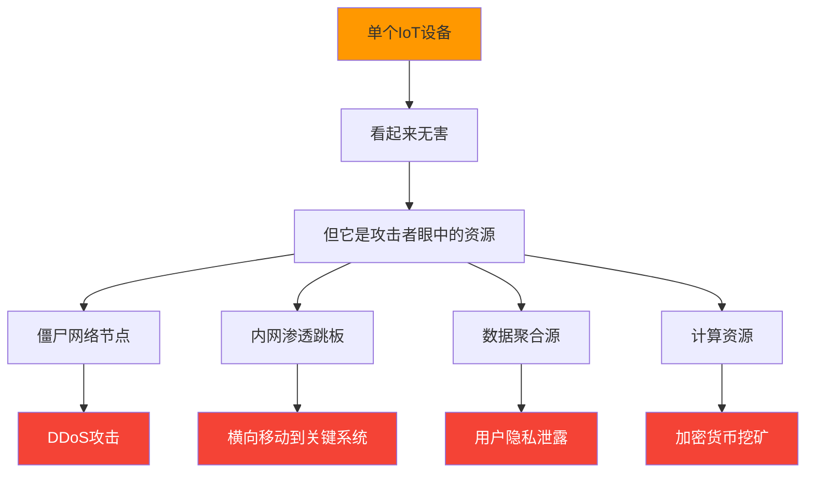
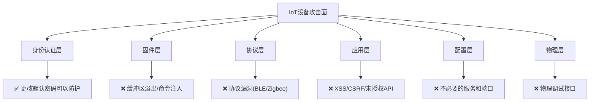
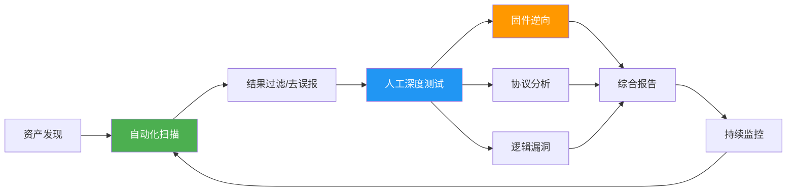
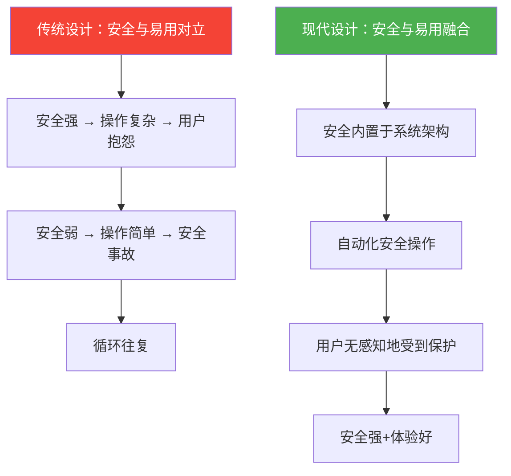

# 第22章 IoT安全 - 常见误区

> **识别误区是建立正确安全观的第一步。** 在IoT安全领域，错误的认知往往比技术漏洞更危险——它会导致防御策略的系统性缺失。本节从风险认知、安全防护、安全评估、技术实现和组织管理五个维度，系统梳理IoT安全中最常见的15个误区，每个误区都配合真实案例、数据统计和纠正方法，帮助读者建立全面、准确的IoT安全观。

## 22.1 风险认知层面的常见误区

对风险的错误认知是IoT安全问题的根源。当组织或个人低估威胁时，后续的安全投入和防护措施都会偏离正确方向。

### 22.1.1 误区一："IoT设备太小，不会被攻击"

**错误认知**

许多人认为智能灯泡、智能插座、温度传感器等小型IoT设备功能简单、数据价值低，不会成为攻击者的关注目标。这种"我没什么值得偷的"心态在个人用户和中小企业中尤为普遍。

**为什么这种认知是错误的**

攻击者对IoT设备感兴趣，从来不是因为单个设备本身的价值，而是因为以下四个方面：

| 攻击动机 | 具体目标 | 现实案例 |
|----------|---------|---------|
| 僵尸网络构建 | 海量设备的分布式计算能力 | Mirai僵尸网络感染60万+台设备 |
| 内网渗透跳板 | 通过设备进入家庭/企业内网 | 通过智能鱼缸温度计入侵赌场网络 |
| 数据聚合挖掘 | 单设备数据无价值，聚合后价值巨大 | 智能音箱录音被用于分析用户行为模式 |
| 资源劫持利用 | 设备CPU/带宽用于挖矿或DDoS | 2023年IoT设备加密货币挖矿增长300% |
| 供应链攻击入口 | 通过设备固件预置后门 | 2016年某摄像头厂商固件含硬编码后门 |

**Mirai僵尸网络案例深度分析**

2016年9月，安全研究员MalwareMustai发现的Mirai是IoT安全史上的分水岭事件：

```text
Mirai感染过程：
1. 扫描互联网上开放Telnet(23端口)的IoT设备
2. 使用62组硬编码的默认用户名/密码组合尝试登录
3. 成功登录后，下载并执行恶意载荷
4. 设备变为僵尸节点，参与进一步扫描和攻击
5. 被感染设备等待C&C服务器指令
```

Mirai的感染规模和影响：

- **感染规模**：高峰时超过60万台设备被控制
- **攻击带宽**：2016年10月对Dyn DNS的DDoS攻击达到1.2Tbps
- **影响范围**：Twitter、Netflix、Reddit、GitHub等主流网站大面积宕机
- **攻击成本**：攻击者仅花费约3000美元租用僵尸网络
- **设备类型**：主要是网络摄像头、DVR录像机、家用路由器

**每台IoT设备都是一个潜在的攻击入口。** 2023年Palo Alto Networks的报告指出，平均每台IoT设备每天遭受5.2次攻击尝试，而57%的IoT设备存在中度或高度漏洞。

**正确认知与防护策略**



**防护措施清单**：

1. **设备盘点**：建立完整的IoT资产清单，记录每台设备的型号、固件版本、网络位置和用途
2. **最小化暴露面**：关闭不必要的远程访问端口，将设备置于内网
3. **凭证管理**：立即更改所有默认密码，使用强密码策略
4. **网络隔离**：将IoT设备放在独立的VLAN中，与关键业务系统隔离
5. **持续监控**：部署网络流量监控，识别异常的对外连接行为

### 22.1.2 误区二："设备离线（断网）就安全"

**错误认知**

部分用户和组织认为将IoT设备从互联网断开（气隙隔离）就能确保安全。这种认知忽略了多种不依赖互联网连接的攻击方式。

**离线设备仍然面临的五类威胁**

**第一类：物理接口攻击**

IoT设备通常保留以下物理调试接口，攻击者可以通过物理接触设备来利用这些接口：

| 接口类型 | 功能用途 | 攻击方式 | 典型影响 |
|----------|---------|---------|---------|
| UART | 串口调试控制台 | 连接后获取root shell | 完全控制设备 |
| JTAG | 芯片级调试接口 | 绕过软件安全，直接读写内存/Flash | 提取固件、篡改程序 |
| SPI/I2C | Flash芯片通信 | 直接读取固件芯片内容 | 固件逆向、密钥提取 |
| USB | 数据传输和充电 | 注入恶意载荷 | 恶意软件传播 |
| SD卡槽 | 存储扩展 | 植入恶意文件 | 代码执行 |

**第二类：本地网络攻击**

即使设备不连接互联网，只要连接了局域网，同一网络中的已感染设备就可以：

- 利用ARP欺骗劫持设备通信
- 通过局域网共享的服务漏洞进行横向攻击
- 使用未授权的管理协议（如TR-069）进行控制

**第三类：供应链攻击**

设备在出厂或供应链环节就已被植入后门：

- 固件中预置了硬编码的管理员凭据
- 第三方组件库存在已知漏洞
- 生产环节被替换为含恶意代码的芯片

**第四类：无线协议攻击**

IoT设备常使用蓝牙、Zigbee、Z-Wave、LoRa等无线协议进行通信，这些协议本身可能存在安全缺陷：

- **蓝牙（BLE）**：BlueBorne漏洞允许无需配对即可远程执行代码
- **Zigbee**：密钥嗅探攻击可截获网络密钥，控制整个Zigbee网络
- **Z-Wave**：早期版本的S0安全协议存在密钥交换漏洞
- **LoRaWAN**：默认配置下使用明文传输密钥

**第五类：内部威胁**

具有物理访问权限的内部人员（员工、承包商、维护人员）可以直接接触设备，实施攻击。

**经典案例：Stuxnet（震网病毒）**

Stuxnet是证明"离线不等于安全"的最著名案例：

```text
Stuxnet攻击链：
1. 攻击目标：伊朗纳坦兹核设施的离心机控制系统（完全气隙隔离）
2. 初始感染：通过受感染的USB闪存盘（可能由内部人员或供应商带入）
3. 传播方式：利用Windows多个零日漏洞在内网传播
4. 最终目标：修改西门子S7-300 PLC的控制逻辑
5. 攻击效果：导致约1000台离心机超速运转而损坏
6. 隐蔽机制：篡改监控系统数据，使操作员无法察觉异常
```

Stuxnet的启示：即使是最严格的物理隔离，也无法防御精心设计的供应链攻击和社会工程学攻击。

**正确的纵深防御策略**

```mermaid
graph LR
    subgraph 第1层：物理安全
        A1[门禁控制]
        A2[设备防盗]
        A3[调试接口禁用]
    end
    subgraph 第2层：网络隔离
        B1[独立VLAN]
        B2[防火墙规则]
        B3[无线信号屏蔽]
    end
    subgraph 第3层：设备加固
        C1[固件完整性验证]
        C2[安全启动]
        C3[最小化服务]
    end
    subgraph 第4层：监控审计
        D1[异常流量检测]
        D2[固件哈希校验]
        D3[定期安全审计]
    end
    
    第1层 --> 第2层 --> 第3层 --> 第4层
```

### 22.1.3 误区三："厂商会负责安全更新"

**错误认知**

用户和采购方普遍认为，IoT设备厂商会像手机厂商一样持续提供安全更新和漏洞修复，设备出了问题厂商会负责。

**IoT安全更新的残酷现实**

与智能手机和PC不同，IoT设备的安全更新生态存在严重的结构性问题：

| 维度 | 智能手机/PC | IoT设备 |
|------|------------|---------|
| 更新频率 | 每月甚至每周 | 可能几年才一次，甚至从不更新 |
| 支持周期 | 3-7年 | 1-3年，甚至设备上市即停更 |
| 自动更新 | 成熟的OTA机制 | 许多设备需要手动更新，部分无更新通道 |
| 合规要求 | 有行业标准和用户预期 | 多数地区无强制要求 |
| 供应链 | 大厂商直接负责 | 多层OEM/ODM，责任不清 |

**厂商不提供更新的根本原因**：

1. **利润模型**：IoT设备利润率低，持续的安全维护是纯成本
2. **生命周期**：许多IoT设备设计为"一锤子买卖"，无长期支持计划
3. **技术债务**：使用过时的组件和库，更新风险高
4. **供应链碎片**：设备厂商可能不直接控制底层固件
5. **缺乏标准**：没有强制性的安全更新法规（虽然正在改变）

**数据佐证**：

- 根据2023年Forescout报告，约60%的IoT设备厂商在产品停产后不再提供安全补丁
- Bitdefender的调查显示，平均IoT设备固件比最新版本落后2年以上
- 约30%的IoT设备在用户购买后从未进行过固件更新

**案例：D-Link路由器安全事件**

D-Link是全球知名的网络设备厂商，但其安全更新实践饱受批评：

- 2019年，D-Link宣布对多款已停售的路由器停止安全更新
- 但这些设备仍在全球数百万家庭中使用
- 2023年，多款已停止支持的D-Link路由器被发现存在严重的远程代码执行漏洞
- 厂商建议用户"购买新设备"，但许多用户不会因为安全问题而更换仍在工作的设备

**正确的应对策略**

**购买前**：

1. 查阅厂商的安全响应历史和更新政策
2. 优先选择承诺长期安全更新的品牌
3. 确认设备是否支持自动OTA更新
4. 考虑选择支持开源固件（如OpenWrt）的设备
5. 在采购合同中明确安全更新的服务等级协议（SLA）

**使用中**：

1. 定期检查并安装固件更新
2. 订阅厂商的安全公告邮件列表
3. 使用CVE数据库（如NVD）监控设备已知漏洞
4. 对不再支持的设备制定退役和替换计划
5. 在厂商停更后，考虑使用第三方固件或实施额外的网络层防护

## 22.2 安全防护中的常见误区

即使组织认识到IoT安全的重要性，在实施防护措施时也常犯以下错误。

### 22.2.1 误区四："更改默认密码就够了"

**错误认知**

"改密码"是IoT安全建议中出现频率最高的操作，导致许多用户认为完成这一步就万事大吉。

**仅更改密码无法防御的攻击面**



**具体说明**：

1. **固件漏洞**：缓冲区溢出、命令注入、整数溢出等漏洞不需要凭据即可利用。例如，许多路由器的Web管理接口存在未经认证的远程代码执行漏洞，攻击者无需知道密码即可完全控制设备。

2. **协议漏洞**：BLE、Zigbee、MQTT等通信协议本身的安全缺陷与密码无关。例如，Zigbee的"Zigbee Light Link"协议在密钥交换阶段使用已知的Trust Center Link Key，攻击者可以嗅探并获取网络密钥。

3. **Web应用漏洞**：XSS、CSRF、SQL注入等Web漏洞可以绕过认证机制。许多IoT设备的Web管理界面存在严重的安全缺陷。

4. **默认API密钥**：用户可能更改了设备管理密码，但忽略了云API密钥、MQTT凭证等其他认证材料。

5. **不必要的服务**：设备默认开启的Telnet、SSH、FTP等服务本身就是攻击面。

**案例：隐藏后门与硬编码凭据**

2017年，研究人员发现某品牌的网络摄像头在固件中硬编码了一个隐藏的管理员账户（用户名`d13`，密码为空），该账户通过修改HTTP请求的特定参数即可激活，无论用户是否更改了默认密码。类似的问题在2019-2023年间被多次发现于多家厂商的产品中。

**全面安全配置清单**

```bash
# 1. 更改所有默认凭据（不仅是管理密码）
#    - 设备管理界面密码
#    - WiFi密码
#    - MQTT用户名/密码
#    - 云API密钥/Token
#    - FTP/Samba共享凭证

# 2. 禁用不必要的服务
#    检查开放端口
nmap -sV -O <设备IP>
#    关闭不需要的服务，例如：
#    - Telnet（如不需要远程调试）
#    - UPnP（通用即插即用，安全隐患大）
#    - WPS（WiFi保护设置，存在暴力破解漏洞）
#    - FTP（如不需要文件传输）

# 3. 启用安全通信
#    - 强制HTTPS访问管理界面
#    - 启用WPA3或WPA2-PSK（AES模式）
#    - MQTT使用TLS端口（8883而非1883）

# 4. 配置网络隔离
#    - 设置独立的IoT VLAN
#    - 配置防火墙规则限制VLAN间通信

# 5. 固件安全
#    - 更新到最新固件
#    - 启用安全启动（如设备支持）
#    - 验证固件签名
```

### 22.2.2 误区五："IoT设备不需要防火墙保护"

**错误认知**

一些人认为IoT设备功能简单、资源有限，部署防火墙是"大材小用"，或者认为家用路由器自带的NAT就是足够的防护。

**无防火墙保护的IoT设备面临的威胁**

**入站威胁**（从互联网到设备）：

| 攻击类型 | 描述 | 利用的端口/协议 |
|----------|------|---------------|
| 暴力破解 | 系统性尝试默认/弱密码 | Telnet(23), SSH(22), HTTP(80) |
| 漏洞利用 | 利用已知CVE漏洞 | Web端口、自定义服务端口 |
| DDoS攻击 | 用大量请求耗尽设备资源 | 任意开放端口 |
| 未授权访问 | 直接访问暴露的管理接口 | 各种管理协议端口 |

**出站威胁**（从设备到互联网，常被忽略）：

| 攻击类型 | 描述 | 风险等级 |
|----------|------|---------|
| C&C通信 | 已感染设备连接僵尸网络控制服务器 | 高 |
| 数据外泄 | 设备将敏感数据发送到外部服务器 | 高 |
| 加密货币挖矿 | 设备CPU被劫持进行挖矿 | 中 |
| 反弹攻击 | 设备作为攻击跳板攻击其他目标 | 高 |
| DNS隧道 | 通过DNS查询隐蔽传输数据 | 中 |

**出站流量监控是多数IoT防护方案中最薄弱的环节。** 许多防火墙规则只关注入站流量，而忽略设备对外的异常连接。

**防火墙与网络隔离的实战配置**

以下是一个家庭网络中IoT设备防火墙配置的示例（基于iptables/netfilter）：

```bash
# 场景：IoT设备在192.168.10.0/24网段（VLAN 10）
# 家庭主网络在192.168.1.0/24网段（VLAN 1）

# === 入站规则 ===
# 允许IoT设备访问NTP服务器（时间同步）
iptables -A FORWARD -s 192.168.10.0/24 -d <NTP服务器IP> -p udp --dport 123 -j ACCEPT

# 允许IoT设备访问DNS服务器
iptables -A FORWARD -s 192.168.10.0/24 -p udp --dport 53 -j ACCEPT
iptables -A FORWARD -s 192.168.10.0/24 -p tcp --dport 53 -j ACCEPT

# 允许IoT设备访问云服务（仅必要的IP和端口）
iptables -A FORWARD -s 192.168.10.0/24 -d <云服务IP> -p tcp --dport 443 -j ACCEPT

# 拒绝IoT设备主动访问主网络（除网关外）
iptables -A FORWARD -s 192.168.10.0/24 -d 192.168.1.0/24 -j DROP

# 允许主网络访问IoT设备（管理需要）
iptables -A FORWARD -s 192.168.1.0/24 -d 192.168.10.0/24 -p tcp --dport 80 -j ACCEPT
iptables -A FORWARD -s 192.168.1.0/24 -d 192.168.10.0/24 -p tcp --dport 443 -j ACCEPT

# 记录并拒绝所有其他流量
iptables -A FORWARD -s 192.168.10.0/24 -j LOG --log-prefix "IOT_BLOCKED: "
iptables -A FORWARD -s 192.168.10.0/24 -j DROP

# === 出站规则 ===
# 仅允许设备向已知的云服务地址通信（白名单模式）
# 通过日志分析发现设备的合法通信目标后，逐步建立白名单
```

**家用路由器场景**：如果没有专业防火墙，至少应在路由器上：

1. 关闭UPnP（防止设备自动创建端口映射）
2. 启用SPI（状态包检测）防火墙
3. 配置端口转发时仅开放必要端口
4. 定期检查路由器的端口转发和DMZ设置

### 22.2.3 误区六："启用加密通信就绝对安全"

**错误认知**

"用HTTPS/MQTT over TLS就是安全的"——这种过度简化导致许多人在加密之外完全忽略了其他安全措施。

**加密通信的五层局限性**

| 局限层面 | 具体问题 | 实际风险 |
|----------|---------|---------|
| 证书管理 | 自签名证书不验证、证书过期不更换 | 中间人攻击伪装合法服务器 |
| 协议实现 | 使用过时的TLS 1.0/1.1、弱密码套件 | 降级攻击强制使用弱加密 |
| 密钥存储 | 密钥硬编码在固件中、明文存储 | 通过固件逆向获取密钥 |
| 端点安全 | 设备本身已被入侵 | 加密已无意义——攻击者在终端 |
| 证书验证 | 设备不验证服务器证书链 | 中间人攻击轻松绕过 |

**案例：TLS降级攻击（POODLE变种）**

即使设备声称"使用了TLS"，攻击者仍可能通过以下方式削弱加密保护：

```text
降级攻击过程：
1. 攻击者处于设备和服务器的通信路径上（如公共WiFi、ARP欺骗）
2. 向设备发送伪造的TLS握手失败消息
3. 设备回退到较旧的协议版本（如SSL 3.0）
4. 旧协议存在已知漏洞（如CBC模式填充预言攻击）
5. 攻击者可以逐步解密通信内容
```

**案例：MQTT未正确验证服务器证书**

大量IoT设备在使用MQTT over TLS时存在以下问题：

```python
# 错误的MQTT TLS配置（常见于IoT设备固件中）
import paho.mqtt.client as mqtt

client = mqtt.Client()
# ❌ 不验证服务器证书 - 等同于不加密
client.tls_set(ca_certs=None, cert_reqs=ssl.CERT_NONE)
# ❌ 或者使用不安全的协议版本
client.tls_set(ciphers="ALL")  # 允许所有密码套件，包括弱加密
client.connect("mqtt.example.com", port=8883)
```

```python
# 正确的MQTT TLS配置
import paho.mqtt.client as mqtt
import ssl

client = mqtt.Client()
# ✅ 正确验证服务器证书
client.tls_set(
    ca_certs="/etc/ssl/ca-certificates.crt",
    cert_reqs=ssl.CERT_REQUIRED,
    tls_version=ssl.PROTOCOL_TLSv1_2,
    ciphers="TLS_AES_256_GCM_SHA384:TLS_CHACHA20_POLY1305_SHA256"
)
client.tls_insecure_set(False)  # 禁止不安全回退
client.connect("mqtt.example.com", port=8883)
```

**加密最佳实践的完整清单**

1. **协议版本**：强制使用TLS 1.2或TLS 1.3，禁用TLS 1.0/1.1和所有SSL版本
2. **密码套件**：仅允许AEAD密码套件（如AES-GCM、ChaCha20-Poly1305）
3. **证书验证**：严格验证服务器证书链，包括证书吊销检查（CRL/OCSP）
4. **密钥管理**：使用硬件安全模块（HSM）或安全飞地存储密钥，禁止硬编码
5. **证书轮换**：建立自动化的证书续期和分发机制
6. **加密只是安全的一部分**：必须配合网络隔离、访问控制、监控告警等措施

## 22.3 安全评估中的常见误区

安全评估是发现和修复漏洞的关键环节，但错误的评估方法会导致严重的安全盲区。

### 22.3.1 误区七："只测试Web管理接口就够了"

**错误认知**

安全评估人员习惯于Web渗透测试，对IoT设备的评估也往往只关注Web管理界面，忽略了IoT设备独特的多层攻击面。

**IoT设备完整攻击面分析**

```mermaid
graph TD
    A[IoT设备攻击面] --> B[物理层]
    A --> C[网络层]
    A --> D[协议层]
    A --> E[应用层]
    A --> F[云端]
    A --> G[移动端]
    A --> H[供应链]
    
    B --> B1["UART/JTAG调试接口"]
    B --> B2["SPI/I2C Flash芯片"]
    B --> B3["USB/SD卡接口"]
    B --> B4["电源侧信道"]
    
    C --> C1["WiFi(802.11)"]
    C --> C2["以太网"]
    C --> C3["蜂窝网络(4G/5G)"]
    
    D --> D1["BLE蓝牙低功耗"]
    D --> D2["Zigbee/Z-Wave"]
    D --> D3["MQTT/CoAP"]
    D --> D4["LoRaWAN"]
    
    E --> E1["Web管理界面"]
    E --> E2["固件/OS"]
    E --> E3["本地API"]
    
    F --> F1["云API"]
    F --> F2["用户数据存储"]
    F --> F3["设备管理平台"]
    
    G --> G1["配套App"]
    G --> G2["App与设备通信"]
    G --> G3["App与云端通信"]
    
    H --> H1["第三方组件库"]
    H --> H2["SDK/开发框架"]
    H --> H3["制造供应链"]
    
    style B fill:#ff9800,color:#fff
    style D fill:#f44336,color:#fff
    style H fill:#9c27b0,color:#fff
```



**各攻击面的评估方法**：

| 攻击面 | 评估方法 | 常用工具 | 发现的问题类型 |
|--------|---------|---------|--------------|
| 固件 | 静态分析+动态分析 | Binwalk、Ghidra、Firmwalker | 硬编码密钥、后门、漏洞 |
| 物理接口 | 硬件逆向、接口探测 | Bus Pirate、逻辑分析仪 | 调试接口暴露、固件提取 |
| 无线协议 | 协议嗅探、重放攻击 | Wireshark、Ubertooth、HackRF | 明文通信、认证绕过 |
| 云API | API安全测试 | Burp Suite、Postman | 未授权访问、数据泄露 |
| 移动App | App逆向与测试 | jadx、Frida、MobSF | 硬编码凭证、不安全存储 |
| 网络服务 | 漏洞扫描、模糊测试 | Nmap、Nuclei、AFL | 已知CVE、缓冲区溢出 |
| 供应链 | 组件识别、SCA分析 | OWASP Dependency-Check | 已知漏洞组件、License问题 |

**案例：通过固件分析发现隐藏后门**

某安全团队对一款智能门锁进行评估时，Web接口测试未发现明显漏洞。但通过固件分析发现：

```bash
# 提取固件
binwalk -e firmware.bin

# 分析文件系统
find squashfs-root/ -name "*.conf" -o -name "*.sh" | xargs grep -l "password\|admin\|secret"

# 发现硬编码的隐藏后门账户
# /etc/shadow 文件中发现：
# debug:$1$salt$hash:0:0:99999:7:::
# 该账户的密码是 "debug@2023"，拥有root权限
# 通过SSH（端口2222）可以远程登录
```

**全面评估框架**：

采用STRIDE威胁模型，对每个组件和通信通道进行系统化的威胁分析，确保不遗漏任何攻击面。

### 22.3.2 误区八："自动化扫描工具就够了"

**错误认知**

一些组织购买了商业漏洞扫描工具后，认为定期运行扫描就能保证IoT设备安全。

**自动化扫描的能力与局限**

| 能力维度 | 自动化扫描 | 人工测试 |
|----------|-----------|---------|
| 已知漏洞（CVE） | ✅ 高效 | ❌ 效率低 |
| 配置错误 | ✅ 中等 | ✅ 灵活 |
| 逻辑漏洞 | ❌ 无法发现 | ✅ 核心优势 |
| 业务逻辑缺陷 | ❌ 无法理解 | ✅ 关键能力 |
| 协议漏洞 | ⚠️ 有限 | ✅ 深度分析 |
| 固件漏洞 | ❌ 不适用 | ✅ 逆向分析 |
| 物理安全 | ❌ 不适用 | ✅ 必须人工 |
| 误报率 | ⚠️ 15-40% | ✅ 低 |
| 覆盖速度 | ✅ 快 | ❌ 慢 |
| 持续性 | ✅ 可自动化 | ❌ 成本高 |

**必须人工介入的场景**：

1. **固件逆向分析**：需要理解设备的功能逻辑和业务流程
2. **协议漏洞研究**：需要对通信协议进行深度分析和模糊测试
3. **逻辑漏洞发现**：例如"通过修改设备ID控制他人设备"等业务逻辑缺陷
4. **硬件安全测试**：需要物理接触设备、使用专业工具
5. **社会工程学**：测试员工是否会被诱导泄露IoT设备信息

**最佳实践：人机协同的评估流程**



### 22.3.3 误区九："一次评估就够了"

**错误认知**

一些组织在采购IoT设备时进行了一次安全评估，之后就认为可以一劳永逸。

**安全是一个动态过程，不是一次性事件。** 以下因素使得"一次性评估"迅速失效：

1. **新漏洞持续披露**：CVE数据库每年新增数万个漏洞，其中许多影响已部署的IoT设备
2. **攻击技术演进**：新的攻击手法不断出现，旧的评估方法可能无法覆盖
3. **设备配置变更**：固件更新可能引入新的安全问题
4. **业务环境变化**：新的业务需求可能导致设备使用方式改变
5. **合规要求更新**：安全标准和法规不断更新

**持续安全评估体系**

```text
评估周期建议：

├── 实时监控（持续）
│   ├── 网络流量异常检测
│   ├── 固件完整性校验
│   └── 安全事件告警
│
├── 定期扫描（每周/每月）
│   ├── 漏洞扫描
│   ├── 配置审计
│   └── 凭证检查
│
├── 深度评估（每季度/每半年）
│   ├── 渗透测试
│   ├── 固件分析
│   └── 架构审查
│
└── 全面审计（每年）
    ├── 安全架构评估
    ├── 合规审计
    └── 红队演练
```

**触发额外评估的事件**：

- 新的高危漏洞公开披露（如影响设备使用的库或组件）
- 设备固件进行重大更新
- 网络架构或部署环境发生变更
- 发生安全事件或检测到异常行为
- 安全标准或合规要求更新

## 22.4 技术实现中的常见误区

在IoT安全技术实现层面，一些看似合理的假设实际上会误导安全策略的制定。

### 22.4.1 误区十："资源受限设备无法实现有效安全"

**错误认知**

IoT设备通常只有有限的CPU、内存和功耗预算，因此有人认为在这些设备上部署安全措施是不现实的。

**事实：安全与资源限制并非不可调和**

| 资源限制 | 安全解决方案 | 典型实现 | 资源开销 |
|----------|------------|---------|---------|
| 计算能力弱 | 轻量级加密算法 | PRESENT(80-bit)、SIMON、SPECK | 比AES低5-10倍 |
| 内存有限 | 最小化安全协议 | DTLS 1.2精简实现 | <10KB ROM |
| 功耗受限 | 硬件安全模块 | ATECC608A、Optiga | <150mW |
| 带宽有限 | 轻量级认证协议 | EdDSA签名 | 64字节签名 |
| 无操作系统 | 安全启动+固件签名 | MCUboot | <32KB Flash |

**成功案例证明资源受限设备可以很安全**：

- **智能卡（SIM卡）**：仅有几KB的RAM和几百KB的ROM，却能实现银行级别的加密认证
- **硬件钱包（如Ledger）**：使用安全芯片保护加密货币私钥，资源极为受限但安全性极高
- **YubiKey**：USB安全密钥，硬件资源有限但支持FIDO2/U2F强认证
- **工业传感器**：在功耗<1mW的条件下实现AES-128加密通信

**轻量级密码学的实际应用**

```c
// PRESENT轻量级加密算法（适用于8位MCU）
// 资源需求：约1000 GE（门等效），远低于AES的约20,000 GE
// 适合RFID标签、传感器节点等极端受限设备

// 实际性能对比（在ATmega328P上）：
// AES-128: 32KB Flash, 1KB RAM, 每次加密约3.5ms
// PRESENT: 4KB Flash, 200B RAM, 每次加密约8ms
// 选择取决于安全需求和资源约束的权衡
```

**资源受限设备的安全设计原则**：

1. **安全优先设计**：在架构设计阶段就纳入安全需求，而非事后添加
2. **分层防护**：多个轻量级安全措施叠加，形成纵深防御
3. **硬件辅助**：利用专用安全芯片（如TPM、SE、PUF）分担安全计算
4. **最小攻击面**：移除不必要的功能和接口，减少漏洞暴露
5. **安全启动链**：从硬件Root of Trust到应用层的完整信任链

### 22.4.2 误区十一："安全与易用性不可兼得"

**错误认知**

很多开发者和产品经理认为提高安全性必然增加用户操作复杂度，因此在安全和易用性之间只能二选一。

**安全与易用性的对立是设计失败的标志，而非必然规律。** 好的安全设计应该让用户"不知不觉中受到保护"。

**成功的安全+易用设计模式**

| 产品/标准 | 安全特性 | 用户体验 | 设计理念 |
|----------|---------|---------|---------|
| Apple HomeKit | 端到端加密、设备认证 | 扫码即配对 | 安全内置，用户无感 |
| Google Nest | 自动安全更新 | 零操作 | 安全自动化 |
| Matter协议 | 设备证书认证 | 局域网发现即连接 | 标准化降低配置复杂度 |
| AWS IoT Core | 双向TLS认证 | 自动证书管理 | 平台承担安全复杂度 |
| FIDO2/WebAuthn | 公钥密码认证 | 生物识别即登录 | 安全更强，操作更简单 |

**实现安全与易用性平衡的设计策略**：

1. **默认安全**：出厂即安全配置，用户无需手动设置
2. **安全自动化**：自动更新、自动证书轮换、自动威胁响应
3. **渐进式安全**：根据操作风险级别逐步提高安全要求
4. **透明安全**：清晰地展示安全状态，但不要求用户理解底层技术
5. **安全引导**：在首次设置时引导用户完成关键安全配置，而非事后补救



## 22.5 组织与管理中的常见误区

IoT安全不仅是技术问题，更是组织和管理问题。许多IoT安全事件的根源在于管理层面的认知偏差和制度缺失。

### 22.5.1 误区十二："IoT安全只是技术部门的事"

**错误认知**

将IoT安全完全交给IT或安全部门，认为其他部门无需参与。

**IoT安全是跨部门的系统工程**

IoT安全涉及组织的多个部门，每个部门都承担特定的安全职责：

| 部门 | 安全职责 | 常见安全疏忽 |
|------|---------|-------------|
| 采购部 | 供应商安全评估、合同安全条款 | 仅关注价格和功能，不评估安全能力 |
| 研发部 | 安全设计、安全编码、安全测试 | 功能优先，安全事后补救 |
| 运维部 | 设备部署、配置管理、更新维护 | 默认配置上线，缺乏安全加固 |
| 安全部 | 安全策略、风险评估、事件响应 | 不了解IoT特有的安全风险 |
| 法务部 | 合规要求、数据保护、责任划分 | 未将IoT纳入合规审查范围 |
| 管理层 | 安全预算、安全文化、决策支持 | 安全投入不足，缺乏安全意识 |

**正确的组织架构**：建议设立跨部门的IoT安全委员会，由管理层牵头，各相关部门参与，定期审查IoT安全状态。

### 22.5.2 误区十三："购买安全产品就等于安全"

**错误认知**

购买了防火墙、入侵检测系统、安全扫描工具等产品后，认为安全问题已经解决。

**安全产品是工具，不是解决方案。** 产品的价值取决于：

1. **正确配置**：默认配置通常不能满足具体的安全需求
2. **持续运营**：安全产品需要持续的规则更新、告警处理和策略调整
3. **人员能力**：需要有足够技能的安全人员来操作和分析
4. **流程配合**：需要有完善的安全流程来响应产品发现的问题
5. **整体架构**：单点产品无法解决系统性的安全问题

**案例：安全产品形同虚设**

某制造企业部署了网络入侵检测系统（NIDS），但存在以下问题：

- NIDS部署位置不当，只能监控部分网络流量
- 告警规则长期未更新，无法识别新的攻击模式
- 告警数量过多（每天数千条），安全团队无法逐一处理
- 发现告警后缺乏明确的响应流程
- 最终结果：设备被入侵后数月未被发现

**正确的安全建设思路**：采用"人+流程+技术"三位一体的安全体系，安全产品是技术手段的一部分，必须与人员能力和管理流程配合才能发挥作用。

### 22.5.3 误区十四："通过安全认证就万事大吉"

**错误认知**

通过了ISO 27001、IEC 62443等安全认证后，认为组织的IoT安全已经达到足够水平。

**认证是起点，不是终点。** 安全认证的局限性：

1. **认证是基线要求**：认证标准定义的是最低安全要求，不代表足够的安全水平
2. **认证有时间窗口**：认证通过后，新的漏洞和威胁不会等待下一次审计
3. **认证范围有限**：认证可能只覆盖部分系统和流程
4. **认证依赖自评**：部分认证项目依赖组织的自我声明，验证力度有限
5. **合规≠安全**：满足合规要求不等于免受攻击

**认证与实际安全能力的关系**


### 22.5.4 误区十五："IoT安全投入是纯成本，没有回报"

**错误认知**

将IoT安全视为"保险费"——只有在出事时才有价值，平时是纯粹的成本支出。

**IoT安全事件的成本远超安全投入**

| 安全事件类型 | 平均损失 | 恢复周期 | 声誉影响 |
|------------|---------|---------|---------|
| 设备大规模僵尸网络 | $1200万+ | 数周至数月 | 极高 |
| 数据泄露（用户数据） | $435万（2023年IBM报告） | 数月 | 高 |
| 工业IoT生产中断 | $200万/天 | 数天至数周 | 中高 |
| 产品召回（安全缺陷） | $500万-5000万 | 数月 | 极高 |
| 合规罚款 | $100万-2000万 | 即时 | 中 |

**安全投入的正向价值**：

1. **降低保险费用**：安全成熟度高的组织可获得更低的网络安全保险费率
2. **竞争优势**：安全认证和安全能力是B2B客户的采购决策因素
3. **品牌信任**：用户更愿意购买和使用安全性高的IoT产品
4. **合规准入**：满足行业安全标准是进入某些市场的前提
5. **运营效率**：良好的安全管理流程同时提升运维效率

## 22.6 误区全景图与自检清单

### 十五个常见误区全景图

| 维度 | 误区编号 | 误区标题 | 风险等级 | 影响范围 |
|------|---------|---------|---------|---------|
| 风险认知 | 1 | 设备太小不会被攻击 | 高 | 全组织 |
| 风险认知 | 2 | 离线就安全 | 高 | 技术+管理 |
| 风险认知 | 3 | 厂商会负责更新 | 高 | 全组织 |
| 安全防护 | 4 | 改默认密码就够了 | 中 | 技术 |
| 安全防护 | 5 | 不需要防火墙 | 高 | 技术 |
| 安全防护 | 6 | 加密就绝对安全 | 中 | 技术 |
| 安全评估 | 7 | 只测Web接口 | 高 | 技术 |
| 安全评估 | 8 | 自动化扫描就够了 | 中 | 技术+管理 |
| 安全评估 | 9 | 一次评估就够 | 中 | 管理 |
| 技术实现 | 10 | 资源受限无法安全 | 中 | 技术 |
| 技术实现 | 11 | 安全与易用不可兼得 | 低 | 产品+研发 |
| 组织管理 | 12 | 安全是技术部门的事 | 高 | 全组织 |
| 组织管理 | 13 | 买了安全产品就安全 | 高 | 管理 |
| 组织管理 | 14 | 通过认证就万事大吉 | 中 | 管理 |
| 组织管理 | 15 | 安全投入是纯成本 | 高 | 管理 |

### IoT安全自检问卷

用于快速评估组织在IoT安全认知和实践上的成熟度：

```text
□ 我们是否有完整的IoT设备资产清单？
□ 所有IoT设备是否使用了非默认的强密码？
□ IoT设备是否部署在隔离的网络中？
□ 是否有IoT设备的固件更新和漏洞监控机制？
□ 安全评估是否覆盖了固件、协议、物理接口等攻击面？
□ 是否建立了持续的安全评估和监控机制？
□ 是否有专门的IoT安全负责人或团队？
□ 安全措施是否在设备采购和部署阶段就已纳入考虑？
□ 是否有IoT安全事件的应急响应预案？
□ 管理层是否理解并支持IoT安全投入？

评分：每项"是"得1分
0-3分：高风险，需要立即采取行动
4-6分：中等风险，需要系统性改进
7-8分：良好，有优化空间
9-10分：优秀，持续保持
```

## 本节小结

本节从五个维度系统梳理了IoT安全领域的十五个常见误区：

1. **风险认知误区**（3个）：低估威胁、过度依赖隔离、错误依赖厂商
2. **安全防护误区**（3个）：安全措施片面化、忽视网络防护、过度信任加密
3. **安全评估误区**（3个）：评估范围不全、方法单一、缺乏持续性
4. **技术实现误区**（2个）：低估受限设备的安全能力、将安全与易用性对立
5. **组织管理误区**（4个）：安全责任不清、过度依赖工具和认证、忽视安全投入价值

这些误区的共同根源是**对IoT安全复杂性的简化理解**。IoT安全不是单一的密码更改、一个防火墙规则或一次渗透测试能够解决的问题。它是一个涉及技术、流程和人员的系统工程，需要在风险认知、防护策略、评估方法、技术实现和组织管理五个层面同时发力。

建立正确的IoT安全观是构建有效防护体系的基础。在下一节中，我们将介绍IoT安全的练习方法和实践指南，帮助读者将正确的安全理念转化为可操作的实践。

---

*误区并不可怕，可怕的是拒绝改变。识别并纠正这些认知偏差，是通往真正有效的IoT安全防护体系的第一步。*
