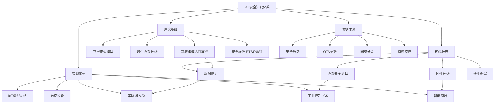
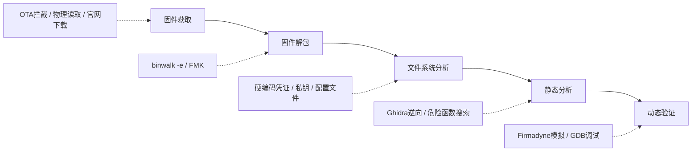
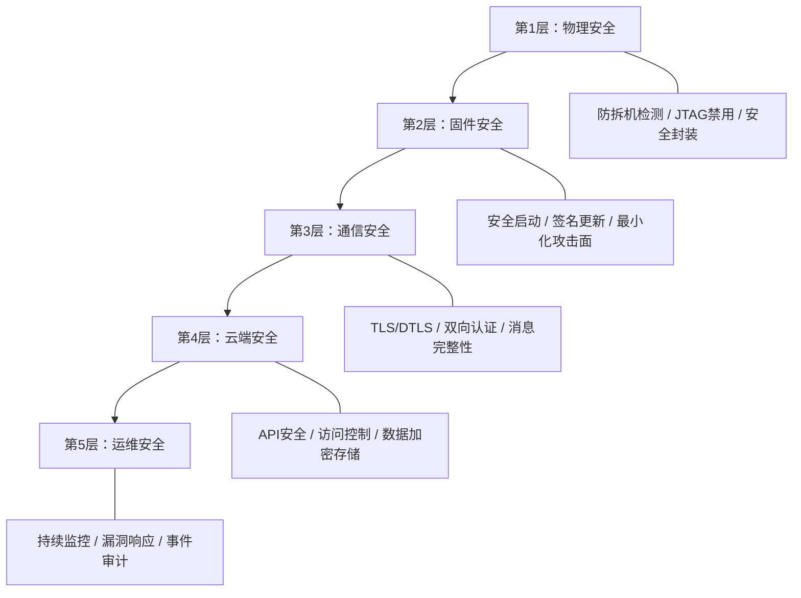
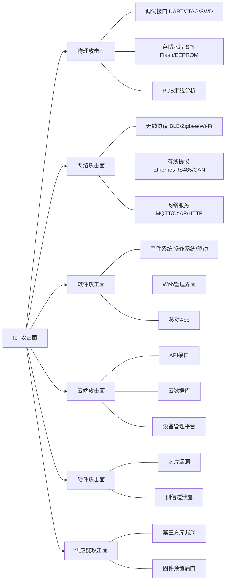
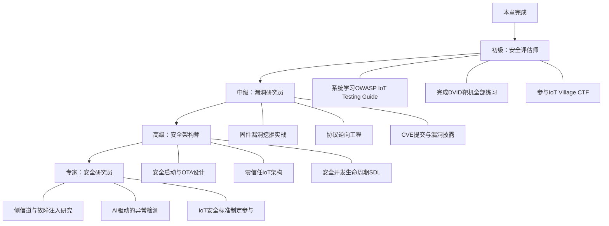

# 第22章 IoT安全 - 本章小结

## 一、知识体系全景

本章从"道法术器"四个层面系统构建了IoT安全知识体系：理论基础回答"为什么要关注IoT安全"，方法论回答"如何系统化评估安全风险"，核心技巧回答"用什么技术手段发现和利用漏洞"，工具与案例回答"在真实场景中如何落地"。以下知识图谱展示了各部分之间的逻辑关系：

## 二、核心知识回顾

### 2.1 IoT系统四层架构与安全风险

IoT系统由感知层、网络层、平台层和应用层组成。每一层的安全特性截然不同，攻击者只需突破其中一层即可横向扩展。理解四层架构是后续所有安全评估工作的基础：

| 层级 | 核心组件 | 典型攻击向量 | 关键防御措施 |
|------|----------|--------------|--------------|
| 感知层 | 传感器、MCU、执行器 | 物理篡改、侧信道攻击、固件提取 | 安全芯片、防篡改封装 |
| 网络层 | Wi-Fi/BLE/Zigbee/LoRa | 中间人攻击、协议漏洞、重放攻击 | TLS/DTLS、双向认证、消息完整性校验 |
| 平台层 | 云平台、边缘网关 | API滥用、未授权访问、注入攻击 | OAuth 2.0、API网关、输入校验 |
| 应用层 | Web/App、第三方集成 | XSS、CSRF、业务逻辑漏洞 | 安全编码、渗透测试、WAF |

### 2.2 通信协议安全对比

IoT协议种类繁多，安全特性差异显著。以下是主要协议的安全特征对比：

| 协议 | 传输层 | 默认加密 | 认证机制 | 典型风险 | 适用场景 |
|------|--------|----------|----------|----------|----------|
| MQTT | TCP | 否（需TLS） | 用户名/密码、Token | 明文凭证、匿名访问、Topic注入 | 云平台消息推送 |
| CoAP | UDP | DTLS可选 | PSK、RPK、X.509 | 无连接放大攻击、弱认证 | 低功耗传感器 |
| BLE | 2.4GHz | AES-CCM | 配对模式（Just Works等） | 配对嗅探、重放攻击 | 可穿戴设备、近距离通信 |
| Zigbee | 802.15.4 | AES-128 | 网络密钥、Link Key | 密钥分发泄露、重放攻击 | 智能家居网状网络 |
| LoRaWAN | LoRa | AES-128 | OTAA/ABP | 密钥管理薄弱、重放 | 远距离低功耗广域网 |

关键结论：**任何IoT协议默认配置都不安全**。MQTT和CoAP必须配合TLS/DTLS使用；BLE应避免使用"Just Works"配对模式；Zigbee需要确保Trust Center的密钥分发流程不被窃听。

### 2.3 固件安全分析核心流程

固件分析是IoT安全评估中最能发现高危漏洞的环节。核心流程为：

最常发现的三类高危漏洞：
1. **硬编码凭证**：固件中直接写入用户名、密码、API Key、TLS私钥，攻击者提取后可直接登录设备或伪装为合法客户端
2. **命令注入**：Web管理接口或配置处理逻辑中直接拼接用户输入到shell命令，攻击者可执行任意系统命令
3. **缓冲区溢出**：C/C++编写的固件二进制文件中缺乏边界检查，攻击者可通过精心构造的输入控制程序执行流

### 2.4 威胁建模方法

STRIDE模型是IoT威胁建模的标准框架，从六个维度系统化识别威胁：

| 威胁类型 | 含义 | IoT场景示例 | 对应防护 |
|----------|------|-------------|----------|
| Spoofing（仿冒） | 假冒身份 | 伪造BLE设备MAC地址、冒充OTA服务器 | 双向认证、证书固定 |
| Tampering（篡改） | 修改数据或代码 | 固件降级攻击、篡改传感器读数 | 安全启动、消息签名 |
| Repudiation（抵赖） | 否认操作 | 设备日志被清除后否认异常行为 | 不可篡改审计日志 |
| Information Disclosure（信息泄露） | 敏感数据暴露 | 明文传输用户数据、固件泄露私钥 | 端到端加密、密钥管理 |
| Denial of Service（拒绝服务） | 使服务不可用 | 洪水攻击MQTT Broker、耗尽设备电池 | 速率限制、网络隔离 |
| Elevation of Privilege（权限提升） | 获取更高权限 | 命令注入获取root、绕过Web认证 | 最小权限、输入校验 |

### 2.5 安全防护五层原则

IoT安全防护遵循纵深防御策略，五个层次缺一不可：

## 三、关键技能矩阵

完成本章学习后，应具备以下五项核心技能，按能力递进排列：

### 3.1 固件分析能力（基础→进阶）

| 级别 | 能力描述 | 对应工具 |
|------|----------|----------|
| 入门 | 使用binwalk解包固件，识别文件系统类型 | binwalk、file、strings |
| 中级 | 搜索硬编码凭证和敏感信息，分析启动脚本 | grep、正则表达式、Firmware-Mod-Kit |
| 高级 | 使用Ghidra/IDA逆向关键二进制函数，识别内存破坏漏洞 | Ghidra、IDA Pro、GDB |
| 专家 | 使用Firmadyne/FirmAE模拟固件运行，动态调试验证漏洞 | Firmadyne、QEMU、GDB远程调试 |

### 3.2 协议安全测试能力

| 级别 | 能力描述 | 对应工具 |
|------|----------|----------|
| 入门 | 捕获和解析MQTT/BLE/Zigbee流量 | Wireshark、nRF Connect |
| 中级 | 测试协议认证缺陷和配置弱点 | MQTT Explorer、GATTacker |
| 高级 | 重放攻击、中间人攻击、协议模糊测试 | Scapy、KillerBee、AFL |
| 专家 | 逆向私有协议、发现协议实现漏洞 | 自定义脚本、逻辑分析仪 |

### 3.3 漏洞挖掘与利用能力

| 级别 | 能力描述 | 典型漏洞类型 |
|------|----------|--------------|
| 入门 | 使用默认凭证和已知CVE测试 | 弱密码、未授权访问 |
| 中级 | Web接口安全测试（注入、遍历、认证绕过） | 命令注入、路径遍历、XSS |
| 高级 | 缓冲区溢出利用、ROP链构造 | 栈溢出、堆溢出、格式化字符串 |
| 专家 | 绕过安全启动、提取安全存储密钥 | 固件签名绕过、侧信道攻击 |

### 3.4 硬件安全测试能力

| 接口 | 测试方法 | 所需工具 |
|------|----------|----------|
| UART | 波特率探测、控制台登录、固件提取 | USB转TTL、minicom |
| JTAG | 调试连接、内存读写、断点调试 | JTAGulator、OpenOCD |
| SPI/I2C | Flash芯片读取、EEPROM数据提取 | CH341A、flashrom |
| PCB分析 | 走线追踪、芯片识别、信号分析 | 显微镜、逻辑分析仪 |

### 3.5 安全防护设计能力

| 层面 | 设计要点 | 实施标准 |
|------|----------|----------|
| 设备层 | 安全启动链、固件签名、硬件安全模块 | ETSI EN 303 645 |
| 通信层 | TLS/DTLS配置、证书管理、密钥轮转 | NIST SP 800-57 |
| 云端层 | API安全、访问控制、数据加密 | OWASP API Top 10 |
| 运维层 | OTA更新机制、安全监控、事件响应 | NIST IR 8259 |

## 四、IoT攻击面全景图

理解攻击面是制定有效测试策略的前提。IoT设备的攻击面远超传统IT系统，需要从六个维度进行系统化枚举：

## 五、实战要点提炼

### 5.1 IoT渗透测试标准流程

将本章所学技巧整合为一套可复用的评估流程：

**阶段一：信息收集（1-2天）**
1. 设备型号识别：通过标签、FCC ID、设备官网获取技术规格
2. 固件获取：官网下载、OTA URL抓取、物理芯片读取
3. 网络扫描：Nmap扫描开放端口和服务
4. 无线扫描：识别BLE/Zigbee/Wi-Fi接入点

**阶段二：静态分析（2-3天）**
1. 固件解包：binwalk提取文件系统
2. 凭证搜索：grep硬编码密码、私钥、Token
3. 配置审计：检查iptables规则、SSH配置、服务权限
4. 逆向分析：Ghidra分析关键二进制的危险函数调用

**阶段三：动态测试（2-3天）**
1. Web接口测试：认证绕过、命令注入、目录遍历
2. 协议测试：MQTT匿名连接、BLE配对绕过、Zigbee密钥提取
3. 固件模拟：Firmadyne运行固件，模拟漏洞触发
4. 硬件接口：UART控制台、JTAG调试、Flash读取

**阶段四：报告与修复（1天）**
1. 漏洞评级：使用CVSS评分系统
2. PoC编写：提供可复现的漏洞验证代码
3. 修复建议：针对每个漏洞给出具体修复方案
4. 合规映射：将发现映射到ETSI EN 303 645等标准条款

### 5.2 真实案例教训总结

| 案例 | 根本原因 | 关键教训 |
|------|----------|----------|
| Mirai僵尸网络 | 默认凭证未修改 + 数亿台设备暴露Telnet | 设备出厂必须强制修改密码，禁用Telnet |
| Stuxnet气隙攻击 | 隔离网络被U盘渗透 | 气隙网络仍需物理安全管控和设备管控 |
| 智能家居摄像头泄露 | 固件硬编码后门 + 明文传输视频流 | 固件必须签名验证，视频流必须加密传输 |
| 医疗设备远程操控 | Web接口命令注入 + 未授权访问 | 医疗设备需要独立网络分段和严格访问控制 |
| 工控PLC逻辑篡改 | S7协议缺乏认证 + 内网横向移动 | 工控协议需要加密认证，实施最小权限策略 |

## 六、安全标准与合规框架

IoT安全不仅是技术问题，更是合规问题。以下标准构成了全球IoT安全合规的基本框架：

| 标准/法规 | 制定机构 | 适用范围 | 核心要求 |
|-----------|----------|----------|----------|
| ETSI EN 303 645 | 欧洲电信标准化协会 | 消费类IoT设备 | 无默认密码、安全更新、最小攻击面、安全存储 |
| NIST IR 8259 | 美国国家标准与技术研究院 | IoT设备制造商 | 设备安全能力基线、漏洞披露机制 |
| IEC 62443 | 国际电工委员会 | 工业控制系统 | 分层安全架构、安全等级划分 |
| OWASP IoT Top 10 | 开放Web应用安全项目 | 通用IoT安全 | 十大安全风险清单和测试指南 |
| 中国《网络安全法》 | 全国人大常委会 | 中国境内所有网络设备 | 等级保护、漏洞通报、数据安全 |

## 七、自检清单

完成本章学习后，请逐一验证以下能力。建议通过实际操作而非回忆来评估：

### 理论理解
- [ ] 能够绘制IoT四层架构图并解释每层的安全风险
- [ ] 能够用STRIDE模型对一个IoT设备进行威胁建模
- [ ] 能够对比MQTT、CoAP、BLE、Zigbee的安全特性差异
- [ ] 能够解释安全启动链的工作原理

### 实操能力
- [ ] 能够使用binwalk解包固件并提取文件系统
- [ ] 能够在固件中搜索硬编码凭证和敏感信息
- [ ] 能够使用Wireshark捕获并解析MQTT/BLE流量
- [ ] 能够测试MQTT Broker的匿名访问和Topic权限
- [ ] 能够通过UART连接IoT设备并获取控制台访问

### 防护设计
- [ ] 能够为IoT设备设计网络分段方案
- [ ] 能够配置安全的MQTT Broker（TLS + ACL）
- [ ] 能够编写IoT安全评估报告模板
- [ ] 能够将发现的漏洞映射到ETSI EN 303 645条款

## 八、延伸学习路径

完成本章只是IoT安全学习的起点。以下路径帮助你从入门走向精通：

### 推荐学习资源

| 类型 | 资源 | 说明 |
|------|------|------|
| 书籍 | 《The IoT Hacker's Handbook》 | Attify出品，覆盖固件/协议/硬件全栈 |
| 书籍 | 《Practical IoT Hacking》 | No Starch Press，实战导向 |
| 靶机 | DVID (Damn Vulnerable IoT Device) | 开源IoT安全练习平台 |
| 社区 | IoT Village (DEF CON) | 年度IoT安全挑战赛和分享 |
| 标准 | OWASP IoT Testing Guide | 系统化测试方法论 |
| 工具集 | Attify IoT安全工具套件 | 商业级IoT安全测试工具 |

---

*本章从IoT安全的理论根基出发，经由核心技巧的反复锤炼，到实战案例的深度剖析，最终汇聚为系统化的安全评估能力和防护设计思维。IoT安全的特殊性在于它连接了数字世界与物理世界——一个被攻破的摄像头可能只是数据泄露，但一个被攻破的医疗设备或工业控制器可能危及生命。正是这种特殊性，使得IoT安全从业者肩负着比传统网络安全更沉重的责任。掌握本章知识只是起点，持续实践和深入研究才是成为IoT安全专家的必经之路。*
