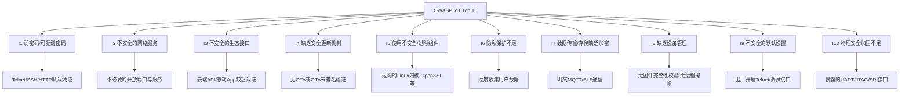
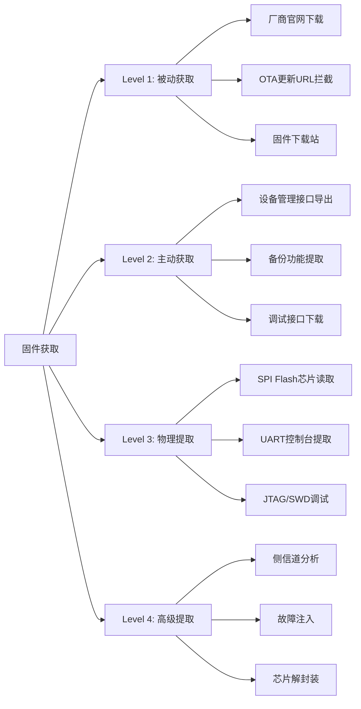
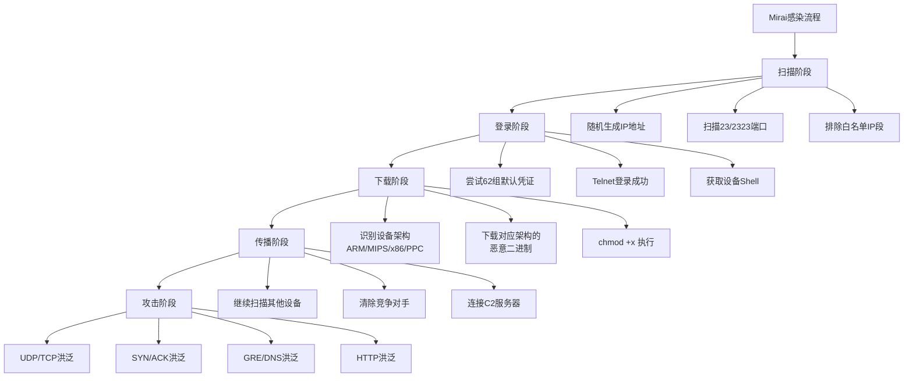
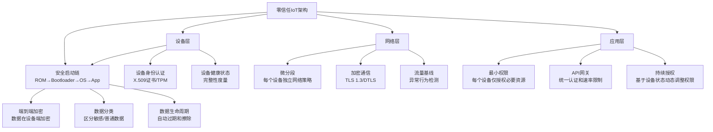

# 第22章 IoT安全 - 深度拓展

本章"深度拓展"旨在将前文覆盖的基础理论、核心技巧和实战案例向三个维度延伸：**纵向深入**（固件逆向工程从脚本自动化到手动调试的完整方法论）、**横向扩展**（OWASP IoT Top 10 系统化分析、真实 CVE 案例深度复盘）、**前沿追踪**（AIoT、车联网、工业 IoT、供应链安全的最新攻防态势）。内容面向已掌握本章基础知识、希望在 IoT 安全领域持续深耕的中高级从业者。

## 一、OWASP IoT Top 10 深度解析

OWASP（开放 Web 应用安全项目）发布的 IoT Top 10 是全球公认的 IoT 安全风险清单，每一条都对应着真实世界中被反复利用的攻击向量。与前文的威胁建模（STRIDE）不同，OWASP IoT Top 10 聚焦于**已观察到的高频漏洞类型**，更具实操指导意义。

### 1.1 完整风险清单与攻击原理



### 1.2 每条风险的深度剖析

**I1：弱密码 / 可猜测密码**

这是 IoT 安全中最普遍、最致命的问题，也是 Mirai 僵尸网络成功的核心原因。问题根因在于三方面：厂商为降低售后成本使用统一默认密码；设备资源受限无法运行复杂的密码策略引擎；用户安全意识薄弱不主动修改。

```bash
# 真实世界中的默认凭证数据库（部分示例）
# 来源：https://github.com/ihebski/DefaultCreds-cheat-sheet

# 常见IoT设备默认凭证
# TP-Link路由器: admin/admin
# D-Link路由器: admin/(空密码)
# Hikvision摄像头: admin/12345
# Dahua摄像头: admin/admin
# Netgear路由器: admin/password
# Linksys路由器: admin/admin
# Huawei路由器: admin/admin
# ZTE路由器: user/user

# 使用RouterSploit进行默认凭证扫描
pip3 install routersploit
rsf > use scanners/autopwn
rsf > set target 192.168.1.1
rsf > run

# 使用nmap脚本检测默认凭证
nmap --script http-default-accounts -p 80,443,8080 192.168.1.0/24
```

**修复方案**：设备首次启动时强制用户设置唯一密码（ETSI EN 303 645 第5.1条要求）；使用随机生成的唯一初始密码印在设备标签上；支持密码复杂度策略；禁止使用硬编码后门凭证。

**I2：不安全的网络服务**

许多 IoT 设备运行着不必要的网络服务，如 Telnet（23）、FTP（21）、UPnP（1900）、mDNS（5353）等。这些服务扩大了攻击面，且往往缺乏认证或使用明文传输。

```bash
# 使用nmap全面扫描IoT设备开放端口
nmap -sV -sC -p- --open target-ip

# 检测UPnP服务（常见于智能家居设备）
nmap -sU -p 1900 --script upnp-info target-ip

# 检测mDNS服务发现
nmap -sU -p 5353 --script dns-service-discovery target-ip

# 检测CoAP服务
nmap -sU -p 5683 --script coap-resources target-ip

# 使用Shodan搜索暴露在互联网上的IoT设备
# 搜索语法: port:23 "login" "password"
# 搜索语法: port:554 "RTSP" "Dahua"
# 搜索语法: port:1883 "MQTT"
```

**I3：不安全的生态接口**

IoT 设备的生态系统包括设备本身的 API、云端 API、移动 App 和第三方集成。任何一个接口的薄弱环节都可能成为攻击入口。典型案例：2019 年 Ring 门铃因云端 API 缺乏速率限制，导致攻击者可以无限次尝试暴力破解用户密码。

**I4：缺乏安全更新机制**

固件更新是修复已知漏洞的唯一途径。许多 IoT 设备不支持 OTA 更新，或更新过程中缺乏签名验证，攻击者可以推送恶意固件实现永久性后门植入。

```bash
# 固件更新安全检查清单
# 1. 更新包是否经过数字签名？
#    → 使用RSA/ECDSA签名，设备端验证签名后才安装
# 2. 更新通道是否使用TLS加密？
#    → 防止中间人篡改更新包
# 3. 是否支持回滚保护？
#    → 防止降级攻击（刷入旧版有漏洞的固件）
# 4. 更新失败是否有恢复机制？
#    → 双分区方案：A/B分区，更新失败可回退
# 5. 更新日志是否可审计？
#    → 记录更新时间、版本、来源

# 模拟固件签名验证（概念代码）
# 使用ed25519进行固件签名
openssl genpkey -algorithm ED25519 -out private.pem
openssl pkey -in private.pem -pubout -out public.pem

# 签名固件
openssl pkeyutl -sign -inkey private.pem -in firmware.bin \
  -out firmware.sig

# 验证签名（设备端逻辑）
openssl pkeyutl -verify -pubin -inkey public.pem \
  -in firmware.bin -sigfile firmware.sig
```

**I5-I10 的关键防护措施**

| 风险编号 | 风险名称 | 核心防护措施 | 验证方法 |
|----------|----------|-------------|----------|
| I5 | 使用不安全/过时组件 | 建立SBOM（软件物料清单），定期扫描CVE | `grype sbom:sbom.json` 扫描已知漏洞 |
| I6 | 隐私保护不足 | 数据最小化原则，GDPR/CCPA合规审计 | 隐私影响评估(PIA)报告 |
| I7 | 数据传输/存储缺乏加密 | TLS 1.2+传输加密，AES-256存储加密 | Wireshark抓包验证无明文 |
| I8 | 缺乏设备管理 | 远程擦除、设备状态监控、证书轮转 | 设备生命周期管理平台 |
| I9 | 不安全的默认设置 | 出厂即安全(Secure by Default) | 首次启动安全配置向导 |
| I10 | 物理安全加固不足 | JTAG熔断、防拆检测、安全封装 | 物理拆解测试 |

## 二、固件逆向工程深度技术

### 2.1 固件获取的完整方法论

固件获取是逆向分析的第一步，也是最考验经验的环节。获取方法按难度和适用场景分为四级：



**Level 1：被动获取（无需接触设备）**

```bash
# 方法1：从厂商官网下载
# 大多数路由器、摄像头厂商提供固件下载页面
# 搜索语法: "设备型号" + "firmware" + "download"

# 方法2：拦截OTA更新流量
# 步骤：配置中间人代理 → 触发设备检查更新 → 从流量中提取固件URL
mitmproxy -p 8080 --mode transparent
# 触发设备更新后，在mitmproxy界面找到固件下载请求
# 或使用tcpdump直接抓包
tcpdump -i eth0 -w capture.pcap host update-server.com
# 从pcap中提取HTTP对象
binwalk -e capture.pcap

# 方法3：从固件下载站获取
# https://firmware.meraki.io/ (Meraki设备)
# https://downloads.openwrt.org/ (OpenWrt)
# https://archive.openwrt.org/ (历史版本)
```

**Level 2：主动获取（需要设备访问权限）**

```bash
# 方法4：通过设备Web管理接口导出
# 许多路由器提供"备份配置"或"导出固件"功能
curl -u admin:password http://192.168.1.1/backup/config.bin -o config.bin
binwalk config.bin  # 分析备份文件格式

# 方法5：通过SSH/Telnet提取（如果已获取访问权限）
ssh root@192.168.1.1
# 登录后使用dd命令读取整个Flash
dd if=/dev/mtd0 of=/tmp/firmware.bin bs=1M
# 或逐分区读取
cat /proc/mtd
# dev:    size   erasesize  name
# mtd0: 00040000 00010000 "bootloader"
# mtd1: 00f80000 00010000 "firmware"
# mtd2: 00040000 00010000 "config"
dd if=/dev/mtd1 of=/tmp/firmware.bin bs=65536
```

**Level 3：物理提取（需要硬件工具）**

```bash
# 方法6：SPI Flash芯片读取
# 识别Flash芯片型号（常见：W25Q64, MX25L12845E）
# 使用CH341A编程器 + SOIC8测试夹连接芯片引脚

# 使用flashrom读取
flashrom -p ch341a_spi -r firmware_backup.bin
# 验证读取结果（读取两次比较）
flashrom -p ch341a_spi -r firmware_verify.bin
md5sum firmware_backup.bin firmware_verify.bin
# 两次MD5相同则读取成功

# 使用Universal Programmer（支持更多芯片）
# 如AsProgrammer、NeoProgrammer等Windows工具

# 方法7：UART控制台提取
# 识别UART引脚（参考练习方法章节的UART识别流程）
screen /dev/ttyUSB0 115200
# 登录后提取固件（同Level 2的dd方法）

# 方法8：JTAG/SWD调试提取
# 使用OpenOCD连接
openocd -f interface/stlink.cfg -f target/stm32f1x.cfg
# 另开终端使用GDB连接
gdb-multiarch
(gdb) target remote :3333
(gdb) dump binary memory firmware.bin 0x08000000 0x08100000
```

### 2.2 固件解包与文件系统分析

固件解包是静态分析的基础。不同厂商使用不同的固件格式和文件系统，需要灵活应对。

```bash
# binwalk：固件分析的瑞士军刀
binwalk firmware.bin
# 常见输出格式：
# DECIMAL       HEXADECIMAL     DESCRIPTION
# 0             0x0             TP-Link firmware header
# 512           0x200           LZMA compressed data
# 1048576       0x100000        Squashfs filesystem, little endian

# 提取文件系统
binwalk -e firmware.bin
# 如果自动提取失败，尝试手动指定偏移
dd if=firmware.bin bs=1 skip=1048576 of=filesystem.squashfs
unsquashfs filesystem.squashfs

# 处理非标准文件系统
# 使用sasquatch处理修改过的SquashFS
sudo apt install sasquatch
sasquatch filesystem.squashfs

# 使用jefferson处理JFFS2
sudo apt install jefferson
jefferson -d output_dir firmware.jffs2

# 使用ubireader处理UBIFS
pip3 install ubi_reader
ubireader_extract_images firmware.ubi

# 固件仿真（无需真实硬件运行固件）
# 使用FirmAE（改进版Firmadyne）
git clone https://github.com/pr0v3rbs/FirmAE.git
cd FirmAE && ./setup.sh
sudo ./run.sh -r <brand> ../firmware.bin
# -r: 运行模式（-c检查，-r运行，-a分析）
```

### 2.3 固件静态分析实战

```python
#!/usr/bin/env python3
"""
IoT固件综合安全分析工具
功能：硬编码凭证搜索、危险函数识别、敏感文件发现、网络指标提取
"""

import re
import os
import sys
import json
from pathlib import Path
from collections import defaultdict

class FirmwareAnalyzer:
    def __init__(self, firmware_path):
        self.firmware_path = firmware_path
        self.findings = defaultdict(list)

    def extract_credentials(self):
        """搜索硬编码凭证（密码、API Key、Token、私钥）"""
        with open(self.firmware_path, 'rb') as f:
            content = f.read()

        patterns = {
            'password': [
                rb'password[=:]\s*[^\x00\n]{3,30}',
                rb'passwd[=:]\s*[^\x00\n]{3,30}',
                rb'pwd[=:]\s*[^\x00\n]{3,30}',
            ],
            'username': [
                rb'username[=:]\s*[^\x00\n]{3,20}',
                rb'user[=:]\s*[^\x00\n]{3,20}',
                rb'login[=:]\s*[^\x00\n]{3,20}',
            ],
            'api_key': [
                rb'api[_-]?key[=:]\s*[^\x00\n]{10,64}',
                rb'apikey[=:]\s*[^\x00\n]{10,64}',
                rb'api[_-]?secret[=:]\s*[^\x00\n]{10,64}',
            ],
            'token': [
                rb'token[=:]\s*[^\x00\n]{10,128}',
                rb'bearer[=:]\s*[^\x00\n]{10,128}',
                rb'jwt[=:]\s*[^\x00\n]{10,512}',
            ],
            'private_key': [
                rb'-----BEGIN\s+(RSA\s+)?PRIVATE\s+KEY-----',
                rb'-----BEGIN\s+EC\s+PRIVATE\s+KEY-----',
            ],
            'aws_credentials': [
                rb'AKIA[0-9A-Z]{16}',  # AWS Access Key ID
                rb'aws[_-]?access[_-]?key[_-]?id[=:]\s*[^\x00\n]{10,30}',
                rb'aws[_-]?secret[_-]?access[_-]?key[=:]\s*[^\x00\n]{10,50}',
            ],
        }

        for category, pattern_list in patterns.items():
            for pattern in pattern_list:
                matches = re.findall(pattern, content, re.IGNORECASE)
                for match in matches:
                    decoded = match.decode('utf-8', errors='ignore')
                    self.findings['credentials'].append({
                        'type': category,
                        'value': decoded[:80] + ('...' if len(decoded) > 80 else ''),
                    })

        return self.findings['credentials']

    def find_dangerous_functions(self):
        """搜索危险函数调用（命令注入、缓冲区溢出风险）"""
        with open(self.firmware_path, 'rb') as f:
            content = f.read()

        # C语言危险函数：不检查边界、直接拼接命令
        dangerous_funcs = {
            # 命令注入风险
            'command_injection': [
                b'system', b'popen', b'exec', b'execve',
                b'execl', b'execlp', b'execle',
                b'shell_exec', b'passthru',
            ],
            # 缓冲区溢出风险
            'buffer_overflow': [
                b'strcpy', b'strcat', b'sprintf', b'vsprintf',
                b'gets', b'scanf', b'strncpy',
            ],
            # 格式化字符串风险
            'format_string': [
                b'printf', b'fprintf', b'syslog',
            ],
        }

        for vuln_type, funcs in dangerous_funcs.items():
            for func in funcs:
                # 搜索函数名在二进制中的出现
                count = content.count(func)
                if count > 0:
                    self.findings['dangerous_functions'].append({
                        'function': func.decode(),
                        'type': vuln_type,
                        'occurrences': count,
                        'risk': 'HIGH' if vuln_type == 'command_injection' else 'MEDIUM',
                    })

        return self.findings['dangerous_functions']

    def find_sensitive_files(self, extracted_dir):
        """在提取的文件系统中搜索敏感文件"""
        sensitive_patterns = [
            '*.pem', '*.key', '*.crt', '*.p12', '*.pfx',
            'id_rsa', 'id_dsa', 'id_ecdsa', 'id_ed25519',
            '*.db', '*.sqlite', '*.sqlite3',
            '*.conf', '*.cfg', '*.ini',
            'shadow', 'passwd',
            '*.bak', '*.old', '*.tmp',
        ]

        for pattern in sensitive_patterns:
            for file_path in Path(extracted_dir).rglob(pattern):
                self.findings['sensitive_files'].append({
                    'path': str(file_path),
                    'size': file_path.stat().st_size,
                    'type': pattern,
                })

        return self.findings['sensitive_files']

    def extract_network_indicators(self):
        """提取网络指标（IP地址、URL、域名）"""
        with open(self.firmware_path, 'rb') as f:
            content = f.read()

        # IP地址模式
        ip_pattern = rb'(?:\d{1,3}\.){3}\d{1,3}'
        ips = set(re.findall(ip_pattern, content))
        # 过滤无效IP
        valid_ips = []
        for ip in ips:
            parts = ip.decode().split('.')
            if all(0 <= int(p) <= 255 for p in parts):
                if ip.decode() not in ('0.0.0.0', '255.255.255.255', '127.0.0.1'):
                    valid_ips.append(ip.decode())

        # URL模式
        url_pattern = rb'https?://[^\x00\x20\x22\x27<>]{5,200}'
        urls = [u.decode('utf-8', errors='ignore') for u in re.findall(url_pattern, content)]

        # 域名模式
        domain_pattern = rb'[a-zA-Z0-9][-a-zA-Z0-9]*\.(com|net|org|io|cn|cc|xyz)'
        domains = list(set(d.decode() for d in re.findall(domain_pattern, content)))

        self.findings['network'] = {
            'ip_addresses': list(set(valid_ips))[:50],
            'urls': list(set(urls))[:50],
            'domains': list(set(domains))[:50],
        }

        return self.findings['network']

    def generate_report(self):
        """生成综合分析报告"""
        report = {
            'firmware': self.firmware_path,
            'summary': {
                'credentials_found': len(self.findings.get('credentials', [])),
                'dangerous_functions': len(self.findings.get('dangerous_functions', [])),
                'sensitive_files': len(self.findings.get('sensitive_files', [])),
                'ip_addresses': len(self.findings.get('network', {}).get('ip_addresses', [])),
                'urls': len(self.findings.get('network', {}).get('urls', [])),
            },
            'details': dict(self.findings),
        }
        return json.dumps(report, indent=2, ensure_ascii=False)


# 使用示例
if __name__ == '__main__':
    if len(sys.argv) < 2:
        print("用法: python3 firmware_analyzer.py <firmware.bin> [extracted_dir]")
        sys.exit(1)

    analyzer = FirmwareAnalyzer(sys.argv[1])
    analyzer.extract_credentials()
    analyzer.find_dangerous_functions()
    analyzer.extract_network_indicators()

    if len(sys.argv) > 2:
        analyzer.find_sensitive_files(sys.argv[2])

    print(analyzer.generate_report())
```

### 2.4 固件动态分析与仿真

静态分析只能看到代码结构，动态分析才能观察运行时行为。当没有真实硬件时，固件仿真是最有效的替代方案。

```bash
# FirmAE：自动化固件仿真分析
# 原理：提取固件文件系统 → 注入hook库 → QEMU模拟运行 → 自动配置网络

# 基本用法
sudo ./run.sh -r <brand> ../firmware.bin
# -c: 仅检查是否可模拟
# -r: 运行固件并启动Web界面
# -a: 运行并自动分析（推荐）

# 常见品牌名
# dlink, netgear, asus, tplink, linksys, tenda, etc.

# 固件模拟后的调试
# 1. 使用GDB远程调试
gdb-multiarch
(gdb) set architecture mips
(gdb) target remote 192.168.0.1:1234
(gdb) break *0x00401234
(gdb) continue

# 2. 使用strace跟踪系统调用
# 在QEMU中运行固件二进制时添加strace
qemu-mips-static -strace ./usr/bin/httpd

# 3. 使用Frida进行动态插桩
# 需要在QEMU环境中安装Frida server
# 然后在分析主机上连接
frida -H 192.168.0.1:27042 -n httpd
```

### 2.5 Ghidra 固件逆向进阶

```python
# Ghidra脚本：自动化识别IoT固件中的危险函数调用
# 在Ghidra Script Manager中运行此脚本

# @category IoT Security
# @author Security Analyst

from ghidra.program.model.symbol import RefType
from ghidra.app.decompiler import DecompInterface

def find_dangerous_calls():
    """搜索固件中对危险函数的调用"""
    dangerous_functions = [
        'system', 'popen', 'exec', 'execve',
        'strcpy', 'strcat', 'sprintf', 'gets',
        'scanf', 'memcpy', 'memset',
    ]

    results = []
    listing = currentProgram.getListing()
    func_manager = currentProgram.getFunctionManager()

    for func in func_manager.getFunctions(True):
        func_name = func.getName()
        if func_name in dangerous_functions:
            # 获取所有对该函数的引用
            refs = getReferencesTo(func.getEntryPoint())
            for ref in refs:
                caller_addr = ref.getFromAddress()
                caller_func = getFunctionContaining(caller_addr)
                if caller_func:
                    results.append({
                        'dangerous_func': func_name,
                        'caller': caller_func.getName(),
                        'address': str(caller_addr),
                        'risk': classify_risk(func_name),
                    })

    # 输出结果
    print("=== IoT固件危险函数调用分析 ===")
    for r in results:
        print("[{}] {} -> {} @ {}".format(
            r['risk'], r['caller'], r['dangerous_func'], r['address']))

    return results

def classify_risk(func_name):
    """根据函数类型分类风险等级"""
    high_risk = ['system', 'popen', 'exec', 'execve']
    medium_risk = ['strcpy', 'strcat', 'sprintf', 'gets']
    if func_name in high_risk:
        return 'HIGH'
    elif func_name in medium_risk:
        return 'MEDIUM'
    return 'LOW'

find_dangerous_calls()
```

## 三、通信协议安全深度分析

### 3.1 MQTT 协议安全攻防

MQTT 是 IoT 领域最广泛使用的消息协议，但其默认配置几乎没有任何安全保护。理解 MQTT 的安全机制和攻击方法是 IoT 安全评估的基本功。

```python
#!/usr/bin/env python3
"""
MQTT协议安全综合测试工具
功能：匿名访问测试、主题枚举、消息注入、认证爆破、ACL测试
"""

import paho.mqtt.client as mqtt
import ssl
import time
import json
import sys
from concurrent.futures import ThreadPoolExecutor

class MQTTSecurityTester:
    def __init__(self, broker, port=1883, username=None, password=None):
        self.broker = broker
        self.port = port
        self.username = username
        self.password = password
        self.discovered_topics = []
        self.intercepted_messages = []

    def test_anonymous_access(self):
        """测试Broker是否允许匿名连接"""
        client = mqtt.Client(client_id="security_test", clean_session=True)
        try:
            client.connect(self.broker, self.port, keepalive=10)
            client.loop_start()
            time.sleep(2)
            client.loop_stop()
            client.disconnect()
            return {
                'anonymous_access': True,
                'severity': 'HIGH',
                'description': 'MQTT Broker允许匿名连接，攻击者可读取/发布所有消息',
            }
        except Exception as e:
            return {
                'anonymous_access': False,
                'description': f'匿名连接被拒绝: {str(e)}',
            }

    def test_default_credentials(self):
        """测试常见MQTT默认凭证"""
        default_creds = [
            ('admin', 'admin'),
            ('admin', 'password'),
            ('mqtt', 'mqtt'),
            ('root', 'root'),
            ('user', 'user'),
            ('guest', 'guest'),
            ('admin', ''),
            ('', ''),  # 空用户名空密码
        ]

        valid_creds = []
        for username, password in default_creds:
            client = mqtt.Client(client_id=f"test_{username}")
            if username:
                client.username_pw_set(username, password)
            try:
                client.connect(self.broker, self.port, keepalive=5)
                client.loop_start()
                time.sleep(1)
                client.loop_stop()
                client.disconnect()
                valid_creds.append({'username': username, 'password': password})
            except:
                pass

        return {
            'default_credentials_found': len(valid_creds) > 0,
            'valid_credentials': valid_creds,
            'severity': 'CRITICAL' if valid_creds else 'PASS',
        }

    def enumerate_topics(self, duration=30):
        """使用通配符订阅枚举所有活跃主题"""
        client = mqtt.Client(client_id="topic_enumerator")
        if self.username:
            client.username_pw_set(self.username, self.password)

        topics = []
        def on_message(client, userdata, msg):
            topic_info = {
                'topic': msg.topic,
                'payload_preview': msg.payload[:100].decode('utf-8', errors='ignore'),
                'qos': msg.qos,
                'retain': msg.retain,
            }
            if topic_info not in topics:
                topics.append(topic_info)

        client.on_message = on_message
        try:
            client.connect(self.broker, self.port, keepalive=60)
            client.subscribe("#", qos=1)  # 订阅所有主题
            client.loop_start()
            time.sleep(duration)
            client.loop_stop()
            client.disconnect()
        except Exception as e:
            return {'error': str(e)}

        self.discovered_topics = topics
        return {
            'topics_found': len(topics),
            'topics': topics[:100],
            'severity': 'HIGH' if len(topics) > 0 else 'PASS',
        }

    def test_topic_publish(self, topic, payload):
        """测试是否可以向指定主题发布消息（消息注入）"""
        client = mqtt.Client(client_id="injector")
        if self.username:
            client.username_pw_set(self.username, self.password)

        try:
            client.connect(self.broker, self.port, keepalive=5)
            result = client.publish(topic, payload, qos=1)
            result.wait_for_publish(timeout=5)
            client.disconnect()
            return {
                'publish_allowed': True,
                'topic': topic,
                'severity': 'CRITICAL',
                'description': f'可以向 {topic} 注入消息，可能导致设备被控',
            }
        except Exception as e:
            return {
                'publish_allowed': False,
                'description': f'发布被拒绝: {str(e)}',
            }

    def test_tls_support(self):
        """测试Broker是否支持TLS加密"""
        results = {}

        # 测试非加密端口
        client_plain = mqtt.Client(client_id="tls_test_plain")
        try:
            client_plain.connect(self.broker, self.port, keepalive=5)
            client_plain.disconnect()
            results['plaintext_available'] = True
            results['severity'] = 'HIGH'
        except:
            results['plaintext_available'] = False

        # 测试TLS端口（8883）
        client_tls = mqtt.Client(client_id="tls_test_tls")
        client_tls.tls_set(cert_reqs=ssl.CERT_NONE)
        client_tls.tls_insecure_set(True)
        try:
            client_tls.connect(self.broker, 8883, keepalive=5)
            client_tls.disconnect()
            results['tls_available'] = True
        except:
            results['tls_available'] = False

        return results

    def run_full_assessment(self):
        """运行完整的MQTT安全评估"""
        print(f"[*] 开始MQTT安全评估: {self.broker}:{self.port}")
        print("=" * 60)

        results = {
            'target': f'{self.broker}:{self.port}',
            'tests': {},
        }

        # 测试1：匿名访问
        print("[+] 测试匿名访问...")
        results['tests']['anonymous'] = self.test_anonymous_access()

        # 测试2：默认凭证
        print("[+] 测试默认凭证...")
        results['tests']['default_creds'] = self.test_default_credentials()

        # 测试3：TLS支持
        print("[+] 测试TLS支持...")
        results['tests']['tls'] = self.test_tls_support()

        # 测试4：主题枚举
        print("[+] 枚举活跃主题（30秒）...")
        results['tests']['topics'] = self.enumerate_topics(duration=30)

        # 测试5：消息注入
        print("[+] 测试消息注入...")
        results['tests']['injection'] = self.test_topic_publish(
            "test/security/assessment", "security_test_payload")

        # 输出结果
        print("\n" + "=" * 60)
        print("[*] 评估结果摘要:")
        for test_name, result in results['tests'].items():
            severity = result.get('severity', 'INFO')
            print(f"  [{severity}] {test_name}")

        return results


if __name__ == '__main__':
    if len(sys.argv) < 2:
        print("用法: python3 mqtt_security_test.py <broker_ip> [port]")
        sys.exit(1)

    broker = sys.argv[1]
    port = int(sys.argv[2]) if len(sys.argv) > 2 else 1883

    tester = MQTTSecurityTester(broker, port)
    results = tester.run_full_assessment()
    print(json.dumps(results, indent=2, ensure_ascii=False))
```

### 3.2 BLE 安全深度分析

BLE（蓝牙低功耗）协议的安全性远比大多数人想象的复杂。其安全机制依赖于配对过程，而配对模式的选择直接决定了安全等级。

```python
#!/usr/bin/env python3
"""
BLE设备安全综合评估工具
功能：设备扫描、GATT服务枚举、配对模式分析、特征值读写测试
"""

import asyncio
import struct
import sys
from bleak import BleakScanner, BleakClient

class BLESecurityAssessor:
    def __init__(self, target_address=None):
        self.target = target_address
        self.findings = []

    async def scan_devices(self, duration=15):
        """扫描周围BLE设备并收集安全相关信息"""
        print(f"[*] 扫描BLE设备（{duration}秒）...")
        devices = await BleakScanner.discover(timeout=duration, return_adv=True)

        results = []
        for address, (device, adv_data) in devices.items():
            device_info = {
                'address': address,
                'name': device.name or 'Unknown',
                'rssi': adv_data.rssi,
                'address_type': device.address_type,
                'is_random_address': 'random' in str(device.address_type).lower(),
                'service_uuids': adv_data.service_uuids,
                'manufacturer_data': list(adv_data.manufacturer_data.keys()),
            }

            # 安全评估：随机地址比公共地址更隐私
            if device_info['is_random_address']:
                device_info['privacy'] = 'GOOD - 使用随机地址'
            else:
                device_info['privacy'] = 'WARNING - 使用公共地址，易被追踪'

            results.append(device_info)

        return results

    async def enumerate_services(self, address):
        """枚举目标设备的GATT服务和特征值"""
        print(f"[*] 枚举 {address} 的GATT服务...")
        services_data = []

        async with BleakClient(address, timeout=20) as client:
            for service in client.services:
                service_info = {
                    'uuid': str(service.uuid),
                    'description': service.description,
                    'characteristics': [],
                }

                for char in service.characteristics:
                    char_info = {
                        'uuid': str(char.uuid),
                        'handle': char.handle,
                        'properties': list(char.properties),
                        'description': char.description,
                    }

                    # 安全评估：检查敏感特征值的访问控制
                    if 'read' in char.properties:
                        try:
                            value = await client.read_gatt_char(char.uuid)
                            char_info['value'] = value.hex()
                            char_info['value_ascii'] = value.decode(
                                'ascii', errors='replace')

                            # 检测是否包含敏感数据
                            if self._is_sensitive_value(value, char.uuid):
                                self.findings.append({
                                    'severity': 'HIGH',
                                    'type': 'sensitive_data_readable',
                                    'description': f'敏感特征值 {char.uuid} 可未认证读取',
                                    'value_preview': value[:50].hex(),
                                })
                        except Exception as e:
                            char_info['read_error'] = str(e)

                    # 检测可写特征值（可能被注入恶意命令）
                    if 'write' in char.properties or 'write-no-response' in char.properties:
                        self.findings.append({
                            'severity': 'MEDIUM',
                            'type': 'writable_characteristic',
                            'description': f'特征值 {char.uuid} 可写，可能被注入恶意数据',
                        })

                    # 检测通知/指示（可能泄露实时数据）
                    if 'notify' in char.properties or 'indicate' in char.properties:
                        char_info['can_subscribe'] = True

                    service_info['characteristics'].append(char_info)

                services_data.append(service_info)

        return services_data

    def _is_sensitive_value(self, value, uuid):
        """判断特征值是否包含敏感数据"""
        sensitive_keywords = [
            b'password', b'secret', b'token', b'key',
            b'admin', b'root', b'wifi', b'ssid',
        ]
        value_lower = value.lower()
        return any(kw in value_lower for kw in sensitive_keywords)

    def analyze_pairing_security(self, address):
        """分析BLE配对安全（需要嗅探配对过程）"""
        # 注意：完整的配对分析需要使用nRF52840 + Sniffle固件捕获配对过程
        # 这里提供分析框架

        pairing_analysis = {
            'methods': {
                'Just Works': {
                    'security': 'LOW',
                    'mitm_protection': False,
                    'description': '无MITM保护，适合无输入/输出能力的设备',
                },
                'Passkey Entry': {
                    'security': 'MEDIUM',
                    'mitm_protection': True,
                    'description': '6位数字配对，需要输入/显示能力',
                },
                'Numeric Comparison': {
                    'security': 'MEDIUM',
                    'mitm_protection': True,
                    'description': 'BLE 4.2+，两端显示数字确认',
                },
                'Out of Band (OOB)': {
                    'security': 'HIGH',
                    'mitm_protection': True,
                    'description': '通过NFC等辅助通道交换密钥',
                },
            },
            'recommendations': [
                '使用BLE 4.2+的Secure Connections模式',
                '避免使用Just Works配对（无MITM保护）',
                '实现绑定(Bonding)以存储长期密钥',
                '使用随机地址防止追踪',
            ],
        }

        return pairing_analysis

    async def full_assessment(self, address=None):
        """运行完整的BLE安全评估"""
        target = address or self.target

        print(f"[*] BLE安全评估: {target}")
        print("=" * 60)

        # 步骤1：扫描设备
        devices = await self.scan_devices()
        print(f"[+] 发现 {len(devices)} 个BLE设备")

        if not target:
            for dev in devices:
                print(f"  {dev['address']} - {dev['name']} (RSSI: {dev['rssi']})")
            return devices

        # 步骤2：枚举服务
        services = await self.enumerate_services(target)
        print(f"[+] 发现 {sum(len(s['characteristics']) for s in services)} 个特征值")

        # 步骤3：输出发现的安全问题
        if self.findings:
            print(f"\n[!] 发现 {len(self.findings)} 个安全问题:")
            for finding in self.findings:
                print(f"  [{finding['severity']}] {finding['description']}")

        return {
            'devices': devices,
            'services': services,
            'findings': self.findings,
        }


async def main():
    if len(sys.argv) < 2:
        print("用法: python3 ble_security_assessor.py <target_mac>")
        print("      python3 ble_security_assessor.py --scan")
        sys.exit(1)

    assessor = BLESecurityAssessor()

    if sys.argv[1] == '--scan':
        devices = await assessor.scan_devices()
        for dev in devices:
            print(f"  {dev['address']}  {dev['name']:30s}  RSSI:{dev['rssi']}  {dev['privacy']}")
    else:
        result = await assessor.full_assessment(sys.argv[1])
        print(json.dumps(result, indent=2, default=str, ensure_ascii=False))

if __name__ == '__main__':
    asyncio.run(main())
```

### 3.3 Zigbee 安全分析进阶

```bash
# Zigbee安全分析完整流程
# 所需硬件：CC2531 USB Dongle + CC Debugger

# 步骤1：环境准备
git clone https://github.com/riverloopsec/killerbee.git
cd killerbee && sudo pip3 install .
# 为CC2531刷入Packet Sniffer固件

# 步骤2：扫描Zigbee网络
sudo zbstumbler
# 输出：发现的Zigbee网络、信道、PAN ID

# 步骤3：抓取Zigbee数据包
sudo zbdump -f 2405 -c 11 -w zigbee_capture.pcap
# -f: 频率(MHz)，-c: 信道号，-w: 输出文件

# 步骤4：分析Zigbee协议
# 使用Wireshark打开捕获文件
wireshark zigbee_capture.pcap &
# 过滤器：
#   zbee_nwk - 网络层
#   zbee_aps - 应用层
#   zbee_sec - 安全层

# 步骤5：密钥提取（如果使用已知密钥）
# 方法A：从设备固件中提取网络密钥
# 方法B：使用KillerBee的密钥恢复功能
sudo zbkey -f zigbee_capture.pcap

# 步骤6：重放攻击
sudo zbreplay -f zigbee_capture.pcap -c 11
# 注意：重放攻击对加密帧无效，需要先解密

# 步骤7：Zigbee fuzzing（发现协议实现漏洞）
sudo zbfuzz -c 11 -n 1000
# -n: 发送帧数量
```

### 3.4 LoRaWAN 安全分析

```python
#!/usr/bin/env python3
"""
LoRaWAN协议安全分析工具
LoRaWAN用于远距离低功耗广域网，常见于智慧城市、农业物联网
"""

import struct
import hashlib
import hmac

class LoRaWANAnalyzer:
    """
    LoRaWAN安全机制分析
    LoRaWAN使用两层加密：
    1. Network Session Key (NwkSKey) - 网络层完整性校验
    2. Application Session Key (AppSKey) - 应用层数据加密
    """

    def __init__(self):
        self.activation_methods = {
            'OTAA': {
                'name': 'Over-The-Air Activation',
                'security': 'HIGH',
                'description': '设备每次加入网络时动态生成会话密钥',
                'key_components': ['AppKey (根密钥)', 'DevNonce (随机数)', 'AppNonce'],
            },
            'ABP': {
                'name': 'Activation By Personalization',
                'security': 'LOW',
                'description': '预配置固定密钥，不会轮转',
                'key_components': ['NwkSKey (固定)', 'AppSKey (固定)', 'DevAddr (固定)'],
            },
        }

    def analyze_join_request(self, packet_hex):
        """分析Join Request帧（OTAA入网请求）"""
        # Join Request帧格式：
        # | MHDR(1B) | AppEUI(8B) | DevEUI(8B) | DevNonce(2B) | MIC(4B) |
        packet = bytes.fromhex(packet_hex)

        if len(packet) < 23:
            return {'error': 'Invalid packet length'}

        mhdr = packet[0]
        app_eui = packet[1:9].hex()
        dev_eui = packet[9:17].hex()
        dev_nonce = packet[17:19].hex()
        mic = packet[19:23].hex()

        return {
            'frame_type': 'Join Request',
            'app_eui': app_eui,
            'dev_eui': dev_eui,
            'dev_nonce': dev_nonce,
            'mic': mic,
            'security_notes': [
                'Join Request使用AppKey计算MIC',
                '如果AppKey泄露，攻击者可伪造设备入网',
                'DevNonce应为随机值，防止重放攻击',
            ],
        }

    def check_common_vulnerabilities(self):
        """检查LoRaWAN常见安全漏洞"""
        return {
            'ABP_activation': {
                'risk': 'HIGH',
                'description': 'ABP模式使用固定密钥，密钥泄露后无法轮转',
                'detection': '检查设备配置是否使用ABP而非OTAA',
                'fix': '改用OTAA激活模式',
            },
            'default_keys': {
                'risk': 'CRITICAL',
                'description': '使用默认的AppKey/NwkSKey/AppSKey',
                'detection': '检查密钥是否为全0或厂商默认值',
                'fix': '为每个设备生成唯一密钥',
            },
            'join_accept_clear': {
                'risk': 'MEDIUM',
                'description': 'Join Accept帧可能以明文传输（旧版本）',
                'detection': '抓取Join Accept帧检查是否加密',
                'fix': '确保使用LoRaWAN 1.1+版本',
            },
            'replay_attack': {
                'risk': 'MEDIUM',
                'description': 'Frame Counter重置后可能被重放攻击',
                'detection': '检查设备重启后FC是否重置',
                'fix': '持久化存储Frame Counter',
            },
            'missing_fcnt_check': {
                'risk': 'MEDIUM',
                'description': '网络服务器未验证Frame Counter递增',
                'detection': '发送重复FC的帧检查是否被接受',
                'fix': '严格验证FC单调递增',
            },
        }
```

## 四、真实世界 IoT 安全事件深度复盘

### 4.1 Mirai 僵尸网络：从源码到全球瘫痪

2016 年 9 月，安全研究员 MalwareMustDie 发现了一种前所未见的 IoT 恶意软件，后来被命名为 **Mirai**（日语"未来"）。两个月后，Mirai 感染了全球超过 60 万台 IoT 设备，发起的 DDoS 攻击导致 Twitter、Netflix、Reddit 等主流网站在美东地区瘫痪数小时。



**Mirai 的技术细节**

Mirai 的核心设计体现了高水平的工程能力：

| 技术特性 | 实现方式 | 安全启示 |
|----------|----------|----------|
| 多架构支持 | 预编译ARM/MIPS/x86/PPC等7种架构的二进制 | IoT设备架构多样，安全方案需要覆盖多种平台 |
| 凭证加密 | 使用XOR密钥加密凭证列表，运行时解密 | 简单加密即可绕过静态分析 |
| 反检测 | 清除竞争对手进程、隐藏进程名 | 恶意软件之间存在竞争关系 |
| C2协议 | 自定义TCP协议，支持多种攻击模式 | 私有协议增加分析难度 |
| 传播策略 | 随机扫描 + 白名单排除（DoD/DoE等政府网段） | 避免过早引起执法机构注意 |

**Mirai 变种与演化**

Mirai 源码在 2016 年末被公开后，催生了数十个变种：

| 变种名称 | 出现时间 | 新增特性 |
|----------|----------|----------|
| Satori | 2017年12月 | 利用华为路由器CVE-2017-17215漏洞传播 |
| Okiru | 2018年1月 | 针对ARC处理器架构 |
| Masuta | 2018年1月 | 利用路由器SOAP漏洞 |
| Reaper/IoTroop | 2017年10月 | 不依赖默认密码，利用9个已知CVE漏洞传播 |
| Mozi | 2019年 | 使用P2P架构取代集中式C2，更难被摧毁 |
| Dark Nexus | 2020年 | 集成凭证爆破和漏洞利用两种传播方式 |

### 4.2 Ripple20：潜伏20年的TCP/IP协议栈漏洞

2020 年 6 月，以色列安全公司 JSOF 发现了 **Treck TCP/IP 协议栈**中的 19 个零日漏洞，统称 **Ripple20**。Treck 被广泛嵌入到医疗设备、工控系统、打印机、智能电表等数亿台设备中。

**为什么 Ripple20 影响如此深远？**

IoT 设备的供应链是多层嵌套的：芯片厂商提供 SDK（内含 TCP/IP 协议栈），设备厂商基于 SDK 开发产品，最终用户购买产品。一个底层组件的漏洞会像涟漪一样扩散到整个供应链——这正是 "Ripple20" 名称的由来。

```plaintext
供应链涟漪效应：

Treck TCP/IP Stack (根组件)
  ├── Intel（芯片）
  ├── HP（打印机）
  ├── Schneider Electric（工控）
  ├── Caterpillar（重型设备）
  ├── Rockwell Automation（工业自动化）
  ├── Baxter（医疗输液泵）
  ├── 摩托罗拉（对讲机）
  └── 数百家其他厂商（每个厂商的产品又可能被OEM给其他品牌）

受影响设备数量：数亿台（保守估计）
可修复比例：约50%（其余设备或已停产、或无法远程更新）
```

**关键漏洞技术分析**

| CVE编号 | 类型 | CVSS | 影响 |
|---------|------|------|------|
| CVE-2020-11896 | 远程代码执行 | 10.0 | IPv4/IPv6堆溢出，无需认证即可RCE |
| CVE-2020-11897 | 远程代码执行 | 10.0 | IPv6隧道处理越界写入 |
| CVE-2020-11898 | 信息泄露 | 9.1 | IPv4/IPv6堆越界读取 |
| CVE-2020-11901 | 远程代码执行 | 9.0 | DNS响应解析中的RCE |

**防御启示**：

1. **SBOM 是刚需**：没有软件物料清单，你甚至不知道自己的产品是否使用了 Treck
2. **供应链安全审计**：不仅要审计自己的代码，还要审计所有第三方组件
3. **固件更新机制**：必须具备远程安全更新能力，否则漏洞披露后无法修复

### 4.3 Verkada 事件：云端摄像头大规模入侵

2021 年 3 月，黑客组织入侵了云端安防摄像头服务商 **Verkada**，获取了 15 万台摄像头的超级管理员权限，可以实时查看 Tesla 工厂、医院手术室、学校教室、监狱等敏感场所的视频流。

**攻击路径**：

```plaintext
攻击者 → 发现Verkada官网的一个暴露的Jenkins构建服务器
       → 在Jenkins中找到了硬编码的管理员凭证
       → 使用管理员凭证登录Verkada云平台
       → 获取Super Admin权限
       → 访问所有客户的所有摄像头
       → 实时查看和下载视频流

根因分析：
1. 内部服务器（Jenkins）暴露在公网
2. 构建服务器中硬编码了管理员凭证
3. 云平台缺乏细粒度的权限隔离
4. 没有异常访问行为检测
```

**教训**：IoT 安全不仅是设备端的问题，云端同样重要。一个暴露的内部服务器 + 一个硬编码凭证，就足以攻破整个平台。

### 4.4 工控系统安全事件：TRITON/TRISIS

2017 年 12 月，安全研究人员发现了首个专门攻击**安全仪表系统（SIS）**的恶意软件 **TRITON**（又称 TRISIS/HatMan）。它针对施耐德电气的 Triconex 安全控制器——这种控制器用于监控石油精炼厂、化工厂等高危设施的安全阀门。

**为什么这是最危险的工控攻击？**

安全仪表系统是工业设施的"最后防线"。当温度、压力等参数超出安全范围时，SIS 会自动触发紧急停机。TRITON 的攻击目标恰恰是这个最后防线——如果攻击者成功禁用 SIS，同时操纵过程控制系统将温度/压力推到危险值，可能导致爆炸、有毒物质泄漏等灾难性后果。

```plaintext
TRITON攻击链：

1. 初始入侵：通过钓鱼邮件或供应链攻击进入企业IT网络
2. 横向移动：从IT网络渗透到OT网络（IT/OT边界被突破）
3. 定位SIS：在网络中发现Triconex控制器（IP地址10.x.x.x）
4. 部署TRITON：利用Triconex的Tricon通信协议漏洞
5. 注入恶意固件：覆盖SIS的安全逻辑
6. 预期后果：禁用安全联锁 → 操纵过程控制系统 → 物理破坏

实际结果：由于TRITON代码中的bug导致Triconex控制器异常重启，
安全研究员发现了攻击并公开披露。
```

## 五、新兴威胁与前沿技术

### 5.1 AIoT 安全：AI 与 IoT 的融合风险

AIoT（人工智能 + 物联网）将机器学习模型部署到边缘设备，带来了全新的攻击面。

```plaintext
AIoT攻击面：

1. 对抗样本攻击
   攻击者在传感器输入中添加人眼不可见的扰动，
   使AI模型做出错误判断。
   典型案例：在停车标志上贴几张贴纸，
   自动驾驶系统将其识别为限速标志。

2. 模型窃取
   通过大量查询边缘设备的AI接口，
   使用模型提取(Model Extraction)技术
   复制出功能等价的AI模型。
   危害：窃取商业机密、绕过付费限制。

3. 数据投毒
   篡改IoT设备上传的训练数据，
   在模型中植入后门。
   典型案例：智能音箱被投毒后，
   对特定语音指令做出恶意响应。

4. 模型逆向
   从边缘设备的存储/内存中提取AI模型参数，
   分析模型结构和训练数据隐私。
   工具：TensorFlow Lite模型可被逆向为PB格式。
```

**AIoT 安全防护措施**：

| 威胁 | 防护措施 | 实现难度 |
|------|----------|----------|
| 对抗样本 | 对抗训练、输入预处理、模型集成 | 中等 |
| 模型窃取 | 模型混淆、API速率限制、查询审计 | 中等 |
| 数据投毒 | 数据来源验证、异常数据检测、联邦学习 | 高 |
| 模型逆向 | 模型加密、安全飞区(TEE)执行、白盒密码 | 高 |

### 5.2 车联网（V2X）安全深度分析

车联网安全是 IoT 安全中风险最高的领域之一——因为安全漏洞可能直接危及人身安全。

```plaintext
车联网攻击面：

1. 远程攻击面（无需物理接触车辆）
   ├── 蜂窝网络（4G/5G）→ T-Box → CAN总线
   ├── Wi-Fi → 车载信息娱乐系统 → 车内网络
   ├── 蓝牙 → 钥匙系统 → 无钥匙进入/启动
   └── OTA更新服务器 → 恶意固件推送

2. 近场攻击面（需要物理接近车辆）
   ├── OBD-II诊断接口 → CAN总线直接访问
   ├── TPMS（胎压监测）→ 无线注入
   ├── RFID钥匙克隆 → 车门解锁
   └── USB/AUX接口 → 信息娱乐系统

3. 供应链攻击面
   ├── ECU供应商固件后门
   ├── 第三方库漏洞（OpenSSL、BusyBox等）
   └── 诊断工具恶意软件
```

**CAN 总线攻击技术**：

CAN（Controller Area Network）总线是车辆内部通信的骨干网络，但其协议设计于 1986 年，**没有任何认证和加密机制**——任何接入总线的节点都可以发送任意消息。

```python
#!/usr/bin/env python3
"""
CAN总车安全分析工具（教育用途）
在隔离环境中使用，严禁在真实车辆上测试
"""

import can
import struct
import time

class CANAnalyzer:
    def __init__(self, interface='can0'):
        self.interface = interface
        self.bus = can.interface.Bus(channel=interface, bustype='socketcan')

    def capture_traffic(self, duration=60):
        """捕获CAN总线流量"""
        messages = []
        start = time.time()
        while time.time() - start < duration:
            msg = self.bus.recv(timeout=1)
            if msg:
                messages.append({
                    'timestamp': msg.timestamp,
                    'arbitration_id': hex(msg.arbitration_id),
                    'data': msg.data.hex(),
                    'dlc': msg.dlc,
                })

        # 统计分析
        id_counts = {}
        for msg in messages:
            aid = msg['arbitration_id']
            id_counts[aid] = id_counts.get(aid, 0) + 1

        return {
            'total_messages': len(messages),
            'unique_ids': len(id_counts),
            'top_ids': sorted(id_counts.items(), key=lambda x: -x[1])[:20],
            'messages': messages[:1000],
        }

    def analyze_message_structure(self, messages):
        """分析CAN消息结构，识别关键ECU"""
        # 通过消息频率和数据模式推断各ID的功能
        id_patterns = {}
        for msg in messages:
            aid = msg['arbitration_id']
            if aid not in id_patterns:
                id_patterns[aid] = {
                    'count': 0,
                    'data_samples': [],
                    'period_estimate': None,
                }
            id_patterns[aid]['count'] += 1
            if len(id_patterns[aid]['data_samples']) < 10:
                id_patterns[aid]['data_samples'].append(msg['data'])

        return id_patterns

    def fuzz_target(self, target_id, iterations=1000):
        """CAN总线模糊测试（仅限授权测试环境）"""
        print(f"[!] 警告：CAN Fuzzing可能影响车辆功能，仅限授权测试")
        print(f"[*] 目标ID: {hex(target_id)}, 迭代: {iterations}")

        for i in range(iterations):
            import random
            data = bytes([random.randint(0, 255) for _ in range(8)])
            msg = can.Message(arbitration_id=target_id, data=data, is_extended_id=False)
            try:
                self.bus.send(msg)
                time.sleep(0.01)  # 10ms间隔
            except can.CanError:
                pass

        print(f"[*] Fuzzing完成，共发送 {iterations} 条消息")
```

### 5.3 工业 IoT（IIoT）安全

工业物联网将 OT（运营技术）设备接入 IT 网络，打破了传统的物理隔离，带来了前所未有的安全挑战。

**IT 与 OT 安全的根本差异**：

| 维度 | IT 安全 | OT 安全 |
|------|---------|---------|
| 首要目标 | 数据保密性 | 人员安全和生产连续性 |
| 可用性要求 | 高（允许短暂停机） | 极高（停机=停产=巨额损失） |
| 补丁策略 | 快速部署安全补丁 | 补丁需要长时间测试，可能数月不更新 |
| 设备生命周期 | 3-5年 | 15-30年（一台PLC可能运行20年） |
| 协议安全 | TLS/SSH等成熟方案 | Modbus、OPC UA等缺乏内置安全的协议 |
| 物理访问 | 数据中心严格管控 | 车间/现场物理访问难以完全控制 |

**常见工控协议的安全弱点**：

| 协议 | 传输层 | 认证机制 | 加密 | 主要风险 |
|------|--------|----------|------|----------|
| Modbus TCP | TCP | 无 | 无 | 明文通信，无认证，可注入任意指令 |
| DNP3 | TCP | 可选( Secure Authentication) | 可选 | 默认不启用安全特性 |
| OPC UA | TCP | X.509证书/用户名密码 | AES-128/256 | 配置复杂，常被错误配置 |
| S7comm | TCP | 口令（明文） | 无 | Siemens S7系列PLC的专用协议 |
| EtherNet/IP | TCP/UDP | 无 | CIP Security可选 | 广泛使用但安全特性罕见启用 |
| BACnet | UDP | 无 | BACnet/SC可选 | 楼宇自控协议，默认无安全 |

### 5.4 IoT 供应链安全

IoT 设备的供应链涉及芯片厂商、SDK 提供商、协议栈开发者、设备制造商、固件打包商等多个环节。攻击者在任何一个环节植入后门，都可能影响数百万台设备。

```plaintext
IoT供应链攻击向量：

1. 芯片级攻击
   ├── 硬件木马：在芯片制造过程中植入恶意电路
   ├── 固件预置后门：芯片出厂时Flash中已有恶意代码
   └── 侧信道泄露：芯片设计缺陷导致密钥泄露

2. SDK/库级攻击
   ├── 第三方SDK中的已知漏洞（如Treck TCP/IP）
   ├── 开源库的恶意提交（如event-stream事件）
   └── 编译工具链攻击（如XcodeGhost）

3. 固件级攻击
   ├── OEM厂商在固件中预置后门
   ├── 固件签名密钥泄露
   └── 固件更新服务器被入侵

4. 分发级攻击
   ├── 物流环节的设备调包
   ├── 经销商篡改设备配置
   └── 二手设备残留数据
```

**SBOM（软件物料清单）**是供应链安全的基础。每个 IoT 设备制造商都应该：

```bash
# 使用Syft生成SBOM
# Syft支持多种包管理器和语言生态系统
pip3 install syft
syft dir:/path/to/firmware/extracted/filesystem -o spdx-json > sbom.json

# 使用Grype扫描SBOM中的已知漏洞
pip3 install grype
grype sbom:sbom.json -o table

# 输出示例：
# NAME        INSTALLED   FIXED-IN    TYPE    VULNERABILITY   SEVERITY
# openssl     1.0.2k      1.0.2za     deb     CVE-2021-3711  Critical
# busybox     1.28.4      1.33.0      deb     CVE-2021-28831 High
# dnsmasq     2.75        2.85        deb     CVE-2020-25681 Critical
# curl        7.52.1      7.74.0      deb     CVE-2021-22876 Medium
```

### 5.5 零信任 IoT 架构

零信任（Zero Trust）原则应用于 IoT 环境，核心理念是**"永不信任，持续验证"**。



**零信任 IoT 实施路径**：

| 阶段 | 目标 | 关键动作 |
|------|------|----------|
| 阶段1：可见性 | 知道网络中有哪些设备 | 设备发现、资产清单、流量基线 |
| 阶段2：分段 | 限制设备的网络访问 | VLAN隔离、防火墙策略、微分段 |
| 阶段3：认证 | 验证每个设备的身份 | X.509证书、设备指纹、MAC认证 |
| 阶段4：持续验证 | 动态评估设备安全状态 | 完整性检查、行为分析、异常检测 |
| 阶段5：自动响应 | 自动处置安全事件 | 自动隔离、证书吊销、告警通知 |

## 六、IoT 安全事件响应与取证

### 6.1 IoT 安全事件响应流程

当 IoT 设备被入侵或检测到异常行为时，需要按照标准化流程进行响应。


**IoT 事件响应的特殊挑战**：

| 挑战 | 原因 | 应对策略 |
|------|------|----------|
| 设备取证困难 | 缺乏标准取证工具，存储空间有限 | 建立IoT取证工具链，远程日志收集 |
| 证据易失性 | 设备重启可能丢失内存中的证据 | 先拍照记录，再断电隔离 |
| 大规模感染 | 数千台设备同时被感染 | 自动化响应脚本，批量隔离 |
| 物理分散 | 设备分布在不同地理位置 | 远程管理能力，固件远程刷新 |
| 业务连续性 | 隔离设备可能影响生产 | 风险评估后决定隔离范围 |

### 6.2 IoT 数字取证方法

```bash
# IoT设备取证的基本步骤

# 步骤1：现场记录
# - 拍摄设备外观、LED状态、屏幕显示
# - 记录网络连接状态（netstat输出）
# - 记录运行进程列表（ps aux输出）
# - 记录系统时间（date命令输出）

# 步骤2：内存取证（如果设备支持）
# 通过SSH/Telnet/UART连接后
dd if=/dev/mem of=/tmp/memory_dump.bin bs=1M
# 或使用/proc/kcore
dd if=/proc/kcore of=/tmp/kcore_dump.bin bs=1M

# 步骤3：存储取证
# 完整Flash镜像
dd if=/dev/mtd0 of=/tmp/mtd0.bin bs=65536
dd if=/dev/mtd1 of=/tmp/mtd1.bin bs=65536
# 或挂载SD卡/USB存储
dd if=/dev/sda of=/tmp/storage.img bs=4M

# 步骤4：网络取证
# 抓取设备的网络流量
tcpdump -i any -w /tmp/network_capture.pcap host <device_ip>
# 分析连接记录
netstat -tulnp
cat /proc/net/tcp
cat /proc/net/arp

# 步骤5：日志收集
tar czf /tmp/logs.tar.gz /var/log/ /tmp/log* /var/tmp/log*

# 步骤6：计算哈希（确保证据完整性）
md5sum /tmp/memory_dump.bin > /tmp/evidence_hashes.txt
sha256sum /tmp/memory_dump.bin >> /tmp/evidence_hashes.txt
md5sum /tmp/mtd0.bin >> /tmp/evidence_hashes.txt
sha256sum /tmp/mtd0.bin >> /tmp/evidence_hashes.txt
```

### 6.3 恶意软件样本分析

```python
#!/usr/bin/env python3
"""
IoT恶意软件静态分析工具
用于快速判断一个二进制文件是否为IoT恶意软件
"""

import re
import sys
import struct
import hashlib
from pathlib import Path

class IoTMalwareAnalyzer:
    def __init__(self, binary_path):
        self.binary_path = binary_path
        with open(binary_path, 'rb') as f:
            self.content = f.read()

    def basic_info(self):
        """提取基本文件信息"""
        info = {
            'size': len(self.content),
            'md5': hashlib.md5(self.content).hexdigest(),
            'sha256': hashlib.sha256(self.content).hexdigest(),
            'architecture': self._detect_arch(),
        }
        return info

    def _detect_arch(self):
        """通过ELF头部检测CPU架构"""
        if self.content[:4] == b'\x7fELF':
            machine = struct.unpack('<H', self.content[18:20])[0]
            arch_map = {
                0x00: 'None', 0x02: 'SPARC', 0x03: 'x86',
                0x08: 'MIPS', 0x14: 'PowerPC', 0x28: 'ARM',
                0x2A: 'SuperH', 0x32: 'IA-64', 0x3E: 'x86_64',
                0xB7: 'AArch64', 0xF3: 'RISC-V',
            }
            return arch_map.get(machine, f'Unknown (0x{machine:04x})')
        return 'Not ELF'

    def detect_botnet_indicators(self):
        """检测僵尸网络特征"""
        indicators = []

        # Mirai特征
        mirai_patterns = [
            (b'/bin/busybox', 'BusyBox（常见于IoT设备）'),
            (b'POST /cdn-cgi/', 'Mirai C2通信特征'),
            (b'botnet', '僵尸网络关键字'),
        ]
        for pattern, desc in mirai_patterns:
            if pattern in self.content:
                indicators.append({'family': 'Mirai', 'evidence': desc})

        # 通用僵尸网络特征
        botnet_patterns = [
            (b'wget', '下载工具（可能用于下载恶意载荷）'),
            (b'tftp', 'TFTP工具（IoT恶意软件常用）'),
            (b'chmod 777', '权限修改'),
            (b'/tmp/.*', '使用/tmp目录（RAM文件系统，重启后清除痕迹）'),
        ]
        for pattern, desc in botnet_patterns:
            if pattern in self.content:
                indicators.append({'family': 'Generic Botnet', 'evidence': desc})

        return indicators

    def extract_network_indicators(self):
        """提取网络指标（IP、域名、URL）"""
        # IP地址
        ip_pattern = rb'(\d{1,3}\.\d{1,3}\.\d{1,3}\.\d{1,3})'
        raw_ips = re.findall(ip_pattern, self.content)
        ips = []
        for ip in raw_ips:
            ip_str = ip.decode()
            parts = ip_str.split('.')
            if all(0 <= int(p) <= 255 for p in parts):
                if ip_str not in ('0.0.0.0', '255.255.255.255'):
                    ips.append(ip_str)
        ips = list(set(ips))

        # 域名
        domain_pattern = rb'([a-zA-Z0-9][-a-zA-Z0-9]*\.(com|net|org|io|cn|cc|xyz|top|pw))'
        domains = list(set(m[0].decode() for m in re.findall(domain_pattern, self.content)))

        # URL
        url_pattern = rb'(https?://[^\x00\x20\x22\x27<>]{5,200})'
        urls = list(set(u.decode('utf-8', errors='ignore') for u in re.findall(url_pattern, self.content)))

        return {
            'ip_addresses': ips[:50],
            'domains': domains[:50],
            'urls': urls[:50],
        }

    def detect_credential_list(self):
        """检测内置的凭证列表（Mirai风格）"""
        # 搜索常见的用户名密码组合
        credential_patterns = [
            rb'root:.*:0:0:',
            rb'admin:.*:500:500:',
            rb'default:.*:1000:1000:',
        ]

        found_creds = []
        for pattern in credential_patterns:
            matches = re.findall(pattern, self.content)
            for match in matches:
                decoded = match.decode('utf-8', errors='ignore')
                found_creds.append(decoded)

        return found_creds

    def full_analysis(self):
        """运行完整分析"""
        print(f"[*] 分析文件: {self.binary_path}")
        print("=" * 60)

        info = self.basic_info()
        print(f"[+] 文件大小: {info['size']} bytes")
        print(f"[+] MD5: {info['md5']}")
        print(f"[+] SHA256: {info['sha256']}")
        print(f"[+] 架构: {info['architecture']}")

        print("\n[*] 僵尸网络指标:")
        indicators = self.detect_botnet_indicators()
        for ind in indicators:
            print(f"  [{ind['family']}] {ind['evidence']}")
        if not indicators:
            print("  未发现已知僵尸网络特征")

        print("\n[*] 网络指标:")
        network = self.extract_network_indicators()
        if network['ip_addresses']:
            print(f"  IP地址: {', '.join(network['ip_addresses'][:10])}")
        if network['domains']:
            print(f"  域名: {', '.join(network['domains'][:10])}")
        if network['urls']:
            print(f"  URL: {', '.join(network['urls'][:5])}")

        print("\n[*] 内置凭证:")
        creds = self.detect_credential_list()
        if creds:
            for cred in creds[:10]:
                print(f"  {cred}")
        else:
            print("  未发现内置凭证")

        return {
            'basic_info': info,
            'botnet_indicators': indicators,
            'network_indicators': network,
            'credentials': creds,
        }


if __name__ == '__main__':
    if len(sys.argv) < 2:
        print("用法: python3 iot_malware_analyzer.py <binary_file>")
        sys.exit(1)

    analyzer = IoTMalwareAnalyzer(sys.argv[1])
    analyzer.full_analysis()
```

## 七、IoT 安全标准与合规框架深度解读

### 7.1 主要安全标准对比

| 标准 | 制定机构 | 适用范围 | 核心要求 | 强制性 |
|------|----------|----------|----------|--------|
| ETSI EN 303 645 | 欧洲电信标准化协会 | 消费类IoT | 13条安全实践：无默认密码、安全更新、安全存储等 | 欧盟拟立法强制 |
| NIST IR 8259 | 美国NIST | IoT设备制造商 | 设备安全能力基线67项 | 自愿（联邦采购强制） |
| IEC 62443 | 国际电工委员会 | 工业控制系统 | 分层安全架构、安全等级SL1-SL4 | 部分国家强制 |
| UL 2900 | 美国UL | 医疗/工业IoT | 软件安全评估、漏洞测试 | FDA认可 |
| 中国等保2.0 | 公安部 | 中国境内联网设备 | 五个安全等级、技术要求和管理要求 | 法律强制 |
| ioXt | ioXt联盟 | 智能家居/移动设备 | 8项安全承诺、三种认证级别 | 自愿（行业认可） |

### 7.2 ETSI EN 303 645 详细解读

ETSI EN 303 645 是全球最具影响力的消费类 IoT 安全标准，其 13 条安全实践几乎成为了行业共识：

| 条款 | 安全实践 | 技术要求 | 常见违规示例 |
|------|----------|----------|-------------|
| 5.1 | 无通用默认密码 | 每台设备唯一密码或首次强制修改 | admin/admin |
| 5.2 | 实施安全漏洞报告机制 | 公开联系方式，及时响应报告 | 无安全联系邮箱 |
| 5.3 | 保持软件更新 | 提供安全更新，告知更新周期 | 停产设备无更新 |
| 5.4 | 安全存储敏感数据 | 加密存储密钥、凭证、用户数据 | 明文存储WiFi密码 |
| 5.5 | 安全通信 | 使用加密传输，最小化暴露数据 | HTTP传输密码 |
| 5.6 | 最小化暴露面 | 禁用不必要端口和服务 | 开放Telnet/FTP |
| 5.7 | 保护软件完整性 | 安全启动、签名验证 | 无固件签名 |
| 5.8 | 确保数据最小化 | 仅收集必要数据 | 上传用户通讯录 |
| 5.9 | 系统韧性 | 断网后仍能正常工作 | 离线完全不可用 |
| 5.10 | 检查遥测数据 | 用户可选择关闭数据收集 | 强制数据上传 |
| 5.11 | 确保用户数据删除 | 用户可清除个人数据 | 无法恢复出厂设置 |
| 5.12 | 软件安装安全 | 验证应用来源合法性 | 允许未签名应用 |
| 5.13 | 通信安全设计 | 避免网络层拒绝服务 | 无速率限制 |

## 八、进阶实验与挑战

### 8.1 挑战一：真实路由器固件漏洞挖掘

**目标**：选择一个消费级路由器固件（如TP-Link、D-Link、Netgear），完成以下流程：

1. 从官网下载最新固件
2. 使用 binwalk 解包并提取文件系统
3. 分析 etc/init.d/ 启动脚本，识别所有网络服务
4. 搜索硬编码凭证和私钥
5. 使用 Ghidra 逆向 Web 服务器二进制，寻找命令注入点
6. 如果可能，使用 FirmAE 仿真固件并复现漏洞
7. 编写漏洞报告（CVSS评分 + PoC + 修复建议）

**预期成果**：至少发现一个中等及以上严重程度的安全问题。

### 8.2 挑战二：MQTT 红蓝对抗

**蓝队任务**：搭建一个安全的 MQTT Broker，配置 TLS、ACL、认证。

**红队任务**：使用本章提供的 MQTT 安全测试工具，尝试：
- 匿名连接并枚举主题
- 爆破凭证
- 向受保护的主题注入消息
- 中间人攻击（如果 TLS 配置有弱点）

### 8.3 挑战三：固件后门植入与检测

**攻击方**：在合法固件中植入一个后门（如反向 Shell），修改启动脚本使其开机自启，重新打包固件。

**防御方**：编写固件完整性校验工具，能够检测：
- 文件系统被修改（哈希对比）
- 启动脚本被篡改
- 新增未知二进制文件
- 网络连接行为异常

### 8.4 挑战四：IoT 恶意软件家族分析

从 MalwareBazaar 或 VirusTotal 获取 IoT 恶意软件样本，在隔离沙箱环境中：
1. 使用本章的 IoT 恶意软件分析工具进行静态分析
2. 使用 QEMU + 用户态模拟观察网络行为
3. 提取 C2 服务器地址和通信协议
4. 识别恶意软件家族（Mirai、Gafgyt、Tsunami等）
5. 撰写分析报告

## 九、学习资源与职业发展

### 9.1 推荐书籍

| 书名 | 作者 | 侧重点 | 适合水平 |
|------|------|--------|----------|
| 《The IoT Hacker's Handbook》 | Aditya Gupta (Attify) | 固件/协议/硬件全栈 | 中级 |
| 《Practical IoT Hacking》 | Fotios Chantzis等 (No Starch) | 实战导向，覆盖BLE/Zigbee/LoRa | 中级 |
| 《IoT Penetration Testing Cookbook》 | Aaron Guzman | 食谱式实战指南 | 入门-中级 |
| 《Practical Binary Analysis》 | Dennis Andriesse | 二进制分析技术（固件逆向基础） | 中级-高级 |
| 《Hacking Connected Cars》 | Alissa Knight | 车联网安全 | 中级 |
| 《Industrial Network Security》 | Eric D. Knapp | 工控网络安全 | 中级-高级 |

### 9.2 靶场与练习平台

| 平台 | URL | 类型 | 说明 |
|------|-----|------|------|
| IoTGoat | github.com/OWASP/IoTGoat | 虚拟 | OWASP官方IoT漏洞靶场 |
| DVID | github.com/adi0x90/dvid | 虚拟 | Damn Vulnerable IoT Device |
| ARM-X | github.com/therealsaumil/armx | 虚拟 | ARM固件仿真靶场 |
| DVRF | github.com/praetorian-inc/DVRF | 虚拟 | Damn Vulnerable Router Firmware |
| IoT Village | iotvillage.org | 线下/CTF | DEF CON IoT Village年度挑战赛 |
| HackTheBox IoT | hackthebox.com | 在线 | 含IoT相关挑战题 |

### 9.3 认证路径

```plaintext
IoT安全职业认证路径：

入门级：
├── CompTIA Security+（通用安全基础）
├── GIAC GICSP（工控安全专业认证）
└── ISA/IEC 62443 Cybersecurity Certificate

中级：
├── GIAC GPEN（渗透测试）
├── Offensive Security OSCP（渗透测试实操）
└── SANS SEC556: IoT Penetration Testing

高级：
├── GIAC GXPN（高级漏洞研究）
├── CISSP（安全管理）
└── ISACA CRISC（风险与信息系统控制）

IoT专项：
├── Attify IoT安全培训认证
├── ioXt安全认证审核员
└── IEC 62443安全专家认证
```

### 9.4 重要安全会议与社区

| 会议/社区 | 时间 | 特点 |
|-----------|------|------|
| DEF CON IoT Village | 每年8月(Las Vegas) | IoT安全CTF、硬件破解工作坊 |
| Hardwear.io | 每年9-10月 | 专注硬件安全研究 |
| S4 Conference | 每年1-2月(Miami) | SCADA/ICS安全顶级会议 |
| Black Hat IoT | 每年8月 | IoT安全研究发布 |
| Embedded World | 每年3月(Nuremberg) | 嵌入式系统展览，安全板块 |

## 十、本章总结

本章"深度拓展"从五个维度将 IoT 安全知识推向了更深层次：

1. **标准与框架**：OWASP IoT Top 10 和 ETSI EN 303 645 提供了系统化的安全评估和合规框架，不是"建议"而是"必修"。

2. **技术纵深**：固件逆向工程从被动获取到物理提取、从静态分析到动态仿真，构建了完整的工具链和方法论。

3. **协议攻防**：MQTT、BLE、Zigbee、LoRaWAN、CAN Bus——每种协议都有独特的安全机制和攻击向量，不能一概而论。

4. **真实案例**：Mirai、Ripple20、TRITON、Verkada——每个案例都揭示了 IoT 安全问题的真实影响和深层根因。

5. **前沿趋势**：AIoT、车联网、工业 IoT、供应链安全、零信任架构——这些方向代表了 IoT 安全领域的未来。

> **核心观点**：IoT 安全的特殊性在于它连接了数字世界与物理世界。一个被攻破的网站可能泄露数据，但一个被攻破的医疗设备或工控系统可能危及生命。这种特殊性要求 IoT 安全从业者不仅具备网络安全技术，还要理解硬件、嵌入式系统和特定行业的业务逻辑。持续学习、深度实践、关注前沿，是在这个领域持续深耕的唯一路径。
