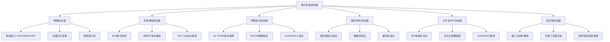
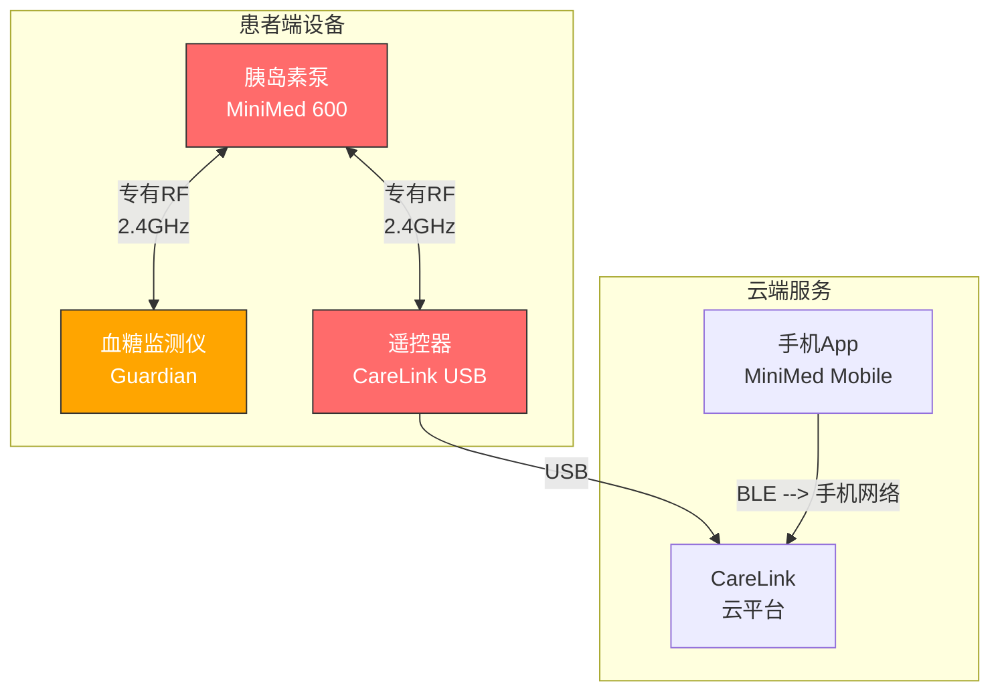
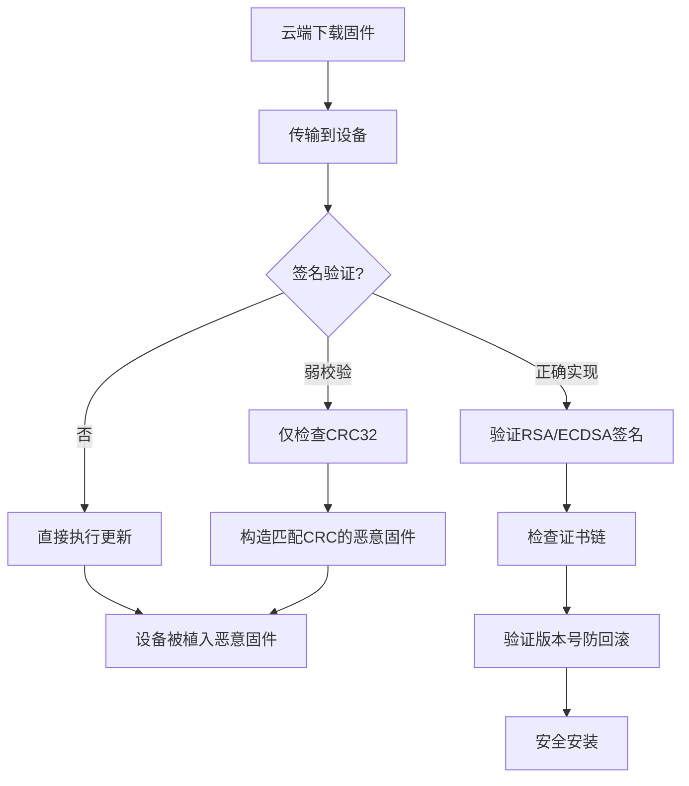
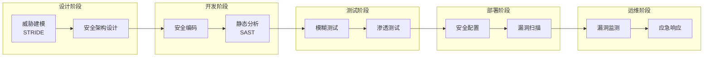

# 22.4 医疗设备安全漏洞分析

医疗设备是物联网安全领域中最敏感、最高风险的垂直领域。一个被攻破的工业传感器可能造成财产损失，但一个被攻破的心脏起搏器或胰岛素泵直接威胁患者生命。本章从攻击者视角出发，深入分析真实世界中的医疗设备安全漏洞，剖析攻击原理与技术细节，并给出系统化的防御策略。

## 医疗设备安全的特殊性

### 为什么医疗设备是高价值攻击目标

医疗设备与普通IoT设备存在本质区别：

| 维度 | 普通IoT设备 | 医疗设备 |
|------|------------|---------|
| 生命周期 | 3-5年（消费电子） | 10-20年（FDA审批周期长） |
| 软件更新 | 频繁OTA | 极少更新（需重新认证） |
| 漏洞披露 | 通常无后果 | FDA/EMA可能强制召回 |
| 攻击影响 | 数据泄露、经济损失 | 直接威胁患者生命 |
| 监管程度 | 基本无 | 严格的上市前/后监管 |
| 通信协议 | 标准化（WiFi/BLE） | 大量专有RF协议 |
| 安全测试 | 常规渗透测试 | 需要特殊实验室环境 |

医疗设备的核心矛盾在于：**安全性与可用性的极端对立**。一个心脏起搏器在紧急情况下必须立即响应，没有时间等待用户输入密码；一台MRI设备的软件更新不能在扫描过程中中断。这种设计约束使得传统的安全机制（认证、加密、完整性校验）在医疗场景下变得极为复杂。

### 医疗设备的攻击面分类



## 监管与标准框架

### 全球医疗设备网络安全法规

理解攻击面之后，防御方必须遵循的监管框架决定了安全投入的方向。以下是主要的全球性法规：

**美国FDA网络安全指南（2023年最终版）**

FDA在2023年发布的《Cybersecurity in Medical Devices: Quality System Considerations and Content of Premarket Submissions》是目前最严格的医疗设备网络安全指南：

- **上市前要求**：必须提交软件物料清单（SBOM）、威胁模型、安全测试报告
- **安全架构要求**：支持安全启动（Secure Boot）、固件签名验证、日志审计
- **漏洞管理要求**：建立上市后漏洞监测和披露流程
- **SBOM要求**：必须使用SPDX或CycloneDX格式，包含所有直接和间接依赖

**欧盟MDR网络安全要求**

欧盟医疗器械法规（MDR 2017/745）通过协调标准MDCG 2019-16明确了网络安全要求：

- 必须符合IEC 62443（工业自动化安全标准）
- 需要完整的网络安全风险管理文档（ISO 14971扩展）
- 上市后监测必须包含网络安全事件报告

**IMD RF指南**

国际医疗器械监管论坛（IMDRF）发布的《Principles and Practices for Medical Device Cybersecurity》为全球监管提供了基准框架。

### 关键技术标准

| 标准编号 | 名称 | 聚焦领域 | 核心要求 |
|---------|------|---------|---------|
| IEC 62304 | 医疗器械软件生命周期 | 软件开发过程安全 | 安全分类（A/B/C级） |
| AAMI TIR57 | 医疗设备网络安全风险管理 | 威胁建模与风险评估 | STRIDE威胁建模 |
| UL 2900 | 网络安全可认证标准 | 漏洞测试与评估 | 渗透测试、模糊测试 |
| IEC 62443 | 工业自动化安全 | 网络分段与访问控制 | 安全区域和管道模型 |
| ISO 27001 | 信息安全管理体系 | 组织层面安全管理 | 安全治理与合规 |

## 案例一：Abbott心脏起搏器安全漏洞（2017）

### 背景与事件概述

2017年8月，美国FDA发布安全通告，召回约465,000个Abbott（原St. Jude Medical）心脏起搏器。这是历史上最大规模的医疗设备网络安全召回事件，根本原因是设备固件存在多个可远程利用的安全漏洞。

**事件时间线**：

| 时间 | 事件 |
|------|------|
| 2016-09 | MedSec/投资机构Muddy Waters发布初步安全报告 |
| 2017-01 | FDA发布初步安全通信 |
| 2017-08 | FDA发布召回通知，要求固件更新 |
| 2017-10 | Abbott发布修复固件 |
| 2018-03 | 美国国土安全部ICS-CERT发布技术分析报告 |

### 技术架构分析

Abbott起搏器的通信架构包含以下关键组件：

```mermaid
graph LR
    A[植入式起搏器] -->|专有RF协议<br/>402-405 MHz| B[患者程控仪<br/>Merlin@home]
    B -->|USB/WiFi| C[Merlin.net<br/>云平台]
    C -->|Web API| D[医院医生端<br/>Web门户]
    
    style A fill:#ff6b6b,stroke:#333,color:#fff
    style B fill:#ffa500,stroke:#333,color:#fff
    style C fill:#4ecdc4,stroke:#333,color:#fff
    style D fill:#45b7d1,stroke:#333,color:#fff
```

**关键组件说明**：

- **植入式脉冲发生器（IPG）**：包含RF收发模块、微控制器、电池、电极
- **患者程控仪**：桌面设备，通过USB或WiFi连接到云平台，同时通过RF与IPG通信
- **Merlin.net云平台**：托管患者数据，提供远程监控能力
- **医生门户**：Web应用，用于查看患者数据和修改设备参数

### 漏洞深度分析

#### 漏洞一：硬编码加密密钥（CVE-2017-12716）

**根本原因**：所有同型号起搏器使用相同的AES-128加密密钥进行通信加密。这个密钥在固件中以硬编码方式存储，且在设备之间完全相同。

**攻击原理**：

```python
# 攻击流程伪代码（学术研究参考）
# 注意：以下仅为说明攻击原理，不提供可直接利用的代码

# 1. 从任意一台同型号设备中提取硬编码密钥
# 通过固件逆向或物理提取获得
HARDCODED_KEY = bytes.fromhex("A1B2C3D4E5F6...")  # 示例

# 2. 使用GNU Radio搭建SDR环境
# 频率：402-405 MHz（MICS频段）
# 调制方式：GFSK
# 数据速率：50 kbps

# 3. 嗅探合法通信
# 使用RTL-SDR或HackRF捕获射频信号
# 解调GFSK信号，提取原始数据包

# 4. 使用硬编码密钥解密通信
from Crypto.Cipher import AES
cipher = AES.new(HARDCODED_KEY, AES.MODE_ECB)
decrypted = cipher.decrypt(ciphertext)

# 5. 分析明文消息格式
# 解析起搏器参数：心率阈值、刺激电压、敏感度等
```

**影响**：攻击者使用同一密钥可以解密所有同型号设备的通信，实现完全的信息泄露和命令注入。

#### 漏洞二：固件更新缺乏完整性验证（CVE-2017-12714）

**根本原因**：起搏器的固件更新机制没有实现数字签名验证。攻击者可以构造恶意固件并通过合法的更新通道注入。

**攻击链**：

```plaintext
攻击步骤：
1. 获取合法固件：从患者程控仪或云平台下载
2. 分析固件结构：识别代码段、数据段、校验和
3. 修改固件：植入恶意代码（如修改参数范围、添加后门）
4. 重新计算校验和：绕过基本的CRC校验
5. 利用MITM或程控仪漏洞推送恶意固件
6. 设备接受并执行恶意固件（无签名验证）
```

**技术细节**：

固件映像格式通常包含：
- 头部信息（版本号、设备型号、硬件版本）
- 代码段（ARM Cortex-M指令集）
- 校验和或CRC32（唯一的安全措施）
- 签名区域（存在但未被验证）

#### 漏洞三：未认证RF通信（CVE-2017-12712）

**根本原因**：起搏器与程控仪之间的RF通信缺乏有效的身份认证机制。虽然使用了AES加密，但由于硬编码密钥问题，认证形同虚设。

**协议分析**：

```plaintext
[消息帧结构]
┌──────────┬──────────┬──────────┬──────────┬──────────┐
│ 前导码    │ 同步字   │ 消息长度  │ 命令码   │  数据    │
│ 8 bytes  │ 4 bytes  │ 2 bytes  │ 1 byte   │ 可变长   │
└──────────┴──────────┴──────────┴──────────┴──────────┘

[命令码枚举]
0x01: 心跳/状态查询
0x02: 参数读取响应
0x03: 参数设置命令
0x04: 固件更新数据包
0x05: 设备重置命令
```

### FDA召回与修复措施

Abbott的修复方案：

1. **固件更新**：通过程控仪向患者发送固件更新，加强加密密钥管理
2. **密钥唯一化**：为每台设备生成独立的加密密钥
3. **固件签名**：实施基于RSA-2048的固件签名验证
4. **访问控制**：增加物理接触验证要求

**教训**：医疗设备的安全更新面临独特的挑战——患者必须亲自到医院，由医生通过程控仪完成更新，整个过程需要在设备临时进入"更新模式"时停止治疗功能。

## 案例二：Medtronic胰岛素泵安全研究（2018-2019）

### 背景与影响范围

2019年3月，安全研究公司Sternum披露了Medtronic MiniMed 600系列胰岛素泵的多个安全漏洞。该系列设备被全球数十万I型糖尿病患者使用，漏洞可能导致攻击者远程控制胰岛素输注剂量。

**受影响设备**：
- MiniMed 630G（型号：MMT-1715/1754/1755）
- MiniMed 670G（型号：MMT-1780/1782）

### 通信协议分析

Medtronic胰岛素泵使用专有的2.4GHz RF协议进行设备间通信，协议架构如下：



### 漏洞一：射频通信缺乏认证（CVE-2019-6197）

**技术分析**：

Medtronic的专有RF协议存在严重的认证缺陷：

```plaintext
[合法通信流程]
遥控器 → 胰岛素泵：{命令类型, 参数, 序列号} → 使用共享密钥加密
胰岛素泵 → 遥控器：{响应码, 状态数据} → 使用共享密钥加密

[问题所在]
1. 共享密钥在所有同型号设备间相同
2. 无随机数（nonce）防重放
3. 无消息认证码（MAC）防篡改
4. 序列号可预测
```

**攻击场景重放分析**：

```bash
# 使用SDR设备进行RF嗅探和重放
# 工具需求：RTL-SDR ($25) + GNU Radio

# 步骤1：识别目标设备频率
# Medtronic使用2400-2483.5 MHz ISM频段
# 使用gqrx或gnuradio-companion扫描频段

# 步骤2：捕获合法通信
# 监控遥控器与泵之间的配对和命令交互
# 记录完整的命令消息帧

# 步骤3：协议解码
# 分析消息结构：前导码 → 帧头 → 有效载荷 → CRC
# 识别命令类型和参数编码方式

# 步骤4：重放攻击
# 无需解密，直接重放捕获的命令
# 由于缺乏防重放机制，泵会接受并执行旧命令

# 关键限制：需要物理距离在5-10米范围内
```

### 漏洞二：剂量修改攻击（CVE-2019-6198）

**攻击原理**：

一旦利用RF认证缺陷，攻击者可以构造以下攻击命令：

```plaintext
[恶意命令序列]
1. 查询当前基础率
   命令：0x04 0x00（读取基础率）
   响应：{基础率: 1.2U/h, 时间段: 00:00-24:00}

2. 修改基础率
   命令：0x04 0x01 {新基础率: 25.0U/h, 时间段: 全天}
   效果：胰岛素输注量提升20倍

3. 发送大剂量推注
   命令：0x04 0x02 {剂量: 25U}
   效果：立即注射25单位胰岛素

4. 暂停治疗
   命令：0x04 0x03 {暂停: true}
   效果：完全停止胰岛素输注，导致糖尿病酮症酸中毒
```

**现实攻击可行性评估**：

| 攻击向量 | 难度 | 所需设备 | 物理距离 | 风险等级 |
|---------|------|---------|---------|---------|
| RF重放攻击 | 中等 | RTL-SDR + GNU Radio | 5-10米 | 高 |
| 恶意程控仪 | 高 | 定制硬件 | 物理接触 | 临界 |
| 云平台入侵 | 高 | 无特殊设备 | 远程 | 高 |
| USB固件篡改 | 中等 | USB分析器 | 物理接触 | 高 |

### 漏洞三：固件更新机制缺陷

**分析**：

```plaintext
固件更新流程（不安全版本）：
1. 通过USB连接CareLink Personal设备
2. CareLink从云端下载固件包
3. 固件包通过USB传输到胰岛素泵
4. 泵接受固件并执行更新
5. 无签名验证，无完整性检查，无版本回滚保护

安全隐患：
- 中间人可以替换固件包内容
- 恶意固件可以持久化驻留在设备中
- 无法通过固件更新检测攻击
```

### 协调披露与修复

**Medtronic的响应**：

1. 发布安全通告（2019年3月）
2. 推荐患者禁用远程胰岛素调整功能
3. 发布固件更新加强认证（仅限新设备）
4. 建议患者不要使用二手或来源不明的配件

**局限性**：已植入患者体内的胰岛素泵无法远程更新固件，只能通过更换设备解决。

## 案例三：医院影像设备（DICOM协议漏洞）

### DICOM协议安全问题

DICOM（Digital Imaging and Communications in Medicine）是医疗影像设备的全球标准协议。研究发现，大量医院的DICOM服务暴露在互联网上，且存在严重安全缺陷。

**DICOM协议攻击面**：

```plaintext
DICOM服务端口：
- 104/tcp（DICOM Association）
- 11112/tcp（DICOM TLS）
- 2575/tcp（DICOM Worklist）

攻击向量：
1. 未认证的DICOM C-STORE（存储命令）
   → 向影像服务器注入恶意DICOM文件
   
2. DICOM C-FIND/C-MOVE信息泄露
   → 查询所有患者记录，提取隐私信息
   
3. DICOM C-ECHO侦察
   → 识别活跃的PACS服务器和节点
```

**实际发现（Shodan统计）**：

研究者通过Shodan发现全球超过4,700台DICOM服务器直接暴露在互联网上，其中约35%未启用TLS加密，约20%允许匿名查询患者数据。

### 攻击演示：DICOM元数据注入

```python
# DICOM文件元数据篡改示例（研究用途）
import pydicom

# 读取合法DICOM文件
ds = pydicom.dcmread("legit_scan.dcm")

# 篡改患者元数据（隐私泄露演示）
print(f"患者姓名: {ds.PatientName}")
print(f"患者ID: {ds.PatientID}")
print(f"检查日期: {ds.StudyDate}")
print(f"设备型号: {ds.Modality}")

# 注入恶意DICOM对象（理论上）
# DICOM文件可以嵌入可执行文件作为"私有标签"
# 如果PACS软件不验证内容类型，可能执行恶意代码

# DICOM服务侦察脚本（仅用于授权测试）
from pynetdicom import AE, StoragePresentationContexts
ae = AE()
ae.requested_contexts = StoragePresentationContexts
# 尝试连接目标DICOM服务
assoc = ae.associate("target_pacs_ip", 104)
if assoc.is_established:
    print("[+] DICOM服务已连接，匿名访问成功")
    # 可以执行C-FIND查询患者记录
    assoc.release()
```

## 漏洞分类学：医疗设备常见漏洞类型

### MITRE医疗设备漏洞分类框架

基于对CVE数据库中2015-2024年医疗设备漏洞的统计分析：

| 漏洞类型 | 占比 | 典型CVE编号 | 危害等级 |
|---------|------|------------|---------|
| 硬编码凭证/密钥 | 23% | CVE-2019-6197 | 高 |
| 固件更新缺乏验证 | 19% | CVE-2017-12714 | 高 |
| 通信未加密 | 16% | CVE-2019-6197 | 中-高 |
| 缓冲区溢出/内存损坏 | 14% | CVE-2018-5450 | 临界 |
| 跨站脚本/SQL注入 | 11% | CVE-2019-10962 | 中 |
| 权限提升 | 9% | CVE-2020-7388 | 高 |
| 路径遍历/任意文件读取 | 5% | CVE-2020-12018 | 中 |
| 其他 | 3% | — | 多样 |

### 各类漏洞技术深度

#### 硬编码凭证分析

```plaintext
[常见硬编码内容]
1. 加密密钥（AES/DES密钥写死在固件中）
2. API密钥（与云平台通信的固定密钥）
3. 调试账户（维护用后门账号）
4. 默认密码（从未强制修改的初始密码）

[检测方法]
# 使用firmwalker快速扫描固件中的敏感字符串
./firmwalker.sh firmware_extracted/

# 关键搜索模式：
# - 密码相关：password, passwd, secret, key, credential
# - 私钥相关：BEGIN RSA PRIVATE KEY, BEGIN EC PRIVATE KEY
# - 网络相关：api_key, auth_token, bearer
# - 调试相关：admin, root, debug, maintenance
```

#### 固件更新机制分析

**不安全的固件更新模式**：



#### 无线通信协议漏洞

**BLE（低功耗蓝牙）常见问题**：

```plaintext
1. 无配对保护（Just Works模式）
   - 任何设备都可以连接
   - 无中间人攻击防护
   
2. 弱密钥协商
   - 使用静态密钥而非ECDH
   - 密钥可被暴力破解
   
3. 未加密特征值
   - 敏感数据以明文广播
   - 可被被动嗅探

4. 服务发现信息泄露
   - GATT服务UUID暴露设备类型
   - 可用于目标识别
```

## 防御策略与最佳实践

### 医疗设备安全开发生命周期



### 关键防御措施

#### 1. 通信安全

```plaintext
[传输层保护]
- 实施TLS 1.3或DTLS（适用于实时通信）
- 使用前向保密（PFS）会话密钥
- 禁用弱密码套件（RC4, DES, 3DES）

[应用层保护]
- 实施HMAC或AES-GCM消息认证
- 使用随机数（nonce）防重放攻击
- 实施消息序列号验证

[密钥管理]
- 使用设备唯一密钥（禁止硬编码）
- 支持密钥轮换机制
- 使用硬件安全模块（HSM）或安全单元
```

#### 2. 固件安全

```plaintext
[签名与验证]
- 使用RSA-2048或ECDSA-P256进行固件签名
- 实施安全启动链（Secure Boot Chain）
- 验证完整的证书链，包括根CA

[安全更新]
- 支持增量更新减少传输风险
- 实施A/B分区确保更新失败可回滚
- 记录更新日志用于取证分析

[完整性保护]
- 使用TPM或安全单元存储度量值
- 实施运行时完整性检查
- 检测内存篡改攻击
```

#### 3. 访问控制

```plaintext
[认证机制]
- 实施多因素认证（MFA）用于敏感操作
- 支持基于角色的访问控制（RBAC）
- 紧急情况下支持绕过认证的后门（需物理接触）

[授权管理]
- 最小权限原则
- 操作日志审计
- 敏感操作需要医生双重确认
```

#### 4. 上市后漏洞管理

```plaintext
[监测体系]
- 持续监控CVE数据库和安全通告
- 建立赏金计划鼓励安全研究
- 与CERT/CC建立协调披露流程

[响应流程]
- 漏洞评估（CVSS评分 + 临床风险）
- 补丁开发与验证（通过监管审批）
- 患者通知与设备召回决策
- 向FDA提交上市后安全报告
```

## 工具与资源

### 医疗设备安全测试工具

| 工具名称 | 用途 | 类型 | 获取方式 |
|---------|------|------|---------|
| Binwalk | 固件提取与分析 | 命令行 | pip install binwalk |
| Ghidra | 二进制逆向分析 | GUI | ghidra-sre.org（免费） |
| Radare2 | 轻量级逆向工具 | 命令行 | rizin项目 |
| Firmwalker | 固件敏感信息扫描 | 脚本 | GitHub开源 |
| GNU Radio | 射频信号分析 | GUI/脚本 | gnuradio.org |
| HackRF One | SDR硬件平台 | 硬件 | 150-300美元 |
| Burp Suite | Web/API渗透测试 | GUI | PortSwigger |
| DICOM Anonymizer | DICOM文件分析 | 脚本 | pydicom库 |

### 学习资源

- **MITRE Medical Device Cybersecurity**：https://www.mitre.org/focus-areas/medical-device-cybersecurity
- **FDA Cybersecurity Resources**：https://www.fda.gov/medical-devices/digital-health-center-excellence/cybersecurity
- **OWASP IoT Security Guidelines**：https://owasp.org/www-project-internet-of-things/
- **CISA Medical Device Advisories**：https://www.cisa.gov/news-events/medical-device-security

## 法律与伦理边界

### 负责任的安全研究原则

```plaintext
1. 始终获得书面授权（包括设备所有者和制造商）
2. 在隔离环境中进行测试，不连接真实患者
3. 遵循协调披露流程（通常90天窗口期）
4. 不公开可直接利用的漏洞代码（PoC应脱敏）
5. 与监管机构（FDA/CISA）合作报告严重漏洞
6. 尊重患者隐私，不访问真实医疗数据
```

### 法律风险提示

医疗设备安全研究涉及严格的法律边界：
- 美国：DMCA豁免条款允许安全研究，但有严格限制
- 欧盟：网络安全法案（NIS2）要求72小时内报告严重漏洞
- 中国：《网络安全法》《医疗器械监督管理条例》双重约束

**免责声明**：本章内容仅用于授权安全研究和教育目的。未经授权的医疗设备攻击属于严重刑事犯罪，可能导致人员伤亡和法律后果。

## 总结

医疗设备安全是网络安全领域中最具挑战性、也最具社会价值的分支。从Abbott心脏起搏器的硬编码密钥，到Medtronic胰岛素泵的RF重放攻击，再到DICOM协议的互联网暴露，每一个案例都揭示了安全设计缺陷可能带来的严重后果。

防御医疗设备安全威胁需要**多层次、全生命周期**的安全策略：从设计阶段的威胁建模，到开发阶段的安全编码，再到上市后的持续漏洞监测。监管机构（FDA、EMA）的法规推动正在加速整个行业的安全改进，但真正有效的安全仍然依赖于制造商、安全研究者和医疗从业者之间的协作。
